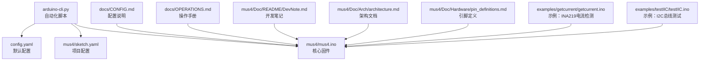
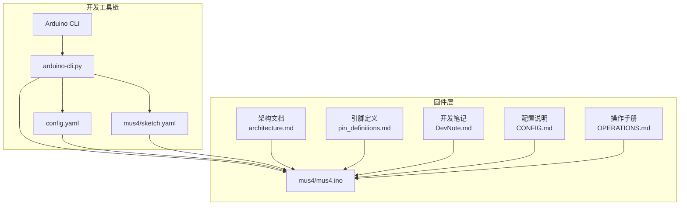
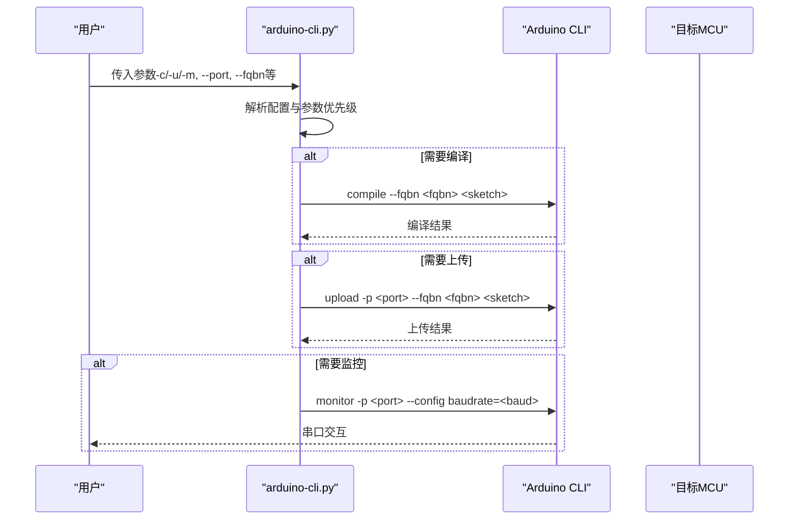
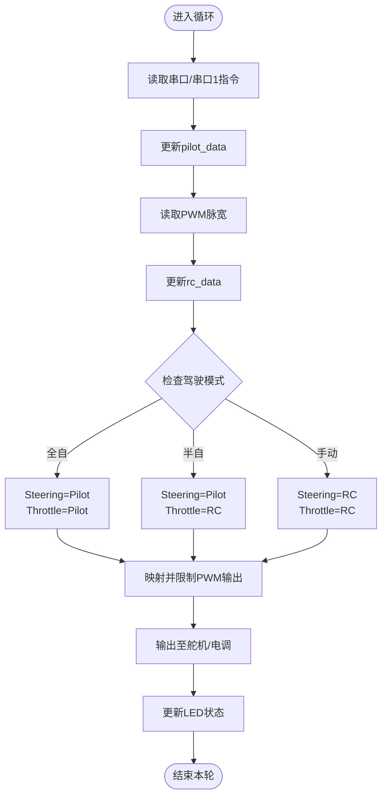
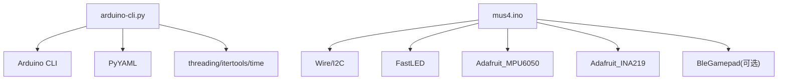

# 开发工具与配置

<cite>
**本文引用的文件**
- [arduino-cli.py](file://arduino-cli.py)
- [config.yaml](file://config.yaml)
- [mus4/sketch.yaml](file://mus4/sketch.yaml)
- [mus4/mus4.ino](file://mus4/mus4.ino)
- [mus4/Doc/README/DevNote.md](file://mus4/Doc/README/DevNote.md)
- [mus4/Doc/Arch/architecture.md](file://mus4/Doc/Arch/architecture.md)
- [mus4/Doc/Hardware/pin_definitions.md](file://mus4/Doc/Hardware/pin_definitions.md)
- [docs/CONFIG.md](file://docs/CONFIG.md)
- [docs/OPERATIONS.md](file://docs/OPERATIONS.md)
- [examples/getcurrent/getcurrent.ino](file://examples/getcurrent/getcurrent.ino)
- [examples/testIIC/testIIC.ino](file://examples/testIIC/testIIC.ino)
</cite>

## 目录
1. [简介](#简介)
2. [项目结构](#项目结构)
3. [核心组件](#核心组件)
4. [架构总览](#架构总览)
5. [详细组件分析](#详细组件分析)
6. [依赖分析](#依赖分析)
7. [性能考虑](#性能考虑)
8. [故障排查指南](#故障排查指南)
9. [结论](#结论)
10. [附录](#附录)

## 简介
本文件面向MUS4项目的开发者，系统化梳理开发工具与配置，重点覆盖：
- Arduino CLI自动化脚本的使用方法与工作流（编译、上传、串口监控）
- config.yaml配置文件参数详解（串口端口、FQBN板型、波特率等）
- sketch.yaml在Arduino项目中的作用与自定义方式
- 开发环境最佳实践、调试技巧与性能优化建议
- 版本管理、构建自动化与持续集成的落地指导

## 项目结构
MUS4项目采用“顶层脚本 + 配置 + 核心Sketch”的组织方式，便于跨平台自动化与团队协作。

图表来源
- [arduino-cli.py](file://arduino-cli.py#L1-L315)
- [config.yaml](file://config.yaml#L1-L13)
- [mus4/sketch.yaml](file://mus4/sketch.yaml#L1-L3)
- [mus4/mus4.ino](file://mus4/mus4.ino#L1-L1290)
- [docs/CONFIG.md](file://docs/CONFIG.md#L1-L24)
- [docs/OPERATIONS.md](file://docs/OPERATIONS.md#L1-L21)
- [mus4/Doc/README/DevNote.md](file://mus4/Doc/README/DevNote.md#L1-L122)
- [mus4/Doc/Arch/architecture.md](file://mus4/Doc/Arch/architecture.md#L1-L245)
- [mus4/Doc/Hardware/pin_definitions.md](file://mus4/Doc/Hardware/pin_definitions.md#L1-L225)
- [examples/getcurrent/getcurrent.ino](file://examples/getcurrent/getcurrent.ino#L1-L55)
- [examples/testIIC/testIIC.ino](file://examples/testIIC/testIIC.ino#L1-L613)

章节来源
- [arduino-cli.py](file://arduino-cli.py#L1-L315)
- [config.yaml](file://config.yaml#L1-L13)
- [mus4/sketch.yaml](file://mus4/sketch.yaml#L1-L3)
- [mus4/mus4.ino](file://mus4/mus4.ino#L1-L1290)

## 核心组件
- 自动化脚本：封装Arduino CLI命令，提供编译、上传、串口监控一体化流程，支持参数优先级与日志配置。
- 配置文件：集中管理默认FQBN、端口、波特率、Sketch路径、日志路径等。
- 项目配置：sketch.yaml用于定义默认FQBN与默认串口，便于不同平台快速适配。
- 核心固件：包含RC信号采集、上位机串口协议、控制逻辑、LED状态指示、I2C传感器、BLE手柄模式等。

章节来源
- [arduino-cli.py](file://arduino-cli.py#L92-L315)
- [config.yaml](file://config.yaml#L1-L13)
- [mus4/sketch.yaml](file://mus4/sketch.yaml#L1-L3)
- [mus4/mus4.ino](file://mus4/mus4.ino#L1-L1290)

## 架构总览
下图展示自动化脚本、配置与固件之间的交互关系，以及核心运行逻辑。

图表来源
- [arduino-cli.py](file://arduino-cli.py#L92-L315)
- [config.yaml](file://config.yaml#L1-L13)
- [mus4/sketch.yaml](file://mus4/sketch.yaml#L1-L3)
- [mus4/mus4.ino](file://mus4/mus4.ino#L1-L1290)
- [mus4/Doc/Arch/architecture.md](file://mus4/Doc/Arch/architecture.md#L1-L245)
- [mus4/Doc/Hardware/pin_definitions.md](file://mus4/Doc/Hardware/pin_definitions.md#L1-L225)
- [mus4/Doc/README/DevNote.md](file://mus4/Doc/README/DevNote.md#L1-L122)
- [docs/CONFIG.md](file://docs/CONFIG.md#L1-L24)
- [docs/OPERATIONS.md](file://docs/OPERATIONS.md#L1-L21)

## 详细组件分析

### Arduino CLI自动化脚本
- 功能职责
  - 参数解析与优先级：命令行参数 > 配置文件 > 默认值
  - 环境校验：检测Arduino CLI可执行文件与Sketch文件是否存在
  - 命令执行：封装compile/upload/monitor子流程，支持超时与错误处理
  - 日志与进度：彩色控制台输出、文件日志、加载动画
- 关键流程
  - 编译：调用Arduino CLI compile --fqbn <fqbn> <sketch>
  - 上传：调用Arduino CLI upload -p <port> --fqbn <fqbn> <sketch>
  - 监控：调用Arduino CLI monitor -p <port> --config baudrate=<baud>
- 使用建议
  - Windows平台建议使用COM端口，Linux/macOS使用/dev/tty*端口
  - 串口监控前建议先执行上传，避免端口占用

图表来源
- [arduino-cli.py](file://arduino-cli.py#L197-L271)

章节来源
- [arduino-cli.py](file://arduino-cli.py#L92-L315)

### config.yaml配置文件
- 默认参数
  - arduino_cli：Arduino CLI可执行文件名或路径
  - fqbn：目标板型定义（FQBN）
  - port：串口端口（Windows示例为COM9）
  - baudrate：串口波特率
  - sketch_path：Sketch文件相对路径
  - build_path：构建产物目录
- 日志配置
  - logging.file：日志文件路径
  - logging.level：日志级别（DEBUG/INFO/WARN/ERROR）

章节来源
- [config.yaml](file://config.yaml#L1-L13)

### sketch.yaml项目配置
- 作用
  - 定义Arduino项目默认FQBN与默认串口端口，便于不同平台快速适配
- 自定义方法
  - 在项目根目录或Arduino配置目录放置sketch.yaml
  - 设置default_fqbn与default_port字段
  - 与config.yaml配合，实现跨平台默认值覆盖

章节来源
- [mus4/sketch.yaml](file://mus4/sketch.yaml#L1-L3)

### 核心固件（mus4.ino）
- 功能要点
  - RC信号采集与中断处理
  - 上位机串口协议解析与校验
  - 控制逻辑与模式切换（手动/半自动/全自）
  - 执行输出（舵机/电调PWM）、LED状态指示
  - 传感器（INA219/MPU6050）与I2C总线
  - 可选BLE手柄模式
- 串口协议
  - 基本帧：T:S\n（-100~100）
  - 可选校验帧：payload*CS\n（ASCII求和低8位，两位十六进制）
  - 应答：ACK/NACK
- 调试与测试
  - 支持TEST/BENCH/STRESS/REGRESS等命令
  - 降级模式：传感器无效、UI耗时>150ms、串口拥塞时自动降级

图表来源
- [mus4/mus4.ino](file://mus4/mus4.ino#L588-L684)
- [mus4/Doc/Arch/architecture.md](file://mus4/Doc/Arch/architecture.md#L72-L107)

章节来源
- [mus4/mus4.ino](file://mus4/mus4.ino#L1-L1290)
- [docs/CONFIG.md](file://docs/CONFIG.md#L1-L24)
- [docs/OPERATIONS.md](file://docs/OPERATIONS.md#L1-L21)
- [mus4/Doc/README/DevNote.md](file://mus4/Doc/README/DevNote.md#L1-L122)

### 示例工程与验证
- getcurrent.ino：验证INA219电流/功率读取
- testIIC.ino：I2C总线初始化、设备扫描、MPU6050读取与压力测试

章节来源
- [examples/getcurrent/getcurrent.ino](file://examples/getcurrent/getcurrent.ino#L1-L55)
- [examples/testIIC/testIIC.ino](file://examples/testIIC/testIIC.ino#L1-L613)

## 依赖分析
- 脚本依赖
  - Python标准库：argparse、subprocess、yaml、threading、itertools、time、platform、os、sys
  - 外部工具：Arduino CLI（需安装并加入PATH）
- 固件依赖
  - Wire（I2C）、FastLED（LED）、Adafruit_MPU6050/Adafruit_INA219（传感器）
  - 可选：BleGamepad（BLE手柄模式）

图表来源
- [arduino-cli.py](file://arduino-cli.py#L1-L15)
- [mus4/mus4.ino](file://mus4/mus4.ino#L24-L34)

章节来源
- [arduino-cli.py](file://arduino-cli.py#L1-L15)
- [mus4/mus4.ino](file://mus4/mus4.ino#L24-L34)

## 性能考虑
- UI刷新自适应：100–500ms动态调整，传感器TTL 1000ms，仅变化时刷新
- 串口回写拥塞检测：触发后自动降级，关闭波形、降低刷新频率
- 中断处理：RC输入使用ISR精确测量脉宽，避免阻塞主循环
- PWM映射：限制在安全范围内（PWM_MIN~PWM_MAX），防止越界
- 传感器异常不阻塞主循环：降级模式下保留核心控制与状态输出

章节来源
- [docs/CONFIG.md](file://docs/CONFIG.md#L1-L24)
- [mus4/mus4.ino](file://mus4/mus4.ino#L109-L136)
- [mus4/Doc/README/DevNote.md](file://mus4/Doc/README/DevNote.md#L82-L101)

## 故障排查指南
- 环境问题
  - Arduino CLI不可用：确认已安装并加入PATH，或在config.yaml中指定完整路径
  - Sketch文件缺失：确认sketch_path指向正确文件
- 串口问题
  - 端口不存在：Windows使用COM端口，Linux/macOS使用/dev/tty*
  - 波特率不匹配：确保与config.yaml一致（默认115200）
- 上传失败
  - 端口被占用：关闭串口监视器或切换端口
  - FQBN不匹配：核对config.yaml中的fqbn与目标板型一致
- 监控异常
  - 权限不足（Linux）：使用sudo或udev规则赋予访问权限
  - 交互中断：Ctrl+C优雅退出

章节来源
- [arduino-cli.py](file://arduino-cli.py#L125-L137)
- [config.yaml](file://config.yaml#L1-L13)
- [docs/OPERATIONS.md](file://docs/OPERATIONS.md#L1-L21)

## 结论
通过arduino-cli.py与config.yaml/sketch.yaml的组合，MUS4项目实现了跨平台、可配置、可自动化的开发与部署流程。结合固件侧的协议设计、降级机制与性能优化策略，开发者可在保证稳定性的同时提升迭代效率。建议在团队内统一配置模板与CI流水线，进一步强化版本管理与持续集成。

## 附录

### 开发环境最佳实践
- 使用虚拟环境隔离Python依赖，确保脚本可移植
- 在config.yaml中维护平台差异（端口、FQBN、波特率）
- 通过sketch.yaml提供默认FQBN与端口，减少手工配置
- 使用示例工程（getcurrent、testIIC）进行硬件验证

章节来源
- [mus4/Doc/README/DevNote.md](file://mus4/Doc/README/DevNote.md#L1-L122)
- [examples/getcurrent/getcurrent.ino](file://examples/getcurrent/getcurrent.ino#L1-L55)
- [examples/testIIC/testIIC.ino](file://examples/testIIC/testIIC.ino#L1-L613)

### 调试技巧
- 使用TEST/BENCH/STRESS/REGRESS命令进行功能与性能验证
- 串口回写ACK/NACK便于确认帧解析正确性
- 降级模式下关注“DEGRADED MODE ACTIVE”提示，定位瓶颈

章节来源
- [docs/OPERATIONS.md](file://docs/OPERATIONS.md#L1-L21)
- [docs/CONFIG.md](file://docs/CONFIG.md#L1-L24)

### 性能优化建议
- 合理设置UI刷新间隔与传感器TTL，避免频繁IO
- 严格限制PWM输出范围，防止越界导致不稳定
- I2C总线使用合适速度（默认100kHz），必要时进行压力测试

章节来源
- [mus4/Doc/Arch/architecture.md](file://mus4/Doc/Arch/architecture.md#L1-L245)
- [examples/testIIC/testIIC.ino](file://examples/testIIC/testIIC.ino#L1-L613)

### 版本管理、构建自动化与持续集成
- 版本管理：以Git为主，使用标签标记发布版本；在README中记录版本与更新日期
- 构建自动化：将arduino-cli.py纳入Makefile/CI脚本，统一编译、上传、测试流程
- 持续集成：在CI中固定Arduino CLI版本与FQBN，使用示例工程进行回归测试

章节来源
- [mus4/Doc/Arch/architecture.md](file://mus4/Doc/Arch/architecture.md#L1-L245)
- [docs/OPERATIONS.md](file://docs/OPERATIONS.md#L1-L21)