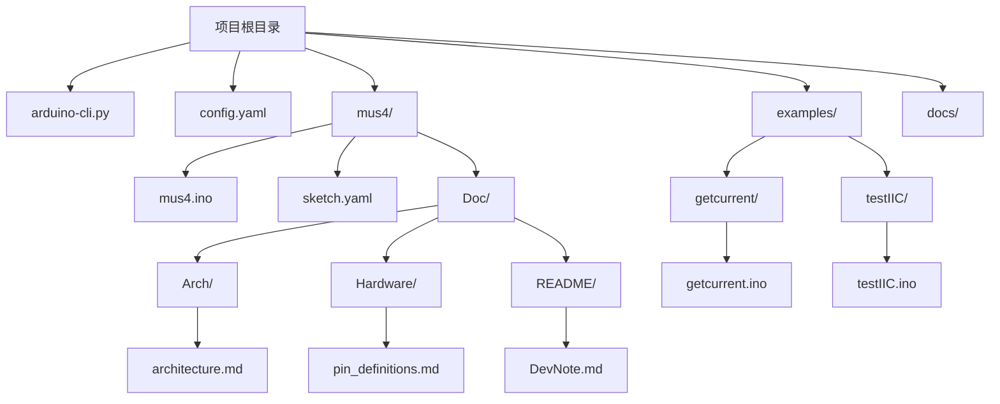
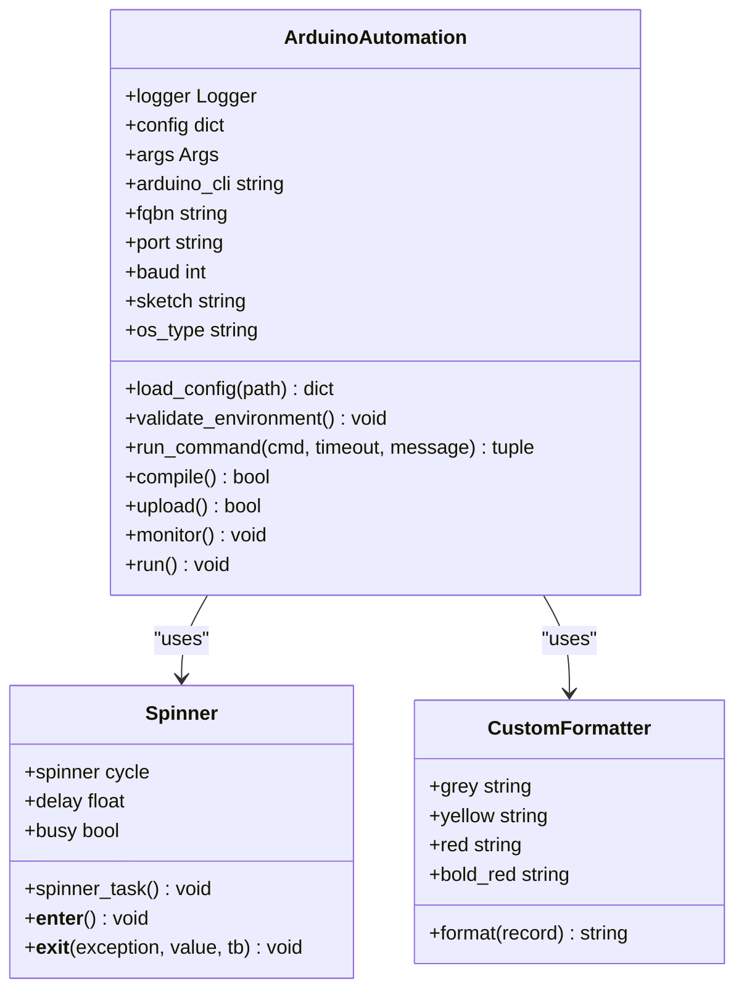
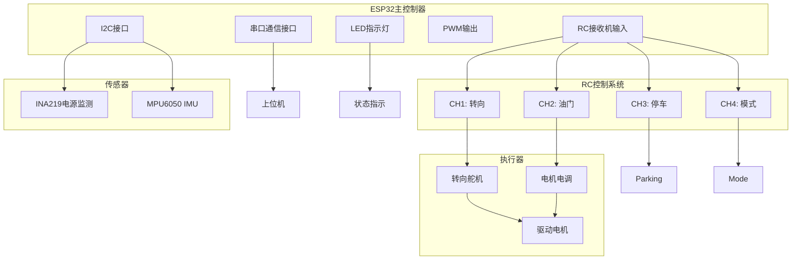
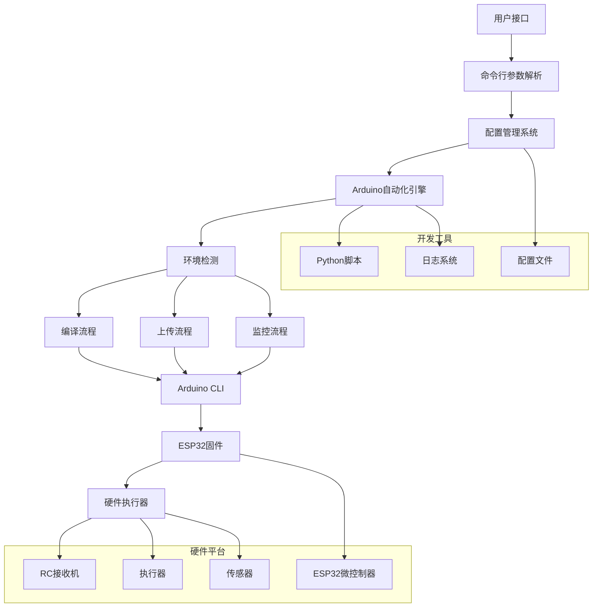
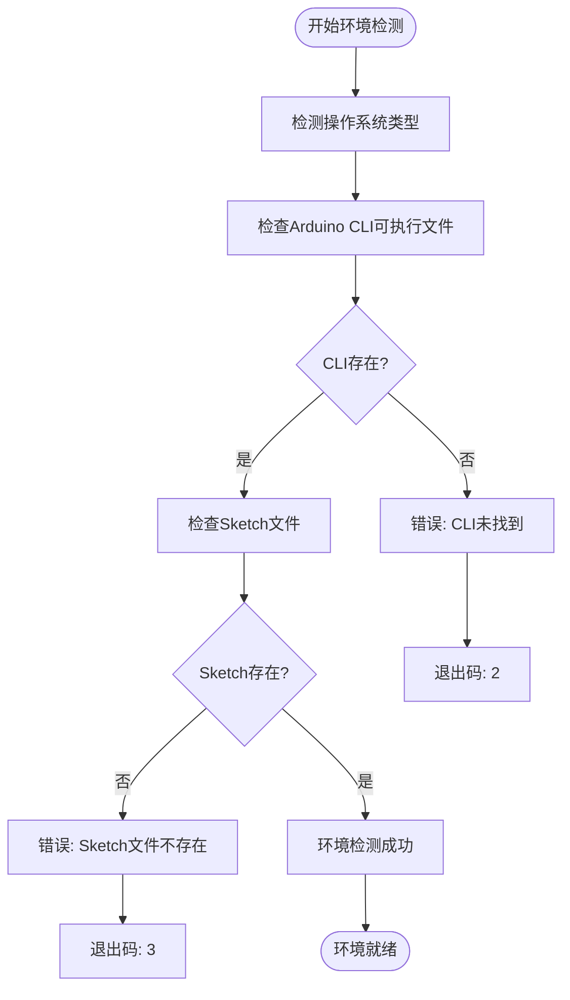
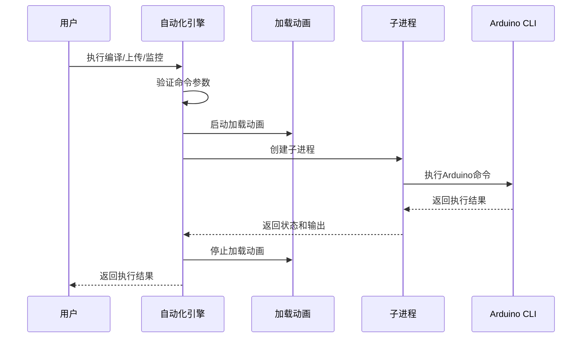
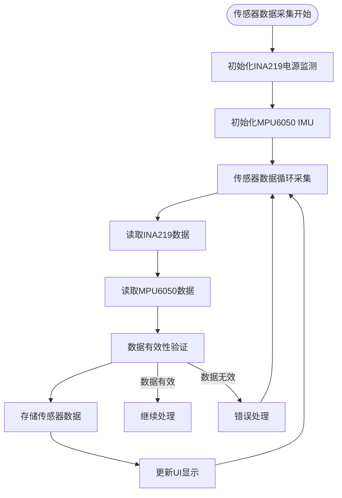
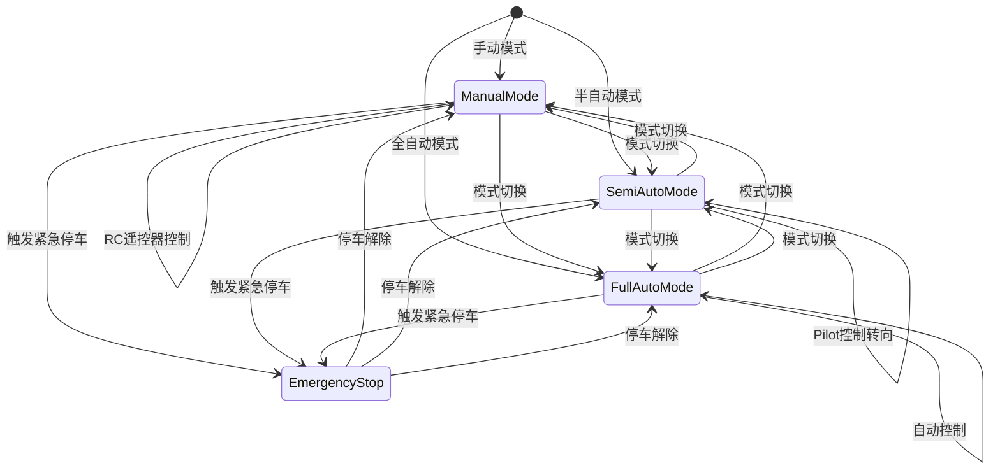
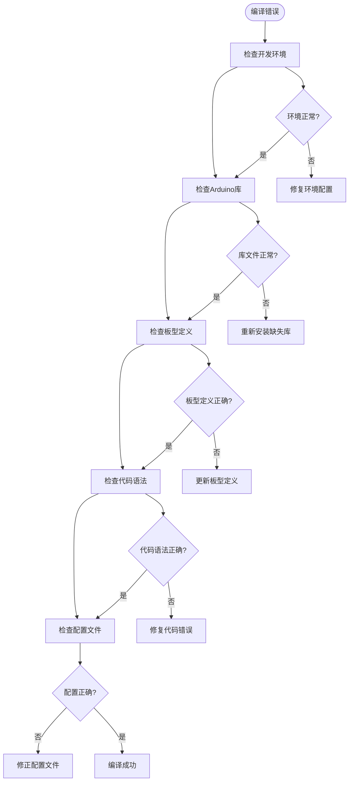
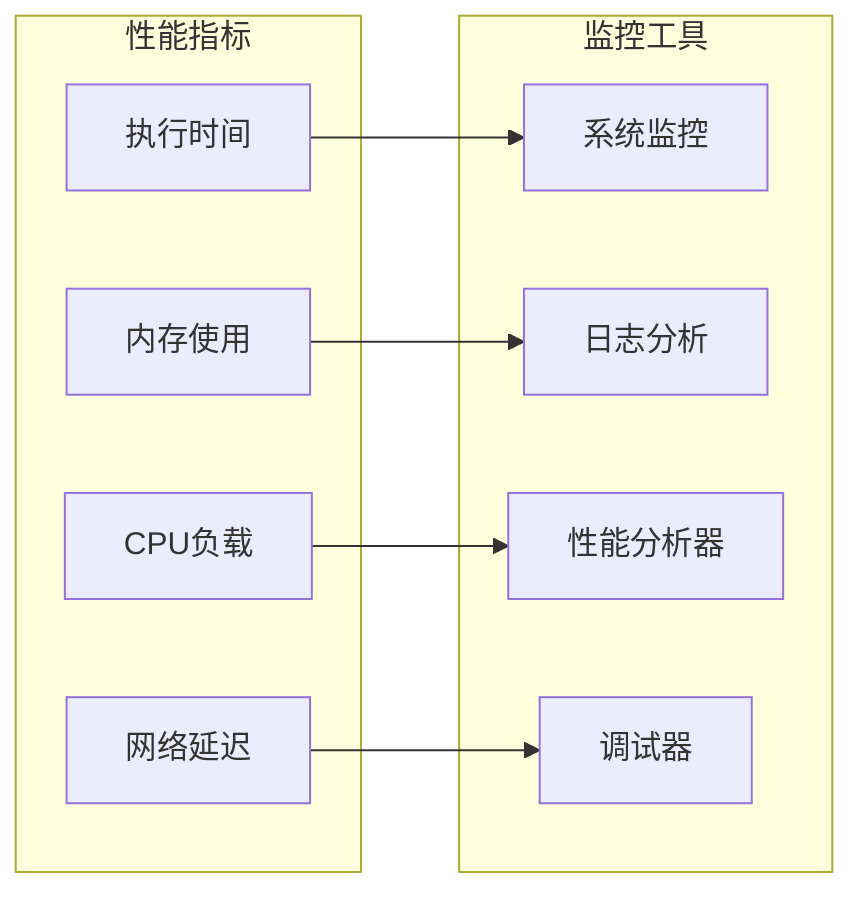

# Arduino CLI自动化

<cite>
**本文档引用的文件**
- [arduino-cli.py](file://arduino-cli.py)
- [config.yaml](file://config.yaml)
- [mus4.ino](file://mus4/mus4.ino)
- [sketch.yaml](file://mus4/sketch.yaml)
- [DevNote.md](file://mus4/Doc/README/DevNote.md)
- [pin_definitions.md](file://mus4/Doc/Hardware/pin_definitions.md)
- [getcurrent.ino](file://examples/getcurrent/getcurrent.ino)
- [testIIC.ino](file://examples/testIIC/testIIC.ino)
</cite>

## 目录
1. [简介](#简介)
2. [项目结构](#项目结构)
3. [核心组件](#核心组件)
4. [架构概览](#架构概览)
5. [详细组件分析](#详细组件分析)
6. [依赖关系分析](#依赖关系分析)
7. [性能考虑](#性能考虑)
8. [故障排除指南](#故障排除指南)
9. [结论](#结论)

## 简介

Arduino CLI自动化是一个完整的嵌入式系统开发工具链，专为ESP32微控制器项目设计。该项目提供了从代码编译、固件上传到串口监控的一站式解决方案，特别针对LP-MU-S4自动驾驶小车控制系统进行了优化。

该系统的核心目标是简化Arduino项目的开发流程，通过Python脚本自动化整个构建过程，包括环境检测、编译配置、固件上传和实时监控等功能。项目采用模块化设计，支持跨平台运行（Windows、Linux、macOS），并提供了丰富的配置选项和错误处理机制。

## 项目结构

项目采用清晰的层次化组织结构，主要包含以下几个核心部分：



**图表来源**
- [arduino-cli.py](file://arduino-cli.py#L1-L315)
- [config.yaml](file://config.yaml#L1-L13)

**章节来源**
- [arduino-cli.py](file://arduino-cli.py#L1-L315)
- [config.yaml](file://config.yaml#L1-L13)

## 核心组件

### Arduino自动化引擎

Arduino自动化引擎是整个系统的核心，负责协调所有Arduino CLI操作。它提供了完整的生命周期管理，从环境检测到最终的串口监控。

#### 主要特性
- **智能参数解析**：支持命令行参数、配置文件和默认值的多层优先级
- **跨平台兼容**：自动检测操作系统并调整行为
- **进度可视化**：提供加载动画和详细的状态反馈
- **错误处理**：全面的异常捕获和用户友好的错误信息

#### 关键功能模块



**图表来源**
- [arduino-cli.py](file://arduino-cli.py#L92-L315)

**章节来源**
- [arduino-cli.py](file://arduino-cli.py#L92-L315)

### 配置管理系统

配置管理系统提供了灵活的参数管理机制，支持多种配置方式的组合使用。

#### 配置层次结构
1. **命令行参数**：最高优先级，直接覆盖其他配置
2. **配置文件**：yaml格式，支持复杂的嵌套结构
3. **默认值**：系统内置的默认配置

#### 配置文件结构

| 配置项 | 类型 | 描述 | 默认值 |
|--------|------|------|--------|
| arduino_cli | string | Arduino CLI可执行文件路径 | "arduino-cli" |
| fqbn | string | 板型定义名称 | "esp32:esp32:esp32" |
| port | string | 串口设备路径 | "" |
| baudrate | int | 串口波特率 | 115200 |
| sketch_path | string | Arduino Sketch文件路径 | "mus4/mus4.ino" |
| build_path | string | 构建输出目录 | "build" |

**章节来源**
- [config.yaml](file://config.yaml#L1-L13)

### ESP32固件系统

ESP32固件系统是基于Arduino框架的完整自动驾驶控制程序，集成了多种传感器和执行器控制功能。

#### 硬件架构



**图表来源**
- [mus4.ino](file://mus4/mus4.ino#L1-L1290)
- [pin_definitions.md](file://mus4/Doc/Hardware/pin_definitions.md#L115-L181)

#### 核心功能模块

| 功能模块 | 描述 | 硬件引脚 | 软件实现 |
|----------|------|----------|----------|
| RC接收机输入 | 采集遥控器信号 | GPIO 36,39,34,26 | 中断处理 |
| PWM输出控制 | 控制舵机和电调 | GPIO 23,25 | ledc库 |
| 串口通信 | 上位机数据交换 | GPIO 16,17 | Serial1 |
| 传感器监测 | 电源和IMU数据 | I2C总线 | Wire库 |
| 状态指示 | LED颜色显示 | GPIO 5 | FastLED库 |

**章节来源**
- [mus4.ino](file://mus4/mus4.ino#L1-L1290)
- [pin_definitions.md](file://mus4/Doc/Hardware/pin_definitions.md#L1-L225)

## 架构概览

整个系统采用分层架构设计，从底层的硬件抽象到顶层的应用接口，形成了完整的开发工具链。



**图表来源**
- [arduino-cli.py](file://arduino-cli.py#L273-L315)
- [mus4.ino](file://mus4/mus4.ino#L1104-L1125)

## 详细组件分析

### Arduino自动化引擎详细分析

Arduino自动化引擎是整个系统的核心，实现了完整的Arduino项目生命周期管理。

#### 环境检测机制

环境检测确保系统能够在不同操作系统上正确运行：



**图表来源**
- [arduino-cli.py](file://arduino-cli.py#L125-L137)

#### 命令执行流程

命令执行流程提供了统一的命令处理机制，支持超时控制和进度反馈：



**图表来源**
- [arduino-cli.py](file://arduino-cli.py#L138-L196)

#### 日志系统设计

日志系统提供了多层次的日志记录能力，支持文件和控制台输出：

| 日志级别 | 颜色编码 | 用途 | 示例 |
|----------|----------|------|------|
| DEBUG | 灰色 | 详细调试信息 | 详细命令输出 |
| INFO | 默认 | 一般信息 | 操作状态 |
| WARNING | 黄色 | 警告信息 | 可能的问题 |
| ERROR | 红色 | 错误信息 | 执行失败 |
| CRITICAL | 红色粗体 | 严重错误 | 系统异常 |

**章节来源**
- [arduino-cli.py](file://arduino-cli.py#L17-L56)

### ESP32固件系统详细分析

ESP32固件系统是一个复杂的实时控制系统，集成了多种传感器和执行器的协调控制。

#### 传感器数据处理

固件系统集成了多种传感器数据的采集和处理：



**图表来源**
- [mus4.ino](file://mus4/mus4.ino#L208-L220)

#### 控制算法实现

固件系统实现了多种控制算法，支持不同的驾驶模式：



**图表来源**
- [mus4.ino](file://mus4/mus4.ino#L474-L525)

#### 串口通信协议

固件系统实现了标准化的串口通信协议，支持上位机控制：

| 协议字段 | 格式 | 范围 | 描述 |
|----------|------|------|------|
| Throttle | 整数 | -100到100 | 油门控制值 |
| Steering | 整数 | -100到100 | 转向控制值 |
| 分隔符 | 冒号 | ":" | 字段分隔符 |
| 结束符 | 换行 | "\n" | 消息结束符 |
| 校验和 | 十六进制 | 2位 | 数据完整性校验 |

**章节来源**
- [mus4.ino](file://mus4/mus4.ino#L320-L342)
- [DevNote.md](file://mus4/Doc/README/DevNote.md#L24-L29)

### 示例项目分析

项目包含了多个示例程序，用于演示特定功能的实现。

#### 电流监测示例

getcurrent.ino示例程序展示了如何使用INA219传感器进行电流监测：

```mermaid
sequenceDiagram
participant Setup as 初始化
participant Sensor as INA219传感器
participant Serial as 串口输出
participant Loop as 主循环
Setup->>Sensor : 初始化传感器
Sensor-->>Setup : 返回初始化状态
Setup->>Serial : 输出初始化信息
Loop->>Sensor : 读取电压数据
Sensor-->>Loop : 返回测量值
Loop->>Serial : 输出测量结果
Loop->>Loop : 延时2秒
```

**图表来源**
- [getcurrent.ino](file://examples/getcurrent/getcurrent.ino#L7-L55)

#### I2C通信测试示例

testIIC.ino示例程序提供了完整的I2C总线测试功能：


**图表来源**
- [testIIC.ino](file://examples/testIIC/testIIC.ino#L558-L613)

**章节来源**
- [getcurrent.ino](file://examples/getcurrent/getcurrent.ino#L1-L55)
- [testIIC.ino](file://examples/testIIC/testIIC.ino#L1-L613)

## 依赖关系分析

系统依赖关系复杂且层次分明，从底层的硬件抽象到顶层的应用接口形成了完整的依赖链条。

```mermaid
graph TD
subgraph Runtime[运行时依赖]
A[Python 3.x]
B[Arduino CLI]
C[ESP32开发板]
end
subgraph Libraries[Python库]
D[argparse]
E[subprocess]
F[yaml]
G[logging]
H[threading]
I[time]
J=os
K=platform
end
subgraph ArduinoLibraries[Arduino库]
L[Wire]
M[FastLED]
N[Adafruit_MPU6050]
O[Adafruit_INA219]
P[BleGamepad]
end
subgraph SystemTools[系统工具]
Q[串口监视器]
R[终端]
S[文件系统]
end
A --> D
A --> E
A --> F
A --> G
A --> H
A --> I
A --> J
A --> K
B --> C
L --> M
L --> N
L --> O
L --> P
A --> B
A --> C
A --> Q
A --> R
A --> S
```

**图表来源**
- [arduino-cli.py](file://arduino-cli.py#L4-L15)
- [mus4.ino](file://mus4/mus4.ino#L24-L34)

### 外部依赖管理

系统对外部依赖的管理采用了灵活的策略：

| 依赖类型 | 管理方式 | 版本要求 | 用途 |
|----------|----------|----------|------|
| Python标准库 | 内置 | 3.x | 基础功能 |
| Arduino CLI | 系统安装 | 0.32+ | 编译和上传 |
| ESP32开发板 | 硬件 | 支持DFRobot FireBeetle2 | 目标平台 |
| Arduino库 | 通过CLI管理 | Adafruit库 | 传感器支持 |
| 第三方库 | 通过CLI安装 | BleGamepad库 | 蓝牙功能 |

**章节来源**
- [arduino-cli.py](file://arduino-cli.py#L1-L315)
- [mus4.ino](file://mus4/mus4.ino#L24-L34)

## 性能考虑

系统在设计时充分考虑了性能优化，特别是在实时控制和资源管理方面。

### 内存管理优化

固件系统采用了多种内存管理策略：

1. **静态内存分配**：关键数据结构使用静态分配，避免动态内存碎片
2. **中断处理优化**：RC输入使用ISR处理，减少主循环负担
3. **缓冲区管理**：串口通信使用环形缓冲区，提高数据处理效率

### 实时性能保证

系统通过以下机制确保实时性能：


**图表来源**
- [mus4.ino](file://mus4/mus4.ino#L414-L433)

### 并发处理机制

系统采用了多线程和异步处理机制：

| 处理机制 | 实现方式 | 用途 | 性能影响 |
|----------|----------|------|----------|
| 多线程 | Python threading | 加载动画和命令执行 | 轻量级并发 |
| 异步I/O | subprocess异步 | Arduino命令执行 | 非阻塞操作 |
| 中断处理 | ESP32 ISR | RC信号采集 | 实时响应 |
| 事件驱动 | Python回调 | 用户交互 | 响应式设计 |

**章节来源**
- [arduino-cli.py](file://arduino-cli.py#L58-L91)
- [mus4.ino](file://mus4/mus4.ino#L414-L433)

## 故障排除指南

### 常见问题诊断

#### 环境配置问题

| 问题症状 | 可能原因 | 解决方案 |
|----------|----------|----------|
| CLI命令未找到 | Arduino CLI未安装或PATH未配置 | 安装Arduino CLI并添加到PATH |
| Sketch文件不存在 | 路径配置错误 | 检查config.yaml中的sketch_path |
| 串口权限不足 | Linux/Mac权限问题 | 添加用户到dialout组 |
| 端口不存在 | 硬件连接问题 | 检查USB连接和驱动安装 |

#### 编译错误排查



**图表来源**
- [arduino-cli.py](file://arduino-cli.py#L125-L137)

#### 上传失败处理

上传失败是常见的问题，系统提供了详细的错误诊断：

1. **端口检测**：检查串口设备是否存在
2. **权限验证**：确保有访问串口的权限
3. **波特率匹配**：确认波特率设置正确
4. **硬件连接**：验证USB连接和驱动安装

#### 监控问题解决

串口监控问题的排查步骤：

1. **端口确认**：验证串口设备路径正确
2. **波特率设置**：检查波特率配置
3. **终端兼容性**：确保终端软件兼容
4. **数据流检查**：验证数据传输正常

**章节来源**
- [arduino-cli.py](file://arduino-cli.py#L125-L137)
- [arduino-cli.py](file://arduino-cli.py#L206-L246)

### 调试技巧

#### 日志分析

系统提供了详细的日志记录功能，有助于问题诊断：

1. **日志级别选择**：根据问题严重程度选择合适的日志级别
2. **时间戳分析**：利用时间戳定位问题发生的时间点
3. **错误堆栈跟踪**：查看详细的错误信息和调用栈
4. **性能指标监控**：分析执行时间和资源使用情况

#### 性能监控



**图表来源**
- [arduino-cli.py](file://arduino-cli.py#L167-L170)

## 结论

Arduino CLI自动化系统是一个功能完整、设计合理的嵌入式开发工具链。它成功地将复杂的Arduino项目管理流程简化为几个简单的命令，同时保持了足够的灵活性和可扩展性。

### 主要优势

1. **易用性**：通过简单的命令行接口提供完整的开发流程
2. **跨平台**：支持Windows、Linux和macOS等多种操作系统
3. **模块化设计**：清晰的组件分离便于维护和扩展
4. **完善的错误处理**：全面的异常捕获和用户友好的错误信息
5. **性能优化**：针对实时控制应用进行了专门的性能优化

### 技术特色

1. **智能配置管理**：多层配置优先级确保最佳的用户体验
2. **实时监控**：提供加载动画和详细的状态反馈
3. **硬件抽象**：通过Arduino CLI实现硬件无关的开发体验
4. **传感器集成**：完整的传感器数据处理和显示功能
5. **通信协议**：标准化的串口通信协议支持上位机控制

### 应用前景

该系统不仅适用于LP-MU-S4自动驾驶小车项目，还可以扩展到其他Arduino项目中。其模块化的设计使得添加新的功能和硬件支持变得相对简单，为未来的功能扩展奠定了良好的基础。

通过持续的改进和完善，Arduino CLI自动化系统有望成为嵌入式开发领域的一个重要工具，为开发者提供更加高效和便捷的开发体验。