# Arduino CLI自动化

<cite>
**本文档引用的文件**
- [arduino-cli.py](file://arduino-cli.py)
- [config.yaml](file://config.yaml)
- [mus4.ino](file://mus4/mus4.ino)
- [sketch.yaml](file://mus4/sketch.yaml)
- [DevNote.md](file://mus4/Doc/README/DevNote.md)
- [OPERATIONS.md](file://mus4/Doc/README/OPERATIONS.md)
- [architecture.md](file://mus4/Doc/Arch/architecture.md)
- [pin_definitions.md](file://mus4/Doc/Hardware/pin_definitions.md)
- [build_wsl_fast_manual.md](file://mus4/Doc/Tools/build_wsl_fast_manual.md)
- [getcurrent.ino](file://examples/getcurrent/getcurrent.ino)
- [testIIC.ino](file://examples/testIIC/testIIC.ino)
- [build_wsl_fast.ps1](file://build_wsl_fast.ps1)
</cite>

## 更新摘要
**变更内容**
- 文档目录结构重组织：ArduinoCLI相关文档从Doc/README目录迁移至Doc/Tools目录
- 新增build_wsl_fast_manual.md技术手册，提供WSL高速构建的详细技术说明
- 更新项目结构图以反映新的文档组织方式
- 完善WSL交叉编译场景的技术文档和使用指南

## 目录
1. [简介](#简介)
2. [项目结构](#项目结构)
3. [核心组件](#核心组件)
4. [架构概览](#架构概览)
5. [详细组件分析](#详细组件分析)
6. [依赖关系分析](#依赖关系分析)
7. [性能考虑](#性能考虑)
8. [故障排除指南](#故障排除指南)
9. [命令行参数使用指南](#命令行参数使用指南)
10. [结论](#结论)

## 简介

Arduino CLI自动化是一个完整的嵌入式系统开发工具链，专为ESP32微控制器项目设计。该项目提供了从代码编译、固件上传到串口监控的一站式解决方案，特别针对LP-MU-S4自动驾驶小车控制系统进行了优化。

该系统的核心目标是简化Arduino项目的开发流程，通过Python脚本自动化整个构建过程，包括环境检测、编译配置、固件上传和实时监控等功能。项目采用模块化设计，支持跨平台运行（Windows、Linux、macOS），并提供了丰富的配置选项和错误处理机制。

**更新** 新增了对WSL交叉编译场景的深度支持，包括构建路径管理和预编译固件文件上传功能。文档结构已重新组织，将ArduinoCLI相关技术文档迁移至Doc/Tools目录，提供更清晰的文档分类。

## 项目结构

项目采用清晰的层次化组织结构，主要包含以下几个核心部分：

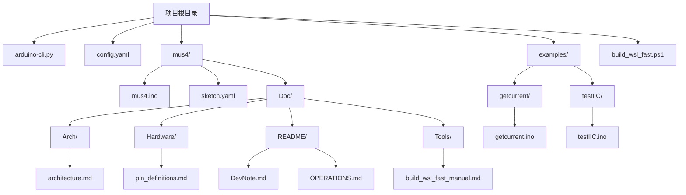

**图表来源**
- [arduino-cli.py:1-511](file://arduino-cli.py#L1-L511)
- [config.yaml:1-21](file://config.yaml#L1-L21)
- [build_wsl_fast.ps1:1-140](file://build_wsl_fast.ps1#L1-L140)

**章节来源**
- [arduino-cli.py:1-511](file://arduino-cli.py#L1-L511)
- [config.yaml:1-21](file://config.yaml#L1-L21)

## 核心组件

### Arduino自动化引擎

Arduino自动化引擎是整个系统的核心，负责协调所有Arduino CLI操作。它提供了完整的生命周期管理，从环境检测到最终的串口监控。

#### 主要特性
- **智能参数解析**：支持命令行参数、配置文件和默认值的多层优先级
- **跨平台兼容**：自动检测操作系统并调整行为
- **进度可视化**：提供加载动画和详细的状态反馈
- **错误处理**：全面的异常捕获和用户友好的错误信息
- **构建路径管理**：支持自定义构建输出目录
- **预编译固件上传**：支持WSL交叉编译场景

#### 关键功能模块

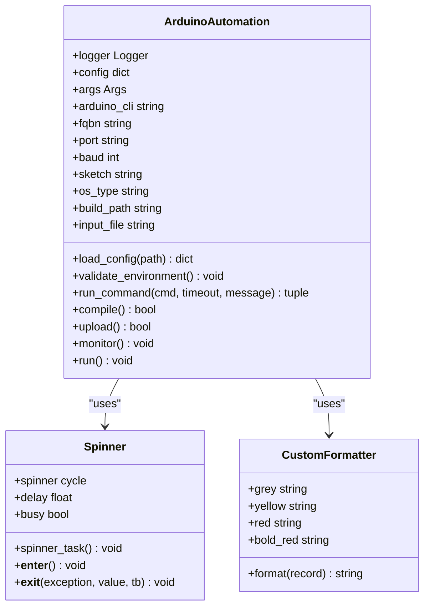

**图表来源**
- [arduino-cli.py:94-511](file://arduino-cli.py#L94-L511)

**章节来源**
- [arduino-cli.py:94-511](file://arduino-cli.py#L94-L511)

### 配置管理系统

配置管理系统提供了灵活的参数管理机制，支持多种配置方式的组合使用。

#### 配置层次结构
1. **命令行参数**：最高优先级，直接覆盖其他配置
2. **配置文件**：yaml格式，支持复杂的嵌套结构
3. **默认值**：系统内置的默认配置

#### 配置文件结构

| 配置项 | 类型 | 描述 | 默认值 |
|--------|------|------|--------|
| arduino_cli | string | Arduino CLI可执行文件路径 | "arduino-cli" |
| fqbn | string | 板型定义名称 | "esp32:esp32:esp32" |
| port | string | 串口设备路径 | "" |
| baudrate | int | 串口波特率 | 115200 |
| sketch_path | string | Arduino Sketch文件路径 | "mus4/mus4.ino" |
| build_path | string | 构建输出目录 | "build" |
| logging.file | string | 日志文件路径 | "mus4/ArduinoCLI.log" |
| logging.level | string | 日志级别 | "INFO" |
| reset.enable | boolean | 自动复位启用 | true |
| reset.delay_ms | int | 复位延迟毫秒 | 200 |
| reset.method | string | 复位方式 | "dtr_rts" |
| reset.boot | string | 复位模式 | "run" |
| reset.toolchain | string | 烧录工具链标识 | "arduino-cli" |

**章节来源**
- [config.yaml:1-21](file://config.yaml#L1-L21)

### ESP32固件系统

ESP32固件系统是基于Arduino框架的完整自动驾驶控制程序，集成了多种传感器和执行器控制功能。

#### 硬件架构

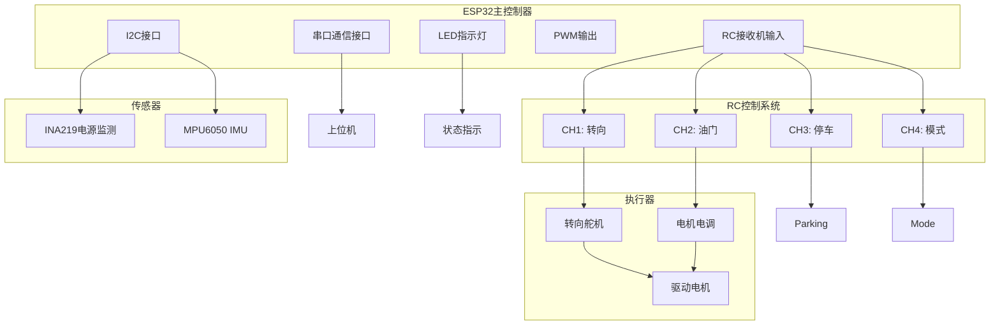

**图表来源**
- [mus4.ino:1-1290](file://mus4/mus4.ino#L1-L1290)
- [pin_definitions.md:115-181](file://mus4/Doc/Hardware/pin_definitions.md#L115-L181)

#### 核心功能模块

| 功能模块 | 描述 | 硬件引脚 | 软件实现 |
|----------|------|----------|----------|
| RC接收机输入 | 采集遥控器信号 | GPIO 36,39,34,26 | 中断处理 |
| PWM输出控制 | 控制舵机和电调 | GPIO 23,25 | ledc库 |
| 串口通信 | 上位机数据交换 | GPIO 16,17 | Serial1 |
| 传感器监测 | 电源和IMU数据 | I2C总线 | Wire库 |
| 状态指示 | LED颜色显示 | GPIO 5 | FastLED库 |

**章节来源**
- [mus4.ino:1-1290](file://mus4/mus4.ino#L1-L1290)
- [pin_definitions.md:1-225](file://mus4/Doc/Hardware/pin_definitions.md#L1-L225)

## 架构概览

整个系统采用分层架构设计，从底层的硬件抽象到顶层的应用接口，形成了完整的开发工具链。

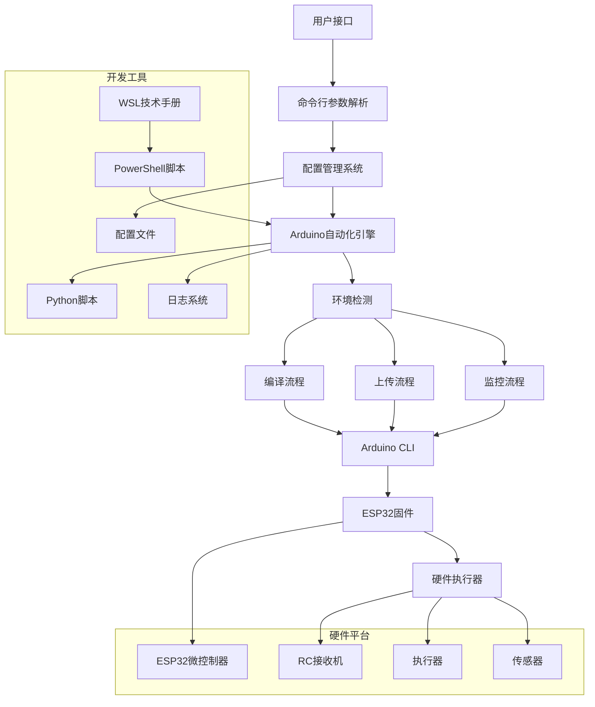

**图表来源**
- [arduino-cli.py:404-511](file://arduino-cli.py#L404-L511)
- [mus4.ino:1104-1125](file://mus4/mus4.ino#L1104-L1125)
- [build_wsl_fast.ps1:1-140](file://build_wsl_fast.ps1#L1-L140)
- [build_wsl_fast_manual.md:1-142](file://mus4/Doc/Tools/build_wsl_fast_manual.md#L1-L142)

## 详细组件分析

### Arduino自动化引擎详细分析

Arduino自动化引擎是整个系统的核心，实现了完整的Arduino项目生命周期管理。

#### 环境检测机制

环境检测确保系统能够在不同操作系统上正确运行：


**图表来源**
- [arduino-cli.py:136-147](file://arduino-cli.py#L136-L147)

#### 命令执行流程

命令执行流程提供了统一的命令处理机制，支持超时控制和进度反馈：

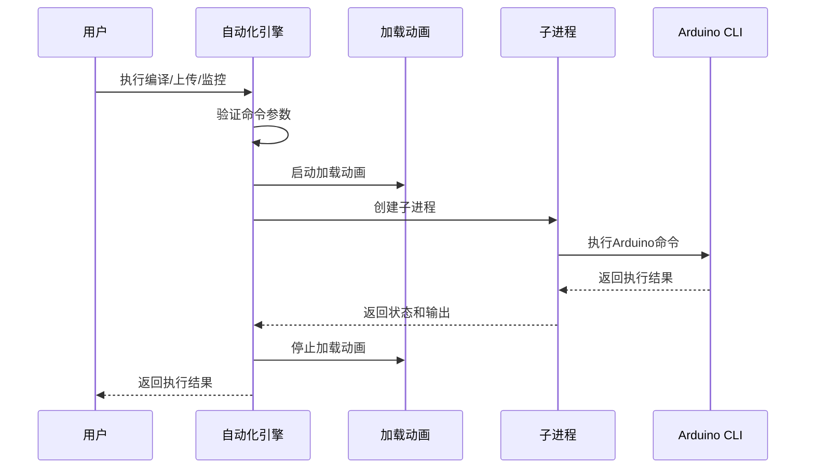

**图表来源**
- [arduino-cli.py:177-234](file://arduino-cli.py#L177-L234)

#### 日志系统设计

日志系统提供了多层次的日志记录能力，支持文件和控制台输出：

| 日志级别 | 颜色编码 | 用途 | 示例 |
|----------|----------|------|------|
| DEBUG | 灰色 | 详细调试信息 | 详细命令输出 |
| INFO | 默认 | 一般信息 | 操作状态 |
| WARNING | 黄色 | 警告信息 | 可能的问题 |
| ERROR | 红色 | 错误信息 | 执行失败 |
| CRITICAL | 红色粗体 | 严重错误 | 系统异常 |

**章节来源**
- [arduino-cli.py:18-58](file://arduino-cli.py#L18-L58)

### 构建路径和输入文件支持

**更新** 系统现在支持自定义构建路径和预编译固件文件上传，特别针对WSL交叉编译场景进行了优化。

#### 构建路径管理

系统支持通过命令行参数或配置文件指定自定义构建输出目录：

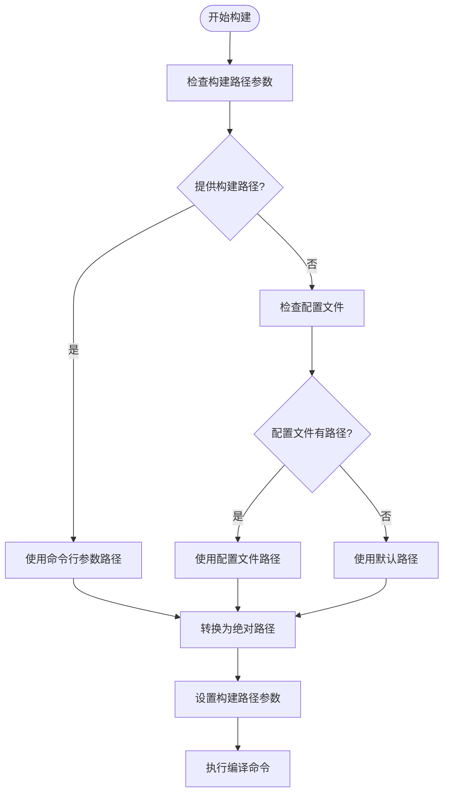

**图表来源**
- [arduino-cli.py:240-254](file://arduino-cli.py#L240-L254)

#### 预编译固件上传

系统支持直接上传预编译的固件文件，适用于WSL交叉编译场景：

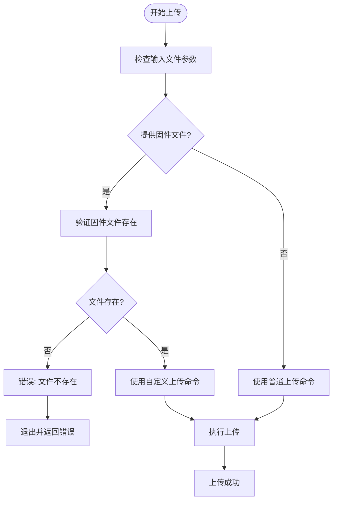

**图表来源**
- [arduino-cli.py:274-286](file://arduino-cli.py#L274-L286)

**章节来源**
- [arduino-cli.py:236-292](file://arduino-cli.py#L236-L292)

### 自动复位和回归测试

系统提供了增强的自动复位功能和回归测试能力：

#### 自动复位机制

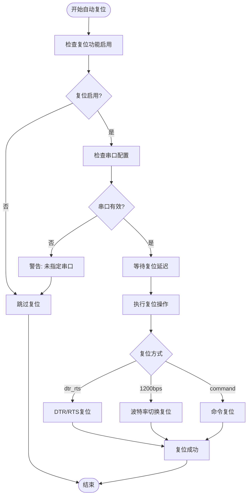

**图表来源**
- [arduino-cli.py:333-359](file://arduino-cli.py#L333-L359)

#### 回归测试功能

系统支持自动复位回归测试，评估复位功能的可靠性：

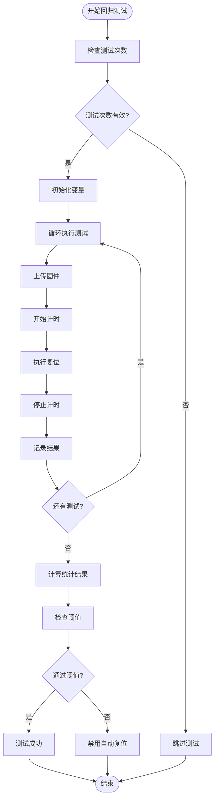

**图表来源**
- [arduino-cli.py:434-456](file://arduino-cli.py#L434-L456)

**章节来源**
- [arduino-cli.py:294-456](file://arduino-cli.py#L294-L456)

### WSL高速构建技术手册

**新增** 项目新增了build_wsl_fast_manual.md技术手册，详细介绍了WSL交叉编译的系统架构和性能优化原理。

#### 系统架构与数据流

WSL高速构建脚本通过将源码同步到WSL原生文件系统进行编译，实现了比直接挂载编译快5倍以上的构建速度：

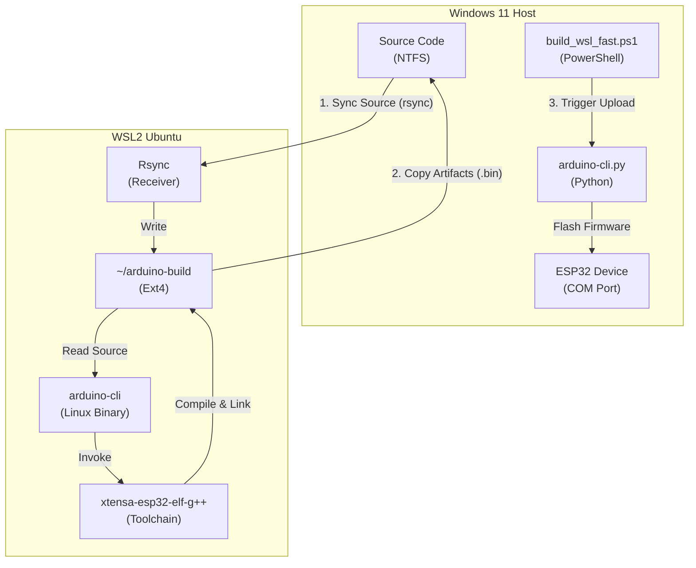

**图表来源**
- [build_wsl_fast_manual.md:21-45](file://mus4/Doc/Tools/build_wsl_fast_manual.md#L21-L45)

#### 性能优化原理

系统通过"Copy-Compile-CopyBack"模式解决了WSL2中的I/O性能瓶颈：

1. **利用Ext4高速缓存**：将工作区迁移到WSL的虚拟磁盘中，Linux内核可充分利用Page Cache
2. **减少元数据转换**：避免了Linux权限位与Windows ACL之间的实时转换开销
3. **增量同步**：使用rsync仅传输修改过的源文件，同步耗时通常在0.5秒以内

**章节来源**
- [build_wsl_fast_manual.md:1-142](file://mus4/Doc/Tools/build_wsl_fast_manual.md#L1-L142)

### 示例项目分析

项目包含了多个示例程序，用于演示特定功能的实现。

#### 电流监测示例

getcurrent.ino示例程序展示了如何使用INA219传感器进行电流监测：

```mermaid
sequenceDiagram
participant Setup as 初始化
participant Sensor as INA219传感器
participant Serial as 串口输出
participant Loop as 主循环
Setup->>Sensor : 初始化传感器
Sensor-->>Setup : 返回初始化状态
Setup->>Serial : 输出初始化信息
Loop->>Sensor : 读取电压数据
Sensor-->>Loop : 返回测量值
Loop->>Serial : 输出测量结果
Loop->>Loop : 延时2秒
```

**图表来源**
- [getcurrent.ino:7-55](file://examples/getcurrent/getcurrent.ino#L7-L55)

#### I2C通信测试示例

testIIC.ino示例程序提供了完整的I2C总线测试功能：

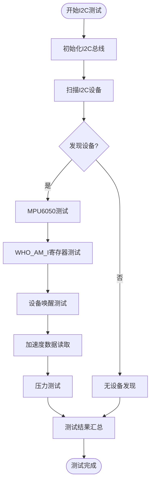

**图表来源**
- [testIIC.ino:558-613](file://examples/testIIC/testIIC.ino#L558-L613)

**章节来源**
- [getcurrent.ino:1-55](file://examples/getcurrent/getcurrent.ino#L1-L55)
- [testIIC.ino:1-613](file://examples/testIIC/testIIC.ino#L1-L613)

## 依赖关系分析

系统依赖关系复杂且层次分明，从底层的硬件抽象到顶层的应用接口形成了完整的依赖链条。

```mermaid
graph TD
subgraph Runtime[运行时依赖]
A[Python 3.x]
B[Arduino CLI]
C[ESP32开发板]
D[PowerShell]
E[WSL2 Ubuntu]
end
subgraph Libraries[Python库]
F[argparse]
G[subprocess]
H[yaml]
I[logging]
J[threading]
K=time
L=os
M=platform
N=serial
O=shlex
end
subgraph ArduinoLibraries[Arduino库]
P[Wire]
Q[FastLED]
R[Adafruit_MPU6050]
S[Adafruit_INA219]
T[BleGamepad]
end
subgraph SystemTools[系统工具]
U[串口监视器]
V[终端]
W[文件系统]
X[rsync]
Y[xtensa-esp32-elf-g++]
end
A --> F
A --> G
A --> H
A --> I
A --> J
A --> K
A --> L
A --> M
A --> N
A --> O
B --> C
D --> E
E --> X
E --> Y
F --> P
F --> Q
F --> R
F --> S
F --> T
A --> B
A --> C
A --> D
A --> E
U --> V
U --> W
```

**图表来源**
- [arduino-cli.py:4-16](file://arduino-cli.py#L4-L16)
- [mus4.ino:24-34](file://mus4/mus4.ino#L24-L34)
- [build_wsl_fast.ps1:1-140](file://build_wsl_fast.ps1#L1-L140)

### 外部依赖管理

系统对外部依赖的管理采用了灵活的策略：

| 依赖类型 | 管理方式 | 版本要求 | 用途 |
|----------|----------|----------|------|
| Python标准库 | 内置 | 3.x | 基础功能 |
| Arduino CLI | 系统安装 | 0.32+ | 编译和上传 |
| ESP32开发板 | 硬件 | 支持DFRobot FireBeetle2 | 目标平台 |
| Arduino库 | 通过CLI管理 | Adafruit库 | 传感器支持 |
| 第三方库 | 通过CLI安装 | BleGamepad库 | 蓝牙功能 |
| WSL环境 | 系统安装 | Ubuntu 20.04+ | 交叉编译支持 |
| PowerShell | 系统安装 | 5.0+ | 自动化脚本 |
| rsync工具 | WSL安装 | 3.1+ | 增量同步 |
| 交叉编译工具链 | WSL安装 | xtensa-esp32-elf | ESP32编译 |

**章节来源**
- [arduino-cli.py:1-511](file://arduino-cli.py#L1-L511)
- [mus4.ino:24-34](file://mus4/mus4.ino#L24-L34)
- [build_wsl_fast.ps1:1-140](file://build_wsl_fast.ps1#L1-L140)

## 性能考虑

系统在设计时充分考虑了性能优化，特别是在实时控制和资源管理方面。

### 内存管理优化

固件系统采用了多种内存管理策略：

1. **静态内存分配**：关键数据结构使用静态分配，避免动态内存碎片
2. **中断处理优化**：RC输入使用ISR处理，减少主循环负担
3. **缓冲区管理**：串口通信使用环形缓冲区，提高数据处理效率

### 实时性能保证

系统通过以下机制确保实时性能：

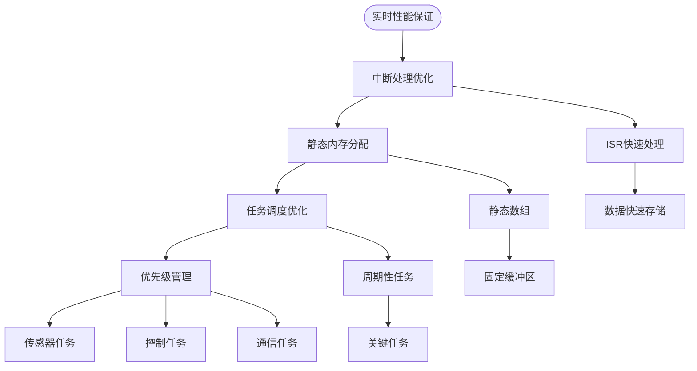

**图表来源**
- [mus4.ino:414-433](file://mus4/mus4.ino#L414-L433)

### 并发处理机制

系统采用了多线程和异步处理机制：

| 处理机制 | 实现方式 | 用途 | 性能影响 |
|----------|----------|------|----------|
| 多线程 | Python threading | 加载动画和命令执行 | 轻量级并发 |
| 异步I/O | subprocess异步 | Arduino命令执行 | 非阻塞操作 |
| 中断处理 | ESP32 ISR | RC信号采集 | 实时响应 |
| 事件驱动 | Python回调 | 用户交互 | 响应式设计 |
| 进度动画 | 线程同步 | 用户反馈 | 轻量级UI |
| 超时控制 | 时间限制 | 错误恢复 | 资源保护 |
| WSL同步 | rsync异步 | 文件传输 | 高效I/O |

**章节来源**
- [arduino-cli.py:60-93](file://arduino-cli.py#L60-L93)
- [mus4.ino:414-433](file://mus4/mus4.ino#L414-L433)
- [build_wsl_fast.ps1:20-92](file://build_wsl_fast.ps1#L20-L92)

## 故障排除指南

### 常见问题诊断

#### 环境配置问题

| 问题症状 | 可能原因 | 解决方案 |
|----------|----------|----------|
| CLI命令未找到 | Arduino CLI未安装或PATH未配置 | 安装Arduino CLI并添加到PATH |
| Sketch文件不存在 | 路径配置错误 | 检查config.yaml中的sketch_path |
| 串口权限不足 | Linux/Mac权限问题 | 添加用户到dialout组 |
| 端口不存在 | 硬件连接问题 | 检查USB连接和驱动安装 |
| 构建路径无效 | 自定义路径不存在或权限不足 | 检查路径权限和存在性 |
| 固件文件不存在 | 预编译文件路径错误 | 检查输入文件路径 |
| WSL同步失败 | rsync工具未安装或权限问题 | 在WSL中安装rsync并检查权限 |
| 交叉编译工具链缺失 | WSL中工具链未安装 | 安装xtensa-esp32-elf工具链 |

#### 编译错误排查


**图表来源**
- [arduino-cli.py:136-147](file://arduino-cli.py#L136-L147)

#### 上传失败处理

上传失败是常见的问题，系统提供了详细的错误诊断：

1. **端口检测**：检查串口设备是否存在
2. **权限验证**：确保有访问串口的权限
3. **波特率匹配**：确认波特率设置正确
4. **硬件连接**：验证USB连接和驱动安装
5. **固件文件验证**：检查预编译文件的有效性
6. **WSL文件同步**：确认编译产物已正确回传

#### 监控问题解决

串口监控问题的排查步骤：

1. **端口确认**：验证串口设备路径正确
2. **波特率设置**：检查波特率配置
3. **终端兼容性**：确保终端软件兼容
4. **数据流检查**：验证数据传输正常
5. **自动复位检查**：确认复位功能正常

#### WSL交叉编译问题

**新增** 针对WSL交叉编译场景的专用故障排除：

1. **同步问题**：检查rsync同步是否成功
2. **构建路径**：验证WSL中的构建路径配置
3. **权限问题**：确保WSL文件系统权限正确
4. **工具链问题**：确认WSL中Arduino CLI和工具链安装
5. **回传问题**：检查编译产物是否正确回传到Windows
6. **性能问题**：验证Ext4文件系统缓存效果

**章节来源**
- [arduino-cli.py:136-147](file://arduino-cli.py#L136-L147)
- [arduino-cli.py:361-403](file://arduino-cli.py#L361-L403)
- [build_wsl_fast.ps1:1-140](file://build_wsl_fast.ps1#L1-L140)
- [build_wsl_fast_manual.md:119-128](file://mus4/Doc/Tools/build_wsl_fast_manual.md#L119-L128)

### 调试技巧

#### 日志分析

系统提供了详细的日志记录功能，有助于问题诊断：

1. **日志级别选择**：根据问题严重程度选择合适的日志级别
2. **时间戳分析**：利用时间戳定位问题发生的时间点
3. **错误堆栈跟踪**：查看详细的错误信息和调用栈
4. **性能指标监控**：分析执行时间和资源使用情况
5. **WSL日志分析**：检查PowerShell脚本的详细输出

#### 性能监控

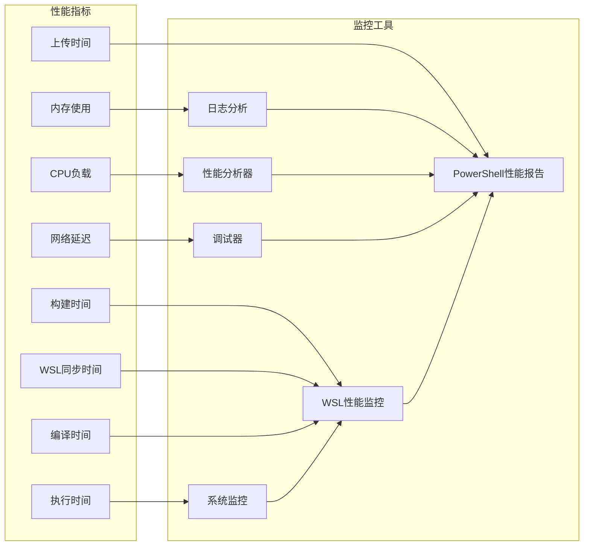

**图表来源**
- [arduino-cli.py:167-170](file://arduino-cli.py#L167-L170)
- [build_wsl_fast.ps1:119-126](file://build_wsl_fast.ps1#L119-L126)

## 命令行参数使用指南

**更新** 修正了参数标志的描述，反映了当前实际使用的参数格式，并新增了构建路径和输入文件相关参数

### 参数列表

系统支持以下命令行参数，所有参数都支持长格式和短格式两种形式：

| 参数类型 | 短格式 | 长格式 | 描述 | 默认值 |
|----------|--------|--------|------|--------|
| 操作控制 | -c | --compile | 执行编译操作 | 无 |
| 操作控制 | -u | --upload | 执行上传操作 | 无 |
| 操作控制 | -s | --serial | 打开串口监控 | 无 |
| 端口设置 | -p | --port | 指定串口设备路径 | 从配置文件读取 |
| 波特率 | -b | --baud | 指定串口波特率 | 115200 |
| 板型定义 | 无 | --fqbn | 指定Arduino板型定义 | esp32:esp32:esp32 |
| Sketch路径 | 无 | --sketch | 指定Arduino Sketch文件路径 | mus4/mus4.ino |
| CLI路径 | 无 | --cli | 指定Arduino CLI可执行文件路径 | arduino-cli |
| 配置文件 | 无 | --config | 指定配置文件路径 | config.yaml |
| 自动复位 | 无 | --auto-reset | 启用自动复位功能 | 从配置文件读取 |
| 复位方式 | 无 | --reset | 指定复位方式 | dtr_rts |
| 复位延迟 | 无 | --reset-delay | 指定复位前延时(毫秒) | 200 |
| 复位模式 | 无 | --reset-boot | 指定复位模式 | run |
| 复位命令 | 无 | --reset-command | 指定自定义复位命令 | 无 |
| 工具链标识 | 无 | --reset-toolchain | 指定烧录工具链标识 | arduino-cli |
| 回归测试 | 无 | --regress-reset | 启用自动复位回归测试 | 无 |
| 测试次数 | 无 | --regress-count | 指定回归测试次数 | 10 |
| 固件文件 | -i | --input-file | 指定预编译固件文件路径 | 无 |
| 构建目录 | 无 | --build-path | 指定构建输出目录 | 无 |

### 使用示例

#### 基本操作

**仅编译项目：**
```bash
python arduino-cli.py -c
```

**编译并上传：**
```bash
python arduino-cli.py -cu
```

**完整流程（编译+上传+监控）：**
```bash
python arduino-cli.py -cus
```

**指定端口进行监控：**
```bash
python arduino-cli.py -cus -p COM3
```

**指定波特率和板型：**
```bash
python arduino-cli.py -cus -b 9600 --fqbn esp32:esp32:esp32
```

#### 高级功能

**使用预编译固件文件：**
```bash
python arduino-cli.py -u -i firmware.bin
```

**指定构建输出目录：**
```bash
python arduino-cli.py -c --build-path ./build_output
```

**WSL交叉编译场景：**
```bash
# 在WSL中编译
arduino-cli compile --fqbn esp32:esp32:esp32 --build-path ~/arduino-build/mus4/build_wsl mus4/mus4.ino
# 在Windows中上传预编译固件
python arduino-cli.py -u -i mus4/build_wsl/mus4.ino.bin
```

**自动复位回归测试：**
```bash
python arduino-cli.py --regress-reset --regress-count 20
```

### 参数优先级规则

参数解析遵循以下优先级顺序（从高到低）：

1. **命令行参数**：直接指定的参数具有最高优先级
2. **配置文件**：config.yaml中的设置
3. **默认值**：代码中硬编码的默认值

这种设计允许用户通过命令行快速覆盖配置文件中的设置，同时保持配置文件的持久性。

**章节来源**
- [arduino-cli.py:457-511](file://arduino-cli.py#L457-L511)

## 结论

Arduino CLI自动化系统是一个功能完整、设计合理的嵌入式开发工具链。它成功地将复杂的Arduino项目管理流程简化为几个简单的命令，同时保持了足够的灵活性和可扩展性。

### 主要优势

1. **易用性**：通过简单的命令行接口提供完整的开发流程
2. **跨平台**：支持Windows、Linux和macOS等多种操作系统
3. **模块化设计**：清晰的组件分离便于维护和扩展
4. **完善的错误处理**：全面的异常捕获和用户友好的错误信息
5. **性能优化**：针对实时控制应用进行了专门的性能优化
6. **WSL支持**：深度集成WSL交叉编译场景，提升构建性能
7. **自动化增强**：提供自动复位和回归测试功能
8. **文档完善**：系统化的技术文档和故障排除指南

### 技术特色

1. **智能配置管理**：多层配置优先级确保最佳的用户体验
2. **实时监控**：提供加载动画和详细的状态反馈
3. **硬件抽象**：通过Arduino CLI实现硬件无关的开发体验
4. **传感器集成**：完整的传感器数据处理和显示功能
5. **通信协议**：标准化的串口通信协议支持上位机控制
6. **构建路径管理**：支持自定义构建输出目录
7. **预编译固件上传**：优化WSL交叉编译工作流
8. **自动复位系统**：可靠的硬件复位机制
9. **WSL性能优化**：基于Ext4文件系统的高速构建架构

### 应用前景

该系统不仅适用于LP-MU-S4自动驾驶小车项目，还可以扩展到其他Arduino项目中。其模块化的设计使得添加新的功能和硬件支持变得相对简单，为未来的功能扩展奠定了良好的基础。

**更新** 新增的WSL交叉编译支持和构建路径管理功能，使其能够更好地适应现代开发工作流，特别是需要高性能构建环境的项目。文档结构的重新组织使得技术文档更加清晰，便于开发者查找和使用相关技术资料。

通过持续的改进和完善，Arduino CLI自动化系统有望成为嵌入式开发领域的一个重要工具，为开发者提供更加高效和便捷的开发体验。