# Claude AI 代码助手支持

<cite>
**本文档引用的文件**
- [CLAUDE.md](file://CLAUDE.md)
- [README.md](file://README.md)
- [AGENTS.md](file://AGENTS.md)
- [mus4.ino](file://mus4/mus4.ino)
- [TUI.cpp](file://mus4/TUI.cpp)
- [TUI.h](file://mus4/TUI.h)
- [SharedTypes.h](file://mus4/SharedTypes.h)
- [arduino-cli.py](file://arduino-cli.py)
- [config.yaml](file://config.yaml)
- [arduino-cli-wsl.ps1](file://arduino-cli-wsl.ps1)
- [build_wsl.ps1](file://build_wsl.ps1)
- [architecture.md](file://mus4/Doc/Arch/architecture.md)
- [arduino-cli-wsl_manual.md](file://mus4/Doc/Tools/arduino-cli-wsl_manual.md)
- [getcurrent.ino](file://examples/getcurrent/getcurrent.ino)
- [testIIC.ino](file://examples/testIIC/testIIC.ino)
- [sketch.yaml](file://mus4/sketch.yaml)
</cite>

## 更新摘要
**所做更改**
- 更新构建和部署章节，重点介绍新的高性能 arduino-cli-wsl.ps1 脚本
- 添加 WSL 高速构建技术原理和性能对比
- 更新构建流程图表以反映新的优化架构
- 增强故障排除指南，包含新脚本特有的问题诊断

## 目录
1. [简介](#简介)
2. [项目结构](#项目结构)
3. [核心组件](#核心组件)
4. [架构概览](#架构概览)
5. [详细组件分析](#详细组件分析)
6. [依赖关系分析](#依赖关系分析)
7. [性能考虑](#性能考虑)
8. [故障排除指南](#故障排除指南)
9. [结论](#结论)
10. [附录](#附录)

## 简介

MUS4 是一个基于 ESP32 的自动驾驶小车控制系统，专为 MUS4-v2.3 PCB 版本设计。该项目提供了完整的代码助手支持，包括：

- **多模式控制**：手动、半自动和全自动驾驶模式
- **实时状态监控**：通过终端界面显示车辆状态
- **安全机制**：紧急停车状态机和停车控制
- **传感器集成**：INA219 电源监控和 MPU6050 IMU 传感器
- **蓝牙手柄支持**：RC 信号到蓝牙手柄的转换
- **高性能构建**：Python 脚本支持本地和 WSL 交叉编译，其中 arduino-cli-wsl.ps1 提供 5 倍性能提升

## 项目结构

```mermaid
graph TB
subgraph "根目录"
Root[项目根目录]
Docs[文档]
Examples[示例代码]
Scripts[构建脚本]
end
subgraph "mus4/"
Core[核心代码]
Types[共享类型]
Doc[架构文档]
end
subgraph "mus4/Core"
Main[mus4.ino 主程序]
TUI[TUI.cpp/ TUI.h]
Shared[SharedTypes.h]
end
subgraph "Config"
Config[config.yaml]
Sketch[sketch.yaml]
end
subgraph "Tools"
CLI[arduino-cli.py]
WSL_Fast[arduino-cli-wsl.ps1<br/>高性能 WSL 构建]
WSL_Slow[build_wsl.ps1<br/>传统 WSL 构建]
Manual[arduino-cli-wsl_manual.md<br/>技术文档]
end
Root --> Docs
Root --> Examples
Root --> Scripts
Root --> Core
Root --> Config
Root --> Tools
Core --> Main
Core --> TUI
Core --> Shared
Config --> Config
Config --> Sketch
Scripts --> CLI
Scripts --> WSL_Fast
Scripts --> WSL_Slow
Tools --> Manual
```

**图表来源**
- [mus4.ino:1-50](file://mus4/mus4.ino#L1-L50)
- [TUI.h:1-60](file://mus4/TUI.h#L1-L60)
- [SharedTypes.h:1-34](file://mus4/SharedTypes.h#L1-L34)
- [build_wsl_fast_manual.md:19-45](file://mus4/Doc/Tools/build_wsl_fast_manual.md#L19-L45)

**章节来源**
- [CLAUDE.md:1-120](file://CLAUDE.md#L1-L120)
- [README.md:1-39](file://README.md#L1-L39)

## 核心组件

### 主控制器 (mus4.ino)

主程序实现了完整的车辆控制逻辑，包括：

- **信号采集**：RC 接收机 PWM 信号和上位机串口指令
- **控制决策**：基于驾驶模式的信号融合
- **执行输出**：舵机和电调 PWM 输出控制
- **状态监控**：LED 状态指示和传感器数据读取

### 终端用户界面 (TUI)

TUI 类提供了 nvtop 风格的状态监控界面：

- **实时数据显示**：模式、停车状态、RC 通道值
- **波形图显示**：油门和转向历史数据
- **传感器监控**：INA219 和 MPU6050 数据
- **日志系统**：错误和状态信息显示

### 共享数据类型

定义了标准的数据结构用于跨模块通信：

- **SensorData**：传感器数据结构
- **ControlData**：控制数据结构
- **常量定义**：驾驶模式和波形参数

**章节来源**
- [mus4.ino:207-218](file://mus4/mus4.ino#L207-L218)
- [TUI.h:5-60](file://mus4/TUI.h#L5-L60)
- [SharedTypes.h:4-25](file://mus4/SharedTypes.h#L4-L25)

## 架构概览

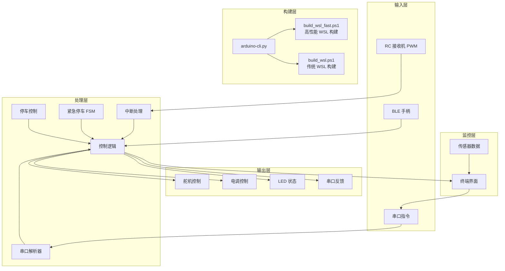

**图表来源**
- [architecture.md:18-45](file://mus4/Doc/Arch/architecture.md#L18-L45)
- [mus4.ino:493-510](file://mus4/mus4.ino#L493-L510)
- [build_wsl_fast_manual.md:19-45](file://mus4/Doc/Tools/build_wsl_fast_manual.md#L19-L45)

## 详细组件分析

### 驾驶模式控制系统

系统支持三种驾驶模式，每种模式有不同的控制策略：

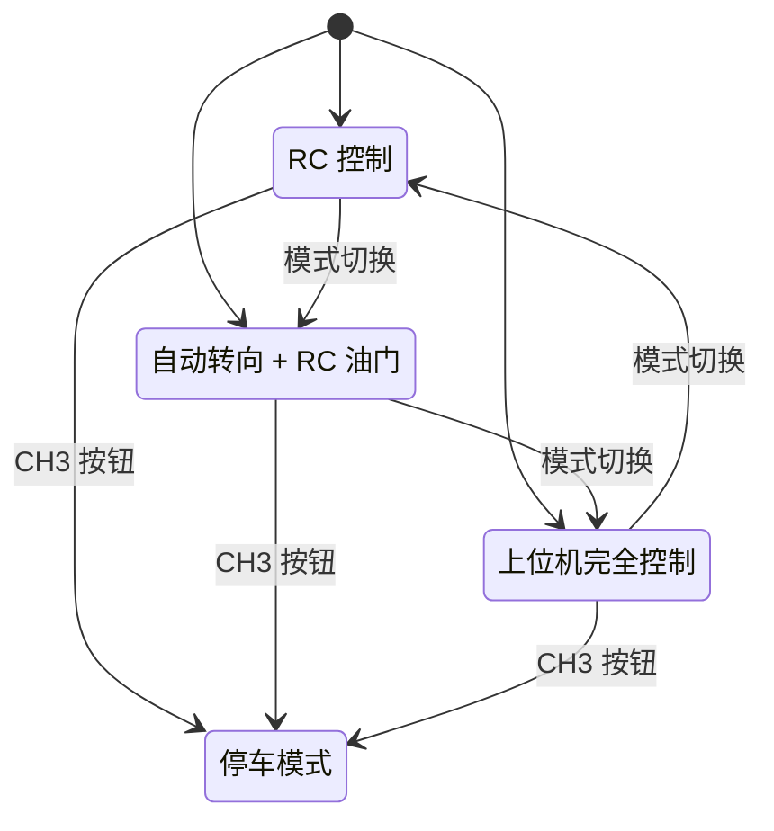

**图表来源**
- [architecture.md:111-116](file://mus4/Doc/Arch/architecture.md#L111-L116)
- [mus4.ino:683-698](file://mus4/mus4.ino#L683-L698)

### 紧急停车状态机

紧急停车机制包含四个状态，确保安全停车：

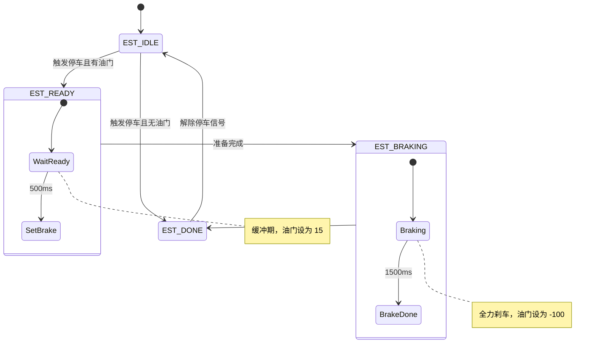

**图表来源**
- [architecture.md:123-151](file://mus4/Doc/Arch/architecture.md#L123-L151)
- [mus4.ino:530-581](file://mus4/mus4.ino#L530-L581)

### 串口通信协议

系统支持灵活的串口通信协议：

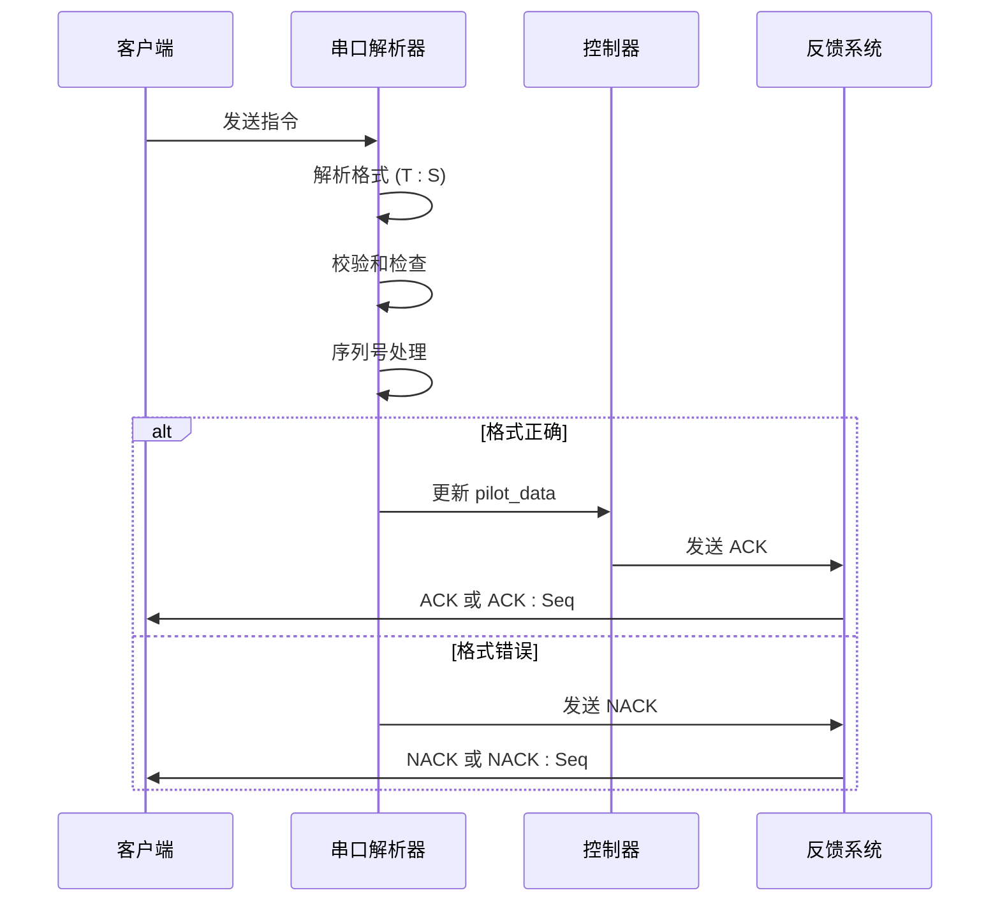

**图表来源**
- [CLAUDE.md:76-82](file://CLAUDE.md#L76-L82)
- [mus4.ino:356-402](file://mus4/mus4.ino#L356-L402)

**章节来源**
- [CLAUDE.md:59-82](file://CLAUDE.md#L59-L82)
- [architecture.md:109-116](file://mus4/Doc/Arch/architecture.md#L109-L116)

### TUI 终端界面系统

TUI 类提供了高效的终端监控界面：

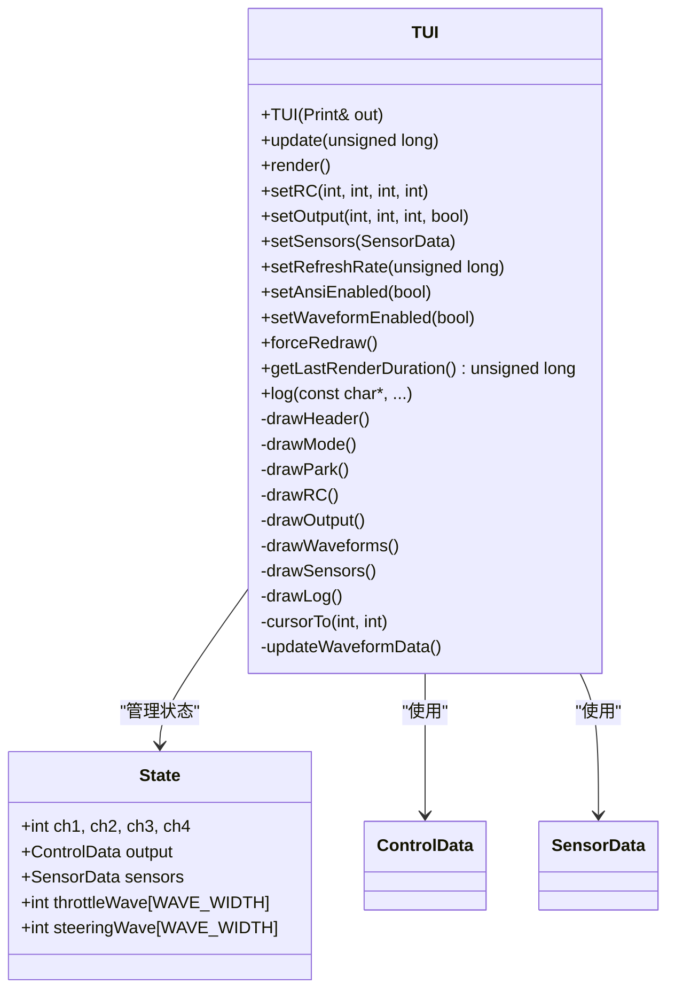

**图表来源**
- [TUI.h:5-60](file://mus4/TUI.h#L5-L60)
- [TUI.cpp:21-42](file://mus4/TUI.cpp#L21-L42)

**章节来源**
- [TUI.h:1-60](file://mus4/TUI.h#L1-L60)
- [TUI.cpp:1-361](file://mus4/TUI.cpp#L1-L361)

## 依赖关系分析

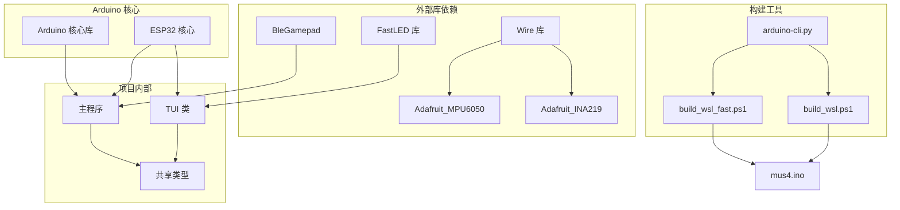

**图表来源**
- [mus4.ino:24-31](file://mus4/mus4.ino#L24-L31)
- [AGENTS.md:48-52](file://AGENTS.md#L48-L52)
- [build_wsl_fast_manual.md:19-45](file://mus4/Doc/Tools/build_wsl_fast_manual.md#L19-L45)

**章节来源**
- [AGENTS.md:46-52](file://AGENTS.md#L46-L52)
- [arduino-cli.py:100-114](file://arduino-cli.py#L100-L114)

## 性能考虑

### 实时性能优化

系统采用了多项性能优化技术：

- **中断处理**：使用 IRAM_ATTR 修饰符确保中断处理的实时性
- **内存管理**：使用 volatile 关键字处理共享变量
- **刷新率控制**：可配置的 UI 刷新间隔 (16ms ~ 500ms)
- **波形优化**：减少波形图的渲染开销

### 构建性能优化

**更新** 新的 build_wsl_fast.ps1 脚本通过以下方式提供 5 倍性能提升：

#### I/O 性能瓶颈分析

在 WSL2 中直接编译 `/mnt/c` 下的文件时，文件系统调用路径为：
`syscall` -> `VFS` -> `9P Client` -> `Vsock` -> `9P Server (Windows)` -> `NTFS`
每个文件的读写（open, read, write, close, stat）都需要跨越虚拟机边界，产生极高的延迟。对于包含数千个小文件的 C++ 编译过程，这种延迟会被放大数千倍。

#### 优化策略

新的 build_wsl_fast.ps1 采用了 **"Copy-Compile-CopyBack"** 模式：

1. **利用 Ext4 高速缓存**：将工作区迁移到 WSL 的虚拟磁盘（ext4.vhdx）中。Linux 内核可以充分利用 Page Cache，大幅减少物理 I/O。
2. **减少元数据转换**：避免了 Linux 权限位与 Windows ACL 之间的实时转换开销。
3. **增量同步**：使用 `rsync` 仅传输修改过的源文件，同步耗时通常在 0.5s 以内。

#### 性能对比数据

| 指标 | 原始挂载编译 | 优化后原生编译 | 提升 |
| :--- | :--- | :--- | :--- |
| **全量编译** | ~170s | ~35s | **~5x** |
| **增量编译** | ~20s | ~3s | **~6x** |
| **CPU 利用率** | 等待 I/O，利用率低 | 满载，计算密集 | 更高 |

### 内存使用分析

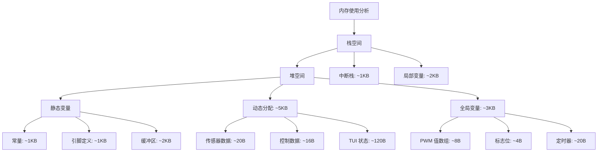

**图表来源**
- [mus4.ino:87-88](file://mus4/mus4.ino#L87-L88)
- [TUI.cpp:32-42](file://mus4/TUI.cpp#L32-L42)

## 故障排除指南

### 常见问题诊断

#### 传感器问题

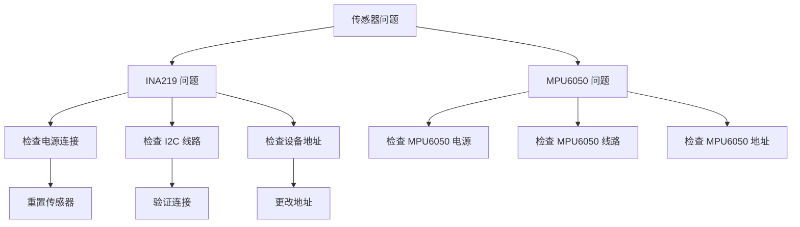

**图表来源**
- [mus4.ino:753-778](file://mus4/mus4.ino#L753-L778)
- [getcurrent.ino:20-27](file://examples/getcurrent/getcurrent.ino#L20-L27)

#### 串口通信问题

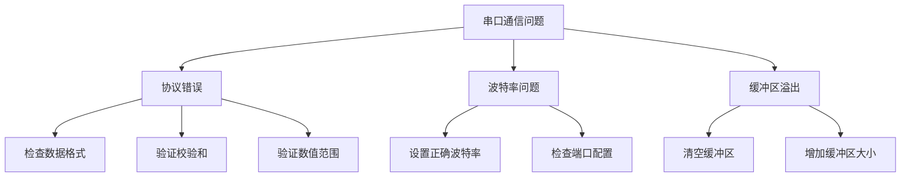

**图表来源**
- [CLAUDE.md:76-82](file://CLAUDE.md#L76-L82)
- [mus4.ino:404-490](file://mus4/mus4.ino#L404-L490)

#### WSL 构建问题

**新增** 针对新的 build_wsl_fast.ps1 脚本的专用故障排除：

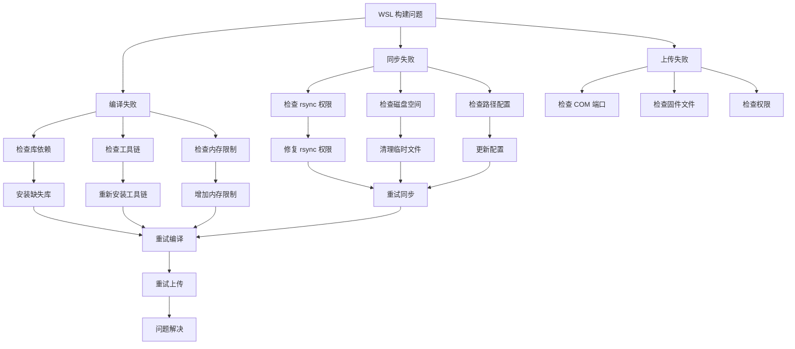

**图表来源**
- [build_wsl_fast_manual.md:119-142](file://mus4/Doc/Tools/build_wsl_fast_manual.md#L119-L142)
- [build_wsl_fast.ps1:81-88](file://build_wsl_fast.ps1#L81-L88)

**章节来源**
- [AGENTS.md:75-87](file://AGENTS.md#L75-L87)
- [testIIC.ino:125-174](file://examples/testIIC/testIIC.ino#L125-L174)
- [build_wsl_fast_manual.md:119-142](file://mus4/Doc/Tools/build_wsl_fast_manual.md#L119-L142)

## 结论

MUS4 项目展现了现代嵌入式控制系统的设计理念，具有以下特点：

### 技术优势

1. **模块化设计**：清晰的组件分离和职责划分
2. **实时性能**：优化的中断处理和内存管理
3. **用户友好**：直观的终端界面和调试工具
4. **安全性**：完善的紧急停车和状态监控机制
5. **可扩展性**：灵活的配置和测试框架
6. **高性能构建**：build_wsl_fast.ps1 提供 5 倍性能提升的 WSL 构建解决方案

### 开发价值

- **教育意义**：完整的嵌入式系统实现案例
- **实用价值**：可直接应用于实际的自动驾驶项目
- **学习资源**：丰富的注释和文档说明
- **社区贡献**：开源代码便于协作和改进

## 附录

### 构建和部署

#### 本地构建

```bash
# 编译固件
python arduino-cli.py -c

# 上传固件
python arduino-cli.py -u --port COM9

# 编译+上传+串口监控
python arduino-cli.py -cus --port COM9
```

#### WSL 交叉编译

**更新** 推荐使用高性能的 build_wsl_fast.ps1 脚本：

```powershell
# 在 Windows 上执行 WSL 优化构建（推荐）
.\build_wsl_fast.ps1

# 传统 WSL 构建（较慢）
.\build_wsl.ps1
```

**新增** build_wsl_fast.ps1 的技术优势：

- **5 倍性能提升**：通过将源码同步到 WSL 原生文件系统进行编译
- **增量同步**：使用 rsync 仅传输修改过的源文件
- **原生编译**：在 WSL 的 Ext4 文件系统上执行 arduino-cli 编译
- **可视化反馈**：提供 Braille Spinner 进度动画和精确到毫秒的耗时统计
- **无缝集成**：自动调用 Windows 端的 arduino-cli.py 完成固件上传和串口复位

**章节来源**
- [CLAUDE.md:15-44](file://CLAUDE.md#L15-L44)
- [build_wsl_fast.ps1:94-140](file://build_wsl_fast.ps1#L94-L140)
- [build_wsl_fast_manual.md:1-142](file://mus4/Doc/Tools/build_wsl_fast_manual.md#L1-L142)

### 测试命令

系统提供了多种测试功能：

- **TEST**：单元测试运行
- **BENCH**：TUI 渲染基准测试
- **STRESS**：压力测试 (50 次迭代)
- **REGRESS**：回归测试
- **ANSI/NOANSI**：ANSI 转义序列切换

**章节来源**
- [CLAUDE.md:106-114](file://CLAUDE.md#L106-L114)
- [AGENTS.md:33-40](file://AGENTS.md#L33-L40)

### WSL 高速构建技术详解

**新增** 详细的构建流程和技术原理：

#### 系统架构与数据流

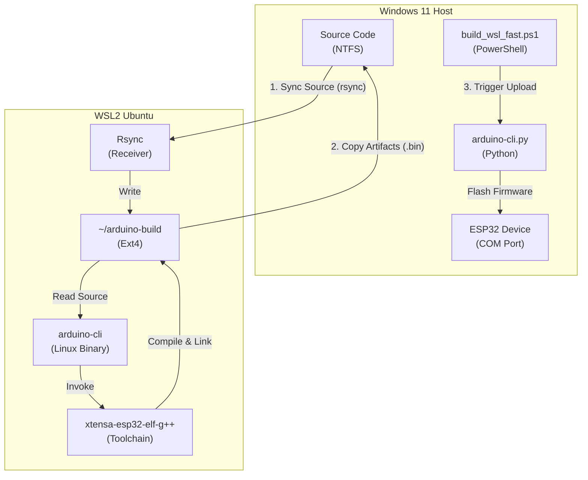

#### 性能优化原理

1. **I/O 瓶颈分析**：WSL2 中直接编译产生的高延迟文件系统调用路径
2. **优化策略**："Copy-Compile-CopyBack" 模式避免 9P 协议跨文件系统的开销
3. **增量同步**：rsync 仅传输修改过的源文件，同步耗时通常在 0.5s 以内
4. **原生编译环境**：在 WSL 的 Ext4 文件系统上执行编译，利用 Linux 内核高速 I/O

**章节来源**
- [build_wsl_fast_manual.md:17-86](file://mus4/Doc/Tools/build_wsl_fast_manual.md#L17-L86)
- [build_wsl_fast_manual.md:89-142](file://mus4/Doc/Tools/build_wsl_fast_manual.md#L89-L142)