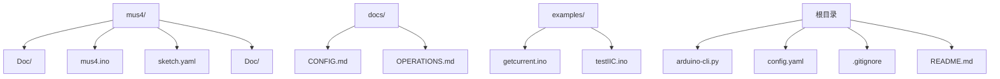
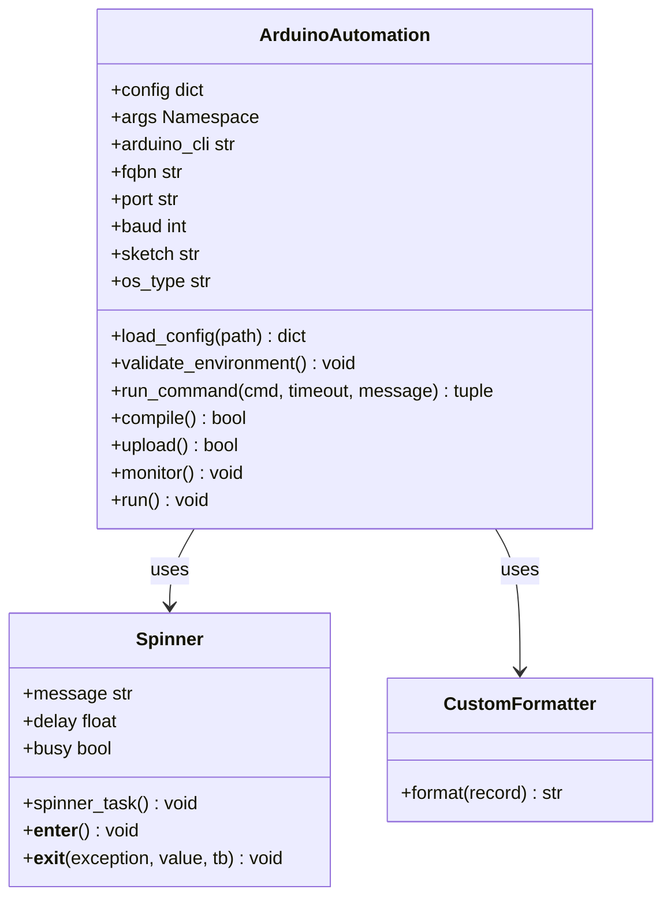
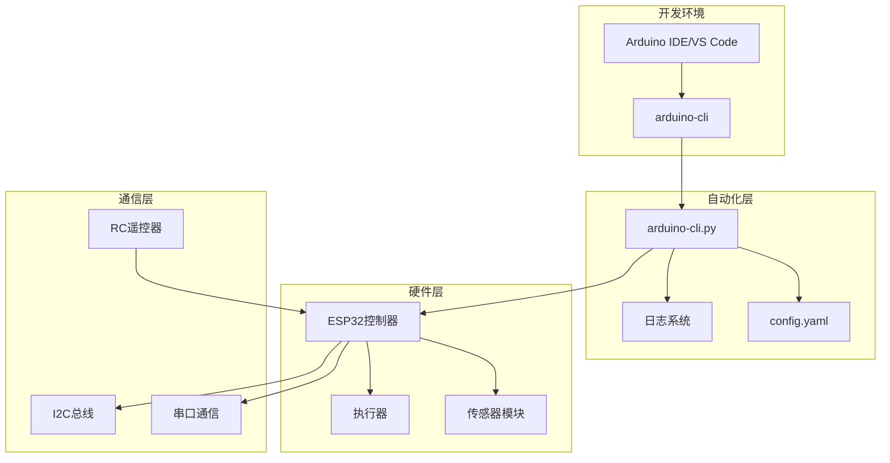
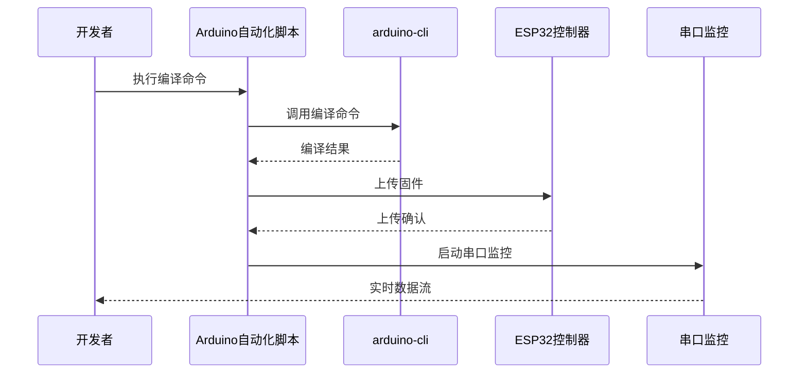
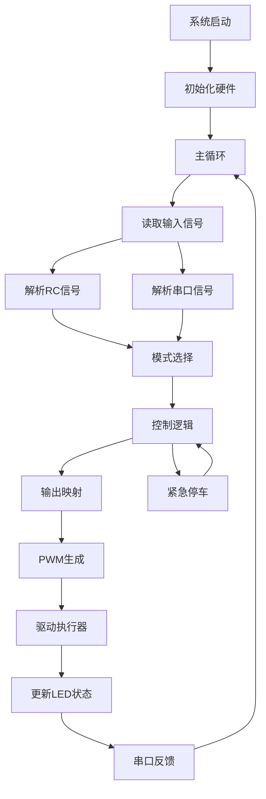
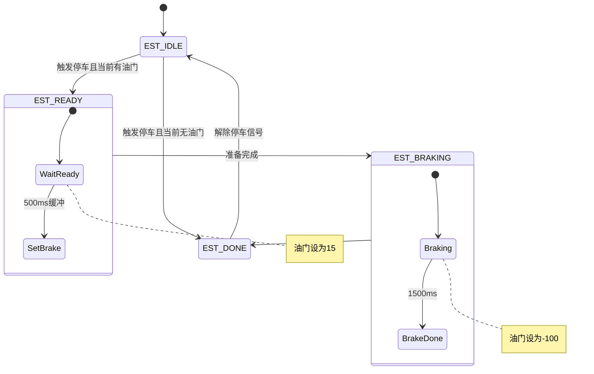
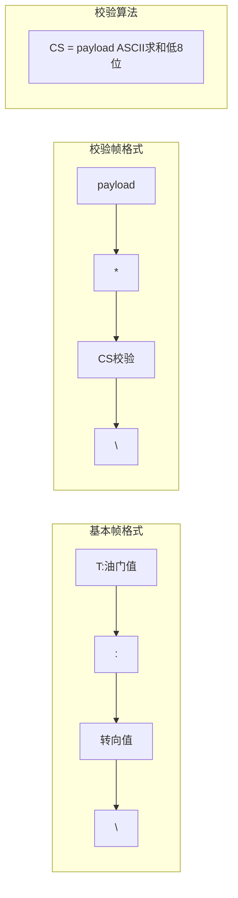
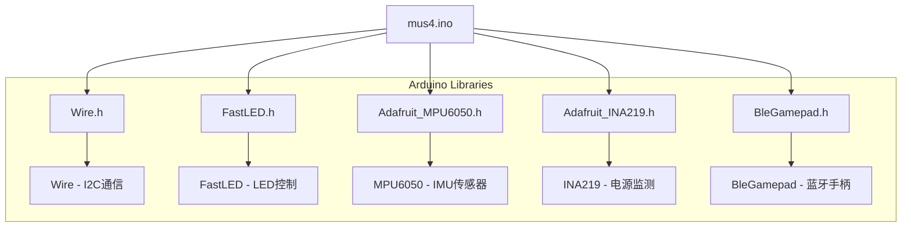
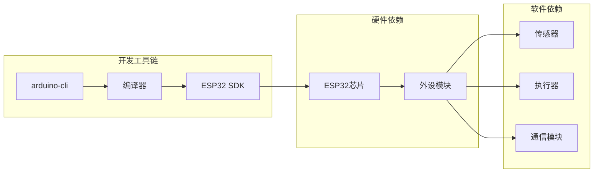

# Git源代码控制自动化

<cite>
**本文档引用的文件**
- [README.md](file://README.md)
- [arduino-cli.py](file://arduino-cli.py)
- [config.yaml](file://config.yaml)
- [mus4.ino](file://mus4/mus4.ino)
- [sketch.yaml](file://mus4/sketch.yaml)
- [architecture.md](file://mus4/Doc/Arch/architecture.md)
- [pin_definitions.md](file://mus4/Doc/Hardware/pin_definitions.md)
- [DevNote.md](file://mus4/Doc/README/DevNote.md)
- [CONFIG.md](file://docs/CONFIG.md)
- [OPERATIONS.md](file://docs/OPERATIONS.md)
- [.gitignore](file://.gitignore)
- [getcurrent.ino](file://examples/getcurrent/getcurrent.ino)
- [testIIC.ino](file://examples/testIIC/testIIC.ino)
</cite>

## 目录
1. [项目概述](#项目概述)
2. [项目结构](#项目结构)
3. [核心组件](#核心组件)
4. [架构概览](#架构概览)
5. [详细组件分析](#详细组件分析)
6. [依赖关系分析](#依赖关系分析)
7. [性能考虑](#性能考虑)
8. [故障排除指南](#故障排除指南)
9. [结论](#结论)

## 项目概述

这是一个基于ESP32的自动驾驶小车控制系统，名为LP-MU-S4。该项目实现了完整的Git源代码控制自动化，包括Arduino项目构建、部署和监控的完整流水线。

### 项目特点
- **硬件平台**: ESP32微控制器
- **扩展板**: DFRobot FireBeetle2 ESP32E
- **控制模式**: 支持手动、半自动和全自动三种驾驶模式
- **通信协议**: 支持RC遥控器和上位机串口通信
- **自动化程度**: 完整的编译、上传、监控自动化流程

## 项目结构



**图表来源**
- [README.md](file://README.md#L1-L39)
- [arduino-cli.py](file://arduino-cli.py#L1-L315)
- [config.yaml](file://config.yaml#L1-L13)

**章节来源**
- [README.md](file://README.md#L1-L39)
- [arduino-cli.py](file://arduino-cli.py#L1-L315)
- [config.yaml](file://config.yaml#L1-L13)

## 核心组件

### Arduino自动化脚本 (arduino-cli.py)

这是整个系统的核心自动化组件，提供了完整的Arduino项目生命周期管理：

#### 主要功能
- **编译管理**: 自动调用arduino-cli进行项目编译
- **上传部署**: 支持串口上传固件到ESP32
- **串口监控**: 实时监控串口数据流
- **配置管理**: 支持命令行参数和配置文件双重配置
- **日志记录**: 完整的日志系统，支持不同级别日志

#### 核心类结构



**图表来源**
- [arduino-cli.py](file://arduino-cli.py#L58-L91)
- [arduino-cli.py](file://arduino-cli.py#L92-L315)

### 配置管理系统

#### 主配置文件 (config.yaml)
```yaml
default:
  arduino_cli: "arduino-cli"
  fqbn: "esp32:esp32:esp32"
  port: "COM9"
  baudrate: 115201
  sketch_path: "mus4/mus4.ino"
  build_path: "build"

logging:
  file: "mus4/ArduinoCLI.log"
  level: "INFO"
```

#### Sketch配置 (sketch.yaml)
```yaml
default_fqbn: esp32:esp32:dfrobot_firebeetle2_esp32e
default_port: /dev/ttyS4
```

**章节来源**
- [arduino-cli.py](file://arduino-cli.py#L39-L56)
- [config.yaml](file://config.yaml#L1-L13)
- [sketch.yaml](file://mus4/sketch.yaml#L1-L3)

## 架构概览

### 系统架构图



**图表来源**
- [arduino-cli.py](file://arduino-cli.py#L92-L315)
- [mus4.ino](file://mus4/mus4.ino#L1-L1290)

### 数据流架构



**图表来源**
- [arduino-cli.py](file://arduino-cli.py#L197-L246)

## 详细组件分析

### 主控程序 (mus4.ino)

#### 系统架构设计



**图表来源**
- [architecture.md](file://mus4/Doc/Arch/architecture.md#L68-L107)

#### 核心数据结构

程序定义了统一的控制数据结构：

```cpp
struct struct_message {
    int throttle; // 油门值 (-100 ~ 100)
    int steering; // 转向值 (-100 ~ 100)
    int mode;     // 驾驶模式
    bool park;    // 停车标志
};
```

#### 驾驶模式系统

| 模式ID | 宏定义 | 名称 | 控制权分配 | LED颜色 |
|--------|--------|------|------------|---------|
| 0 | `CAR_MODE_MANUAL` | 手动模式 | RC控制 | 绿色 |
| 1 | `CAR_MODE_SEMI_AUTO` | 半自动模式 | Pilot转向+RC油门 | 黄色 |
| 2 | `CAR_MODE_FULL_AUTO` | 自动驾驶模式 | Pilot控制 | 蓝色 |

#### 紧急停车状态机



**图表来源**
- [architecture.md](file://mus4/Doc/Arch/architecture.md#L123-L151)

**章节来源**
- [mus4.ino](file://mus4/mus4.ino#L460-L473)
- [architecture.md](file://mus4/Doc/Arch/architecture.md#L110-L116)

### 硬件引脚配置

#### 引脚定义总览

| 引脚编号 | 变量名称 | 功能 | I/O方向 | 连接设备 |
|----------|----------|------|---------|----------|
| **5** | `LED_PIN` | LED控制 | Output | WS2812B RGB LED |
| **12** | `UART_SEL` | UART选择 | Output | 串口选择开关 |
| **21** | `SDA_PIN` | I2C数据 | I/O | INA219/MPU6050 |
| **22** | `SCL_PIN` | I2C时钟 | Output | INA219/MPU6050 |
| **23** | `STEERING_PIN` | PWM输出 | Output | 舵机 |
| **25** | `THROTTLE_PIN` | PWM输出 | Output | 电调 |
| **34** | `CH3_PIN` | PWM输入 | Input | RC接收机 CH3 |
| **36** | `CH1_PIN` | PWM输入 | Input | RC接收机 CH1 |
| **39** | `CH2_PIN` | PWM输入 | Input | RC接收机 CH2 |

#### 硬件连接关系

```mermaid
graph TD
subgraph ESP32_Controller
P36[GPIO 36<br>CH1输入]
P39[GPIO 39<br>CH2输入]
P34[GPIO 34<br>CH3输入]
P26[GPIO 26<br>CH4输入]
P23[GPIO 23<br>舵机输出]
P25[GPIO 25<br>电调输出]
P5[GPIO 5<br>LED数据]
P12[GPIO 12<br>UART选择]
P21[GPIO 21<br>SDA]
P22[GPIO 22<br>SCL]
end
subgraph RC_System
RC_CH1[Channel 1<br>Steering] --> P36
RC_CH2[Channel 2<br>Throttle] --> P39
RC_CH3[Channel 3<br>Park] --> P34
RC_CH4[Channel 4<br>Mode] --> P26
end
subgraph Actuators
P23 --> |PWM 50Hz| Servo[Steering Servo]
P25 --> |PWM 50Hz| ESC[Electronic Speed Controller]
end
subgraph I2C_Devices
P21 < --> |I2C Data| INA219[Power Monitor]
P22 --> |I2C Clock| INA219
P21 < --> |I2C Data| MPU6050[IMU Sensor]
P22 --> |I2C Clock| MPU6050
end
RC_System --> ESP32_Controller
ESP32_Controller --> Actuators
ESP32_Controller --> I2C_Devices
```

**图表来源**
- [pin_definitions.md](file://mus4/Doc/Hardware/pin_definitions.md#L115-L181)

**章节来源**
- [pin_definitions.md](file://mus4/Doc/Hardware/pin_definitions.md#L13-L28)

### 通信协议设计

#### 串口通信协议



**图表来源**
- [DevNote.md](file://mus4/Doc/README/DevNote.md#L24-L29)

#### 测试命令系统

| 命令 | 功能 | 输出示例 |
|------|------|----------|
| `TEST` | 单元测试 | `TEST: total=5 passed=4 ok=1` |
| `BENCH` | 性能基准 | `BENCH_OK=1` |
| `STRESS` | 异常压力测试 | `STRESS_OK=1` |
| `REGRESS` | 回归校验 | `REGRESS_OK=1` |

**章节来源**
- [DevNote.md](file://mus4/Doc/README/DevNote.md#L24-L29)
- [CONFIG.md](file://docs/CONFIG.md#L18-L23)

## 依赖关系分析

### 外部库依赖



**图表来源**
- [mus4.ino](file://mus4/mus4.ino#L24-L34)

### 系统依赖关系



**图表来源**
- [arduino-cli.py](file://arduino-cli.py#L125-L137)

**章节来源**
- [arduino-cli.py](file://arduino-cli.py#L125-L137)

## 性能考虑

### 系统性能指标

#### 刷新频率优化
- **传感器更新**: 1000ms TTL，避免频繁读取
- **RC数据更新**: ~60Hz（16ms间隔）
- **UI更新**: 60Hz（16ms间隔），支持100-500ms自适应调整
- **降级模式**: 自动触发条件包括UI渲染耗时>150ms

#### 内存管理
- **全局变量**: 仅使用必要的全局状态变量
- **缓冲区管理**: 串口缓冲区大小256字节，溢出检测
- **内存优化**: 使用volatile关键字确保中断安全访问

#### 并发处理
- **中断处理**: 使用IRAM_ATTR确保中断服务函数快速执行
- **非阻塞I/O**: 串口读取采用非阻塞方式
- **状态机设计**: 紧急停车等复杂逻辑使用状态机避免阻塞

### 性能优化建议

1. **I2C通信优化**: 使用适当的延迟避免总线冲突
2. **LED控制优化**: 仅在状态变化时更新LED
3. **串口通信优化**: 批量处理串口数据减少CPU占用
4. **传感器采样优化**: 合理的采样间隔避免过度读取

## 故障排除指南

### 常见问题及解决方案

#### 编译问题
- **问题**: 找不到arduino-cli命令
  - **解决**: 确保arduino-cli已安装并添加到PATH
  - **检查**: `which arduino-cli` 或 `where arduino-cli`

- **问题**: 配置文件加载失败
  - **解决**: 检查config.yaml语法和路径
  - **检查**: YAML格式是否正确

#### 上传问题
- **问题**: 串口端口不可用
  - **解决**: 检查端口权限和占用情况
  - **检查**: Windows: `COM9`，Linux: `/dev/ttyACM0`

- **问题**: 上传超时
  - **解决**: 增加超时时间或检查硬件连接
  - **检查**: 串口线缆质量

#### 运行时问题
- **问题**: 传感器数据异常
  - **解决**: 检查I2C连接和设备地址
  - **检查**: 使用I2C扫描工具验证设备

- **问题**: LED状态异常
  - **解决**: 检查LED连接极性和限流电阻
  - **检查**: 电源电压是否合适

### 调试工具

#### 日志系统
- **日志级别**: DEBUG/INFO/WARNING/ERROR
- **日志文件**: `mus4/ArduinoCLI.log`
- **控制台输出**: 彩色日志便于区分级别

#### 诊断命令
- **TEST**: 运行单元测试验证核心功能
- **BENCH**: 性能基准测试评估系统性能
- **STRESS**: 异常压力测试验证系统稳定性
- **REGRESS**: 回归测试确保功能完整性

**章节来源**
- [arduino-cli.py](file://arduino-cli.py#L17-L37)
- [OPERATIONS.md](file://docs/OPERATIONS.md#L8-L17)

## 结论

这个Git源代码控制自动化项目展现了现代嵌入式开发的最佳实践：

### 主要成就
1. **完整的自动化流水线**: 从编译到部署的全流程自动化
2. **灵活的配置管理**: 支持命令行参数和配置文件双重配置
3. **强大的错误处理**: 完善的日志系统和错误恢复机制
4. **丰富的调试工具**: 内置测试命令和性能监控

### 技术亮点
- **模块化设计**: 清晰的组件分离和职责划分
- **实时监控**: 串口监控功能便于调试和数据分析
- **状态机设计**: 复杂逻辑使用状态机确保可靠性
- **性能优化**: 多层次的性能优化策略

### 未来发展方向
1. **CI/CD集成**: 集成到持续集成/持续部署流水线
2. **云端监控**: 添加远程监控和数据上报功能
3. **机器学习**: 集成机器学习算法提升自动驾驶能力
4. **多平台支持**: 支持更多硬件平台和开发环境

这个项目为嵌入式系统的自动化开发提供了优秀的参考模板，展示了如何将传统硬件开发与现代软件工程方法相结合。