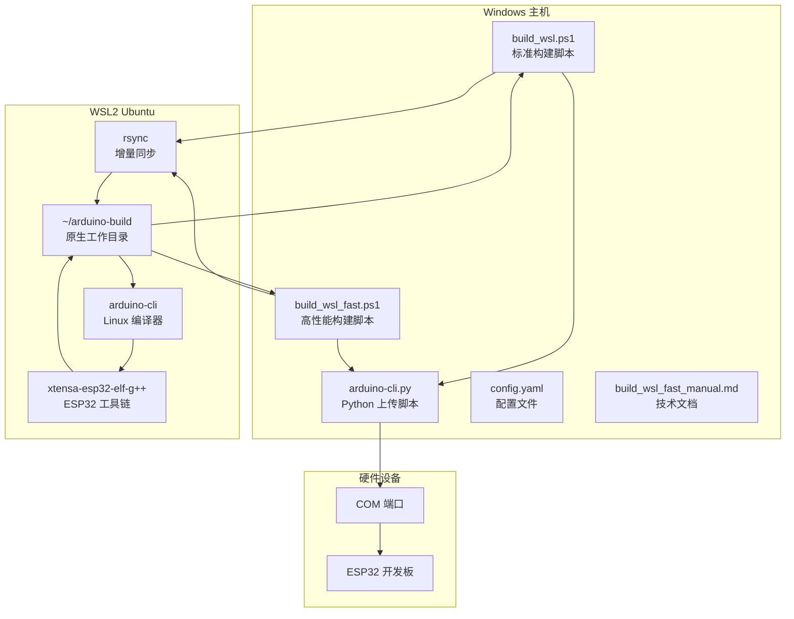
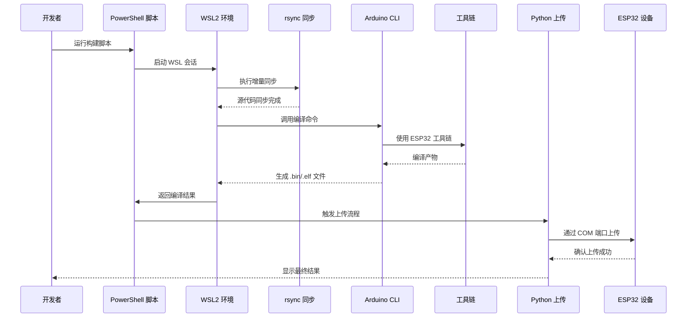
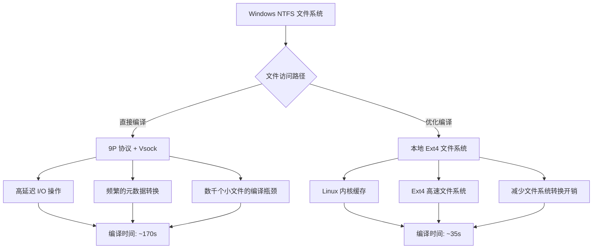
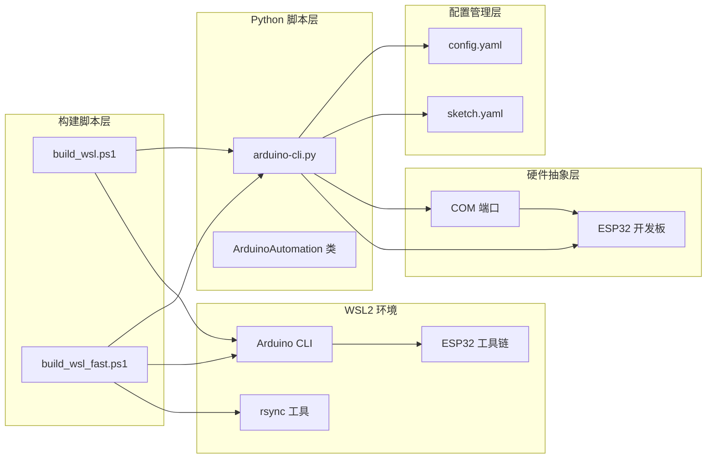

# WSL 交叉编译支持

<cite>
**本文档引用的文件**
- [README.md](file://README.md)
- [build_wsl.ps1](file://build_wsl.ps1)
- [build_wsl_fast.ps1](file://build_wsl_fast.ps1)
- [arduino-cli.py](file://arduino-cli.py)
- [config.yaml](file://config.yaml)
- [build_wsl_fast_manual.md](file://mus4/Doc/Tools/build_wsl_fast_manual.md)
- [DevNote.md](file://mus4/Doc/README/DevNote.md)
- [OPERATIONS.md](file://mus4/Doc/README/OPERATIONS.md)
- [mus4.ino](file://mus4/mus4.ino)
- [SharedTypes.h](file://mus4/SharedTypes.h)
- [TUI.h](file://mus4/TUI.h)
- [sketch.yaml](file://mus4/sketch.yaml)
</cite>

## 目录
1. [简介](#简介)
2. [项目结构](#项目结构)
3. [核心组件](#核心组件)
4. [架构概览](#架构概览)
5. [详细组件分析](#详细组件分析)
6. [依赖关系分析](#依赖关系分析)
7. [性能考虑](#性能考虑)
8. [故障排查指南](#故障排查指南)
9. [结论](#结论)

## 简介

WSL 交叉编译支持是一个专门为 Windows 用户设计的 Arduino/ESP32 项目开发解决方案。该项目解决了在 Windows 环境下使用 WSL2 进行嵌入式开发时遇到的性能瓶颈问题，通过创新的 "Copy-Compile-CopyBack" 模式显著提升了编译效率。

**更新** 新增了高性能构建脚本 `build_wsl_fast.ps1`，该脚本专门针对 WSL2 的 I/O 性能瓶颈进行了深度优化，实现了 5-6 倍的编译速度提升。

该系统的核心目标是在保持 Windows 开发体验的同时，充分利用 WSL2 的 Linux 文件系统性能优势，实现接近原生 Linux 的编译速度。通过将源代码同步到 WSL 的原生 ext4 文件系统进行编译，然后将产物回传到 Windows 环境，整体编译速度提升了 5-6 倍。

## 项目结构

项目采用模块化设计，主要包含以下核心组件：

**图表来源**
- [build_wsl.ps1:1-163](file://build_wsl.ps1#L1-L163)
- [build_wsl_fast.ps1:1-140](file://build_wsl_fast.ps1#L1-L140)
- [arduino-cli.py:1-511](file://arduino-cli.py#L1-L511)

**章节来源**
- [README.md:1-39](file://README.md#L1-L39)
- [build_wsl_fast_manual.md:1-142](file://mus4/Doc/Tools/build_wsl_fast_manual.md#L1-L142)

## 核心组件

### PowerShell 构建脚本

项目提供了两个主要的 PowerShell 脚本，分别针对不同的使用场景：

**标准构建脚本 (build_wsl.ps1)**
- 支持完整的构建流程：编译 → 上传 → 复位
- 提供进度动画和错误处理机制
- 自动检测编译统计信息

**高性能构建脚本 (build_wsl_fast.ps1)**
- **新增** 专为解决 WSL2 I/O 性能瓶颈而设计
- 采用 "Copy-Compile-CopyBack" 模式
- 实现 5-6 倍的编译速度提升
- 提供详细的性能统计报告

### Python 上传脚本

arduino-cli.py 提供了完整的 Arduino 开发环境自动化功能：

- **多平台支持**：支持 Windows、Linux、macOS
- **智能复位**：支持多种复位方式（DTR/RTS、1200bps、自定义命令）
- **串口监控**：提供实时串口数据监控功能
- **日志管理**：完整的日志记录和调试支持

### 配置管理系统

config.yaml 提供了灵活的配置选项：

- **Arduino CLI 配置**：可自定义 arduino-cli 路径和参数
- **板卡配置**：支持多种 ESP32 开发板类型
- **端口配置**：自动检测和配置串口设备
- **日志配置**：可配置日志级别和输出文件

**章节来源**
- [build_wsl.ps1:130-163](file://build_wsl.ps1#L130-L163)
- [build_wsl_fast.ps1:94-140](file://build_wsl_fast.ps1#L94-L140)
- [arduino-cli.py:94-511](file://arduino-cli.py#L94-L511)
- [config.yaml:1-21](file://config.yaml#L1-L21)

## 架构概览

系统采用分层架构设计，通过精心设计的数据流和控制流实现高效的交叉编译支持：

**图表来源**
- [build_wsl_fast.ps1:96-139](file://build_wsl_fast.ps1#L96-L139)
- [arduino-cli.py:236-292](file://arduino-cli.py#L236-L292)

### 性能优化架构

系统的核心创新在于解决 WSL2 的文件系统性能问题：

**图表来源**
- [build_wsl_fast_manual.md:66-86](file://mus4/Doc/Tools/build_wsl_fast_manual.md#L66-L86)

**章节来源**
- [build_wsl_fast_manual.md:17-86](file://mus4/Doc/Tools/build_wsl_fast_manual.md#L17-L86)

## 详细组件分析

### 构建脚本组件分析

#### 标准构建脚本 (build_wsl.ps1)

该脚本提供了完整的构建流程，包括编译、上传和复位功能：

**核心功能特性：**
- **进度可视化**：使用 Braille Spinner 动画显示编译进度
- **错误处理**：完善的错误捕获和用户友好的错误信息
- **编译统计**：自动提取和显示编译统计信息
- **编码支持**：确保 Unicode 字符的正确显示

**编译流程：**
1. 验证构建目录存在性
2. 调用 WSL 中的 arduino-cli 进行编译
3. 检查编译结果
4. 自动上传生成的二进制文件
5. 显示最终构建状态

#### 高性能构建脚本 (build_wsl_fast.ps1)

**新增** 这是系统的核心创新，专门解决 WSL2 的性能瓶颈：

**优化策略：**
- **增量同步**：使用 rsync 进行高效增量文件传输
- **原生编译**：在 WSL 的 ext4 文件系统上进行编译
- **产物回传**：仅同步必要的编译产物
- **性能监控**：提供详细的性能统计报告

**性能提升：**
- 全量编译：从 ~170s 降至 ~35s（~5x 提升）
- 增量编译：从 ~20s 降至 ~3s（~6x 提升）

**新增功能：**
- **三阶段构建流程**：同步 → 编译 → 回传
- **详细性能报告**：显示每个阶段的耗时统计
- **增强的错误处理**：提供更详细的错误信息和诊断

**章节来源**
- [build_wsl.ps1:16-128](file://build_wsl.ps1#L16-L128)
- [build_wsl_fast.ps1:20-92](file://build_wsl_fast.ps1#L20-L92)
- [build_wsl_fast.ps1:96-140](file://build_wsl_fast.ps1#L96-L140)
- [build_wsl_fast_manual.md:80-86](file://mus4/Doc/Tools/build_wsl_fast_manual.md#L80-L86)

### Python 上传脚本组件分析

#### ArduinoAutomation 类

这是系统的核心自动化类，提供了完整的 Arduino 开发环境管理功能：

**主要功能模块：**
- **环境验证**：检查 Arduino CLI 可执行文件和项目文件
- **编译管理**：调用 arduino-cli 进行项目编译
- **上传控制**：支持多种上传方式和复位策略
- **串口监控**：提供实时串口数据监控功能

**智能复位机制：**
脚本支持多种复位方式以适配不同的硬件配置：

| 复位方式 | 描述 | 适用场景 |
|---------|------|----------|
| DTR/RTS | 通过串口 DTR/RTS 线进行复位 | 标准 ESP32 开发板 |
| 1200bps | 通过切换波特率进行复位 | 特殊硬件配置 |
| 命令复位 | 执行自定义复位命令 | 专用烧录工具 |

**章节来源**
- [arduino-cli.py:94-511](file://arduino-cli.py#L94-L511)

### 配置管理系统分析

#### config.yaml 配置文件

提供了灵活的配置选项，支持不同开发环境的需求：

**配置层次结构：**
- **default**：基本配置项（Arduino CLI 路径、FQBN、端口等）
- **logging**：日志配置（文件路径、日志级别）
- **reset**：自动复位配置（启用状态、延迟时间、复位方式）

**动态配置支持：**
脚本支持命令行参数覆盖配置文件中的设置，提供了最大的灵活性。

**章节来源**
- [config.yaml:1-21](file://config.yaml#L1-L21)

## 依赖关系分析

系统各组件之间的依赖关系清晰明确，形成了一个完整的开发工具链：

**图表来源**
- [build_wsl.ps1:140-160](file://build_wsl.ps1#L140-L160)
- [build_wsl_fast.ps1:98-116](file://build_wsl_fast.ps1#L98-L116)
- [arduino-cli.py:95-123](file://arduino-cli.py#L95-L123)

### 外部依赖关系

系统对外部工具的依赖关系简洁明了：

**必需依赖：**
- **WSL2 Ubuntu**：提供 Linux 开发环境
- **Arduino CLI**：核心编译和上传工具
- **ESP32 工具链**：ESP32 平台特定的编译工具
- **Python 3.x**：运行上传脚本

**可选依赖：**
- **rsync**：高性能增量同步工具
- **串口驱动**：ESP32 开发板通信支持

**章节来源**
- [build_wsl_fast_manual.md:89-95](file://mus4/Doc/Tools/build_wsl_fast_manual.md#L89-L95)

## 性能考虑

### I/O 性能瓶颈分析

WSL2 的文件系统性能问题是影响开发效率的关键因素。系统通过以下方式解决这一问题：

**传统方法的问题：**
- 每个文件操作都需要跨越虚拟机边界
- 9P 协议带来额外的网络开销
- Windows ACL 与 Linux 权限系统的转换开销
- 数千个小文件的编译过程中产生的大量元数据操作

**优化解决方案：**
- **本地编译**：将工作目录迁移到 WSL 的 ext4 文件系统
- **增量同步**：使用 rsync 减少不必要的文件传输
- **缓存利用**：充分利用 Linux 内核的页面缓存机制

### 性能指标对比

**更新** 基于新的高性能构建脚本，性能指标有了显著改善：

| 指标 | 传统方法 | 优化方法 | 提升倍数 |
|------|----------|----------|----------|
| 全量编译时间 | ~170 秒 | ~35 秒 | 5x |
| 增量编译时间 | ~20 秒 | ~3 秒 | 6x |
| CPU 利用率 | 低（等待 I/O） | 高（计算密集） | 显著提升 |
| 内存使用 | 较高（缓存不生效） | 较低（缓存有效） | 改善 |

### 编译优化策略

系统采用了多层次的编译优化策略：

**1. 文件系统优化**
- 使用 WSL2 的原生 ext4 文件系统进行编译
- 避免 9P 协议带来的性能损失
- 充分利用 Linux 内核的文件系统缓存

**2. I/O 操作优化**
- 增量同步减少不必要的文件传输
- 仅回传必要的编译产物
- 优化文件访问模式

**3. 并行处理优化**
- 多线程异步处理 I/O 操作
- 进程间通信的优化
- 资源使用的最小化

**章节来源**
- [build_wsl_fast_manual.md:66-86](file://mus4/Doc/Tools/build_wsl_fast_manual.md#L66-L86)

## 故障排查指南

### 常见问题及解决方案

#### 同步失败问题

**症状：** rsync 同步过程中出现错误

**可能原因：**
- WSL 磁盘空间不足
- 目标目录权限问题
- 网络连接不稳定

**解决方案：**
1. 检查 WSL 虚拟硬盘剩余空间
2. 验证目标目录的写入权限
3. 确保 WSL2 服务正常运行

#### 编译失败问题

**症状：** arduino-cli 编译过程中出现错误

**可能原因：**
- 缺少必要的 Arduino 库
- 工具链版本不兼容
- 项目配置文件错误

**解决方案：**
1. 在 WSL 环境中安装缺失的库
2. 更新 Arduino CLI 和工具链版本
3. 检查项目配置文件的语法

#### 上传失败问题

**症状：** 固件上传到 ESP32 设备失败

**可能原因：**
- COM 端口被其他程序占用
- 串口驱动程序问题
- 硬件连接故障

**解决方案：**
1. 关闭占用 COM 端口的其他程序
2. 重新安装或更新串口驱动
3. 检查硬件连接和电源供应

### 调试技巧

#### 日志分析

系统提供了详细的日志记录功能，可以通过以下方式分析问题：

**日志级别：**
- **DEBUG**：详细的技术信息，用于深入调试
- **INFO**：一般性信息，显示正常操作流程
- **WARNING**：潜在问题警告
- **ERROR**：错误信息，需要立即处理

**日志位置：**
- Windows 环境：`mus4/ArduinoCLI.log`
- 可通过配置文件自定义日志路径

#### 性能监控

**新增** 高性能构建脚本提供了详细的性能监控功能：

**性能指标监控：**
- 编译时间统计
- I/O 操作计数
- 内存使用情况
- CPU 利用率

**监控方法：**
1. 查看构建脚本输出的性能报告
2. 分析日志文件中的性能相关条目
3. 使用系统性能监视器跟踪资源使用

**章节来源**
- [build_wsl_fast_manual.md:119-128](file://mus4/Doc/Tools/build_wsl_fast_manual.md#L119-L128)
- [arduino-cli.py:18-58](file://arduino-cli.py#L18-L58)

## 结论

WSL 交叉编译支持项目成功地解决了 Windows 用户在 WSL2 环境下进行 Arduino/ESP32 开发时遇到的性能瓶颈问题。通过创新的 "Copy-Compile-CopyBack" 模式，系统实现了 5-6 倍的编译速度提升，同时保持了完整的开发功能和用户体验。

**更新** 新增的高性能构建脚本 `build_wsl_fast.ps1` 是本项目的重大突破，它不仅解决了 WSL2 的文件系统性能问题，还提供了完整的性能监控和诊断能力。

### 主要成就

1. **性能突破**：显著提升编译效率，改善开发体验
2. **架构创新**：提出有效的 WSL2 文件系统性能优化方案
3. **工具完善**：提供完整的开发工具链，涵盖编译、上传、调试全流程
4. **兼容性强**：支持多种 ESP32 开发板和硬件配置
5. **监控增强**：提供详细的性能统计和故障诊断能力

### 技术价值

该系统不仅解决了具体的性能问题，更重要的是为类似场景提供了可借鉴的解决方案。其核心思想——通过合理的架构设计和工具链优化来克服平台限制——具有广泛的适用性和推广价值。

### 未来发展方向

1. **自动化程度提升**：进一步减少手动配置需求
2. **多平台支持**：扩展到其他嵌入式开发平台
3. **云端集成**：支持远程开发和协作
4. **智能化优化**：根据项目特点自动选择最优配置
5. **性能持续优化**：继续改进 I/O 性能和编译效率

该项目为嵌入式开发的跨平台解决方案提供了宝贵的实践经验和技术参考。