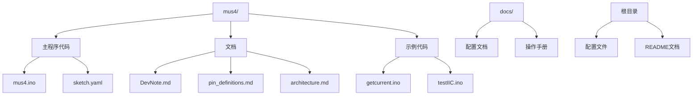
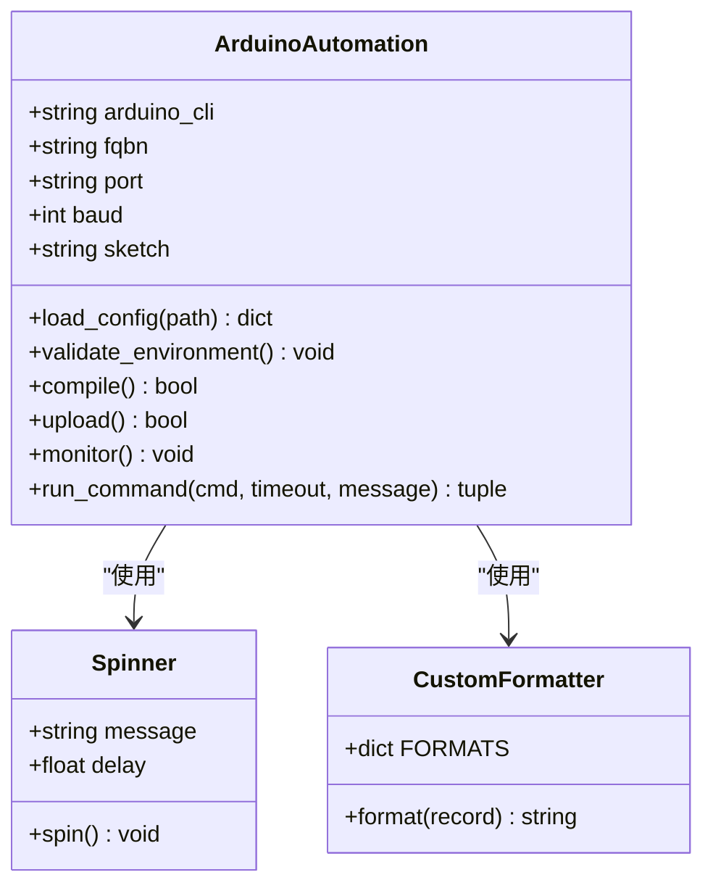
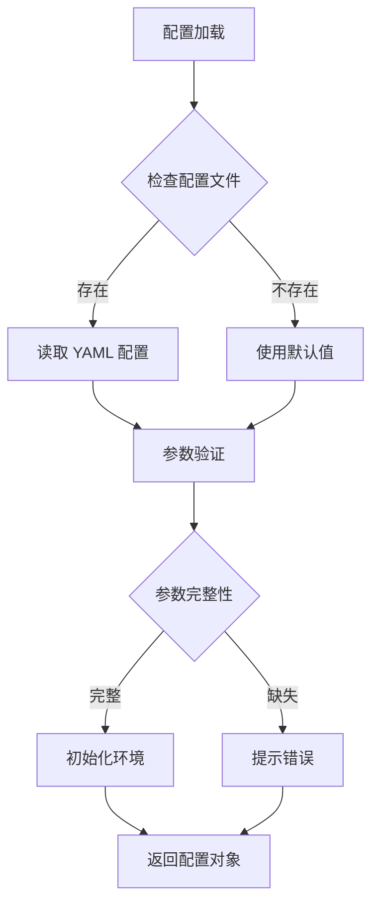
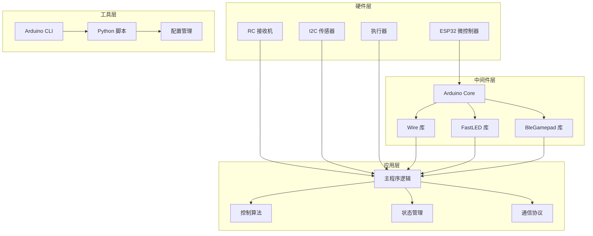
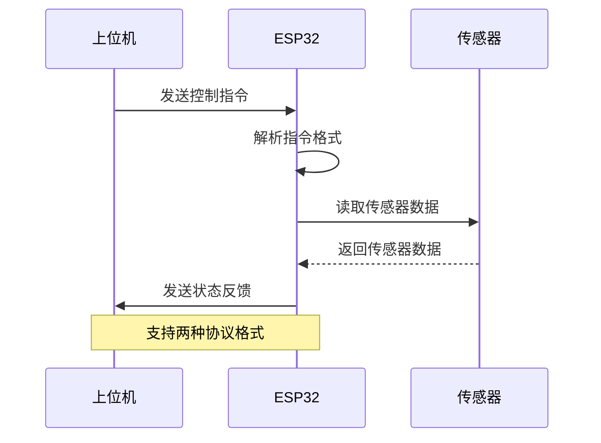
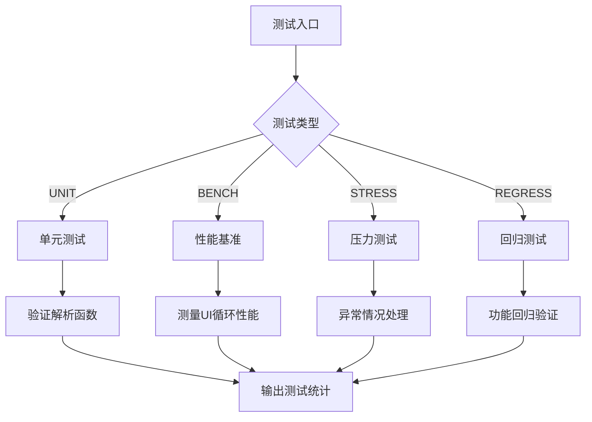
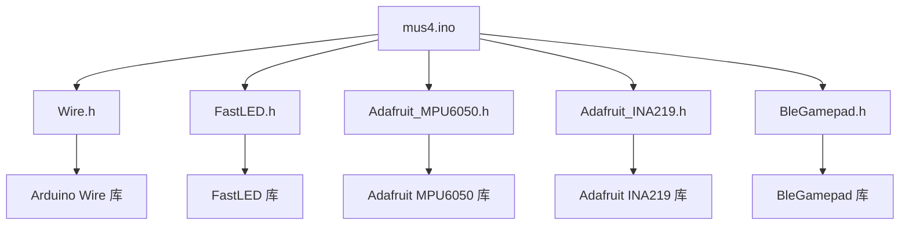
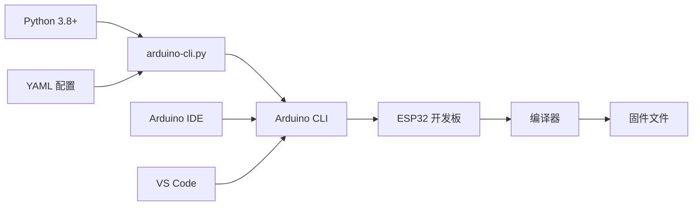
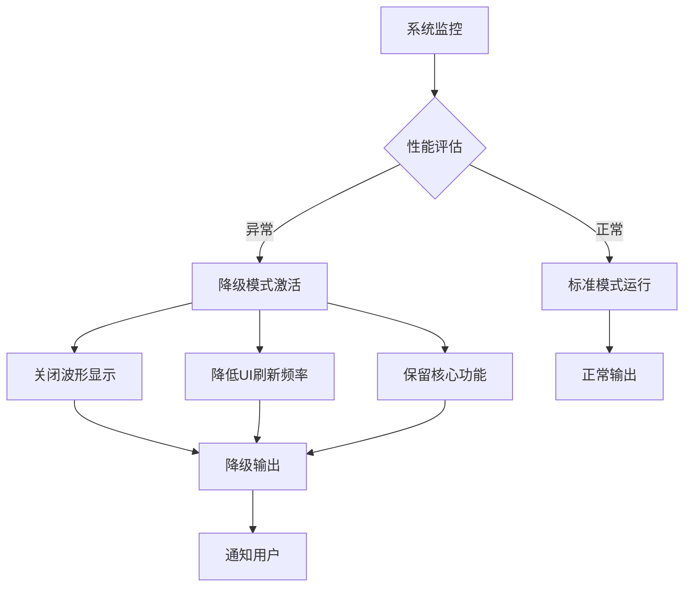
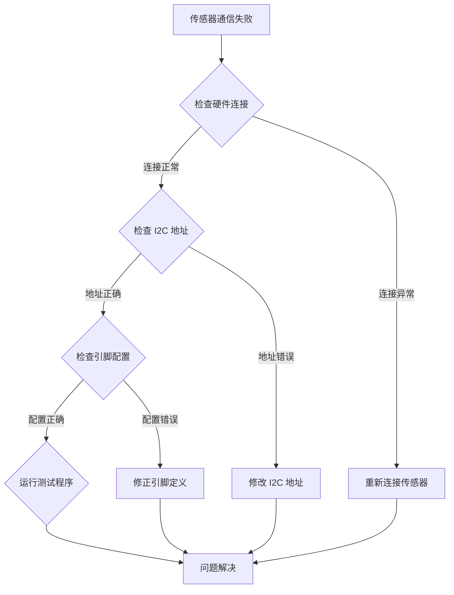

# 开发工具与配置

<cite>
**本文档引用的文件**
- [README.md](file://README.md)
- [config.yaml](file://config.yaml)
- [arduino-cli.py](file://arduino-cli.py)
- [mus4/sketch.yaml](file://mus4/sketch.yaml)
- [mus4/mus4.ino](file://mus4/mus4.ino)
- [docs/CONFIG.md](file://docs/CONFIG.md)
- [docs/OPERATIONS.md](file://docs/OPERATIONS.md)
- [mus4/Doc/README/DevNote.md](file://mus4/Doc/README/DevNote.md)
- [mus4/Doc/Hardware/pin_definitions.md](file://mus4/Doc/Hardware/pin_definitions.md)
- [mus4/Doc/Arch/architecture.md](file://mus4/Doc/Arch/architecture.md)
- [examples/getcurrent/getcurrent.ino](file://examples/getcurrent/getcurrent.ino)
- [examples/testIIC/testIIC.ino](file://examples/testIIC/testIIC.ino)
</cite>

## 更新摘要
**所做更改**
- 更新了命令行参数标志部分，反映监控选项从 -m 更改为 -p，端口选项从 -p 更改为 -P 的变更
- 修正了开发工具与配置章节中的命令行参数说明
- 更新了故障排除指南中的参数使用说明

## 目录
1. [简介](#简介)
2. [项目结构](#项目结构)
3. [核心组件](#核心组件)
4. [架构概览](#架构概览)
5. [详细组件分析](#详细组件分析)
6. [依赖关系分析](#依赖关系分析)
7. [性能考虑](#性能考虑)
8. [故障排除指南](#故障排除指南)
9. [结论](#结论)

## 简介

MUS4 是一个基于 ESP32 的自动驾驶小车控制系统，该项目提供了完整的开发工具链和配置管理。系统采用 Arduino IDE 和 Arduino CLI 进行开发，支持多种开发模式和调试功能。

## 项目结构

项目采用模块化组织方式，主要包含以下核心目录：



**图表来源**
- [README.md](file://README.md#L1-L39)
- [config.yaml](file://config.yaml#L1-L13)
- [arduino-cli.py](file://arduino-cli.py#L1-L315)

**章节来源**
- [README.md](file://README.md#L1-L39)
- [config.yaml](file://config.yaml#L1-L13)

## 核心组件

### Arduino CLI 自动化脚本

项目实现了完整的 Arduino CLI 自动化构建流程，支持编译、上传和串口监控功能。



**图表来源**
- [arduino-cli.py](file://arduino-cli.py#L92-L315)

### 配置管理系统

系统采用 YAML 配置文件进行参数管理，支持多环境配置和动态参数覆盖。



**图表来源**
- [config.yaml](file://config.yaml#L1-L13)
- [arduino-cli.py](file://arduino-cli.py#L114-L137)

**章节来源**
- [arduino-cli.py](file://arduino-cli.py#L1-L315)
- [config.yaml](file://config.yaml#L1-L13)

## 架构概览

系统采用分层架构设计，从底层硬件抽象到高层业务逻辑形成清晰的层次结构。



**图表来源**
- [mus4/mus4.ino](file://mus4/mus4.ino#L24-L34)
- [arduino-cli.py](file://arduino-cli.py#L92-L113)

## 详细组件分析

### 开发环境配置

#### Arduino CLI 环境设置

系统支持多种操作系统和开发环境配置：

| 配置项 | Windows | Linux | macOS |
|--------|---------|-------|-------|
| Arduino CLI | `arduino-cli` | `arduino-cli` | `arduino-cli` |
| 默认端口 | `COM9` | `/dev/ttyACM1` | `/dev/cu.usbmodem*` |
| FQBN | `esp32:esp32:esp32` | `esp32:esp32:esp32` | `esp32:esp32:esp32` |

#### Python 开发工具

项目使用 Python 3.8+ 开发自动化脚本，具备以下特性：

- **日志系统**：支持文件和控制台双重日志输出
- **进度指示**：命令行加载动画显示
- **错误处理**：完善的异常捕获和错误报告
- **跨平台支持**：自动检测操作系统类型

**章节来源**
- [arduino-cli.py](file://arduino-cli.py#L1-L315)
- [mus4/Doc/README/DevNote.md](file://mus4/Doc/README/DevNote.md#L3-L14)

### 命令行参数标志

#### 参数标志变更

**更新** 命令行参数标志已从旧版本的 `-m` 和 `-p` 更改为 `-p` 和 `-P`，消除了参数冲突并保持逻辑一致性：

| 参数类型 | 旧标志 | 新标志 | 说明 |
|----------|--------|--------|------|
| 编译操作 | 无 | `-c` | 执行编译操作 |
| 上传操作 | 无 | `-u` | 执行上传操作 |
| 监控操作 | `-m` | `-p` | 打开串口监控 |
| 端口配置 | `-p` | `-P` | 串口设备路径配置 |
| 波特率配置 | `-b` | `-b` | 串口波特率配置 |

#### 参数使用示例

```bash
# 编译项目
python arduino-cli.py -c

# 上传到指定端口
python arduino-cli.py -u --port COM9

# 打开串口监控
python arduino-cli.py -p --port COM9

# 编译并上传
python arduino-cli.py -c -u --port COM9

# 编译、上传并监控
python arduino-cli.py -c -u -p --port COM9
```

**章节来源**
- [arduino-cli.py](file://arduino-cli.py#L273-L287)

### 硬件配置与引脚定义

#### 引脚映射表

系统基于 MUS4-v2.3 PCB 版本的引脚配置：

| 功能 | 引脚编号 | 变量名 | 类型 | 描述 |
|------|----------|--------|------|------|
| RC 接收机输入 | GPIO 36 | CH1_PIN | Input Only | 转向通道 |
| RC 接收机输入 | GPIO 39 | CH2_PIN | Input Only | 油门通道 |
| RC 接收机输入 | GPIO 34 | CH3_PIN | Input Only | 停车通道 |
| RC 接收机输入 | GPIO 26 | CH4_PIN | Input | 模式通道 |
| 舵机输出 | GPIO 23 | STEERING_PIN | PWM Out | 转向舵机 |
| 电调输出 | GPIO 25 | THROTTLE_PIN | PWM Out | 电机电调 |
| I2C 数据 | GPIO 21 | SDA_PIN | I/O | 传感器数据线 |
| I2C 时钟 | GPIO 22 | SCL_PIN | Output | 传感器时钟线 |
| 串口接收 | GPIO 16 | RX_1_PIN | Input | 上位机数据接收 |
| 串口发送 | GPIO 17 | TX_1_PIN | Output | 状态数据发送 |
| LED 指示 | GPIO 5 | LED_PIN | Output | 状态指示灯 |
| UART 选择 | GPIO 12 | UART_SEL | Output | 串口路由控制 |

**章节来源**
- [mus4/Doc/Hardware/pin_definitions.md](file://mus4/Doc/Hardware/pin_definitions.md#L13-L28)
- [mus4/Doc/README/DevNote.md](file://mus4/Doc/README/DevNote.md#L31-L49)

### 通信协议配置

#### 串口通信协议

系统支持两种通信协议格式：



**图表来源**
- [docs/CONFIG.md](file://docs/CONFIG.md#L13-L16)
- [docs/OPERATIONS.md](file://docs/OPERATIONS.md#L14-L17)

#### 协议格式对比

| 协议类型 | 格式示例 | 校验方式 | 应答机制 |
|----------|----------|----------|----------|
| 基础格式 | `10:20\n` | 无校验 | `ACK`/`NACK` |
| 带校验格式 | `payload*CS\n` | ASCII求和低8位 | `ACK`/`NACK` |
| 命令格式 | `TEST/BENCH/STRESS/REGRESS` | 内置校验 | 测试结果 |

**章节来源**
- [docs/CONFIG.md](file://docs/CONFIG.md#L13-L23)
- [docs/OPERATIONS.md](file://docs/OPERATIONS.md#L8-L17)

### 调试与测试工具

#### 单元测试框架

系统内置完整的测试套件，支持多种测试场景：



**图表来源**
- [mus4/mus4.ino](file://mus4/mus4.ino#L153-L200)

#### 传感器测试示例

项目提供了专门的传感器测试示例：

| 测试类型 | 程序文件 | 功能描述 |
|----------|----------|----------|
| 电流监测 | `getcurrent.ino` | INA219 电压电流测试 |
| I2C 通信 | `testIIC.ino` | MPU6050 I2C 通信测试 |
| 设备扫描 | `testIIC.ino` | I2C 设备地址扫描 |

**章节来源**
- [examples/getcurrent/getcurrent.ino](file://examples/getcurrent/getcurrent.ino#L1-L55)
- [examples/testIIC/testIIC.ino](file://examples/testIIC/testIIC.ino#L1-L613)

## 依赖关系分析

### 外部库依赖

系统依赖以下关键库：



**图表来源**
- [mus4/mus4.ino](file://mus4/mus4.ino#L24-L34)

### 开发工具链依赖



**图表来源**
- [arduino-cli.py](file://arduino-cli.py#L1-L15)
- [config.yaml](file://config.yaml#L1-L13)

**章节来源**
- [arduino-cli.py](file://arduino-cli.py#L1-L315)
- [config.yaml](file://config.yaml#L1-L13)

## 性能考虑

### 降级模式机制

系统实现了智能降级机制，在资源紧张时自动优化性能：



**图表来源**
- [docs/CONFIG.md](file://docs/CONFIG.md#L3-L6)

### 自适应刷新策略

系统采用动态刷新频率调整机制：

| 组件 | 基础刷新间隔 | 最小刷新间隔 | 最大刷新间隔 | TTL 机制 |
|------|-------------|-------------|-------------|----------|
| 传感器数据 | 1000ms | 500ms | 2000ms | 1000ms |
| RC 数据 | 16ms | 10ms | 50ms | 100ms |
| UI 界面 | 16ms | 100ms | 500ms | 可变 |
| 输出控制 | 16ms | 10ms | 50ms | 100ms |

**章节来源**
- [docs/CONFIG.md](file://docs/CONFIG.md#L8-L11)
- [mus4/mus4.ino](file://mus4/mus4.ino#L109-L136)

## 故障排除指南

### 常见问题诊断

#### 端口连接问题

| 问题症状 | 可能原因 | 解决方案 |
|----------|----------|----------|
| 无法找到端口 | 端口配置错误 | 检查 `config.yaml` 中的 `port` 设置，使用新的 `-P` 参数 |
| 上传失败 | 端口被占用 | 关闭其他串口应用程序 |
| 串口无响应 | 波特率不匹配 | 确认波特率为 115200 |
| 平台不识别 | 开发板配置错误 | 检查 `fqbn` 设置为 `esp32:esp32:esp32` |

#### 参数使用问题

**更新** 命令行参数使用已更新，注意区分大小写和新标志：

| 问题症状 | 旧参数 | 新参数 | 解决方案 |
|----------|--------|--------|----------|
| 监控参数无效 | `-m` | `-p` | 使用新的 `-p` 参数启动监控 |
| 端口参数无效 | `-p` | `-P` | 使用新的 `-P` 参数指定端口 |
| 未指定操作 | `-c`, `-u`, `-m` | `-c`, `-u`, `-p` | 使用新的参数组合 |

#### 传感器通信问题



**图表来源**
- [examples/testIIC/testIIC.ino](file://examples/testIIC/testIIC.ino#L125-L224)

#### 蓝牙手柄连接问题

| 问题 | 症状 | 解决方法 |
|------|------|----------|
| 设备不可发现 | 手柄名称不显示 | 确认 `ENABLE_GAMEPAD_MODE` 宏已定义 |
| 连接不稳定 | 断开重连频繁 | 检查 BLE 信号强度 |
| 控制不灵敏 | 响应延迟 | 调整映射范围配置 |

**章节来源**
- [mus4/Doc/README/DevNote.md](file://mus4/Doc/README/DevNote.md#L74-L81)
- [arduino-cli.py](file://arduino-cli.py#L125-L137)

### 日志分析

系统提供详细的日志记录功能，支持不同级别的调试信息：

| 日志级别 | 用途 | 输出内容 |
|----------|------|----------|
| DEBUG | 详细调试信息 | 所有内部状态和变量 |
| INFO | 正常运行信息 | 关键操作和状态变化 |
| WARNING | 警告信息 | 可能的问题但不影响运行 |
| ERROR | 错误信息 | 失败的操作和异常情况 |

**章节来源**
- [arduino-cli.py](file://arduino-cli.py#L17-L56)
- [arduino-cli.py](file://arduino-cli.py#L39-L56)

## 结论

MUS4 项目提供了一个完整、可扩展的 ESP32 开发环境，具有以下特点：

1. **完整的工具链**：从开发到部署的一站式解决方案
2. **灵活的配置管理**：支持多环境和动态参数配置
3. **强大的测试能力**：内置全面的测试框架和调试工具
4. **智能性能优化**：自动降级和自适应刷新机制
5. **详细的文档支持**：涵盖硬件、软件和操作的完整文档

**更新** 项目已成功更新命令行参数标志，消除了参数冲突并保持了逻辑一致性。新的参数系统更加直观和符合预期，提高了开发效率和用户体验。

该系统为嵌入式开发提供了良好的基础，开发者可以根据具体需求进行扩展和定制。