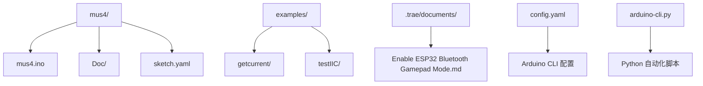
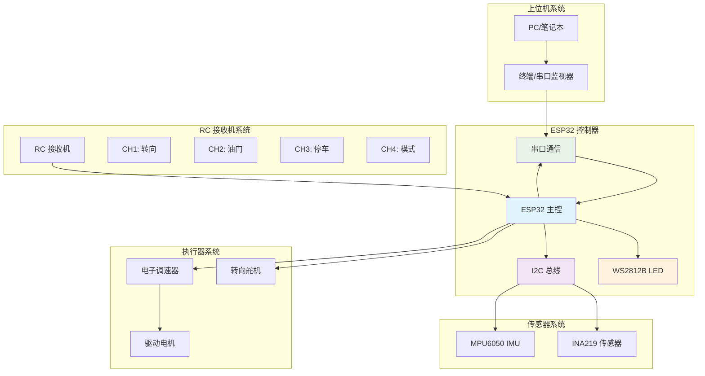
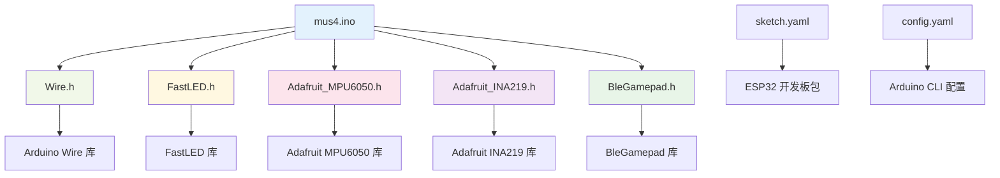

# 快速开始

<cite>
**本文引用的文件**
- [README.md](file://README.md)
- [mus4.ino](file://mus4/mus4.ino)
- [pin_definitions.md](file://mus4/Doc/Hardware/pin_definitions.md)
- [DevNote.md](file://mus4/Doc/README/DevNote.md)
- [sketch.yaml](file://mus4/sketch.yaml)
- [config.yaml](file://config.yaml)
- [getcurrent.ino](file://examples/getcurrent/getcurrent.ino)
- [testIIC.ino](file://examples/testIIC/testIIC.ino)
- [Enable ESP32 Bluetooth Gamepad Mode.md](file://.trae/documents/Enable ESP32 Bluetooth Gamepad Mode.md)
- [arduino-cli.py](file://arduino-cli.py)
</cite>

## 目录
1. [简介](#简介)
2. [项目结构](#项目结构)
3. [核心组件](#核心组件)
4. [架构概览](#架构概览)
5. [详细组件分析](#详细组件分析)
6. [依赖关系分析](#依赖关系分析)
7. [性能考虑](#性能考虑)
8. [故障排除指南](#故障排除指南)
9. [结论](#结论)
10. [附录](#附录)

## 简介
MUS4 是基于 ESP32 的自动驾驶小车控制系统，支持 RC 遥控、上位机串口控制、传感器数据采集和状态指示灯显示。本文档提供完整的快速开始指南，涵盖开发环境搭建、硬件连接、库安装、编译上传和串口监控等操作步骤。

## 项目结构
MUS4 项目采用模块化组织方式，主要包含以下目录和文件：



**图表来源**
- [mus4.ino](file://mus4/mus4.ino#L1-L50)
- [pin_definitions.md](file://mus4/Doc/Hardware/pin_definitions.md#L1-L30)
- [config.yaml](file://config.yaml#L1-L13)

**章节来源**
- [README.md](file://README.md#L1-L39)
- [mus4.ino](file://mus4/mus4.ino#L1-L100)

## 核心组件
MUS4 系统的核心组件包括：

### 硬件组件
- **ESP32 主控芯片**：运行主程序逻辑
- **RC 接收机**：提供遥控信号输入
- **执行器**：舵机和电调控制
- **传感器**：INA219 电压电流监测、MPU6050 IMU 传感器
- **状态指示灯**：WS2812B RGB LED

### 软件组件
- **主程序**：处理 RC 信号、传感器数据和执行器控制
- **串口通信**：支持上位机 RS232 通信
- **蓝牙手柄模式**：可选的 BLE 游戏手柄功能
- **I2C 设备管理**：传感器初始化和数据读取

**章节来源**
- [mus4.ino](file://mus4/mus4.ino#L24-L35)
- [pin_definitions.md](file://mus4/Doc/Hardware/pin_definitions.md#L13-L28)

## 架构概览



**图表来源**
- [mus4.ino](file://mus4/mus4.ino#L115-L180)
- [pin_definitions.md](file://mus4/Doc/Hardware/pin_definitions.md#L115-L181)

## 详细组件分析

### 硬件引脚定义与连接

#### RC 接收机输入通道
- **CH1 (GPIO 36)**：连接接收机方向通道
- **CH2 (GPIO 39)**：连接接收机油门通道  
- **CH3 (GPIO 34)**：连接接收机停车通道
- **CH4 (GPIO 26)**：连接接收机模式通道

#### 执行器输出通道
- **Steering (GPIO 23)**：连接舵机信号线
- **Throttle (GPIO 25)**：连接电调信号线

#### 串行通信接口
- **GPIO 16 (RX1)**：接收来自上位机的控制指令
- **GPIO 17 (TX1)**：向上位机回传状态信息

#### I2C 接口
- **GPIO 21 (SDA)**：连接 INA219 和 MPU6050 数据线
- **GPIO 22 (SCL)**：连接 INA219 和 MPU6050 时钟线

**章节来源**
- [pin_definitions.md](file://mus4/Doc/Hardware/pin_definitions.md#L34-L101)

### 传感器系统

#### INA219 电压电流监测
- **功能**：实时监测电机供电电压、电流和功率
- **初始化**：使用默认校准（32V, 2A范围）
- **数据读取**：每秒更新一次传感器数据

#### MPU6050 IMU 传感器
- **功能**：提供加速度、角速度和温度数据
- **初始化**：自动检测设备并进行唤醒
- **数据读取**：每秒更新一次传感器数据

**章节来源**
- [mus4.ino](file://mus4/mus4.ino#L841-L896)
- [mus4.ino](file://mus4/mus4.ino#L898-L950)

### 串口通信协议

#### 协议格式
- **格式**：`T:S\n`
- **含义**：
  - `T`：Throttle（油门值，-100到100）
  - `S`：Steering（转向值，-100到100）
  - `\n`：换行符

#### 通信特性
- **波特率**：115200
- **数据类型**：ASCII 字符串
- **校验机制**：支持简单的校验和验证

**章节来源**
- [DevNote.md](file://mus4/Doc/README/DevNote.md#L24-L29)
- [mus4.ino](file://mus4/mus4.ino#L320-L342)

## 依赖关系分析



**图表来源**
- [mus4.ino](file://mus4/mus4.ino#L24-L34)
- [sketch.yaml](file://mus4/sketch.yaml#L1-L3)
- [config.yaml](file://config.yaml#L1-L8)

**章节来源**
- [mus4.ino](file://mus4/mus4.ino#L24-L34)
- [sketch.yaml](file://mus4/sketch.yaml#L1-L3)

## 性能考虑
- **更新频率**：传感器数据每秒更新，RC 数据约每16ms更新
- **UI 刷新**：界面每16ms刷新一次，保证流畅体验
- **内存管理**：使用静态分配避免动态内存碎片
- **中断处理**：RC 信号使用中断方式处理，减少 CPU 占用

## 故障排除指南

### 常见问题及解决方案

#### 1. 编译错误
**症状**：编译过程中出现库缺失错误
**解决方法**：
- 确认所有必需库已正确安装
- 检查 Arduino IDE 的库管理器
- 验证库版本兼容性

#### 2. 上传失败
**症状**：上传过程中出现端口错误
**解决方法**：
- 检查 USB 线缆连接
- 确认正确的串口端口选择
- 验证开发板类型设置

#### 3. 传感器数据异常
**症状**：INA219 或 MPU6050 读数为 0
**解决方法**：
- 检查 I2C 连接线是否正确
- 验证上拉电阻是否安装
- 使用 I2C 扫描工具检测设备

#### 4. RC 信号不稳定
**症状**：遥控器响应迟缓或无响应
**解决方法**：
- 检查 RC 接收机天线连接
- 确认 RC 信号线屏蔽层良好
- 验证 PWM 频率设置

**章节来源**
- [mus4.ino](file://mus4/mus4.ino#L868-L896)
- [testIIC.ino](file://examples/testIIC/testIIC.ino#L125-L224)

## 结论
MUS4 项目提供了完整的自动驾驶小车控制解决方案，具有良好的模块化设计和丰富的功能特性。通过遵循本文档的快速开始指南，开发者可以快速搭建开发环境并成功运行项目。项目支持多种控制模式和扩展功能，为后续开发提供了良好的基础。

## 附录

### 开发环境搭建步骤

#### 步骤 1：安装 Arduino IDE
1. 访问 Arduino 官网下载最新版本
2. 按照安装向导完成安装
3. 启动 Arduino IDE 并检查版本

#### 步骤 2：安装 ESP32 板包
1. 打开 Arduino IDE
2. 进入 文件 → 首选项
3. 在"附加开发板管理器网址"中添加：
   ```
   https://espressif.github.io/arduino-esp32/package_esp32_index.json
   ```
4. 打开 工具 → 开发板 → 开发板管理器
5. 搜索并安装 "esp32 by Espressif Systems"

#### 步骤 3：安装必要库
1. 打开 工具 → 库管理器
2. 搜索并安装以下库：
   - FastLED
   - Adafruit MPU6050
   - Adafruit INA219
   - BleGamepad

#### 步骤 4：配置开发环境
1. 连接 ESP32 开发板到电脑
2. 在 工具 → 开发板 中选择合适的板型
3. 在 工具 → 端口中选择正确的串口
4. 设置波特率为 115200

### 硬件连接说明

#### RC 接收机连接
- CH1 (方向) → GPIO 36
- CH2 (油门) → GPIO 39  
- CH3 (停车) → GPIO 34
- CH4 (模式) → GPIO 26

#### 执行器连接
- 舵机信号线 → GPIO 23
- 电调信号线 → GPIO 25

#### 传感器连接
- INA219 SDA → GPIO 21
- INA219 SCL → GPIO 22
- MPU6050 SDA → GPIO 21
- MPU6050 SCL → GPIO 22

#### 串口连接
- 上位机 RX → GPIO 16
- 上位机 TX → GPIO 17

### 第一次编译和上传流程

#### 方法一：使用 Arduino IDE
1. 打开 mus4/mus4.ino 文件
2. 点击"验证"按钮检查语法
3. 点击"上传"按钮编译并上传
4. 观察串口监视器输出

#### 方法二：使用 Arduino CLI
1. 打开命令提示符
2. 导航到项目根目录
3. 执行编译命令：
   ```bash
   arduino-cli compile --fqbn esp32:esp32:esp32 mus4/mus4.ino
   ```
4. 执行上传命令：
   ```bash
   arduino-cli upload -p COM9 --fqbn esp32:esp32:esp32 mus4/mus4.ino
   ```

### 串口监视器使用方法

#### 基本使用
1. 打开 工具 → 串口监视器
2. 设置波特率为 115200
3. 选择正确的串口端口
4. 观察实时输出信息

#### 调试功能
- **TEST 命令**：运行单元测试
- **BENCH 命令**：运行性能基准测试
- **STRESS 命令**：运行压力测试
- **REGRESS 命令**：运行回归测试

#### 传感器数据查看
系统会定期输出传感器数据：
- INA219：电压、电流、功率
- MPU6050：加速度、角速度、温度
- RC 通道：CH1-CH4 PWM 值

**章节来源**
- [DevNote.md](file://mus4/Doc/README/DevNote.md#L15-L30)
- [mus4.ino](file://mus4/mus4.ino#L355-L378)