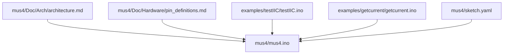
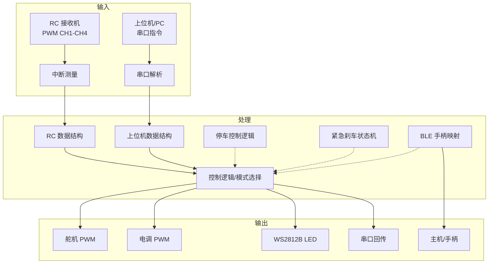
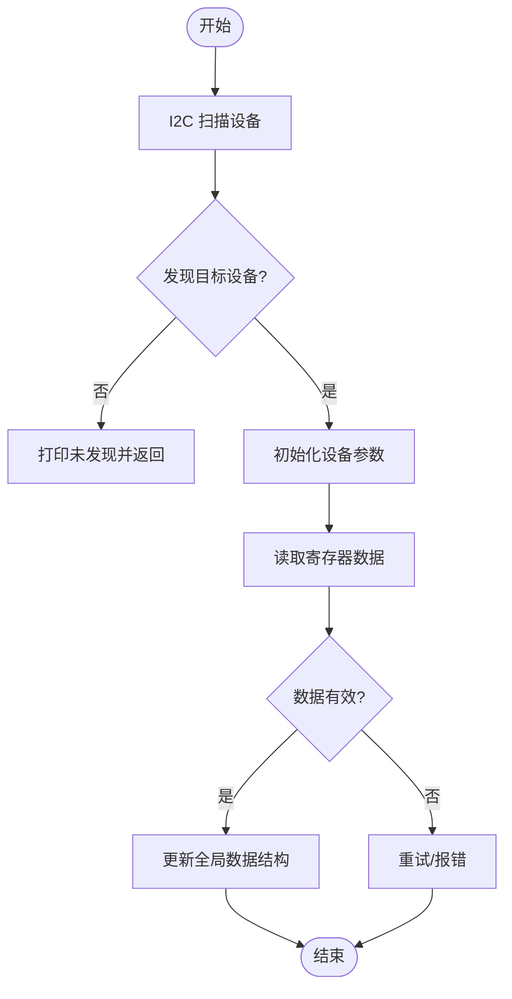
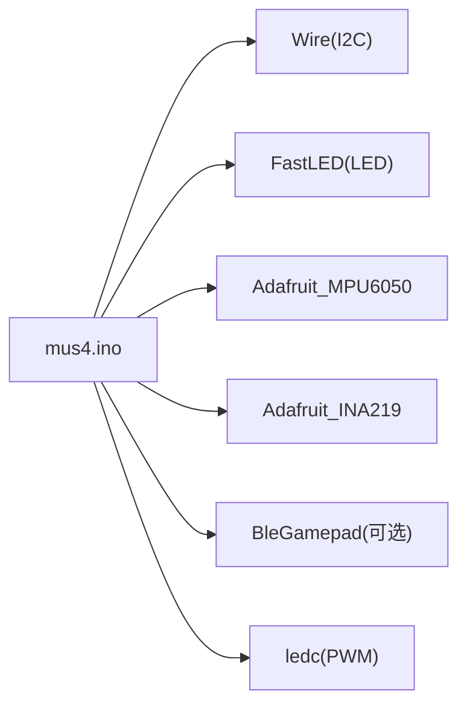

# 扩展与定制

<cite>
**本文引用的文件列表**
- [README.md](file://README.md)
- [mus4.ino](file://mus4/mus4.ino)
- [architecture.md](file://mus4/Doc/Arch/architecture.md)
- [pin_definitions.md](file://mus4/Doc/Hardware/pin_definitions.md)
- [sketch.yaml](file://mus4/sketch.yaml)
- [testIIC.ino](file://examples/testIIC/testIIC.ino)
- [getcurrent.ino](file://examples/getcurrent/getcurrent.ino)
</cite>

## 目录
1. [简介](#简介)
2. [项目结构](#项目结构)
3. [核心组件](#核心组件)
4. [架构总览](#架构总览)
5. [详细组件分析](#详细组件分析)
6. [依赖关系分析](#依赖关系分析)
7. [性能考量](#性能考量)
8. [故障排查指南](#故障排查指南)
9. [结论](#结论)
10. [附录](#附录)

## 简介
本指南面向希望在 MUS4（基于 ESP32 的自动驾驶小车控制固件）上进行功能扩展与定制的开发者。内容覆盖新增功能模块、扩展硬件接口（I2C、PWM）、集成新传感器与新通信协议的方法；同时提供代码修改最佳实践、向后兼容性保障策略、性能影响评估方法，以及集成测试流程与示例路径，帮助你在不破坏现有功能的前提下安全地扩展系统能力。

## 项目结构
- 文档与架构：位于 mus4/Doc，包含架构文档与硬件引脚定义，是扩展设计的重要依据。
- 核心固件：mus4/mus4.ino，包含主控制逻辑、I2C 读写、传感器初始化与读取、RC 输入处理、串口通信、LED 状态指示、BLE 手柄映射等。
- 示例工程：examples/ 下提供 I2C 测试与 INA219 电流读取示例，便于验证与扩展 I2C 与传感器链路。
- 开发环境：mus4/sketch.yaml 指定默认开发板与端口，便于快速构建与部署。



图表来源
- [architecture.md](file://mus4/Doc/Arch/architecture.md#L1-L245)
- [mus4.ino](file://mus4/mus4.ino#L1-L1290)
- [pin_definitions.md](file://mus4/Doc/Hardware/pin_definitions.md#L1-L225)
- [testIIC.ino](file://examples/testIIC/testIIC.ino#L1-L613)
- [getcurrent.ino](file://examples/getcurrent/getcurrent.ino#L1-L55)
- [sketch.yaml](file://mus4/sketch.yaml#L1-L3)

章节来源
- [README.md](file://README.md#L1-L39)
- [sketch.yaml](file://mus4/sketch.yaml#L1-L3)

## 核心组件
- 信号采集与输入处理
  - RC 接收机 PWM 输入（CH1-CH4），通过中断测量脉宽并映射到控制域。
  - 上位机串口指令解析（Throttle:Steering），支持校验与错误反馈。
- 控制逻辑与模式切换
  - 手动/半自动/全自动驾驶模式，结合停车状态与紧急刹车状态机。
- 执行输出
  - 舵机与电调 PWM 输出，使用 ledc 库生成 50Hz 信号。
- 传感器与状态指示
  - I2C 传感器（INA219、MPU6050）读取与 UI 展示；WS2812B LED 状态指示。
- 通信与外设
  - 串口（USB/RS232）通信；可选 BLE Gamepad 模式。

章节来源
- [mus4.ino](file://mus4/mus4.ino#L1-L1290)
- [architecture.md](file://mus4/Doc/Arch/architecture.md#L1-L245)
- [pin_definitions.md](file://mus4/Doc/Hardware/pin_definitions.md#L1-L225)

## 架构总览
下图展示输入、处理、输出与状态指示的整体数据流与模块边界，便于扩展时定位接口与耦合点。



图表来源
- [architecture.md](file://mus4/Doc/Arch/architecture.md#L18-L45)
- [mus4.ino](file://mus4/mus4.ino#L1104-L1290)

## 详细组件分析

### I2C 接口扩展方法
- 现状与能力
  - 已启用 I2C（SDA=GPIO21, SCL=GPIO22），支持扫描、读写与传感器初始化。
  - 提供通用 I2C 读写封装与设备识别流程，便于接入新传感器。
- 扩展步骤
  1) 硬件连接：确认 I2C 引脚与电源/地线连接正确，必要时增加上拉电阻。
  2) 设备检测：使用扫描函数识别设备地址，避免地址冲突。
  3) 读写封装：参考现有 I2CRead/I2CWriteValue 与 I2CReadValue 的实现风格，封装新设备寄存器访问。
  4) 初始化与校准：在 setup 阶段完成设备初始化与参数配置，失败时提供明确错误提示。
  5) 数据更新：在主循环固定周期内读取数据，更新全局数据结构并参与控制或 UI 展示。
- 示例路径
  - I2C 扫描与读写封装：[I2CRead/I2CWriteValue](file://mus4/mus4.ino#L789-L839)
  - 设备扫描与识别：[scanI2CBus](file://mus4/mus4.ino#L922-L975)
  - 传感器初始化与错误处理：[setup_ina219/setup_mpu6050](file://mus4/mus4.ino#L868-L1082)
  - I2C 功能测试示例：[testIIC.ino](file://examples/testIIC/testIIC.ino#L1-L613)



图表来源
- [mus4.ino](file://mus4/mus4.ino#L789-L839)
- [mus4.ino](file://mus4/mus4.ino#L922-L975)
- [mus4.ino](file://mus4/mus4.ino#L868-L1082)

章节来源
- [mus4.ino](file://mus4/mus4.ino#L789-L839)
- [mus4.ino](file://mus4/mus4.ino#L922-L975)
- [mus4.ino](file://mus4/mus4.ino#L868-L1082)
- [testIIC.ino](file://examples/testIIC/testIIC.ino#L1-L613)

### PWM 输出扩展
- 现状与能力
  - 使用 ledc 库生成 50Hz PWM，分别驱动舵机与电调。
  - 已预留两个 PWM 输出引脚（GPIO32/33），当前未使用。
- 扩展步骤
  1) 硬件连接：将新执行器连接至预留 PWM 引脚或可用 GPIO（注意 PWM 频率与占空比范围）。
  2) 通道绑定：为新 PWM 引脚调用通道绑定函数，设置频率与分辨率。
  3) 控制映射：将控制域值映射到新的 PWM 计数值范围，加入约束与限幅。
  4) 输出写入：在主循环中写入 PWM 值，确保与现有输出节奏一致。
- 示例路径
  - PWM 通道绑定与写入：[ledcAttachChannel/ledcWriteChannel](file://mus4/mus4.ino#L1133-L1134)
  - PWM 输出写入：[ledcWriteChannel](file://mus4/mus4.ino#L1274-L1276)
  - 硬件引脚定义与预留 PWM：[pin_definitions.md](file://mus4/Doc/Hardware/pin_definitions.md#L103-L109)

```mermaid
sequenceDiagram
participant Loop as "主循环"
participant Map as "映射函数"
participant Ledc as "ledcWriteChannel"
participant HW as "执行器"
Loop->>Map : "控制域值(-100~100)"
Map-->>Loop : "PWM 计数值(含限幅)"
Loop->>Ledc : "写入 PWM 计数值"
Ledc-->>HW : "输出 PWM 信号"
```

图表来源
- [mus4.ino](file://mus4/mus4.ino#L1269-L1276)
- [mus4.ino](file://mus4/mus4.ino#L1133-L1134)

章节来源
- [mus4.ino](file://mus4/mus4.ino#L1133-L1134)
- [mus4.ino](file://mus4/mus4.ino#L1269-L1276)
- [pin_definitions.md](file://mus4/Doc/Hardware/pin_definitions.md#L103-L109)

### 新传感器集成
- 建议流程
  1) 选择 I2C 地址与寄存器布局，参考现有传感器初始化与读取流程。
  2) 在全局数据结构中新增传感器数据字段，维护读取时间戳与有效性标记。
  3) 在固定周期读取任务中更新数据，失败时保持无效状态并记录错误。
  4) 在 UI 或日志中展示传感器状态，便于调试与监控。
- 示例路径
  - 传感器数据结构与读取：[SensorData/read_ina219/read_mpu6050](file://mus4/mus4.ino#L208-L220)
  - 传感器读取与 UI 展示：[showMainUI](file://mus4/mus4.ino#L588-L684)
  - 传感器初始化与错误处理：[setup_ina219/setup_mpu6050](file://mus4/mus4.ino#L868-L1082)
  - 电流读取示例：[getcurrent.ino](file://examples/getcurrent/getcurrent.ino#L1-L55)

章节来源
- [mus4.ino](file://mus4/mus4.ino#L208-L220)
- [mus4.ino](file://mus4/mus4.ino#L588-L684)
- [mus4.ino](file://mus4/mus4.ino#L868-L1082)
- [getcurrent.ino](file://examples/getcurrent/getcurrent.ino#L1-L55)

### 新通信协议支持
- 串口协议扩展
  - 现有协议：Throttle:Steering\n，带校验码（*XX）可选。
  - 扩展建议：在串口解析处增加命令类型识别与路由，保持与现有 ACK/NACK 机制一致。
- I2C 协议扩展
  - 参考现有 I2C 读写封装，新增设备特定寄存器访问函数，统一错误处理与日志输出。
- 示例路径
  - 串口解析与校验：[processLine/parseAndValidateCommand](file://mus4/mus4.ino#L320-L389)
  - I2C 读写封装：[I2CRead/I2CWriteValue](file://mus4/mus4.ino#L789-L839)
  - I2C 测试套件：[testIIC.ino](file://examples/testIIC/testIIC.ino#L1-L613)

章节来源
- [mus4.ino](file://mus4/mus4.ino#L320-L389)
- [mus4.ino](file://mus4/mus4.ino#L789-L839)
- [testIIC.ino](file://examples/testIIC/testIIC.ino#L1-L613)

### 控制算法定制
- 模式与控制域
  - 控制域统一为 -100~100，不同模式下来源不同：RC、上位机或混合。
  - 紧急刹车状态机与停车逻辑确保安全。
- 定制建议
  - 在控制逻辑中引入新的控制算法（如 PID、滤波器），保持输入输出域不变，确保与现有映射兼容。
  - 通过宏或配置项切换算法，避免破坏默认行为。
- 示例路径
  - 模式切换与控制输出：[loop 中模式分支](file://mus4/mus4.ino#L1152-L1249)
  - 紧急刹车状态机：[emergencyStop](file://mus4/mus4.ino#L474-L525)
  - 停车控制逻辑：[park_change](file://mus4/mus4.ino#L686-L740)

章节来源
- [mus4.ino](file://mus4/mus4.ino#L1152-L1249)
- [mus4.ino](file://mus4/mus4.ino#L474-L525)
- [mus4.ino](file://mus4/mus4.ino#L686-L740)

## 依赖关系分析
- 硬件依赖
  - I2C 引脚（GPIO21/22）、PWM 引脚（GPIO23/25/32/33）、串口引脚（GPIO16/17）、LED 引脚（GPIO5）。
- 库依赖
  - Wire（I2C）、FastLED（LED）、Adafruit_MPU6050/Adafruit_INA219（传感器）、BleGamepad（可选）。
- 模块耦合
  - 传感器读取与 UI 展示解耦，通过全局数据结构共享；控制逻辑与输出解耦，通过中间结构传递。



图表来源
- [mus4.ino](file://mus4/mus4.ino#L24-L34)
- [mus4.ino](file://mus4/mus4.ino#L1133-L1134)

章节来源
- [mus4.ino](file://mus4/mus4.ino#L24-L34)
- [mus4.ino](file://mus4/mus4.ino#L1133-L1134)

## 性能考量
- 周期性任务
  - 传感器更新：约 1Hz；RC 数据更新：约 60Hz；UI 更新：约 60Hz。
- 资源占用
  - I2C 读写与传感器初始化在启动阶段完成；主循环中尽量减少阻塞操作。
- 降级机制
  - UI 周期动态调节，当 UI 周期超过阈值时自动延长刷新间隔，避免系统过载。
- 示例路径
  - 周期与降级评估：[主循环定时与降级评估](file://mus4/mus4.ino#L1152-L1290)

章节来源
- [mus4.ino](file://mus4/mus4.ino#L1152-L1290)

## 故障排查指南
- I2C 设备未被发现
  - 检查硬件连接与上拉电阻；使用扫描函数定位地址冲突或通信错误。
- 传感器初始化失败
  - 查看错误日志与可能原因（地址、接线、电源）；尝试不同校准参数。
- 串口通信异常
  - 核对接收/发送引脚与波特率；检查校验与帧格式。
- 示例路径
  - I2C 扫描与错误日志：[scanI2CBus](file://mus4/mus4.ino#L922-L975)
  - 传感器初始化错误处理：[setup_ina219/setup_mpu6050](file://mus4/mus4.ino#L868-L1082)
  - 串口解析与错误反馈：[readSerialBuf](file://mus4/mus4.ino#L344-L411)

章节来源
- [mus4.ino](file://mus4/mus4.ino#L922-L975)
- [mus4.ino](file://mus4/mus4.ino#L868-L1082)
- [mus4.ino](file://mus4/mus4.ino#L344-L411)

## 结论
通过遵循本文档的扩展与定制方法，可以在不破坏现有功能的前提下，安全地添加新功能模块、扩展硬件接口、集成新传感器与通信协议。建议始终以“最小改动、强健错误处理、清晰日志”为原则，配合示例工程与测试流程，确保扩展后的系统具备良好的向后兼容性与可维护性。

## 附录

### 扩展示例与最佳实践清单
- I2C 扩展
  - 使用扫描函数定位设备，封装读写函数，失败时记录错误并保持系统稳定。
  - 示例路径：[scanI2CBus](file://mus4/mus4.ino#L922-L975)，[I2CRead/I2CWriteValue](file://mus4/mus4.ino#L789-L839)
- PWM 扩展
  - 为新执行器绑定通道并设置频率/分辨率；映射控制域到 PWM 计数值并限幅。
  - 示例路径：[ledcAttachChannel/ledcWriteChannel](file://mus4/mus4.ino#L1133-L1134)
- 传感器集成
  - 在全局数据结构中新增字段，固定周期读取并更新 UI；失败保持无效状态。
  - 示例路径：[SensorData/read_mpu6050](file://mus4/mus4.ino#L898-L921)
- 通信协议扩展
  - 在串口解析中增加命令类型识别与校验；I2C 协议遵循现有封装风格。
  - 示例路径：[processLine](file://mus4/mus4.ino#L320-L342)，[I2CRead](file://mus4/mus4.ino#L789-L811)
- 向后兼容性
  - 通过宏或配置项切换新功能；保持默认行为不变；提供降级与恢复机制。
- 性能影响评估
  - 监控 UI 周期与降级评估，避免在扩展中引入阻塞操作；使用示例工程进行压力测试。
  - 示例路径：[主循环降级评估](file://mus4/mus4.ino#L1282-L1288)，[I2C 压力测试](file://examples/testIIC/testIIC.ino#L471-L521)