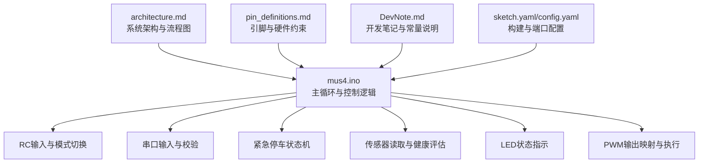
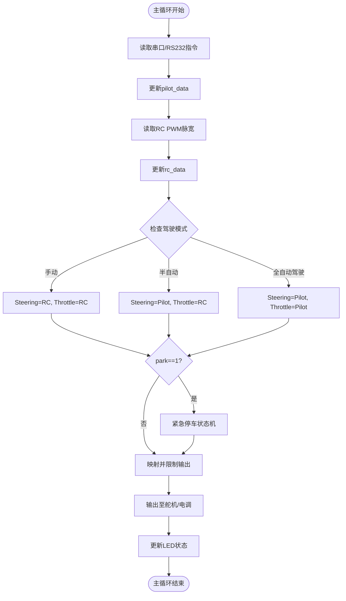
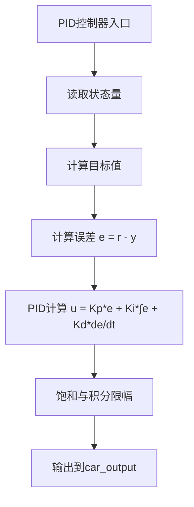
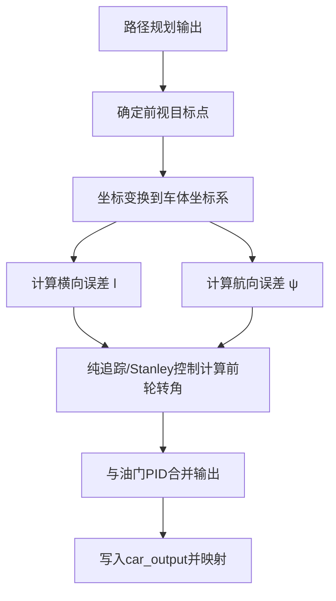
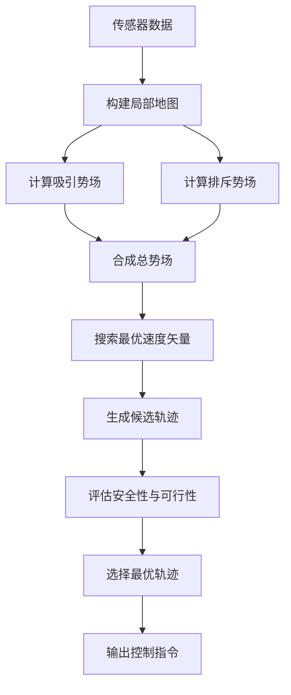
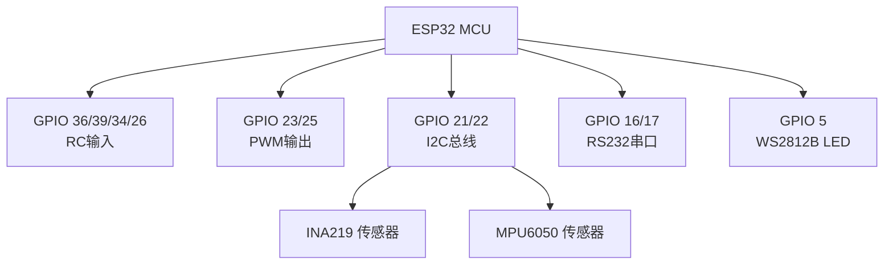

# 控制定律定制

<cite>
**本文引用的文件**
- [README.md](file://README.md)
- [mus4.ino](file://mus4/mus4.ino)
- [architecture.md](file://mus4/Doc/Arch/architecture.md)
- [DevNote.md](file://mus4/Doc/README/DevNote.md)
- [pin_definitions.md](file://mus4/Doc/Hardware/pin_definitions.md)
- [sketch.yaml](file://mus4/sketch.yaml)
- [config.yaml](file://config.yaml)
</cite>

## 目录
1. [简介](#简介)
2. [项目结构](#项目结构)
3. [核心组件](#核心组件)
4. [架构总览](#架构总览)
5. [详细组件分析](#详细组件分析)
6. [依赖分析](#依赖分析)
7. [性能考虑](#性能考虑)
8. [故障排查指南](#故障排查指南)
9. [结论](#结论)
10. [附录](#附录)

## 简介
本指南面向MUS4项目，聚焦于控制算法的定制与优化，包括：
- PID控制算法的修改与参数调节
- 路径跟踪算法的实现与参数整定
- 避障算法的设计与边界处理
- 实时性保障与性能优化
- 不同驾驶模式下的算法差异与自适应策略
- 故障恢复机制与稳定性分析

当前仓库中未包含显式的PID、路径跟踪或避障算法实现，但提供了完整的输入采集、模式切换、紧急制动与输出映射等基础框架。本指南将基于现有代码结构，给出可落地的定制方案与最佳实践。

## 项目结构
- 核心程序位于mus4/mus4.ino，包含RC输入、串口输入、模式切换、紧急停车、传感器读取、LED指示与PWM输出等完整闭环。
- 文档位于mus4/Doc目录，包含架构、硬件引脚定义与开发笔记，便于理解系统行为与硬件约束。
- 构建配置位于根目录的sketch.yaml与config.yaml，定义了FQBN、端口、波特率与构建路径。



图表来源
- [mus4.ino](file://mus4/mus4.ino#L1104-L1290)
- [architecture.md](file://mus4/Doc/Arch/architecture.md#L1-L245)
- [pin_definitions.md](file://mus4/Doc/Hardware/pin_definitions.md#L1-L225)
- [DevNote.md](file://mus4/Doc/README/DevNote.md#L1-L122)

章节来源
- [mus4.ino](file://mus4/mus4.ino#L1104-L1290)
- [architecture.md](file://mus4/Doc/Arch/architecture.md#L1-L245)
- [DevNote.md](file://mus4/Doc/README/DevNote.md#L1-L122)
- [pin_definitions.md](file://mus4/Doc/Hardware/pin_definitions.md#L1-L225)
- [sketch.yaml](file://mus4/sketch.yaml#L1-L3)
- [config.yaml](file://config.yaml#L1-L13)

## 核心组件
- 输入采集与解析
  - RC PWM输入：CH1-CH4，使用中断测量脉宽，解析为内部控制量。
  - 串口输入：Throttle:Steering\n，带校验的命令帧，解析后写入pilot_data。
- 模式与状态
  - 驾驶模式：手动/半自动/全自动驾驶，对应不同的控制权分配与LED颜色。
  - 停车/解锁：CH3按键长按实现，带超时判断与状态机。
  - 紧急停车：park触发后进入状态机，分阶段输出不同油门值。
- 执行与输出
  - 输出映射：将-100~100的控制量映射到舵机/电调的脉宽范围，并限制在PWM_MIN~PWM_MAX。
  - PWM输出：使用ledc生成50Hz、14bit分辨率的PWM信号。
- 传感器与健康评估
  - INA219与MPU6050通过I2C读取，周期性更新；UI周期动态评估，异常时进入降级模式。
- 蓝牙手柄模式（可选）
  - ENABLE_GAMEPAD_MODE宏开启后，RC信号映射为BLE手柄输入。

章节来源
- [mus4.ino](file://mus4/mus4.ino#L414-L473)
- [mus4.ino](file://mus4/mus4.ino#L742-L786)
- [mus4.ino](file://mus4/mus4.ino#L1152-L1290)
- [mus4.ino](file://mus4/mus4.ino#L841-L920)
- [mus4.ino](file://mus4/mus4.ino#L1087-L1102)
- [architecture.md](file://mus4/Doc/Arch/architecture.md#L109-L160)

## 架构总览
系统采用“输入-决策-执行-反馈”的闭环结构，主循环每轮完成输入读取、模式选择、输出映射与执行，同时维护UI与健康评估。



图表来源
- [mus4.ino](file://mus4/mus4.ino#L1152-L1290)
- [architecture.md](file://mus4/Doc/Arch/architecture.md#L70-L107)

章节来源
- [architecture.md](file://mus4/Doc/Arch/architecture.md#L70-L107)
- [mus4.ino](file://mus4/mus4.ino#L1152-L1290)

## 详细组件分析

### 1) PID控制算法定制
当前代码未包含显式的PID实现，但可在“模式选择”与“输出映射”之间插入PID控制器，形成如下结构：
- 输入：期望目标（如路径曲率、速度设定点）、当前状态（IMU/编码器/视觉估计）。
- 计算：PID计算得到油门/转向的增量或目标值。
- 输出：与现有映射逻辑结合，统一进入car_output并限幅。



参数调节方法
- 先比例后积分再微分，逐步增加Kp至出现轻微振荡，再引入Ki消除静差，最后加入Kd抑制震荡。
- 使用阶跃响应法或Ziegler-Nichols法进行初步整定，再结合实车试验微调。
- 针对不同模式：
  - 手动模式：保持简单比例控制，避免过度积分导致漂移。
  - 半自动模式：转向由Pilot提供，油门PID负责速度/加速度稳定。
  - 全自动驾驶：综合路径规划与动力学模型，采用解耦控制或MPC/模型预测。

性能优化技巧
- 采样周期与滤波：在主循环固定周期内执行PID，避免抖动；对传感器信号加滑动平均或一阶低通滤波。
- 抗积分饱和：采用积分分离、输出限幅与反向饱和回路。
- 数值稳定性：使用增量式PID减少累积误差；对微分项加低通滤波。

实时性保证
- 将PID计算置于主循环高频段，确保不阻塞串口/RC读取。
- 使用定点运算或固定小数位，避免浮点开销。
- 优先级调度：将传感器读取、模式切换与输出写入放在同一时间片内。

章节来源
- [mus4.ino](file://mus4/mus4.ino#L1152-L1290)
- [DevNote.md](file://mus4/Doc/README/DevNote.md#L103-L117)

### 2) 路径跟踪算法
路径跟踪可基于纯追踪（Pure Pursuit）或Stanley控制等经典方法，结合IMU/视觉/编码器信息实现：
- 目标点生成：根据路径规划与当前车体姿态，计算前视距离的目标点。
- 车体坐标变换：将目标点投影到车体坐标系，计算横向误差与航向误差。
- 控制输出：将误差映射为前轮转角（或角速度），与油门PID协同。



参数整定
- 前视距离：根据车速与曲率半径动态调整，避免过短导致高频震荡，过长导致响应迟滞。
- 比例增益：与横向误差成正比，结合纵向速度进行自适应。
- 航向补偿：在高速时增大航向误差权重，提升稳定性。

边界条件处理
- 最小/最大前轮转角限制，防止过度转向。
- 低速时提高稳定性，采用较小前视距离与较低增益。
- 路径终点与异常轨迹时的退化策略（如直行/驻车）。

章节来源
- [mus4.ino](file://mus4/mus4.ino#L1152-L1290)
- [architecture.md](file://mus4/Doc/Arch/architecture.md#L109-L160)

### 3) 避障算法
避障可采用基于传感器的动态窗口法(DWA)或人工势场法，结合激光雷达/超声波/深度相机等：
- 地图与感知：构建局部地图，提取障碍物几何特征。
- 势场构造：将目标方向作为吸引势场，障碍物作为排斥势场，合成总势场梯度。
- 速度选择：在速度空间中搜索最优速度矢量，满足动力学与安全约束。
- 轨迹生成：将速度矢量离散化为轨迹，选择最安全且接近目标的轨迹。



边界条件与稳定性
- 最小安全距离与速度上限，避免碰撞。
- 低速时提高保守性，高速时允许更激进的避让。
- 障碍物快速运动时采用预测模型，提前规避。

章节来源
- [mus4.ino](file://mus4/mus4.ino#L841-L920)
- [architecture.md](file://mus4/Doc/Arch/architecture.md#L109-L160)

### 4) 驾驶模式差异与自适应控制
- 手动模式：RC输入直接映射到car_output，适合训练与演示。
- 半自动模式：Pilot提供转向，RC提供油门，适合人机协作。
- 全自动驾驶：Pilot提供全部控制指令，适合演示与研究。

自适应策略
- 根据传感器健康状态（INA219/MPU6050）与UI周期动态评估，进入降级模式时降低刷新频率与复杂度。
- 在不同模式间切换时，平滑过渡（如保持当前油门不变），避免突变。

章节来源
- [architecture.md](file://mus4/Doc/Arch/architecture.md#L109-L160)
- [mus4.ino](file://mus4/mus4.ino#L1152-L1290)

### 5) 紧急停车与故障恢复
紧急停车状态机确保在park触发时安全减速与驻车，完成后等待park释放后复位。

```mermaid
stateDiagram-v2
[*] --> EST_IDLE
EST_IDLE --> EST_READY : 触发停车且当前有油门
EST_IDLE --> EST_DONE : 触发停车且当前无油门
state EST_READY {
[*] --> WaitReady
WaitReady --> SetBrake : 经过 500ms
}
EST_READY --> EST_BRAKING : 准备完成
state EST_BRAKING {
[*] --> Braking
Braking --> BrakeDone : 经过 1500ms
}
EST_BRAKING --> EST_DONE : 刹车完成
state EST_DONE {
}
EST_DONE --> EST_IDLE : 解除停车信号
```

故障恢复机制
- 传感器失效时进入降级模式，降低UI刷新与计算负载。
- 串口错误统计与溢出检测，必要时回退到RC模式。
- 停车/解锁逻辑区分长按阈值，避免误触发。

章节来源
- [mus4.ino](file://mus4/mus4.ino#L474-L525)
- [mus4.ino](file://mus4/mus4.ino#L290-L305)
- [DevNote.md](file://mus4/Doc/README/DevNote.md#L62-L81)

## 依赖分析
- 硬件层：ESP32的GPIO、I2C、串口与ledc模块。
- 外设层：INA219（电源监测）、MPU6050（IMU）、WS2812B（LED指示）。
- 软件层：主循环、中断处理、状态机与映射函数。



图表来源
- [pin_definitions.md](file://mus4/Doc/Hardware/pin_definitions.md#L13-L28)
- [mus4.ino](file://mus4/mus4.ino#L1104-L1150)

章节来源
- [pin_definitions.md](file://mus4/Doc/Hardware/pin_definitions.md#L13-L28)
- [mus4.ino](file://mus4/mus4.ino#L1104-L1150)

## 性能考虑
- 主循环节拍：RC数据更新约60Hz，传感器1Hz，UI约60Hz，确保各任务在各自周期内完成。
- 降级模式：当UI周期过长或传感器无效时，动态延长UI刷新间隔，避免系统卡顿。
- PWM输出：固定50Hz与14bit分辨率，映射时使用constrain限制，避免越界。
- 串口协议：带校验的命令帧，错误帧计数与溢出检测，保证鲁棒性。

章节来源
- [mus4.ino](file://mus4/mus4.ino#L109-L112)
- [mus4.ino](file://mus4/mus4.ino#L290-L305)
- [mus4.ino](file://mus4/mus4.ino#L1269-L1278)
- [mus4.ino](file://mus4/mus4.ino#L344-L411)

## 故障排查指南
- 传感器未检测
  - INA219/MPU6050初始化失败时会阻塞提示，检查I2C地址与连线。
  - I2C扫描工具可定位设备地址。
- 串口通信异常
  - 校验失败或帧溢出时，错误计数递增；确认波特率与协议格式。
  - 支持TEST/BENCH/STRESS/REGRESS命令进行单元测试与基准测试。
- 模式切换与停车
  - CH3按键长按时序决定park状态；若误触发，检查RC输入范围与阈值。
  - 紧急停车状态机在EST_DONE后需等待park释放才能复位。

章节来源
- [mus4.ino](file://mus4/mus4.ino#L868-L896)
- [mus4.ino](file://mus4/mus4.ino#L977-L1082)
- [mus4.ino](file://mus4/mus4.ino#L344-L411)
- [DevNote.md](file://mus4/Doc/README/DevNote.md#L82-L101)

## 结论
MUS4提供了完善的输入采集、模式切换、紧急停车与输出映射框架。针对PID、路径跟踪与避障算法的定制，建议：
- 在模式选择与输出映射之间插入控制器，统一管理目标与约束。
- 采用自适应策略与降级模式，兼顾性能与安全。
- 严格进行参数整定与边界处理，确保实时性与稳定性。

## 附录
- 构建与端口配置
  - sketch.yaml与config.yaml定义了FQBN、端口、波特率与构建路径，便于自动化部署。
- 开发笔记
  - 包含串口协议、引脚变更、模式说明与调试要点，有助于快速上手与问题定位。

章节来源
- [sketch.yaml](file://mus4/sketch.yaml#L1-L3)
- [config.yaml](file://config.yaml#L1-L13)
- [DevNote.md](file://mus4/Doc/README/DevNote.md#L1-L122)