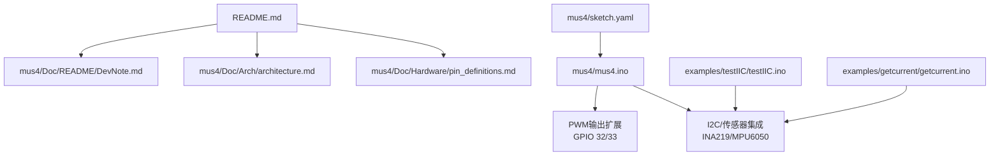
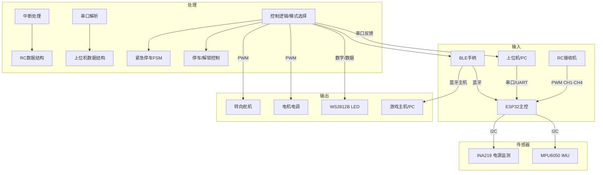
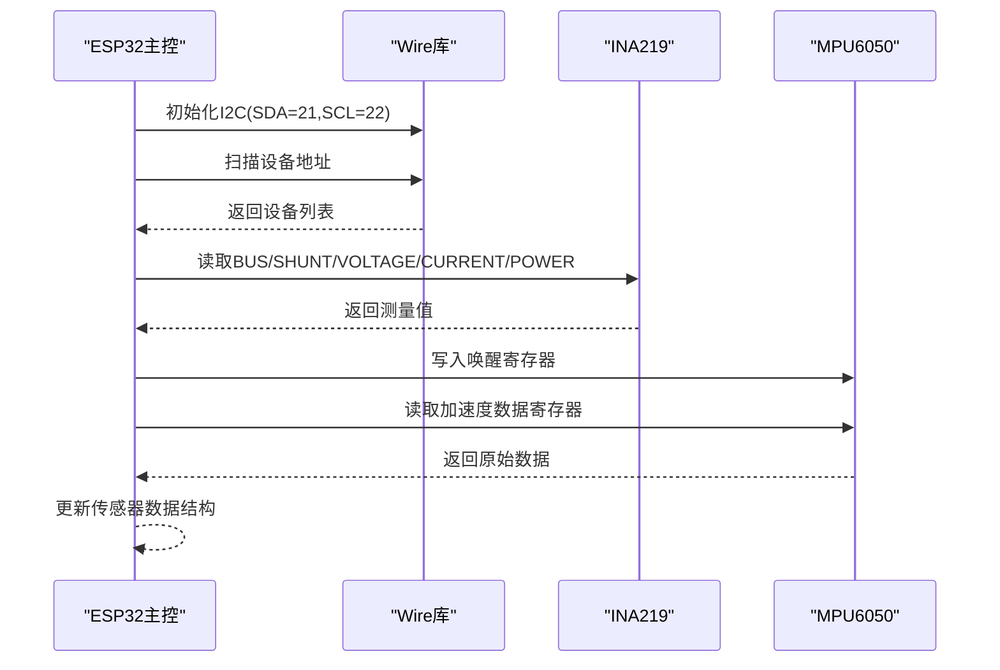
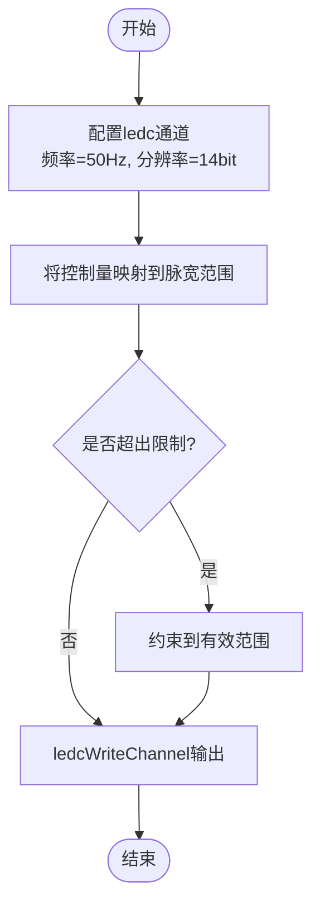
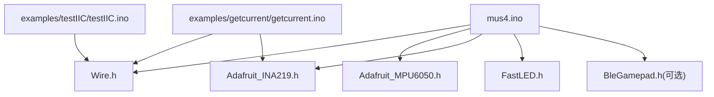

# 硬件扩展

<cite>
**本文引用的文件**
- [README.md](file://README.md)
- [mus4.ino](file://mus4/mus4.ino)
- [pin_definitions.md](file://mus4/Doc/Hardware/pin_definitions.md)
- [architecture.md](file://mus4/Doc/Arch/architecture.md)
- [testIIC.ino](file://examples/testIIC/testIIC.ino)
- [getcurrent.ino](file://examples/getcurrent/getcurrent.ino)
- [DevNote.md](file://mus4/Doc/README/DevNote.md)
- [sketch.yaml](file://mus4/sketch.yaml)
</cite>

## 目录
1. [简介](#简介)
2. [项目结构](#项目结构)
3. [核心组件](#核心组件)
4. [架构总览](#架构总览)
5. [详细组件分析](#详细组件分析)
6. [依赖关系分析](#依赖关系分析)
7. [性能考量](#性能考量)
8. [故障排查指南](#故障排查指南)
9. [结论](#结论)
10. [附录](#附录)

## 简介
本指南面向希望在MUS4（LP-MU-S4）平台上安全扩展硬件的工程师与开发者，重点围绕以下目标展开：
- 通过I2C接口扩展更多传感器设备，特别是INA219电流/电压监测器与MPU6050惯性导航模块的集成方法
- 介绍PWM输出扩展、数字IO扩展与模拟输入扩展的技术实现路径
- 提供引脚定义最佳实践、电源管理考虑与信号完整性保障策略
- 给出具体的硬件接线图、器件选型建议与电气特性分析
- 说明如何在不破坏现有功能的前提下安全地添加新硬件

## 项目结构
MUS4项目采用“文档+示例+主程序”的组织方式，便于理解硬件引脚、架构设计与扩展实现：
- 文档层：硬件引脚定义、架构说明、开发笔记等
- 示例层：I2C测试、INA219电流测量等独立示例
- 主程序层：基于ESP32的自动驾驶控制固件，已集成INA219与MPU6050



图表来源
- [README.md](file://README.md#L1-L39)
- [pin_definitions.md](file://mus4/Doc/Hardware/pin_definitions.md#L1-L225)
- [architecture.md](file://mus4/Doc/Arch/architecture.md#L1-L245)
- [DevNote.md](file://mus4/Doc/README/DevNote.md#L1-L122)
- [mus4.ino](file://mus4/mus4.ino#L1-L1290)
- [testIIC.ino](file://examples/testIIC/testIIC.ino#L1-L613)
- [getcurrent.ino](file://examples/getcurrent/getcurrent.ino#L1-L55)
- [sketch.yaml](file://mus4/sketch.yaml#L1-L3)

章节来源
- [README.md](file://README.md#L1-L39)
- [pin_definitions.md](file://mus4/Doc/Hardware/pin_definitions.md#L1-L225)
- [architecture.md](file://mus4/Doc/Arch/architecture.md#L1-L245)
- [DevNote.md](file://mus4/Doc/README/DevNote.md#L1-L122)
- [mus4.ino](file://mus4/mus4.ino#L1-L1290)
- [testIIC.ino](file://examples/testIIC/testIIC.ino#L1-L613)
- [getcurrent.ino](file://examples/getcurrent/getcurrent.ino#L1-L55)
- [sketch.yaml](file://mus4/sketch.yaml#L1-L3)

## 核心组件
- I2C总线与传感器集成：主程序已引入Wire库与Adafruit INA219/MPU6050库，具备I2C初始化、设备检测与数据读取能力；示例程序提供了完整的I2C扫描、MPU6050唤醒与加速度数据读取流程。
- PWM输出扩展：主程序定义了GPIO 32/33为备用PWM输出通道，当前未使用，可扩展为新的执行器输出。
- 数字IO与模拟输入：主程序使用GPIO 34/36/39作为RC接收机输入通道（仅输入），GPIO 21/22为I2C引脚；可结合外设进行数字IO扩展与模拟输入采集。
- 电源管理与信号完整性：文档明确指出ESP32 I/O电平为3.3V，RC接收机通常输出5V PWM，需注意电平兼容与上拉/下拉配置；舵机/电调应独立供电并共地。

章节来源
- [mus4.ino](file://mus4/mus4.ino#L24-L68)
- [mus4.ino](file://mus4/mus4.ino#L789-L800)
- [pin_definitions.md](file://mus4/Doc/Hardware/pin_definitions.md#L96-L110)
- [DevNote.md](file://mus4/Doc/README/DevNote.md#L98-L101)

## 架构总览
MUS4系统通过RC接收机、上位机串口与BLE手柄等多种输入源汇聚控制信号，经由控制逻辑融合后输出至舵机与电调，并通过LED指示系统状态。I2C总线用于连接INA219与MPU6050等传感器，提供实时的电源与姿态数据。



图表来源
- [architecture.md](file://mus4/Doc/Arch/architecture.md#L18-L45)
- [mus4.ino](file://mus4/mus4.ino#L36-L37)
- [mus4.ino](file://mus4/mus4.ino#L208-L220)

章节来源
- [architecture.md](file://mus4/Doc/Arch/architecture.md#L1-L245)
- [mus4.ino](file://mus4/mus4.ino#L36-L37)
- [mus4.ino](file://mus4/mus4.ino#L208-L220)

## 详细组件分析

### I2C接口扩展与传感器集成（INA219、MPU6050）
- 引脚与初始化
  - I2C引脚：SDA=GPIO 21，SCL=GPIO 22（已验证）
  - 初始化：Wire库在主程序中已启用，I2C速度可配置
- 设备检测与读写
  - 示例程序提供完整的I2C扫描、MPU6050 WHO_AM_I识别、唤醒与加速度数据读取流程
  - 主程序中存在I2C读取函数模板，便于接入INA219与MPU6050数据读取
- 电气特性与接线
  - 电源：建议使用3.3V逻辑电平，必要时通过上拉电阻提升信号质量
  - 地线：确保与MCU共地，避免噪声耦合
  - 信号完整性：短走线、避免与高频PWM信号平行走线，必要时增加去耦电容



图表来源
- [mus4.ino](file://mus4/mus4.ino#L789-L800)
- [testIIC.ino](file://examples/testIIC/testIIC.ino#L125-L224)
- [testIIC.ino](file://examples/testIIC/testIIC.ino#L317-L420)
- [getcurrent.ino](file://examples/getcurrent/getcurrent.ino#L17-L30)

章节来源
- [mus4.ino](file://mus4/mus4.ino#L66-L68)
- [mus4.ino](file://mus4/mus4.ino#L789-L800)
- [testIIC.ino](file://examples/testIIC/testIIC.ino#L1-L613)
- [getcurrent.ino](file://examples/getcurrent/getcurrent.ino#L1-L55)

### PWM输出扩展（GPIO 32/33）
- 现状
  - GPIO 32/33定义为备用PWM输出通道，当前未使用
- 扩展步骤
  - 在主程序中为新增执行器分配引脚与通道
  - 使用ledc库生成50Hz PWM，分辨率14bit，映射范围与现有舵机/电调一致
  - 将新输出纳入控制逻辑或独立任务，避免与现有输出冲突
- 注意事项
  - PWM频率与分辨率需与目标执行器匹配
  - 输出前进行限幅与校验，防止异常脉宽损坏设备



图表来源
- [mus4.ino](file://mus4/mus4.ino#L440-L447)
- [mus4.ino](file://mus4/mus4.ino#L1132-L1135)
- [mus4.ino](file://mus4/mus4.ino#L1271-L1275)

章节来源
- [mus4.ino](file://mus4/mus4.ino#L48-L50)
- [mus4.ino](file://mus4/mus4.ino#L440-L447)
- [mus4.ino](file://mus4/mus4.ino#L1132-L1135)
- [mus4.ino](file://mus4/mus4.ino#L1271-L1275)

### 数字IO扩展与模拟输入扩展
- 数字IO扩展
  - 可利用未占用的通用GPIO进行按键、开关、数字传感器等输入
  - 注意：GPIO 34/36/39为仅输入引脚，不可配置为输出
- 模拟输入扩展
  - ESP32具有ADC通道，可通过ADC库读取模拟电压
  - 扩展时需注意采样率与滤波，避免与PWM输出产生干扰
- 与现有系统的隔离
  - 新增IO尽量使用独立任务或中断，避免与RC输入中断竞争
  - 通过状态机或标志位协调共享资源

章节来源
- [pin_definitions.md](file://mus4/Doc/Hardware/pin_definitions.md#L30-L31)
- [architecture.md](file://mus4/Doc/Arch/architecture.md#L184-L191)

### 引脚定义最佳实践
- 优先遵循现有命名与宏定义风格，保持一致性
- I2C引脚固定于GPIO 21/22，避免与其他功能冲突
- RC输入引脚（GPIO 34/36/39）必须确保接收机提供稳定电平，必要时增加上拉/下拉电阻
- PWM输出引脚（GPIO 23/25/32/33）需与执行器规格匹配，注意限幅与保护

章节来源
- [pin_definitions.md](file://mus4/Doc/Hardware/pin_definitions.md#L13-L28)
- [DevNote.md](file://mus4/Doc/README/DevNote.md#L47-L50)

### 电源管理与信号完整性
- 电源管理
  - 舵机与电机应独立供电并通过BEC供电，避免直接从3.3V/5V引脚取流
  - 传感器与MCU共地，减少地环路噪声
- 信号完整性
  - I2C总线使用上拉电阻（典型4.7kΩ），缩短走线长度
  - 避免与PWM输出平行走线，必要时增加磁珠或滤波电容
  - 对于长线或强干扰环境，考虑使用差分信号或屏蔽线

章节来源
- [pin_definitions.md](file://mus4/Doc/Hardware/pin_definitions.md#L207-L209)
- [DevNote.md](file://mus4/Doc/README/DevNote.md#L98-L101)

## 依赖关系分析
- 库依赖
  - Wire：I2C总线与传感器通信
  - Adafruit_MPU6050、Adafruit_Sensor：MPU6050驱动
  - Adafruit_INA219：INA219驱动
  - FastLED：LED控制
  - BleGamepad（可选）：BLE手柄模式
- 文件依赖
  - 主程序mus4.ino依赖硬件引脚定义与架构文档，示例程序testIIC与getcurrent独立验证I2C与INA219功能



图表来源
- [mus4.ino](file://mus4/mus4.ino#L24-L34)
- [testIIC.ino](file://examples/testIIC/testIIC.ino#L14-L14)
- [getcurrent.ino](file://examples/getcurrent/getcurrent.ino#L1-L2)

章节来源
- [mus4.ino](file://mus4/mus4.ino#L24-L34)
- [testIIC.ino](file://examples/testIIC/testIIC.ino#L14-L14)
- [getcurrent.ino](file://examples/getcurrent/getcurrent.ino#L1-L2)

## 性能考量
- I2C速度与稳定性：示例程序支持100k/400k/1M模式，建议在扩展多个传感器时评估总线负载与错误率
- PWM输出与控制周期：主程序控制周期约16ms，扩展新输出时需确保不影响主循环实时性
- 传感器更新频率：主程序将传感器更新频率设置为1Hz，可根据需求调整，但需平衡CPU占用

章节来源
- [architecture.md](file://mus4/Doc/Arch/architecture.md#L109-L116)
- [mus4.ino](file://mus4/mus4.ino#L109-L111)

## 故障排查指南
- I2C设备未被识别
  - 检查SDA/SCL引脚是否正确（GPIO 21/22）
  - 使用示例程序进行总线扫描与地址识别
  - 确认上拉电阻与电源电平
- MPU6050数据异常
  - 先进行WHO_AM_I识别与唤醒操作
  - 检查寄存器读取顺序与数据组合方式
- INA219读数异常
  - 确认芯片初始化与校准设置
  - 检查负载电压与电流范围设置
- PWM输出不稳定
  - 检查ledc通道配置与映射范围
  - 确认限幅与保护逻辑生效

章节来源
- [testIIC.ino](file://examples/testIIC/testIIC.ino#L125-L224)
- [testIIC.ino](file://examples/testIIC/testIIC.ino#L317-L420)
- [getcurrent.ino](file://examples/getcurrent/getcurrent.ino#L17-L30)
- [mus4.ino](file://mus4/mus4.ino#L1132-L1135)
- [mus4.ino](file://mus4/mus4.ino#L1271-L1275)

## 结论
通过本文档，您可以在不破坏现有功能的前提下，安全地扩展MUS4的硬件能力：
- I2C接口已验证可用，可直接集成INA219与MPU6050，并可进一步扩展更多传感器
- PWM输出通道GPIO 32/33可作为新执行器的扩展点
- 数字IO与模拟输入可按需扩展，但需严格遵守引脚约束与信号完整性要求
- 借助示例程序与现有主程序框架，可快速完成新硬件的集成与调试

## 附录

### 硬件接线图（概念示意）
```mermaid
graph TB
MCU["ESP32主控<br/>GPIO 21(SDA)/22(SCL)"]
INA["INA219 电源监测"]
MPU["MPU6050 IMU"]
EXT["扩展执行器<br/>GPIO 32/33 PWM"]
IO["扩展数字IO/模拟输入"]
MCU < --> |I2C| INA
MCU < --> |I2C| MPU
MCU --> |PWM| EXT
MCU --> IO
```

图表来源
- [pin_definitions.md](file://mus4/Doc/Hardware/pin_definitions.md#L96-L110)
- [mus4.ino](file://mus4/mus4.ino#L48-L50)

### 器件选型建议
- INA219：用于电池/负载电流与功率监测，建议使用3.3V逻辑电平版本
- MPU6050：用于姿态与加速度测量，注意I2C地址选择与上拉电阻
- 执行器：舵机/电调需与PWM频率与脉宽范围匹配，注意电源与信号电平

### 电气特性要点
- I2C：标准模式100kHz，快速模式400kHz，必要时可提升至1MHz（需验证稳定性）
- PWM：50Hz，14bit分辨率，脉宽范围与中位值需与执行器规格一致
- 电源：独立供电与共地，避免过流与地环路噪声

章节来源
- [testIIC.ino](file://examples/testIIC/testIIC.ino#L21-L25)
- [mus4.ino](file://mus4/mus4.ino#L440-L447)
- [pin_definitions.md](file://mus4/Doc/Hardware/pin_definitions.md#L207-L209)