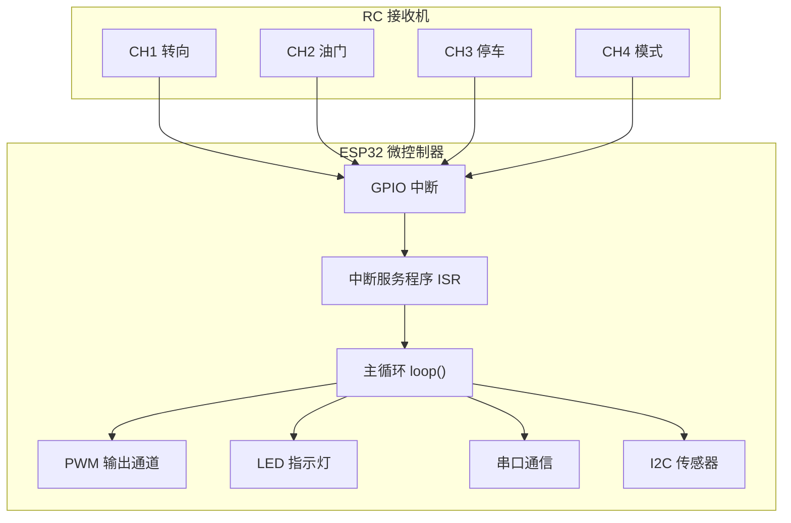
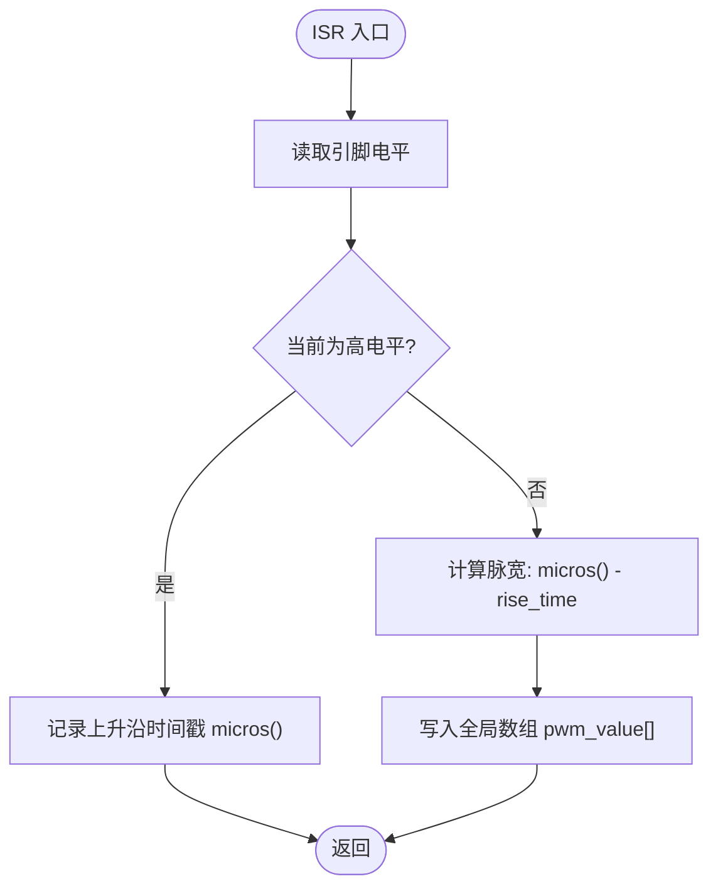
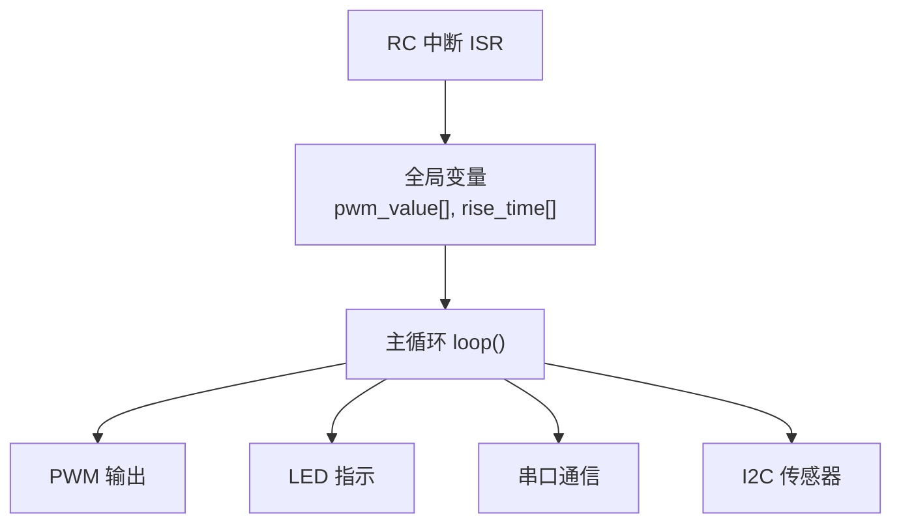

# 中断处理扩展

<cite>
**本文引用的文件**
- [README.md](file://README.md)
- [mus4.ino](file://mus4/mus4.ino)
- [pin_definitions.md](file://mus4/Doc/Hardware/pin_definitions.md)
- [architecture.md](file://mus4/Doc/Arch/architecture.md)
- [sketch.yaml](file://mus4/sketch.yaml)
</cite>

## 目录
1. [简介](#简介)
2. [项目结构](#项目结构)
3. [核心组件](#核心组件)
4. [架构总览](#架构总览)
5. [详细组件分析](#详细组件分析)
6. [依赖关系分析](#依赖关系分析)
7. [性能考虑](#性能考虑)
8. [故障排查指南](#故障排查指南)
9. [结论](#结论)
10. [附录](#附录)

## 简介
本指南面向希望在MUS4项目基础上扩展中断处理能力的开发者，围绕现有的RC信号中断处理机制，系统讲解如何安全地增加新的外部中断源，包括设计原则、优先级管理、性能优化策略、冲突避免机制、嵌套处理与原子性保障等。同时提供可操作的扩展示例，覆盖新中断源的配置方法、中断处理函数编写规范，以及定时器中断与外部中断的协同扩展路径。

## 项目结构
MUS4项目采用Arduino框架，核心逻辑集中在单文件中，通过模块化组织实现RC信号采集、串口通信、传感器读取、LED状态指示与PWM输出控制。中断处理位于RC信号采集模块，使用ESP32的GPIO中断与定时映射，形成“外部中断 → ISR → 全局共享变量”的数据通路。



图表来源
- [mus4.ino](file://mus4/mus4.ino#L1104-L1150)
- [pin_definitions.md](file://mus4/Doc/Hardware/pin_definitions.md#L34-L46)

章节来源
- [mus4.ino](file://mus4/mus4.ino#L1104-L1150)
- [pin_definitions.md](file://mus4/Doc/Hardware/pin_definitions.md#L1-L110)

## 核心组件
- RC信号中断采集：通过GPIO中断捕获PWM脉宽，使用微秒计时与全局数组记录脉宽值。
- 中断服务程序（ISR）：轻量、快速，仅做时间戳记录与脉宽计算，避免复杂逻辑。
- 主循环处理：从全局变量读取最新RC数据，结合上位机指令与模式逻辑，生成最终输出。
- PWM输出：基于映射后的控制量生成50Hz PWM，驱动舵机与电调。
- 串口与I2C：分别承担上位机指令输入与传感器数据采集。

章节来源
- [mus4.ino](file://mus4/mus4.ino#L413-L433)
- [mus4.ino](file://mus4/mus4.ino#L1104-L1150)
- [architecture.md](file://mus4/Doc/Arch/architecture.md#L18-L46)

## 架构总览
下图展示中断处理在整体系统中的位置与数据流，强调“外部中断 → ISR → 全局共享变量 → 主循环”的路径，以及与PWM输出、LED指示、串口反馈的关系。

```mermaid
sequenceDiagram
participant RC as "RC 接收机"
participant GPIO as "GPIO 中断"
participant ISR as "ISR 中断服务程序"
participant LOOP as "主循环 loop()"
participant PWM as "PWM 输出"
participant LED as "LED 指示灯"
participant UART as "串口通信"
RC->>GPIO : PWM 信号跳变
GPIO->>ISR : 触发中断
ISR->>ISR : 记录上升沿/计算脉宽
ISR-->>LOOP : 更新全局变量 pwm_value[]
LOOP->>LOOP : 读取并融合控制量
LOOP->>PWM : 生成 PWM 输出
LOOP->>LED : 更新状态指示
LOOP->>UART : 回传状态
```

图表来源
- [mus4.ino](file://mus4/mus4.ino#L413-L433)
- [mus4.ino](file://mus4/mus4.ino#L1152-L1279)
- [architecture.md](file://mus4/Doc/Arch/architecture.md#L18-L46)

## 详细组件分析

### RC信号中断处理（现有实现）
- 中断绑定：在初始化阶段为4个RC输入引脚分别绑定中断函数，触发方式为电平变化（CHANGE）。
- ISR设计：使用轻量ISR，仅记录上升沿时间戳并在下降沿计算脉宽，写入全局数组。
- 全局变量：使用volatile修饰的数组与时间戳，确保多线程/中断环境下可见性。
- 主循环读取：主循环周期性读取全局变量，进行模式判断与输出映射。



图表来源
- [mus4.ino](file://mus4/mus4.ino#L413-L426)

章节来源
- [mus4.ino](file://mus4/mus4.ino#L413-L433)
- [mus4.ino](file://mus4/mus4.ino#L1126-L1131)
- [pin_definitions.md](file://mus4/Doc/Hardware/pin_definitions.md#L34-L46)

### 中断服务程序（ISR）设计原则
- 最小化原则：ISR内只做必要操作（时间戳记录、脉宽计算、写入全局变量）。
- 原子性保障：使用volatile修饰全局变量，避免编译器优化导致的可见性问题；必要时使用临界区保护。
- 可重入性：避免在ISR中调用非原子函数或阻塞API；如需复杂处理，将结果写入全局变量，由主循环处理。
- 一致性：确保同一通道的上升沿与下降沿配对，避免竞争条件。

章节来源
- [mus4.ino](file://mus4/mus4.ino#L413-L426)

### 优先级管理与冲突避免
- 同步中断：4路RC输入共用同一ISR函数，通过参数区分通道，降低中断开销。
- 无优先级：ESP32的GPIO中断不支持软件优先级设置，需通过ISR最小化与主循环调度规避冲突。
- 冲突避免：确保ISR不访问共享资源（如串口、网络、文件系统）；避免长时间等待或阻塞。

章节来源
- [mus4.ino](file://mus4/mus4.ino#L413-L433)
- [pin_definitions.md](file://mus4/Doc/Hardware/pin_definitions.md#L30-L31)

### 性能优化策略
- 时间测量：使用微秒级计时，提高脉宽解析精度。
- 主循环节拍：固定采样间隔（RC数据约60Hz），平衡实时性与CPU占用。
- LED闪烁：使用状态切换而非每帧刷新，减少不必要的显示调用。
- UI自适应：根据主循环耗时动态调整UI刷新间隔，避免UI阻塞。

章节来源
- [mus4.ino](file://mus4/mus4.ino#L109-L112)
- [mus4.ino](file://mus4/mus4.ino#L1282-L1288)

### 扩展中断源（新增外部中断）
以下为新增外部中断源的通用步骤与规范，适用于按键、编码器、传感器中断等场景。

- 步骤一：引脚选择与硬件连接
  - 选择可用GPIO（注意仅输入引脚特性与电平兼容）。
  - 硬件连接到外部设备，确保上拉/下拉与电平匹配。
  
  章节来源
  - [pin_definitions.md](file://mus4/Doc/Hardware/pin_definitions.md#L30-L31)
  - [pin_definitions.md](file://mus4/Doc/Hardware/pin_definitions.md#L103-L109)

- 步骤二：声明全局变量
  - 使用volatile修饰，确保中断与主循环可见。
  - 为新通道预留索引或命名常量，便于扩展与维护。
  
  章节来源
  - [mus4.ino](file://mus4/mus4.ino#L79-L80)

- 步骤三：编写ISR函数
  - 保持极简：仅记录事件、更新计数/标志、写入全局变量。
  - 避免阻塞与复杂逻辑；必要时使用标志位通知主循环处理。
  
  章节来源
  - [mus4.ino](file://mus4/mus4.ino#L413-L426)

- 步骤四：绑定中断
  - 在初始化中配置引脚为输入，绑定中断函数，触发方式根据需求选择（上升沿/下降沿/双沿）。
  
  章节来源
  - [mus4.ino](file://mus4/mus4.ino#L1126-L1131)

- 步骤五：主循环读取与处理
  - 定期读取全局变量，进行去抖、滤波与状态机处理。
  - 将处理结果写入输出结构体，驱动PWM、LED或串口反馈。
  
  章节来源
  - [mus4.ino](file://mus4/mus4.ino#L1152-L1279)

### 扩展示例：按键中断（停车/解锁）
- 目标：在CH3通道上扩展按键中断，实现更灵敏的停车/解锁响应。
- 实现要点：
  - 使用CH3引脚（已定义为输入），在ISR中记录按键状态变化。
  - 在主循环中进行按键去抖与长按检测，更新停车状态。
  - 与现有park_change逻辑协同，避免重复处理。

```mermaid
sequenceDiagram
participant SW as "按键"
participant GPIO as "GPIO 中断"
participant ISR as "按键ISR"
participant LOOP as "主循环"
participant CTRL as "停车控制逻辑"
SW->>GPIO : 按下/释放
GPIO->>ISR : 触发中断
ISR->>ISR : 记录按键状态/时间戳
ISR-->>LOOP : 设置标志位
LOOP->>CTRL : 读取标志位并去抖
CTRL->>CTRL : 长按检测与状态切换
CTRL-->>LOOP : 更新停车状态
```

图表来源
- [mus4.ino](file://mus4/mus4.ino#L686-L740)
- [mus4.ino](file://mus4/mus4.ino#L1126-L1131)

章节来源
- [mus4.ino](file://mus4/mus4.ino#L686-L740)
- [mus4.ino](file://mus4/mus4.ino#L1126-L1131)

### 扩展示例：编码器中断（速度/里程）
- 目标：接入增量式编码器，通过两路正交信号产生高频中断，统计速度与里程。
- 实现要点：
  - 使用两个输入引脚，配置为CHANGE触发，分别对应A/B相。
  - ISR中仅更新计数器与方向标志，主循环进行解码与滤波。
  - 为编码器专用通道预留全局变量，避免与RC脉宽混淆。

章节来源
- [mus4.ino](file://mus4/mus4.ino#L413-L433)
- [mus4.ino](file://mus4/mus4.ino#L79-L80)

### 扩展示例：传感器中断（碰撞/接近）
- 目标：接入碰撞传感器或超声波触发中断，实现紧急制动或避障。
- 实现要点：
  - 传感器输出与GPIO中断相连，配置为上升沿触发（如超声波触发）。
  - ISR中仅置位标志位，主循环读取并执行相应动作（如紧急刹车）。
  - 与现有紧急停车状态机协同，避免冲突。

章节来源
- [mus4.ino](file://mus4/mus4.ino#L474-L525)
- [mus4.ino](file://mus4/mus4.ino#L1126-L1131)

### 中断嵌套处理与原子性保证
- 嵌套处理：ESP32的GPIO中断不支持嵌套，ISR应尽量短小，避免打断其他中断。
- 原子性：使用volatile变量与必要的临界区保护，确保多处写入的一致性。
- 一致性：对同一通道的事件进行成对处理（如上升沿/下降沿），防止遗漏或重复。

章节来源
- [mus4.ino](file://mus4/mus4.ino#L413-L426)
- [mus4.ino](file://mus4/mus4.ino#L79-L80)

### 定时器中断与外部中断协同
- 定时器中断：用于周期性任务（如传感器采样、UI刷新、性能评估），与外部中断互补。
- 协同策略：
  - 外部中断负责高频事件（RC脉宽、按键、编码器），定时器中断负责低频任务。
  - 在定时器ISR中仅设置标志位，主循环统一处理，避免定时器ISR中调用阻塞API。
  - 通过全局变量与标志位协调，确保两类中断互不干扰。

章节来源
- [mus4.ino](file://mus4/mus4.ino#L109-L112)
- [mus4.ino](file://mus4/mus4.ino#L1282-L1288)

## 依赖关系分析
- 外部依赖：Arduino ESP32框架、Wire/I2C库、FastLED库、Adafruit_MPU6050/INA219库。
- 内部依赖：RC中断模块与主循环紧密耦合，PWM输出与LED指示依赖主循环计算结果。
- 中断依赖：GPIO中断绑定与ISR函数必须一一对应，避免通道错乱。



图表来源
- [mus4.ino](file://mus4/mus4.ino#L413-L433)
- [mus4.ino](file://mus4/mus4.ino#L1152-L1279)

章节来源
- [mus4.ino](file://mus4/mus4.ino#L413-L433)
- [mus4.ino](file://mus4/mus4.ino#L1152-L1279)

## 性能考虑
- 中断负载：RC脉宽测量属于高频中断，需确保ISR极短，避免影响其他中断。
- 主循环节拍：固定RC采样间隔，避免频繁串口打印与复杂计算。
- 资源竞争：避免在ISR中访问共享资源；必要时使用标志位通知主循环处理。
- UI自适应：根据主循环耗时动态调整UI刷新，避免UI成为瓶颈。

章节来源
- [mus4.ino](file://mus4/mus4.ino#L109-L112)
- [mus4.ino](file://mus4/mus4.ino#L1282-L1288)

## 故障排查指南
- 现象：RC脉宽异常或不稳定
  - 检查引脚是否为仅输入模式，确认RC信号电平兼容。
  - 确认ISR未被其他中断打断，避免竞争条件。
- 现象：按键/编码器无响应
  - 检查引脚连接与上拉/下拉配置，确认中断绑定正确。
  - 在主循环中增加调试输出，验证标志位与状态机逻辑。
- 现象：系统卡顿或UI延迟
  - 检查主循环中是否有过多串口打印或阻塞操作。
  - 调整UI刷新间隔，避免过度刷新。

章节来源
- [pin_definitions.md](file://mus4/Doc/Hardware/pin_definitions.md#L30-L31)
- [mus4.ino](file://mus4/mus4.ino#L1282-L1288)

## 结论
通过对现有RC中断处理机制的深入分析，我们总结出一套可复用的中断扩展方法论：以ISR最小化为核心，配合主循环统一处理与原子性保障，即可安全地扩展更多外部中断源。同时，通过定时器中断与外部中断的协同，能够满足复杂应用场景下的实时性与稳定性要求。建议在扩展过程中严格遵循设计原则与冲突避免策略，确保系统可靠运行。

## 附录
- 开发环境：ESP32 Firebeetle2，FQBN默认配置见sketch.yaml。
- 硬件引脚：RC输入、PWM输出、I2C、串口等引脚定义详见硬件文档。
- 架构说明：系统整体运行逻辑、状态机与数据流详见架构文档。

章节来源
- [sketch.yaml](file://mus4/sketch.yaml#L1-L3)
- [pin_definitions.md](file://mus4/Doc/Hardware/pin_definitions.md#L1-L110)
- [architecture.md](file://mus4/Doc/Arch/architecture.md#L1-L245)