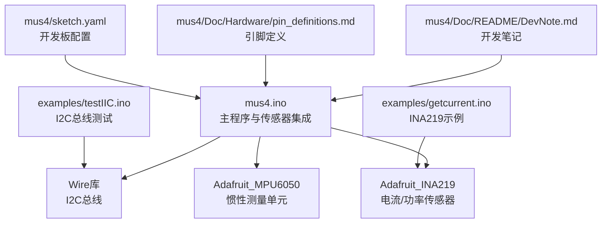
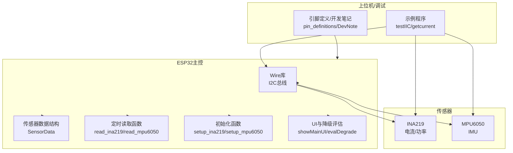
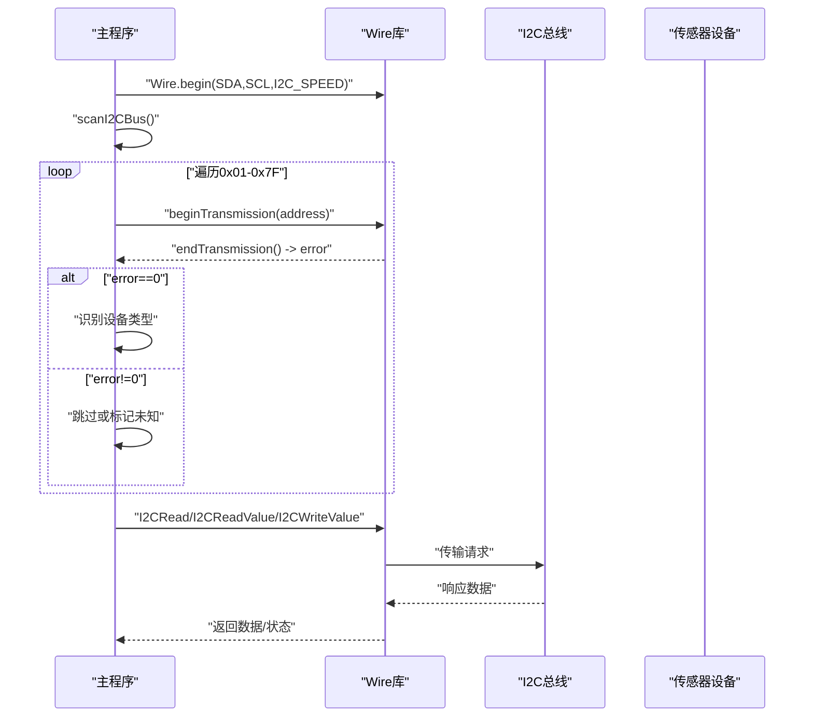
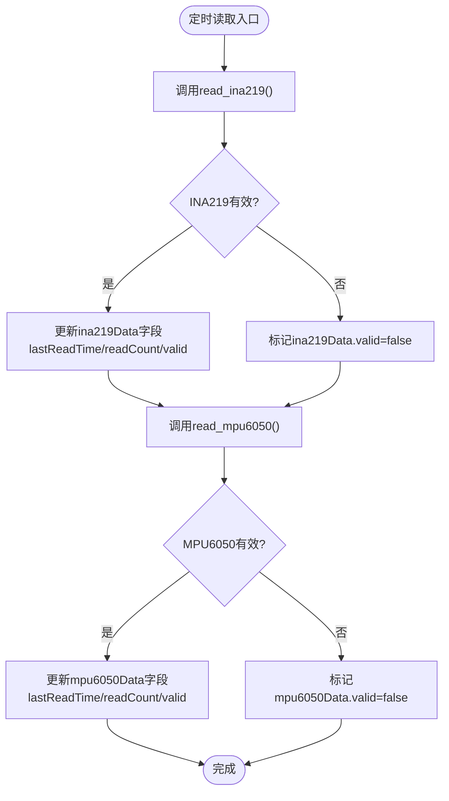
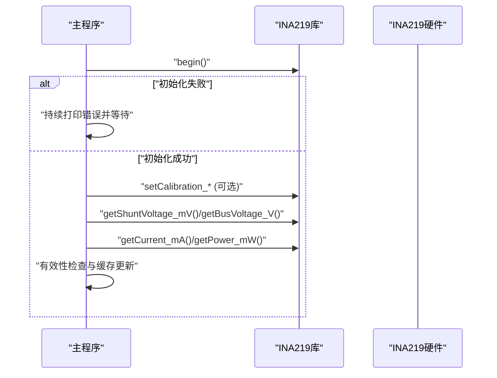
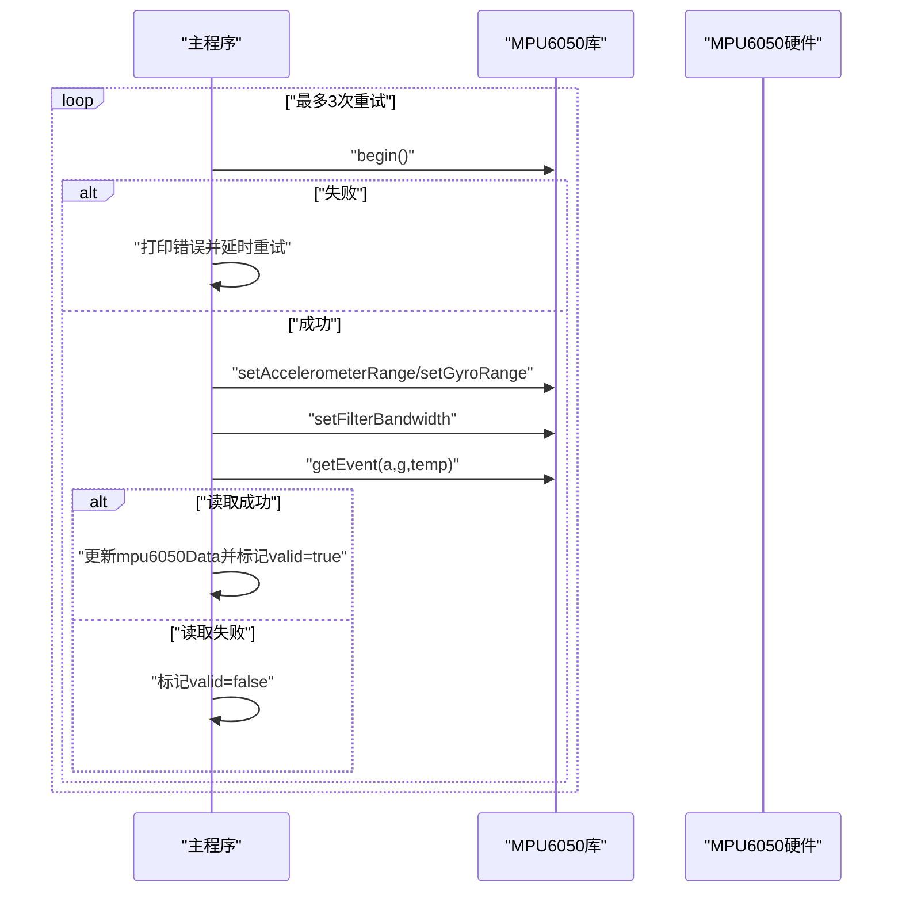
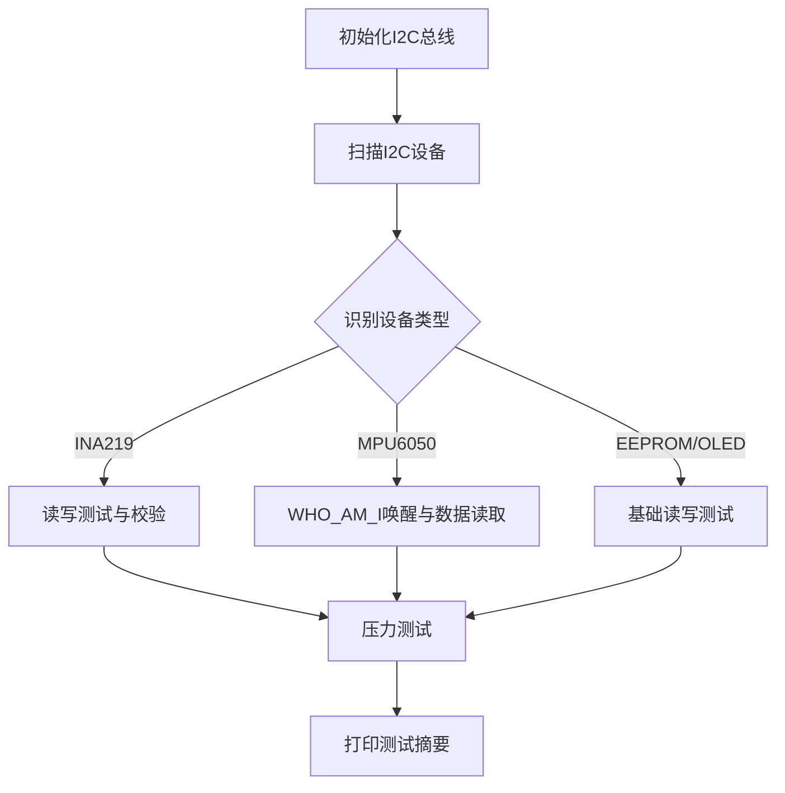
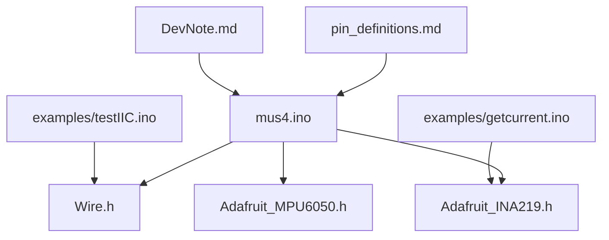

# 传感器集成扩展

<cite>
**本文引用的文件**
- [README.md](file://README.md)
- [mus4.ino](file://mus4/mus4.ino)
- [testIIC.ino](file://examples/testIIC/testIIC.ino)
- [getcurrent.ino](file://examples/getcurrent/getcurrent.ino)
- [sketch.yaml](file://mus4/sketch.yaml)
- [DevNote.md](file://mus4/Doc/README/DevNote.md)
- [pin_definitions.md](file://mus4/Doc/Hardware/pin_definitions.md)
</cite>

## 目录
1. [简介](#简介)
2. [项目结构](#项目结构)
3. [核心组件](#核心组件)
4. [架构概览](#架构概览)
5. [详细组件分析](#详细组件分析)
6. [依赖关系分析](#依赖关系分析)
7. [性能考虑](#性能考虑)
8. [故障排查指南](#故障排查指南)
9. [结论](#结论)
10. [附录](#附录)

## 简介
本指南面向希望在MUS4项目中扩展传感器集成的开发者，基于现有的INA219和MPU6050传感器集成经验，系统讲解如何添加新的I2C传感器与其他类型传感器。内容涵盖传感器初始化流程、数据读取机制、数据校准方法、故障检测与数据有效性验证、热插拔支持，以及如何扩展I2C总线管理和设备地址分配机制。文档同时提供可操作的步骤、可视化图表与最佳实践，帮助快速、稳健地完成新传感器的集成。

## 项目结构
MUS4项目采用模块化组织方式，核心逻辑集中在主程序文件中，示例代码位于examples目录，硬件引脚定义与开发笔记位于Doc目录。整体结构清晰，便于扩展与维护。

**图表来源**
- [mus4.ino](file://mus4/mus4.ino#L24-L38)
- [testIIC.ino](file://examples/testIIC/testIIC.ino#L14-L14)
- [getcurrent.ino](file://examples/getcurrent/getcurrent.ino#L1-L2)
- [pin_definitions.md](file://mus4/Doc/Hardware/pin_definitions.md#L13-L28)
- [DevNote.md](file://mus4/Doc/README/DevNote.md#L1-L122)

**章节来源**
- [README.md](file://README.md#L1-L39)
- [mus4.ino](file://mus4/mus4.ino#L1104-L1150)
- [testIIC.ino](file://examples/testIIC/testIIC.ino#L558-L613)
- [getcurrent.ino](file://examples/getcurrent/getcurrent.ino#L7-L30)
- [pin_definitions.md](file://mus4/Doc/Hardware/pin_definitions.md#L1-L225)
- [DevNote.md](file://mus4/Doc/README/DevNote.md#L1-L122)

## 核心组件
- I2C总线管理：统一的Wire库初始化、地址扫描、读写封装函数，支持错误处理与重试。
- 传感器数据结构：统一的SensorData结构体，包含busVoltage、shuntVoltage、loadVoltage、current_mA、power_mW、加速度、角速度、温度等字段，以及lastReadTime、readCount、valid标志位。
- 传感器初始化：分别针对INA219和MPU6050的初始化流程，包含校准参数设置与错误提示。
- 数据读取与校验：定时读取传感器数据，进行有效性检查与缓存更新。
- 故障检测与降级：基于传感器有效性与UI渲染耗时的降级模式评估与通知。

**章节来源**
- [mus4.ino](file://mus4/mus4.ino#L208-L220)
- [mus4.ino](file://mus4/mus4.ino#L841-L866)
- [mus4.ino](file://mus4/mus4.ino#L898-L920)
- [mus4.ino](file://mus4/mus4.ino#L290-L305)

## 架构概览
下图展示了MUS4中传感器集成的整体架构：主程序负责I2C总线初始化、传感器扫描与初始化、定时读取与数据校验；示例程序提供I2C总线测试与传感器读写验证；硬件引脚定义文档明确了I2C引脚与相关外设连接关系。

**图表来源**
- [mus4.ino](file://mus4/mus4.ino#L1119-L1123)
- [mus4.ino](file://mus4/mus4.ino#L841-L920)
- [testIIC.ino](file://examples/testIIC/testIIC.ino#L101-L118)
- [getcurrent.ino](file://examples/getcurrent/getcurrent.ino#L7-L30)
- [pin_definitions.md](file://mus4/Doc/Hardware/pin_definitions.md#L16-L22)

## 详细组件分析

### I2C总线管理与地址扫描
- I2C初始化：在主程序中通过Wire库初始化SDA/SCL引脚与I2C速度，随后进行设备扫描。
- 地址扫描：遍历0x01至0x7F地址范围，识别常见设备（如INA219、MPU6050等），并打印详细信息。
- 读写封装：提供通用的I2CRead/I2CReadValue/I2CWriteValue函数，支持错误返回与日志输出。

**图表来源**
- [mus4.ino](file://mus4/mus4.ino#L1119-L1123)
- [mus4.ino](file://mus4/mus4.ino#L922-L975)
- [mus4.ino](file://mus4/mus4.ino#L789-L839)

**章节来源**
- [mus4.ino](file://mus4/mus4.ino#L1119-L1123)
- [mus4.ino](file://mus4/mus4.ino#L922-L975)
- [mus4.ino](file://mus4/mus4.ino#L789-L839)

### 传感器数据结构与读取流程
- 数据结构：SensorData包含电压、电流、功率、加速度、角速度、温度、读取时间戳、读取计数与有效性标志。
- 读取流程：定时任务中分别调用read_ina219与read_mpu6050，进行数据有效性检查与缓存更新。
- 校验策略：INA219通过检查关键字段是否为0来判断数据有效性；MPU6050通过事件读取函数返回值判断。

**图表来源**
- [mus4.ino](file://mus4/mus4.ino#L1155-L1160)
- [mus4.ino](file://mus4/mus4.ino#L841-L866)
- [mus4.ino](file://mus4/mus4.ino#L898-L920)

**章节来源**
- [mus4.ino](file://mus4/mus4.ino#L208-L220)
- [mus4.ino](file://mus4/mus4.ino#L841-L866)
- [mus4.ino](file://mus4/mus4.ino#L898-L920)

### INA219传感器集成
- 初始化：调用begin()检测芯片，失败则持续提示并等待；成功后可选择校准范围（默认32V/2A）。
- 数据读取：通过库函数获取shunt/bus/load电压与电流/功率，进行有效性检查后写入全局结构体。
- 校准：可通过setCalibration_*系列函数调整量程以提升精度。

**图表来源**
- [mus4.ino](file://mus4/mus4.ino#L868-L896)
- [mus4.ino](file://mus4/mus4.ino#L841-L866)

**章节来源**
- [mus4.ino](file://mus4/mus4.ino#L868-L896)
- [mus4.ino](file://mus4/mus4.ino#L841-L866)

### MPU6050传感器集成
- 初始化：多次尝试初始化，失败时打印详细原因（地址、接线、电源、速度等），成功后设置加速度/角速度量程与滤波带宽。
- 数据读取：通过getEvent()获取加速度、角速度与温度事件，进行有效性检查与缓存更新。
- 配置：支持设置加速度量程、陀螺仪量程与滤波带宽，以适配采样率与噪声需求。

**图表来源**
- [mus4.ino](file://mus4/mus4.ino#L977-L1082)
- [mus4.ino](file://mus4/mus4.ino#L898-L920)

**章节来源**
- [mus4.ino](file://mus4/mus4.ino#L977-L1082)
- [mus4.ino](file://mus4/mus4.ino#L898-L920)

### I2C总线测试与诊断（示例）
- I2C初始化：指定SDA/SCL引脚与速度，初始化后延时稳定。
- 设备扫描：遍历0x01-0x7F地址，识别常见设备类型并打印详情。
- 读写测试：提供单字节与多字节读写函数，支持错误码输出与数据校验。
- 压力测试：连续事务测试，统计成功率与耗时。

**图表来源**
- [testIIC.ino](file://examples/testIIC/testIIC.ino#L101-L118)
- [testIIC.ino](file://examples/testIIC/testIIC.ino#L125-L224)
- [testIIC.ino](file://examples/testIIC/testIIC.ino#L233-L311)
- [testIIC.ino](file://examples/testIIC/testIIC.ino#L471-L521)

**章节来源**
- [testIIC.ino](file://examples/testIIC/testIIC.ino#L101-L118)
- [testIIC.ino](file://examples/testIIC/testIIC.ino#L125-L224)
- [testIIC.ino](file://examples/testIIC/testIIC.ino#L233-L311)
- [testIIC.ino](file://examples/testIIC/testIIC.ino#L471-L521)

### 扩展指南：添加新的I2C传感器
- 步骤一：确认I2C地址与引脚
  - 使用scanI2CBus()或示例程序的scanI2CDevices()进行地址扫描，确认可用地址范围。
  - 参考引脚定义文档，确保SDA/SCL连接正确且无上拉电阻冲突。
- 步骤二：添加库与声明
  - 在头文件中包含新传感器库，声明全局对象。
  - 在setup()中添加初始化函数，包含错误处理与重试逻辑。
- 步骤三：实现读取函数
  - 在loop()定时任务中调用读取函数，进行数据有效性检查与缓存更新。
  - 参考INA219与MPU6050的读取模式，设计统一的校验策略。
- 步骤四：UI与降级评估
  - 在UI中打印新传感器数据，便于调试与监控。
  - 将新传感器纳入降级评估逻辑，确保系统在异常时能及时降级。
- 步骤五：热插拔支持
  - 在每次读取前重新检测设备存在性，必要时重新初始化。
  - 提供动态地址切换与配置保存机制，避免频繁重启。

**章节来源**
- [mus4.ino](file://mus4/mus4.ino#L922-L975)
- [mus4.ino](file://mus4/mus4.ino#L1119-L1123)
- [mus4.ino](file://mus4/mus4.ino#L1155-L1160)
- [mus4.ino](file://mus4/mus4.ino#L290-L305)
- [pin_definitions.md](file://mus4/Doc/Hardware/pin_definitions.md#L16-L22)

### 扩展指南：添加其他类型传感器
- SPI/UART/ADC等接口：根据传感器接口类型引入相应库，遵循与I2C类似的初始化与读取模式。
- 中断与DMA：对于高速传感器，优先使用中断或DMA减少CPU占用。
- 校准与滤波：提供校准流程与滤波算法，提升数据质量与稳定性。
- 并发与同步：使用互斥量或原子操作保证多任务下的数据一致性。

[本节为概念性指导，不直接分析具体文件]

## 依赖关系分析
- 主程序依赖Wire库进行I2C通信，依赖Adafruit_*库进行传感器读取。
- 示例程序独立演示I2C总线测试与传感器读写，便于集成前验证。
- 硬件引脚定义文档明确I2C引脚与连接关系，为传感器布局提供依据。

**图表来源**
- [mus4.ino](file://mus4/mus4.ino#L24-L38)
- [testIIC.ino](file://examples/testIIC/testIIC.ino#L14-L14)
- [getcurrent.ino](file://examples/getcurrent/getcurrent.ino#L1-L2)
- [pin_definitions.md](file://mus4/Doc/Hardware/pin_definitions.md#L16-L22)
- [DevNote.md](file://mus4/Doc/README/DevNote.md#L82-L101)

**章节来源**
- [mus4.ino](file://mus4/mus4.ino#L24-L38)
- [testIIC.ino](file://examples/testIIC/testIIC.ino#L14-L14)
- [getcurrent.ino](file://examples/getcurrent/getcurrent.ino#L1-L2)
- [pin_definitions.md](file://mus4/Doc/Hardware/pin_definitions.md#L16-L22)
- [DevNote.md](file://mus4/Doc/README/DevNote.md#L82-L101)

## 性能考虑
- I2C速度与稳定性：默认100kHz，可根据传感器特性调整至400kHz或更高，但需确保布线与上拉电阻满足要求。
- 采样间隔：传感器更新间隔（SENSOR_UPDATE_INTERVAL）与UI更新间隔（UI_UPDATE_INTERVAL）需平衡实时性与系统负载。
- 降级机制：当UI渲染耗时过长或传感器数据无效时，系统自动降级UI刷新频率，保障关键功能运行。
- 中断与定时：RC接收机使用中断采集PWM，避免轮询带来的延迟；传感器读取采用定时任务，减少对主循环的影响。

[本节提供一般性建议，不直接分析具体文件]

## 故障排查指南
- I2C设备未检测到
  - 检查引脚连接与上拉电阻，使用scanI2CBus()或示例程序的scanI2CDevices()进行地址扫描。
  - 确认设备地址是否正确（如MPU6050的0x68/0x69）。
- 传感器初始化失败
  - 查看错误提示信息，确认电源、接线与I2C速度设置。
  - 对于MPU6050，尝试不同地址与滤波带宽设置。
- 数据无效或全零
  - 检查传感器是否处于唤醒状态，必要时发送唤醒命令。
  - 确认校准参数设置与量程范围。
- 系统降级
  - 观察降级原因（传感器无效、UI渲染耗时过长），定位问题传感器或优化UI刷新策略。

**章节来源**
- [mus4.ino](file://mus4/mus4.ino#L922-L975)
- [mus4.ino](file://mus4/mus4.ino#L977-L1082)
- [mus4.ino](file://mus4/mus4.ino#L290-L305)
- [testIIC.ino](file://examples/testIIC/testIIC.ino#L317-L343)

## 结论
通过现有INA219与MPU6050的集成经验，MUS4项目已建立了完善的I2C总线管理、传感器初始化、数据读取与校验、故障检测与降级机制。按照本文提供的扩展指南，开发者可以快速、稳健地添加新的I2C传感器或其他类型传感器，同时保持系统的稳定性与可维护性。建议在集成过程中严格遵循初始化与校验流程，充分利用UI与降级机制，确保系统在异常情况下仍能提供基本功能。

## 附录
- 开发板配置：参考sketch.yaml中的默认FQBN与端口设置。
- 硬件引脚：参考pin_definitions.md中的I2C引脚定义与连接关系。
- 开发笔记：参考DevNote.md中的功能模块说明与调试要点。

**章节来源**
- [sketch.yaml](file://mus4/sketch.yaml#L1-L3)
- [pin_definitions.md](file://mus4/Doc/Hardware/pin_definitions.md#L16-L22)
- [DevNote.md](file://mus4/Doc/README/DevNote.md#L82-L101)