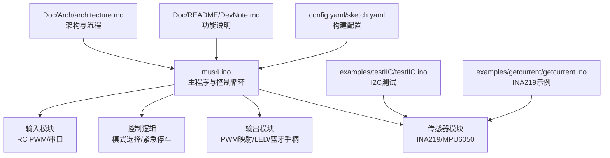
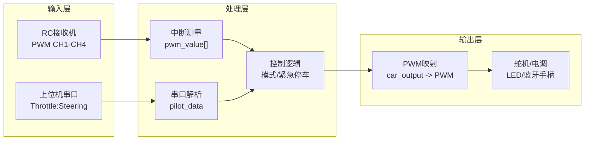
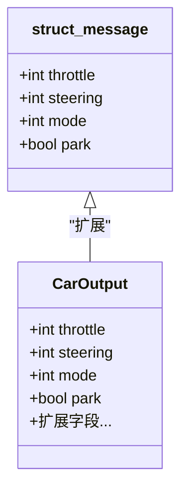
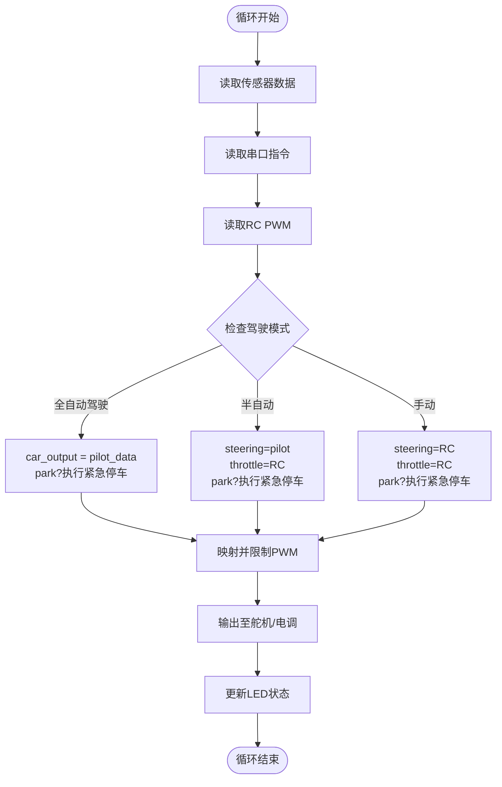
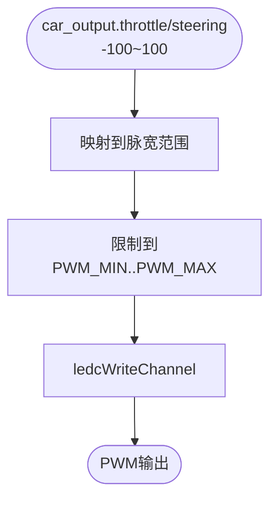
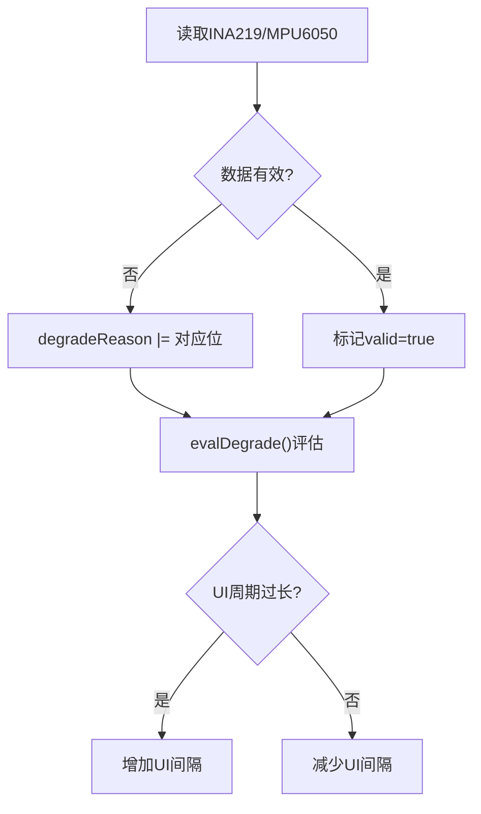
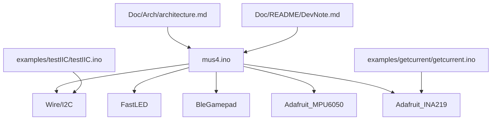

# 控制算法扩展

<cite>
**本文引用的文件列表**
- [mus4.ino](file://mus4/mus4.ino)
- [architecture.md](file://mus4/Doc/Arch/architecture.md)
- [DevNote.md](file://mus4/Doc/README/DevNote.md)
- [sketch.yaml](file://mus4/sketch.yaml)
- [config.yaml](file://config.yaml)
- [testIIC.ino](file://examples/testIIC/testIIC.ino)
- [getcurrent.ino](file://examples/getcurrent/getcurrent.ino)
</cite>

## 目录
1. [简介](#简介)
2. [项目结构](#项目结构)
3. [核心组件](#核心组件)
4. [架构总览](#架构总览)
5. [详细组件分析](#详细组件分析)
6. [依赖关系分析](#依赖关系分析)
7. [性能考虑](#性能考虑)
8. [故障排查指南](#故障排查指南)
9. [结论](#结论)
10. [附录](#附录)

## 简介
本指南面向希望在MUS4项目控制架构基础上扩展新控制算法（如PID控制、模糊控制、自适应控制等）的开发者。文档从系统架构入手，结合现有代码中的数据结构、主控制循环与输出映射机制，给出扩展步骤、参数边界与稳定性保障建议，并提供性能优化与监控方案，帮助在ESP32平台上实现安全可靠的实时控制。

## 项目结构
MUS4采用模块化单文件架构，核心逻辑集中在mus4.ino中，配合文档与示例工程：
- mus4.ino：主程序，包含输入采集、控制决策、输出映射与执行、UI与调试功能
- Doc/Arch/architecture.md：系统架构与流程图说明
- Doc/README/DevNote.md：开发笔记与功能说明
- examples/：I2C与传感器测试示例
- config.yaml/sketch.yaml：构建与部署配置



图表来源
- [mus4.ino](file://mus4/mus4.ino#L1104-L1150)
- [architecture.md](file://mus4/Doc/Arch/architecture.md#L1-L245)
- [DevNote.md](file://mus4/Doc/README/DevNote.md#L1-L122)
- [testIIC.ino](file://examples/testIIC/testIIC.ino#L1-L613)
- [getcurrent.ino](file://examples/getcurrent/getcurrent.ino#L1-L55)
- [config.yaml](file://config.yaml#L1-L13)
- [sketch.yaml](file://mus4/sketch.yaml#L1-L3)

章节来源
- [mus4.ino](file://mus4/mus4.ino#L1104-L1150)
- [architecture.md](file://mus4/Doc/Arch/architecture.md#L1-L245)
- [DevNote.md](file://mus4/Doc/README/DevNote.md#L1-L122)

## 核心组件
- 数据结构：统一的struct_message用于承载控制输入与输出，包含油门、转向、模式与停车标志
- 输入模块：RC PWM中断采集与串口命令解析
- 控制逻辑：模式选择、紧急停车FSM、停车/解锁控制
- 输出模块：映射到舵机与电调的PWM输出，LED状态指示与蓝牙手柄转发
- 传感器模块：INA219与MPU6050数据采集与健康状态维护

章节来源
- [mus4.ino](file://mus4/mus4.ino#L460-L473)
- [architecture.md](file://mus4/Doc/Arch/architecture.md#L47-L65)

## 架构总览
系统采用“输入-处理-输出”的流水线结构，主循环按固定周期更新传感器、解析输入、执行控制逻辑并输出PWM。架构图与流程图详见架构文档。



图表来源
- [architecture.md](file://mus4/Doc/Arch/architecture.md#L18-L45)
- [mus4.ino](file://mus4/mus4.ino#L1152-L1290)

## 详细组件分析

### 1) 数据结构设计与扩展
- 现有结构：struct_message包含throttle、steering、mode、park四个字段，用于统一承载控制输入与输出
- 扩展建议：新增字段（如目标值、误差、积分项、模糊规则索引、自适应参数等），并保持与主循环的兼容性



图表来源
- [mus4.ino](file://mus4/mus4.ino#L460-L473)

章节来源
- [mus4.ino](file://mus4/mus4.ino#L460-L473)

### 2) 主控制循环与控制流
- 主循环按传感器、串口、RC输入、模式判断、输出映射、LED更新顺序执行
- 模式分支：手动/半自动/全自动驾驶分别决定油门与转向来源
- 紧急停车：park触发时进入FSM，按阶段输出不同油门值



图表来源
- [architecture.md](file://mus4/Doc/Arch/architecture.md#L72-L107)
- [mus4.ino](file://mus4/mus4.ino#L1152-L1290)

章节来源
- [architecture.md](file://mus4/Doc/Arch/architecture.md#L66-L107)
- [mus4.ino](file://mus4/mus4.ino#L1152-L1290)

### 3) 输出映射与PWM生成
- 控制输出范围：-100~100映射到舵机与电调的脉宽范围
- PWM生成：使用ledc库，频率50Hz，分辨率14bit
- 边界限制：映射后再次限制在PWM_MIN/PWM_MAX范围内



图表来源
- [mus4.ino](file://mus4/mus4.ino#L1269-L1276)

章节来源
- [mus4.ino](file://mus4/mus4.ino#L1269-L1276)

### 4) 紧急停车FSM与稳定性保障
- FSM状态：EST_IDLE → EST_READY(缓冲) → EST_BRAKING(全力刹车) → EST_DONE(归零)
- 触发条件：park==1且当前有油门时进入EST_READY；完成后进入EST_DONE并归零油门
- 状态机确保在停车信号下安全减速，避免突变

```mermaid
stateDiagram-v2
[*] --> EST_IDLE
EST_IDLE --> EST_READY : "有油门且park==1"
EST_IDLE --> EST_DONE : "无油门且park==1"
state EST_READY {
[*] --> WaitReady
WaitReady --> SetBrake : "500ms"
note right of WaitReady : "缓冲期，油门设为15"
}
EST_READY --> EST_BRAKING : "准备完成"
state EST_BRAKING {
[*] --> Braking
Braking --> BrakeDone : "1500ms"
note right of Braking : "全力刹车，油门设为-100"
}
EST_BRAKING --> EST_DONE : "刹车完成"
state EST_DONE {
note right of EST_DONE : "刹车完成，油门归零"
}
EST_DONE --> EST_IDLE : "park解除"
```

图表来源
- [architecture.md](file://mus4/Doc/Arch/architecture.md#L123-L151)
- [mus4.ino](file://mus4/mus4.ino#L474-L525)

章节来源
- [architecture.md](file://mus4/Doc/Arch/architecture.md#L117-L161)
- [mus4.ino](file://mus4/mus4.ino#L474-L525)

### 5) 传感器与健康监控
- INA219/MPU6050数据采集与valid标志，用于UI与降级模式评估
- 降级模式：UI周期过长或传感器异常时进入降级，降低UI刷新频率以保证实时性



图表来源
- [mus4.ino](file://mus4/mus4.ino#L841-L866)
- [mus4.ino](file://mus4/mus4.ino#L290-L305)
- [mus4.ino](file://mus4/mus4.ino#L1282-L1288)

章节来源
- [mus4.ino](file://mus4/mus4.ino#L841-L866)
- [mus4.ino](file://mus4/mus4.ino#L290-L305)
- [mus4.ino](file://mus4/mus4.ino#L1282-L1288)

### 6) 串口协议与命令解析
- 协议格式：T:S\n，其中T为油门，S为转向，范围-100~100
- 校验：支持带校验和的帧格式，解析失败返回NACK
- 主循环中将pilot_data写入car_output，供后续映射与输出

章节来源
- [DevNote.md](file://mus4/Doc/README/DevNote.md#L24-L29)
- [mus4.ino](file://mus4/mus4.ino#L320-L395)
- [mus4.ino](file://mus4/mus4.ino#L1162-L1163)

### 7) I2C与传感器测试参考
- I2C扫描与读写测试：验证MPU6050/INA219等外设连接与通信
- 传感器初始化与错误处理：提供初始化失败时的提示与重试策略

章节来源
- [testIIC.ino](file://examples/testIIC/testIIC.ino#L125-L224)
- [mus4.ino](file://mus4/mus4.ino#L868-L896)
- [mus4.ino](file://mus4/mus4.ino#L977-L1082)

## 依赖关系分析
- 硬件依赖：ESP32的GPIO、I2C、ledc、FastLED、BleGamepad等
- 库依赖：Wire、Adafruit_MPU6050、Adafruit_INA219、FastLED、BleGamepad
- 文件依赖：mus4.ino为主入口，Doc与examples提供架构与测试参考



图表来源
- [mus4.ino](file://mus4/mus4.ino#L24-L34)
- [architecture.md](file://mus4/Doc/Arch/architecture.md#L1-L245)
- [DevNote.md](file://mus4/Doc/README/DevNote.md#L1-L122)
- [testIIC.ino](file://examples/testIIC/testIIC.ino#L1-L613)
- [getcurrent.ino](file://examples/getcurrent/getcurrent.ino#L1-L55)

章节来源
- [mus4.ino](file://mus4/mus4.ino#L24-L34)
- [architecture.md](file://mus4/Doc/Arch/architecture.md#L1-L245)
- [DevNote.md](file://mus4/Doc/README/DevNote.md#L1-L122)

## 性能考虑
- 循环周期与采样：传感器1Hz、RC约60Hz、UI约60Hz，避免在主循环中进行阻塞操作
- 降级模式：当UI周期超过阈值时动态增加UI间隔，保证关键路径优先
- PWM生成：使用ledc库进行无CPU占用的PWM输出
- I2C通信：在初始化与扫描阶段避免频繁读写，减少总线竞争

章节来源
- [architecture.md](file://mus4/Doc/Arch/architecture.md#L109-L116)
- [mus4.ino](file://mus4/mus4.ino#L1282-L1288)
- [mus4.ino](file://mus4/mus4.ino#L1133-L1134)

## 故障排查指南
- 传感器未检测：检查I2C引脚、地址与供电，参考初始化错误提示
- 串口协议错误：确认帧格式与校验和，关注NACK反馈
- 紧急停车不生效：确认park信号来源与模式切换逻辑
- UI卡顿：观察降级模式触发与UI间隔调整

章节来源
- [mus4.ino](file://mus4/mus4.ino#L868-L896)
- [mus4.ino](file://mus4/mus4.ino#L977-L1082)
- [mus4.ino](file://mus4/mus4.ino#L320-L395)
- [mus4.ino](file://mus4/mus4.ino#L290-L305)

## 结论
MUS4提供了清晰的控制框架与实时性保障机制。通过扩展struct_message与在主循环中插入算法模块，可以在不破坏现有稳定性的前提下集成PID、模糊控制、自适应控制等高级算法。建议遵循参数边界、稳定性与性能监控原则，确保算法在真实硬件上的可靠运行。

## 附录

### A. 扩展步骤（以PID为例）
- 步骤1：在struct_message基础上扩展字段（如目标值、误差、积分项、微分项等）
- 步骤2：在主循环中插入PID计算模块，依据当前模式选择输入源
- 步骤3：将PID输出写入car_output，走统一映射与PWM输出路径
- 步骤4：加入参数边界检查与异常保护，必要时启用降级模式
- 步骤5：增加性能监控与日志输出，便于调试与优化

章节来源
- [mus4.ino](file://mus4/mus4.ino#L460-L473)
- [mus4.ino](file://mus4/mus4.ino#L1152-L1290)

### B. 参数边界与稳定性建议
- 输入范围：-100~100，超出范围拒绝处理
- PWM边界：映射后再次限制到PWM_MIN/PWM_MAX
- 紧急停车：强制油门归零，避免突变
- 传感器健康：valid标志与降级模式联动

章节来源
- [mus4.ino](file://mus4/mus4.ino#L756-L768)
- [mus4.ino](file://mus4/mus4.ino#L1272-L1273)
- [mus4.ino](file://mus4/mus4.ino#L290-L305)

### C. 构建与部署
- Arduino CLI配置：fqbn、port、baudrate、sketch_path、build_path
- sketch.yaml：ESP32开发板FQBN与默认端口

章节来源
- [config.yaml](file://config.yaml#L1-L13)
- [sketch.yaml](file://mus4/sketch.yaml#L1-L3)