# 模块功能扩展

<cite>
**本文档引用的文件**
- [README.md](file://README.md)
- [mus4.ino](file://mus4/mus4.ino)
- [architecture.md](file://mus4/Doc/Arch/architecture.md)
- [DevNote.md](file://mus4/Doc/README/DevNote.md)
- [pin_definitions.md](file://mus4/Doc/Hardware/pin_definitions.md)
- [sketch.yaml](file://mus4/sketch.yaml)
- [config.yaml](file://config.yaml)
- [getcurrent.ino](file://examples/getcurrent/getcurrent.ino)
- [testIIC.ino](file://examples/testIIC/testIIC.ino)
</cite>

## 目录
1. [简介](#简介)
2. [项目结构](#项目结构)
3. [核心组件](#核心组件)
4. [架构概览](#架构概览)
5. [详细组件分析](#详细组件分析)
6. [依赖关系分析](#依赖关系分析)
7. [性能考虑](#性能考虑)
8. [故障排除指南](#故障排除指南)
9. [结论](#结论)
10. [附录](#附录)

## 简介

MUS4项目是一个基于ESP32的自动驾驶小车控制系统，采用模块化架构设计。该项目实现了完整的车辆控制链路，包括信号采集、控制决策、执行输出和状态监控等核心功能模块。本文档旨在为开发者提供模块功能扩展的完整指南，涵盖模块接口设计原则、模块间通信机制、数据共享策略以及具体的扩展示例。

## 项目结构

MUS4项目采用清晰的模块化组织结构，主要包含以下层次：

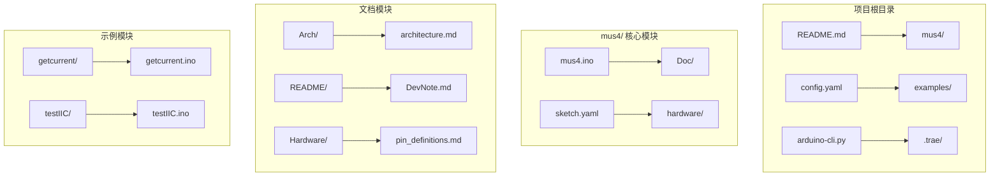

**图表来源**
- [mus4.ino](file://mus4/mus4.ino#L1-L50)
- [architecture.md](file://mus4/Doc/Arch/architecture.md#L1-L50)

**章节来源**
- [mus4.ino](file://mus4/mus4.ino#L1-L100)
- [architecture.md](file://mus4/Doc/Arch/architecture.md#L1-L50)

## 核心组件

### 系统架构概述

MUS4系统采用分层架构设计，主要分为四个核心层次：

1. **输入层**：RC接收机信号采集和上位机串口通信
2. **处理层**：控制逻辑、模式选择和状态管理
3. **执行层**：PWM输出控制和LED状态指示
4. **监控层**：传感器数据采集和系统状态反馈

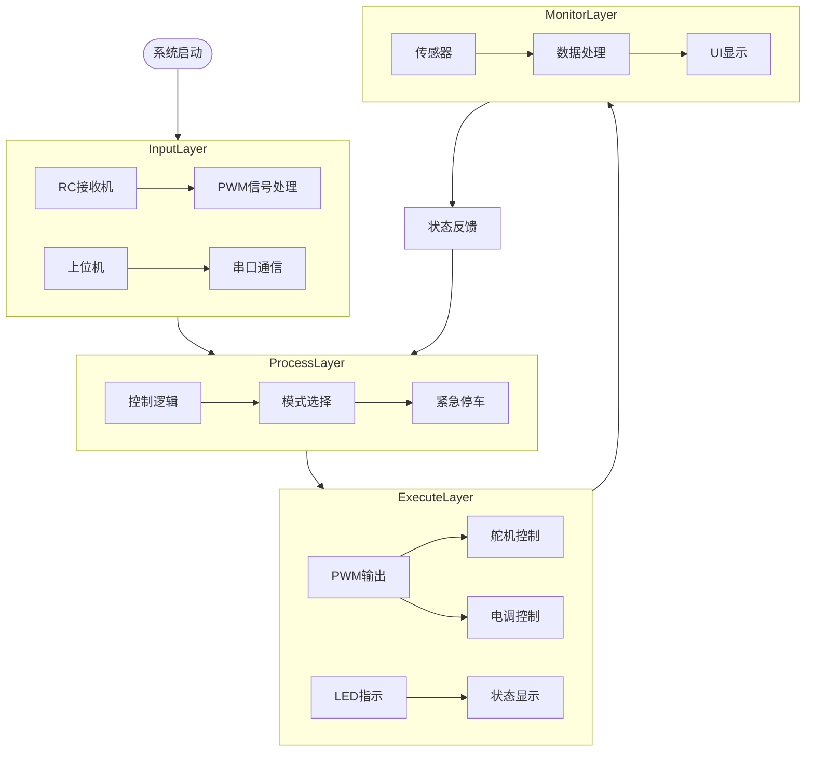

**图表来源**
- [architecture.md](file://mus4/Doc/Arch/architecture.md#L18-L45)
- [mus4.ino](file://mus4/mus4.ino#L1104-L1150)

### 关键数据结构

系统定义了统一的控制数据结构来管理各个模块间的数据传递：

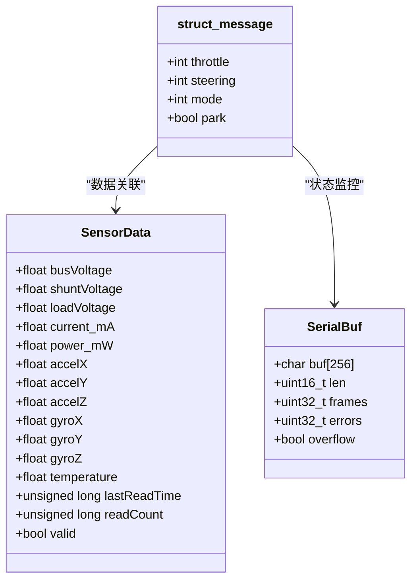

**图表来源**
- [mus4.ino](file://mus4/mus4.ino#L208-L220)
- [mus4.ino](file://mus4/mus4.ino#L137-L139)

**章节来源**
- [mus4.ino](file://mus4/mus4.ino#L208-L220)
- [mus4.ino](file://mus4/mus4.ino#L137-L139)

## 架构概览

### 系统运行时架构

MUS4系统采用实时多任务处理架构，通过主循环实现各个功能模块的协调工作：

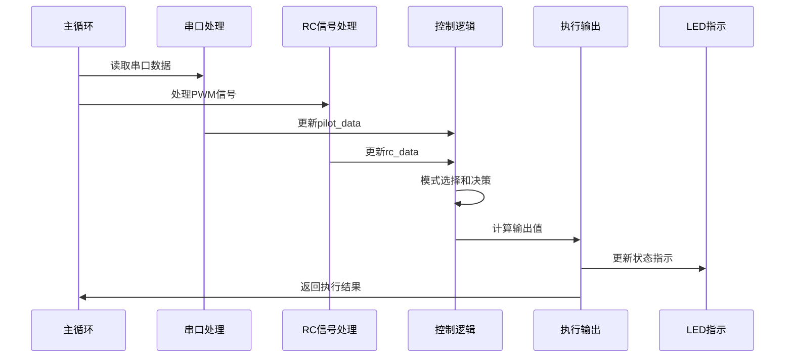

**图表来源**
- [mus4.ino](file://mus4/mus4.ino#L1152-L1290)

### 模块间通信机制

系统采用事件驱动和数据共享相结合的通信方式：

1. **中断驱动**：RC信号通过硬件中断精确测量脉宽
2. **串口通信**：上位机通过RS232/USB串口发送控制指令
3. **全局变量共享**：各模块通过统一的数据结构进行数据交换
4. **回调机制**：BLE手柄模式使用回调函数处理状态变化

**章节来源**
- [mus4.ino](file://mus4/mus4.ino#L414-L434)
- [mus4.ino](file://mus4/mus4.ino#L1152-L1290)

## 详细组件分析

### 信号采集模块

#### PWM信号处理

RC接收机信号通过ESP32的硬件中断精确采集：

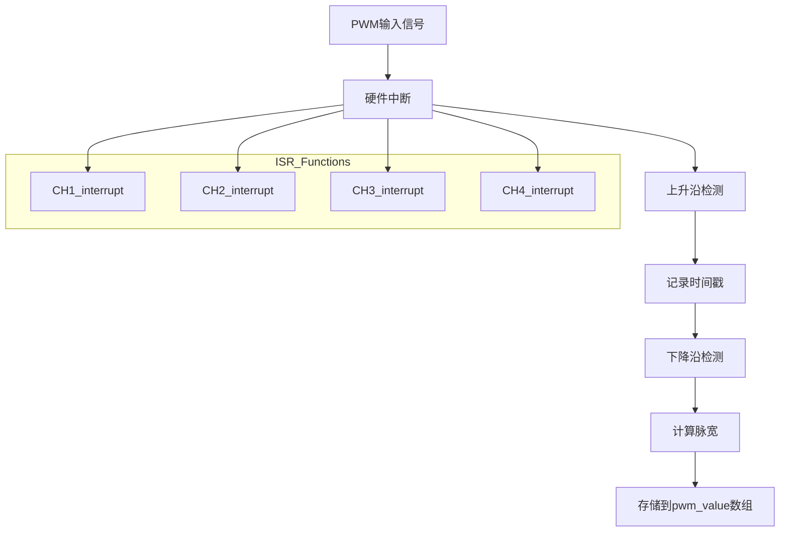

**图表来源**
- [mus4.ino](file://mus4/mus4.ino#L414-L434)
- [mus4.ino](file://mus4/mus4.ino#L449-L456)

#### 串口通信处理

系统支持双串口通信，分别处理USB和RS232数据：

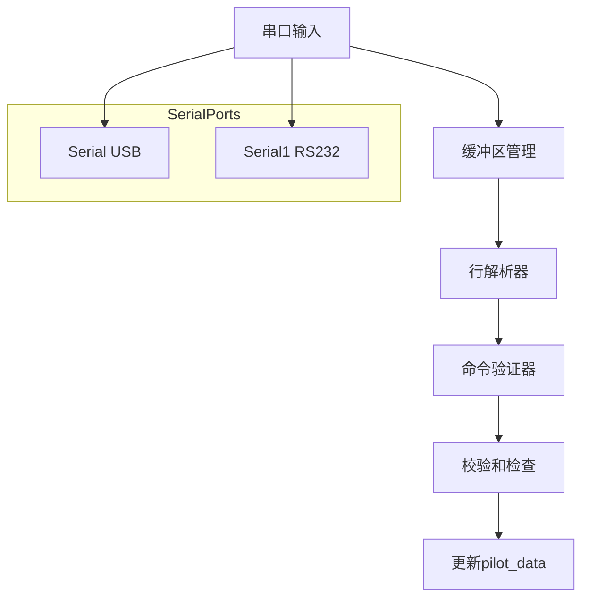

**图表来源**
- [mus4.ino](file://mus4/mus4.ino#L344-L411)
- [mus4.ino](file://mus4/mus4.ino#L742-L769)

**章节来源**
- [mus4.ino](file://mus4/mus4.ino#L414-L434)
- [mus4.ino](file://mus4/mus4.ino#L344-L411)

### 控制决策模块

#### 驾驶模式控制

系统支持三种驾驶模式，通过CH4通道的PWM信号选择：

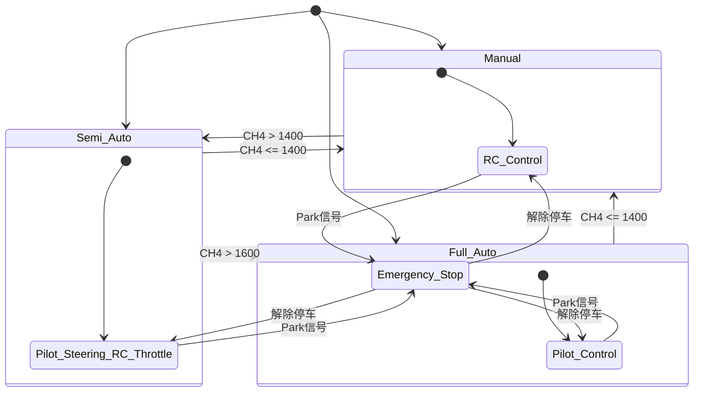

**图表来源**
- [mus4.ino](file://mus4/mus4.ino#L771-L786)
- [DevNote.md](file://mus4/Doc/README/DevNote.md#L53-L61)

#### 紧急停车机制

紧急停车状态机确保系统安全：

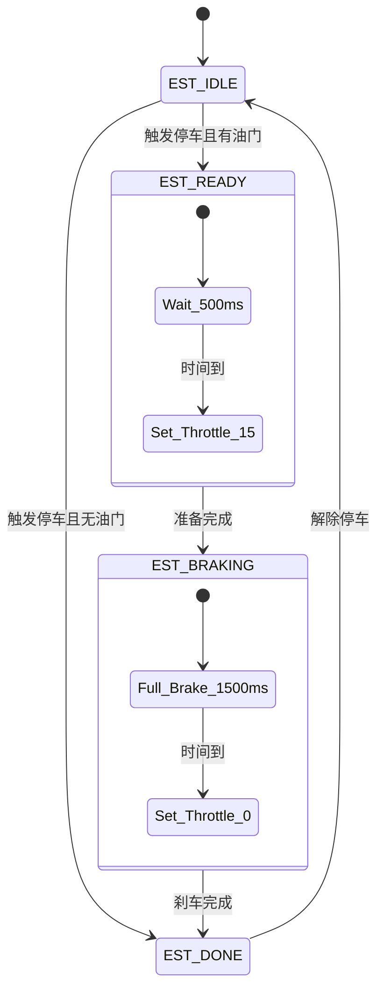

**图表来源**
- [mus4.ino](file://mus4/mus4.ino#L474-L525)
- [DevNote.md](file://mus4/Doc/README/DevNote.md#L67-L73)

**章节来源**
- [mus4.ino](file://mus4/mus4.ino#L771-L786)
- [mus4.ino](file://mus4/mus4.ino#L474-L525)

### 执行输出模块

#### PWM输出控制

系统通过LEDc库生成精确的PWM信号：

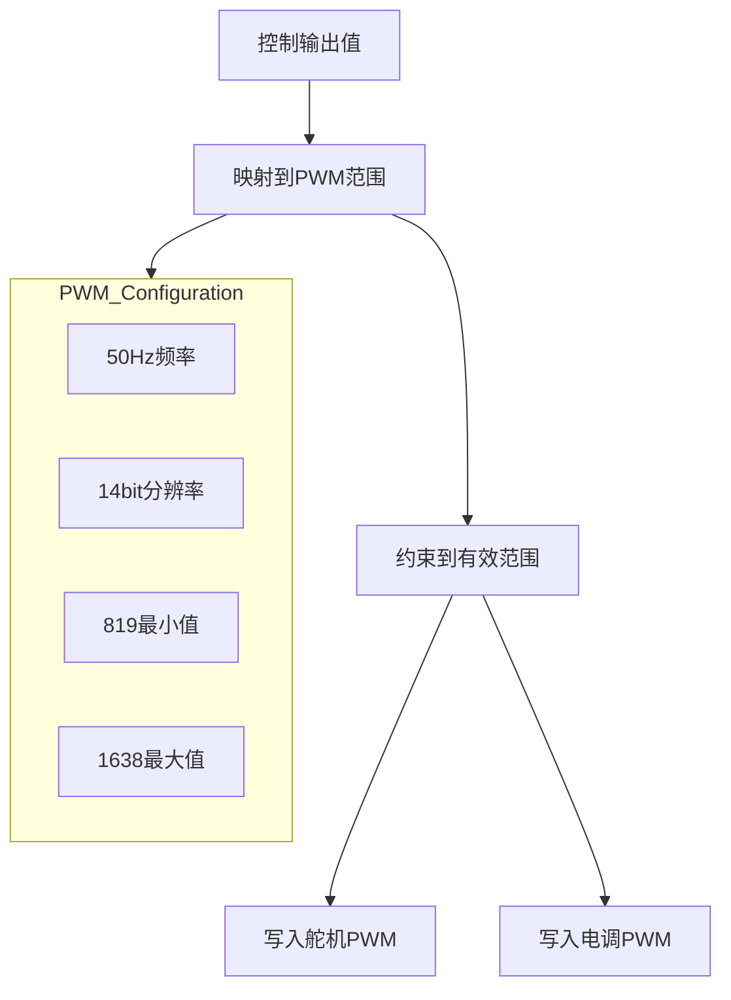

**图表来源**
- [mus4.ino](file://mus4/mus4.ino#L1269-L1276)
- [mus4.ino](file://mus4/mus4.ino#L440-L447)

#### LED状态指示

WS2812B RGB LED提供直观的状态反馈：

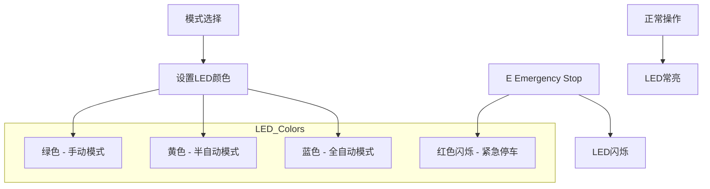

**图表来源**
- [mus4.ino](file://mus4/mus4.ino#L241-L274)
- [DevNote.md](file://mus4/Doc/README/DevNote.md#L215-L226)

**章节来源**
- [mus4.ino](file://mus4/mus4.ino#L1269-L1276)
- [mus4.ino](file://mus4/mus4.ino#L241-L274)

### 传感器监控模块

#### I2C设备集成

系统集成了INA219电流传感器和MPU6050惯性测量单元：

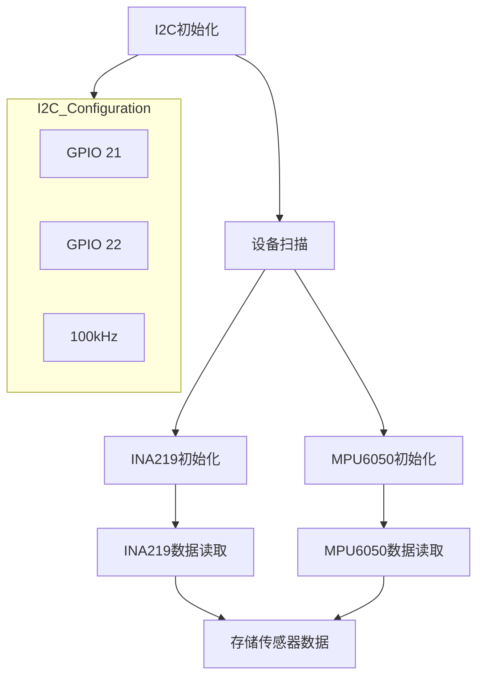

**图表来源**
- [mus4.ino](file://mus4/mus4.ino#L1119-L1123)
- [mus4.ino](file://mus4/mus4.ino#L841-L920)

**章节来源**
- [mus4.ino](file://mus4/mus4.ino#L841-L920)
- [mus4.ino](file://mus4/mus4.ino#L1119-L1123)

## 依赖关系分析

### 硬件依赖关系

MUS4系统具有明确的硬件依赖关系，所有外设都通过I2C总线连接：

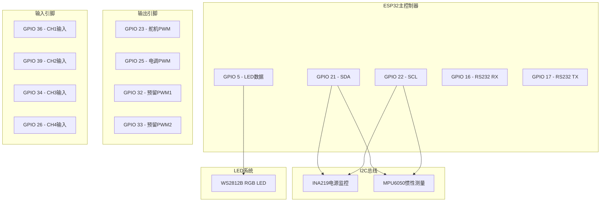

**图表来源**
- [pin_definitions.md](file://mus4/Doc/Hardware/pin_definitions.md#L13-L28)
- [mus4.ino](file://mus4/mus4.ino#L1119-L1123)

### 软件依赖关系

系统采用模块化软件架构，各模块间依赖关系清晰：

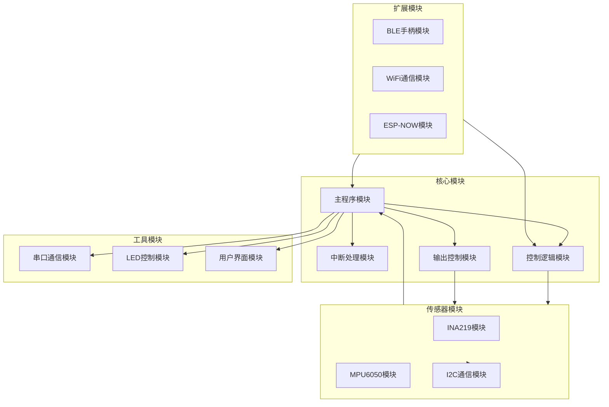

**图表来源**
- [architecture.md](file://mus4/Doc/Arch/architecture.md#L14-L45)
- [DevNote.md](file://mus4/Doc/README/DevNote.md#L74-L81)

**章节来源**
- [architecture.md](file://mus4/Doc/Arch/architecture.md#L14-L45)
- [DevNote.md](file://mus4/Doc/README/DevNote.md#L74-L81)

## 性能考虑

### 实时性能优化

MUS4系统采用多级优化策略确保实时性能：

1. **中断优先级**：RC信号处理使用硬件中断保证精确性
2. **定时器调度**：通过定时器控制不同模块的更新频率
3. **内存管理**：使用静态分配避免动态内存碎片
4. **算法优化**：采用查表法和快速数学运算

### 资源管理策略

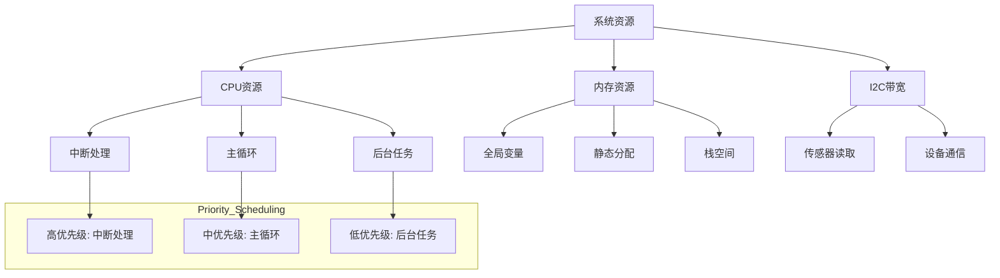

**图表来源**
- [mus4.ino](file://mus4/mus4.ino#L109-L131)
- [mus4.ino](file://mus4/mus4.ino#L1282-L1288)

### 性能监控机制

系统内置性能评估和降级机制：

1. **UI响应监控**：实时评估UI更新周期
2. **性能自适应**：根据负载动态调整刷新频率
3. **降级模式**：在资源紧张时简化功能
4. **错误检测**：监控传感器数据有效性

**章节来源**
- [mus4.ino](file://mus4/mus4.ino#L1282-L1288)
- [mus4.ino](file://mus4/mus4.ino#L290-L305)

## 故障排除指南

### 常见问题诊断

#### 传感器故障排查

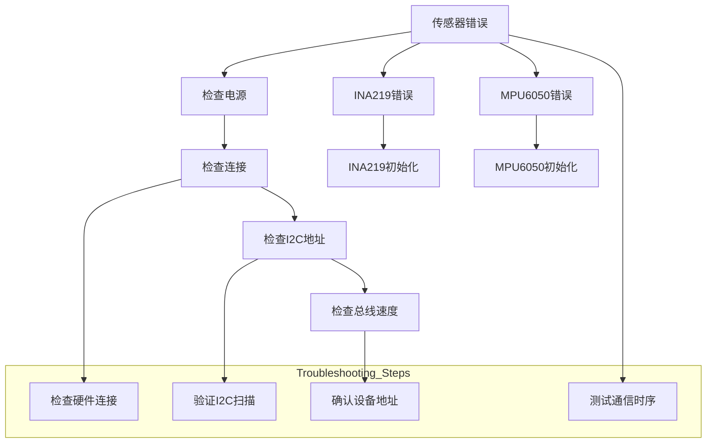

**图表来源**
- [mus4.ino](file://mus4/mus4.ino#L868-L896)
- [mus4.ino](file://mus4/mus4.ino#L977-L1082)

#### 串口通信问题

系统提供了完整的串口通信诊断工具：

1. **命令格式验证**：检查T:S\n格式的正确性
2. **校验和计算**：验证数据完整性
3. **缓冲区管理**：防止溢出和数据丢失
4. **错误统计**：记录通信失败次数

**章节来源**
- [mus4.ino](file://mus4/mus4.ino#L344-L411)
- [mus4.ino](file://mus4/mus4.ino#L868-L896)

### 调试工具和方法

#### 内置测试功能

系统包含多个内置测试功能：

1. **单元测试**：验证核心算法正确性
2. **基准测试**：评估系统性能
3. **压力测试**：检验系统稳定性
4. **回归测试**：确保功能一致性

#### 开发环境配置

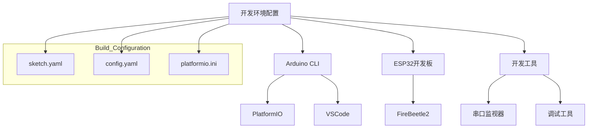

**图表来源**
- [DevNote.md](file://mus4/Doc/README/DevNote.md#L3-L14)
- [sketch.yaml](file://mus4/sketch.yaml#L1-L3)
- [config.yaml](file://config.yaml#L1-L13)

**章节来源**
- [DevNote.md](file://mus4/Doc/README/DevNote.md#L3-L14)
- [sketch.yaml](file://mus4/sketch.yaml#L1-L3)

## 结论

MUS4项目展现了优秀的模块化架构设计，通过清晰的模块分离、标准化的接口设计和完善的通信机制，为功能扩展提供了坚实的基础。项目的主要优势包括：

1. **模块化设计**：各功能模块职责明确，便于独立开发和测试
2. **标准化接口**：统一的数据结构和通信协议简化了模块集成
3. **实时性能**：硬件中断和定时器调度确保系统响应性
4. **可扩展性**：预留的扩展点和配置选项支持功能增强
5. **可靠性**：完善的错误处理和降级机制提高系统稳定性

对于未来的功能扩展，建议遵循模块化设计原则，保持接口的向后兼容性，并充分利用现有的通信机制和数据共享策略。

## 附录

### 模块扩展示例

#### 新功能模块创建步骤

1. **需求分析**：确定模块功能和接口要求
2. **接口设计**：定义输入输出参数和数据结构
3. **模块实现**：编写核心算法和处理逻辑
4. **集成测试**：验证与其他模块的兼容性
5. **性能优化**：确保实时性能要求
6. **文档完善**：更新相关技术文档

#### 模块注册机制

系统采用静态注册方式管理功能模块：

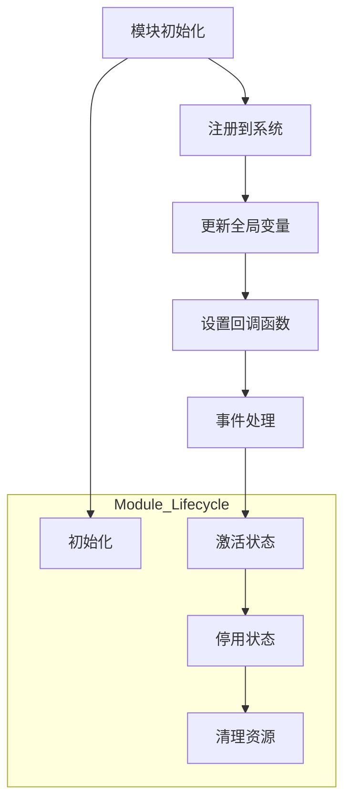

#### 生命周期管理

模块的完整生命周期包括：

1. **初始化阶段**：硬件配置和资源申请
2. **激活阶段**：开始正常功能操作
3. **停用阶段**：暂停功能但保持资源
4. **清理阶段**：释放资源并注销模块

### 最佳实践建议

1. **接口设计原则**：保持接口简洁稳定，避免频繁变更
2. **错误处理**：实现完善的异常处理和恢复机制
3. **性能监控**：建立性能指标监控和告警机制
4. **文档维护**：及时更新技术文档和API说明
5. **测试覆盖**：建立全面的单元测试和集成测试体系