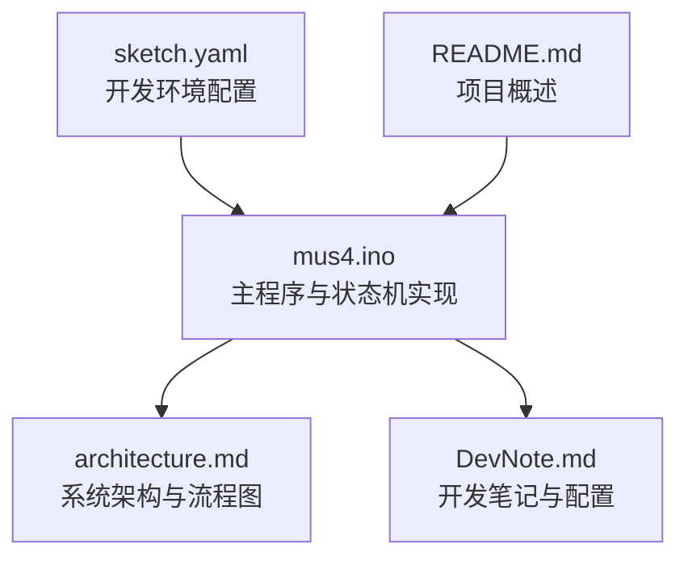
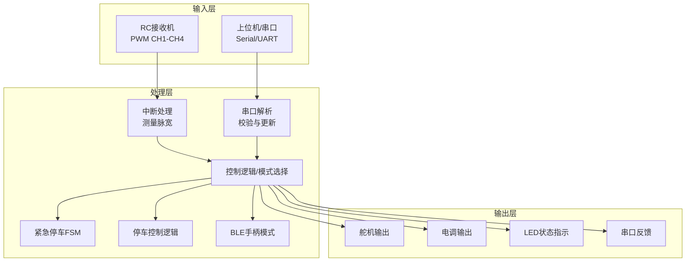
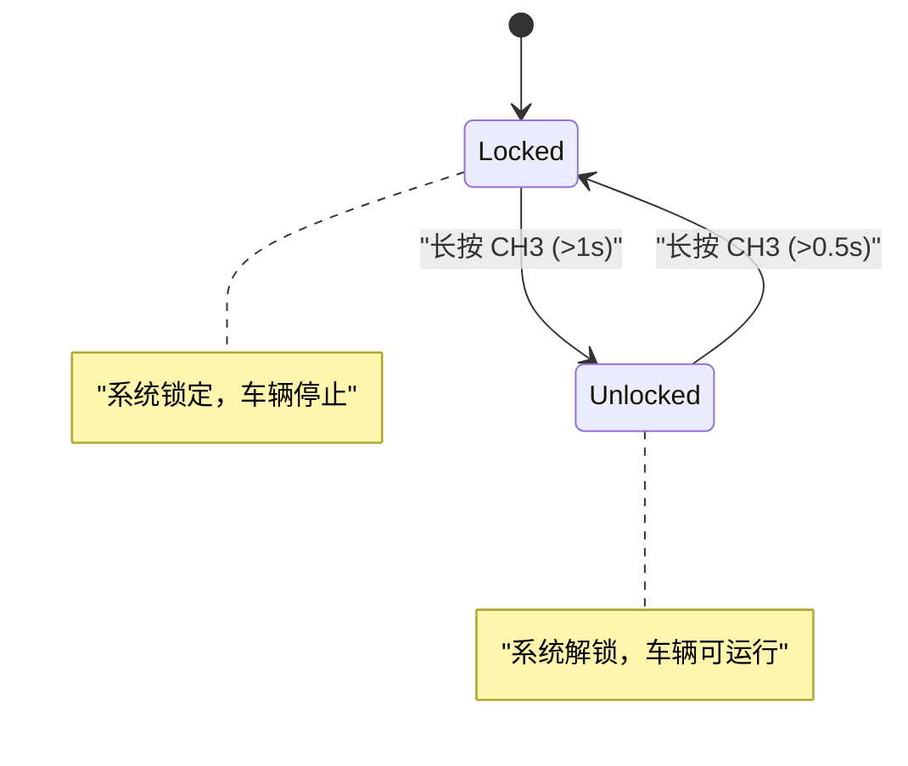
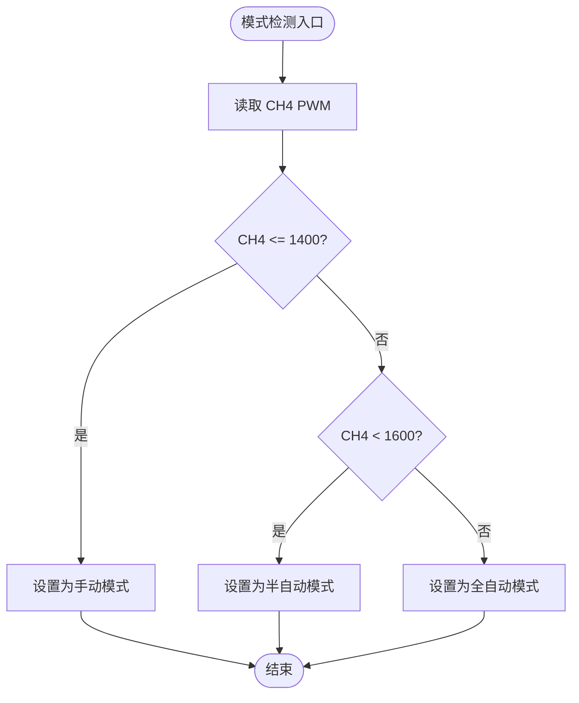
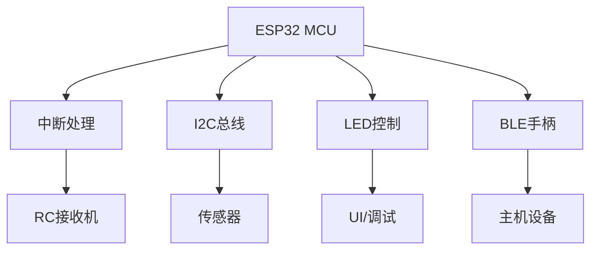

# 状态机扩展

<cite>
**本文引用的文件**
- [README.md](file://README.md)
- [mus4.ino](file://mus4/mus4.ino)
- [architecture.md](file://mus4/Doc/Arch/architecture.md)
- [DevNote.md](file://mus4/Doc/README/DevNote.md)
- [sketch.yaml](file://mus4/sketch.yaml)
</cite>

## 目录
1. [简介](#简介)
2. [项目结构](#项目结构)
3. [核心组件](#核心组件)
4. [架构总览](#架构总览)
5. [详细组件分析](#详细组件分析)
6. [依赖分析](#依赖分析)
7. [性能考虑](#性能考虑)
8. [故障排除指南](#故障排除指南)
9. [结论](#结论)
10. [附录](#附录)

## 简介
本指南面向MUS4项目（基于ESP32的自动驾驶小车控制固件）的状态机扩展需求，围绕现有紧急停车状态机与模式切换状态机，系统阐述如何设计与实现更复杂的有限状态机（FSM）。内容涵盖FSM设计原则、状态转换逻辑、维护策略、并发处理、状态持久化以及多层级状态机与协调机制，并提供可操作的扩展示例与调试技巧。

## 项目结构
MUS4项目采用“单文件主程序 + 文档说明”的组织方式，核心逻辑集中在mus4.ino中，架构与设计文档位于mus4/Doc目录。该结构便于快速定位状态机实现与相关数据流。



图表来源
- [mus4.ino](file://mus4/mus4.ino#L1-L1290)
- [architecture.md](file://mus4/Doc/Arch/architecture.md#L1-L245)
- [DevNote.md](file://mus4/Doc/README/DevNote.md#L1-L122)
- [sketch.yaml](file://mus4/sketch.yaml#L1-L3)

章节来源
- [mus4.ino](file://mus4/mus4.ino#L1-L1290)
- [architecture.md](file://mus4/Doc/Arch/architecture.md#L1-L245)
- [DevNote.md](file://mus4/Doc/README/DevNote.md#L1-L122)
- [sketch.yaml](file://mus4/sketch.yaml#L1-L3)

## 核心组件
- 紧急停车状态机（Emergency Stop FSM）：EST_IDLE → EST_READY → EST_BRAKING → EST_DONE，具备超时驱动与状态重置逻辑。
- 停车/解锁控制（Park Control）：基于CH3 PWM阈值的按键检测与状态保持，支持锁定/解锁的长按判定。
- 模式切换状态机（模式选择）：根据CH4 PWM阈值在手动/半自动/全自动之间切换。
- 主控制循环：整合RC输入、上位机指令、LED反馈、传感器读取与输出映射。

章节来源
- [mus4.ino](file://mus4/mus4.ino#L221-L525)
- [mus4.ino](file://mus4/mus4.ino#L686-L740)
- [mus4.ino](file://mus4/mus4.ino#L771-L786)
- [mus4.ino](file://mus4/mus4.ino#L1152-L1290)

## 架构总览
系统采用“输入采集 → 控制决策 → 执行输出”的流水线架构，状态机以独立函数形式存在并与主循环解耦，通过共享数据结构进行交互。



图表来源
- [architecture.md](file://mus4/Doc/Arch/architecture.md#L18-L45)
- [mus4.ino](file://mus4/mus4.ino#L414-L431)
- [mus4.ino](file://mus4/mus4.ino#L344-L411)
- [mus4.ino](file://mus4/mus4.ino#L1152-L1290)

## 详细组件分析

### 紧急停车状态机（Emergency Stop FSM）
- 状态集合：EST_IDLE、EST_READY、EST_BRAKING、EST_DONE
- 转换条件：
  - EST_IDLE → EST_READY：检测到停车信号且当前有油门
  - EST_IDLE → EST_DONE：检测到停车信号且当前无油门
  - EST_READY → EST_BRAKING：经过准备时间（缓冲期）
  - EST_BRAKING → EST_DONE：经过刹车时间
  - EST_DONE → EST_IDLE：解除停车信号
- 行为特征：
  - EST_READY阶段将油门设定为较小正值作为缓冲
  - EST_BRAKING阶段将油门设定为负值以实现强力刹车
  - EST_DONE阶段将油门归零并保持
- 并发与同步：
  - 通过共享变量car_output.park与car_output.throttle参与主循环决策
  - 状态机在主循环中被周期性调用，确保状态推进与主控制流同步

```mermaid
stateDiagram-v2
[*] --> EST_IDLE
EST_IDLE --> EST_READY : "触发停车且当前有油门"
EST_IDLE --> EST_DONE : "触发停车且当前无油门"
state EST_READY {
[*] --> WaitReady
WaitReady --> SetBrake : "经过 500ms"
note right of WaitReady : "缓冲期，油门设为 15"
}
EST_READY --> EST_BRAKING : "准备完成"
state EST_BRAKING {
[*] --> Braking
Braking --> BrakeDone : "经过 1500ms"
note right of Braking : "全力刹车，油门设为 -100"
}
EST_BRAKING --> EST_DONE : "刹车完成"
state EST_DONE {
note right of EST_DONE : "停车完成，油门归零"
}
EST_DONE --> EST_IDLE : "解除停车信号"
```

图表来源
- [mus4.ino](file://mus4/mus4.ino#L221-L525)

章节来源
- [mus4.ino](file://mus4/mus4.ino#L221-L525)
- [architecture.md](file://mus4/Doc/Arch/architecture.md#L117-L161)

### 停车/解锁控制（Park Control）
- 按键检测：基于CH3 PWM阈值判断按下/释放
- 状态转换：
  - Unlocked → Locked：长按超过0.5秒
  - Locked → Unlocked：长按超过1秒
- 行为特征：
  - 解锁时重置紧急停车状态机
  - 通过rc_data.park与car_output.park同步状态



图表来源
- [mus4.ino](file://mus4/mus4.ino#L686-L740)

章节来源
- [mus4.ino](file://mus4/mus4.ino#L686-L740)
- [DevNote.md](file://mus4/Doc/README/DevNote.md#L62-L66)

### 模式切换状态机（模式选择）
- 输入：CH4 PWM阈值
- 状态：
  - 手动模式（<=1400）
  - 半自动模式（1400~1600）
  - 全自动模式（>1600）
- 行为特征：
  - 不同模式下控制权分配不同（RC/Pilot）
  - 对应LED颜色指示



图表来源
- [mus4.ino](file://mus4/mus4.ino#L771-L786)

章节来源
- [mus4.ino](file://mus4/mus4.ino#L771-L786)
- [DevNote.md](file://mus4/Doc/README/DevNote.md#L53-L61)

### 主控制循环与状态机集成
- 主循环按固定节拍读取输入、更新数据、执行状态机、映射输出并刷新LED/UI。
- 状态机函数（如emergencyStop、park_change、mode_change）在主循环中被调用，确保状态推进与主控制流同步。
- 通过共享数据结构（struct_message）传递状态与控制量，降低耦合度。

```mermaid
sequenceDiagram
participant Loop as "主循环"
participant ISR as "中断处理"
participant Parser as "串口解析"
participant Mode as "模式选择"
participant Park as "停车控制"
participant Est as "紧急停车FSM"
participant Output as "输出映射"
Loop->>ISR : "读取RC PWM"
Loop->>Parser : "读取串口指令"
Loop->>Mode : "更新驾驶模式"
Loop->>Park : "更新停车状态"
Loop->>Est : "执行紧急停车状态机"
Loop->>Output : "映射并写入PWM"
```

图表来源
- [mus4.ino](file://mus4/mus4.ino#L1152-L1290)
- [mus4.ino](file://mus4/mus4.ino#L414-L431)
- [mus4.ino](file://mus4/mus4.ino#L344-L411)
- [mus4.ino](file://mus4/mus4.ino#L771-L786)
- [mus4.ino](file://mus4/mus4.ino#L686-L740)
- [mus4.ino](file://mus4/mus4.ino#L474-L525)

章节来源
- [mus4.ino](file://mus4/mus4.ino#L1152-L1290)

## 依赖分析
- 硬件抽象：RC PWM输入依赖ESP32中断；I2C传感器通过Wire库访问；LED通过FastLED库控制；BLE手柄模式依赖BleGamepad库。
- 数据结构：struct_message统一承载控制数据，emergencyStopState与park_btn等状态变量贯穿多个模块。
- 时序耦合：状态机依赖主循环节拍推进，LED闪烁与性能评估也受主循环调度影响。



图表来源
- [mus4.ino](file://mus4/mus4.ino#L24-L34)
- [mus4.ino](file://mus4/mus4.ino#L1104-L1150)
- [mus4.ino](file://mus4/mus4.ino#L841-L920)

章节来源
- [mus4.ino](file://mus4/mus4.ino#L24-L34)
- [mus4.ino](file://mus4/mus4.ino#L1104-L1150)
- [mus4.ino](file://mus4/mus4.ino#L841-L920)

## 性能考虑
- 中断优先级：RC PWM测量使用中断，需避免长时间阻塞；建议将耗时操作移出中断上下文。
- 主循环节拍：主循环按固定间隔执行，状态机推进与UI刷新均受此节拍约束；可通过动态调整UI刷新间隔适应性能退化。
- 传感器采样：传感器读取按固定间隔进行，避免频繁I2C访问导致总线拥塞。
- LED闪烁：扫描函数scanLEDToggle在主循环中周期调用，避免占用过多CPU时间。

章节来源
- [mus4.ino](file://mus4/mus4.ino#L414-L431)
- [mus4.ino](file://mus4/mus4.ino#L1152-L1290)
- [mus4.ino](file://mus4/mus4.ino#L290-L305)

## 故障排除指南
- 紧急停车状态机异常
  - 现象：EST状态不前进或卡死
  - 排查：确认park信号与throttle条件满足；检查状态重置逻辑（解除停车信号后回到EST_IDLE）
  - 参考路径：[mus4.ino](file://mus4/mus4.ino#L474-L525)
- 停车/解锁逻辑失效
  - 现象：长按无效或状态反转
  - 排查：检查CH3阈值与长按时长配置；确认park_btn_pressed状态机与park_action_taken互斥
  - 参考路径：[mus4.ino](file://mus4/mus4.ino#L686-L740)
- 模式切换不生效
  - 现象：CH4阈值变化但模式未切换
  - 排查：确认CH4 PWM读取与阈值比较逻辑；检查mode_change调用时机
  - 参考路径：[mus4.ino](file://mus4/mus4.ino#L771-L786)
- 串口通信错误
  - 现象：命令解析失败或校验错误
  - 排查：检查校验和计算与消息格式；确认缓冲区溢出与错误计数
  - 参考路径：[mus4.ino](file://mus4/mus4.ino#L320-L411)
- 传感器读取失败
  - 现象：INA219/MPU6050数据无效
  - 排查：检查I2C地址与引脚配置；执行I2C扫描；确认初始化重试逻辑
  - 参考路径：[mus4.ino](file://mus4/mus4.ino#L841-L920), [mus4.ino](file://mus4/mus4.ino#L922-L975)

章节来源
- [mus4.ino](file://mus4/mus4.ino#L320-L411)
- [mus4.ino](file://mus4/mus4.ino#L474-L525)
- [mus4.ino](file://mus4/mus4.ino#L686-L740)
- [mus4.ino](file://mus4/mus4.ino#L771-L786)
- [mus4.ino](file://mus4/mus4.ino#L841-L920)
- [mus4.ino](file://mus4/mus4.ino#L922-L975)

## 结论
MUS4项目中的状态机设计遵循“独立函数 + 主循环驱动”的模式，具备清晰的状态转换与稳定的时序推进。通过共享数据结构与明确的输入/输出边界，状态机易于扩展与维护。建议在扩展时严格遵循本文提出的FSM设计原则与调试策略，确保复杂行为的可控性与可维护性。

## 附录

### 状态机扩展设计原则
- 状态最小化：仅保留必要状态，避免过度细分
- 条件明确化：转换条件应可量化、可测试
- 时序解耦：状态推进由主循环统一调度，避免阻塞
- 可观测性：为每个状态与转换提供日志或LED指示
- 可恢复性：提供状态重置与降级模式

### 新状态添加方法
- 定义枚举与状态变量：在现有枚举基础上新增状态，并声明对应变量
- 实现状态机函数：编写独立函数，接受输入参数并返回下一状态
- 在主循环中调用：将状态机函数纳入主循环的固定节拍执行
- 同步共享数据：通过共享结构体传递状态与控制量

章节来源
- [mus4.ino](file://mus4/mus4.ino#L221-L525)
- [mus4.ino](file://mus4/mus4.ino#L1152-L1290)

### 状态转换条件定义
- 数字阈值：基于PWM阈值的比较（如CH3长按时长、CH4模式阈值）
- 时间驱动：基于定时器的超时（如紧急停车准备/刹车时间）
- 事件触发：基于外部输入的上升/下降沿（如park按键检测）

章节来源
- [mus4.ino](file://mus4/mus4.ino#L686-L740)
- [mus4.ino](file://mus4/mus4.ino#L771-L786)
- [mus4.ino](file://mus4/mus4.ino#L474-L525)

### 并发处理与同步
- 中断与主循环分离：中断仅做脉宽测量，不执行复杂逻辑
- 主循环统一调度：状态机与UI刷新在同一节拍内执行
- LED闪烁扫描：在主循环中定期扫描，避免占用CPU

章节来源
- [mus4.ino](file://mus4/mus4.ino#L414-L431)
- [mus4.ino](file://mus4/mus4.ino#L1281-L1282)

### 状态持久化与降级模式
- 状态持久化：当前实现为内存态，若需持久化可在系统初始化时从非易失存储读取状态
- 降级模式：基于性能评估动态调整UI刷新间隔，避免系统过载

章节来源
- [mus4.ino](file://mus4/mus4.ino#L290-L305)
- [mus4.ino](file://mus4/mus4.ino#L1282-L1288)

### 多层级状态机与协调机制
- 层级划分：将复杂行为拆分为多个子状态机（如模式选择、紧急停车、传感器监控）
- 协调策略：通过共享数据结构与主循环节拍实现状态机间协调
- 优先级管理：高优先级状态机（如紧急停车）可覆盖低优先级状态

章节来源
- [architecture.md](file://mus4/Doc/Arch/architecture.md#L66-L107)
- [mus4.ino](file://mus4/mus4.ino#L1152-L1290)

### 调试技巧
- 日志输出：为每个状态转换打印日志，便于追踪状态推进
- LED指示：利用LED颜色与闪烁模式直观反映状态
- 单元测试：对关键函数（如串口解析、映射函数）编写单元测试
- 基准测试：通过循环计数评估主循环性能

章节来源
- [mus4.ino](file://mus4/mus4.ino#L153-L200)
- [mus4.ino](file://mus4/mus4.ino#L588-L684)