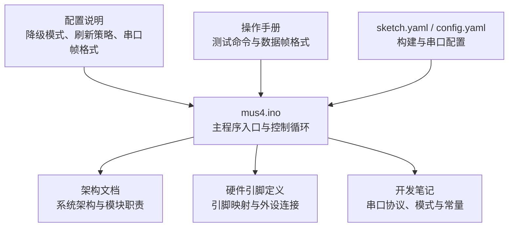
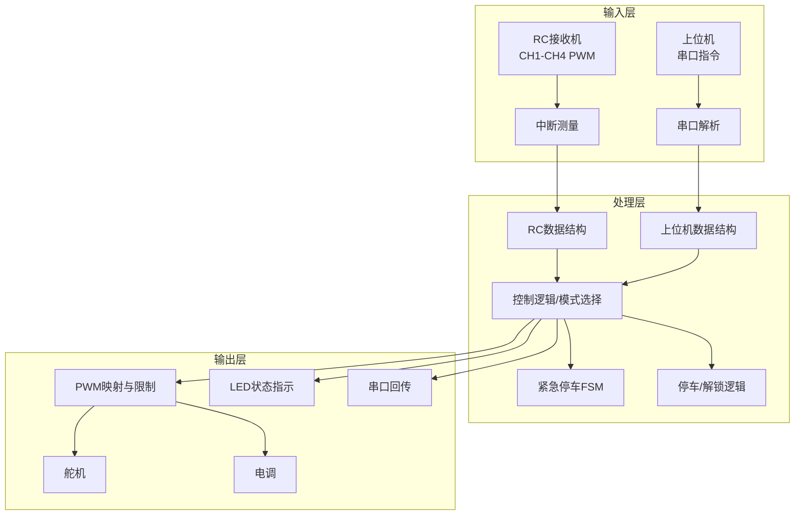
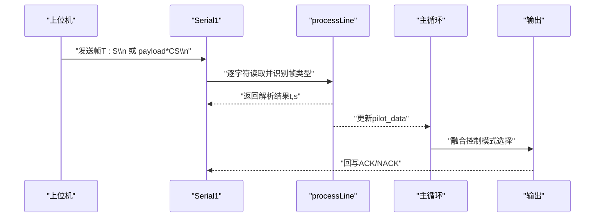
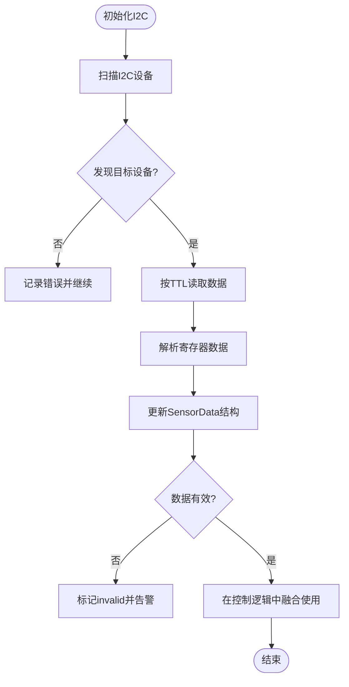
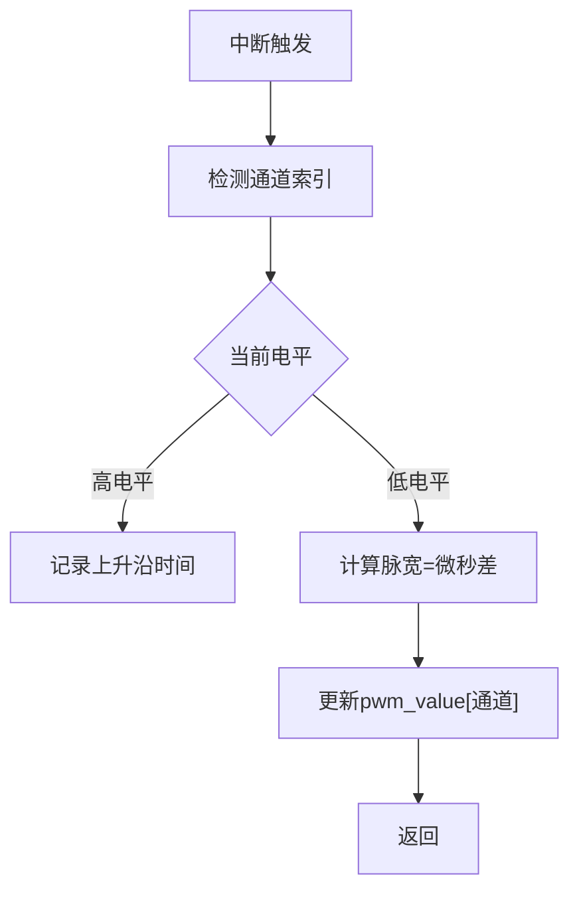
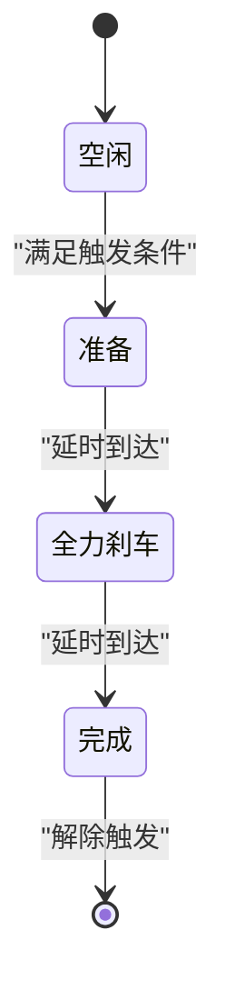
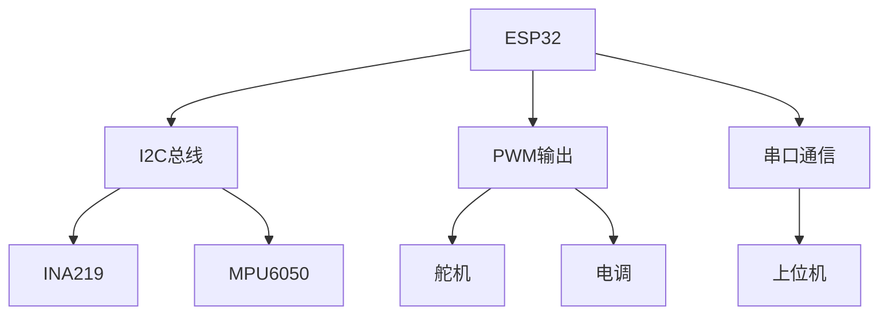

# 软件功能扩展

<cite>
**本文引用的文件**
- [mus4.ino](file://mus4/mus4.ino)
- [架构文档](file://mus4/Doc/Arch/architecture.md)
- [硬件引脚定义](file://mus4/Doc/Hardware/pin_definitions.md)
- [开发笔记](file://mus4/Doc/README/DevNote.md)
- [配置说明](file://docs/CONFIG.md)
- [操作手册](file://docs/OPERATIONS.md)
- [sketch.yaml](file://mus4/sketch.yaml)
- [config.yaml](file://config.yaml)
</cite>

## 目录
1. [简介](#简介)
2. [项目结构](#项目结构)
3. [核心组件](#核心组件)
4. [架构总览](#架构总览)
5. [详细组件分析](#详细组件分析)
6. [依赖分析](#依赖分析)
7. [性能考虑](#性能考虑)
8. [故障排查指南](#故障排查指南)
9. [结论](#结论)
10. [附录](#附录)

## 简介
本指南面向希望在MUS4项目（ESP32自动驾驶小车控制固件）上进行功能扩展的开发者，围绕模块化架构，系统讲解如何：
- 添加新的控制算法（扩展控制逻辑与状态机）
- 扩展通信协议（串口协议、校验与帧格式）
- 集成新传感器（I2C设备接入与数据融合）
- 设计函数接口与数据结构扩展
- 保持向后兼容与评估性能影响
- 涉及高级主题：中断处理扩展、串口协议扩展、状态机扩展

目标是帮助你在不破坏现有稳定性的前提下，安全、可维护地引入新功能。

## 项目结构
MUS4采用单文件Arduino工程（mus4.ino）集中实现控制逻辑、传感器读取、通信与状态指示；配套文档位于mus4/Doc与docs目录，提供架构、硬件引脚、开发与操作说明。

**图表来源**
- [mus4.ino](file://mus4/mus4.ino#L1104-L1150)
- [架构文档](file://mus4/Doc/Arch/architecture.md#L1-L45)
- [硬件引脚定义](file://mus4/Doc/Hardware/pin_definitions.md#L1-L120)
- [开发笔记](file://mus4/Doc/README/DevNote.md#L15-L30)
- [配置说明](file://docs/CONFIG.md#L1-L24)
- [操作手册](file://docs/OPERATIONS.md#L1-L21)
- [sketch.yaml](file://mus4/sketch.yaml#L1-L3)
- [config.yaml](file://config.yaml#L1-L13)

**章节来源**
- [mus4.ino](file://mus4/mus4.ino#L1104-L1150)
- [架构文档](file://mus4/Doc/Arch/architecture.md#L1-L45)
- [硬件引脚定义](file://mus4/Doc/Hardware/pin_definitions.md#L1-L120)
- [开发笔记](file://mus4/Doc/README/DevNote.md#L15-L30)
- [配置说明](file://docs/CONFIG.md#L1-L24)
- [操作手册](file://docs/OPERATIONS.md#L1-L21)
- [sketch.yaml](file://mus4/sketch.yaml#L1-L3)
- [config.yaml](file://config.yaml#L1-L13)

## 核心组件
- 信号采集与中断处理：RC接收机PWM输入（CH1-CH4），通过中断测量脉宽，解析为控制量。
- 串口通信：USB与RS232双通道，支持基本帧与带校验帧，回写ACK/NACK。
- 控制逻辑：根据驾驶模式（手动/半自动/全AUTO）融合RC与上位机指令，输出至舵机与电调。
- 安全机制：紧急停车状态机与停车/解锁逻辑。
- 传感器：INA219（电源监测）与MPU6050（IMU），通过I2C读取并存储结构化数据。
- 状态指示：WS2812B LED显示模式与紧急状态。
- 可选功能：BLE手柄模式（宏开关）。

**章节来源**
- [mus4.ino](file://mus4/mus4.ino#L414-L434)
- [mus4.ino](file://mus4/mus4.ino#L320-L395)
- [mus4.ino](file://mus4/mus4.ino#L1152-L1290)
- [mus4.ino](file://mus4/mus4.ino#L841-L920)
- [mus4.ino](file://mus4/mus4.ino#L240-L274)
- [架构文档](file://mus4/Doc/Arch/architecture.md#L117-L161)
- [硬件引脚定义](file://mus4/Doc/Hardware/pin_definitions.md#L115-L181)

## 架构总览
系统采用“输入-处理-输出”分层，主循环按固定周期更新传感器、解析串口、更新RC数据、执行控制逻辑、映射PWM并驱动LED与串口反馈。

**图表来源**
- [架构文档](file://mus4/Doc/Arch/architecture.md#L18-L45)
- [mus4.ino](file://mus4/mus4.ino#L1152-L1290)

## 详细组件分析

### 1) 新控制算法扩展（添加新算法模块）
- 设计原则
  - 保持与现有数据结构兼容：新增算法输入输出均以struct_message或等价结构参与融合。
  - 优先在模式分支内插入，避免跨模式逻辑耦合。
  - 通过宏或配置项控制算法开关，确保向后兼容。
- 数据结构扩展
  - 若需新增状态字段，在struct_message中增加字段，并在初始化处赋初值。
  - 传感器数据结构（如SensorData）可按需扩展，但需同步更新读取与有效性判断。
- 实现步骤
  - 在主循环中新增算法调用点（建议在模式选择之后、输出映射之前）。
  - 将算法输出合并到car_output（如steering或throttle）。
  - 为新算法提供配置参数与阈值，必要时加入降级模式下的安全回退。
- 向后兼容
  - 默认关闭新算法，通过宏或运行时配置开启。
  - 保留原控制路径，新算法仅在特定条件下生效。
- 性能影响评估
  - 计算复杂度应控制在主循环周期内（约16ms更新一次）。
  - 使用定时器或TTL策略减少计算频率，避免阻塞主循环。

**章节来源**
- [mus4.ino](file://mus4/mus4.ino#L1152-L1290)
- [mus4.ino](file://mus4/mus4.ino#L460-L473)
- [mus4.ino](file://mus4/mus4.ino#L208-L220)
- [架构文档](file://mus4/Doc/Arch/architecture.md#L66-L107)

### 2) 通信协议扩展（串口协议与校验）
- 现有协议
  - 基本帧：T:S\n（-100~100）
  - 可选帧：payload*CS\n（ASCII求和低8位校验，两位十六进制）
  - 应答：ACK/NACK
- 扩展设计
  - 新增帧类型：在processLine中增加识别逻辑，区分不同帧头或长度规则。
  - 新增字段：在解析函数中扩展字段数量与顺序，保持向后兼容（可选字段以分隔符表示空缺）。
  - 校验增强：若需更强健性，可在payload中加入序列号或CRC16。
- 实现步骤
  - 在readSerialBuf中增加新帧类型的分支处理。
  - 在parseAndValidateCommand基础上扩展解析器，返回多字段数组或结构体。
  - 为新帧类型定义ACK/NACK语义，确保上位机可识别。
- 向后兼容
  - 旧帧格式保持不变，新帧仅在上位机升级后启用。
  - 通过版本号或帧头标识区分协议版本。
- 性能影响
  - 校验与解析开销较小，但需避免在主循环高频调用复杂校验。
  - 可在缓冲区满或超时时批量处理，减少串口中断负担。

**图表来源**
- [mus4.ino](file://mus4/mus4.ino#L344-L411)
- [mus4.ino](file://mus4/mus4.ino#L320-L395)
- [mus4.ino](file://mus4/mus4.ino#L1249-L1253)
- [配置说明](file://docs/CONFIG.md#L13-L16)

**章节来源**
- [mus4.ino](file://mus4/mus4.ino#L344-L411)
- [mus4.ino](file://mus4/mus4.ino#L320-L395)
- [mus4.ino](file://mus4/mus4.ino#L1249-L1253)
- [配置说明](file://docs/CONFIG.md#L13-L16)
- [开发笔记](file://mus4/Doc/README/DevNote.md#L24-L29)

### 3) 新传感器集成（I2C扩展）
- 接入流程
  - 硬件：确认I2C引脚（SDA/SCL）与电源地连接，必要时加拉电流。
  - 软件：在setup阶段扫描I2C总线，初始化设备；在主循环按TTL策略读取数据。
  - 数据结构：在SensorData或新增结构中存储新传感器字段，并维护valid标志。
- 读写封装
  - 使用I2CRead/I2CReadValue/I2CWriteValue等封装函数，统一错误处理与日志。
  - 读取失败时置valid=false，避免污染主循环控制。
- 融合策略
  - 将新传感器数据作为控制输入（如偏航角、倾斜补偿）或状态反馈（如健康度）。
  - 通过降级模式在传感器失效时自动切换安全策略。
- 向后兼容
  - 新传感器默认关闭，通过宏或配置项启用。
  - 传感器异常不影响主控制回路，维持安全输出。

**图表来源**
- [mus4.ino](file://mus4/mus4.ino#L922-L975)
- [mus4.ino](file://mus4/mus4.ino#L868-L896)
- [mus4.ino](file://mus4/mus4.ino#L898-L920)
- [mus4.ino](file://mus4/mus4.ino#L208-L220)

**章节来源**
- [mus4.ino](file://mus4/mus4.ino#L922-L975)
- [mus4.ino](file://mus4/mus4.ino#L868-L896)
- [mus4.ino](file://mus4/mus4.ino#L898-L920)
- [mus4.ino](file://mus4/mus4.ino#L208-L220)
- [硬件引脚定义](file://mus4/Doc/Hardware/pin_definitions.md#L96-L110)

### 4) 中断处理扩展（RC输入与新输入源）
- 现状
  - 使用4个CH引脚（CH1-CH4）绑定中断，记录上升沿时间并在下降沿计算脉宽。
- 扩展要点
  - 新输入源（如PWM或捕获引脚）需：
    - 定义新通道索引与数组（如pwm_value[]、rise_time[]）。
    - 在setup中配置为INPUT并attachInterrupt。
    - 在handle_interrupt中区分channel并更新对应值。
  - 为新通道增加校准与滤波（如中位剔除、限幅）。
- 向后兼容
  - 新通道默认不参与控制，通过宏或配置启用。
  - 保持原有CH1-CH4行为不变。

**图表来源**
- [mus4.ino](file://mus4/mus4.ino#L414-L434)

**章节来源**
- [mus4.ino](file://mus4/mus4.ino#L414-L434)
- [硬件引脚定义](file://mus4/Doc/Hardware/pin_definitions.md#L34-L46)

### 5) 状态机扩展（新增安全/控制状态）
- 现状
  - 紧急停车状态机（EST_IDLE/READY/BRAKING/DONE）与停车/解锁状态机。
- 扩展要点
  - 新状态机应：
    - 明确定义状态集合与转换条件（时间、阈值、事件）。
    - 在主循环中按优先级更新，避免相互干扰。
    - 提供可视化指示（LED颜色/闪烁模式）。
  - 与现有状态机解耦，通过共享标志（如park、emergencyStopState）协调。
- 向后兼容
  - 新状态机默认关闭，通过宏或配置启用。
  - 与紧急停车状态机并行存在，互不影响。

**图表来源**
- [架构文档](file://mus4/Doc/Arch/architecture.md#L123-L151)

**章节来源**
- [架构文档](file://mus4/Doc/Arch/architecture.md#L117-L161)
- [mus4.ino](file://mus4/mus4.ino#L474-L525)

### 6) 函数接口设计原则与数据结构扩展
- 接口设计
  - 保持幂等与可重入：中断服务例程（IRAM_ATTR）与普通函数分离职责。
  - 统一命名规范：模块前缀（如sensor_、serial_、control_）。
  - 明确输入输出：所有函数明确参数与返回值，避免隐式共享。
- 数据结构
  - 结构体字段尽量紧凑，避免频繁内存拷贝。
  - 使用枚举与常量替代魔法数，提升可读性与可维护性。
  - 为每个结构体提供初始化与重置函数，便于模块化测试。
- 并发与原子性
  - volatile用于共享的中断变量（如pwm_value[]、rise_time[]）。
  - 临界区最小化，避免在中断中做复杂运算。

**章节来源**
- [mus4.ino](file://mus4/mus4.ino#L79-L84)
- [mus4.ino](file://mus4/mus4.ino#L460-L473)
- [mus4.ino](file://mus4/mus4.ino#L414-L434)

## 依赖分析
- 硬件依赖
  - I2C总线：SDA/SCL引脚与设备地址（如0x40/0x68）。
  - PWM输出：舵机/电调引脚与ledc通道绑定。
  - 串口：USB与RS232分别用于调试与上位机通信。
- 软件依赖
  - Adafruit_MPU6050、Adafruit_INA219、Wire、FastLED、BleGamepad等库。
- 潜在耦合
  - 控制逻辑与状态机之间存在条件耦合，需通过清晰的状态标志与优先级避免竞态。
  - 传感器读取与UI刷新存在时间竞争，需TTL与降级模式缓解。

**图表来源**
- [硬件引脚定义](file://mus4/Doc/Hardware/pin_definitions.md#L115-L181)
- [mus4.ino](file://mus4/mus4.ino#L1119-L1123)

**章节来源**
- [硬件引脚定义](file://mus4/Doc/Hardware/pin_definitions.md#L115-L181)
- [mus4.ino](file://mus4/mus4.ino#L1119-L1123)

## 性能考虑
- 主循环节拍
  - RC数据更新约16ms，传感器1000ms，UI约16ms（自适应100–500ms）。
- 降级模式
  - 传感器无效、UI渲染耗时>150ms、串口回写拥塞时自动降级，关闭波形与降低刷新频率。
- 优化建议
  - 将复杂计算（如滤波、查找表）移出中断，使用标志位唤醒。
  - 使用TTL与增量更新策略减少冗余输出。
  - 串口缓冲溢出检测与错误计数，避免阻塞主循环。

**章节来源**
- [mus4.ino](file://mus4/mus4.ino#L109-L136)
- [mus4.ino](file://mus4/mus4.ino#L290-L305)
- [配置说明](file://docs/CONFIG.md#L3-L6)
- [操作手册](file://docs/OPERATIONS.md#L5-L7)

## 故障排查指南
- 串口通信
  - 帧格式错误：检查payload与校验位，确认ACK/NACK回执。
  - 溢出与错误计数：关注serialBuf的overflow与errors字段。
- 传感器异常
  - INA219/MPU6050初始化失败：检查I2C地址与连线，确认扫描结果。
  - 数据无效：检查valid标志与TTL刷新策略。
- 状态指示
  - LED颜色与闪烁：对应当前模式与紧急状态，异常时观察降级提示。
- 测试命令
  - TEST/BENCH/STRESS/REGRESS：在任一串口输入命令进行验证。

**章节来源**
- [mus4.ino](file://mus4/mus4.ino#L344-L411)
- [mus4.ino](file://mus4/mus4.ino#L868-L896)
- [mus4.ino](file://mus4/mus4.ino#L898-L920)
- [配置说明](file://docs/CONFIG.md#L18-L23)
- [操作手册](file://docs/OPERATIONS.md#L8-L21)

## 结论
通过对MUS4现有架构的深入分析，我们总结出一套可复用的扩展方法论：以数据结构为中心、以主循环为边界、以宏与配置为开关、以降级模式为安全网。遵循这些原则，可以在不破坏稳定性的前提下，安全地添加新算法、扩展通信协议与集成新传感器，并在性能与可靠性之间取得平衡。

## 附录
- 构建与串口配置
  - sketch.yaml与config.yaml定义了FQBN、端口、波特率与构建路径，确保开发与部署一致性。
- 文档体系
  - 架构文档、硬件引脚定义、开发笔记、配置说明与操作手册共同构成完整的知识体系，建议在扩展前通读。

**章节来源**
- [sketch.yaml](file://mus4/sketch.yaml#L1-L3)
- [config.yaml](file://config.yaml#L1-L13)
- [架构文档](file://mus4/Doc/Arch/architecture.md#L1-L45)
- [硬件引脚定义](file://mus4/Doc/Hardware/pin_definitions.md#L1-L120)
- [开发笔记](file://mus4/Doc/README/DevNote.md#L1-L122)
- [配置说明](file://docs/CONFIG.md#L1-L24)
- [操作手册](file://docs/OPERATIONS.md#L1-L21)