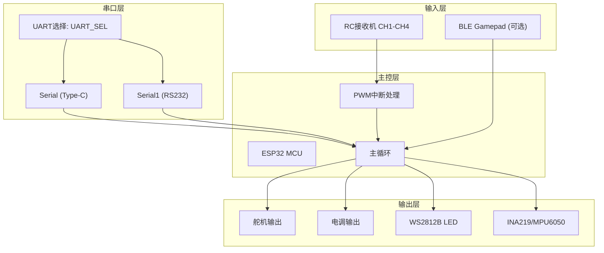
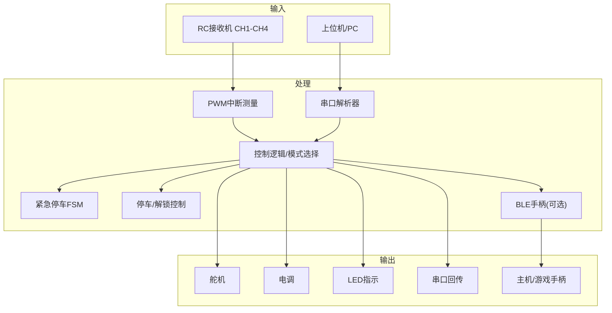
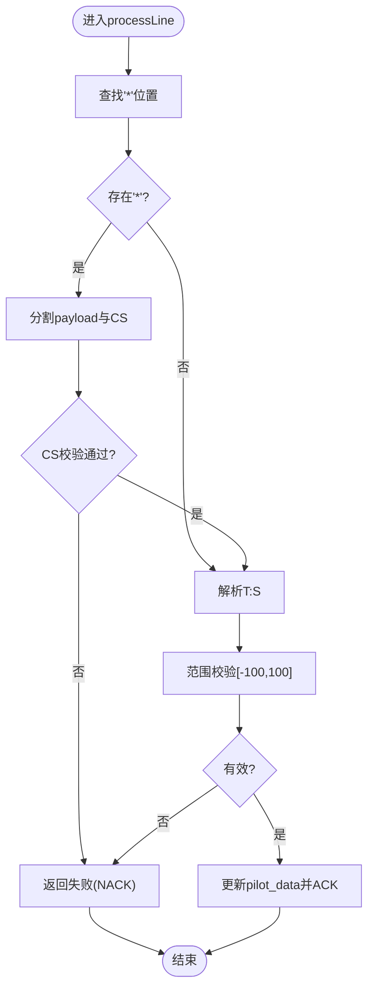
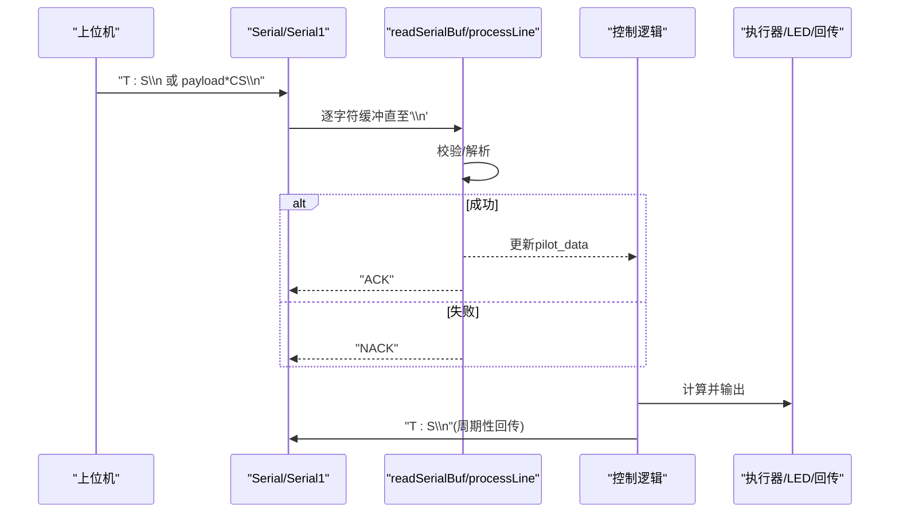
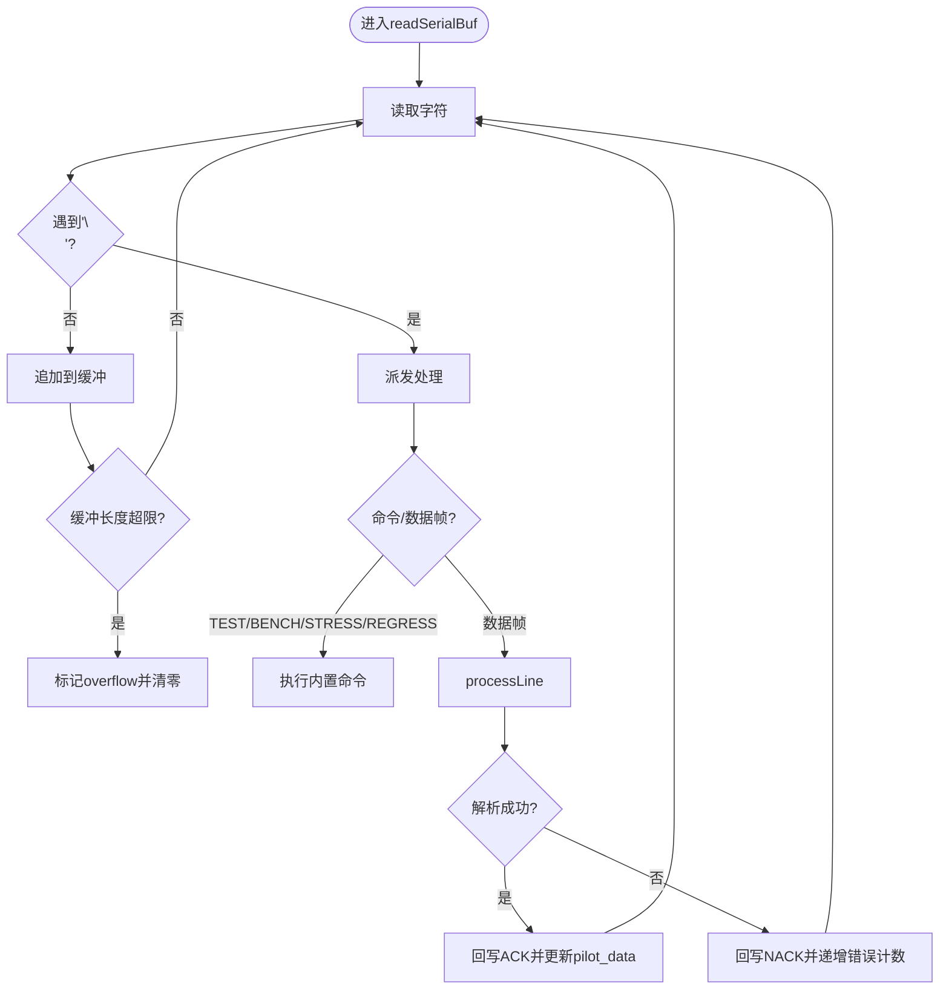
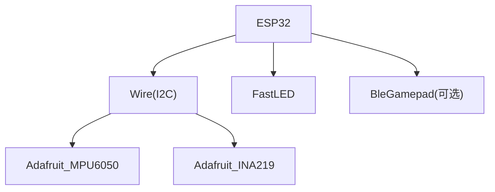

# 通信协议扩展

<cite>
**本文引用的文件**
- [mus4.ino](file://mus4/mus4.ino)
- [DevNote.md](file://mus4/Doc/README/DevNote.md)
- [pin_definitions.md](file://mus4/Doc/Hardware/pin_definitions.md)
- [architecture.md](file://mus4/Doc/Arch/architecture.md)
- [CONFIG.md](file://docs/CONFIG.md)
- [OPERATIONS.md](file://docs/OPERATIONS.md)
- [Enable ESP32 Bluetooth Gamepad Mode.md](file://.trae/documents/Enable ESP32 Bluetooth Gamepad Mode.md)
- [config.yaml](file://config.yaml)
- [sketch.yaml](file://mus4/sketch.yaml)
</cite>

## 目录
1. [简介](#简介)
2. [项目结构](#项目结构)
3. [核心组件](#核心组件)
4. [架构总览](#架构总览)
5. [详细组件分析](#详细组件分析)
6. [依赖关系分析](#依赖关系分析)
7. [性能考量](#性能考量)
8. [故障排查指南](#故障排查指南)
9. [结论](#结论)
10. [附录](#附录)

## 简介
本指南面向希望在MUS4项目中扩展通信协议的开发者，基于现有串口通信协议与双串口路由设计，系统讲解如何新增命令类型、数据包格式与校验机制；同时覆盖BLE游戏手柄协议与WiFi通信协议的扩展路径，确保协议版本兼容与向后兼容性。

## 项目结构
MUS4采用ESP32作为主控，围绕串口通信、RC接收机输入、传感器数据采集与执行器输出构建。核心逻辑集中在单文件固件中，通过宏开关控制BLE等可选功能；双串口（Type-C与RS232）提供不同路由路径，便于上位机与外部设备交互。



图表来源
- [mus4.ino](file://mus4/mus4.ino#L1104-L1150)
- [pin_definitions.md](file://mus4/Doc/Hardware/pin_definitions.md#L115-L181)

章节来源
- [mus4.ino](file://mus4/mus4.ino#L1104-L1150)
- [pin_definitions.md](file://mus4/Doc/Hardware/pin_definitions.md#L1-L225)

## 核心组件
- 串口解析与校验：支持基础帧与带校验帧，返回ACK/NACK。
- 双串口路由：通过UART选择引脚切换Type-C与RS232通路。
- 协议解析器：将字符串解析为油门/转向指令，含范围校验。
- 错误处理：帧错误计数、溢出标记、降级模式触发。
- 可选BLE：将RC通道映射为手柄轴，实现无线控制。

章节来源
- [mus4.ino](file://mus4/mus4.ino#L137-L139)
- [mus4.ino](file://mus4/mus4.ino#L344-L411)
- [mus4.ino](file://mus4/mus4.ino#L320-L342)
- [mus4.ino](file://mus4/mus4.ino#L1087-L1102)
- [CONFIG.md](file://docs/CONFIG.md#L13-L16)

## 架构总览
下图展示MUS4的系统架构与数据流，重点体现串口解析、双串口路由、控制逻辑与输出映射。



图表来源
- [architecture.md](file://mus4/Doc/Arch/architecture.md#L18-L45)
- [mus4.ino](file://mus4/mus4.ino#L1152-L1290)

章节来源
- [architecture.md](file://mus4/Doc/Arch/architecture.md#L1-L245)

## 详细组件分析

### 串口解析器与消息格式
- 基础帧格式：T:S\n，其中T为油门，S为转向，范围[-100, 100]。
- 可选校验帧：payload*CS\n，CS为payload的ASCII求和低8位，两位十六进制。
- 解析流程：截取星号前的payload，计算校验并与CS比较；若匹配则进一步解析冒号分隔的T与S。
- 错误处理：校验失败或范围越界返回false，串口回写NACK并增加错误计数；成功则回写ACK并更新pilot数据。



图表来源
- [mus4.ino](file://mus4/mus4.ino#L320-L342)
- [mus4.ino](file://mus4/mus4.ino#L344-L397)

章节来源
- [mus4.ino](file://mus4/mus4.ino#L320-L342)
- [mus4.ino](file://mus4/mus4.ino#L344-L397)
- [CONFIG.md](file://docs/CONFIG.md#L13-L16)

### 双串口通信路由规则
- UART选择：通过UART选择引脚控制通路，初始化时默认选择RS232通路。
- 串口对象：Serial(Type-C)与Serial1(RS232)分别处理不同来源的数据。
- 路由行为：在读取函数中区分isRS232参数，决定回写ACK/NACK的目标串口。



图表来源
- [mus4.ino](file://mus4/mus4.ino#L1104-L1150)
- [mus4.ino](file://mus4/mus4.ino#L344-L411)
- [mus4.ino](file://mus4/mus4.ino#L1249-L1253)

章节来源
- [mus4.ino](file://mus4/mus4.ino#L1104-L1150)
- [mus4.ino](file://mus4/mus4.ino#L344-L411)
- [mus4.ino](file://mus4/mus4.ino#L1249-L1253)

### 协议版本兼容性与向后兼容
- 向后兼容：新增校验帧不影响旧版客户端；旧版客户端仅发送基础帧，解析器兼容。
- 版本策略建议：引入版本字段（如V1、V2），在payload前缀标识；解析器先读取版本再选择解析分支，避免破坏既有协议。
- 兼容性保障：保留默认解析分支；对未知版本返回NACK并记录错误，便于上位机升级。

章节来源
- [mus4.ino](file://mus4/mus4.ino#L320-L342)
- [CONFIG.md](file://docs/CONFIG.md#L13-L16)

### 错误处理机制
- 帧错误计数：每个无效帧递增错误计数，便于统计与诊断。
- 缓冲溢出：超过缓冲长度时清零并标记overflow，避免内存越界。
- 降级模式：当传感器无效、UI渲染耗时过长或串口拥塞时触发，关闭波形与降低UI刷新频率，保留核心控制与状态输出。



图表来源
- [mus4.ino](file://mus4/mus4.ino#L344-L411)
- [CONFIG.md](file://docs/CONFIG.md#L3-L6)

章节来源
- [mus4.ino](file://mus4/mus4.ino#L344-L411)
- [CONFIG.md](file://docs/CONFIG.md#L3-L6)

### BLE游戏手柄协议扩展
- 现状：通过宏开关启用BLE手柄，将RC通道映射为手柄轴，周期性上报。
- 扩展点：可在映射函数中增加更多轴/按键，或引入自定义协议头以支持多命令类型。
- 实施步骤：在宏块内添加新命令枚举与解析分支；在映射函数中扩展轴映射；在loop中周期调用。

```mermaid
sequenceDiagram
participant Loop as "主循环"
participant BLE as "sendGamepadPacket()"
participant RC as "pwm_value[]"
participant Host as "主机/游戏手柄"
Loop->>BLE : 周期调用
BLE->>RC : 读取CH1/CH2/CH3/CH4
BLE->>BLE : 范围映射与约束
BLE-->>Host : setLeftThumb/setRightThumb
```

图表来源
- [mus4.ino](file://mus4/mus4.ino#L1087-L1102)
- [DevNote.md](file://mus4/Doc/README/DevNote.md#L74-L81)

章节来源
- [mus4.ino](file://mus4/mus4.ino#L1087-L1102)
- [DevNote.md](file://mus4/Doc/README/DevNote.md#L74-L81)
- [Enable ESP32 Bluetooth Gamepad Mode.md](file://.trae/documents/Enable ESP32 Bluetooth Gamepad Mode.md#L1-L16)

### WiFi通信协议扩展
- 现状：开发笔记中明确已禁用ESP-NOW与WiFi功能。
- 扩展路径：可引入WiFi STA/AP模式，基于TCP/UDP或HTTP实现远程控制；或使用MQTT发布订阅模式。
- 协议设计建议：
  - 命令类型：控制指令、状态查询、参数下发、ACK/NACK。
  - 数据格式：JSON或二进制帧，包含序列号、命令ID、负载与校验。
  - 校验机制：CRC32或MD5摘要，确保完整性与防篡改。
  - 路由策略：WiFi与串口并行接入，优先级可通过模式选择或命令头字段决定。
- 兼容性：保留串口协议作为降级通道；WiFi协议版本独立管理，通过版本协商兼容。

章节来源
- [DevNote.md](file://mus4/Doc/README/DevNote.md#L88-L91)

## 依赖关系分析
- 硬件依赖：I2C引脚、PWM输出引脚、串口引脚与UART选择引脚。
- 库依赖：Wire、FastLED、Adafruit_MPU6050、Adafruit_INA219、BleGamepad（可选）。
- 数据结构：SerialBuf、struct_message、传感器数据结构体。



图表来源
- [mus4.ino](file://mus4/mus4.ino#L24-L37)
- [pin_definitions.md](file://mus4/Doc/Hardware/pin_definitions.md#L96-L101)

章节来源
- [mus4.ino](file://mus4/mus4.ino#L24-L37)
- [pin_definitions.md](file://mus4/Doc/Hardware/pin_definitions.md#L96-L101)

## 性能考量
- UI自适应刷新：根据渲染耗时动态调整UI刷新周期，避免阻塞主循环。
- 传感器TTL：仅在TTL到期或数据变化时刷新，减少串口回传压力。
- 串口缓冲与溢出：严格限制缓冲长度并及时清零，防止内存越界。
- 降级模式：在资源紧张时关闭非必要功能，确保核心控制稳定。

章节来源
- [CONFIG.md](file://docs/CONFIG.md#L8-L12)
- [CONFIG.md](file://docs/CONFIG.md#L3-L6)

## 故障排查指南
- 串口协议问题
  - 症状：频繁出现NACK或错误计数上升。
  - 排查：确认帧格式与校验；检查波特率一致性；验证payload长度与字符集。
- 降级模式触发
  - 症状：终端打印“DEGRADED MODE ACTIVE”，波形关闭。
  - 排查：检查传感器初始化与读取；优化UI渲染耗时；降低串口回传频率。
- BLE手柄异常
  - 症状：主机无法识别或映射异常。
  - 排查：确认宏开关开启；检查映射范围与约束；验证主机侧驱动与配对状态。
- 硬件连接
  - 症状：I2C设备未被发现或读取失败。
  - 排查：核对引脚定义与上拉电阻；检查电源与地线；使用扫描函数定位设备。

章节来源
- [CONFIG.md](file://docs/CONFIG.md#L3-L6)
- [DevNote.md](file://mus4/Doc/README/DevNote.md#L88-L91)
- [pin_definitions.md](file://mus4/Doc/Hardware/pin_definitions.md#L96-L101)

## 结论
通过对现有串口协议、双串口路由与错误处理机制的深入分析，本文提供了扩展通信协议的系统化方法。建议在保持向后兼容的前提下引入版本字段与校验增强；BLE与WiFi扩展应遵循相同的协议设计原则，确保跨通道一致性与稳定性。

## 附录

### 协议扩展示例清单
- 新增命令类型
  - 在解析器中增加命令ID与分支处理。
  - 为每类命令定义固定长度或可变长度负载格式。
- 数据包格式
  - JSON：便于人类阅读与调试；二进制：传输效率更高。
  - 包含版本、命令ID、序列号、负载与校验。
- 校验机制
  - CRC8/CRC16用于快速校验；SHA-256用于强完整性。
- 双串口路由
  - 通过UART选择引脚切换通路；在解析器中区分目标串口回写ACK/NACK。
- 协议版本与兼容性
  - 引入版本字段；未知版本返回NACK；逐步推进升级。
- BLE扩展
  - 在映射函数中扩展轴/按键；引入自定义协议头。
- WiFi扩展
  - 选择TCP/UDP或MQTT；定义命令集与数据格式；实现降级通道。

章节来源
- [mus4.ino](file://mus4/mus4.ino#L320-L342)
- [mus4.ino](file://mus4/mus4.ino#L344-L411)
- [DevNote.md](file://mus4/Doc/README/DevNote.md#L74-L81)
- [DevNote.md](file://mus4/Doc/README/DevNote.md#L88-L91)