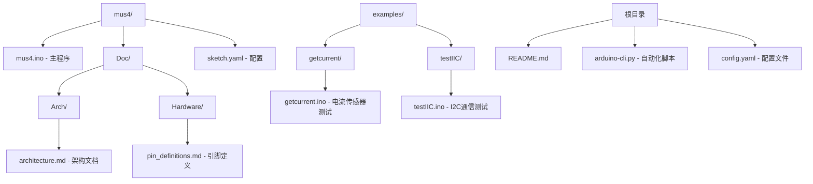
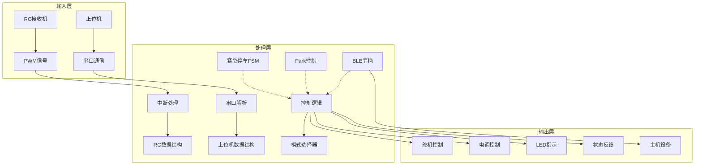
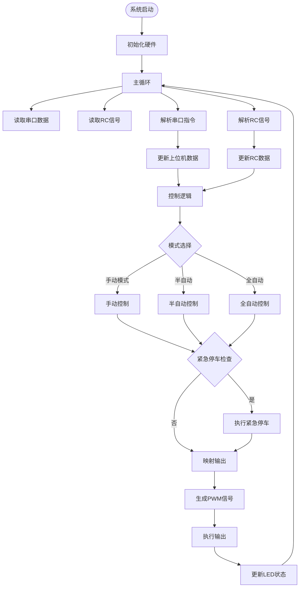
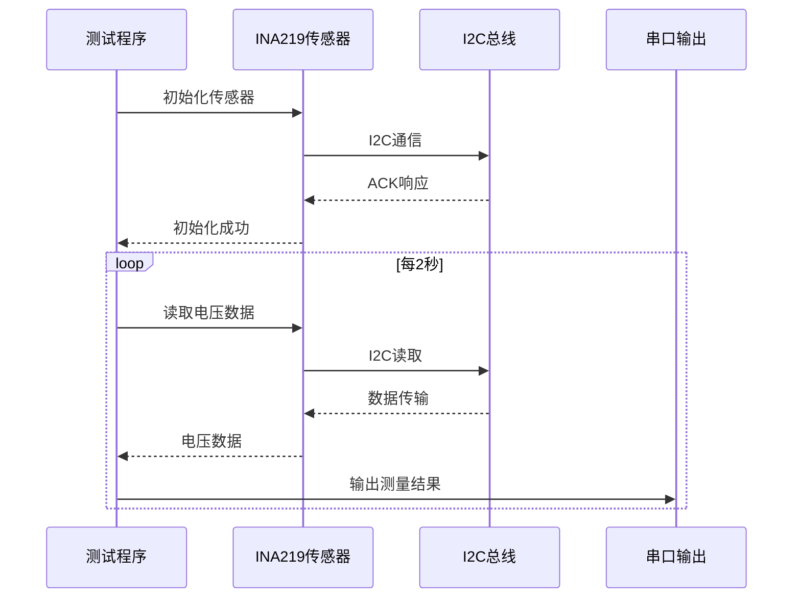
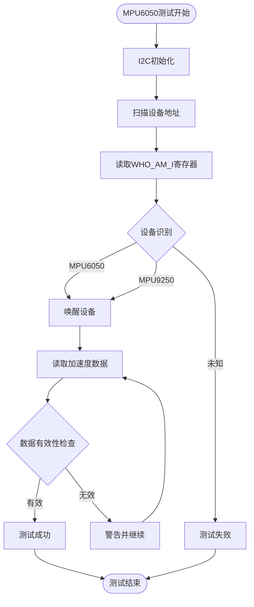
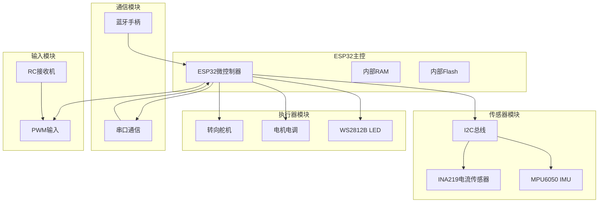
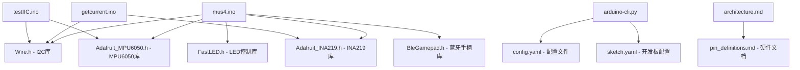
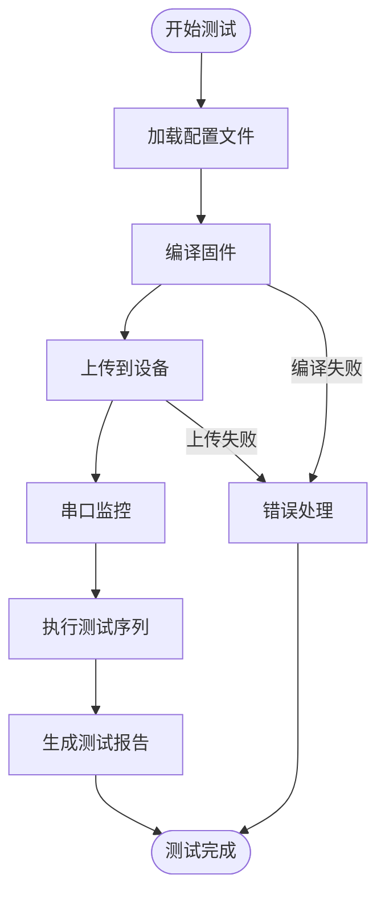

# 集成测试与验证

<cite>
**本文档引用的文件**
- [README.md](file://README.md)
- [mus4.ino](file://mus4/mus4.ino)
- [getcurrent.ino](file://examples/getcurrent/getcurrent.ino)
- [testIIC.ino](file://examples/testIIC/testIIC.ino)
- [architecture.md](file://mus4/Doc/Arch/architecture.md)
- [pin_definitions.md](file://mus4/Doc/Hardware/pin_definitions.md)
- [sketch.yaml](file://mus4/sketch.yaml)
- [arduino-cli.py](file://arduino-cli.py)
- [config.yaml](file://config.yaml)
</cite>

## 目录
1. [简介](#简介)
2. [项目结构](#项目结构)
3. [核心组件](#核心组件)
4. [架构概览](#架构概览)
5. [详细组件分析](#详细组件分析)
6. [依赖关系分析](#依赖关系分析)
7. [性能考虑](#性能考虑)
8. [故障排除指南](#故障排除指南)
9. [结论](#结论)
10. [附录](#附录)

## 简介

MUS4项目是一个基于ESP32的自动驾驶小车控制系统，支持多种控制模式和安全机制。本文档提供了全面的集成测试与验证指南，涵盖了功能测试、性能测试、可靠性测试以及自动化测试脚本的编写方法。

该项目的主要特点包括：
- 多通道PWM信号采集（RC接收机）
- 上位机串口通信协议
- 传感器数据读取（INA219电流传感器、MPU6050惯性测量单元）
- LED状态指示系统
- 紧急停车机制
- 蓝牙手柄模式支持

## 项目结构

MUS4项目采用模块化组织方式，主要包含以下结构：



**图表来源**
- [mus4.ino](file://mus4/mus4.ino#L1-L50)
- [architecture.md](file://mus4/Doc/Arch/architecture.md#L1-L30)
- [pin_definitions.md](file://mus4/Doc/Hardware/pin_definitions.md#L1-L40)

**章节来源**
- [README.md](file://README.md#L1-L39)
- [mus4.ino](file://mus4/mus4.ino#L1-L100)
- [architecture.md](file://mus4/Doc/Arch/architecture.md#L1-L50)

## 核心组件

### 主程序组件

MUS4主程序包含以下核心组件：

1. **信号采集模块**
   - RC接收机PWM信号处理
   - 上位机串口指令解析
   - 传感器数据读取

2. **控制逻辑模块**
   - 驾驶模式切换（手动/半自动/自动）
   - 紧急停车状态机
   - 停车/解锁控制逻辑

3. **执行输出模块**
   - 舵机PWM输出控制
   - 电调PWM输出控制
   - LED状态指示

4. **通信协议模块**
   - 串口通信协议
   - I2C设备通信
   - 蓝牙手柄协议

**章节来源**
- [mus4.ino](file://mus4/mus4.ino#L153-L200)
- [architecture.md](file://mus4/Doc/Arch/architecture.md#L66-L116)

## 架构概览

MUS4系统采用分层架构设计，实现了清晰的职责分离：



**图表来源**
- [architecture.md](file://mus4/Doc/Arch/architecture.md#L18-L45)
- [mus4.ino](file://mus4/mus4.ino#L460-L473)

### 数据流图



**图表来源**
- [architecture.md](file://mus4/Doc/Arch/architecture.md#L70-L107)
- [mus4.ino](file://mus4/mus4.ino#L68-L107)

## 详细组件分析

### 传感器模块测试

#### INA219电流传感器测试

INA219传感器用于监测系统的电流消耗和功率使用情况：



**图表来源**
- [getcurrent.ino](file://examples/getcurrent/getcurrent.ino#L17-L30)
- [getcurrent.ino](file://examples/getcurrent/getcurrent.ino#L32-L55)

#### MPU6050惯性测量单元测试

MPU6050传感器提供加速度和角速度数据：



**图表来源**
- [testIIC.ino](file://examples/testIIC/testIIC.ino#L317-L343)
- [testIIC.ino](file://examples/testIIC/testIIC.ino#L348-L376)

**章节来源**
- [getcurrent.ino](file://examples/getcurrent/getcurrent.ino#L1-L55)
- [testIIC.ino](file://examples/testIIC/testIIC.ino#L1-L200)

### 通信协议测试

#### 串口通信协议测试

系统支持两种串口通信模式：

1. **USB串口 (Serial)**：波特率115200
2. **RS232串口 (Serial1)**：波特率115200

通信协议格式：
```
格式: Throttle:Steering\n
示例: 10:-20\n
校验: 支持简单的校验和验证
```

#### I2C通信测试

I2C总线支持多种速度模式：
- 标准模式：100kHz
- 快速模式：400kHz  
- 快速+模式：1MHz

**章节来源**
- [mus4.ino](file://mus4/mus4.ino#L320-L342)
- [testIIC.ino](file://examples/testIIC/testIIC.ino#L21-L28)

### 安全机制测试

#### 紧急停车状态机测试

```mermaid
stateDiagram-v2
[*] --> EST_IDLE
EST_IDLE --> EST_READY : 触发停车且有油门
EST_IDLE --> EST_DONE : 触发停车且无油门
state EST_READY {
[*] --> WaitReady
WaitReady --> SetBrake : 500ms延迟
note right of WaitReady : 设置小油门15
}
EST_READY --> EST_BRAKING : 准备完成
EST_BRAKING --> EST_DONE : 1500ms延迟
EST_DONE --> EST_IDLE : 解除停车
state EST_BRAKING {
[*] --> Braking
Braking --> BrakeDone : 设置最大刹车-100
note right of Braking : 全力刹车状态
}
state EST_DONE {
note right of EST_DONE : 停车完成，油门归零
}
```

**图表来源**
- [architecture.md](file://mus4/Doc/Arch/architecture.md#L123-L151)
- [mus4.ino](file://mus4/mus4.ino#L474-L525)

**章节来源**
- [mus4.ino](file://mus4/mus4.ino#L474-L525)
- [architecture.md](file://mus4/Doc/Arch/architecture.md#L117-L161)

### 系统稳定性评估

#### 性能基准测试

系统包含内置的性能测试功能：

1. **UI渲染性能测试**
   - 测试主界面渲染循环次数
   - 评估UI更新频率（约60Hz）

2. **压力测试**
   - 连续处理错误指令
   - 评估系统错误处理能力

3. **回归测试**
   - 验证关键算法的正确性
   - 确保功能回归不出现偏差

**章节来源**
- [mus4.ino](file://mus4/mus4.ino#L167-L200)

## 依赖关系分析

### 硬件依赖关系



**图表来源**
- [pin_definitions.md](file://mus4/Doc/Hardware/pin_definitions.md#L13-L28)
- [architecture.md](file://mus4/Doc/Arch/architecture.md#L18-L45)

### 软件依赖关系



**图表来源**
- [mus4.ino](file://mus4/mus4.ino#L24-L34)
- [arduino-cli.py](file://arduino-cli.py#L92-L113)

**章节来源**
- [mus4.ino](file://mus4/mus4.ino#L24-L34)
- [arduino-cli.py](file://arduino-cli.py#L92-L113)

## 性能考虑

### 实时性能要求

系统需要满足以下实时性能要求：

1. **传感器采样频率**
   - 传感器数据更新间隔：1000ms（1Hz）
   - RC数据更新间隔：16ms（~60Hz）
   - UI更新间隔：16ms（~60Hz）

2. **处理能力要求**
   - 中断处理：无阻塞的PWM脉宽测量
   - 数据处理：快速的串口解析和验证
   - 输出控制：精确的PWM信号生成

3. **内存使用优化**
   - 使用volatile关键字确保中断安全
   - 合理的数据结构设计
   - 避免动态内存分配

### 性能测试策略

1. **基准测试**
   - 测量UI渲染性能
   - 评估系统响应时间
   - 监控内存使用情况

2. **压力测试**
   - 高负载下的系统稳定性
   - 通信协议的鲁棒性
   - 传感器数据的准确性

3. **长期稳定性测试**
   - 连续运行测试（72小时+）
   - 温度变化下的性能表现
   - 电源波动的影响

## 故障排除指南

### 常见问题诊断

#### 传感器通信问题

**症状**：传感器数据显示异常或无数据
**诊断步骤**：
1. 检查I2C地址配置
2. 验证引脚连接正确性
3. 测试I2C总线完整性
4. 检查上拉电阻配置

#### 串口通信问题

**症状**：串口数据传输错误或丢失
**诊断步骤**：
1. 验证波特率设置一致性
2. 检查线序连接正确性
3. 测试串口缓冲区状态
4. 监控错误计数统计

#### PWM输出问题

**症状**：执行器响应异常或无响应
**诊断步骤**：
1. 检查PWM频率和占空比
2. 验证输出引脚配置
3. 测试负载连接状态
4. 校准控制参数

**章节来源**
- [testIIC.ino](file://examples/testIIC/testIIC.ino#L526-L553)
- [mus4.ino](file://mus4/mus4.ino#L344-L411)

### 自动化测试脚本

#### Arduino CLI自动化脚本

项目提供了完整的自动化测试脚本：



**图表来源**
- [arduino-cli.py](file://arduino-cli.py#L197-L221)
- [arduino-cli.py](file://arduino-cli.py#L247-L271)

**章节来源**
- [arduino-cli.py](file://arduino-cli.py#L1-L315)
- [config.yaml](file://config.yaml#L1-L13)

## 结论

MUS4项目提供了完整的自动驾驶小车控制系统，具有良好的模块化设计和丰富的测试功能。通过本文档的集成测试与验证指南，开发者可以：

1. **全面的功能测试**：覆盖传感器、通信协议、安全机制等各个方面
2. **性能基准评估**：建立系统性能基线和优化目标
3. **可靠性验证**：确保系统在各种条件下的稳定运行
4. **自动化测试**：提高测试效率和一致性

建议在实际部署前进行充分的集成测试，确保系统满足预期的性能和可靠性要求。

## 附录

### 测试环境搭建

#### 硬件要求
- ESP32开发板（DFRobot FireBeetle 2 ESP32E）
- RC接收机（用于PWM信号输入）
- INA219电流传感器
- MPU6050惯性测量单元
- 舵机和电调
- WS2812B LED指示灯
- 串口转USB适配器

#### 软件要求
- Arduino IDE或VS Code + PlatformIO
- Arduino CLI工具
- Python 3.6+
- 相关Arduino库（Wire、FastLED、Adafruit_MPU6050、Adafruit_INA219、BleGamepad）

#### 配置步骤
1. 安装Arduino核心板包
2. 安装所需的Arduino库
3. 配置串口参数
4. 设置开发板类型
5. 验证硬件连接

### 测试用例设计

#### 功能测试用例
- 传感器数据读取测试
- 串口通信协议测试
- PWM输出控制测试
- LED状态指示测试
- 紧急停车机制测试

#### 性能测试用例
- 响应时间测试
- 并发处理能力测试
- 内存使用测试
- 通信吞吐量测试

#### 可靠性测试用例
- 长时间连续运行测试
- 异常情况处理测试
- 电源波动测试
- 温度变化测试

### 自动化测试最佳实践

1. **测试数据管理**：建立标准化的测试数据集
2. **结果记录**：完整记录测试过程和结果
3. **错误处理**：实现健壮的错误检测和恢复机制
4. **报告生成**：自动生成测试报告和统计分析
5. **持续集成**：将测试集成到CI/CD流程中