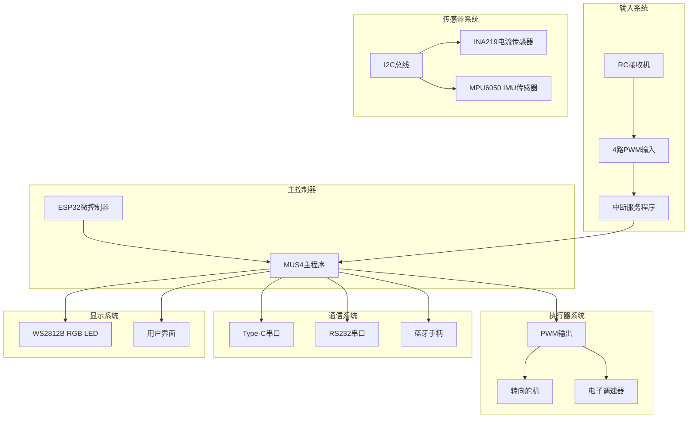
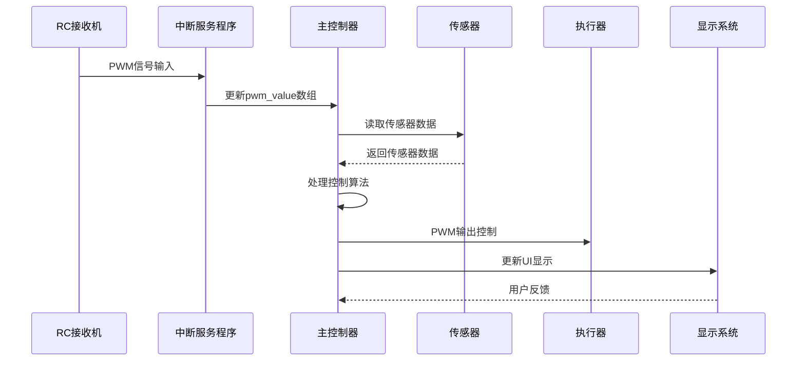
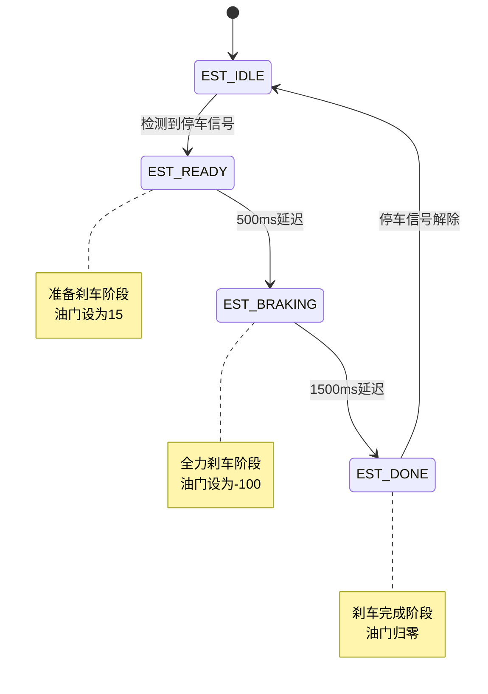
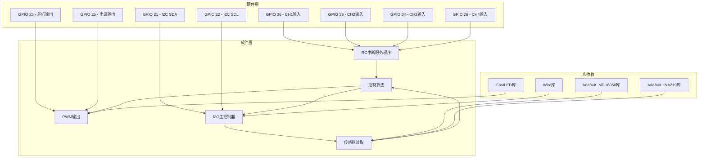
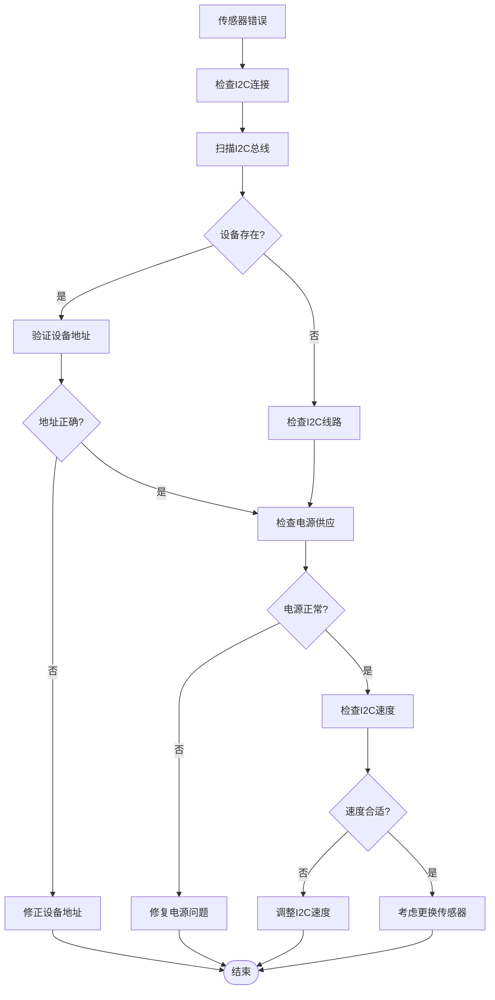
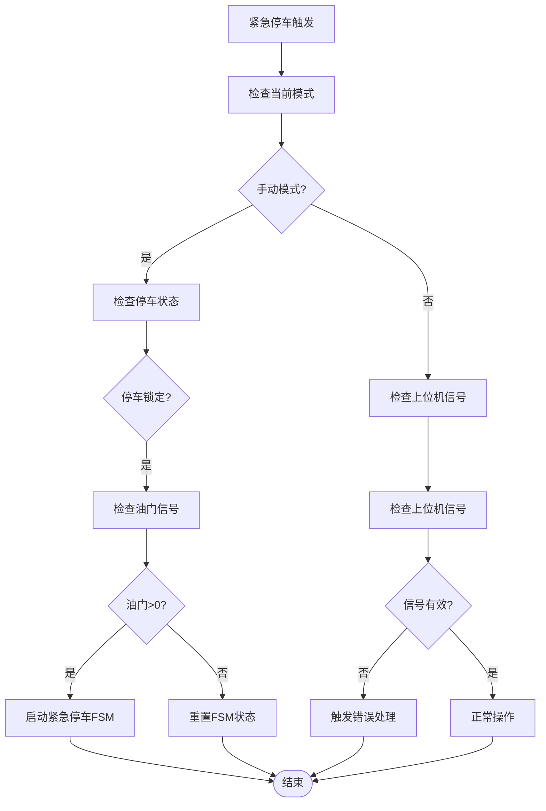

# 故障排除与调试

<cite>
**本文档引用的文件**
- [mus4.ino](file://mus4/mus4.ino)
- [DevNote.md](file://mus4/Doc/README/DevNote.md)
- [pin_definitions.md](file://mus4/Doc/Hardware/pin_definitions.md)
- [getcurrent.ino](file://examples/getcurrent/getcurrent.ino)
- [testIIC.ino](file://examples/testIIC/testIIC.ino)
- [config.yaml](file://config.yaml)
</cite>

## 目录
1. [简介](#简介)
2. [项目结构](#项目结构)
3. [核心组件](#核心组件)
4. [架构概览](#架构概览)
5. [详细组件分析](#详细组件分析)
6. [依赖关系分析](#依赖关系分析)
7. [性能考虑](#性能考虑)
8. [故障排除指南](#故障排除指南)
9. [结论](#结论)

## 简介

MUS4是一个基于ESP32的自动驾驶小车控制系统，集成了RC遥控接收机信号处理、传感器数据采集、执行器控制和状态指示等功能。本指南提供了针对RC信号异常、传感器读数错误、通信故障、安全系统误触发等常见问题的诊断和修复方法，以及串口日志分析技巧、硬件故障定位方法和性能调试工具使用指南。

## 项目结构

MUS4项目采用模块化设计，主要包含以下组件：



**图表来源**
- [mus4.ino](file://mus4/mus4.ino#L1104-L1150)
- [pin_definitions.md](file://mus4/Doc/Hardware/pin_definitions.md#L115-L181)

**章节来源**
- [mus4.ino](file://mus4/mus4.ino#L1-L1290)
- [pin_definitions.md](file://mus4/Doc/Hardware/pin_definitions.md#L1-L225)

## 核心组件

### RC接收机信号处理系统

MUS4系统通过4个专用引脚处理RC接收机的PWM信号，每个通道都配置了中断服务程序来精确测量脉冲宽度：

- **CH1 (GPIO 36)**: 转向信号输入
- **CH2 (GPIO 39)**: 油门信号输入  
- **CH3 (GPIO 34)**: 停车/解锁控制输入
- **CH4 (GPIO 26)**: 驾驶模式切换输入

每个通道使用中断检测上升沿和下降沿时间，通过微秒级定时计算脉冲宽度，从而解析遥控器的控制信号。

**章节来源**
- [mus4.ino](file://mus4/mus4.ino#L414-L431)
- [mus4.ino](file://mus4/mus4.ino#L1126-L1131)
- [pin_definitions.md](file://mus4/Doc/Hardware/pin_definitions.md#L34-L46)

### 传感器数据采集系统

系统集成了两个关键传感器，通过I2C总线进行数据采集：

- **INA219电流传感器**: 监测电源系统的电压、电流和功率
- **MPU6050 IMU传感器**: 提供加速度、角速度和温度数据

传感器数据以1Hz的频率更新，确保足够的精度同时避免过度占用系统资源。

**章节来源**
- [mus4.ino](file://mus4/mus4.ino#L841-L866)
- [mus4.ino](file://mus4/mus4.ino#L898-L920)
- [mus4.ino](file://mus4/mus4.ino#L1119-L1123)

### 执行器控制系统

系统通过PWM信号控制执行器：

- **转向舵机 (GPIO 23)**: 50Hz PWM信号，脉冲范围±440
- **电机电调 (GPIO 25)**: 50Hz PWM信号，脉冲范围±390

执行器输出采用14位分辨率，提供精确的控制精度。

**章节来源**
- [mus4.ino](file://mus4/mus4.ino#L1269-L1276)
- [mus4.ino](file://mus4/mus4.ino#L1133-L1134)
- [pin_definitions.md](file://mus4/Doc/Hardware/pin_definitions.md#L47-L61)

## 架构概览



**图表来源**
- [mus4.ino](file://mus4/mus4.ino#L1152-L1289)

## 详细组件分析

### 串口通信协议

系统支持两种串口通信方式：

1. **Type-C串口 (波特率 115200)**: 用于调试和开发
2. **RS232串口 (波特率 115200)**: 与上位机通信

通信协议格式为 `T:S\n`，其中T表示油门值，S表示转向值。

**章节来源**
- [mus4.ino](file://mus4/mus4.ino#L1110-L1113)
- [DevNote.md](file://mus4/Doc/README/DevNote.md#L24-L29)

### 紧急停车状态机

系统实现了四阶段的紧急停车状态机：



**图表来源**
- [mus4.ino](file://mus4/mus4.ino#L474-L525)

**章节来源**
- [mus4.ino](file://mus4/mus4.ino#L221-L232)
- [DevNote.md](file://mus4/Doc/README/DevNote.md#L67-L72)

### 蓝牙手柄模式

通过ENABLE_GAMEPAD_MODE宏启用蓝牙手柄功能，将RC信号转换为蓝牙手柄输入：

- **CH1 (转向)** → Right Thumb X轴
- **CH2 (油门)** → Left Thumb Y轴

**章节来源**
- [mus4.ino](file://mus4/mus4.ino#L1087-L1102)
- [DevNote.md](file://mus4/Doc/README/DevNote.md#L74-L81)

## 依赖关系分析



**图表来源**
- [mus4.ino](file://mus4/mus4.ino#L24-L28)
- [mus4.ino](file://mus4/mus4.ino#L1119-L1134)

**章节来源**
- [mus4.ino](file://mus4/mus4.ino#L24-L28)
- [mus4.ino](file://mus4/mus4.ino#L1119-L1134)

## 性能考虑

### 资源管理策略

系统采用了多层次的性能优化策略：

1. **任务优先级调度**: 传感器数据1Hz更新，RC数据60Hz更新，UI每16ms更新
2. **内存管理**: 使用volatile关键字确保中断服务程序中的变量一致性
3. **功耗优化**: 传感器和执行器在空闲时保持低功耗状态

### 性能监控机制

系统内置了性能评估机制，包括：

- **UI循环时间监控**: 超过150ms自动降低UI刷新频率
- **降级模式检测**: 传感器失效时自动降级到基本功能
- **实时性能评估**: 每秒评估一次系统性能

**章节来源**
- [mus4.ino](file://mus4/mus4.ino#L109-L131)
- [mus4.ino](file://mus4/mus4.ino#L290-L305)
- [mus4.ino](file://mus4/mus4.ino#L1282-L1288)

## 故障排除指南

### RC信号异常诊断

#### 问题症状
- RC信号不稳定或完全无响应
- 转向或油门控制异常
- 按钮功能不灵敏

#### 诊断步骤

1. **硬件检查**
   ```mermaid
flowchart TD
Start([开始诊断]) --> CheckPower["检查RC接收机供电"]
CheckPower --> CheckWiring["检查接线连接"]
CheckWiring --> CheckPin["确认引脚定义正确"]
CheckPin --> CheckSignal["使用示波器检查PWM信号"]
CheckSignal --> SignalOK{"信号正常?"}
SignalOK --> |否| FixSignal["修复信号线路"]
SignalOK --> |是| CheckCalibration["检查校准参数"]
CheckCalibration --> Calibrate["重新校准RC参数"]
FixSignal --> End([结束])
Calibrate --> End
```

2. **软件检查**
   - 验证中断服务程序是否正确配置
   - 检查pwm_value数组是否被正确更新
   - 确认RC校准参数设置合理

**章节来源**
- [mus4.ino](file://mus4/mus4.ino#L414-L431)
- [mus4.ino](file://mus4/mus4.ino#L449-L456)
- [pin_definitions.md](file://mus4/Doc/Hardware/pin_definitions.md#L34-L46)

#### 常见解决方案

1. **RC信号丢失**
   - 检查接收机天线连接
   - 验证遥控器电池电量
   - 确认RC接收机与飞控的配对状态

2. **信号抖动**
   - 检查电源滤波电路
   - 验证引脚上拉/下拉电阻配置
   - 调整中断触发阈值

### 传感器读数错误诊断

#### 问题症状
- 传感器数据显示异常或完全无数据
- 传感器间歇性失效
- 读数波动较大

#### 诊断流程



**图表来源**
- [mus4.ino](file://mus4/mus4.ino#L922-L975)
- [mus4.ino](file://mus4/mus4.ino#L868-L896)

#### 传感器特定诊断

1. **INA219电流传感器故障**
   - 使用示例程序验证基本功能
   - 检查负载连接是否正确
   - 验证校准参数设置

2. **MPU6050 IMU传感器故障**
   - 使用I2C扫描工具检测设备
   - 验证I2C地址配置（0x68或0x69）
   - 检查滤波器设置和采样率

**章节来源**
- [getcurrent.ino](file://examples/getcurrent/getcurrent.ino#L1-L55)
- [testIIC.ino](file://examples/testIIC/testIIC.ino#L125-L224)
- [mus4.ino](file://mus4/mus4.ino#L977-L1082)

### 通信故障诊断

#### 串口通信问题

1. **Type-C串口通信**
   - 检查USB转串口驱动安装
   - 验证波特率设置（115200）
   - 确认串口线连接正确

2. **RS232串口通信**
   - 检查RS232转换器工作状态
   - 验证上位机软件配置
   - 确认数据包格式正确

#### 蓝牙通信问题

1. **蓝牙手柄连接失败**
   - 检查BLE设备兼容性
   - 验证设备名称和配对码
   - 确认手柄电量充足

2. **数据传输异常**
   - 检查蓝牙距离和障碍物
   - 验证手柄映射配置
   - 确认数据包完整性

**章节来源**
- [mus4.ino](file://mus4/mus4.ino#L1110-L1113)
- [mus4.ino](file://mus4/mus4.ino#L1087-L1102)
- [config.yaml](file://config.yaml#L1-L13)

### 安全系统误触发诊断

#### 紧急停车误触发



**图表来源**
- [mus4.ino](file://mus4/mus4.ino#L474-L525)

#### 误触发预防措施

1. **信号过滤**
   - 实施信号去抖动算法
   - 设置合理的阈值范围
   - 添加信号有效性检查

2. **状态机保护**
   - 实施状态转换验证
   - 添加超时保护机制
   - 确保状态机的幂等性

**章节来源**
- [mus4.ino](file://mus4/mus4.ino#L474-L525)
- [mus4.ino](file://mus4/mus4.ino#L221-L232)

### 串口日志分析技巧

#### 日志级别和格式

系统提供了丰富的调试信息输出：

1. **传感器状态日志**
   ```
   [INA219] Bus:12.34V Current:150.5mA Power:185.2mW
   [MPU6050] Accel:X=0.12 Y=-0.05 Z=9.81 Gyro:X=0.01 Y=0.02 Z=-0.03 T:25.6C
   ```

2. **系统状态日志**
   ```
   [I2C SCAN] Found device at 0x40 - INA219
   [MPU6050] Sensor initialized successfully!
   ```

3. **错误诊断日志**
   ```
   [INA219 ERROR] Failed to find INA219 chip
   [MPU6050 ERROR] Sensor not detected, waiting...
   ```

#### 日志分析方法

1. **传感器数据异常分析**
   - 检查数据范围是否在合理区间
   - 观察数据变化趋势
   - 对比不同传感器间的相关性

2. **系统性能分析**
   - 监控UI循环时间
   - 检查降级模式触发原因
   - 分析系统资源使用情况

**章节来源**
- [mus4.ino](file://mus4/mus4.ino#L841-L866)
- [mus4.ino](file://mus4/mus4.ino#L898-L920)
- [mus4.ino](file://mus4/mus4.ino#L868-L896)

### 硬件故障定位方法

#### I2C总线故障定位

1. **设备检测**
   - 使用scanI2CBus函数扫描总线
   - 验证设备地址配置
   - 检查设备响应时间

2. **信号质量测试**
   - 使用示波器检查SDA/SCL信号
   - 验证上拉电阻值
   - 检查总线电平和时序

#### 电源系统故障定位

1. **电压监测**
   - 使用万用表测量关键节点电压
   - 检查电源纹波和噪声
   - 验证负载电流需求

2. **功耗分析**
   - 测量静态电流消耗
   - 检查峰值电流需求
   - 验证电源效率

**章节来源**
- [mus4.ino](file://mus4/mus4.ino#L922-L975)
- [testIIC.ino](file://examples/testIIC/testIIC.ino#L125-L224)

### 性能调试工具使用

#### 内置测试功能

系统提供了多种内置测试工具：

1. **单元测试**
   - 验证命令解析功能
   - 检查校验和计算
   - 测试边界条件

2. **基准测试**
   - 评估UI渲染性能
   - 测量系统响应时间
   - 分析处理能力

3. **压力测试**
   - 验证系统稳定性
   - 检查内存泄漏
   - 测试长时间运行能力

#### 外部调试工具

1. **Arduino CLI配置**
   ```yaml
   default:
     arduino_cli: "arduino-cli"
     fqbn: "esp32:esp32:esp32"
     port: "COM9"
     baudrate: 115200
     sketch_path: "mus4/mus4.ino"
     build_path: "build"
   ```

2. **性能监控**
   - 使用串口监视器观察实时数据
   - 分析系统资源使用情况
   - 监控关键指标变化趋势

**章节来源**
- [mus4.ino](file://mus4/mus4.ino#L153-L200)
- [config.yaml](file://config.yaml#L1-L13)

## 结论

MUS4项目的故障排除和调试指南涵盖了从硬件到软件的全方位诊断方法。通过理解系统的架构设计、掌握各种诊断工具和技术，可以有效地识别和解决常见的RC信号异常、传感器读数错误、通信故障和安全系统误触发等问题。

关键要点包括：
- 建立系统化的诊断流程和检查清单
- 充分利用内置的调试功能和日志输出
- 掌握硬件故障定位的基本方法
- 建立性能监控和优化的长效机制

建议在日常维护中定期执行这些检查，建立完善的故障预防和快速响应机制，确保系统的稳定可靠运行。