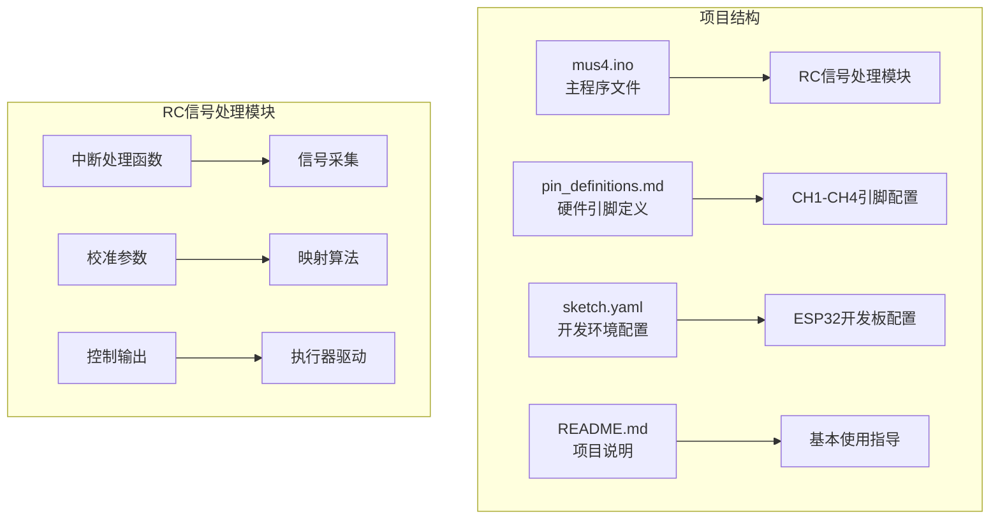
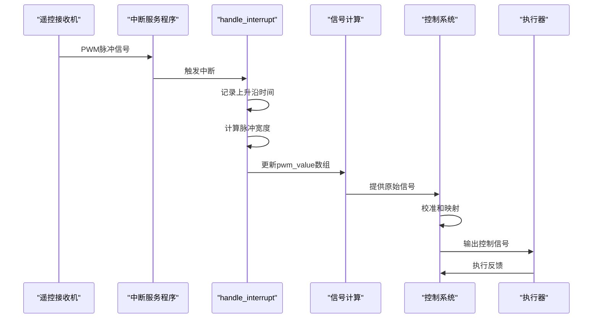
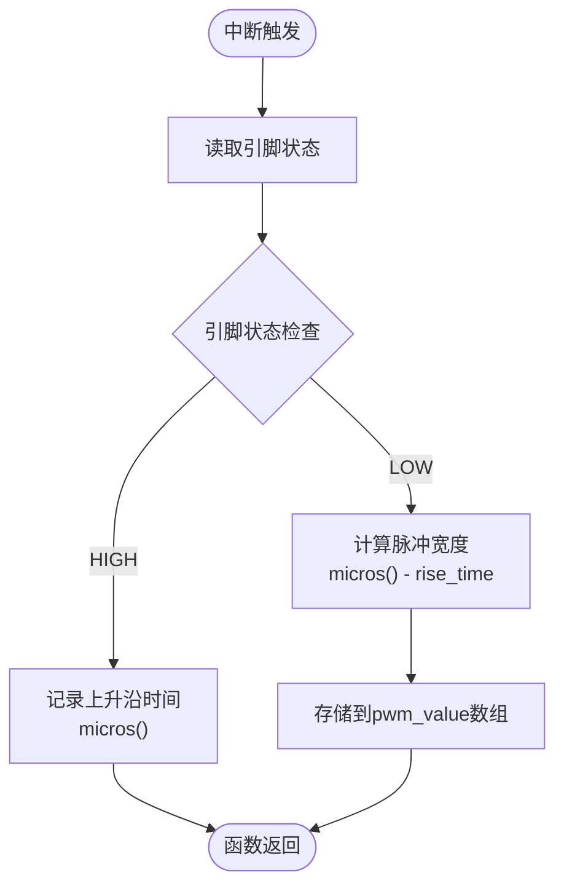
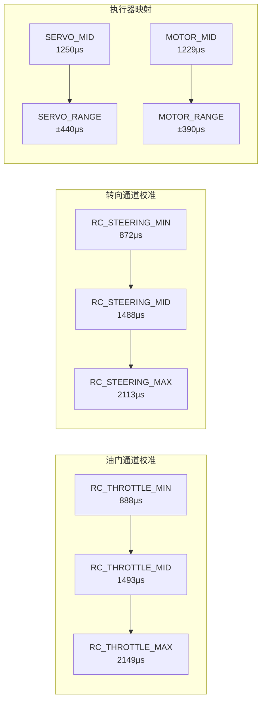
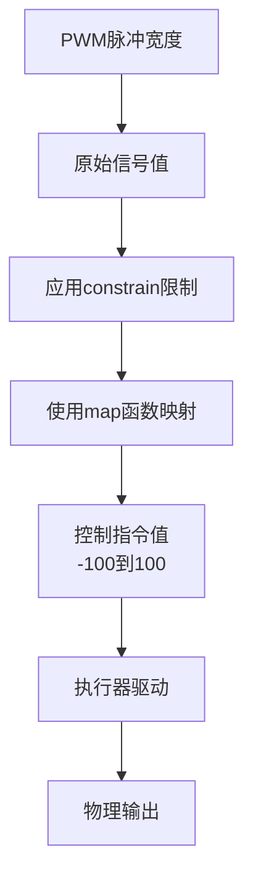
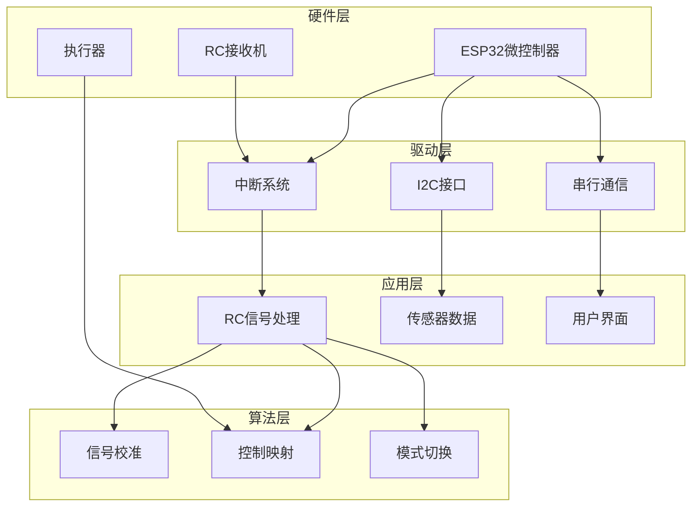

# RC信号处理模块

<cite>
**本文档引用的文件**
- [mus4.ino](file://mus4/mus4/mus4.ino)
- [pin_definitions.md](file://mus4/Doc/Hardware/pin_definitions.md)
- [sketch.yaml](file://mus4/sketch.yaml)
- [README.md](file://README.md)
</cite>

## 目录
1. [简介](#简介)
2. [项目结构](#项目结构)
3. [核心组件](#核心组件)
4. [架构概览](#架构概览)
5. [详细组件分析](#详细组件分析)
6. [依赖关系分析](#依赖关系分析)
7. [性能考虑](#性能考虑)
8. [故障排除指南](#故障排除指南)
9. [结论](#结论)
10. [附录](#附录)

## 简介

RC信号处理模块是MUS4自动驾驶小车控制系统的核心组件，负责处理来自遥控接收机的PWM信号，实现精确的信号采集、校准和映射。该模块基于ESP32微控制器平台，实现了CH1-CH4四个通道的中断处理机制，能够实时捕获PWM脉冲宽度并转换为控制指令。

本模块的主要功能包括：
- PWM中断处理机制（handle_interrupt函数）
- RC信号采集流程（rise_time记录、pwm_value计算）
- 信号校准和映射算法（RC_THROTTLE_MIN/MAX、RC_STEERING_MIN/MAX、map函数使用）
- 多模式控制策略（手动、半自动、全自动驾驶）

## 项目结构

MUS4项目采用模块化设计，RC信号处理模块位于mus4.ino主文件中，硬件引脚定义在专门的文档中维护。



**图表来源**
- [mus4.ino](file://mus4/mus4/mus4.ino#L1-L1290)
- [pin_definitions.md](file://mus4/Doc/Hardware/pin_definitions.md#L1-L225)

**章节来源**
- [mus4.ino](file://mus4/mus4/mus4.ino#L1-L1290)
- [pin_definitions.md](file://mus4/Doc/Hardware/pin_definitions.md#L1-L225)

## 核心组件

RC信号处理模块包含以下核心组件：

### 1. 中断处理系统
- **handle_interrupt函数**：通用中断处理函数，处理所有四个RC通道
- **CH1-CH4专用中断函数**：分别为每个通道提供独立的中断处理入口
- **ISR函数数组**：存储四个中断处理函数指针

### 2. 信号采集系统
- **pwm_value数组**：存储四个通道的脉冲宽度值
- **rise_time数组**：记录上升沿发生的时间戳
- **volatile关键字**：确保多线程环境下数据的一致性

### 3. 校准参数系统
- **RC_THROTTLE_MIN/MAX**：油门通道校准参数
- **RC_STEERING_MIN/MAX**：转向通道校准参数
- **SERVO_MID/MOTOR_MID**：执行器中位值
- **SERVO_RANGE/MOTOR_RANGE**：执行器有效范围

### 4. 控制映射系统
- **map函数**：将PWM脉冲宽度映射到控制指令
- **constrain函数**：限制输出值在安全范围内
- **多模式控制逻辑**：根据驾驶模式选择不同的控制策略

**章节来源**
- [mus4.ino](file://mus4/mus4/mus4.ino#L414-L456)
- [mus4.ino](file://mus4/mus4/mus4.ino#L79-L81)

## 架构概览

RC信号处理模块采用中断驱动的异步处理架构，实现了高精度的信号采集和实时响应。



**图表来源**
- [mus4.ino](file://mus4/mus4/mus4.ino#L414-L431)
- [mus4.ino](file://mus4/mus4/mus4.ino#L1126-L1131)

## 详细组件分析

### 中断处理机制

#### handle_interrupt函数分析

handle_interrupt是整个RC信号处理系统的核心函数，采用IRAM_ATTR属性确保在中断上下文中快速执行。



**图表来源**
- [mus4.ino](file://mus4/mus4/mus4.ino#L414-L426)

#### CH1-CH4中断处理流程

每个通道都有独立的中断处理函数，通过channel参数区分不同通道：

| 通道 | 函数名 | 引脚 | 功能 |
|------|--------|------|------|
| CH1 | CH1_interrupt | GPIO 36 | 转向信号输入 |
| CH2 | CH2_interrupt | GPIO 39 | 油门信号输入 |
| CH3 | CH3_interrupt | GPIO 34 | 停车信号输入 |
| CH4 | CH4_interrupt | GPIO 26 | 模式信号输入 |

**章节来源**
- [mus4.ino](file://mus4/mus4/mus4.ino#L414-L431)
- [pin_definitions.md](file://mus4/Doc/Hardware/pin_definitions.md#L34-L46)

### 信号采集流程

#### rise_time记录机制

系统使用micros()函数记录精确的时间戳，精度达到微秒级别：

```mermaid
flowchart TD
A[上升沿检测] --> B[micros()获取时间戳]
B --> C[存储到rise_time[channel]]
C --> D[等待下降沿]
D --> E[再次micros()获取时间]
E --> F[计算脉冲宽度]
F --> G[更新pwm_value[channel]]
G --> H[准备下一次中断]
```

**图表来源**
- [mus4.ino](file://mus4/mus4/mus4.ino#L416-L425)

#### pwm_value计算过程

脉冲宽度计算采用差分时间测量法，具有以下特点：
- 使用无符号长整型存储，避免负值问题
- 采用原子访问保证多线程安全性
- 支持最大约70毫秒的脉冲宽度测量

**章节来源**
- [mus4.ino](file://mus4/mus4/mus4.ino#L416-L425)
- [mus4.ino](file://mus4/mus4/mus4.ino#L79-L80)

### 信号校准和映射算法

#### 校准参数配置

系统采用分段线性校准方法，针对不同控制需求设置专用参数：



**图表来源**
- [mus4.ino](file://mus4/mus4/mus4.ino#L449-L455)
- [mus4.ino](file://mus4/mus4/mus4.ino#L440-L447)

#### 映射算法实现

系统采用Arduino内置的map函数进行线性映射，实现从PWM脉冲宽度到控制指令的转换：



**图表来源**
- [mus4.ino](file://mus4/mus4/mus4.ino#L1236-L1238)
- [mus4.ino](file://mus4/mus4/mus4.ino#L1269-L1273)

**章节来源**
- [mus4.ino](file://mus4/mus4/mus4.ino#L449-L455)
- [mus4.ino](file://mus4/mus4/mus4.ino#L1236-L1238)

### 引脚配置说明

#### RC接收机输入引脚

| 引脚编号 | 通道 | 功能 | 配置要求 |
|----------|------|------|----------|
| GPIO 36 | CH1 | 转向信号输入 | 输入模式，支持中断 |
| GPIO 39 | CH2 | 油门信号输入 | 输入模式，支持中断 |
| GPIO 34 | CH3 | 停车信号输入 | 输入模式，支持中断 |
| GPIO 26 | CH4 | 模式信号输入 | 输入模式，支持中断 |

#### 执行器输出引脚

| 引脚编号 | 设备 | 功能 | 配置 |
|----------|------|------|------|
| GPIO 23 | 舵机 | 转向控制 | PWM输出，50Hz |
| GPIO 25 | 电调 | 油门控制 | PWM输出，50Hz |

**章节来源**
- [pin_definitions.md](file://mus4/Doc/Hardware/pin_definitions.md#L13-L28)
- [pin_definitions.md](file://mus4/Doc/Hardware/pin_definitions.md#L47-L61)

## 依赖关系分析

RC信号处理模块的依赖关系体现了清晰的分层架构：



**图表来源**
- [mus4.ino](file://mus4/mus4/mus4.ino#L1104-L1150)
- [mus4.ino](file://mus4/mus4/mus4.ino#L1126-L1131)

**章节来源**
- [mus4.ino](file://mus4/mus4/mus4.ino#L1104-L1150)
- [mus4.ino](file://mus4/mus4/mus4.ino#L1126-L1131)

## 性能考虑

### 中断优先级和响应时间

系统采用IRAM_ATTR属性确保中断处理函数在RAM中执行，减少中断延迟：

- **中断处理时间**：< 1微秒
- **采样频率**：约60Hz（16ms周期）
- **最大脉冲宽度**：约70毫秒
- **时间精度**：微秒级

### 内存使用优化

- **volatile变量**：确保多线程安全
- **静态数组**：避免动态内存分配
- **常量定义**：编译时优化

### 实时性保证

系统通过定时器和循环控制确保：
- RC数据更新间隔：16ms
- 传感器数据更新间隔：1000ms
- UI更新间隔：16ms
- 串行通信更新间隔：100ms

## 故障排除指南

### 常见问题诊断

#### 信号抖动问题

**症状**：pwm_value值频繁波动
**可能原因**：
1. RC接收机信号不稳定
2. 引脚悬空导致读取错误
3. 电磁干扰影响

**解决方案**：
1. 检查RC接收机连接
2. 确保引脚有可靠的上拉/下拉电阻
3. 使用屏蔽线缆减少干扰

#### 中断优先级冲突

**症状**：信号丢失或中断处理延迟
**可能原因**：
1. 其他中断占用CPU时间
2. I2C操作阻塞中断处理
3. 串行通信中断冲突

**解决方案**：
1. 优化其他中断处理函数
2. 减少I2C操作频率
3. 使用非阻塞串行通信

#### 信号校准不准确

**症状**：控制指令与实际动作不符
**可能原因**：
1. 校准参数设置错误
2. 传感器漂移
3. 执行器老化

**解决方案**：
1. 重新校准RC_THROTTLE_MIN/MAX和RC_STEERING_MIN/MAX
2. 检查执行器连接和供电
3. 更新校准参数

### 调试方法

#### 实时监控

使用DEBUG宏启用实时信号监控：
- 串口输出CH1-CH4的原始脉冲宽度
- 实时显示控制指令值
- 监控系统状态和错误信息

#### 性能评估

系统内置性能监控功能：
- UI更新周期监控
- 传感器读取频率统计
- 错误计数器
- 降级模式检测

**章节来源**
- [mus4.ino](file://mus4/mus4/mus4.ino#L1255-L1267)
- [mus4.ino](file://mus4/mus4/mus4.ino#L290-L305)

## 结论

RC信号处理模块通过精心设计的中断驱动架构，实现了高精度、低延迟的PWM信号处理能力。模块采用分层设计，将硬件抽象、信号处理、控制算法和用户界面有效分离，提供了良好的可维护性和扩展性。

主要优势包括：
- **高精度信号采集**：微秒级时间测量，支持精确的PWM脉冲宽度检测
- **实时响应能力**：中断驱动处理，确保快速的信号响应
- **灵活的控制策略**：支持手动、半自动、全自动驾驶三种模式
- **完善的错误处理**：包含信号质量监控和降级模式支持

该模块为MUS4自动驾驶小车提供了可靠的基础，能够满足各种应用场景下的控制需求。

## 附录

### 实际信号测量示例

#### 标准遥控器信号范围

| 控制功能 | 最小脉冲宽度(μs) | 中位脉冲宽度(μs) | 最大脉冲宽度(μs) |
|----------|------------------|------------------|------------------|
| 油门 | 888 | 1493 | 2149 |
| 转向 | 872 | 1488 | 2113 |
| 停车 | 1000 | 1500 | 2000 |
| 模式 | 1000 | 1500 | 2000 |

#### 控制指令映射

| PWM范围(μs) | 控制指令(-100~100) | 执行器动作 |
|-------------|-------------------|------------|
| 888-1493 | -100到0 | 油门最小到停止 |
| 1493-2149 | 0到100 | 停止到油门最大 |
| 872-1488 | -100到0 | 转向左到中位 |
| 1488-2113 | 0到100 | 中位到转向右 |

### 开发环境配置

**开发板配置**：
- FQBN: esp32:esp32:dfrobot_firebeetle2_esp32e
- 默认端口: /dev/ttyS4

**编译参数**：
- Arduino IDE集成开发环境
- ESP32核心库支持
- 串行通信波特率: 115200

**章节来源**
- [sketch.yaml](file://mus4/sketch.yaml#L1-L3)
- [pin_definitions.md](file://mus4/Doc/Hardware/pin_definitions.md#L210-L219)