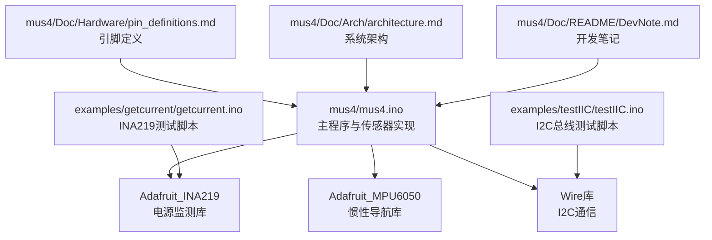
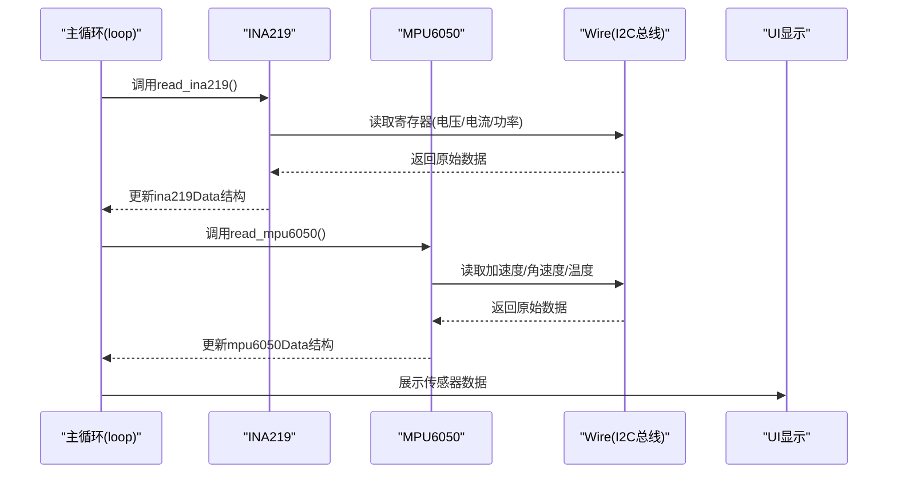
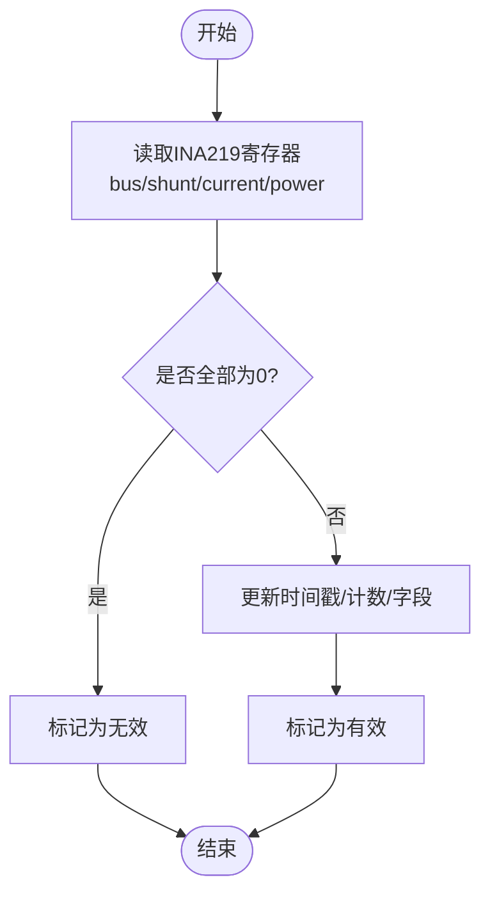
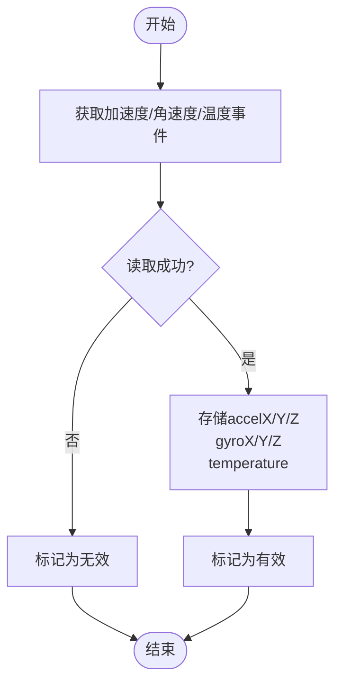
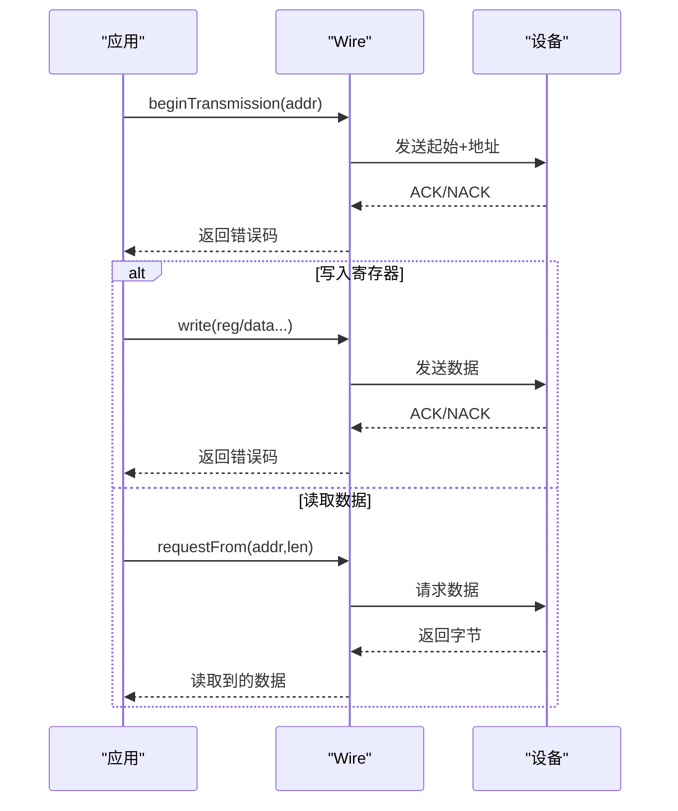
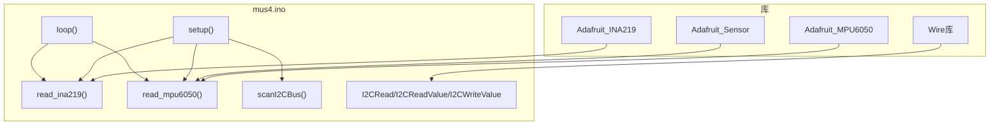

# 传感器系统模块

<cite>
**本文引用的文件列表**
- [mus4.ino](file://mus4/mus4.ino)
- [getcurrent.ino](file://examples/getcurrent/getcurrent.ino)
- [testIIC.ino](file://examples/testIIC/testIIC.ino)
- [pin_definitions.md](file://mus4/Doc/Hardware/pin_definitions.md)
- [architecture.md](file://mus4/Doc/Arch/architecture.md)
- [DevNote.md](file://mus4/Doc/README/DevNote.md)
- [sketch.yaml](file://mus4/sketch.yaml)
- [config.yaml](file://config.yaml)
</cite>

## 目录
1. [简介](#简介)
2. [项目结构](#项目结构)
3. [核心组件](#核心组件)
4. [架构总览](#架构总览)
5. [详细组件分析](#详细组件分析)
6. [依赖关系分析](#依赖关系分析)
7. [性能考量](#性能考量)
8. [故障诊断指南](#故障诊断指南)
9. [结论](#结论)
10. [附录](#附录)

## 简介
本文件面向传感器系统模块，聚焦于以下能力：
- INA219电源监测：busVoltage、shuntVoltage、loadVoltage、current_mA、power_mW的读取与处理
- MPU6050惯性导航：accelX/Y/Z、gyroX/Y/Z、temperature数据获取
- I2C设备管理与扫描：I2CRead/I2CReadValue/I2CWriteValue函数、设备初始化、错误处理
- 传感器校准方法、数据滤波技术、采样频率配置
- 通信协议实现、故障诊断与性能优化策略
- 提供传感器测试脚本与数据验证方法

## 项目结构
仓库采用“顶层示例 + 主程序 + 文档”的组织方式，传感器相关代码集中在主程序与示例工程中，文档提供了硬件引脚、架构与开发笔记等背景信息。

**图表来源**
- [mus4.ino](file://mus4/mus4.ino#L24-L37)
- [getcurrent.ino](file://examples/getcurrent/getcurrent.ino#L1-L55)
- [testIIC.ino](file://examples/testIIC/testIIC.ino#L1-L120)
- [pin_definitions.md](file://mus4/Doc/Hardware/pin_definitions.md#L1-L120)
- [architecture.md](file://mus4/Doc/Arch/architecture.md#L1-L60)
- [DevNote.md](file://mus4/Doc/README/DevNote.md#L1-L122)

**章节来源**
- [mus4.ino](file://mus4/mus4.ino#L1-L120)
- [getcurrent.ino](file://examples/getcurrent/getcurrent.ino#L1-L55)
- [testIIC.ino](file://examples/testIIC/testIIC.ino#L1-L120)
- [pin_definitions.md](file://mus4/Doc/Hardware/pin_definitions.md#L1-L120)
- [architecture.md](file://mus4/Doc/Arch/architecture.md#L1-L60)
- [DevNote.md](file://mus4/Doc/README/DevNote.md#L1-L122)

## 核心组件
- 传感器数据结构：统一存储INA219与MPU6050的测量值、时间戳、读取计数与有效性标记
- I2C读写封装：I2CRead、I2CReadValue、I2CWriteValue，提供错误处理与返回值
- 传感器初始化：setup_ina219、setup_mpu6050，含校准与滤波带宽配置
- 传感器读取：read_ina219、read_mpu6050，含数据有效性判断与存储
- I2C总线扫描：scanI2CBus，识别常见设备地址
- 采样与更新：主循环按固定间隔读取传感器数据并更新UI

**章节来源**
- [mus4.ino](file://mus4/mus4.ino#L207-L220)
- [mus4.ino](file://mus4/mus4.ino#L789-L839)
- [mus4.ino](file://mus4/mus4.ino#L841-L920)
- [mus4.ino](file://mus4/mus4.ino#L922-L975)
- [mus4.ino](file://mus4/mus4.ino#L1104-L1150)
- [mus4.ino](file://mus4/mus4.ino#L1152-L1290)

## 架构总览
传感器系统位于主程序中，通过Wire库与I2C总线交互，分别驱动INA219与MPU6050两个传感器。主循环定时读取传感器数据，更新全局结构体，并在UI中展示。

**图表来源**
- [mus4.ino](file://mus4/mus4.ino#L1152-L1160)
- [mus4.ino](file://mus4/mus4.ino#L841-L866)
- [mus4.ino](file://mus4/mus4.ino#L898-L920)

**章节来源**
- [mus4.ino](file://mus4/mus4.ino#L1152-L1160)
- [mus4.ino](file://mus4/mus4.ino#L841-L920)

## 详细组件分析

### INA219电源监测
- 读取流程：通过库函数获取busVoltage、shuntVoltage、current_mA、power_mW，并计算loadVoltage
- 数据有效性：若三者均为0则标记无效；否则更新时间戳、计数与有效标志
- 初始化与校准：默认使用较大量程（32V, 2A），可通过库函数切换到更高精度的量程
- I2C接口：使用Wire库进行寄存器访问，错误时打印提示

**图表来源**
- [mus4.ino](file://mus4/mus4.ino#L841-L866)

**章节来源**
- [mus4.ino](file://mus4/mus4.ino#L841-L866)
- [mus4.ino](file://mus4/mus4.ino#L868-L896)
- [getcurrent.ino](file://examples/getcurrent/getcurrent.ino#L17-L30)

### MPU6050惯性导航
- 事件读取：通过Adafruit_Sensor接口获取加速度、角速度与温度事件
- 数据存储：将x/y/z分量分别存入结构体字段
- 初始化与配置：设置加速度与陀螺仪量程、滤波带宽（约100Hz采样率）
- 错误处理：初始化失败时重试并打印详细原因

**图表来源**
- [mus4.ino](file://mus4/mus4.ino#L898-L920)
- [mus4.ino](file://mus4/mus4.ino#L977-L1082)

**章节来源**
- [mus4.ino](file://mus4/mus4.ino#L898-L920)
- [mus4.ino](file://mus4/mus4.ino#L977-L1082)

### I2C设备管理与扫描
- I2CRead/I2CReadValue/I2CWriteValue：封装Wire传输，返回布尔值表示成功与否
- scanI2CBus：遍历0x01-0x7F地址，识别常见设备（INA219/MPU6050等）
- 设备初始化：setup_ina219/setup_mpu6050分别负责传感器初始化与错误处理
- 示例测试：examples/testIIC提供I2C总线扫描、读写测试、MPU6050唤醒与数据读取

**图表来源**
- [mus4.ino](file://mus4/mus4.ino#L789-L839)
- [testIIC.ino](file://examples/testIIC/testIIC.ino#L233-L311)

**章节来源**
- [mus4.ino](file://mus4/mus4.ino#L789-L839)
- [mus4.ino](file://mus4/mus4.ino#L922-L975)
- [mus4.ino](file://mus4/mus4.ino#L1119-L1123)
- [testIIC.ino](file://examples/testIIC/testIIC.ino#L125-L224)
- [testIIC.ino](file://examples/testIIC/testIIC.ino#L233-L311)

### 传感器校准方法
- INA219校准：默认使用较大量程（32V, 2A），可切换到更高精度的16V/400mA或32V/1A量程
- MPU6050校准：通过库函数设置加速度与陀螺仪量程；滤波带宽设置为约94Hz，对应约100Hz采样率
- 校准建议：在静态环境下进行，避免震动与强磁场干扰；校准后进行数据验证

**章节来源**
- [mus4.ino](file://mus4/mus4.ino#L889-L896)
- [mus4.ino](file://mus4/mus4.ino#L1015-L1081)

### 数据滤波技术
- MPU6050滤波：通过设置滤波带宽（Band_94_HZ）抑制高频噪声，提高采样稳定性
- 数据有效性：INA219读取时检测全零情况，避免无效数据污染
- 建议：结合移动平均或指数滑动滤波进一步降低噪声

**章节来源**
- [mus4.ino](file://mus4/mus4.ino#L1054-L1081)
- [mus4.ino](file://mus4/mus4.ino#L850-L855)

### 采样频率配置
- 传感器更新间隔：SENSOR_UPDATE_INTERVAL=1000ms（1Hz），满足电源监测需求
- UI更新间隔：UI_UPDATE_INTERVAL=16ms（~60Hz），保证界面流畅
- MPU6050滤波带宽：94Hz，近似100Hz采样率
- 建议：根据应用需求调整更新间隔，平衡实时性与CPU负载

**章节来源**
- [mus4.ino](file://mus4/mus4.ino#L109-L111)
- [mus4.ino](file://mus4/mus4.ino#L1054-L1081)

### 通信协议实现
- I2C协议：使用Wire库进行设备寻址、寄存器写入与数据读取
- 错误处理：endTransmission返回错误码，写/读失败时打印错误信息
- 设备识别：通过扫描0x01-0x7F地址识别INA219（0x40/0x41）、MPU6050（0x68/0x69）

**章节来源**
- [mus4.ino](file://mus4/mus4.ino#L789-L839)
- [mus4.ino](file://mus4/mus4.ino#L922-L975)
- [testIIC.ino](file://examples/testIIC/testIIC.ino#L125-L224)

### 故障诊断与性能优化
- 故障诊断：
  - INA219：初始化失败时打印详细原因（地址不匹配、接线问题、电源问题）
  - MPU6050：初始化失败时重试并打印可能原因（地址、接线、电源、速度过高）
  - I2C：scanI2CBus输出未知错误地址，便于定位问题
- 性能优化：
  - 降低UI刷新频率以缓解CPU压力
  - 合理设置传感器更新间隔
  - 使用滤波减少噪声带来的额外处理开销

**章节来源**
- [mus4.ino](file://mus4/mus4.ino#L870-L896)
- [mus4.ino](file://mus4/mus4.ino#L977-L1007)
- [mus4.ino](file://mus4/mus4.ino#L1282-L1288)

### 传感器测试脚本与数据验证
- getcurrent.ino：演示INA219的基本读取与输出，适合快速验证电源监测功能
- testIIC.ino：提供I2C总线扫描、设备识别、读写测试、MPU6050唤醒与数据读取，适合系统级验证
- 数据验证方法：
  - 通过串口输出的数值范围判断传感器是否正常工作
  - 对比不同量程下的精度差异
  - 使用示例脚本进行自动化测试与回归验证

**章节来源**
- [getcurrent.ino](file://examples/getcurrent/getcurrent.ino#L1-L55)
- [testIIC.ino](file://examples/testIIC/testIIC.ino#L558-L612)

## 依赖关系分析

**图表来源**
- [mus4.ino](file://mus4/mus4.ino#L24-L37)
- [mus4.ino](file://mus4/mus4.ino#L1104-L1150)
- [mus4.ino](file://mus4/mus4.ino#L1152-L1290)

**章节来源**
- [mus4.ino](file://mus4/mus4.ino#L24-L37)
- [mus4.ino](file://mus4/mus4.ino#L1104-L1150)
- [mus4.ino](file://mus4/mus4.ino#L1152-L1290)

## 性能考量
- 采样频率与更新间隔：1Hz传感器更新、~60Hz UI刷新，兼顾实时性与资源占用
- CPU负载评估：通过性能评估与UI刷新自适应调整，避免UI卡顿
- I2C速度：默认100kHz，确保稳定性；在可靠环境下可考虑提升速度
- 数据有效性：避免无效数据参与后续处理，减少不必要的计算

[本节为通用指导，无需特定文件引用]

## 故障诊断指南
- INA219未检测到：
  - 检查I2C地址（默认0x40/0x41）
  - 核对接线（SDA/SCL、电源）
  - 尝试不同校准量程
- MPU6050未检测到：
  - 尝试0x68/0x69地址
  - 确认I2C速度与电源
  - 执行唤醒与数据读取测试
- I2C通信异常：
  - 使用scanI2CBus定位设备
  - 查看错误码与串口输出
  - 检查上拉电阻与布线长度

**章节来源**
- [mus4.ino](file://mus4/mus4.ino#L870-L896)
- [mus4.ino](file://mus4/mus4.ino#L977-L1007)
- [mus4.ino](file://mus4/mus4.ino#L922-L975)
- [testIIC.ino](file://examples/testIIC/testIIC.ino#L125-L224)

## 结论
传感器系统模块通过清晰的封装与完善的错误处理，实现了INA219与MPU6050的稳定读取与展示。配合示例测试脚本，能够快速完成设备初始化、通信验证与基本校准。建议在实际部署中结合滤波与采样策略，进一步提升鲁棒性与性能。

[本节为总结性内容，无需特定文件引用]

## 附录
- 硬件引脚定义与连接关系参见引脚定义文档
- 系统架构与运行逻辑参见架构文档
- 开发笔记包含串口协议、模式切换与调试要点

**章节来源**
- [pin_definitions.md](file://mus4/Doc/Hardware/pin_definitions.md#L1-L225)
- [architecture.md](file://mus4/Doc/Arch/architecture.md#L1-L245)
- [DevNote.md](file://mus4/Doc/README/DevNote.md#L1-L122)