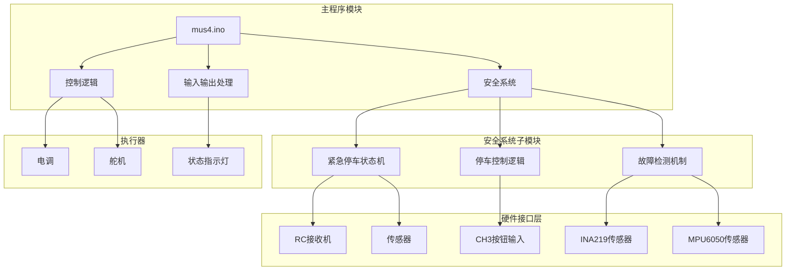
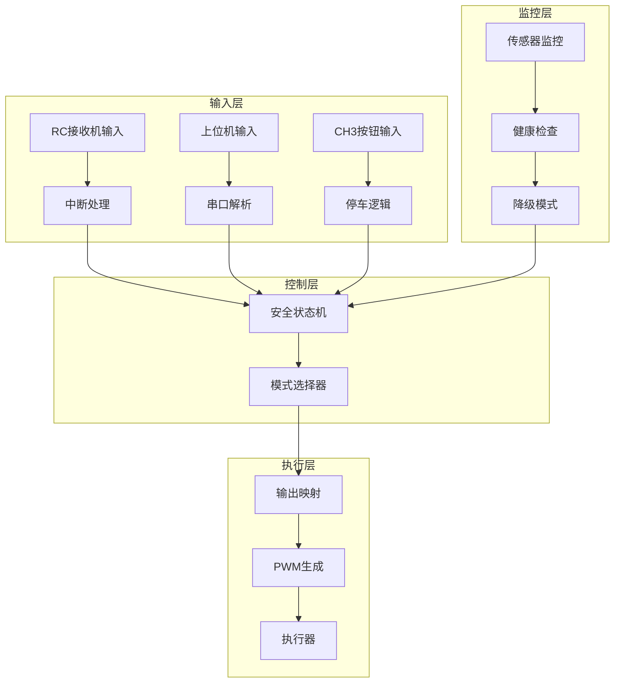
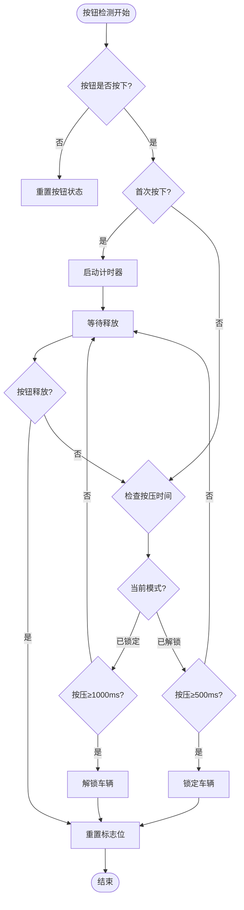
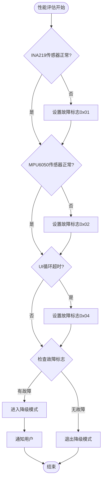
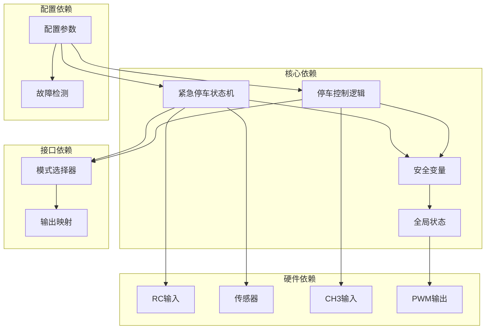

# 安全系统模块

<cite>
**本文档引用的文件**
- [mus4.ino](file://mus4/mus4.ino)
- [architecture.md](file://mus4/Doc/Arch/architecture.md)
- [pin_definitions.md](file://mus4/Doc/Hardware/pin_definitions.md)
- [DevNote.md](file://mus4/Doc/README/DevNote.md)
- [config.yaml](file://config.yaml)
</cite>

## 目录
1. [简介](#简介)
2. [项目结构](#项目结构)
3. [核心组件](#核心组件)
4. [架构概览](#架构概览)
5. [详细组件分析](#详细组件分析)
6. [依赖关系分析](#依赖关系分析)
7. [性能考虑](#性能考虑)
8. [故障排查指南](#故障排查指南)
9. [结论](#结论)
10. [附录](#附录)

## 简介
本文档深入分析MUS4安全系统模块，重点涵盖紧急停车状态机（EST_IDLE、EST_READY、EST_BRAKING、EST_DONE状态转换）、停车控制逻辑（park_change函数、CH_PARK按钮处理、PARK_UNLOCK_HOLD_TIME/PARK_LOCK_HOLD_TIME配置）以及安全机制实现细节。文档提供了状态机设计原理、超时控制、故障检测、安全优先级处理、紧急情况下的系统保护策略，并包含安全测试方法、故障模拟和恢复机制说明。

## 项目结构
MUS4项目采用模块化设计，安全系统作为核心子系统集成在主控制程序中：



**图表来源**
- [mus4.ino](file://mus4/mus4.ino#L1-L1290)
- [architecture.md](file://mus4/Doc/Arch/architecture.md#L1-L245)

**章节来源**
- [mus4.ino](file://mus4/mus4.ino#L1-L1290)
- [architecture.md](file://mus4/Doc/Arch/architecture.md#L1-L245)

## 核心组件
安全系统模块包含三个核心组件：

### 1. 紧急停车状态机
实现四状态状态机，确保在紧急情况下能够安全、可控地停止车辆。

### 2. 停车控制逻辑
基于CH3按钮的停车/解锁控制，提供防误操作的安全机制。

### 3. 故障检测机制
实时监控系统健康状态，自动降级运行模式。

**章节来源**
- [mus4.ino](file://mus4/mus4.ino#L221-L238)
- [DevNote.md](file://mus4/Doc/README/DevNote.md#L62-L72)

## 架构概览
安全系统采用分层架构设计，确保安全性和可靠性：



**图表来源**
- [architecture.md](file://mus4/Doc/Arch/architecture.md#L18-L45)
- [mus4.ino](file://mus4/mus4.ino#L1152-L1290)

## 详细组件分析

### 紧急停车状态机

#### 状态机设计原理
紧急停车状态机采用经典的有限状态机（FSM）设计，确保在任何时刻都处于确定的状态：

```mermaid
stateDiagram-v2
[*] --> EST_IDLE
EST_IDLE --> EST_READY : 检测到停车信号且有油门
EST_IDLE --> EST_DONE : 检测到停车信号且无油门
state EST_READY {
[*] --> WaitReady
WaitReady --> SetBrake : 500ms超时
note right of WaitReady : 缓冲期，油门设为15
}
EST_READY --> EST_BRAKING : 准备完成
EST_BRAKING --> EST_DONE : 1500ms刹车完成
EST_DONE --> EST_IDLE : 解除停车信号
state EST_BRAKING {
[*] --> Braking
Braking --> BrakeDone : 1500ms超时
note right of Braking : 全力刹车，油门设为-100
}
state EST_DONE {
note right of EST_DONE : 停车完成，油门归零
}
```

**图表来源**
- [architecture.md](file://mus4/Doc/Arch/architecture.md#L123-L151)
- [mus4.ino](file://mus4/mus4.ino#L474-L525)

#### 状态转换逻辑
每个状态都有明确的触发条件和超时控制：

| 状态 | 触发条件 | 超时时间 | 油门输出 | 安全优先级 |
|------|----------|----------|----------|------------|
| EST_IDLE | 检测到停车信号 | 无 | 当前值 | 最低 |
| EST_READY | EST_IDLE超时 | 500ms | 15 | 中等 |
| EST_BRAKING | EST_READY超时 | 1500ms | -100 | 最高 |
| EST_DONE | EST_BRAKING超时 | 无 | 0 | 最高 |

#### 实现细节
紧急停车状态机的关键实现包括：

1. **状态变量管理**：使用`emergencyStopState`枚举类型维护当前状态
2. **时间戳跟踪**：`emergencyStopStartTime`记录状态进入时间
3. **超时控制**：基于`millis()`函数实现非阻塞超时检测
4. **状态重置**：当停车信号解除时自动重置到EST_IDLE状态

**章节来源**
- [mus4.ino](file://mus4/mus4.ino#L221-L231)
- [mus4.ino](file://mus4/mus4.ino#L474-L525)

### 停车控制逻辑

#### CH_PARK按钮处理
停车控制逻辑基于CH3通道的PWM信号处理：



**图表来源**
- [mus4.ino](file://mus4/mus4.ino#L686-L740)

#### 配置参数
停车控制逻辑使用以下关键配置参数：

| 参数名称 | 值 | 说明 | 安全意义 |
|----------|----|------|----------|
| PARK_UNLOCK_HOLD_TIME | 1000ms | 解锁所需按压时间 | 防止误操作 |
| PARK_LOCK_HOLD_TIME | 500ms | 锁定所需按压时间 | 快速响应紧急情况 |
| CH_PARK阈值 | 1500μs | 按钮触发阈值 | 区分按下/释放状态 |

#### 安全机制实现
停车控制逻辑实现了多重安全保护：

1. **防误操作设计**：不同模式下不同的按压时间要求
2. **状态同步**：确保`rc_data.park`和`car_output.park`状态一致
3. **紧急重置**：解锁时自动重置紧急停车状态机
4. **状态反馈**：通过串口输出当前停车状态

**章节来源**
- [mus4.ino](file://mus4/mus4.ino#L233-L238)
- [mus4.ino](file://mus4/mus4.ino#L686-L740)

### 故障检测机制

#### 降级模式检测
系统实现了智能故障检测机制，当检测到硬件或性能问题时自动进入降级模式：



**图表来源**
- [mus4.ino](file://mus4/mus4.ino#L290-L305)

#### 故障检测指标
系统监控以下关键指标：

| 指标 | 检测条件 | 故障代码 | 影响范围 |
|------|----------|----------|----------|
| 传感器状态 | `valid`标志为false | 0x01/0x02 | 传感器功能 |
| UI性能 | `lastUICycleDuration` > 150ms | 0x04 | 用户界面响应 |
| 系统健康 | 综合故障标志 | 0x07 | 全系统 |

#### 降级模式行为
当进入降级模式时，系统会：
1. 设置`degradeMode = true`
2. 通过串口输出"DEGRADED MODE ACTIVE"警告
3. 简化UI更新频率，降低系统负载
4. 保持核心功能正常运行

**章节来源**
- [mus4.ino](file://mus4/mus4.ino#L276-L305)

## 依赖关系分析

### 组件间依赖关系
安全系统模块的组件间存在清晰的依赖关系：



**图表来源**
- [mus4.ino](file://mus4/mus4.ino#L221-L238)
- [mus4.ino](file://mus4/mus4.ino#L1152-L1290)

### 外部依赖
安全系统依赖以下外部组件：

1. **硬件传感器**：INA219电压电流监测、MPU6050惯性测量单元
2. **输入设备**：RC接收机、上位机串口通信
3. **执行器**：舵机、电调、状态指示灯
4. **系统库**：Arduino ESP32核心库、FastLED库、Adafruit传感器库

**章节来源**
- [pin_definitions.md](file://mus4/Doc/Hardware/pin_definitions.md#L1-L225)
- [mus4.ino](file://mus4/mus4.ino#L24-L37)

## 性能考虑
安全系统在设计时充分考虑了实时性和可靠性要求：

### 时间复杂度分析
- **状态机处理**：O(1) - 基于简单条件判断的状态转换
- **按钮检测**：O(1) - 基于阈值比较的快速检测
- **故障检测**：O(1) - 基于标志位的简单检查
- **PWM生成**：O(1) - 基于映射函数的快速计算

### 内存使用优化
- **状态变量**：仅使用必要的全局变量存储状态
- **定时器**：使用单个时间戳变量避免额外内存开销
- **缓冲区**：最小化串口缓冲区大小以节省内存

### 实时性保证
- **非阻塞设计**：所有操作都基于时间戳检查而非阻塞等待
- **中断处理**：RC输入使用硬件中断确保精确的脉宽测量
- **循环优化**：主循环中合理安排任务执行顺序

## 故障排查指南

### 常见故障诊断
1. **紧急停车无效**
   - 检查RC接收机CH3通道连接
   - 验证`pwm_value[CH_PARK]`值是否正确
   - 确认`car_output.park`状态同步

2. **停车按钮无响应**
   - 测试CH3按钮的PWM信号范围
   - 检查`PARK_UNLOCK_HOLD_TIME`和`PARK_LOCK_HOLD_TIME`配置
   - 验证按钮按压时间是否达到要求

3. **降级模式频繁触发**
   - 检查传感器连接和供电
   - 监控UI循环性能指标
   - 查看串口输出的错误信息

### 故障模拟测试
建议进行以下故障模拟测试：

1. **传感器故障模拟**
   - 断开INA219或MPU6050连接
   - 验证系统能否正确检测并进入降级模式
   - 测试降级模式下的功能完整性

2. **紧急停车测试**
   - 快速连续触发紧急停车
   - 验证状态机的正确重置
   - 检查刹车过程的稳定性

3. **按钮误操作测试**
   - 短时间按压CH3按钮
   - 验证防误操作机制的有效性
   - 测试不同模式下的响应差异

### 恢复机制
系统提供了多种自动恢复机制：

1. **状态机自动重置**：当停车信号解除时自动回到EST_IDLE状态
2. **传感器自检**：定期重新初始化传感器连接
3. **降级模式退出**：当故障消除后自动退出降级模式
4. **系统重启**：严重故障时提供手动重启选项

**章节来源**
- [DevNote.md](file://mus4/Doc/README/DevNote.md#L82-L101)

## 结论
MUS4安全系统模块通过精心设计的状态机、可靠的按钮控制逻辑和智能的故障检测机制，为自动驾驶小车提供了全面的安全保障。系统的设计原则包括：

1. **安全性优先**：紧急停车状态机确保在任何情况下都能安全停止
2. **防误操作**：通过不同的按压时间要求防止误操作
3. **实时响应**：非阻塞设计确保快速的系统响应
4. **智能降级**：在故障情况下提供安全的降级运行模式
5. **易于维护**：清晰的故障诊断和恢复机制

这些特性使得MUS4安全系统能够在各种复杂的使用环境中可靠运行，为用户提供了安全、稳定、易用的驾驶体验。

## 附录

### 安全测试方法
1. **功能测试**：验证所有安全功能的正确性
2. **压力测试**：长时间连续运行测试系统的稳定性
3. **故障注入测试**：模拟各种故障场景验证系统的容错能力
4. **性能基准测试**：评估系统在不同负载下的性能表现

### 配置参数参考
- **紧急停车状态机**：`EMERGENCY_STOP_READY_DURATION`、`EMERGENCY_STOP_BRAKE_DURATION`
- **停车控制**：`PARK_UNLOCK_HOLD_TIME`、`PARK_LOCK_HOLD_TIME`
- **系统监控**：`sensorTTL`、`rcTTL`、`outputTTL`

### 维护建议
1. 定期检查传感器连接和供电
2. 清洁RC接收机天线和连接器
3. 更新固件以获得最新的安全补丁
4. 建立定期的系统健康检查制度