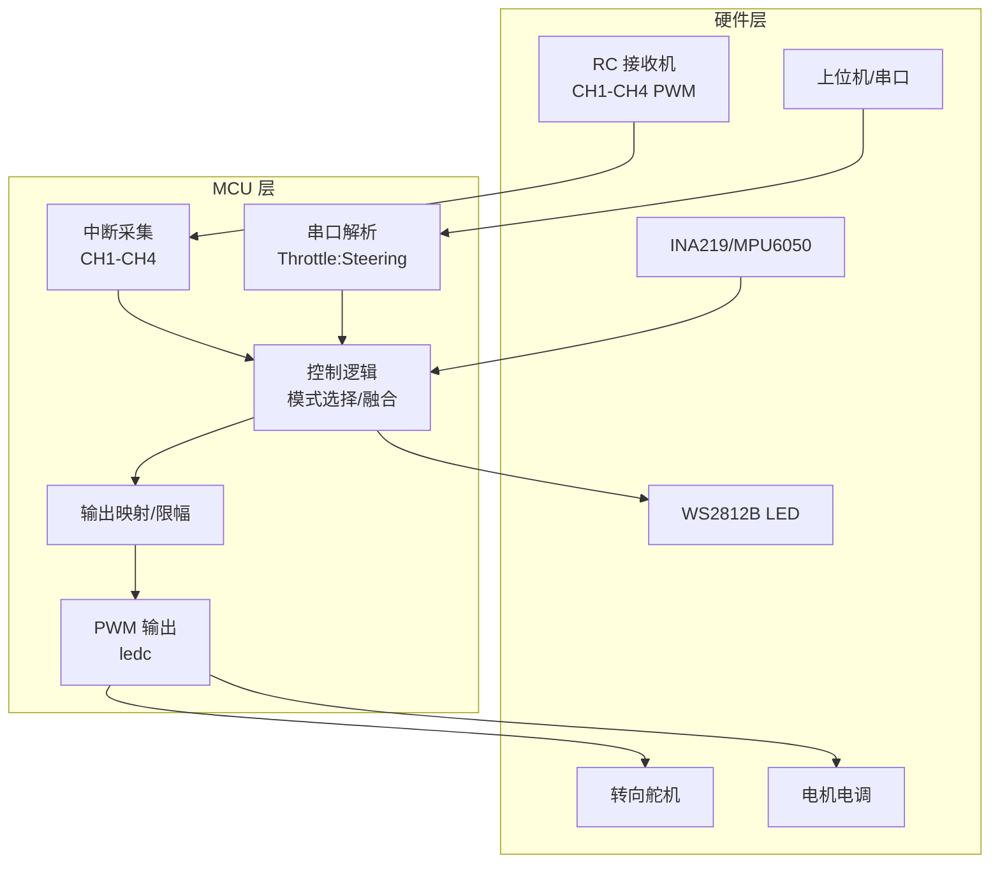
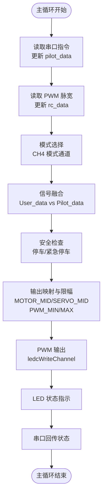
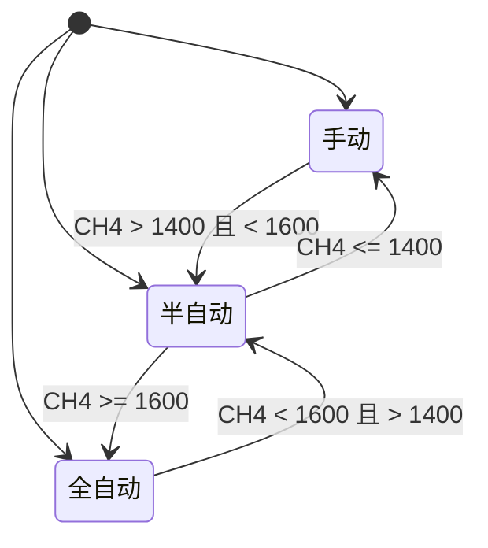
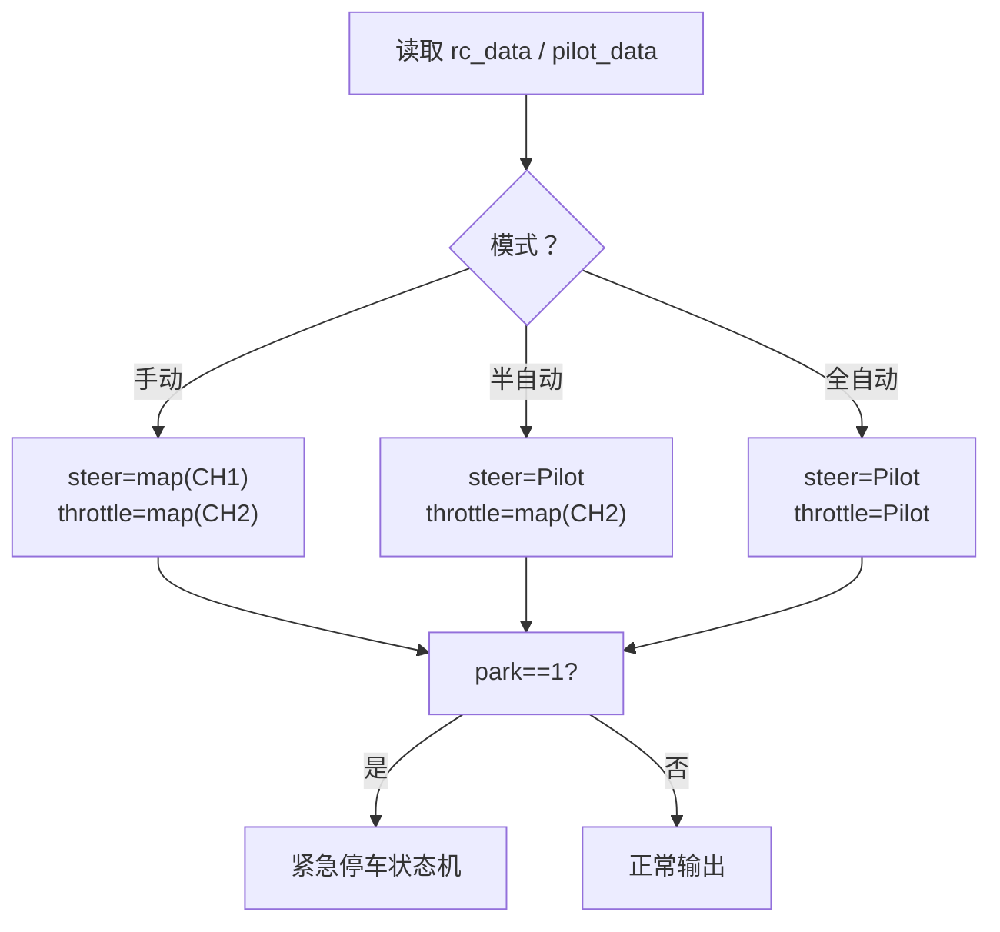
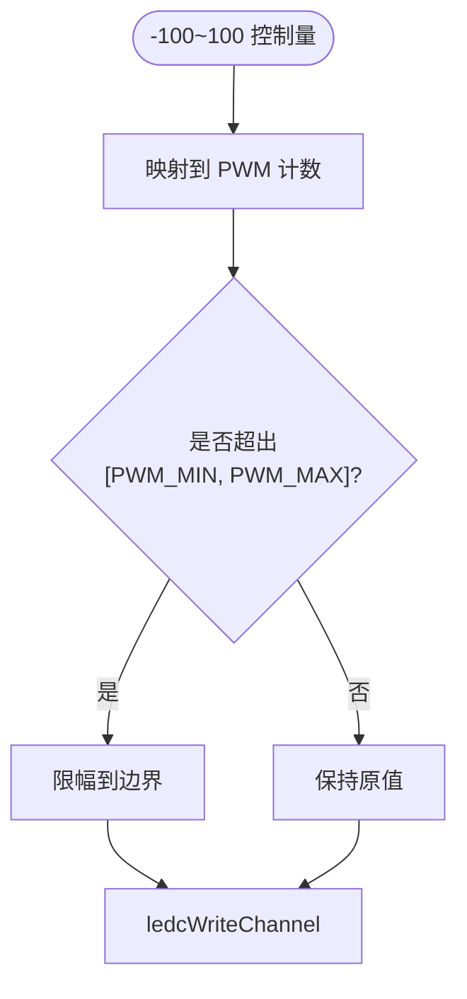
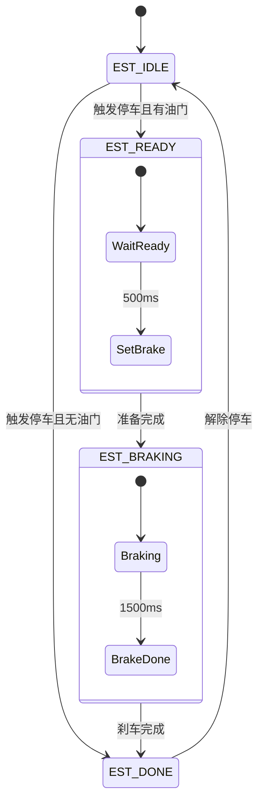
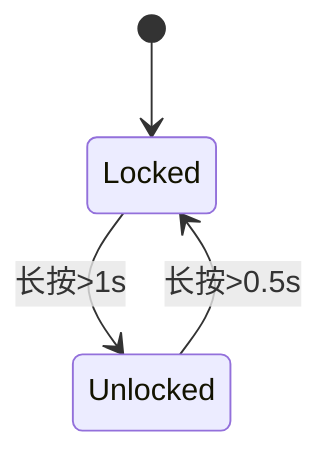
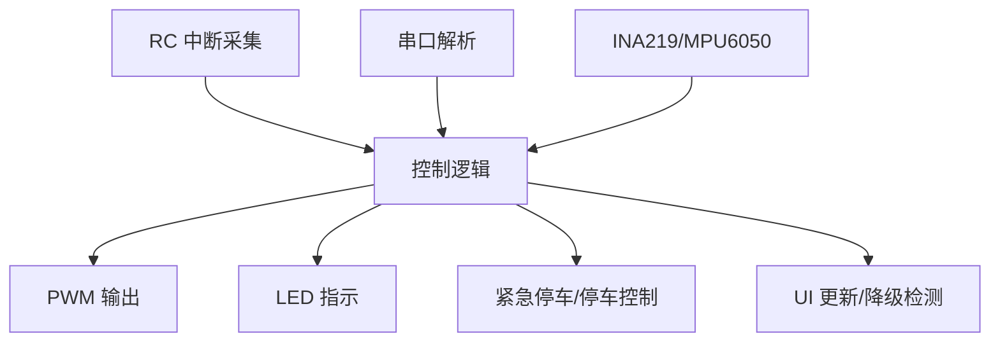

# 控制逻辑模块

<cite>
**本文引用的文件列表**
- [mus4.ino](file://mus4/mus4.ino)
- [architecture.md](file://mus4/Doc/Arch/architecture.md)
- [DevNote.md](file://mus4/Doc/README/DevNote.md)
- [pin_definitions.md](file://mus4/Doc/Hardware/pin_definitions.md)
- [sketch.yaml](file://mus4/sketch.yaml)
</cite>

## 目录
1. [简介](#简介)
2. [项目结构](#项目结构)
3. [核心组件](#核心组件)
4. [架构总览](#架构总览)
5. [详细组件分析](#详细组件分析)
6. [依赖关系分析](#依赖关系分析)
7. [性能考量](#性能考量)
8. [故障排查指南](#故障排查指南)
9. [结论](#结论)
10. [附录](#附录)

## 简介
本文件面向控制逻辑模块，系统化阐述多模式控制策略（手动、半自动、全自动驾驶）、信号融合算法（User_data 与 Pilot_data 的优先级与合成）、输出映射与限幅处理（MOTOR_MID、SERVO_MID、PWM_MIN/MAX），并覆盖模式切换逻辑、控制回路设计、稳定性保障机制、异常处理与性能优化策略。同时提供参数调整示例与调试技巧，帮助开发者快速定位问题并进行优化。

## 项目结构
- 控制主程序位于 mus4/mus4.ino，包含中断采集、串口解析、模式选择、信号融合、输出映射与限幅、LED指示、紧急停车与停车控制等完整闭环。
- 文档位于 mus4/Doc，包含架构说明、硬件引脚定义、开发笔记等，便于理解系统设计与硬件约束。
- 配置文件 sketch.yaml 提供 Arduino CLI 默认编译目标与端口信息。



图表来源
- [mus4.ino](file://mus4/mus4.ino#L1104-L1290)
- [architecture.md](file://mus4/Doc/Arch/architecture.md#L1-L45)

章节来源
- [mus4.ino](file://mus4/mus4.ino#L1104-L1290)
- [architecture.md](file://mus4/Doc/Arch/architecture.md#L1-L45)
- [sketch.yaml](file://mus4/sketch.yaml#L1-L3)

## 核心组件
- 信号采集与解析
  - RC PWM 中断采集：CH1-CH4 通过中断测量脉宽，解析为控制量。
  - 串口解析：支持 USB 与 RS232 两种串口，解析“T:S\n”格式命令，更新 pilot_data。
- 模式选择与信号融合
  - 模式切换：CH4 模式通道决定手动/半自动/全自动驾驶。
  - 融合策略：不同模式下对 User_data（RC）与 Pilot_data（上位机）的优先级与合成方式不同。
- 输出映射与限幅
  - 将 -100~100 的控制量映射到 PWM 计数范围，并进行 PWM_MIN/MAX 限幅。
  - 舵机与电调分别使用不同的中位与范围参数。
- 安全机制
  - 停车/解锁：CH3 按钮长按实现锁定/解锁。
  - 紧急停车：状态机在停车信号下执行缓冲与全力刹车。
- 状态指示与反馈
  - LED 颜色随模式变化；紧急停车时双色闪烁。
  - 通过串口周期性回传控制状态。

章节来源
- [mus4.ino](file://mus4/mus4.ino#L414-L433)
- [mus4.ino](file://mus4/mus4.ino#L742-L769)
- [mus4.ino](file://mus4/mus4.ino#L771-L786)
- [mus4.ino](file://mus4/mus4.ino#L1152-L1290)
- [architecture.md](file://mus4/Doc/Arch/architecture.md#L109-L161)

## 架构总览
控制逻辑采用“输入采集—模式选择—信号融合—输出映射—执行输出”的分层设计，主循环以固定时间片推进，确保实时性与稳定性。



图表来源
- [mus4.ino](file://mus4/mus4.ino#L1152-L1290)
- [architecture.md](file://mus4/Doc/Arch/architecture.md#L66-L107)

章节来源
- [mus4.ino](file://mus4/mus4.ino#L1152-L1290)
- [architecture.md](file://mus4/Doc/Arch/architecture.md#L66-L107)

## 详细组件分析

### 多模式控制策略
- 模式定义与切换
  - 手动模式（CAR_MODE_MANUAL）：完全由 RC 控制，转向与油门均来自 RC。
  - 半自动模式（CAR_MODE_SEMI_AUTO）：自动转向（Pilot），油门来自 RC。
  - 全自动驾驶（CAR_MODE_FULL_AUTO）：转向与油门均由 Pilot 控制。
- 模式切换逻辑
  - CH4 模式通道脉宽阈值决定模式：<=1400 手动，(1400,1600) 半自动，>=1600 全自动。
- 状态指示
  - LED 颜色随模式变化；紧急停车时双色闪烁。



图表来源
- [mus4.ino](file://mus4/mus4.ino#L771-L786)
- [architecture.md](file://mus4/Doc/Arch/architecture.md#L109-L116)

章节来源
- [mus4.ino](file://mus4/mus4.ino#L771-L786)
- [architecture.md](file://mus4/Doc/Arch/architecture.md#L109-L116)

### 信号融合算法与优先级
- 融合规则
  - 全自动：car_output.steering = Pilot，car_output.throttle = Pilot。
  - 半自动：car_output.steering = Pilot，car_output.throttle = map(RC throttle)。
  - 手动：car_output.steering = map(RC steering)，car_output.throttle = map(RC throttle)。
- 优先级判定
  - 模式决定来源优先级：Pilot > RC。
  - 停车信号（park == 1）优先于模式，强制进入紧急停车状态机。
- 数据结构
  - struct_message 统一承载 throttle、steering、mode、park 字段，便于跨模块传递。



图表来源
- [mus4.ino](file://mus4/mus4.ino#L1170-L1239)
- [mus4.ino](file://mus4/mus4.ino#L435-L472)

章节来源
- [mus4.ino](file://mus4/mus4.ino#L1170-L1239)
- [mus4.ino](file://mus4/mus4.ino#L435-L472)

### 输出映射与限幅处理
- 映射策略
  - 舵机（steering）：map(-100, 100, SERVO_MID±SERVO_RANGE)
  - 电调（throttle）：map(-100, 100, MOTOR_MID±MOTOR_RANGE)
- 限幅策略
  - 输出 PWM 计数在 [PWM_MIN, PWM_MAX] 之间约束，避免越界。
- PWM 生成
  - 使用 ledc 库，频率 50Hz，分辨率 14bit，分别绑定到 CH_STEERING 与 CH_THROTTLE 通道。



图表来源
- [mus4.ino](file://mus4/mus4.ino#L1269-L1276)
- [pin_definitions.md](file://mus4/Doc/Hardware/pin_definitions.md#L210-L219)

章节来源
- [mus4.ino](file://mus4/mus4.ino#L1269-L1276)
- [pin_definitions.md](file://mus4/Doc/Hardware/pin_definitions.md#L210-L219)

### 模式切换逻辑与控制回路
- 切换条件
  - CH4 脉宽阈值决定模式；主循环每轮读取并更新 car_output.mode。
- 控制回路
  - 每轮主循环：读取串口与 RC → 更新 rc_data/pilot_data → 模式选择 → 融合 → 安全检查 → 映射限幅 → PWM 输出 → LED/反馈。
- 稳定性保障
  - 串口解析具备校验与错误统计，UI 周期动态自适应，降级模式检测与提示。

```mermaid
sequenceDiagram
participant Loop as "主循环"
participant ISR as "中断采集"
participant Parse as "串口解析"
participant Logic as "控制逻辑"
participant Map as "输出映射"
participant PWM as "PWM 输出"
participant LED as "LED 指示"
Loop->>ISR : 读取 CH1-CH4 脉宽
Loop->>Parse : 读取串口指令
ISR-->>Logic : 更新 rc_data
Parse-->>Logic : 更新 pilot_data
Loop->>Logic : 模式选择/融合
Logic->>Map : 控制量(-100~100)
Map->>PWM : PWM 计数(限幅)
PWM-->>Loop : 输出执行
Loop->>LED : 设置颜色/闪烁
```

图表来源
- [mus4.ino](file://mus4/mus4.ino#L1152-L1290)

章节来源
- [mus4.ino](file://mus4/mus4.ino#L1152-L1290)

### 紧急停车机制与稳定性保证
- 状态机
  - EST_IDLE → EST_READY(缓冲，油门=15) → EST_BRAKING(刹车，油门=-100) → EST_DONE(归零) → EST_IDLE(解除停车)。
- 触发条件
  - park==1 且当前有油门时进入 EST_READY；无油门则直接 EST_DONE。
- 稳定性保障
  - 降级模式检测：传感器无效或 UI 周期过长触发降级，LED 提示。
  - UI 自适应：根据执行耗时动态调整 UI 更新间隔，避免影响主循环。



图表来源
- [mus4.ino](file://mus4/mus4.ino#L474-L525)
- [architecture.md](file://mus4/Doc/Arch/architecture.md#L117-L161)

章节来源
- [mus4.ino](file://mus4/mus4.ino#L474-L525)
- [architecture.md](file://mus4/Doc/Arch/architecture.md#L117-L161)

### 停车/解锁控制
- 按钮逻辑
  - CH3 脉宽>1500 视为按下；长按 1s 解锁，0.5s 锁定。
- 状态转换
  - Locked ↔ Unlocked，切换时重置紧急停车状态机。



图表来源
- [mus4.ino](file://mus4/mus4.ino#L686-L740)

章节来源
- [mus4.ino](file://mus4/mus4.ino#L686-L740)

### 异常情况处理
- 串口解析异常
  - 校验失败返回 NACK，错误计数累加；支持测试/基准/压力/回归等诊断命令。
- 传感器异常
  - INA219/MPU6050 无效时触发降级模式，UI 提示。
- UI 周期过长
  - 自适应延长 UI 间隔，避免抢占主循环资源。

章节来源
- [mus4.ino](file://mus4/mus4.ino#L320-L411)
- [mus4.ino](file://mus4/mus4.ino#L290-L305)

## 依赖关系分析
- 模块耦合
  - 控制逻辑依赖 RC 与串口输入；输出依赖 PWM 与 LED；安全机制与模式选择相互影响。
- 外部依赖
  - I2C 设备（INA219/MPU6050）用于状态监控；蓝牙手柄模式可选启用。
- 时间特性
  - 传感器更新 1Hz，RC 数据约 60Hz，UI 60Hz，主循环内嵌入输出与反馈。



图表来源
- [mus4.ino](file://mus4/mus4.ino#L1152-L1290)
- [architecture.md](file://mus4/Doc/Arch/architecture.md#L14-L45)

章节来源
- [mus4.ino](file://mus4/mus4.ino#L1152-L1290)
- [architecture.md](file://mus4/Doc/Arch/architecture.md#L14-L45)

## 性能考量
- 实时性
  - 主循环固定时间片推进，RC/串口/传感器/UI 各自定时器控制，避免阻塞。
- 资源占用
  - ledc PWM 通道绑定与频率设置；中断处理仅记录时间戳，不进行复杂运算。
- 降级策略
  - 传感器失效或 UI 周期过长时进入降级模式，降低 UI 更新频率，保证控制回路稳定。
- 优化建议
  - 将 map 与 constrain 放在输出阶段，减少中间变量开销。
  - 串口解析增加超时与溢出保护，避免缓冲区被恶意输入填满。

[本节为通用性能指导，不直接分析具体文件]

## 故障排查指南
- 无法解析串口命令
  - 检查波特率与格式（T:S\n），确认校验与换行符；使用 TEST/BENCH/STRESS/REGRESS 命令自检。
- 油门/转向异常
  - 确认 RC 校准值与映射范围；检查 PWM_MIN/MAX 与中位值设置；验证硬件连接与电平兼容。
- 模式切换无效
  - 测量 CH4 脉宽，确认阈值范围；检查主循环是否正确读取 CH4。
- 紧急停车不生效
  - 确认 park 信号来源；查看紧急停车状态机日志；检查刹车阶段油门设置。
- 传感器数据无效
  - 使用 I2C 扫描工具检查设备地址；核对 I2C 引脚与上拉电阻；必要时降低 I2C 速度。

章节来源
- [mus4.ino](file://mus4/mus4.ino#L320-L411)
- [mus4.ino](file://mus4/mus4.ino#L841-L896)
- [mus4.ino](file://mus4/mus4.ino#L922-L975)
- [DevNote.md](file://mus4/Doc/README/DevNote.md#L82-L122)

## 结论
本控制逻辑模块以清晰的分层架构实现了多模式控制与信号融合，结合完善的紧急停车与停车控制，确保系统在不同工况下的安全性与稳定性。通过合理的输出映射与限幅策略，配合降级与自适应机制，能够在资源受限的嵌入式平台上实现可靠的实时控制。建议在实际部署中结合硬件校准与参数微调，进一步提升控制精度与鲁棒性。

[本节为总结性内容，不直接分析具体文件]

## 附录

### 控制参数与阈值
- 模式阈值
  - 手动：CH4 <= 1400
  - 半自动：1400 < CH4 < 1600
  - 全自动：CH4 >= 1600
- PWM 参数
  - PWM_MIN：最小计数值
  - PWM_MAX：最大计数值
  - MOTOR_MID：电调中位
  - MOTOR_RANGE：电调范围
  - SERVO_MID：舵机中位
  - SERVO_RANGE：舵机范围
- 安全阈值
  - PARK_LOCK_HOLD_TIME：锁定所需按住时间
  - PARK_UNLOCK_HOLD_TIME：解锁所需按住时间
  - EMERGENCY_STOP_READY_DURATION：准备刹车时间
  - EMERGENCY_STOP_BRAKE_DURATION：全力刹车时间

章节来源
- [DevNote.md](file://mus4/Doc/README/DevNote.md#L103-L117)
- [pin_definitions.md](file://mus4/Doc/Hardware/pin_definitions.md#L210-L219)

### 调试技巧与参数调整示例
- 调试输出
  - 取消注释 DEBUG 宏以打印 RC 通道值，便于观察输入信号。
- 参数微调
  - 电调/舵机中位与范围：根据实车校准调整 MOTOR_MID/MOTOR_RANGE 与 SERVO_MID/SERVO_RANGE，确保静止时对应中立位置。
  - PWM 限幅：若出现抖动或死区，适当收紧 PWM_MIN/MAX 或调整中位偏移。
  - 模式阈值：若 CH4 信号噪声较大，可在主循环中加入去抖逻辑（如连续多次采样取中值）。
- 串口诊断
  - 使用 TEST/BENCH/STRESS/REGRESS 命令快速验证解析与映射逻辑。
- 硬件检查
  - 使用 I2C 扫描与传感器初始化日志，确认设备连接与地址配置正确。

章节来源
- [DevNote.md](file://mus4/Doc/README/DevNote.md#L82-L102)
- [mus4.ino](file://mus4/mus4.ino#L355-L378)
- [mus4.ino](file://mus4/mus4.ino#L841-L896)
- [mus4.ino](file://mus4/mus4.ino#L922-L975)