# 通信协议模块

<cite>
**本文档引用的文件**
- [mus4.ino](file://mus4/mus4/mus4.ino)
- [CONFIG.md](file://mus4/docs/CONFIG.md)
- [OPERATIONS.md](file://mus4/docs/OPERATIONS.md)
- [architecture.md](file://mus4/Doc/Arch/architecture.md)
- [pin_definitions.md](file://mus4/Doc/Hardware/pin_definitions.md)
- [DevNote.md](file://mus4/Doc/README/DevNote.md)
- [sketch.yaml](file://mus4/mus4/sketch.yaml)
</cite>

## 更新摘要
**变更内容**
- 新增串口缓冲管理系统和双向确认反馈机制
- 完善测试命令系统和协议规范
- 增强协议安全性设计和错误处理
- 优化通信缓冲区管理和性能监控

## 目录
1. [简介](#简介)
2. [项目结构](#项目结构)
3. [核心组件](#核心组件)
4. [架构概览](#架构概览)
5. [详细组件分析](#详细组件分析)
6. [依赖关系分析](#依赖关系分析)
7. [性能考虑](#性能考虑)
8. [故障排除指南](#故障排除指南)
9. [结论](#结论)

## 简介

通信协议模块是 MUS4 自动驾驶控制系统的核心组成部分，负责处理来自上位机的串口通信指令。该模块实现了双串口设计，支持 USB Type-C 和 RS232 两种通信方式，采用简洁高效的协议格式，确保系统能够稳定可靠地接收和处理控制指令。

**更新** 新增了完整的串口缓冲管理系统、双向确认反馈机制和测试命令系统，显著提升了协议的安全性和可维护性。

该模块的主要特点包括：
- **双串口设计**：同时支持 USB 和 RS232 通信接口
- **高效协议格式**：T:S*CS 格式，包含校验和验证
- **严格的范围控制**：-100~100 的数值范围限制
- **完善的错误处理**：溢出检测和错误统计
- **实时性能监控**：帧计数和错误统计功能
- **双向确认反馈**：ACK/NACK 应答机制
- **内置测试系统**：完整的测试命令集

## 项目结构

通信协议模块位于 mus4 项目的主程序文件中，与系统的其他核心功能紧密集成：

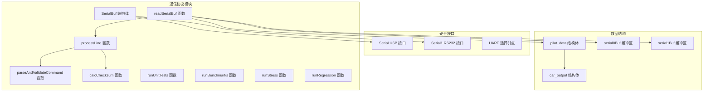

**图表来源**
- [mus4.ino](file://mus4/mus4/mus4.ino#L137-L139)
- [mus4.ino](file://mus4/mus4/mus4.ino#L320-L342)
- [mus4.ino](file://mus4/mus4/mus4.ino#L344-L411)

**章节来源**
- [mus4.ino](file://mus4/mus4/mus4.ino#L58-L65)
- [mus4.ino](file://mus4/mus4/mus4.ino#L1104-L1150)

## 核心组件

### 串口缓冲区管理

**更新** 新增了完整的串口缓冲管理系统，每个串口都有独立的缓冲区管理：

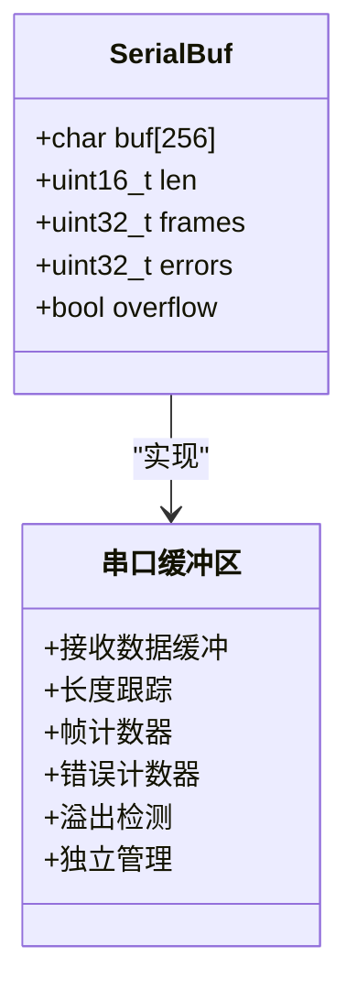

**图表来源**
- [mus4.ino](file://mus4/mus4/mus4.ino#L137-L139)

### 双串口设计

系统实现了双串口通信架构，支持同时处理来自不同来源的指令：

| 串口类型 | 引脚配置 | 波特率 | 用途 | 特殊功能 |
|---------|----------|--------|------|----------|
| Serial (USB) | GPIO 5 (Type-C) | 115200 | 调试和开发 | 支持测试命令 |
| Serial1 (RS232) | GPIO 16/17 | 115200 | 上位机通信 | 自动 ACK/NACK |

**章节来源**
- [mus4.ino](file://mus4/mus4/mus4.ino#L58-L65)
- [mus4.ino](file://mus4/mus4/mus4.ino#L1104-L1113)

### 测试命令系统

**新增** 系统提供了完整的测试命令集，用于协议验证和性能测试：

| 命令 | 功能描述 | 输出示例 | 用途 |
|------|----------|----------|------|
| TEST | 单元测试 | TEST: total=4 passed=4 ok=1 | 验证协议解析正确性 |
| BENCH | 性能基准测试 | BENCH: loops=123 duration=200ms | 测试系统性能 |
| STRESS | 异常压力测试 | STRESS: errors_delta=0 | 测试系统稳定性 |
| REGRESS | 回归校验 | REGRESS: ok=1 | 验证功能回归 |

**章节来源**
- [mus4.ino](file://mus4/mus4/mus4.ino#L153-L200)
- [mus4.ino](file://mus4/mus4/mus4.ino#L355-L378)

## 架构概览

通信协议模块在整个系统架构中扮演着关键的数据入口角色：

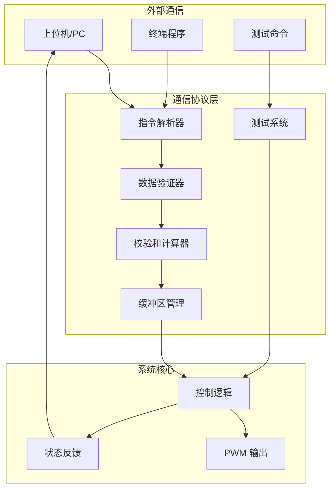

**图表来源**
- [architecture.md](file://mus4/Doc/Arch/architecture.md#L18-L45)

## 详细组件分析

### 指令解析机制

#### processLine 函数

**更新** `processLine` 函数现在支持可选的校验和验证：

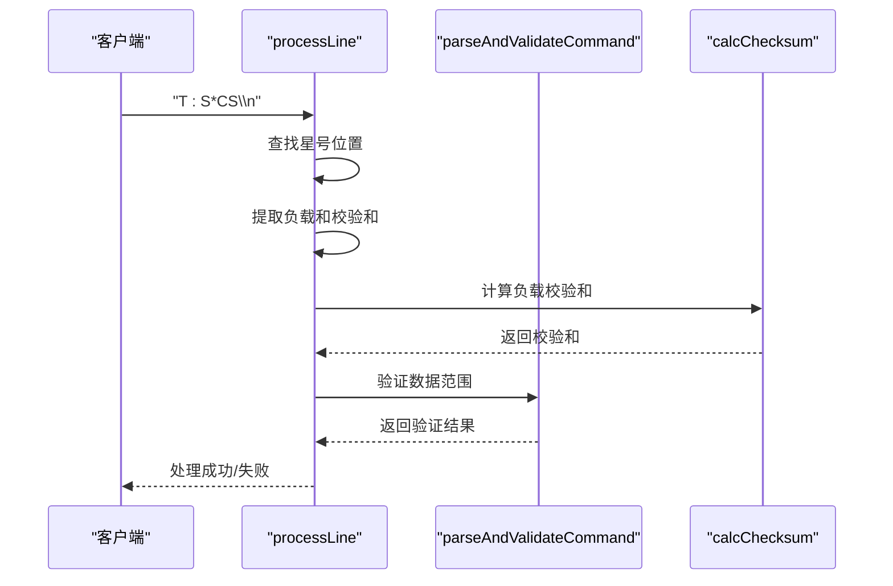

**图表来源**
- [mus4.ino](file://mus4/mus4/mus4.ino#L320-L342)

#### parseAndValidateCommand 函数

该函数专门负责数据验证和范围检查：

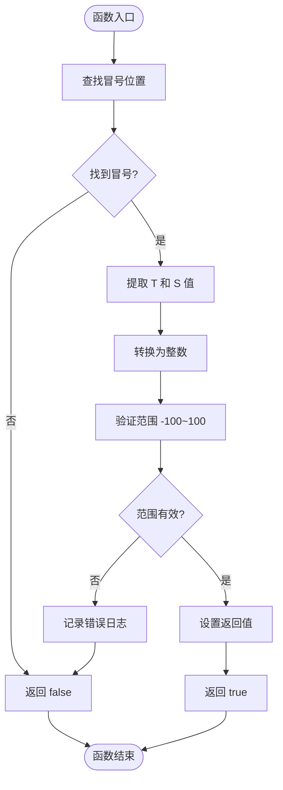

**图表来源**
- [mus4.ino](file://mus4/mus4/mus4.ino#L742-L769)

**章节来源**
- [mus4.ino](file://mus4/mus4/mus4.ino#L320-L342)
- [mus4.ino](file://mus4/mus4/mus4.ino#L742-L769)

### 数据格式规范

#### T:S*CS 格式

**更新** 协议现在支持两种格式：基本格式和带校验和格式：

| 组件 | 格式要求 | 示例 | 说明 |
|------|----------|------|------|
| 油门值 (T) | 整数范围 -100~100 | 10, -5, 0 | 控制车辆油门 |
| 冒号分隔符 | 固定字符 ':' | - | 分隔油门和转向值 |
| 转向值 (S) | 整数范围 -100~100 | 20, -10, 0 | 控制车辆转向 |
| 可选校验和 (CS) | 2位十六进制 | A1, FF, 00 | 数据完整性验证 |
| 结束符 | 固定字符 '\\n' | - | 指令结束标记 |

#### 字符串处理流程

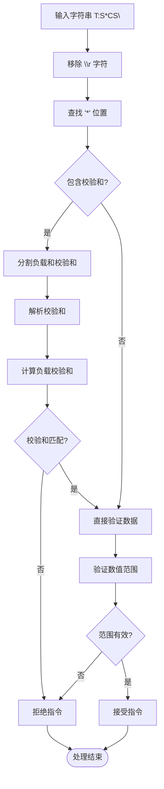

**图表来源**
- [mus4.ino](file://mus4/mus4/mus4.ino#L320-L342)
- [mus4.ino](file://mus4/mus4/mus4.ino#L313-L318)

**章节来源**
- [DevNote.md](file://mus4/Doc/README/DevNote.md#L24-L29)

### 通信缓冲区管理

#### SerialBuf 结构体

**更新** 每个串口都有独立的缓冲区管理：

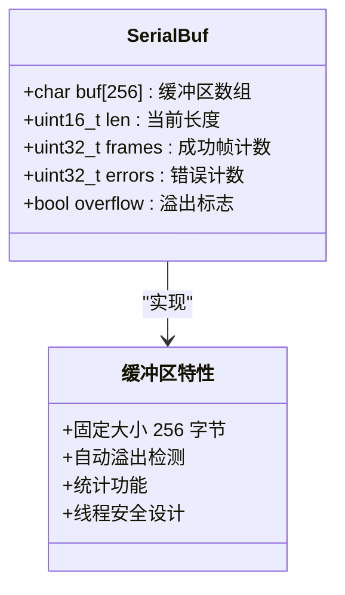

**图表来源**
- [mus4.ino](file://mus4/mus4/mus4.ino#L137-L139)

#### readSerialBuf 函数

**更新** 该函数现在支持测试命令处理和双向确认反馈：

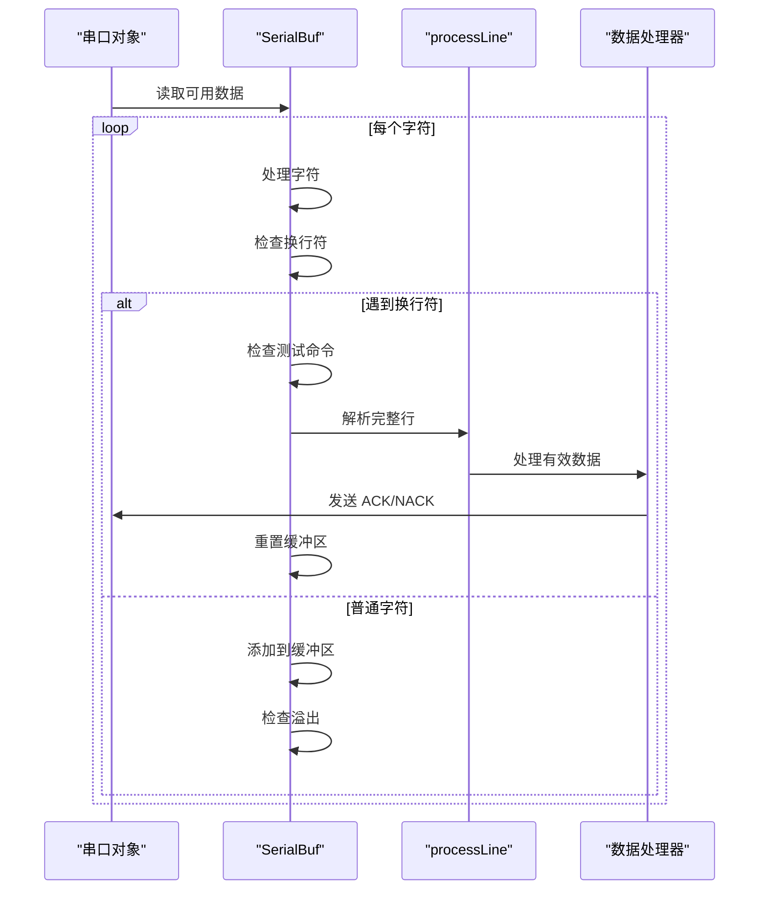

**图表来源**
- [mus4.ino](file://mus4/mus4/mus4.ino#L344-L411)

**章节来源**
- [mus4.ino](file://mus4/mus4/mus4.ino#L137-L139)
- [mus4.ino](file://mus4/mus4/mus4.ino#L344-L411)

### 协议安全性设计

#### 校验和验证

**更新** 协议采用了灵活的校验和机制：

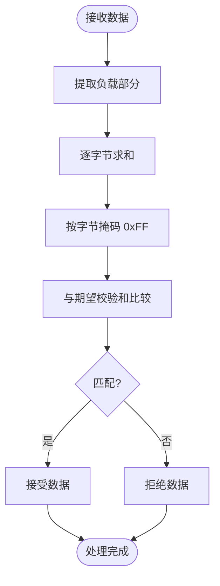

**图表来源**
- [mus4.ino](file://mus4/mus4/mus4.ino#L313-L318)

#### 错误处理机制

**更新** 系统实现了多层次的错误检测和处理：

| 错误类型 | 检测点 | 处理方式 | 统计方式 |
|----------|--------|----------|----------|
| 格式错误 | 指令解析 | 返回 false | errors++ |
| 范围错误 | 数值验证 | 记录错误日志 | errors++ |
| 校验和错误 | 校验和计算 | 返回 false | errors++ |
| 缓冲区溢出 | 字符添加 | 设置溢出标志 | overflow=true |
| 测试命令 | 特殊指令 | 执行内置测试 | 无统计 |

#### 双向确认反馈

**新增** 系统实现了智能的双向确认反馈机制：

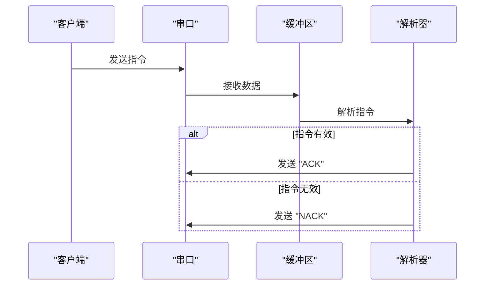

**图表来源**
- [mus4.ino](file://mus4/mus4/mus4.ino#L385-L393)

**章节来源**
- [mus4.ino](file://mus4/mus4/mus4.ino#L313-L318)
- [mus4.ino](file://mus4/mus4/mus4.ino#L344-L411)

### 命令路由机制

#### 数据流处理

**更新** 系统实现了智能的数据路由机制，支持测试命令和协议数据：

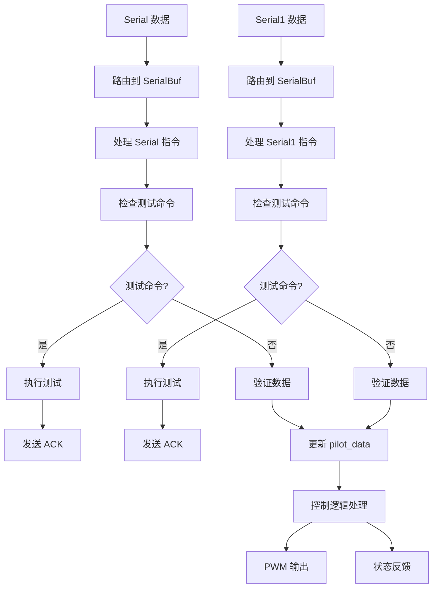

**图表来源**
- [mus4.ino](file://mus4/mus4/mus4.ino#L1162-L1163)
- [mus4.ino](file://mus4/mus4/mus4.ino#L379-L387)

**章节来源**
- [mus4.ino](file://mus4/mus4/mus4.ino#L1162-L1163)
- [mus4.ino](file://mus4/mus4/mus4.ino#L379-L387)

### 测试命令系统

**新增** 系统提供了完整的测试命令集：

#### runUnitTests 函数

执行单元测试，验证协议解析的正确性：

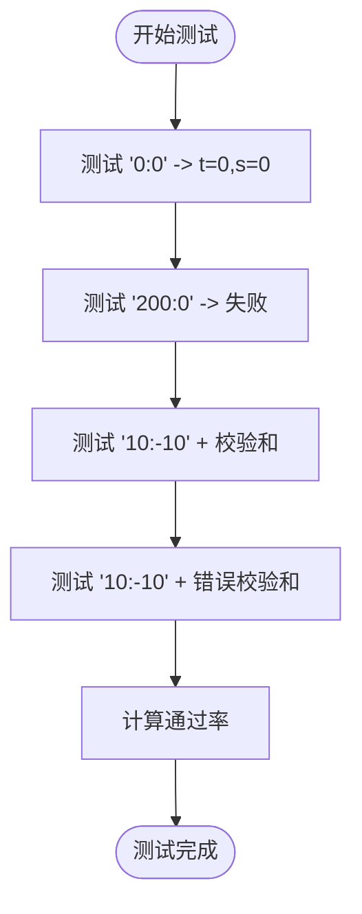

**图表来源**
- [mus4.ino](file://mus4/mus4/mus4.ino#L153-L166)

#### runBenchmarks 函数

执行性能基准测试：

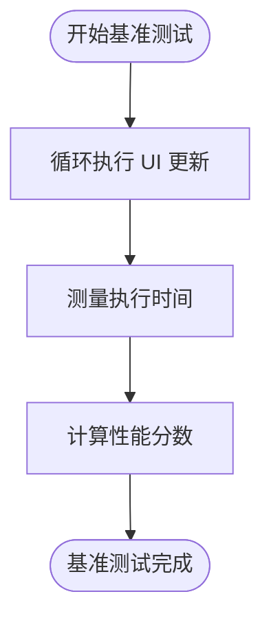

**图表来源**
- [mus4.ino](file://mus4/mus4/mus4.ino#L167-L181)

#### runStress 函数

执行压力测试，检测系统在异常情况下的稳定性：

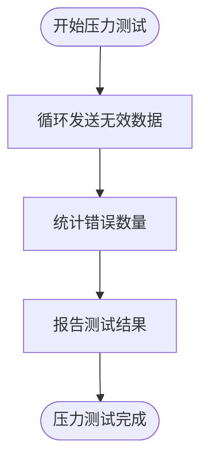

**图表来源**
- [mus4.ino](file://mus4/mus4/mus4.ino#L182-L192)

#### runRegression 函数

执行回归测试，验证功能的稳定性：

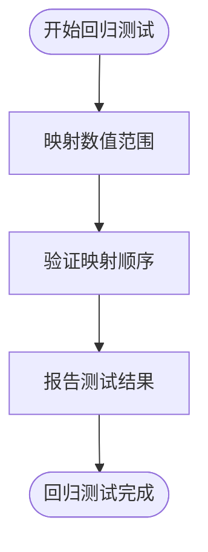

**图表来源**
- [mus4.ino](file://mus4/mus4/mus4.ino#L193-L200)

**章节来源**
- [mus4.ino](file://mus4/mus4/mus4.ino#L153-L200)

## 依赖关系分析

### 硬件依赖

通信协议模块与硬件层存在紧密的依赖关系：

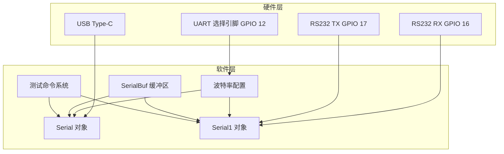

**图表来源**
- [mus4.ino](file://mus4/mus4/mus4.ino#L58-L65)
- [mus4.ino](file://mus4/mus4/mus4.ino#L1104-L1113)

### 软件依赖

**更新** 模块之间的依赖关系更加清晰，新增了测试系统的依赖：

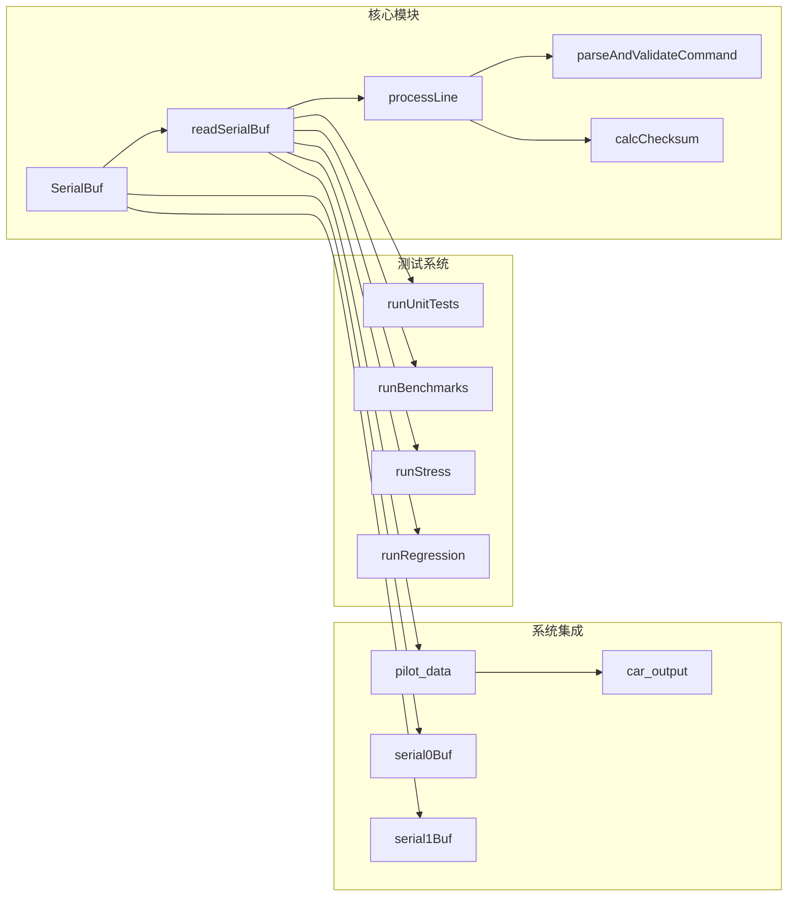

**图表来源**
- [mus4.ino](file://mus4/mus4/mus4.ino#L137-L139)
- [mus4.ino](file://mus4/mus4/mus4.ino#L320-L342)
- [mus4.ino](file://mus4/mus4/mus4.ino#L344-L411)

**章节来源**
- [mus4.ino](file://mus4/mus4/mus4.ino#L58-L65)
- [mus4.ino](file://mus4/mus4/mus4.ino#L137-L139)

## 性能考虑

### 实时性能

**更新** 系统在设计时充分考虑了实时性能要求，新增了测试命令的性能考量：

| 组件 | 性能指标 | 优化策略 |
|------|----------|----------|
| 串口处理 | 115200 bps | 非阻塞读取，缓冲区管理 |
| 指令解析 | < 1ms | 简单算法，避免复杂运算 |
| 校验和计算 | O(n) | 逐字节求和，快速实现 |
| 缓冲区管理 | 固定大小 | 避免动态内存分配 |
| 测试命令 | < 500ms | 异步执行，不影响主循环 |

### 内存使用

**更新** 协议模块采用了内存友好的设计，新增了测试系统的内存管理：

- **静态内存**：所有缓冲区和数据结构都使用静态分配
- **最小化开销**：只在必要时进行字符串操作
- **类型优化**：使用合适的整数类型减少内存占用
- **测试数据隔离**：测试命令使用局部变量，避免长期占用内存

### 错误恢复

**更新** 系统具备良好的错误恢复能力，新增了测试命令的错误处理：

- **自动重置**：遇到错误时自动重置缓冲区状态
- **统计保持**：错误计数器持续累积，便于诊断
- **优雅降级**：即使出现错误也能继续正常运行
- **测试隔离**：测试命令不会影响正常协议处理

## 故障排除指南

### 常见问题诊断

**更新** 增加了测试命令相关的故障排除指南：

#### 通信问题

| 问题症状 | 可能原因 | 解决方案 |
|----------|----------|----------|
| 无法接收指令 | 串口配置错误 | 检查波特率和引脚配置 |
| 指令被拒绝 | 校验和不匹配 | 验证发送格式和校验和计算 |
| 数据溢出 | 输入过快 | 降低发送频率或增加缓冲区 |
| 范围错误 | 数值超出范围 | 检查发送端数值范围 |
| ACK/NACK 丢失 | 串口连接问题 | 检查 RS232 连接和电平匹配 |

#### 测试命令问题

**新增** 专门针对测试命令的问题诊断：

| 问题症状 | 可能原因 | 解决方案 |
|----------|----------|----------|
| TEST 命令失败 | 协议解析错误 | 检查指令格式和校验和 |
| BENCH 命令超时 | 系统性能不足 | 降低 UI 刷新频率 |
| STRESS 命令异常 | 系统资源不足 | 检查内存使用情况 |
| REGRESS 命令失败 | 功能回归问题 | 检查数值映射逻辑 |

#### 调试工具

**更新** 系统提供了多种内置调试功能，新增了测试命令的调试支持：

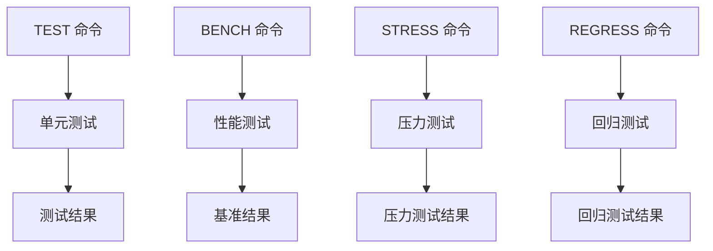

**图表来源**
- [mus4.ino](file://mus4/mus4/mus4.ino#L153-L200)
- [mus4.ino](file://mus4/mus4/mus4.ino#L355-L378)

**章节来源**
- [mus4.ino](file://mus4/mus4/mus4.ino#L153-L200)
- [mus4.ino](file://mus4/mus4/mus4.ino#L355-L378)

### 性能监控

**更新** 系统提供了完整的性能监控机制，新增了测试命令的性能统计：

- **帧计数器**：统计成功接收的指令数量
- **错误计数器**：记录各种类型的错误数量
- **溢出检测**：监控缓冲区溢出情况
- **实时反馈**：通过 ACK/NACK 指令提供即时响应
- **测试统计**：记录测试命令的执行结果和性能指标

## 结论

**更新** 通信协议模块展现了优秀的工程设计，经过本次更新后具有以下突出特点：

### 技术优势

1. **简洁高效**：采用极简的协议格式，易于理解和实现
2. **安全可靠**：多重验证机制确保数据传输的准确性
3. **实时性强**：非阻塞设计满足实时控制需求
4. **易于维护**：模块化设计便于调试和升级
5. **测试完备**：内置完整的测试命令系统
6. **反馈及时**：双向确认机制提供即时响应

### 设计亮点

- **双串口冗余**：提供多种通信途径，增强系统可靠性
- **智能缓冲管理**：完善的错误处理和恢复机制
- **性能监控**：内置的统计和诊断功能
- **兼容性强**：支持标准的串口通信协议
- **可扩展性**：测试命令系统为未来功能扩展奠定基础

### 改进建议

虽然现有设计已经相当完善，但仍有一些潜在的改进方向：

1. **协议扩展**：可以考虑支持更复杂的指令格式
2. **加密机制**：在需要安全性的场景下可考虑加入数据加密
3. **多语言支持**：可以扩展支持不同的数据格式
4. **网络协议**：未来可考虑支持 Wi-Fi 或蓝牙等无线通信
5. **测试自动化**：可以考虑将测试命令集成到自动化测试框架中

**更新** 该通信协议模块经过本次更新后，为 MUS4 自动驾驶系统提供了更加安全、可靠和易维护的指令传输基础，是整个控制系统的重要支撑组件。