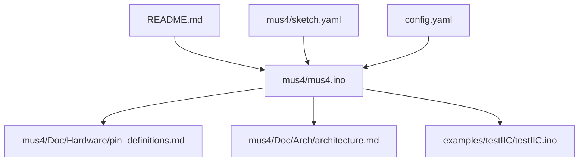
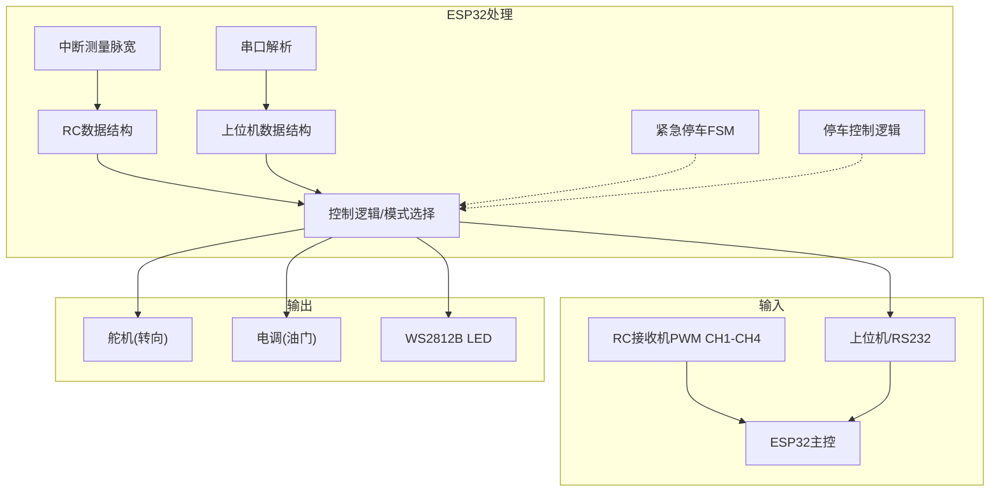
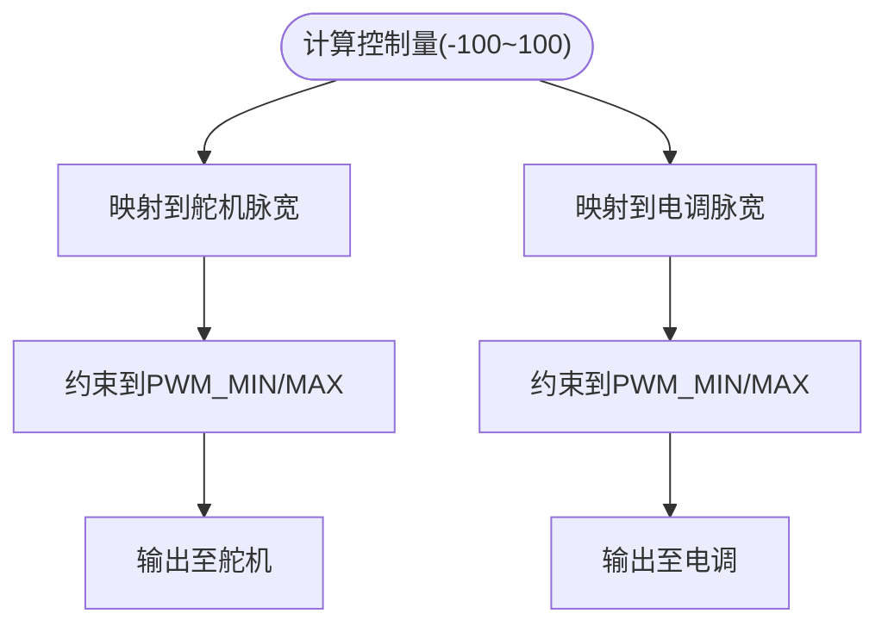
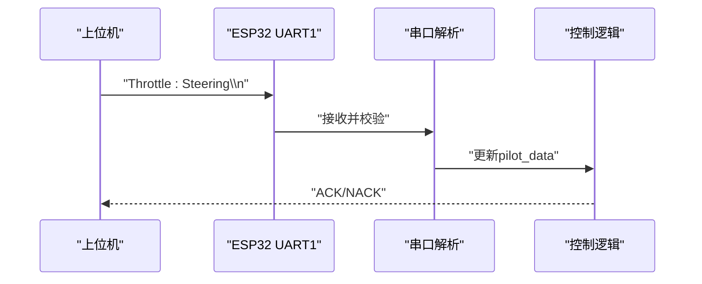
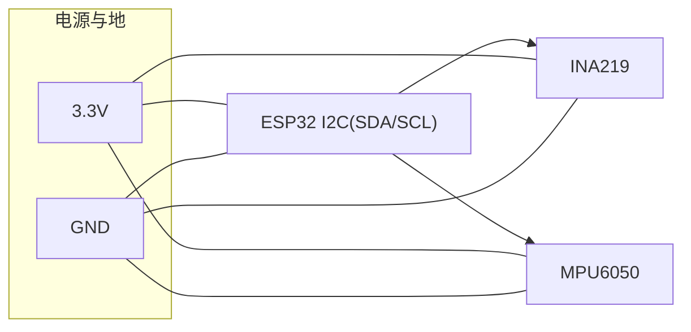
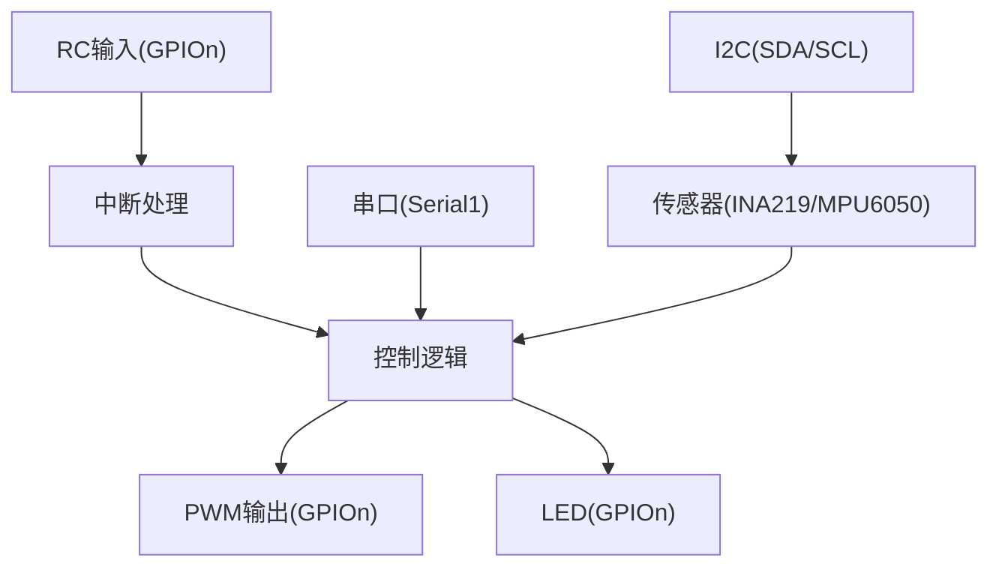

# PCB布局与布线

<cite>
**本文引用的文件**
- [README.md](file://README.md)
- [mus4.ino](file://mus4/mus4.ino)
- [pin_definitions.md](file://mus4/Doc/Hardware/pin_definitions.md)
- [architecture.md](file://mus4/Doc/Arch/architecture.md)
- [DevNote.md](file://mus4/Doc/README/DevNote.md)
- [testIIC.ino](file://examples/testIIC/testIIC.ino)
- [sketch.yaml](file://mus4/sketch.yaml)
- [config.yaml](file://config.yaml)
</cite>

## 目录
1. [简介](#简介)
2. [项目结构](#项目结构)
3. [核心组件](#核心组件)
4. [架构总览](#架构总览)
5. [详细组件分析](#详细组件分析)
6. [依赖关系分析](#依赖关系分析)
7. [性能考量](#性能考量)
8. [故障排查指南](#故障排查指南)
9. [结论](#结论)
10. [附录](#附录)

## 简介
本文件面向MUS4项目（基于ESP32的自动驾驶小车控制板）的PCB布局与布线设计，围绕MUS4-v2.3 PCB版本，结合固件与硬件文档，系统阐述物理布局、走线设计、信号完整性优化、高频信号处理、电源去耦与噪声抑制、层叠结构、阻抗控制与EMI防护、布线规则、过孔设计与热管理等关键主题。目标是帮助硬件工程师与PCB设计人员在满足实时控制与通信需求的同时，获得稳定可靠的高频与低噪声性能。

## 项目结构
- 顶层README提供项目概述与背景。
- 固件位于mus4/mus4.ino，定义了输入/输出引脚、通信协议、控制逻辑与关键常量。
- 硬件文档位于mus4/Doc/Hardware/pin_definitions.md，明确引脚定义、连接关系与电气特性。
- 架构文档位于mus4/Doc/Arch/architecture.md，描述系统数据流与控制流程。
- 示例工程examples/testIIC/testIIC.ino演示I2C总线与传感器连接，有助于理解I2C布线与去耦要求。
- 开发配置文件sketch.yaml与config.yaml用于开发环境与串口配置。

图表来源
- [README.md](file://README.md#L1-L39)
- [mus4.ino](file://mus4/mus4.ino#L1-L120)
- [pin_definitions.md](file://mus4/Doc/Hardware/pin_definitions.md#L1-L225)
- [architecture.md](file://mus4/Doc/Arch/architecture.md#L1-L245)
- [testIIC.ino](file://examples/testIIC/testIIC.ino#L1-L120)
- [sketch.yaml](file://mus4/sketch.yaml#L1-L3)
- [config.yaml](file://config.yaml#L1-L13)

章节来源
- [README.md](file://README.md#L1-L39)
- [mus4.ino](file://mus4/mus4.ino#L1-L120)
- [pin_definitions.md](file://mus4/Doc/Hardware/pin_definitions.md#L1-L225)
- [architecture.md](file://mus4/Doc/Arch/architecture.md#L1-L245)
- [testIIC.ino](file://examples/testIIC/testIIC.ino#L1-L120)
- [sketch.yaml](file://mus4/sketch.yaml#L1-L3)
- [config.yaml](file://config.yaml#L1-L13)

## 核心组件
- 主控芯片：ESP32（DFRobot Firebeetle2 ESP32E，FQBN为esp32:esp32:dfrobot_firebeetle2_esp32e）
- 输入通道：RC接收机PWM输入（CH1-CH4），上位机串口指令（Serial/Serial1）
- 执行器输出：舵机（转向）与电调（油门）PWM输出
- 通信接口：I2C（SDA/SCL）、RS232/UART（GPIO 16/17）
- 传感器：INA219（电源监测）、MPU6050（IMU）
- 状态指示：WS2812B RGB LED（GPIO 5）

章节来源
- [mus4.ino](file://mus4/mus4.ino#L24-L68)
- [pin_definitions.md](file://mus4/Doc/Hardware/pin_definitions.md#L13-L28)
- [architecture.md](file://mus4/Doc/Arch/architecture.md#L18-L45)

## 架构总览
系统采用“输入采集—控制决策—执行输出—状态反馈”的闭环架构。RC与上位机输入经中断/串口解析后融合，根据驾驶模式映射到PWM输出；同时通过I2C读取传感器数据，驱动LED状态指示与串口反馈。

图表来源
- [architecture.md](file://mus4/Doc/Arch/architecture.md#L18-L45)
- [mus4.ino](file://mus4/mus4.ino#L414-L431)
- [pin_definitions.md](file://mus4/Doc/Hardware/pin_definitions.md#L115-L181)

章节来源
- [architecture.md](file://mus4/Doc/Arch/architecture.md#L18-L45)
- [mus4.ino](file://mus4/mus4.ino#L414-L431)
- [pin_definitions.md](file://mus4/Doc/Hardware/pin_definitions.md#L115-L181)

## 详细组件分析

### 1) RC输入与PWM测量（GPIO 36/39/34/26）
- 引脚类型：GPIO 34/36/39为仅输入引脚，适合高阻抗信号采集。
- 中断方式：使用CHANGE触发，记录上升沿与下降沿时间差，计算脉宽。
- 信号特点：PWM脉宽范围与映射关系在固件中定义，需保证布线短且去耦良好，避免高频噪声干扰。

图表来源
- [mus4.ino](file://mus4/mus4.ino#L414-L426)
- [pin_definitions.md](file://mus4/Doc/Hardware/pin_definitions.md#L34-L46)

章节来源
- [mus4.ino](file://mus4/mus4.ino#L414-L431)
- [pin_definitions.md](file://mus4/Doc/Hardware/pin_definitions.md#L34-L46)

### 2) 执行器PWM输出（GPIO 23/25）
- 输出类型：使用ledc库生成50Hz PWM，分辨率为14bit。
- 舵机与电调映射：分别设定中位与范围，配合constrain限制，确保安全输出。
- 布线要点：执行器线缆较长，需注意地回路与去耦电容，避免尖峰与振荡。

图表来源
- [mus4.ino](file://mus4/mus4.ino#L440-L447)
- [mus4.ino](file://mus4/mus4.ino#L193-L199)
- [pin_definitions.md](file://mus4/Doc/Hardware/pin_definitions.md#L47-L62)

章节来源
- [mus4.ino](file://mus4/mus4.ino#L440-L447)
- [mus4.ino](file://mus4/mus4.ino#L193-L199)
- [pin_definitions.md](file://mus4/Doc/Hardware/pin_definitions.md#L47-L62)

### 3) 串行通信（GPIO 16/17，波特率115200）
- 接口：RS232/UART，使用Serial1对象，配置为115200bps。
- 布线要点：差分阻抗匹配、差分对紧邻布线、终端电阻（如适用）、地平面完整。

图表来源
- [mus4.ino](file://mus4/mus4.ino#L344-L411)
- [DevNote.md](file://mus4/Doc/README/DevNote.md#L24-L29)
- [pin_definitions.md](file://mus4/Doc/Hardware/pin_definitions.md#L63-L73)

章节来源
- [mus4.ino](file://mus4/mus4.ino#L344-L411)
- [DevNote.md](file://mus4/Doc/README/DevNote.md#L24-L29)
- [pin_definitions.md](file://mus4/Doc/Hardware/pin_definitions.md#L63-L73)

### 4) I2C总线（GPIO 21/22，100kHz）
- 设备：INA219（电源监测）、MPU6050（IMU）。
- 布线要点：SDA/SCL差分对短且等长，上拉电阻靠近主控，地平面完整，避免与高频信号平行走线。

图表来源
- [testIIC.ino](file://examples/testIIC/testIIC.ino#L17-L19)
- [mus4.ino](file://mus4/mus4.ino#L24-L28)
- [pin_definitions.md](file://mus4/Doc/Hardware/pin_definitions.md#L96-L101)

章节来源
- [testIIC.ino](file://examples/testIIC/testIIC.ino#L17-L19)
- [mus4.ino](file://mus4/mus4.ino#L24-L28)
- [pin_definitions.md](file://mus4/Doc/Hardware/pin_definitions.md#L96-L101)

### 5) LED指示（GPIO 5，WS2812B）
- 用途：显示驾驶模式与紧急停车状态。
- 布线要点：数据线尽量短，避免与高频信号平行走线；必要时增加RC滤波。

章节来源
- [pin_definitions.md](file://mus4/Doc/Hardware/pin_definitions.md#L74-L86)
- [mus4.ino](file://mus4/mus4.ino#L241-L274)

### 6) UART选择控制（GPIO 12）
- 用途：控制UART路由。
- 布线要点：保持走线短且远离高频与大电流回路。

章节来源
- [pin_definitions.md](file://mus4/Doc/Hardware/pin_definitions.md#L87-L95)

## 依赖关系分析
- 引脚依赖：RC输入依赖GPIO 34/36/39/26，执行器输出依赖GPIO 23/25，串口依赖GPIO 16/17，I2C依赖GPIO 21/22，LED依赖GPIO 5，UART选择依赖GPIO 12。
- 时序依赖：RC中断与主循环调度存在时间窗口，需确保中断优先级与处理耗时可控。
- 通信依赖：I2C与串口均为单主机多从机拓扑，需注意地址冲突与总线仲裁。

图表来源
- [mus4.ino](file://mus4/mus4.ino#L414-L431)
- [mus4.ino](file://mus4/mus4.ino#L344-L411)
- [mus4.ino](file://mus4/mus4.ino#L24-L28)
- [pin_definitions.md](file://mus4/Doc/Hardware/pin_definitions.md#L13-L28)

章节来源
- [mus4.ino](file://mus4/mus4.ino#L414-L431)
- [mus4.ino](file://mus4/mus4.ino#L344-L411)
- [mus4.ino](file://mus4/mus4.ino#L24-L28)
- [pin_definitions.md](file://mus4/Doc/Hardware/pin_definitions.md#L13-L28)

## 性能考量
- 高频信号处理
  - RC输入采用中断测量脉宽，布线需短且去耦，避免抖动与噪声。
  - 执行器PWM为50Hz，占空比变化较慢，但需注意死区与同步问题。
- 电源去耦与噪声抑制
  - I2C与传感器侧建议在VCC与GND之间放置0.1μF陶瓷电容，靠近芯片电源引脚。
  - 电机与电调回路需独立去耦，避免地环路噪声耦合到控制回路。
- 信号完整性
  - 串口差分对需短且等长，阻抗控制在90±15%范围内（典型100Ω）。
  - I2C总线采用开漏输出，需外加上拉电阻，阻值根据总线电容与速度确定。
- 层叠结构与阻抗控制
  - 建议采用4层板：顶层信号、第二层地平面、第三层电源平面、底层信号。
  - 顶层与底层信号线阻抗控制：差分100Ω±10%，单端50Ω±10%。
- EMI防护
  - 采用星形或单点接地，避免形成地环路。
  - 高频与大电流回路尽量短且靠近地平面，减少环路面积。
  - 在敏感信号线（如I2C、LED数据线）加RC滤波或磁珠。
- 过孔设计
  - 过孔数量与分布应均匀，避免阻抗不连续；建议使用小尺寸过孔并尽量减少数量。
- 热管理
  - ESP32与功率器件（电调/电机）应分开布局，避免热耦合。
  - 电源走线宽度满足电流密度与温升要求，必要时增加散热过孔。

## 故障排查指南
- I2C通信异常
  - 检查上拉电阻与总线电容匹配，确认地址扫描结果。
  - 使用示波器观察SDA/SCL波形，排除毛刺与欠压。
- 串口通信异常
  - 校验波特率一致性（115200），检查差分对布线与阻抗。
  - 使用USB转RS232模块时，确认电平兼容与地线共地。
- RC输入不稳定
  - 确认GPIO 34/36/39为输入模式，接收机信号电平与ESP32输入电平匹配。
  - 检查外部RC保护（如限流电阻）与屏蔽层连接。
- 执行器响应异常
  - 检查PWM映射范围与constrain限制，确认负载（舵机/电调）兼容性。
- LED状态异常
  - 确认WS2812B数据线走线短且无串扰，必要时增加RC滤波。

章节来源
- [testIIC.ino](file://examples/testIIC/testIIC.ino#L125-L224)
- [DevNote.md](file://mus4/Doc/README/DevNote.md#L98-L101)
- [pin_definitions.md](file://mus4/Doc/Hardware/pin_definitions.md#L200-L209)

## 结论
MUS4-v2.3 PCB在引脚与功能上已清晰定义，结合固件的控制逻辑与通信协议，可指导PCB布局与布线的关键设计要点。通过合理的层叠结构、阻抗控制、去耦与EMI防护，以及严格的布线规则与过孔设计，可在保证实时控制性能的同时，提升系统的可靠性与抗干扰能力。建议在原型验证阶段重点测试I2C与串口通信、RC输入稳定性与执行器响应，以尽早暴露潜在问题。

## 附录
- 开发环境与串口配置
  - FQBN：esp32:esp32:dfrobot_firebeetle2_esp32e
  - 端口：COM9（Windows）或/dev/ttyS4（Linux）
  - 波特率：115200
- 关键常量（PWM/时间/模式）
  - PWM最小/最大计数、中位与范围、模式常量、停车/解锁时间、紧急停车状态机时间常数等

章节来源
- [sketch.yaml](file://mus4/sketch.yaml#L1-L3)
- [config.yaml](file://config.yaml#L1-L13)
- [DevNote.md](file://mus4/Doc/README/DevNote.md#L103-L117)
- [architecture.md](file://mus4/Doc/Arch/architecture.md#L227-L240)