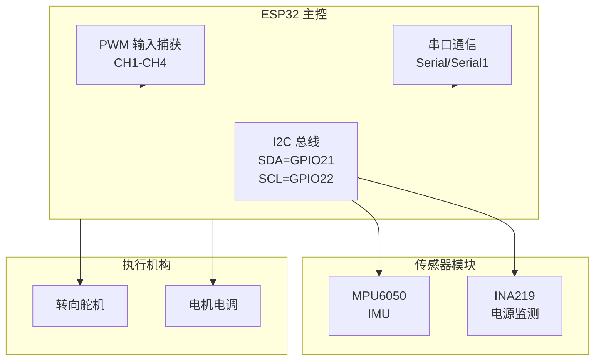
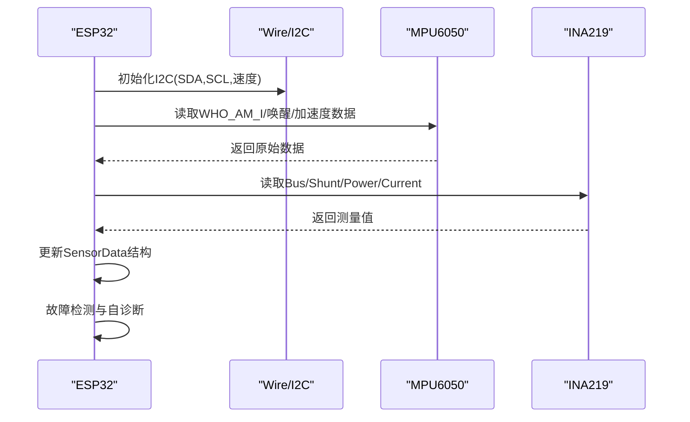
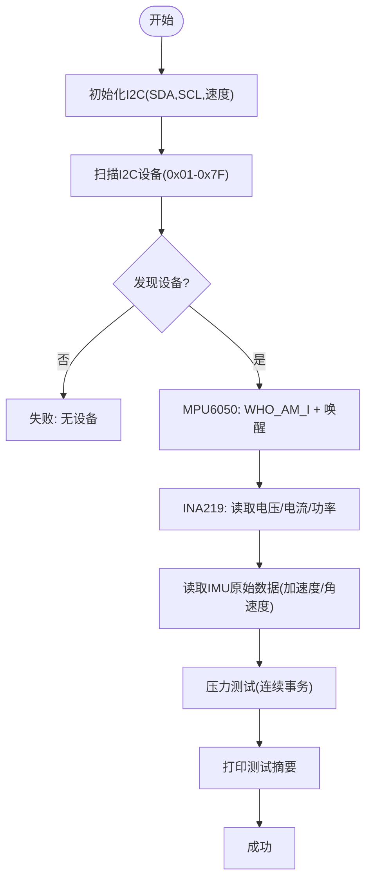
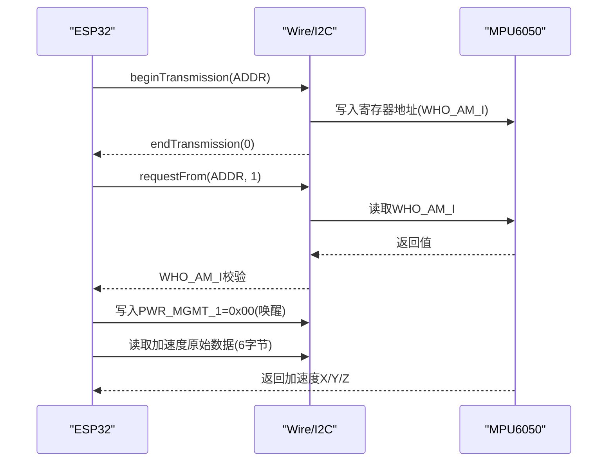
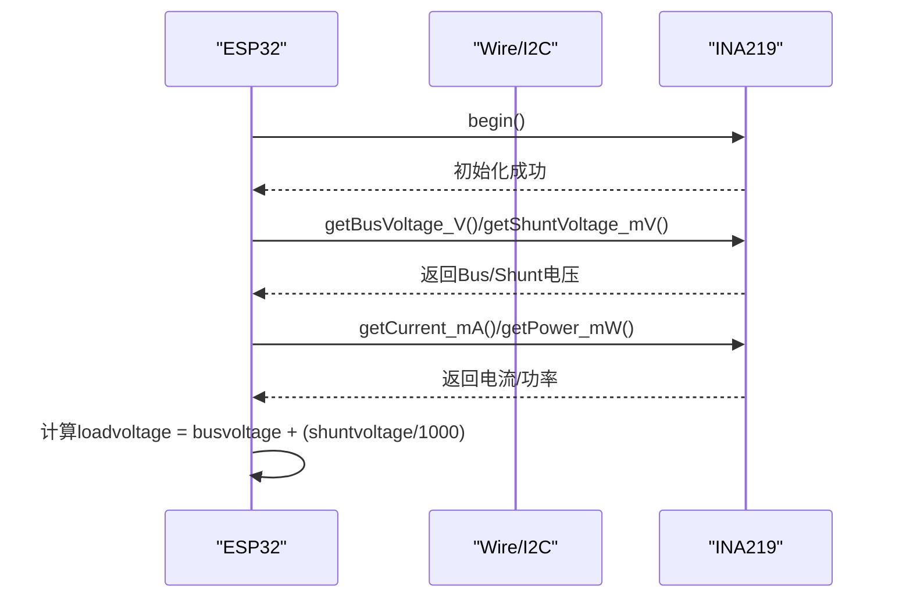
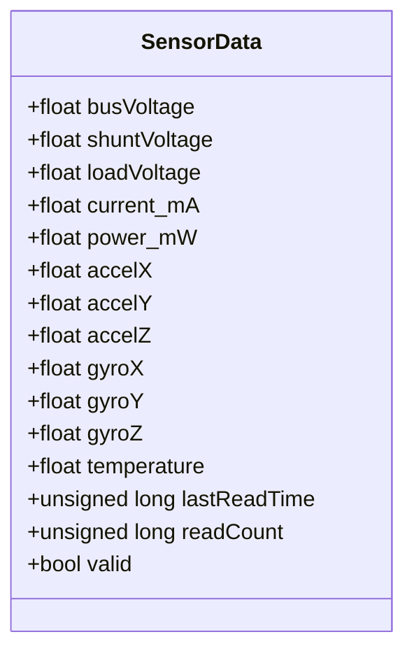
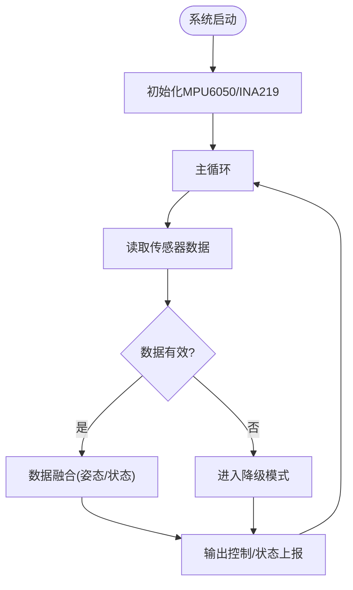
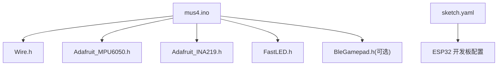

# 传感器模块设计

<cite>
**本文引用的文件**
- [mus4.ino](file://mus4/mus4.ino)
- [testIIC.ino](file://examples/testIIC/testIIC.ino)
- [getcurrent.ino](file://examples/getcurrent/getcurrent.ino)
- [pin_definitions.md](file://mus4/Doc/Hardware/pin_definitions.md)
- [DevNote.md](file://mus4/Doc/README/DevNote.md)
- [architecture.md](file://mus4/Doc/Arch/architecture.md)
- [sketch.yaml](file://mus4/sketch.yaml)
</cite>

## 目录
1. [简介](#简介)
2. [项目结构](#项目结构)
3. [核心组件](#核心组件)
4. [架构总览](#架构总览)
5. [详细组件分析](#详细组件分析)
6. [依赖关系分析](#依赖关系分析)
7. [性能考量](#性能考量)
8. [故障排查指南](#故障排查指南)
9. [结论](#结论)
10. [附录](#附录)

## 简介
本设计文档聚焦于MUS4项目的传感器模块，重点覆盖MPU6050惯性导航模块与INA219电源监测模块的硬件设计、I2C通信实现、传感器校准与数据处理流程、布局与EMI防护建议、选型指南与精度分析、误差补偿方法，以及多传感器数据融合、故障检测与自诊断功能的设计思路与实现要点。

## 项目结构
- 硬件平台：ESP32（DFRobot FireBeetle 2 ESP32E）
- 通信接口：I2C（SDA=GPIO21，SCL=GPIO22），支持100kHz/400kHz/1MHz速度模式
- 传感器：MPU6050（IMU）与INA219（电源监测）
- 软件框架：Arduino + Adafruit库族（Adafruit_MPU6050、Adafruit_INA219）

**图表来源**
- [pin_definitions.md](file://mus4/Doc/Hardware/pin_definitions.md#L115-L181)
- [architecture.md](file://mus4/Doc/Arch/architecture.md#L18-L45)

**章节来源**
- [pin_definitions.md](file://mus4/Doc/Hardware/pin_definitions.md#L1-L225)
- [architecture.md](file://mus4/Doc/Arch/architecture.md#L1-L245)

## 核心组件
- I2C总线与引脚定义：SDA=GPIO21，SCL=GPIO22，支持100kHz/400kHz/1MHz速度模式
- MPU6050：加速度计、陀螺仪与温度传感器，通过I2C读取原始数据
- INA219：电压、电流、功率监测，通过I2C读取测量值
- 传感器数据结构：统一存储bus电压、分流电压、负载电压、电流、功率、三轴加速度、三轴角速度、温度等字段
- 采样与更新策略：传感器数据每秒更新一次，RC数据约60Hz更新，UI刷新约60Hz

**章节来源**
- [mus4.ino](file://mus4/mus4.ino#L66-L68)
- [mus4.ino](file://mus4/mus4.ino#L208-L220)
- [mus4.ino](file://mus4/mus4.ino#L109-L111)

## 架构总览
传感器模块位于MCU与执行机构之间，承担数据采集、预处理与健康状态上报职责。系统通过I2C与传感器通信，结合RC输入与上位机指令进行融合控制。

**图表来源**
- [testIIC.ino](file://examples/testIIC/testIIC.ino#L101-L118)
- [mus4.ino](file://mus4/mus4.ino#L871-L983)

**章节来源**
- [testIIC.ino](file://examples/testIIC/testIIC.ino#L101-L118)
- [mus4.ino](file://mus4/mus4.ino#L871-L983)

## 详细组件分析

### I2C通信协议实现
- 引脚与速度：SDA=GPIO21，SCL=GPIO22；支持100kHz/400kHz/1MHz
- 设备扫描：遍历0x01-0x7F地址空间，识别MPU6050/INA219等设备
- 读写测试：支持单字节/多字节读写，错误码诊断
- MPU6050唤醒与WHO_AM_I校验：解除睡眠并验证器件身份
- 压力测试：连续事务测试，评估稳定性

**图表来源**
- [testIIC.ino](file://examples/testIIC/testIIC.ino#L125-L224)
- [testIIC.ino](file://examples/testIIC/testIIC.ino#L317-L465)
- [testIIC.ino](file://examples/testIIC/testIIC.ino#L471-L521)

**章节来源**
- [testIIC.ino](file://examples/testIIC/testIIC.ino#L17-L30)
- [testIIC.ino](file://examples/testIIC/testIIC.ino#L125-L224)
- [testIIC.ino](file://examples/testIIC/testIIC.ino#L317-L465)
- [testIIC.ino](file://examples/testIIC/testIIC.ino#L471-L521)

### MPU6050惯性导航模块
- 硬件连接：I2C数据线连接GPIO21，时钟线连接GPIO22
- 功能特性：三轴加速度、三轴角速度、温度
- 数据读取：通过寄存器地址读取原始数据，组合为16位值
- 校准与验证：WHO_AM_I寄存器校验，唤醒后读取加速度数据，检查非全零/全一异常
- 精度与误差：需结合具体应用场景进行静态/动态校准，建议采用零点偏移与尺度因子标定

**图表来源**
- [testIIC.ino](file://examples/testIIC/testIIC.ino#L317-L420)

**章节来源**
- [testIIC.ino](file://examples/testIIC/testIIC.ino#L31-L37)
- [testIIC.ino](file://examples/testIIC/testIIC.ino#L317-L420)

### INA219电源监测模块
- 硬件连接：I2C数据线连接GPIO21，时钟线连接GPIO22
- 功能特性：母线电压、分流电压、电流、功率
- 数据读取：通过库函数读取各测量值，计算负载电压
- 校准与精度：可通过setCalibration系列函数选择不同量程以提升精度

**图表来源**
- [getcurrent.ino](file://examples/getcurrent/getcurrent.ino#L20-L30)
- [getcurrent.ino](file://examples/getcurrent/getcurrent.ino#L32-L54)

**章节来源**
- [getcurrent.ino](file://examples/getcurrent/getcurrent.ino#L1-L55)

### 传感器数据结构与处理流程
- 数据结构：包含bus电压、分流电压、负载电压、电流、功率、三轴加速度、三轴角速度、温度、最后读取时间、读取计数、有效性标记
- 更新策略：传感器数据每秒更新一次，UI按需打印，避免频繁IO
- 有效性标记：用于故障检测与降级模式判断

**图表来源**
- [mus4.ino](file://mus4/mus4.ino#L208-L220)

**章节来源**
- [mus4.ino](file://mus4/mus4.ino#L208-L220)
- [mus4.ino](file://mus4/mus4.ino#L656-L684)

### 传感器布局设计与信号完整性
- 布局建议：
  - I2C走线尽量短且靠近芯片，减少环路面积
  - SDA/SCL走线避免邻近高频信号线，必要时增加地平面屏蔽
  - 电源去耦：每个I2C器件VCC/V+与GND间放置0.1μF陶瓷电容
- EMI防护：
  - 使用上拉电阻（推荐4.7kΩ或10kΩ）保证上电状态稳定
  - 在I2C线两端并联小电容（如4.7pF）抑制高频噪声
  - 若环境干扰严重，考虑降低I2C速度至100kHz
- 接地：
  - 采用单点接地或星形接地，避免地环路耦合

[本节为通用设计建议，不直接分析具体文件]

### 传感器选型指南与精度分析
- 选型原则：
  - MPU6050：低成本、低功耗、I2C接口，适合一般导航与姿态估计
  - INA219：高侧/高底端均可测，支持多种量程，精度与分辨率可调
- 精度分析：
  - MPU6050：加速度±2/±4/±8/±16g可选，陀螺±250/±500/±1000/±2000°/s可选；需结合温度与静态校准
  - INA219：可通过setCalibration选择16V/400mA或32V/2A量程，提高小电流测量精度
- 误差补偿：
  - 静态校准：零点偏移（加速度/角速度）与尺度因子标定
  - 动态校准：在运动过程中估计并补偿漂移
  - 多传感器融合：结合互补滤波或卡尔曼滤波进行姿态估计

**章节来源**
- [getcurrent.ino](file://examples/getcurrent/getcurrent.ino#L17-L27)

### 多传感器数据融合、故障检测与自诊断
- 数据融合：
  - 使用互补滤波或扩展卡尔曼滤波融合加速度与角速度，估计姿态角
  - 将电源监测数据纳入状态估计，辅助判断系统健康状况
- 故障检测：
  - I2C错误码诊断：根据返回码区分总线占用、地址无效、读写失败等
  - 传感器有效性标记：若读取失败则valid=false，触发降级模式
- 自诊断：
  - 降级模式触发条件：任一传感器无效、UI周期过长等
  - LED状态提示：降级模式下闪烁提示

**图表来源**
- [mus4.ino](file://mus4/mus4.ino#L290-L305)
- [mus4.ino](file://mus4/mus4.ino#L656-L684)

**章节来源**
- [mus4.ino](file://mus4/mus4.ino#L290-L305)
- [mus4.ino](file://mus4/mus4.ino#L656-L684)

## 依赖关系分析
- 硬件依赖：ESP32的GPIO21/22用于I2C；GPIO34/36/39仅输入，用于RC PWM采集
- 库依赖：Wire、Adafruit_MPU6050、Adafruit_INA219、FastLED、BleGamepad（可选）
- 平台配置：sketch.yaml指定开发板与端口

**图表来源**
- [mus4.ino](file://mus4/mus4.ino#L24-L34)
- [sketch.yaml](file://mus4/sketch.yaml#L1-L3)

**章节来源**
- [mus4.ino](file://mus4/mus4.ino#L24-L34)
- [sketch.yaml](file://mus4/sketch.yaml#L1-L3)

## 性能考量
- I2C速度：在保证可靠性的前提下优先使用400kHz；若存在干扰，降至100kHz
- 更新频率：传感器数据1Hz更新已足够；RC与UI分别按各自需求更新
- 内存与CPU：避免在中断中进行复杂运算，仅做数据采集与简单映射
- 降级策略：当UI周期过长或传感器失效时进入降级模式，保障基本功能

[本节提供通用指导，不直接分析具体文件]

## 故障排查指南
- I2C设备扫描无响应：
  - 检查SDA/SCL引脚连接与上拉电阻
  - 降低I2C速度至100kHz
- MPU6050读取失败：
  - 确认地址（0x68/0x69）与PWR_MGMT_1寄存器已正确唤醒
  - 检查供电与去耦电容
- INA219读数异常：
  - 更换setCalibration量程，提高小电流测量精度
  - 检查分流电阻与布线阻抗
- 传感器数据无效：
  - 检查ina219Data.valid与mpu6050Data.valid标记
  - 启用降级模式并记录降级原因

**章节来源**
- [testIIC.ino](file://examples/testIIC/testIIC.ino#L125-L224)
- [testIIC.ino](file://examples/testIIC/testIIC.ino#L317-L465)
- [getcurrent.ino](file://examples/getcurrent/getcurrent.ino#L17-L27)
- [mus4.ino](file://mus4/mus4.ino#L290-L305)

## 结论
MUS4项目的传感器模块以I2C为核心，结合MPU6050与INA219实现了可靠的导航与电源监测能力。通过规范化的初始化、设备扫描与读写测试，配合降级模式与自诊断机制，系统在复杂环境中具备良好的鲁棒性。建议在实际部署中进一步完善静态/动态校准与多传感器融合算法，以提升定位精度与系统稳定性。

## 附录
- 开发环境：ESP32 DF Robot FireBeetle 2，Arduino CLI
- 串口协议：T:S\n，波特率115200
- 引脚定义：SDA=GPIO21，SCL=GPIO22，RC输入GPIO34/36/39/26，执行器输出GPIO23/25

**章节来源**
- [DevNote.md](file://mus4/Doc/README/DevNote.md#L15-L30)
- [pin_definitions.md](file://mus4/Doc/Hardware/pin_definitions.md#L17-L28)
- [sketch.yaml](file://mus4/sketch.yaml#L1-L3)