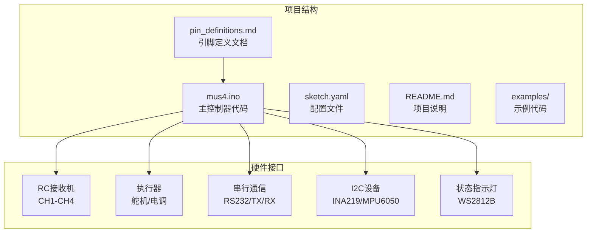
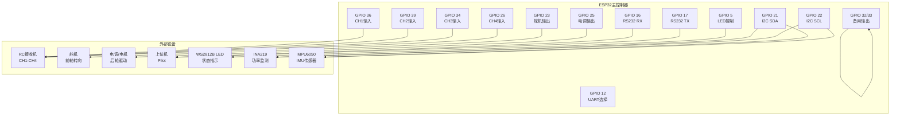
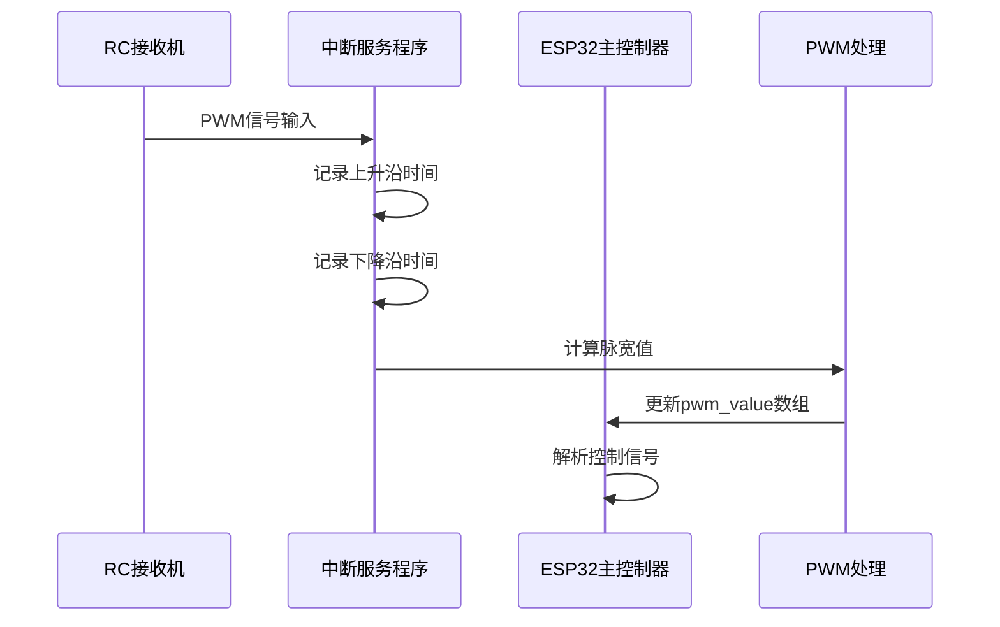
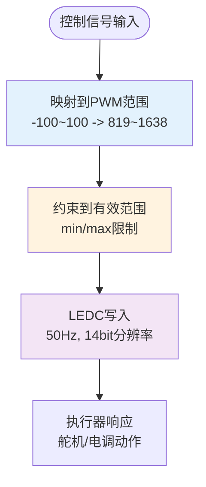
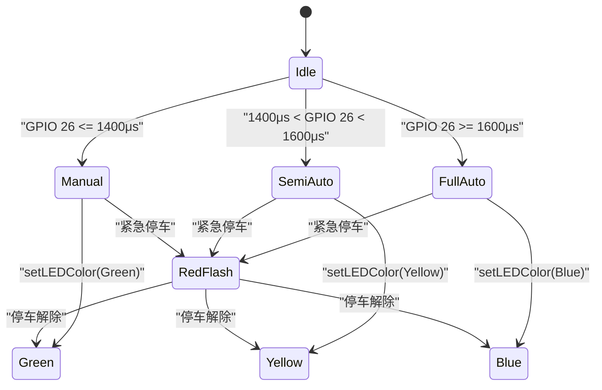
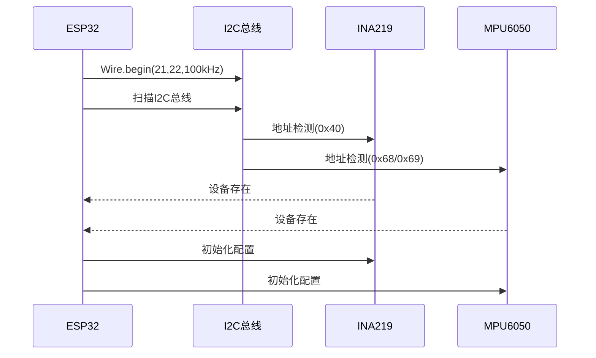
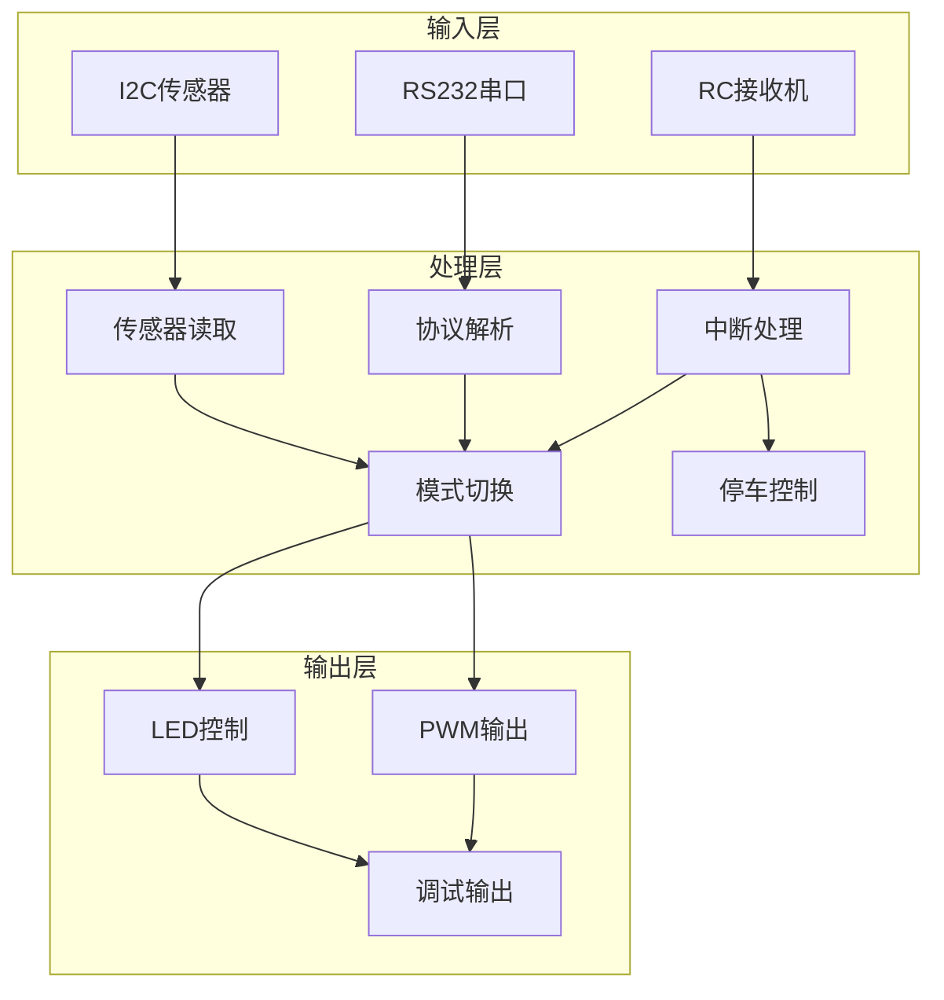

# 引脚定义与分配

<cite>
**本文引用的文件**
- [pin_definitions.md](file://mus4/Doc/Hardware/pin_definitions.md)
- [mus4.ino](file://mus4/mus4.ino)
- [sketch.yaml](file://mus4/sketch.yaml)
- [README.md](file://README.md)
</cite>

## 目录
1. [简介](#简介)
2. [项目结构](#项目结构)
3. [核心组件](#核心组件)
4. [架构概览](#架构概览)
5. [详细组件分析](#详细组件分析)
6. [依赖关系分析](#依赖关系分析)
7. [性能考虑](#性能考虑)
8. [故障排除指南](#故障排除指南)
9. [结论](#结论)

## 简介
本文档基于MUS4项目的引脚定义文件，详细说明了ESP32微控制器平台上各个GPIO引脚的功能分配、电气特性与硬件连接方式。该系统集成了RC遥控接收机信号采集、电机/舵机PWM控制、上位机串行通信以及状态指示灯等功能，适用于自动驾驶小车控制系统。

## 项目结构
MUS4项目采用模块化设计，主要包含以下关键文件：
- 引脚定义文档：详细描述各GPIO引脚的功能与配置
- 主控制器代码：实现完整的控制逻辑与硬件接口
- 配置文件：定义开发环境与编译参数
- 示例代码：提供I2C和电流检测的基本示例

**图表来源**
- [pin_definitions.md](file://mus4/Doc/Hardware/pin_definitions.md#L1-L225)
- [mus4.ino](file://mus4/mus4.ino#L1-L1290)

**章节来源**
- [pin_definitions.md](file://mus4/Doc/Hardware/pin_definitions.md#L1-L225)
- [mus4.ino](file://mus4/mus4.ino#L1-L1290)
- [sketch.yaml](file://mus4/sketch.yaml#L1-L3)

## 核心组件
根据引脚定义文档，系统主要包含以下核心硬件组件：

### RC接收机输入通道
- **GPIO 36 (CH1)**：连接接收机方向通道，对应程序中的`CH_STEERING`
- **GPIO 39 (CH2)**：连接接收机油门通道，对应程序中的`CH_THROTTLE`
- **GPIO 34 (CH3)**：连接接收机辅助通道，用于停车/解锁控制，对应`CH_PARK`
- **GPIO 26 (CH4)**：连接接收机辅助通道，用于驾驶模式切换，对应`CH_MODE`

### 执行器输出通道
- **GPIO 23 (Steering)**：连接舵机信号线
- **GPIO 25 (Throttle)**：连接电调(ESC)信号线
- **GPIO 32/33 (备用)**：预留的PWM输出通道

### 通信接口
- **GPIO 16/17**：RS232串行通信接口
- **GPIO 12**：UART选择控制引脚
- **GPIO 21/22**：I2C总线接口

### 状态指示
- **GPIO 5**：WS2812B可编程RGB LED数据引脚

**章节来源**
- [pin_definitions.md](file://mus4/Doc/Hardware/pin_definitions.md#L13-L28)
- [mus4.ino](file://mus4/mus4.ino#L41-L68)

## 架构概览
系统采用ESP32作为主控制器，通过多种接口与外部设备进行交互：

**图表来源**
- [pin_definitions.md](file://mus4/Doc/Hardware/pin_definitions.md#L115-L181)
- [mus4.ino](file://mus4/mus4.ino#L1104-L1150)

## 详细组件分析

### RC接收机输入通道分析
RC接收机输入通道是系统的核心信号采集部分，采用中断方式处理PWM信号。

#### 硬件连接特性
- **输入引脚限制**：GPIO 34、36、39为仅输入引脚，内部无上拉/下拉电阻
- **信号电平**：接收机输出5V PWM信号，ESP32输入引脚可直接兼容
- **抗干扰设计**：建议串联1kΩ电阻保护，避免信号干扰

#### 软件配置机制

**图表来源**
- [mus4.ino](file://mus4/mus4.ino#L414-L433)
- [mus4.ino](file://mus4/mus4.ino#L1126-L1131)

#### 工作原理详解
1. **中断触发**：每个输入引脚配置为CHANGE触发模式
2. **时间测量**：使用`micros()`精确记录脉冲边缘时间
3. **脉宽计算**：通过上升沿与下降沿时间差计算PWM脉宽
4. **信号解析**：将脉宽值映射到控制范围(-100~100)

**章节来源**
- [pin_definitions.md](file://mus4/Doc/Hardware/pin_definitions.md#L34-L46)
- [mus4.ino](file://mus4/mus4.ino#L414-L433)

### 执行器输出通道分析
执行器输出采用ESP32的LEDC(PWM)功能，实现精确的舵机和电调控制。

#### PWM参数配置
| 参数 | 舵机(Steering) | 电调(Throttle) |
|------|----------------|----------------|
| 中位值 | 1250μs | 1229μs |
| 范围 | ±440μs | ±390μs |
| 最小限制 | 819 | 819 |
| 最大限制 | 1638 | 1638 |
| 频率 | 50Hz | 50Hz |
| 分辨率 | 14bit | 14bit |

#### 硬件连接方式
- **舵机连接**：PWM信号线连接至GPIO 23，电源线连接至独立电源
- **电调连接**：PWM信号线连接至GPIO 25，电源线连接至电池
- **保护措施**：避免直接从ESP32供电给舵机和电机

**图表来源**
- [mus4.ino](file://mus4/mus4.ino#L1269-L1276)
- [mus4.ino](file://mus4/mus4.ino#L440-L447)

**章节来源**
- [pin_definitions.md](file://mus4/Doc/Hardware/pin_definitions.md#L47-L62)
- [mus4.ino](file://mus4/mus4.ino#L1269-L1276)

### 串行通信接口分析
系统提供双路串行通信接口，满足不同应用场景需求。

#### RS232通信配置
- **GPIO 16 (RX)**：接收来自上位机的控制指令
- **GPIO 17 (TX)**：向上位机回传控制状态
- **波特率**：115200 bps
- **数据格式**：8位数据，无校验，1停止位

#### 协议规范
通信协议采用简单的文本格式：
- **指令格式**：`T:S*CS\n`
- **状态格式**：`T:S\n`
- **校验机制**：使用简单的异或校验

#### UART选择控制
- **GPIO 12**：控制UART路由选择
- **默认状态**：输出LOW电平
- **硬件实现**：通过跳线或开关切换

**章节来源**
- [pin_definitions.md](file://mus4/Doc/Hardware/pin_definitions.md#L63-L73)
- [mus4.ino](file://mus4/mus4.ino#L58-L64)

### 状态指示灯分析
系统使用WS2812B可编程RGB LED提供直观的状态反馈。

#### LED控制特性
- **引脚配置**：GPIO 5，单LED配置
- **亮度控制**：最大亮度64/255
- **颜色映射**：
  - 绿色：手动模式(Manual)
  - 黄色：半自动模式(Semi-Auto)
  - 蓝色：全自动模式(Full-Auto)
  - 红色闪烁：紧急停车状态

#### 实现机制

**图表来源**
- [mus4.ino](file://mus4/mus4.ino#L240-L274)
- [mus4.ino](file://mus4/mus4.ino#L1170-L1239)

**章节来源**
- [pin_definitions.md](file://mus4/Doc/Hardware/pin_definitions.md#L74-L86)
- [mus4.ino](file://mus4/mus4.ino#L240-L274)

### I2C接口分析
系统集成I2C总线接口，支持多种传感器设备。

#### I2C配置参数
- **引脚定义**：GPIO 21(SDA)，GPIO 22(SCL)
- **通信速度**：100kHz
- **支持设备**：
  - INA219：电压电流监测
  - MPU6050：六轴运动传感器

#### 设备检测与初始化

**图表来源**
- [mus4.ino](file://mus4/mus4.ino#L1119-L1121)
- [mus4.ino](file://mus4/mus4.ino#L922-L975)

**章节来源**
- [pin_definitions.md](file://mus4/Doc/Hardware/pin_definitions.md#L96-L102)
- [mus4.ino](file://mus4/mus4.ino#L868-L896)

## 依赖关系分析
系统各组件间存在复杂的依赖关系，形成完整的控制链路：

**图表来源**
- [mus4.ino](file://mus4/mus4.ino#L1126-L1131)
- [mus4.ino](file://mus4/mus4.ino#L1152-L1289)

**章节来源**
- [mus4.ino](file://mus4/mus4.ino#L1152-L1289)

## 性能考虑
系统在多个方面进行了性能优化：

### 中断处理优化
- **原子操作**：使用`volatile`关键字确保多线程安全
- **快速响应**：中断服务程序仅记录时间戳，减少处理开销
- **定时更新**：主循环定期读取中断结果，平衡实时性与CPU负载

### PWM输出优化
- **LEDC硬件PWM**：利用ESP32硬件PWM模块，提高精度和稳定性
- **统一频率**：所有PWM输出保持50Hz，确保兼容性
- **范围限制**：通过最小/最大值限制防止过载

### 串行通信优化
- **缓冲区管理**：实现专用的串行缓冲区，支持错误检测
- **协议校验**：采用简单的校验机制，保证数据完整性
- **异步处理**：串行数据读取与主控制流程并行执行

## 故障排除指南

### RC接收机信号问题
**症状**：接收机信号不稳定或读数异常
**可能原因**：
- 输入引脚悬空，无上拉/下拉电阻
- 信号线长度过长，产生干扰
- 接收机供电不稳定

**解决方法**：
1. 确保RC接收机正确供电
2. 使用屏蔽线连接，避免信号干扰
3. 检查接线是否牢固

### PWM输出异常
**症状**：舵机或电调不响应或动作异常
**可能原因**：
- PWM频率不匹配(应为50Hz)
- 脉宽超出有效范围
- 负载电流过大

**解决方法**：
1. 确认PWM频率设置为50Hz
2. 检查脉宽映射范围(819-1638)
3. 验证电源容量是否足够

### 串行通信故障
**症状**：无法与上位机通信
**可能原因**：
- 波特率不匹配
- RS232转换器故障
- 线路连接错误

**解决方法**：
1. 确认波特率设置为115200
2. 检查RS232转换电路
3. 验证TX/RX线路连接

### I2C设备检测失败
**症状**：传感器无法被检测到
**可能原因**：
- I2C地址配置错误
- 硬件连接问题
- 电源供应不足

**解决方法**：
1. 使用I2C扫描功能检测设备
2. 检查SDA/SCL线路连接
3. 验证电源电压和电流

**章节来源**
- [mus4.ino](file://mus4/mus4.ino#L868-L896)
- [mus4.ino](file://mus4/mus4.ino#L922-L975)

## 结论
MUS4项目的引脚定义文档详细描述了基于ESP32的自动驾驶小车控制系统的硬件架构。通过合理的引脚分配和软件配置，系统实现了RC信号采集、执行器控制、通信接口和状态指示等核心功能。

关键设计特点包括：
- **模块化架构**：清晰的硬件接口划分，便于维护和扩展
- **实时性能**：中断驱动的信号处理，确保控制响应速度
- **容错设计**：多重保护机制，提高系统可靠性
- **标准化接口**：遵循行业标准，便于与其他设备集成

该文档为开发者提供了完整的硬件连接指导和技术实现细节，有助于快速理解和部署MUS4控制系统。