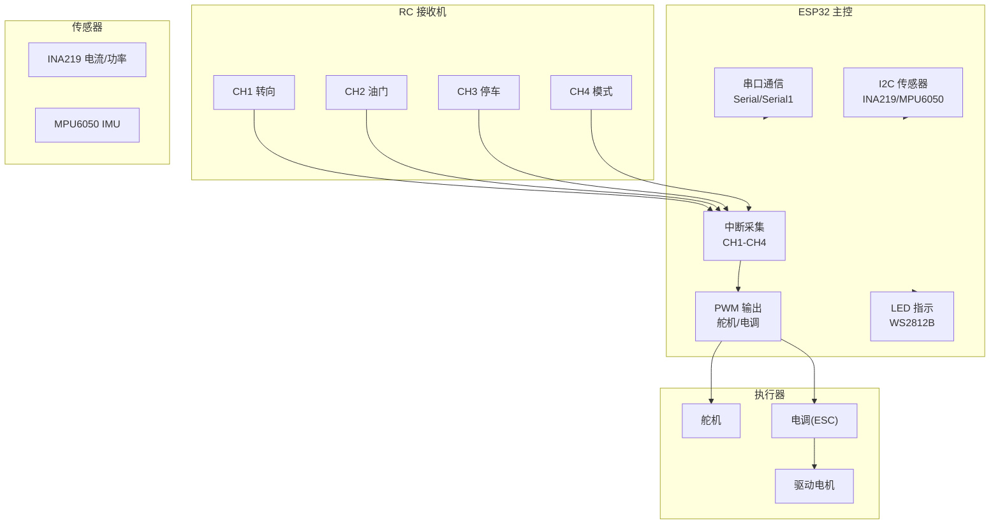
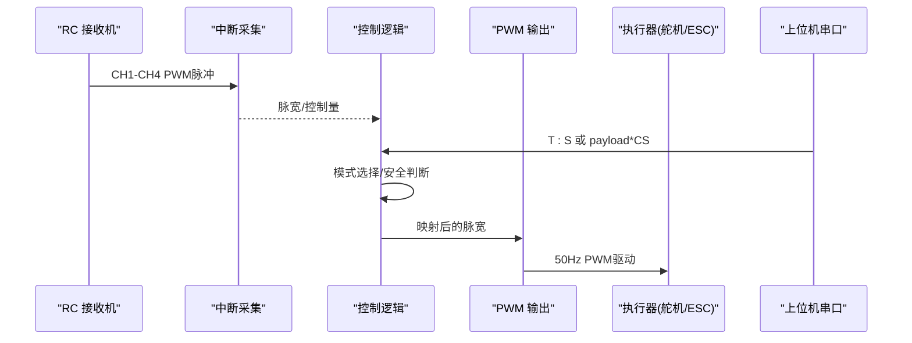
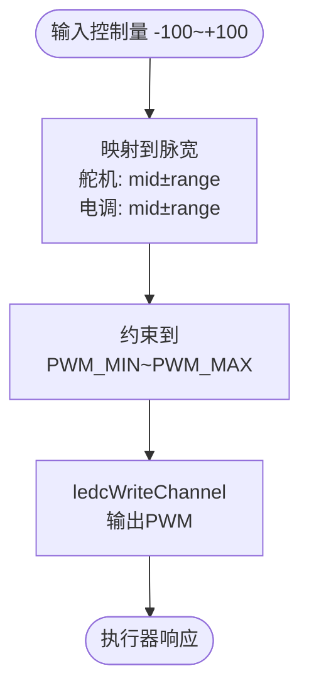
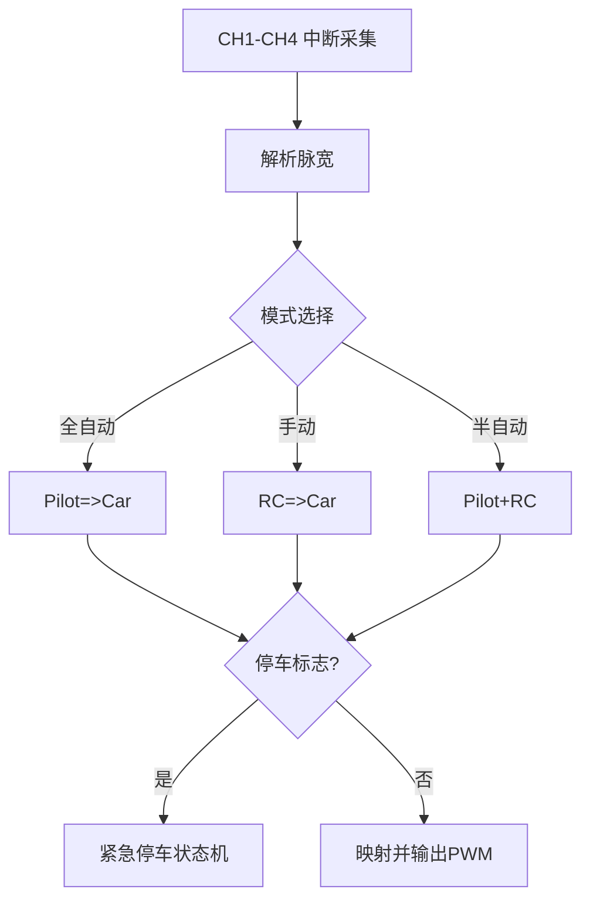
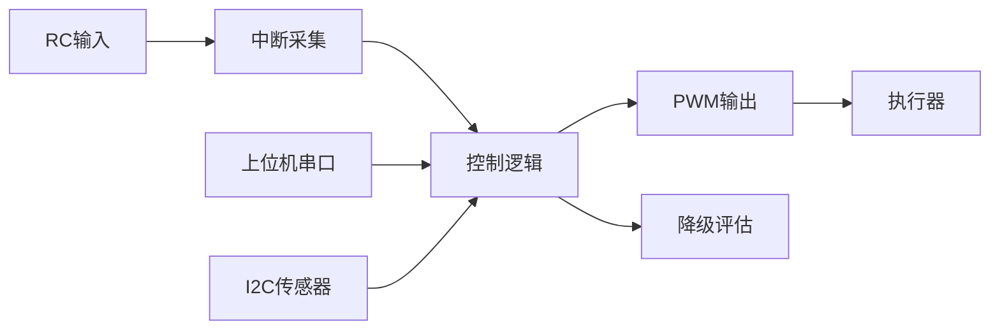
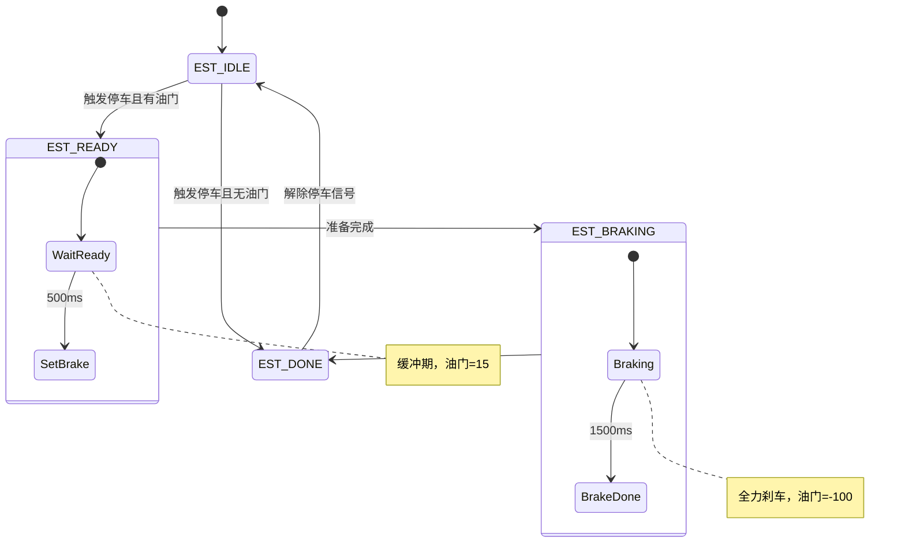

# 执行器接口设计

<cite>
**本文引用的文件**
- [README.md](file://README.md)
- [mus4.ino](file://mus4/mus4.ino)
- [pin_definitions.md](file://mus4/Doc/Hardware/pin_definitions.md)
- [architecture.md](file://mus4/Doc/Arch/architecture.md)
- [CONFIG.md](file://docs/CONFIG.md)
- [OPERATIONS.md](file://docs/OPERATIONS.md)
- [DevNote.md](file://mus4/Doc/README/DevNote.md)
</cite>

## 目录
1. [简介](#简介)
2. [项目结构](#项目结构)
3. [核心组件](#核心组件)
4. [架构总览](#架构总览)
5. [详细组件分析](#详细组件分析)
6. [依赖关系分析](#依赖关系分析)
7. [性能考量](#性能考量)
8. [故障诊断与安全停机](#故障诊断与安全停机)
9. [结论](#结论)
10. [附录](#附录)

## 简介
本设计文档聚焦于MUS4项目的执行器接口，围绕舵机与电机（ESC）控制的硬件接口设计展开，涵盖PWM信号生成、功率放大与保护电路、ESC匹配、电流检测与过载保护、执行器选型与功率热设计、PWM输出配置与死区控制、反电动势保护、以及执行器故障诊断与安全停机机制。文档以仓库现有代码与文档为基础，结合硬件引脚定义与系统架构，给出可操作的设计指导与实现要点。

## 项目结构
- 核心固件位于 mus4/mus4.ino，包含RC输入采集、上位机串口指令解析、控制逻辑、PWM输出、传感器读取、LED状态指示与紧急停车状态机等。
- 硬件引脚定义与连接关系见 mus4/Doc/Hardware/pin_definitions.md。
- 系统架构与运行流程见 mus4/Doc/Arch/architecture.md。
- 串口协议、测试命令与配置策略见 docs/CONFIG.md 与 docs/OPERATIONS.md。
- 开发笔记与关键常量见 mus4/Doc/README/DevNote.md。

图表来源
- [mus4.ino](file://mus4/mus4.ino#L1104-L1150)
- [pin_definitions.md](file://mus4/Doc/Hardware/pin_definitions.md#L115-L181)

章节来源
- [mus4.ino](file://mus4/mus4.ino#L1104-L1150)
- [pin_definitions.md](file://mus4/Doc/Hardware/pin_definitions.md#L1-L225)

## 核心组件
- PWM输出通道
  - 舵机输出：GPIO 23，使用ledc库生成50Hz、14bit分辨率的PWM，脉宽映射范围±440，中位1250。
  - 电调输出：GPIO 25，同频同分辨率，脉宽映射范围±390，中位1229。
- RC输入采集
  - CH1-CH4分别连接到GPIO 36/39/34/26，采用中断方式测量脉宽，解析遥控器控制量。
- 上位机串口控制
  - 支持两种帧格式：基础帧“T:S”与带校验帧“payload*CS”，回执ACK/NACK。
- 传感器与状态
  - I2C读取INA219与MPU6050；LED指示当前模式与紧急状态。
- 安全机制
  - 紧急停车状态机与停车/解锁逻辑，具备缓冲与刹车阶段。

章节来源
- [mus4.ino](file://mus4/mus4.ino#L41-L74)
- [mus4.ino](file://mus4/mus4.ino#L1132-L1134)
- [mus4.ino](file://mus4/mus4.ino#L1269-L1276)
- [pin_definitions.md](file://mus4/Doc/Hardware/pin_definitions.md#L21-L62)
- [CONFIG.md](file://docs/CONFIG.md#L13-L16)

## 架构总览
系统通过RC接收机与上位机串口输入获取控制指令，经模式选择与安全逻辑融合后，映射到PWM输出，驱动舵机与电调。传感器数据用于状态监控与降级模式评估。

图表来源
- [architecture.md](file://mus4/Doc/Arch/architecture.md#L18-L45)
- [mus4.ino](file://mus4/mus4.ino#L1152-L1279)

章节来源
- [architecture.md](file://mus4/Doc/Arch/architecture.md#L1-L245)
- [mus4.ino](file://mus4/mus4.ino#L1152-L1279)

## 详细组件分析

### PWM信号生成与映射
- 频率与分辨率
  - 舵机与电调均使用50Hz、14bit分辨率（计数范围0-16383）。
- 脉宽映射
  - 舵机：映射区间中位1250±440；电调：映射区间中位1229±390。
  - 实际输出前进行上下限约束（最小819，最大1638）。
- 输出实现
  - 通过ledcAttachChannel绑定通道，ledcWriteChannel写入脉宽。

图表来源
- [mus4.ino](file://mus4/mus4.ino#L1269-L1276)
- [pin_definitions.md](file://mus4/Doc/Hardware/pin_definitions.md#L210-L219)

章节来源
- [mus4.ino](file://mus4/mus4.ino#L1269-L1276)
- [pin_definitions.md](file://mus4/Doc/Hardware/pin_definitions.md#L210-L219)

### RC输入采集与模式/停车逻辑
- 中断采集
  - CH1-CH4分别绑定中断，记录上升沿时间，下降沿计算脉宽。
- 模式与停车
  - CH4用于模式切换（手动/半自动/全自动）；CH3用于停车/解锁，长按时间不同。
- 串口输入
  - 支持基础帧与校验帧，回执ACK/NACK。

图表来源
- [mus4.ino](file://mus4/mus4.ino#L414-L431)
- [mus4.ino](file://mus4/mus4.ino#L771-L786)
- [mus4.ino](file://mus4/mus4.ino#L1165-L1239)

章节来源
- [mus4.ino](file://mus4/mus4.ino#L414-L431)
- [mus4.ino](file://mus4/mus4.ino#L771-L786)
- [mus4.ino](file://mus4/mus4.ino#L1165-L1239)

### 串口协议与通信
- 帧格式
  - 基础：T:S\n（油门:转向，范围-100~100）
  - 校验：payload*CS\n（CS为payload字节ASCII和低8位的两位十六进制）
- 应答
  - 有效帧返回ACK，无效帧返回NACK。
- 回传
  - 主循环周期性回传当前控制输出至上位机。

章节来源
- [CONFIG.md](file://docs/CONFIG.md#L13-L16)
- [mus4.ino](file://mus4/mus4.ino#L320-L411)
- [mus4.ino](file://mus4/mus4.ino#L1249-L1253)

### 传感器与状态监控
- INA219
  - 读取母线电压、分流电压、电流与功率，数据有效性检查，错误时标记无效。
- MPU6050
  - 事件读取加速度、角速度与温度，错误时标记无效。
- 降级模式
  - 传感器无效、UI渲染耗时过长、串口回写拥塞时触发降级，关闭波形、降低UI刷新频率。

章节来源
- [mus4.ino](file://mus4/mus4.ino#L841-L866)
- [mus4.ino](file://mus4/mus4.ino#L898-L920)
- [mus4.ino](file://mus4/mus4.ino#L290-L305)
- [CONFIG.md](file://docs/CONFIG.md#L3-L6)

### 执行器接口硬件设计要点
- 电源与地线
  - 严禁直接从ESP32的3.3V/5V引脚为舵机/电机供电，应使用独立BEC供电并共地。
- 电平兼容
  - ESP32 I/O为3.3V，RC接收机通常输出5V PWM，建议串联限流电阻或使用电平转换。
- PWM频率与占空比
  - 代码设定50Hz，14bit分辨率；若使用数字舵机/特殊ESC，需确认兼容性并调整频率。
- 保护与隔离
  - 电调与电机存在反电动势，需在硬件侧增加续流二极管与滤波，避免对MCU造成干扰。
- 信号完整性
  - RC输入引脚GPIO 34/36/39为仅输入，无内部上下拉，确保接收机提供稳定电平。

章节来源
- [pin_definitions.md](file://mus4/Doc/Hardware/pin_definitions.md#L200-L209)
- [pin_definitions.md](file://mus4/Doc/Hardware/pin_definitions.md#L202-L206)

## 依赖关系分析
- 控制链路
  - RC输入 → 中断采集 → 控制逻辑 → PWM输出 → 执行器
- 通信链路
  - 上位机串口 → 解析与校验 → 控制逻辑 → PWM输出
- 传感链路
  - I2C → 传感器读取 → 状态评估 → 降级模式
- 并发与实时性
  - 中断采集保证RC脉宽测量的准确性；主循环定时输出PWM与回传状态。

图表来源
- [mus4.ino](file://mus4/mus4.ino#L1126-L1131)
- [mus4.ino](file://mus4/mus4.ino#L1152-L1279)

章节来源
- [mus4.ino](file://mus4/mus4.ino#L1126-L1131)
- [mus4.ino](file://mus4/mus4.ino#L1152-L1279)

## 性能考量
- PWM更新频率
  - 主循环约16ms一次（与UI刷新周期一致），满足RC/ESC/舵机控制需求。
- 传感器采样
  - 传感器更新间隔1000ms，避免阻塞主循环。
- 降级模式
  - 当UI渲染耗时超过阈值时动态降低UI刷新频率，保留核心控制与状态输出。
- 串口回传
  - 控制输出周期性回传，减少串口拥塞风险。

章节来源
- [mus4.ino](file://mus4/mus4.ino#L109-L111)
- [mus4.ino](file://mus4/mus4.ino#L1155-L1160)
- [mus4.ino](file://mus4/mus4.ino#L1249-L1253)
- [mus4.ino](file://mus4/mus4.ino#L1282-L1288)
- [CONFIG.md](file://docs/CONFIG.md#L3-L6)

## 故障诊断与安全停机

### 紧急停车状态机
- 状态转换
  - EST_IDLE → EST_READY（检测到停车且当前有油门）→ EST_BRAKING（缓冲500ms，油门设为15）→ EST_DONE（刹车1500ms，油门设为-100）→ EST_IDLE（解除停车信号后重置）。
- LED指示
  - 不同模式下闪烁红绿双色以提示紧急状态。

图表来源
- [architecture.md](file://mus4/Doc/Arch/architecture.md#L123-L151)
- [mus4.ino](file://mus4/mus4.ino#L474-L525)

章节来源
- [architecture.md](file://mus4/Doc/Arch/architecture.md#L117-L161)
- [mus4.ino](file://mus4/mus4.ino#L474-L525)

### 停车/解锁控制
- 锁定（进入停车模式）：长按CH3≥1000ms
- 解锁（退出停车模式）：长按CH3≥500ms
- 状态机与紧急停车状态机协同工作，确保系统安全。

章节来源
- [architecture.md](file://mus4/Doc/Arch/architecture.md#L162-L182)
- [mus4.ino](file://mus4/mus4.ino#L686-L740)

### 串口协议与测试
- 支持TEST/BENCH/STRESS/REGRESS命令，便于快速验证与回归。
- 校验机制与ACK/NACK反馈有助于定位通信问题。

章节来源
- [CONFIG.md](file://docs/CONFIG.md#L18-L22)
- [mus4.ino](file://mus4/mus4.ino#L355-L378)

## 结论
MUS4的执行器接口以ESP32为核心，通过RC输入与上位机串口实现多源控制，结合LED指示与紧急停车状态机保障安全。硬件层面遵循电源隔离、电平兼容与信号完整性原则；软件层面通过精确的PWM映射、定时输出与降级模式提升鲁棒性。建议在实际硬件实现中强化反电动势保护与滤波，确保ESC与电机安全可靠运行。

## 附录

### 执行器选型与功率热设计
- 舵机选型
  - 频率：50Hz；脉宽范围±440；中位1250；建议选用额定扭矩与响应速度满足小车转向需求的舵机。
- 电调(ESC)匹配
  - 频率：50Hz；脉宽范围±390；中位1229；需与电机KV值匹配，确保最大连续电流不超过ESC额定值。
- 电流检测与过载保护
  - 使用INA219读取电流与功率，结合紧急停车状态机与降级模式，实现过载保护与系统保护。
- 热设计
  - 电机与ESC在高负载下发热显著，需保证良好散热与风冷路径；避免长时间堵转或超载运行。

章节来源
- [pin_definitions.md](file://mus4/Doc/Hardware/pin_definitions.md#L210-L219)
- [mus4.ino](file://mus4/mus4.ino#L841-L866)
- [mus4.ino](file://mus4/mus4.ino#L474-L525)

### PWM输出配置与死区控制
- 配置
  - 50Hz、14bit分辨率；脉宽映射与上下限约束；ledcWriteChannel输出。
- 死区控制
  - 代码未显式实现死区控制；若需防止桥臂直通，可在硬件上增加死区时间或在软件中插入延时策略（需谨慎避免影响实时性）。

章节来源
- [mus4.ino](file://mus4/mus4.ino#L1132-L1134)
- [mus4.ino](file://mus4/mus4.ino#L1269-L1276)

### 反电动势保护
- 建议
  - 在ESC与电机之间增加续流二极管与RC滤波，抑制反电动势尖峰；必要时增加TVS管或RC吸收网络。
- 验证
  - 通过INA219监测电流峰值与瞬态波动，结合LED与状态机实现过载保护。

章节来源
- [pin_definitions.md](file://mus4/Doc/Hardware/pin_definitions.md#L200-L209)
- [mus4.ino](file://mus4/mus4.ino#L841-L866)