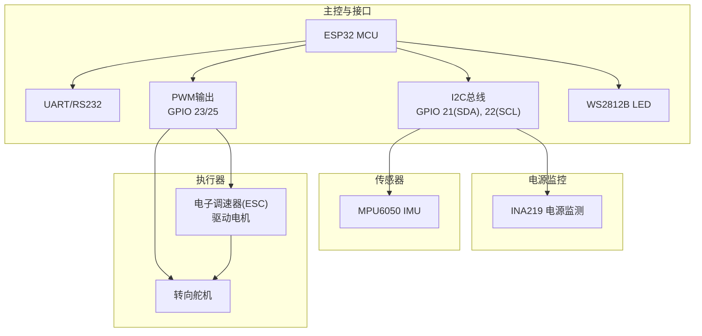
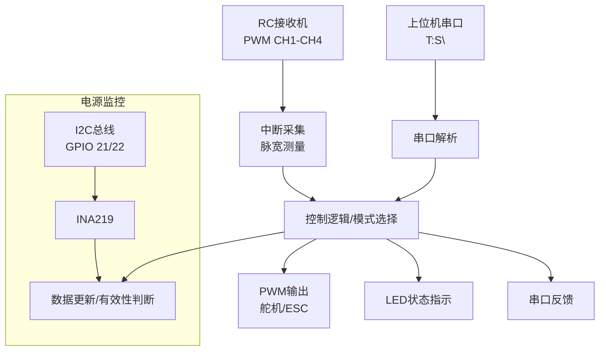
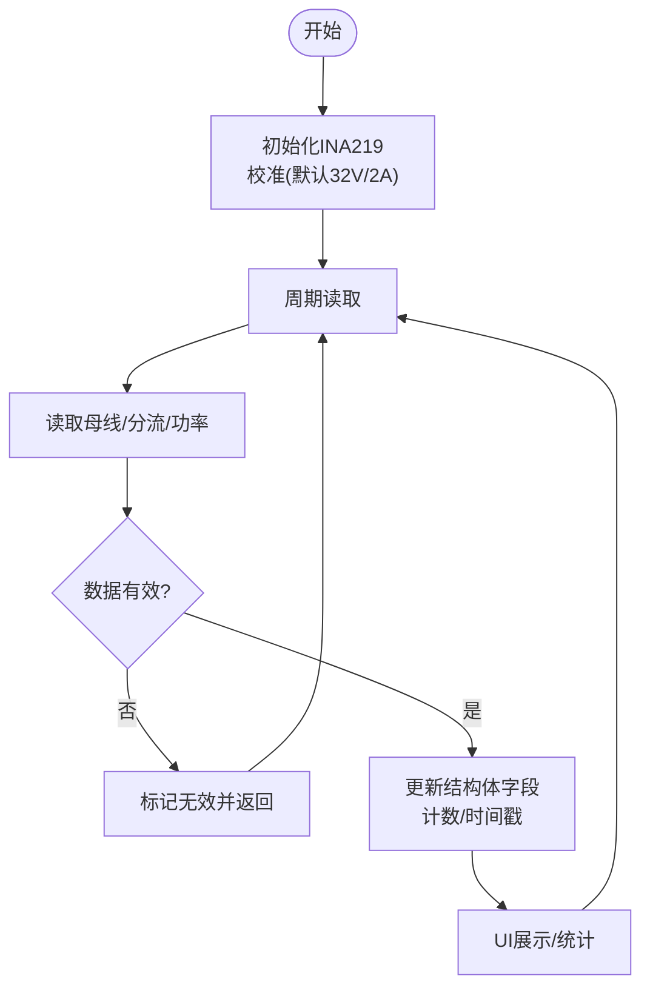
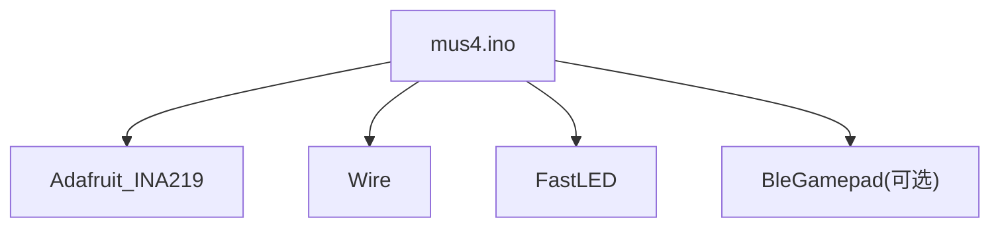

# 电源设计与管理

<cite>
**本文引用的文件**
- [README.md](file://README.md)
- [mus4.ino](file://mus4/mus4.ino)
- [architecture.md](file://mus4/Doc/Arch/architecture.md)
- [pin_definitions.md](file://mus4/Doc/Hardware/pin_definitions.md)
- [getcurrent.ino](file://examples/getcurrent/getcurrent.ino)
- [testIIC.ino](file://examples/testIIC/testIIC.ino)
- [DevNote.md](file://mus4/Doc/README/DevNote.md)
- [sketch.yaml](file://mus4/sketch.yaml)
</cite>

## 目录
1. [简介](#简介)
2. [项目结构](#项目结构)
3. [核心组件](#核心组件)
4. [架构总览](#架构总览)
5. [详细组件分析](#详细组件分析)
6. [依赖关系分析](#依赖关系分析)
7. [性能考量](#性能考量)
8. [故障排查指南](#故障排查指南)
9. [结论](#结论)
10. [附录](#附录)

## 简介
本文件面向MUS4项目，围绕电源架构、功率分配与电源管理策略进行系统化技术说明。重点基于INA219电源监测模块，解释电源监控电路原理、电流/电压测量方法与功耗分析；同时覆盖电源路径设计、电池管理、BEC供电方案与电源保护机制；并提供电源规格参数、功率预算分析与热管理考虑，以及电源效率优化、续航估算与故障检测等关键技术点。

## 项目结构
MUS4项目采用ESP32主控的自动驾驶小车控制程序，集成RC接收机信号采集、上位机串口指令、执行器输出（舵机/电调）、状态LED指示与I2C传感器（INA219/MPU6050）等模块。电源监控通过INA219实现，I2C引脚（GPIO 21/22）用于连接INA219与MPU6050。

图表来源
- [pin_definitions.md](file://mus4/Doc/Hardware/pin_definitions.md#L115-L181)
- [mus4.ino](file://mus4/mus4.ino#L1119-L1123)

章节来源
- [README.md](file://README.md#L1-L39)
- [architecture.md](file://mus4/Doc/Arch/architecture.md#L1-L45)
- [pin_definitions.md](file://mus4/Doc/Hardware/pin_definitions.md#L1-L225)

## 核心组件
- INA219电源监测模块：提供母线电压、分流电压、负载电压、电流与功率的实时测量，支撑功耗分析与健康监控。
- I2C总线：连接INA219与MPU6050，使用GPIO 21/22，速率100kHz。
- 执行器与负载：舵机（转向）与ESC（油门），通过PWM输出驱动。
- 电源路径：建议采用独立BEC供电，避免直接从ESP32引脚取电，确保系统稳定与安全。

章节来源
- [mus4.ino](file://mus4/mus4.ino#L24-L37)
- [mus4.ino](file://mus4/mus4.ino#L841-L896)
- [pin_definitions.md](file://mus4/Doc/Hardware/pin_definitions.md#L96-L101)

## 架构总览
系统通过RC接收机与上位机串口输入，结合控制逻辑与紧急停车/停车控制，最终输出PWM至执行器。电源监控模块（INA219）在后台周期性读取并更新传感器数据结构，供UI与降级评估使用。

图表来源
- [architecture.md](file://mus4/Doc/Arch/architecture.md#L18-L45)
- [mus4.ino](file://mus4/mus4.ino#L1152-L1160)
- [mus4.ino](file://mus4/mus4.ino#L841-L866)

## 详细组件分析

### INA219电源监测模块
- 电路原理与测量方法
  - 通过分流电阻两端的压降（分流电压）与母线电压（负载侧电压）计算电流与功率。
  - 负载电压 = 母线电压 + 分流电压（单位换算）。
  - 电流与功率分别由库函数直接读取，便于实时监控。
- 数据结构与更新策略
  - 使用结构体保存bus/shunt/load电压、电流、功率与读取计数/时间戳，周期性刷新并在UI中展示。
  - 读取失败时标记无效，避免错误数据影响控制逻辑。
- 校准与精度
  - 默认使用较大量程（32V/2A），若需更高精度可切换到较小量程（如16V/400mA）。
- I2C地址与总线扫描
  - 常见地址0x40/0x41，可通过扫描识别设备并定位问题。

图表来源
- [mus4.ino](file://mus4/mus4.ino#L841-L866)
- [mus4.ino](file://mus4/mus4.ino#L868-L896)
- [getcurrent.ino](file://examples/getcurrent/getcurrent.ino#L17-L27)

章节来源
- [mus4.ino](file://mus4/mus4.ino#L841-L896)
- [getcurrent.ino](file://examples/getcurrent/getcurrent.ino#L17-L27)

### 电源路径设计与BEC供电方案
- 电源路径
  - 电机与舵机由独立BEC供电，ESP32仅通过I2C与PWM控制，避免大电流经由主控引脚。
  - I2C与串口等低功耗接口由3.3V逻辑电平驱动，确保与主控兼容。
- BEC方案
  - 建议使用稳压BEC，输出电压与电流满足ESC/舵机需求，并留有余量。
  - 电源走线尽量短粗，减少压降与噪声；地线共地，避免环路干扰。
- 电源保护
  - 通过INA219监测电流与功率，结合紧急停车/停车控制，实现过流与过载保护。
  - UI与降级评估在异常时提示“降级模式”，避免系统崩溃。

章节来源
- [pin_definitions.md](file://mus4/Doc/Hardware/pin_definitions.md#L207-L209)
- [mus4.ino](file://mus4/mus4.ino#L290-L305)

### 电源管理策略与功耗分析
- 功率预算
  - 电机与ESC在高负载时电流峰值较高，需结合INA219实测数据建立典型工况下的功率曲线。
  - 舵机与IMU等外围设备功耗相对较低，可作为静态功耗项纳入预算。
- 效率优化
  - 合理选择BEC额定电流，避免长期满载运行。
  - 降低不必要的UI刷新频率与串口打印，减少MCU功耗。
  - 在降级模式下动态延长UI刷新周期，保障关键功能。
- 续航估算
  - 基于电池容量与实测平均电流，估算理论续航时间；结合INA219历史数据与UI展示，建立更贴近实际的估算模型。

章节来源
- [mus4.ino](file://mus4/mus4.ino#L1282-L1288)
- [mus4.ino](file://mus4/mus4.ino#L656-L681)

### 电源监控与UI展示
- INA219数据在UI中周期性展示，包含时间戳、读取计数与各项指标，便于调试与分析。
- 若读取失败，UI提示“无数据”，帮助快速定位I2C连接问题。

章节来源
- [mus4.ino](file://mus4/mus4.ino#L656-L681)
- [mus4.ino](file://mus4/mus4.ino#L841-L866)

### I2C总线与设备识别
- I2C总线初始化与扫描，识别INA219/MPU6050等设备，支持不同地址与错误诊断。
- 建议在上电时先扫描总线，确认设备存在后再进行传感器初始化。

章节来源
- [mus4.ino](file://mus4/mus4.ino#L1119-L1121)
- [mus4.ino](file://mus4/mus4.ino#L922-L975)
- [testIIC.ino](file://examples/testIIC/testIIC.ino#L125-L224)

## 依赖关系分析
- 硬件依赖
  - I2C引脚固定为GPIO 21/22，连接INA219与MPU6050。
  - PWM输出用于舵机与ESC，频率50Hz，分辨率14bit。
- 软件依赖
  - INA219库用于电源监测；Wire库用于I2C通信；FastLED用于LED控制。
  - 串口与蓝牙手柄模式（可选）用于人机交互与远程控制。

图表来源
- [mus4.ino](file://mus4/mus4.ino#L24-L37)
- [mus4.ino](file://mus4/mus4.ino#L1119-L1123)

章节来源
- [mus4.ino](file://mus4/mus4.ino#L24-L37)
- [pin_definitions.md](file://mus4/Doc/Hardware/pin_definitions.md#L96-L101)

## 性能考量
- I2C速率与稳定性
  - 默认100kHz，适合长线与多设备场景；若设备支持更高速率，可在保证稳定性的前提下提升速率。
- UI刷新与功耗平衡
  - 通过动态调整UI刷新周期，在性能与功耗间取得平衡；在降级模式下进一步降低刷新频率。
- 传感器采样与处理
  - 电源监测与IMU读取均采用周期性更新，避免频繁I2C访问造成总线拥塞。

章节来源
- [mus4.ino](file://mus4/mus4.ino#L109-L111)
- [mus4.ino](file://mus4/mus4.ino#L1282-L1288)
- [mus4.ino](file://mus4/mus4.ino#L1152-L1160)

## 故障排查指南
- INA219未检测到
  - 检查I2C连接（SDA/SCL是否正确、是否松动）与电源供电。
  - 使用I2C扫描工具识别设备地址，确认是否为0x40/0x41。
- 读取数据为0或无效
  - 校准参数是否合适；尝试切换到更小量程以提高精度。
  - 检查电源纹波与噪声，必要时增加滤波或改善布线。
- 串口通信异常
  - 确认波特率与引脚配置；检查RS232转换模块与线序。
- 电机/舵机不响应
  - 检查BEC供电与负载电流；确认PWM输出映射与限幅设置。

章节来源
- [mus4.ino](file://mus4/mus4.ino#L868-L896)
- [mus4.ino](file://mus4/mus4.ino#L922-L975)
- [DevNote.md](file://mus4/Doc/README/DevNote.md#L15-L29)

## 结论
MUS4项目通过INA219实现了对系统功耗的实时监控，结合I2C总线与PWM输出，构建了稳定可靠的电源路径与控制架构。建议在实际部署中采用独立BEC供电、优化校准参数与UI刷新策略，并利用INA219数据建立更精准的续航模型与保护机制，以提升整体系统效率与安全性。

## 附录
- 开发环境与串口配置
  - Arduino CLI目标板与端口配置见sketch.yaml；串口协议格式为“T:S\\n”。
- 硬件引脚与连接
  - I2C引脚、PWM输出、LED与UART选择等引脚定义详见硬件文档。

章节来源
- [sketch.yaml](file://mus4/sketch.yaml#L1-L3)
- [DevNote.md](file://mus4/Doc/README/DevNote.md#L15-L29)
- [pin_definitions.md](file://mus4/Doc/Hardware/pin_definitions.md#L13-L110)