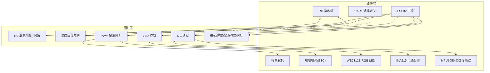
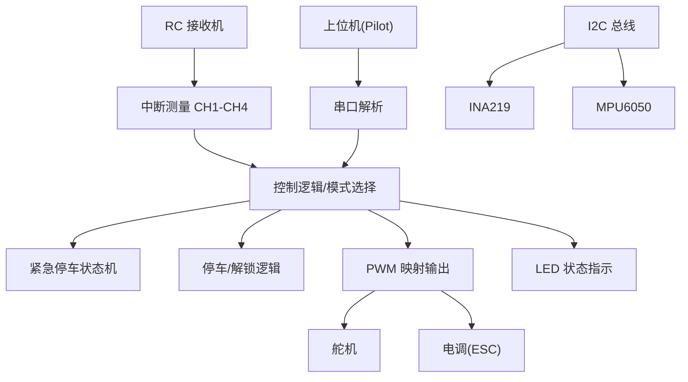
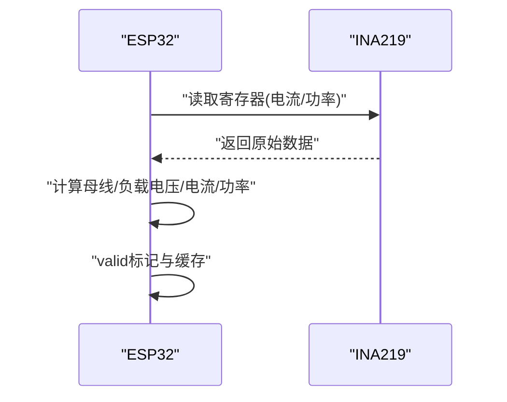
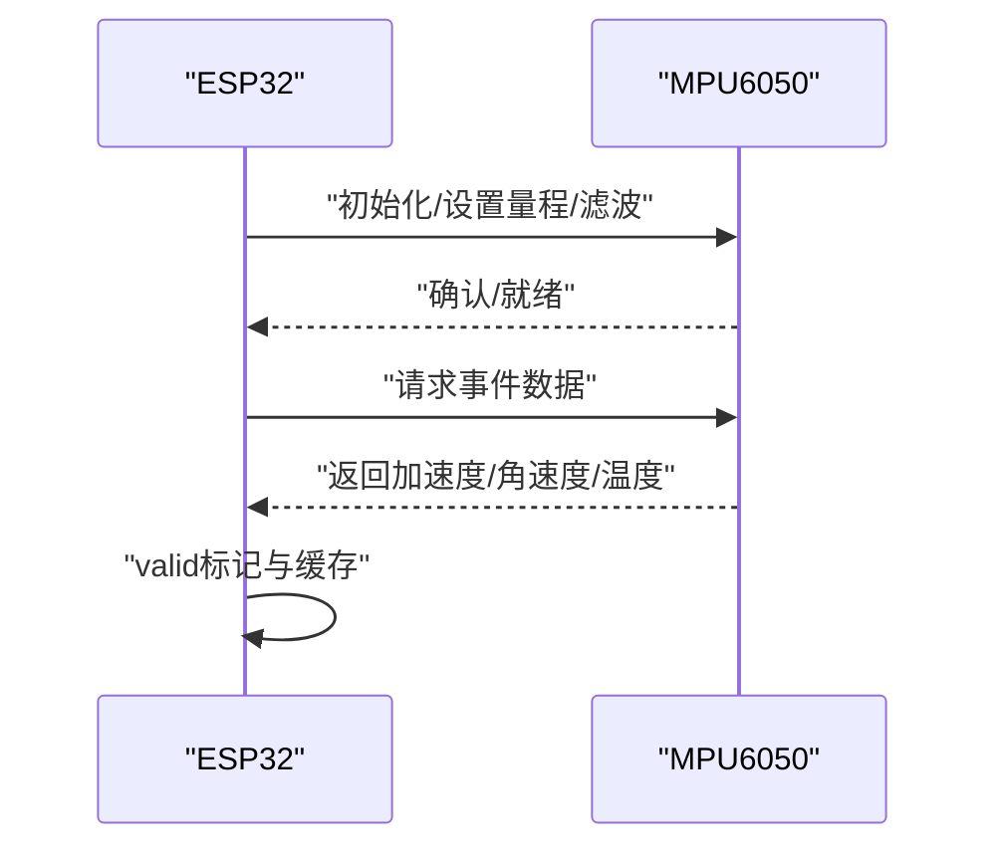
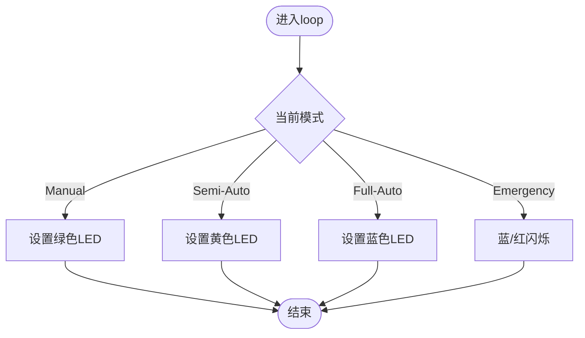
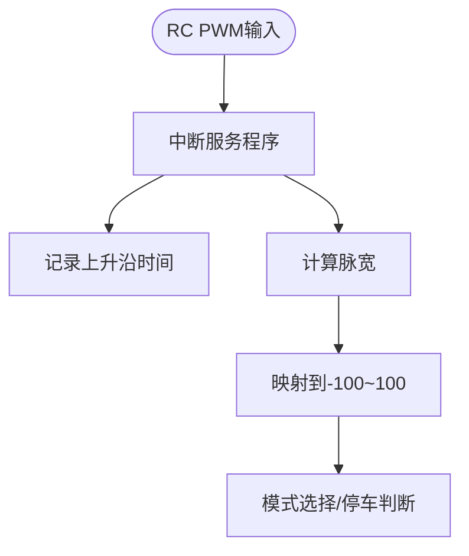
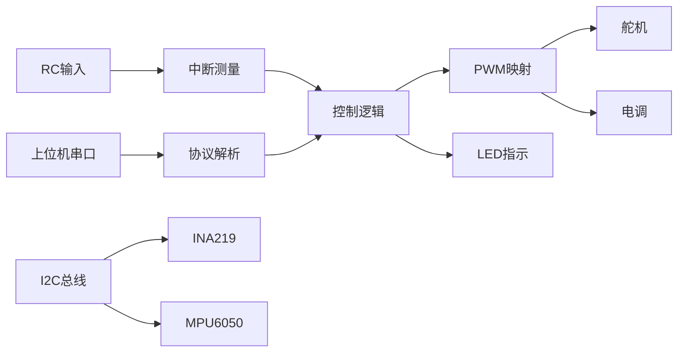

# 硬件设计

<cite>
**本文引用的文件**
- [pin_definitions.md](file://mus4/Doc/Hardware/pin_definitions.md)
- [mus4.ino](file://mus4/mus4.ino)
- [architecture.md](file://mus4/Doc/Arch/architecture.md)
- [DevNote.md](file://mus4/Doc/README/DevNote.md)
- [testIIC.ino](file://examples/testIIC/testIIC.ino)
- [sketch.yaml](file://mus4/sketch.yaml)
- [README.md](file://README.md)
</cite>

## 目录
1. [简介](#简介)
2. [项目结构](#项目结构)
3. [核心组件](#核心组件)
4. [架构总览](#架构总览)
5. [详细组件分析](#详细组件分析)
6. [依赖关系分析](#依赖关系分析)
7. [性能考量](#性能考量)
8. [故障排查指南](#故障排查指南)
9. [结论](#结论)
10. [附录](#附录)

## 简介
本文件面向MUS4自动驾驶小车的硬件设计，围绕引脚定义、电源管理、传感器与执行器布局、电路原理与PCB设计要点、关键硬件组件（INA219电源监测、MPU6050惯导模块、LED指示系统）进行系统化说明，并提供故障排查与性能优化建议。文档严格基于仓库中的引脚定义与固件实现，确保设计与代码一致。

## 项目结构
- 硬件引脚与连接关系由引脚定义文档集中描述，覆盖RC输入、执行器输出、串口通信、I2C接口、LED指示与UART选择等。
- 固件实现位于mus4.ino，包含RC脉宽测量、串口协议解析、传感器I2C读取、PWM输出映射、LED状态控制、紧急停车与停车逻辑等。
- 架构文档与开发笔记提供了系统运行逻辑、模式切换、状态机与关键常量配置的高层说明。
- 示例工程testIIC提供了I2C总线扫描与读写测试，验证SDA/SCL引脚与设备连通性。

**图表来源**
- [pin_definitions.md](file://mus4/Doc/Hardware/pin_definitions.md#L111-L181)
- [mus4.ino](file://mus4/mus4.ino#L1104-L1150)
- [architecture.md](file://mus4/Doc/Arch/architecture.md#L18-L45)

**章节来源**
- [pin_definitions.md](file://mus4/Doc/Hardware/pin_definitions.md#L1-L225)
- [mus4.ino](file://mus4/mus4.ino#L1104-L1150)
- [architecture.md](file://mus4/Doc/Arch/architecture.md#L1-L245)

## 核心组件
- RC接收机输入通道：GPIO 36/39/34/26，采用中断测量脉宽，解析CH1-CH4信号。
- 执行器输出通道：GPIO 23（舵机）、GPIO 25（电调），使用ledc生成50Hz PWM，14bit分辨率。
- 串行通信：GPIO 16/17（RS232）与Type-C串口，波特率115200，协议“T:S\n”。
- I2C接口：GPIO 21/22，100kHz，连接INA219与MPU6050。
- LED指示：GPIO 5，WS2812B，显示模式与紧急停车状态。
- UART选择：GPIO 12，控制串口路由。
- 备用PWM：GPIO 32/33，预留扩展。

**章节来源**
- [pin_definitions.md](file://mus4/Doc/Hardware/pin_definitions.md#L32-L110)
- [mus4.ino](file://mus4/mus4.ino#L41-L68)
- [DevNote.md](file://mus4/Doc/README/DevNote.md#L31-L122)

## 架构总览
系统通过RC与上位机双输入融合控制，经模式选择与安全逻辑（停车/紧急停车）后输出至执行器；同时通过I2C采集电源与惯导数据，LED实时反馈状态。

**图表来源**
- [architecture.md](file://mus4/Doc/Arch/architecture.md#L18-L45)
- [mus4.ino](file://mus4/mus4.ino#L1152-L1290)

**章节来源**
- [architecture.md](file://mus4/Doc/Arch/architecture.md#L66-L107)
- [mus4.ino](file://mus4/mus4.ino#L1152-L1290)

## 详细组件分析

### 引脚分配与电气特性
- RC输入通道（GPIO 36/39/34/26）：仅输入，内部无上下拉；推荐RC输出为5V时，ESP32引脚可直连，建议串联限流电阻以增强抗干扰。
- 执行器输出（GPIO 23/25）：50Hz PWM，14bit分辨率；脉宽映射范围由中位与范围参数决定，带最小/最大限制。
- 串口（GPIO 16/17）：RS232接口，波特率115200，8N1；默认UART选择为低电平。
- I2C（GPIO 21/22）：100kHz，已验证正确引脚；支持INA219与MPU6050。
- LED（GPIO 5）：WS2812B单点，颜色与模式绑定，紧急停车闪烁。
- 备用PWM（GPIO 32/33）：预留，当前未使用。

**章节来源**
- [pin_definitions.md](file://mus4/Doc/Hardware/pin_definitions.md#L32-L110)
- [mus4.ino](file://mus4/mus4.ino#L41-L68)

### 电源管理设计
- 严禁直接从ESP32 3.3V/5V引脚为舵机/电机供电；应使用独立BEC供电并共地。
- 通过INA219监测母线电压、分流电压、电流与功率，异常时标记无效并触发降级模式提示。
- 传感器与MCU共地，避免地环路与噪声耦合。

**章节来源**
- [pin_definitions.md](file://mus4/Doc/Hardware/pin_definitions.md#L207-L209)
- [mus4.ino](file://mus4/mus4.ino#L841-L896)

### 传感器布局与连接
- INA219：I2C地址默认0x40，连接SDA/SCL与电源/地，靠近负载侧以降低线路压降影响。
- MPU6050：I2C地址0x68/0x69可选，滤波带宽设置约100Hz采样，加速度±8G，陀螺±500°/s。
- I2C总线长度尽量短，走线紧邻，减少串扰；必要时增加上拉电阻（若硬件未内置）。

**章节来源**
- [mus4.ino](file://mus4/mus4.ino#L868-L896)
- [mus4.ino](file://mus4/mus4.ino#L977-L1082)

### 执行器连接
- 舵机：信号线连接GPIO 23，电源/地分别来自独立电源与MCU地；注意PWM频率50Hz与脉宽范围。
- 电调(ESC)：信号线连接GPIO 25；油门信号来自RC或上位机，经映射与限制后输出。
- 电机：由ESC驱动，独立供电，避免电流回流损坏MCU。

**章节来源**
- [pin_definitions.md](file://mus4/Doc/Hardware/pin_definitions.md#L47-L62)
- [mus4.ino](file://mus4/mus4.ino#L1269-L1276)

### 电路原理与PCB设计要点
- I2C走线：SDA/SCL与GND成对布线，长度差控制在0.5mm以内；必要时加0.1μF去耦电容。
- 电源走线：大电流回路（电机/ESC）与小信号（I2C/LED）分开，地平面完整。
- RC信号：走线远离高频数字信号，使用屏蔽或双绞线；末端并联RC抑制反射。
- 过流保护：在电源入口加保险丝或PTC，防止短路损坏。
- 接插件：使用排针/排母，便于维护与替换；标注清晰极性与功能。

[本节为通用设计建议，不直接分析具体文件]

### 关键硬件组件设计细节

#### INA219电源监测模块
- 初始化与校准：默认32V/2A范围；可通过库函数切换更高精度范围。
- 数据采集：每1s读取一次，存储母线电压、分流电压、负载电压、电流与功率；异常时标记无效。
- 故障定位：I2C错误打印与地址扫描，便于快速定位连线问题。

**图表来源**
- [mus4.ino](file://mus4/mus4.ino#L841-L866)

**章节来源**
- [mus4.ino](file://mus4/mus4.ino#L841-L896)

#### MPU6050惯性导航模块
- 初始化：多次重试，失败则持续提示；成功后设置加速度与陀螺量程与滤波带宽。
- 数据读取：事件读取，包含加速度、角速度与温度；异常时标记无效。
- 地址识别：支持0x68/0x69，扫描识别常见设备。

**图表来源**
- [mus4.ino](file://mus4/mus4.ino#L977-L1082)

**章节来源**
- [mus4.ino](file://mus4/mus4.ino#L977-L1082)

#### LED指示系统
- 颜色定义：手动/半自动/全自动化模式分别对应绿/黄/蓝；紧急停车闪烁当前模式色与红色。
- 控制方式：FastLED驱动WS2812B，支持静态颜色与定时切换。
- 状态反馈：系统初始化默认蓝色，模式切换与停车状态即时更新。

**图表来源**
- [mus4.ino](file://mus4/mus4.ino#L1198-L1239)

**章节来源**
- [mus4.ino](file://mus4/mus4.ino#L240-L274)
- [DevNote.md](file://mus4/Doc/README/DevNote.md#L51-L66)

### 串口通信与协议
- 协议格式：T:S\n，其中T为油门(-100~100)，S为转向(-100~100)。
- 串口对象：Serial(Type-C)与Serial1(RS232)，波特率均为115200。
- 反馈：每16ms向RS232回传当前控制输出，便于上位机监控。

**章节来源**
- [DevNote.md](file://mus4/Doc/README/DevNote.md#L24-L29)
- [mus4.ino](file://mus4/mus4.ino#L1249-L1253)

### RC输入与中断处理
- 中断测量：CH1-CH4分别绑定中断，记录上升沿时间并在下降沿计算脉宽。
- 校准参数：RC油门/转向的最小/中/最大脉宽，用于映射到-100~100。
- 模式切换：CH4脉宽阈值决定手动/半自动/全自动化模式。

**图表来源**
- [mus4.ino](file://mus4/mus4.ino#L414-L433)
- [mus4.ino](file://mus4/mus4.ino#L771-L786)

**章节来源**
- [mus4.ino](file://mus4/mus4.ino#L414-L433)
- [mus4.ino](file://mus4/mus4.ino#L771-L786)

### 执行器PWM输出映射
- 舵机：中位1250，范围±440；最小/最大计数819~1638。
- 电调：中位1229，范围±390；最小/最大计数819~1638。
- 输出：ledc写入通道，频率50Hz，分辨率14bit。

**章节来源**
- [mus4.ino](file://mus4/mus4.ino#L440-L447)
- [mus4.ino](file://mus4/mus4.ino#L1269-L1276)

## 依赖关系分析
- 硬件依赖：RC/串口/I2C/LED/执行器均依赖ESP32特定引脚；I2C依赖SDA/SCL与上拉电阻。
- 固件依赖：Adafruit_MPU6050、Adafruit_INA219、Wire、FastLED、BleGamepad（可选）。
- 逻辑耦合：RC与上位机输入融合，模式/停车/紧急停车逻辑贯穿输出映射与LED控制。

**图表来源**
- [architecture.md](file://mus4/Doc/Arch/architecture.md#L18-L45)
- [mus4.ino](file://mus4/mus4.ino#L1104-L1150)

**章节来源**
- [architecture.md](file://mus4/Doc/Arch/architecture.md#L1-L245)
- [mus4.ino](file://mus4/mus4.ino#L1104-L1150)

## 性能考量
- I2C速度：默认100kHz，保证稳定性；若传感器采样率提升，可评估400kHz/1MHz（需验证硬件与布线）。
- PWM分辨率：14bit满足舵机/电调需求；避免频繁写入，减少抖动。
- UI刷新：主界面刷新间隔动态调节，超时降级时延长刷新间隔，保障实时性。
- 传感器采样：MPU6050滤波带宽约100Hz，满足典型自动驾驶场景。

[本节为通用指导，不直接分析具体文件]

## 故障排查指南
- I2C设备未检测：
  - 使用扫描函数与错误码定位（地址、未知错误）。
  - 检查SDA/SCL连线、上拉电阻与电源。
- INA219初始化失败：
  - 核对I2C地址（默认0x40），检查接线与供电。
- MPU6050初始化失败：
  - 尝试不同地址（0x68/0x69），检查滤波与量程设置。
- 串口通信异常：
  - 确认波特率与端口配置；检查RS232电平与接线。
- RC信号异常：
  - 检查GPIO 34/36/39悬空问题；必要时增加上拉/下拉或改进连线。
- 执行器不响应：
  - 确认PWM映射范围与最小/最大限制；检查电源与地线。

**章节来源**
- [mus4.ino](file://mus4/mus4.ino#L922-L975)
- [mus4.ino](file://mus4/mus4.ino#L868-L896)
- [mus4.ino](file://mus4/mus4.ino#L977-L1082)
- [DevNote.md](file://mus4/Doc/README/DevNote.md#L15-L18)

## 结论
MUS4硬件设计以ESP32为核心，结合RC与上位机双输入、I2C传感器与执行器输出，形成稳定可控的自动驾驶小车平台。引脚定义明确、模块职责清晰、状态机与安全机制完善。建议在PCB设计中强化电源与地回路、缩短I2C走线、采用屏蔽与去耦，以提升整体可靠性与抗干扰能力。

[本节为总结性内容，不直接分析具体文件]

## 附录
- 开发环境：Ubuntu、Arduino CLI、FQBN为dfrobot_firebeetle2_esp32e，端口/dev/ttyS4。
- 串口协议：T:S\n，波特率115200。
- I2C测试：示例工程提供总线扫描、读写与压力测试，便于验证引脚与设备连通性。

**章节来源**
- [DevNote.md](file://mus4/Doc/README/DevNote.md#L3-L18)
- [testIIC.ino](file://examples/testIIC/testIIC.ino#L101-L118)
- [sketch.yaml](file://mus4/sketch.yaml#L1-L3)
- [README.md](file://README.md#L1-L39)