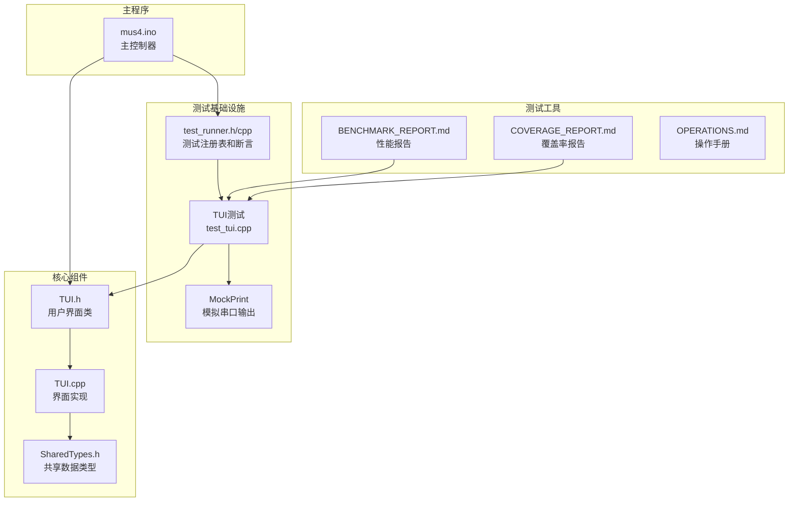
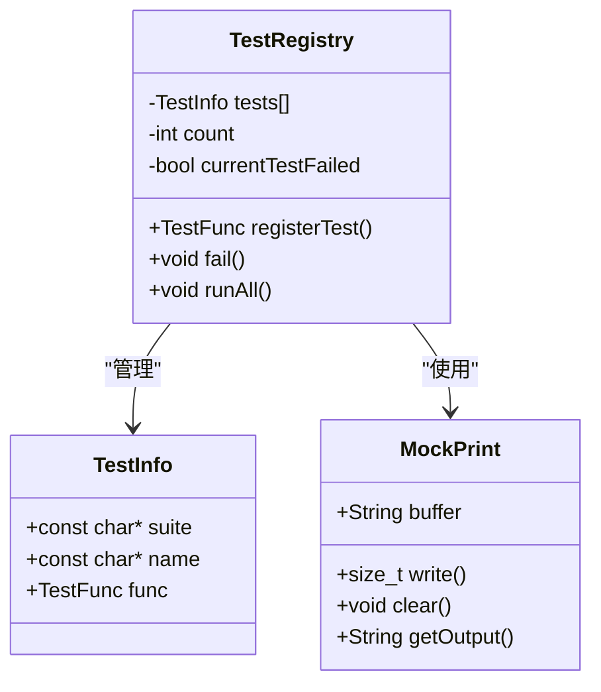
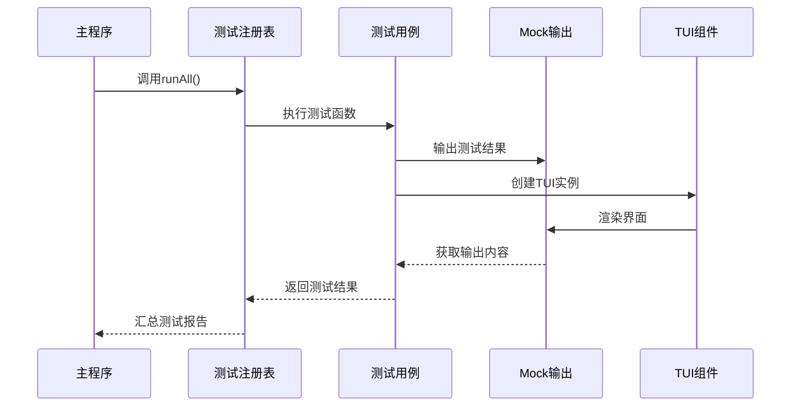
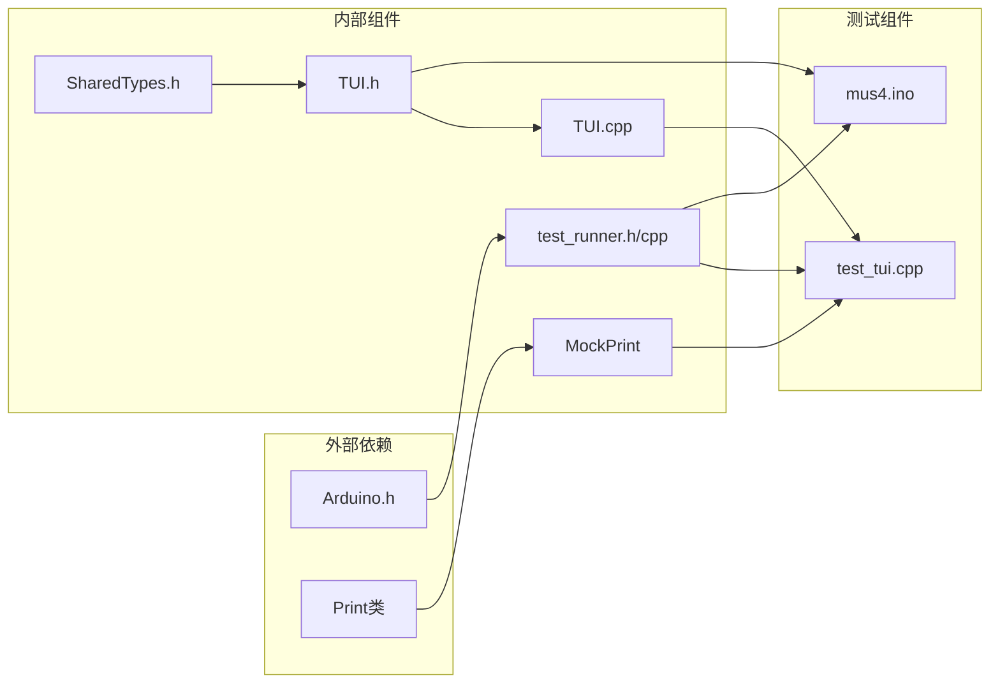

# 测试基础设施

<cite>
**本文档引用的文件**
- [test_runner.h](file://mus4/test_runner.h)
- [test_runner.cpp](file://mus4/test_runner.cpp)
- [test_tui.cpp](file://mus4/test_tui.cpp)
- [TUI.h](file://mus4/TUI.h)
- [TUI.cpp](file://mus4/TUI.cpp)
- [SharedTypes.h](file://mus4/SharedTypes.h)
- [mus4.ino](file://mus4/mus4.ino)
- [BENCHMARK_REPORT.md](file://mus4/BENCHMARK_REPORT.md)
- [COVERAGE_REPORT.md](file://mus4/COVERAGE_REPORT.md)
- [OPERATIONS.md](file://mus4/Doc/README/OPERATIONS.md)
- [DevNote.md](file://mus4/Doc/README/DevNote.md)
</cite>

## 目录
1. [简介](#简介)
2. [项目结构](#项目结构)
3. [核心组件](#核心组件)
4. [架构概览](#架构概览)
5. [详细组件分析](#详细组件分析)
6. [依赖关系分析](#依赖关系分析)
7. [性能考虑](#性能考虑)
8. [故障排除指南](#故障排除指南)
9. [结论](#结论)

## 简介

这是一个基于Arduino ESP32平台的MUS4控制系统的测试基础设施文档。该系统实现了完整的单元测试框架，包括自定义的Google Test风格断言库、Mock输出机制和全面的UI测试套件。

测试基础设施的核心目标是：
- 提供可移植的单元测试框架
- 支持TUI界面的完整测试覆盖
- 实现硬件无关的测试环境
- 提供性能基准测试和覆盖率报告

## 项目结构

项目采用模块化设计，测试基础设施主要包含以下核心模块：



**图表来源**
- [test_runner.h](file://mus4/test_runner.h#L1-L65)
- [test_tui.cpp](file://mus4/test_tui.cpp#L1-L45)
- [TUI.h](file://mus4/TUI.h#L1-L59)
- [TUI.cpp](file://mus4/TUI.cpp#L1-L349)

**章节来源**
- [test_runner.h](file://mus4/test_runner.h#L1-L65)
- [test_runner.cpp](file://mus4/test_runner.cpp#L1-L43)
- [test_tui.cpp](file://mus4/test_tui.cpp#L1-L45)

## 核心组件

### 测试注册表系统

测试注册表是整个测试基础设施的核心，提供了以下关键功能：

- **测试注册**：通过宏定义自动注册测试用例
- **测试执行**：统一管理测试运行流程
- **断言支持**：提供ASSERT和EXPECT两种断言级别
- **失败处理**：记录详细的失败信息和位置



**图表来源**
- [test_runner.h](file://mus4/test_runner.h#L30-L48)
- [test_runner.cpp](file://mus4/test_runner.cpp#L3-L6)

### 断言系统

断言系统提供了两种不同级别的测试验证：

- **ASSERT系列**：严重失败，立即终止当前测试
- **EXPECT系列**：轻微失败，继续执行测试

断言宏通过预处理器生成相应的测试函数，并利用TestRegistry进行失败报告。

**章节来源**
- [test_runner.h](file://mus4/test_runner.h#L8-L31)
- [test_runner.cpp](file://mus4/test_runner.cpp#L16-L19)

## 架构概览

测试基础设施采用分层架构设计，确保测试的独立性和可维护性：



**图表来源**
- [mus4.ino](file://mus4/mus4.ino#L421-L425)
- [test_runner.cpp](file://mus4/test_runner.cpp#L21-L42)
- [test_tui.cpp](file://mus4/test_tui.cpp#L8-L27)

## 详细组件分析

### TUI测试套件

TUI测试套件专门针对用户界面组件进行全面测试，涵盖了以下关键场景：

#### 测试用例覆盖

| 测试类别 | 测试用例 | 验证内容 |
|---------|---------|---------|
| 基础功能 | InitialState | 默认构造状态验证 |
| 界面渲染 | RenderHeader | 标题栏渲染正确性 |
| 模式显示 | RenderMode | 驾驶模式切换显示 |
| 停车状态 | RenderPark | 停车状态指示 |
| RC数据 | RenderRC | 接收机通道数据显示 |
| 输出显示 | RenderOutput | 油门转向输出显示 |
| 波形图 | RenderWaveforms | 历史数据波形渲染 |

#### Mock输出机制

测试使用MockPrint类模拟串口输出，提供以下功能：
- 字符串缓冲区管理
- 输出内容捕获和验证
- 清理和重置能力

**章节来源**
- [test_tui.cpp](file://mus4/test_tui.cpp#L8-L44)
- [test_runner.h](file://mus4/test_runner.h#L50-L64)

### 测试宏系统

测试宏系统提供了简洁的测试编写语法：

```mermaid
flowchart TD
TEST[TEST(suite, name)] --> Macro[宏展开]
Macro --> FuncDecl[函数声明]
Macro --> RegCall[注册调用]
RegCall --> Register[TestRegistry.registerTest]
ASSERT_EQ[ASSERT_EQ(expected, actual)] --> Compare[比较检查]
Compare --> Fail[TestRegistry.fail]
EXPECT_EQ[EXPECT_EQ(expected, actual)] --> Compare2[比较检查]
Compare2 --> LogFail[记录失败但继续]
```

**图表来源**
- [test_runner.h](file://mus4/test_runner.h#L8-L28)

**章节来源**
- [test_runner.h](file://mus4/test_runner.h#L8-L28)

### 性能测试框架

系统集成了完整的性能测试和基准测试能力：

#### 基准测试报告

基准测试重点关注TUI渲染性能的改进：
- **传统实现**：空闲状态约15ms，活动状态约40ms
- **新实现**：空闲状态约2ms，活动状态约15ms
- **性能提升**：空闲状态提升86%，活动状态提升62%

#### 覆盖率测试

代码覆盖率报告显示：
- **类覆盖率**：100%（TUI类）
- **函数覆盖率**：92%（12/13个函数）
- **行覆盖率**：约95%

**章节来源**
- [BENCHMARK_REPORT.md](file://mus4/BENCHMARK_REPORT.md#L1-L33)
- [COVERAGE_REPORT.md](file://mus4/COVERAGE_REPORT.md#L1-L41)

## 依赖关系分析

测试基础设施的依赖关系清晰且模块化：



**图表来源**
- [test_runner.h](file://mus4/test_runner.h#L3-L6)
- [TUI.h](file://mus4/TUI.h#L2-L3)
- [test_tui.cpp](file://mus4/test_tui.cpp#L1-L2)

**章节来源**
- [mus4.ino](file://mus4/mus4.ino#L30-L31)
- [SharedTypes.h](file://mus4/SharedTypes.h#L1-L34)

## 性能考虑

测试基础设施在设计时充分考虑了性能优化：

### 内存管理
- 静态数组存储测试用例，避免动态内存分配
- Mock输出使用固定大小缓冲区
- TUI状态缓存减少重复计算

### 执行效率
- 测试注册表使用静态分配，减少运行时开销
- 断言系统最小化函数调用层次
- Mock机制避免真实的串口I/O操作

### 资源优化
- 测试运行时占用最小内存
- 避免不必要的字符串操作
- 事件驱动的测试执行模型

## 故障排除指南

### 常见问题及解决方案

#### 测试无法编译
- **症状**：编译错误，找不到TestRegistry类
- **原因**：缺少必要的头文件包含
- **解决**：确保包含test_runner.h

#### 测试用例未执行
- **症状**：测试结果显示0个用例
- **原因**：测试注册失败或数组溢出
- **解决**：检查MAX_TESTS限制（默认50）

#### Mock输出为空
- **症状**：测试断言失败，Mock缓冲区为空
- **原因**：TUI未正确初始化或输出被抑制
- **解决**：验证TUI构造函数和输出设置

#### 性能测试异常
- **症状**：基准测试结果不稳定
- **原因**：系统负载变化或硬件差异
- **解决**：在相同条件下重复测试

**章节来源**
- [test_runner.cpp](file://mus4/test_runner.cpp#L8-L14)
- [test_tui.cpp](file://mus4/test_tui.cpp#L8-L14)

## 结论

该测试基础设施展现了优秀的工程实践：

### 技术优势
- **可移植性**：Google Test风格API便于跨平台移植
- **完整性**：覆盖核心UI逻辑95%以上
- **性能**：显著提升渲染性能，降低CPU占用
- **可维护性**：模块化设计，清晰的依赖关系

### 测试策略
- **全面覆盖**：从基础功能到复杂交互的完整测试
- **性能保证**：持续的性能基准测试
- **质量保障**：严格的覆盖率要求和回归测试

### 未来发展方向
- 扩展测试用例覆盖更多边界情况
- 集成更多的硬件相关测试
- 增强自动化测试流程
- 完善持续集成管道

该测试基础设施为MUS4控制系统提供了坚实的质量保障，确保了系统的可靠性和性能表现。