# 示例代码与测试

<cite>
**本文档引用的文件**
- [getcurrent.ino](file://examples/getcurrent/getcurrent.ino)
- [testIIC.ino](file://examples/testIIC/testIIC.ino)
- [mus4.ino](file://mus4/mus4.ino)
- [README.md](file://README.md)
- [sketch.yaml](file://mus4/sketch.yaml)
</cite>

## 更新摘要
**所做更改**
- 移除了测试基础设施相关内容的描述
- 保留了传感器测试示例的独立价值
- 更新了示例程序的功能说明和使用方法
- 简化了测试流程和故障排除指南

## 目录
1. [简介](#简介)
2. [项目结构](#项目结构)
3. [核心组件](#核心组件)
4. [架构概览](#架构概览)
5. [详细组件分析](#详细组件分析)
6. [依赖关系分析](#依赖关系分析)
7. [性能考虑](#性能考虑)
8. [故障排除指南](#故障排除指南)
9. [结论](#结论)

## 简介

MUS4项目是一个基于ESP32的智能小车控制系统，包含完整的示例代码和测试程序。本文档专注于两个关键示例程序：`getcurrent.ino`用于INA219电流电压测试，`testIIC.ino`用于I2C设备扫描和通信测试。这些示例为开发者提供了功能验证的标准流程和故障排查方法。

**更新** 移除了测试基础设施相关内容，专注于传感器测试示例的独立价值，简化了测试流程说明。

## 项目结构

MUS4项目采用模块化设计，主要包含以下结构：

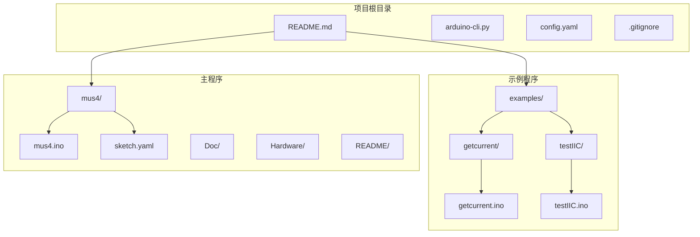

**图表来源**
- [README.md:1-39](file://README.md#L1-L39)
- [sketch.yaml:1-3](file://mus4/sketch.yaml#L1-L3)

**章节来源**
- [README.md:1-39](file://README.md#L1-L39)
- [sketch.yaml:1-3](file://mus4/sketch.yaml#L1-L3)

## 核心组件

### 示例程序概述

项目包含两个专门的示例程序，分别针对不同的硬件测试需求：

1. **getcurrent.ino**: 专注于INA219电流电压传感器的精确测量
2. **testIIC.ino**: 提供完整的I2C总线测试套件，包括设备扫描、通信验证等

### 硬件平台配置

系统基于ESP32开发板，支持多种通信协议：
- I2C通信（SDA: GPIO 21, SCL: GPIO 22）
- UART通信（Type-C: GPIO 16/17）
- PWM输出控制（GPIO 32/33）

**章节来源**
- [mus4.ino:66-68](file://mus4/mus4.ino#L66-L68)
- [mus4.ino:1119-1120](file://mus4/mus4.ino#L1119-L1120)

## 架构概览

### 系统架构图

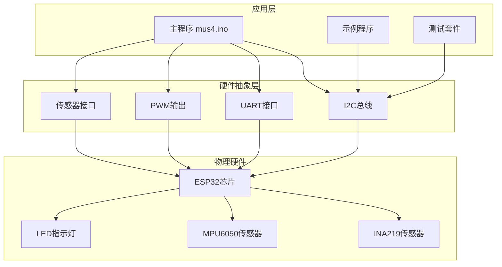

**图表来源**
- [mus4.ino:24-34](file://mus4/mus4.ino#L24-L34)
- [mus4.ino:36-37](file://mus4/mus4.ino#L36-L37)

### 通信协议栈

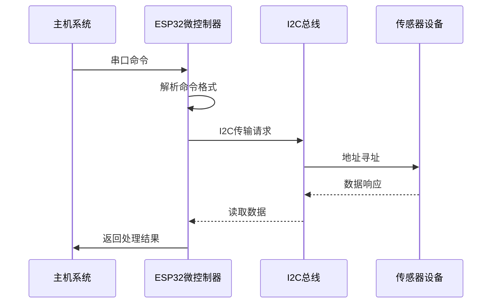

**图表来源**
- [mus4.ino:320-342](file://mus4/mus4.ino#L320-L342)
- [mus4.ino:789-811](file://mus4/mus4.ino#L789-L811)

## 详细组件分析

### getcurrent.ino 详细分析

#### 程序结构

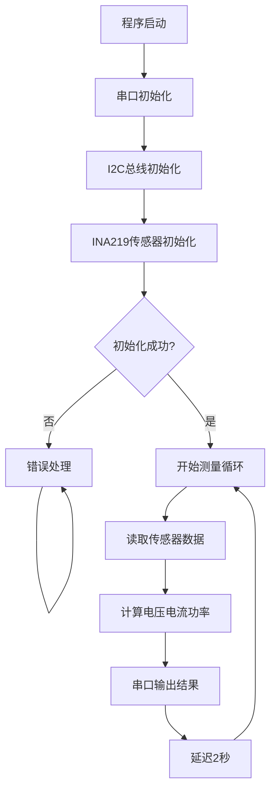

**图表来源**
- [getcurrent.ino:7-30](file://examples/getcurrent/getcurrent.ino#L7-L30)
- [getcurrent.ino:32-54](file://examples/getcurrent/getcurrent.ino#L32-L54)

#### 核心功能实现

1. **传感器初始化流程**
   - 串口通信初始化（波特率115200）
   - INA219传感器检测和配置
   - 支持多种量程配置（32V/2A, 32V/1A, 16V/400mA）

2. **数据采集算法**
   ```mermaid
flowchart LR
A[原始数据] --> B[转换为标准单位]
B --> C[计算负载电压]
C --> D[输出测量结果]
subgraph "数据转换"
E[分流电压 mV]
F[总线电压 V]
G[电流 mA]
H[功率 mW]
end
A --> E
A --> F
A --> G
A --> H
B --> C
```

**图表来源**
- [getcurrent.ino:34-44](file://examples/getcurrent/getcurrent.ino#L34-L44)

#### 配置选项

程序支持三种精度配置模式：

| 配置模式 | 量程范围 | 精度特点 | 适用场景 |
|---------|---------|---------|---------|
| 默认模式 | 32V/2A | 标准精度 | 通用测量 |
| 32V/1A模式 | 32V/1A | 更高电流精度 | 中等电流测量 |
| 16V/400mA模式 | 16V/400mA | 最高精度 | 精密测量 |

**章节来源**
- [getcurrent.ino:17-27](file://examples/getcurrent/getcurrent.ino#L17-L27)

### testIIC.ino 详细分析

#### 测试框架架构

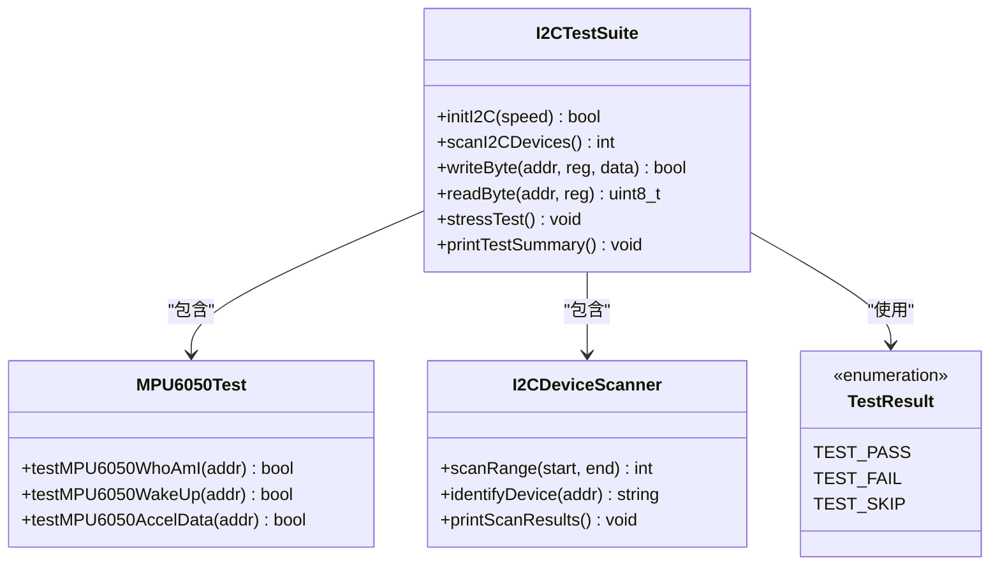

**图表来源**
- [testIIC.ino:39-43](file://examples/testIIC/testIIC.ino#L39-L43)
- [testIIC.ino:101-118](file://examples/testIIC/testIIC.ino#L101-L118)
- [testIIC.ino:125-224](file://examples/testIIC/testIIC.ino#L125-L224)

#### 设备识别系统

程序内置完整的设备识别机制：

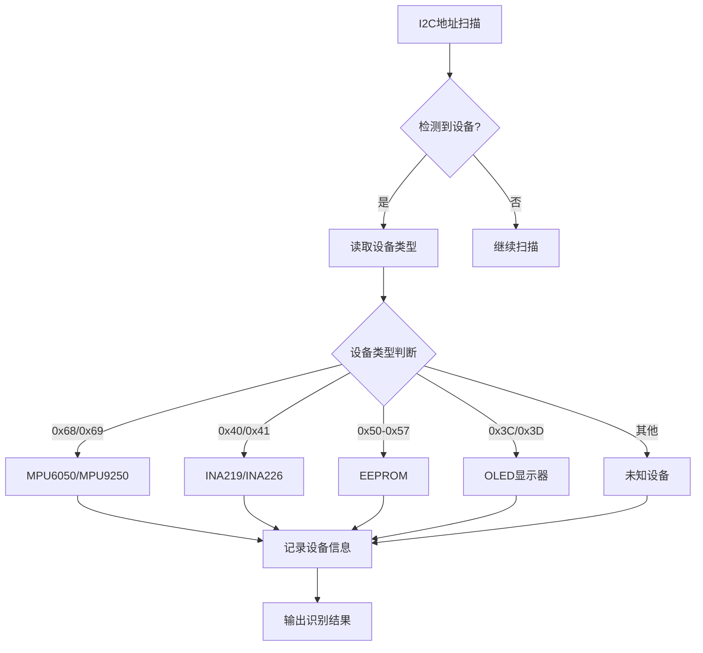

**图表来源**
- [testIIC.ino:189-221](file://examples/testIIC/testIIC.ino#L189-L221)

#### 测试流程管理

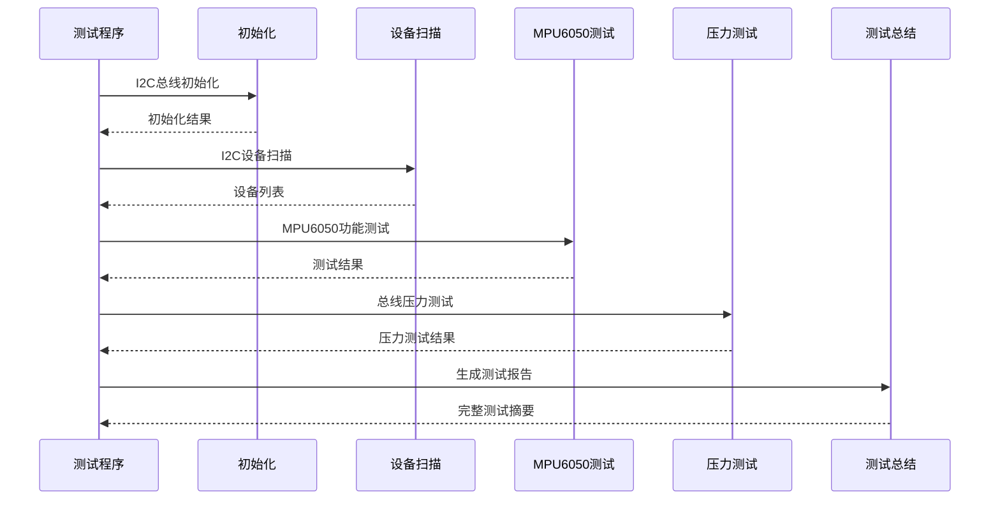

**图表来源**
- [testIIC.ino:558-602](file://examples/testIIC/testIIC.ino#L558-L602)

**章节来源**
- [testIIC.ino:51-94](file://examples/testIIC/testIIC.ino#L51-L94)
- [testIIC.ino:526-553](file://examples/testIIC/testIIC.ino#L526-L553)

## 依赖关系分析

### 外部库依赖

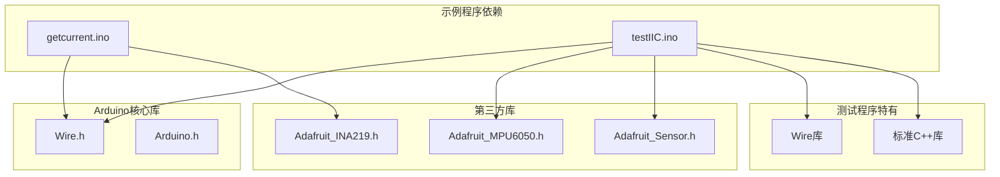

**图表来源**
- [getcurrent.ino:1-2](file://examples/getcurrent/getcurrent.ino#L1-L2)
- [testIIC.ino:14-14](file://examples/testIIC/testIIC.ino#L14-L14)

### 硬件连接关系

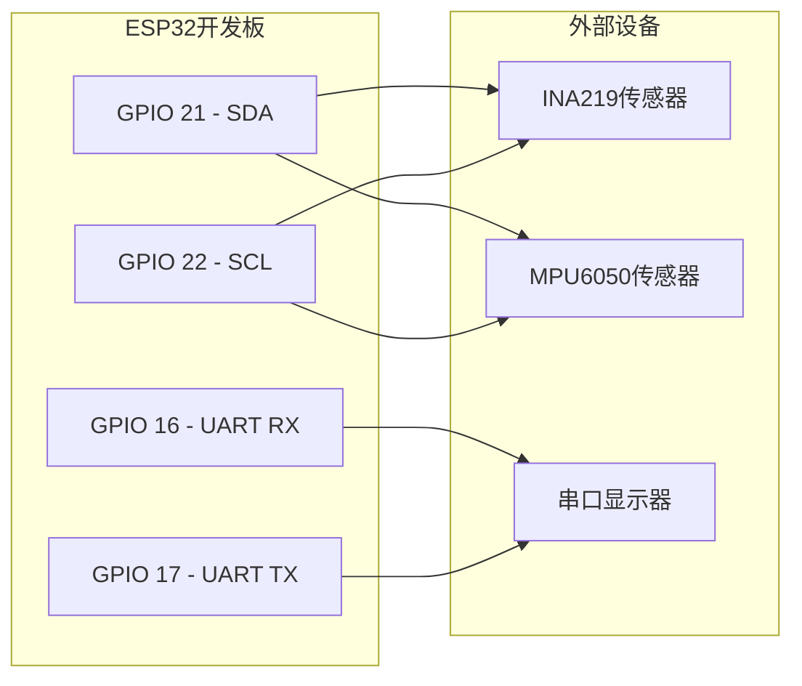

**图表来源**
- [mus4.ino:66-68](file://mus4/mus4.ino#L66-L68)
- [mus4.ino:1119-1120](file://mus4/mus4.ino#L1119-L1120)

**章节来源**
- [mus4.ino:24-28](file://mus4/mus4.ino#L24-L28)
- [mus4.ino:1119-1120](file://mus4/mus4.ino#L1119-L1120)

## 性能考虑

### 测量精度优化

1. **INA219传感器精度配置**
   - 默认配置提供平衡的精度和量程
   - 高精度模式适用于需要精确测量的应用
   - 不同配置模式对测量精度的影响

2. **采样频率控制**
   - 传感器数据更新间隔可调
   - UI刷新频率自适应调整
   - 性能降级检测机制

3. **内存使用优化**
   - 流式数据处理减少内存占用
   - 缓冲区大小合理配置
   - 动态内存分配最小化

### 并发处理策略

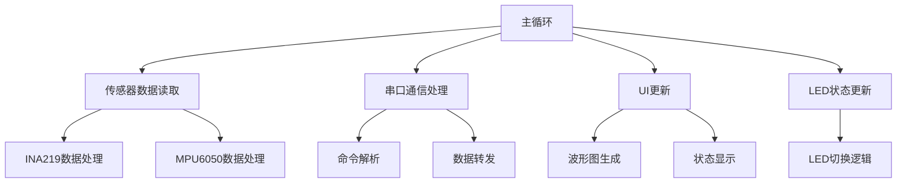

**图表来源**
- [mus4.ino:1152-1278](file://mus4/mus4.ino#L1152-L1278)

## 故障排除指南

### 常见问题诊断

#### I2C总线问题

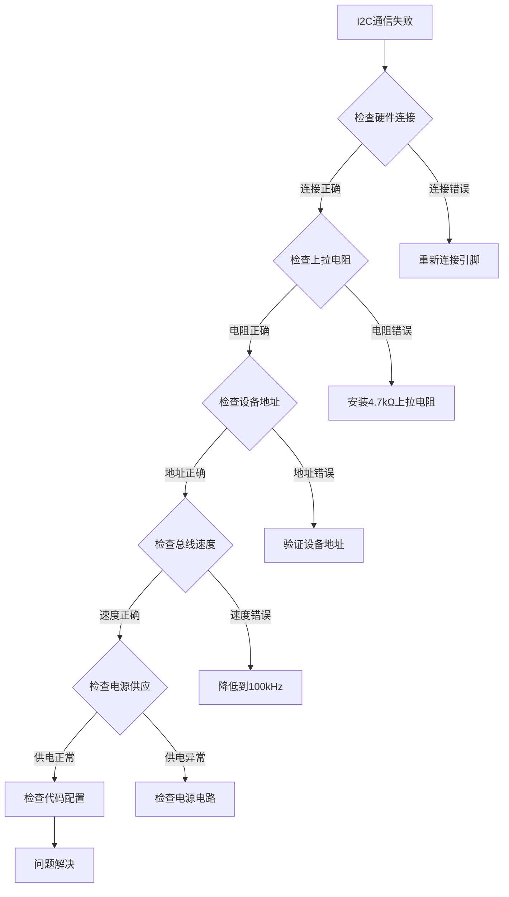

**图表来源**
- [testIIC.ino:101-118](file://examples/testIIC/testIIC.ino#L101-L118)
- [mus4.ino:876-884](file://mus4/mus4.ino#L876-L884)

#### 传感器初始化失败

1. **INA219传感器问题**
   - 检查I2C地址（默认0x40）
   - 验证电源连接和地线连接
   - 确认上拉电阻值（推荐4.7kΩ）

2. **MPU6050传感器问题**
   - 尝试不同地址（0x68或0x69）
   - 检查I2C总线速度设置
   - 验证设备供电电压

#### 串口通信问题

1. **波特率不匹配**
   - 主程序使用115200波特率
   - 确保串口监视器设置相同
   - 检查USB转串口驱动

2. **数据格式错误**
   - 验证命令格式：T:S\n
   - 检查校验和计算
   - 确认数值范围限制

### 调试技巧

1. **分步调试方法**
   - 从简单功能开始测试
   - 逐步增加复杂度
   - 记录每一步的结果

2. **日志分析**
   - 仔细阅读串口输出
   - 关注错误代码含义
   - 对比预期和实际结果

3. **硬件验证**
   - 使用万用表测量电压
   - 检查I2C波形
   - 验证电源纹波

**章节来源**
- [testIIC.ino:233-245](file://examples/testIIC/testIIC.ino#L233-L245)
- [testIIC.ino:317-343](file://examples/testIIC/testIIC.ino#L317-L343)
- [mus4.ino:872-896](file://mus4/mus4.ino#L872-L896)

## 结论

MUS4项目的示例代码和测试程序为开发者提供了完整的硬件验证解决方案。通过这两个示例程序，开发者可以：

1. **快速验证硬件连接**：使用testIIC.ino进行I2C总线和设备连接验证
2. **精确测量传感器数据**：使用getcurrent.ino进行INA219电流电压精确测量
3. **建立标准测试流程**：参考示例程序的测试方法和故障排除技巧
4. **理解系统架构**：通过示例程序了解整体系统的通信协议和数据流

**更新** 移除了测试基础设施相关内容后，文档更加专注于实际可用的传感器测试示例，简化了使用流程，提高了实用性。这些示例程序不仅提供了功能验证的方法，更重要的是建立了开发者进行硬件调试和系统集成的标准流程。建议在实际项目中按照示例程序的测试顺序和验证方法进行系统性的硬件验证。