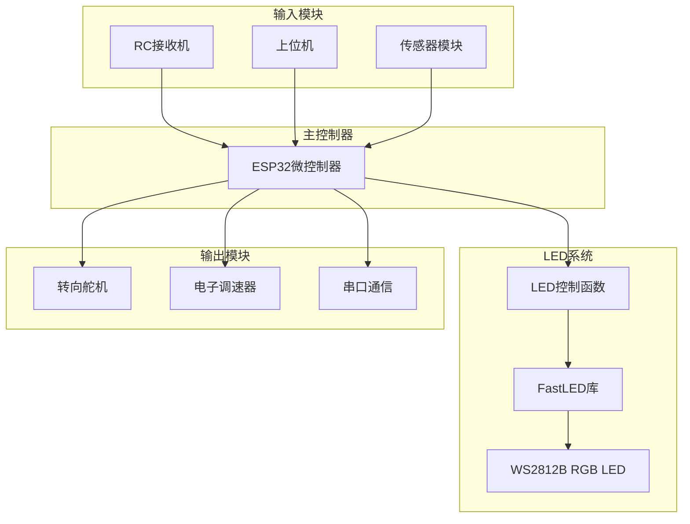
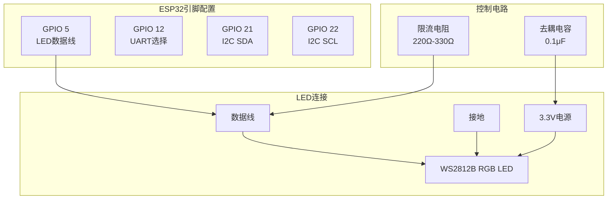
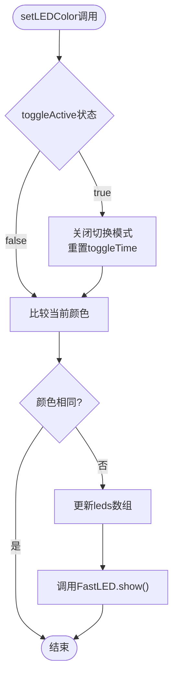
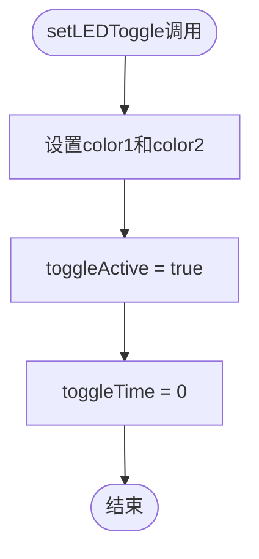
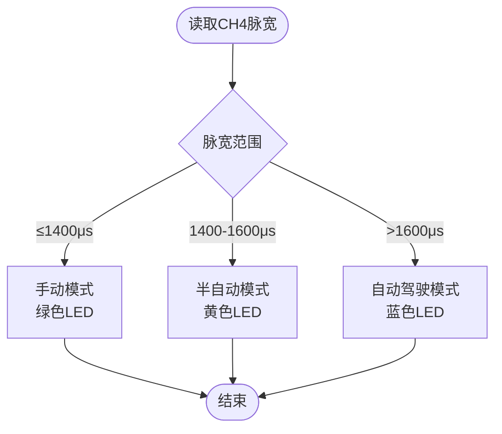
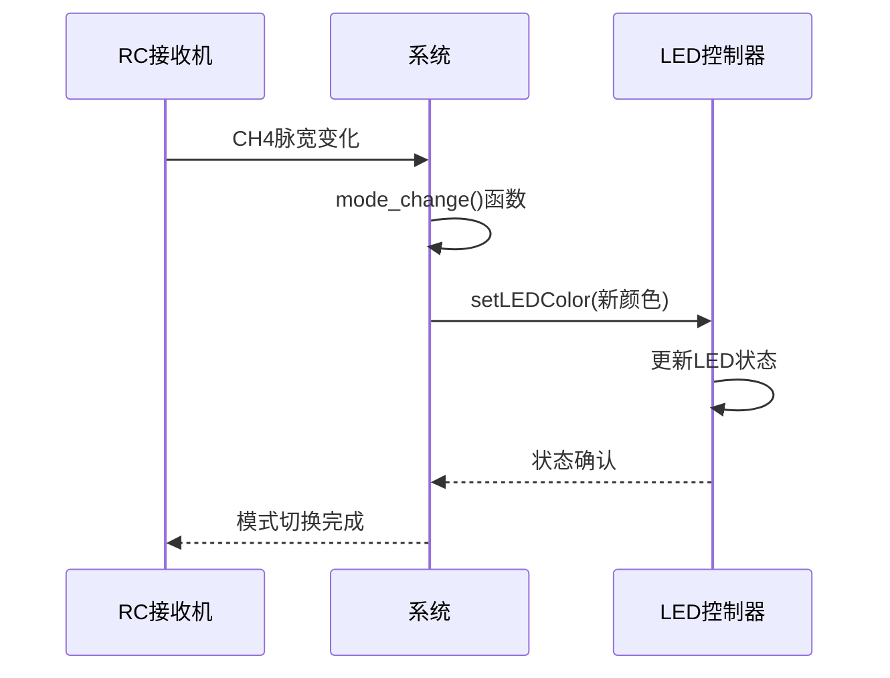
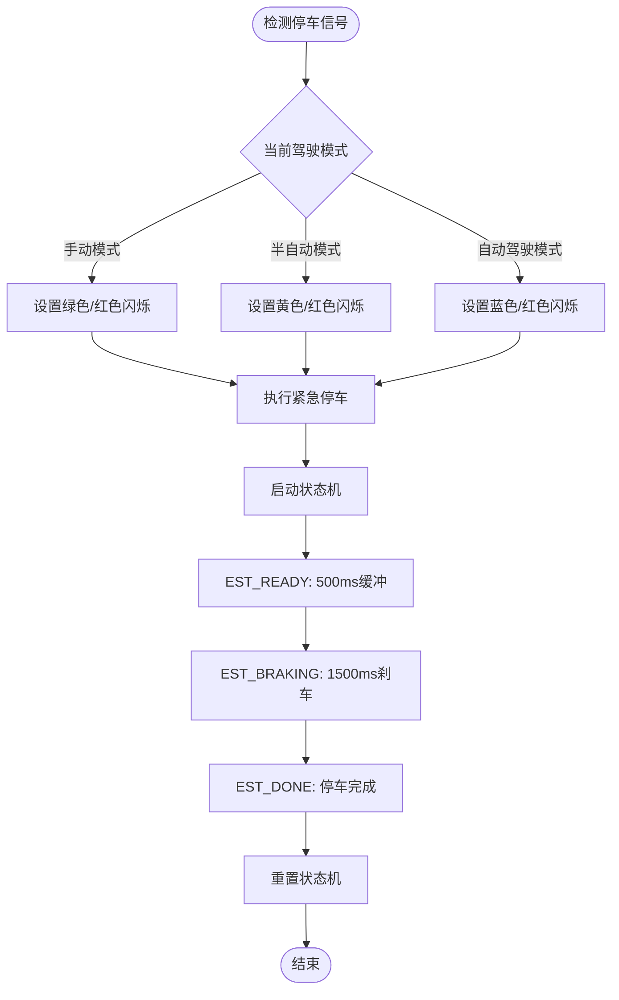
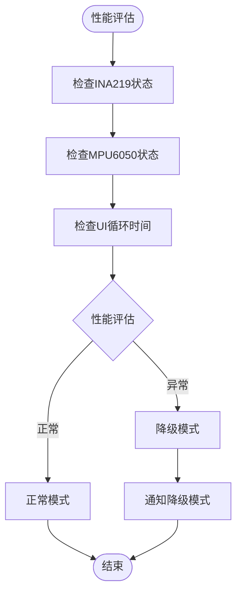

# LED状态指示系统

<cite>
**本文档引用的文件**
- [mus4.ino](file://mus4/mus4.ino)
- [pin_definitions.md](file://mus4/Doc/Hardware/pin_definitions.md)
- [architecture.md](file://mus4/Doc/Arch/architecture.md)
- [sketch.yaml](file://mus4/sketch.yaml)
- [README.md](file://README.md)
</cite>

## 目录
1. [简介](#简介)
2. [系统架构概述](#系统架构概述)
3. [LED硬件配置](#led硬件配置)
4. [LED状态指示逻辑](#led状态指示逻辑)
5. [驾驶模式与颜色编码](#驾驶模式与颜色编码)
6. [紧急停车状态处理](#紧急停车状态处理)
7. [LED控制代码实现](#led控制代码实现)
8. [刷新机制与性能优化](#刷新机制与性能优化)
9. [故障排除指南](#故障排除指南)
10. [最佳实践建议](#最佳实践建议)

## 简介

MUS4项目的LED状态指示系统是一个基于WS2812B RGB LED的状态反馈系统，为用户提供直观的系统状态可视化。该系统通过三种基本颜色（绿色、黄色、蓝色）和紧急停车时的双色闪烁效果，清晰地传达当前的驾驶模式和系统状态。

该LED指示系统集成在ESP32微控制器上，使用FastLED库进行控制，通过GPIO 5引脚连接WS2812B RGB LED，实现了实时的状态反馈功能。

## 系统架构概述

LED状态指示系统作为MUS4自动驾驶控制系统的重要组成部分，与以下核心模块协同工作：



**图表来源**
- [mus4.ino](file://mus4/mus4.ino#L1104-L1150)
- [architecture.md](file://mus4/Doc/Arch/architecture.md#L18-L45)

## LED硬件配置

### 硬件规格

| 参数 | 数值 | 说明 |
|------|------|------|
| LED类型 | WS2812B | 可编程RGB LED |
| 控制引脚 | GPIO 5 | 数据线连接 |
| LED数量 | 1个 | 系统状态指示灯 |
| 亮度 | 64/255 | 可调节亮度级别 |
| 颜色顺序 | GRB | FastLED默认颜色顺序 |

### 引脚连接配置



**图表来源**
- [pin_definitions.md](file://mus4/Doc/Hardware/pin_definitions.md#L74-L86)
- [mus4.ino](file://mus4/mus4.ino#L52-L56)

### FastLED库配置

系统使用FastLED库进行LED控制，配置参数如下：

- **LED类型**: WS2812B
- **颜色顺序**: GRB (Green-Red-Blue)
- **亮度控制**: 64/255 (约25%亮度)
- **刷新频率**: 60Hz (UI更新间隔16ms)

**章节来源**
- [mus4.ino](file://mus4/mus4.ino#L52-L56)
- [mus4.ino](file://mus4/mus4.ino#L1136-L1137)

## LED状态指示逻辑

### 基础控制函数

系统提供了两个核心LED控制函数来管理LED状态：

#### setLEDColor函数
用于设置LED的静态颜色状态：



**图表来源**
- [mus4.ino](file://mus4/mus4.ino#L241-L253)

#### setLEDToggle函数
用于设置LED的闪烁模式：



**图表来源**
- [mus4.ino](file://mus4/mus4.ino#L256-L262)

### 状态切换机制

LED状态切换通过scanLEDToggle函数实现：

```mermaid
sequenceDiagram
participant Loop as 主循环
participant Toggle as scanLEDToggle
participant LED as LED控制器
participant FastLED as FastLED库
Loop->>Toggle : 每次循环检查
Toggle->>Toggle : 检查toggleActive和定时器
alt 需要切换
Toggle->>LED : 切换到下一个颜色
LED->>FastLED : 调用show()
Toggle->>Toggle : 更新toggleTime
else 不需要切换
Toggle->>Loop : 返回
end
```

**图表来源**
- [mus4.ino](file://mus4/mus4.ino#L264-L274)

**章节来源**
- [mus4.ino](file://mus4/mus4.ino#L241-L274)

## 驾驶模式与颜色编码

### 颜色编码系统

系统采用标准化的颜色编码来表示不同的驾驶模式：

| 驾驶模式 | 颜色 | RGB值 | 用途 |
|----------|------|-------|------|
| 手动模式 | 绿色 | (0,255,0) | RC完全控制，转向和油门均由遥控器 |
| 半自动模式 | 黄色 | (255,255,0) | 自动转向，手动油门控制 |
| 自动驾驶模式 | 蓝色 | (0,0,255) | 上位机完全控制，自动转向和油门 |

### 模式检测逻辑

系统通过RC接收机的CH4通道检测当前驾驶模式：



**图表来源**
- [mus4.ino](file://mus4/mus4.ino#L771-L786)
- [architecture.md](file://mus4/Doc/Arch/architecture.md#L109-L116)

### 模式切换处理

当检测到模式变化时，系统会相应地更新LED状态：



**图表来源**
- [mus4.ino](file://mus4/mus4.ino#L771-L786)
- [mus4.ino](file://mus4/mus4.ino#L1170-L1239)

**章节来源**
- [mus4.ino](file://mus4/mus4.ino#L771-L786)
- [architecture.md](file://mus4/Doc/Arch/architecture.md#L109-L116)

## 紧急停车状态处理

### 紧急停车状态机

紧急停车状态机包含四个状态，LED显示相应的双色闪烁效果：

```mermaid
stateDiagram-v2
[*] --> EST_IDLE : 系统启动
state EST_IDLE {
[*] --> 空闲状态
note right : 等待停车信号
}
state EST_READY {
[*] --> 缓冲期
note right : 500ms<br/>油门设为15
}
state EST_BRAKING {
[*] --> 刹车期
note right : 1500ms<br/>油门设为-100
}
state EST_DONE {
[*] --> 完成状态
note right : 停车完成<br/>油门归零
}
EST_IDLE --> EST_READY : 触发停车且有油门
EST_IDLE --> EST_DONE : 触发停车且无油门
EST_READY --> EST_BRAKING : 缓冲完成
EST_BRAKING --> EST_DONE : 刹车完成
EST_DONE --> EST_IDLE : 解除停车信号
```

**图表来源**
- [architecture.md](file://mus4/Doc/Arch/architecture.md#L123-L151)

### LED闪烁模式

紧急停车时，LED采用双色闪烁模式，结合当前驾驶模式颜色和红色闪烁：

| 驾驶模式 | LED效果 | 说明 |
|----------|---------|------|
| 手动模式 | 绿色/红色交替闪烁 | 绿色为主，红色快速闪烁 |
| 半自动模式 | 黄色/红色交替闪烁 | 黄色为主，红色快速闪烁 |
| 自动驾驶模式 | 蓝色/红色交替闪烁 | 蓝色为主，红色快速闪烁 |

### 紧急停车处理流程



**图表来源**
- [mus4.ino](file://mus4/mus4.ino#L474-L525)
- [mus4.ino](file://mus4/mus4.ino#L1170-L1239)

**章节来源**
- [mus4.ino](file://mus4/mus4.ino#L474-L525)
- [mus4.ino](file://mus4/mus4.ino#L1170-L1239)

## LED控制代码实现

### 初始化配置

LED系统在setup()函数中进行初始化：

```mermaid
flowchart TD
Setup([setup()函数]) --> AttachLED["FastLED.addLeds()"]
AttachLED --> SetBrightness["FastLED.setBrightness()"]
SetBrightness --> SetInitialColor["setLEDColor(Blue)"]
SetInitialColor --> InitComplete["初始化完成"]
InitComplete --> Loop([loop()主循环])
```

**图表来源**
- [mus4.ino](file://mus4/mus4.ino#L1136-L1141)

### 主循环中的LED更新

在主循环中，LED状态根据当前模式和系统状态动态更新：

```mermaid
sequenceDiagram
participant Loop as 主循环
participant Mode as 模式检测
participant LED as LED控制
participant Toggle as 切换处理
Loop->>Mode : 检测当前模式
Mode->>LED : 设置相应颜色
Loop->>Toggle : scanLEDToggle()
Toggle->>LED : 处理闪烁状态
LED->>Loop : 状态更新完成
```

**图表来源**
- [mus4.ino](file://mus4/mus4.ino#L1152-L1289)

### 关键代码路径

- **LED初始化**: [mus4.ino](file://mus4/mus4.ino#L1136-L1141)
- **颜色设置函数**: [mus4.ino](file://mus4/mus4.ino#L241-L253)
- **闪烁设置函数**: [mus4.ino](file://mus4/mus4.ino#L256-L262)
- **闪烁扫描函数**: [mus4.ino](file://mus4/mus4.ino#L264-L274)
- **主循环LED处理**: [mus4.ino](file://mus4/mus4.ino#L1170-L1239)

**章节来源**
- [mus4.ino](file://mus4/mus4.ino#L1136-L1141)
- [mus4.ino](file://mus4/mus4.ino#L241-L274)
- [mus4.ino](file://mus4/mus4.ino#L1170-L1239)

## 刷新机制与性能优化

### 刷新频率控制

系统采用多层刷新机制来平衡LED响应速度和系统性能：

| 组件 | 刷新频率 | 说明 |
|------|----------|------|
| LED刷新 | 60Hz (16ms) | UI更新间隔 |
| 模式检测 | 60Hz (16ms) | RC数据更新 |
| 传感器更新 | 1Hz (1000ms) | 传感器数据更新 |
| 串口通信 | 60Hz (16ms) | 状态反馈 |

### 性能监控

系统内置性能监控机制，通过evalDegrade()函数检测系统性能问题：



**图表来源**
- [mus4.ino](file://mus4/mus4.ino#L290-L305)

### 优化策略

1. **条件更新**: 只在颜色变化时调用FastLED.show()
2. **定时器控制**: 使用toggleInterval控制闪烁频率
3. **性能自适应**: 根据系统负载调整UI更新频率
4. **内存优化**: 使用单LED数组减少内存占用

**章节来源**
- [mus4.ino](file://mus4/mus4.ino#L290-L305)
- [mus4.ino](file://mus4/mus4.ino#L1282-L1289)

## 故障排除指南

### 常见问题诊断

#### LED不亮问题

**症状**: WS2812B LED完全不亮

**可能原因**:
1. 硬件连接错误
2. 电源供应不足
3. FastLED库初始化失败
4. 引脚配置错误

**解决方案**:
1. 检查GPIO 5连接到LED数据引脚
2. 验证3.3V电源供应
3. 确认FastLED初始化成功
4. 验证LED_PIN定义为5

#### 颜色显示异常

**症状**: LED显示颜色不正确或闪烁异常

**可能原因**:
1. 颜色顺序配置错误
2. 亮度设置不当
3. 闪烁定时器问题
4. 模式切换逻辑错误

**解决方案**:
1. 检查COLOR_ORDER设置为GRB
2. 调整BRIGHTNESS参数
3. 验证toggleInterval设置
4. 检查模式检测逻辑

#### 性能问题

**症状**: LED响应缓慢或系统卡顿

**可能原因**:
1. 刷新频率过高
2. 传感器数据读取阻塞
3. UI更新过于频繁
4. 内存泄漏

**解决方案**:
1. 调整UI_UPDATE_INTERVAL
2. 优化传感器读取频率
3. 实施性能监控
4. 检查内存使用情况

### 调试工具

系统提供了多种调试功能来帮助故障排除：

- **单元测试**: runUnitTests()函数
- **基准测试**: runBenchmarks()函数  
- **压力测试**: runStress()函数
- **回归测试**: runRegression()函数

### 诊断命令

通过串口可以执行以下诊断命令：

| 命令 | 功能 | 说明 |
|------|------|------|
| TEST | 单元测试 | 运行所有单元测试 |
| BENCH | 基准测试 | 测试系统性能 |
| STRESS | 压力测试 | 检查系统稳定性 |
| REGRESS | 回归测试 | 验证功能正确性 |

**章节来源**
- [mus4.ino](file://mus4/mus4.ino#L153-L200)
- [mus4.ino](file://mus4/mus4.ino#L355-L397)

## 最佳实践建议

### 硬件设计建议

1. **电源设计**
   - 使用独立的LED电源，避免与主系统共享
   - 添加限流电阻保护LED
   - 考虑添加去耦电容

2. **信号完整性**
   - 使用适当的走线长度匹配
   - 避免在高频信号线上并联多个LED
   - 考虑添加终端电阻

3. **热管理**
   - 确保LED有足够的散热空间
   - 避免长时间满亮度运行
   - 考虑温度补偿

### 软件设计建议

1. **代码组织**
   - 将LED控制逻辑封装在独立函数中
   - 使用状态枚举提高代码可读性
   - 实现错误处理和恢复机制

2. **性能优化**
   - 实施条件更新机制
   - 使用定时器而非delay()
   - 优化内存使用

3. **可维护性**
   - 添加详细的注释和文档
   - 实现配置参数化
   - 建立测试框架

### 集成建议

1. **系统集成**
   - 将LED状态与系统状态同步
   - 实现状态一致性检查
   - 建立故障传播机制

2. **用户体验**
   - 提供视觉反馈的渐变效果
   - 实现状态变化的平滑过渡
   - 考虑不同环境光条件

### 维护建议

1. **定期检查**
   - 检查LED连接和电源
   - 验证颜色显示准确性
   - 监控系统性能指标

2. **升级策略**
   - 保持代码模块化
   - 实现向后兼容性
   - 建立版本控制系统

通过遵循这些最佳实践，可以确保LED状态指示系统稳定可靠地运行，并为用户提供准确直观的状态反馈。