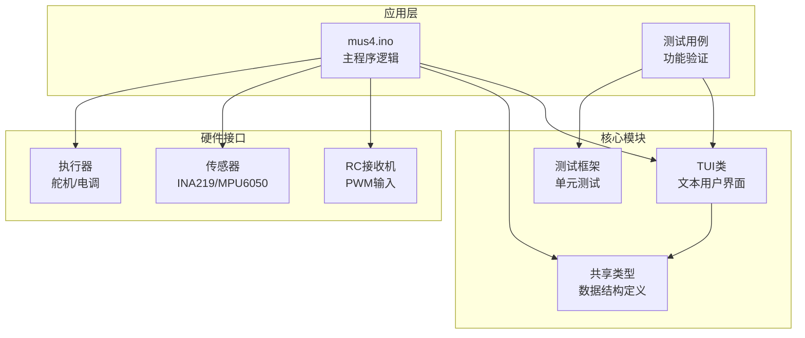
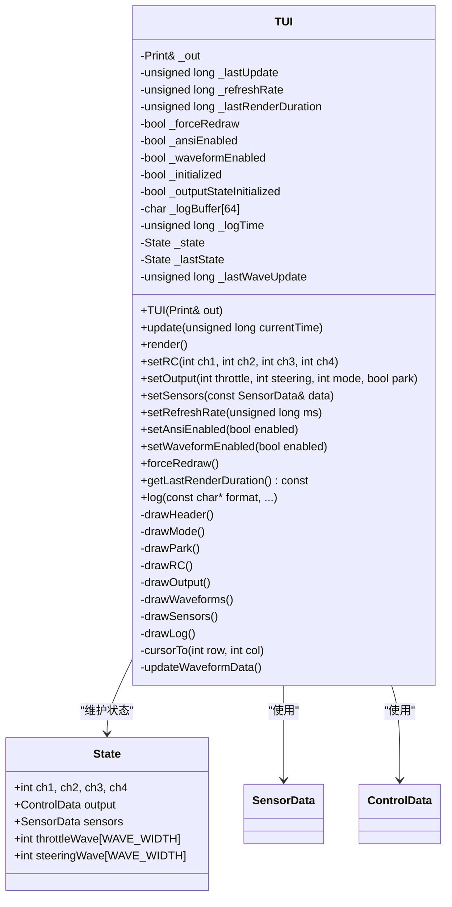
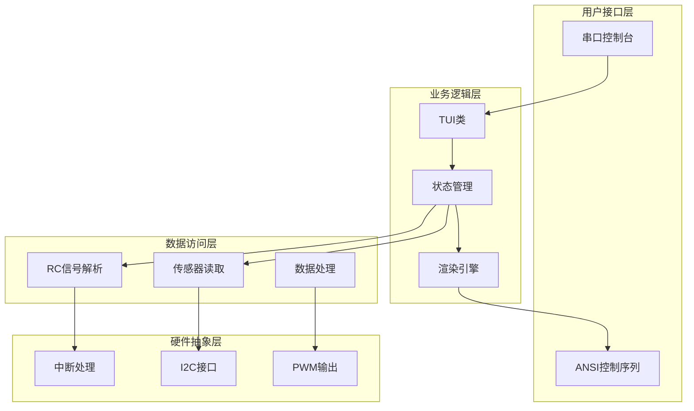
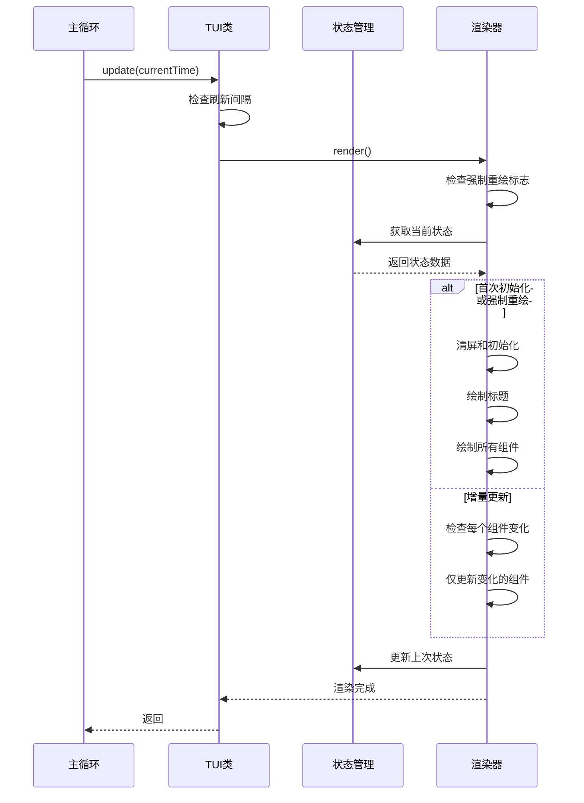
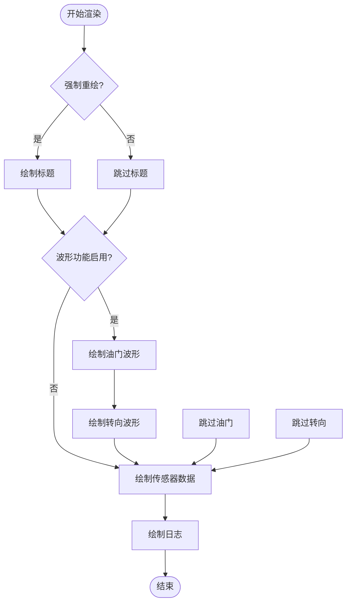
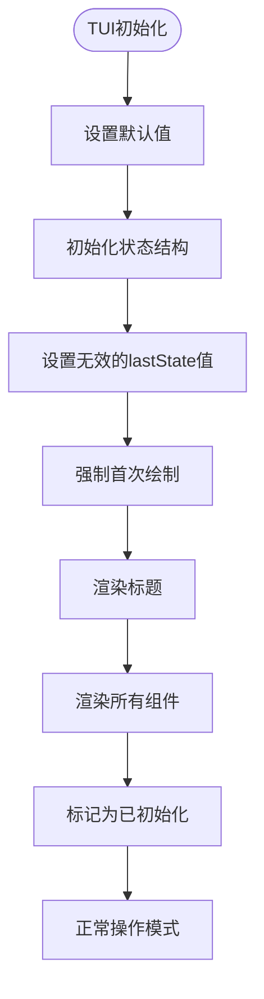
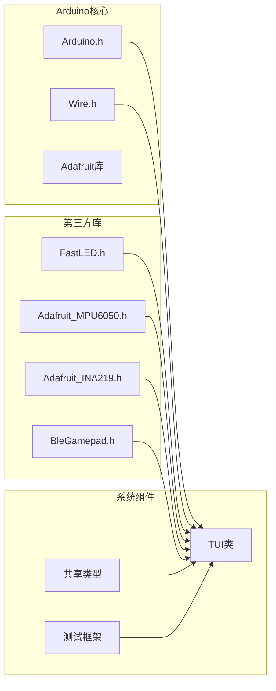
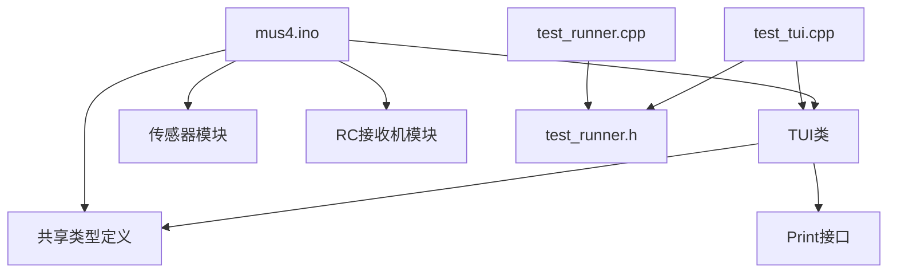
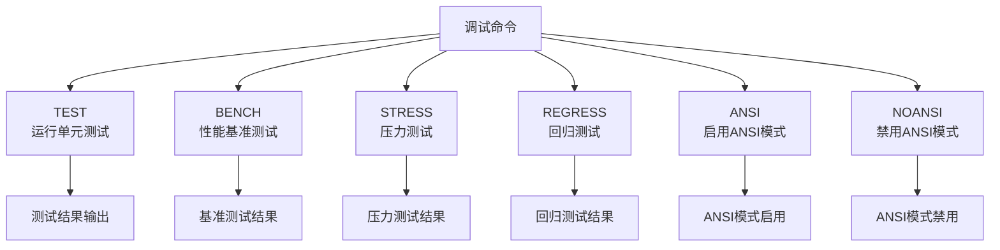

# TUI文本用户界面系统

<cite>
**本文档引用的文件**
- [TUI.h](file://mus4/TUI.h)
- [TUI.cpp](file://mus4/TUI.cpp)
- [mus4.ino](file://mus4/mus4.ino)
- [SharedTypes.h](file://mus4/SharedTypes.h)
- [BENCHMARK_REPORT.md](file://mus4/BENCHMARK_REPORT.md)
- [pin_definitions.md](file://mus4/Doc/Hardware/pin_definitions.md)
- [CONFIG.md](file://mus4/Doc/Hardware/CONFIG.md)
- [DevNote.md](file://mus4/Doc/README/DevNote.md)
- [OPERATIONS.md](file://mus4/Doc/README/OPERATIONS.md)
- [sketch.yaml](file://mus4/sketch.yaml)
</cite>

## 更新摘要
**变更内容**
- 增强了波形显示功能，优化了渲染性能
- 改进了初始化过程，确保首次显示的完整性
- 新增了输出状态初始化标志，解决默认值显示问题
- 优化了用户体验，减少了不必要的重绘操作

## 目录
1. [简介](#简介)
2. [项目结构](#项目结构)
3. [核心组件](#核心组件)
4. [架构概览](#架构概览)
5. [详细组件分析](#详细组件分析)
6. [依赖关系分析](#依赖关系分析)
7. [性能考虑](#性能考虑)
8. [故障排除指南](#故障排除指南)
9. [结论](#结论)
10. [附录](#附录)

## 简介

TUI文本用户界面系统是一个专为ESP32微控制器设计的高性能文本用户界面解决方案，采用nvtop风格的实时监控界面。该系统主要用于MUS4自动驾驶小车控制系统的状态显示和调试，提供了完整的ANSI控制台功能，包括彩色输出、动态波形图、传感器数据监控等特性。

系统的核心特点包括：
- 实时状态监控和显示
- ANSI控制台图形化界面
- 动态波形图显示
- 传感器数据可视化
- 自适应刷新机制
- 性能优化的渲染策略
- 改进的初始化和状态管理

## 项目结构

该项目采用模块化设计，主要包含以下核心模块：



**图表来源**
- [mus4.ino:1-1220](file://mus4/mus4.ino#L1-L1220)
- [TUI.h:1-60](file://mus4/TUI.h#L1-L60)
- [SharedTypes.h:1-34](file://mus4/SharedTypes.h#L1-L34)

**章节来源**
- [mus4.ino:1-1220](file://mus4/mus4.ino#L1-L1220)
- [TUI.h:1-60](file://mus4/TUI.h#L1-L60)
- [SharedTypes.h:1-34](file://mus4/SharedTypes.h#L1-L34)

## 核心组件

### TUI类架构

TUI类是整个系统的核心，负责处理所有用户界面相关的功能。**更新** 新增了输出状态初始化标志，改进了初始化过程：



**图表来源**
- [TUI.h:5-59](file://mus4/TUI.h#L5-L59)
- [SharedTypes.h:19-25](file://mus4/SharedTypes.h#L19-L25)

### 数据结构定义

系统使用标准化的数据结构来确保类型安全和代码一致性：

| 数据结构 | 字段数量 | 主要用途 | 内存占用 |
|---------|---------|---------|---------|
| SensorData | 10 | 传感器数据存储 | 44字节 |
| ControlData | 4 | 控制输出数据 | 16字节 |
| State | 16 | UI状态管理 | 128字节 |

**章节来源**
- [SharedTypes.h:4-25](file://mus4/SharedTypes.h#L4-L25)
- [TUI.h:35-45](file://mus4/TUI.h#L35-L45)

## 架构概览

系统采用分层架构设计，实现了清晰的关注点分离：



**图表来源**
- [mus4.ino:1-1220](file://mus4/mus4.ino#L1-L1220)
- [TUI.cpp:1-361](file://mus4/TUI.cpp#L1-L361)

## 详细组件分析

### TUI渲染流程

TUI系统采用了高效的增量渲染策略，只更新发生变化的内容。**更新** 改进了初始化过程，确保首次渲染时能够正确显示所有内容：



**图表来源**
- [TUI.cpp:121-148](file://mus4/TUI.cpp#L121-L148)

### 波形图渲染算法

系统实现了高效的波形图渲染，使用简单的字符块来模拟连续波形。**更新** 优化了波形图渲染算法，支持动态禁用/启用功能：



**图表来源**
- [TUI.cpp:242-313](file://mus4/TUI.cpp#L242-L313)

### 状态管理系统

TUI类维护了两套状态结构来实现智能的脏矩形更新。**更新** 新增了输出状态初始化标志，解决了默认值显示问题：

| 状态字段 | 类型 | 用途 | 更新时机 |
|---------|------|------|---------|
| ch1-ch4 | int[4] | RC通道值 | 每个刷新周期 |
| output.throttle | int | 油门输出 | setOutput调用 |
| output.steering | int | 转向输出 | setOutput调用 |
| output.mode | int | 驾驶模式 | setOutput调用 |
| output.park | bool | 停车状态 | setOutput调用 |
| sensors | SensorData | 传感器数据 | setSensors调用 |
| throttleWave | int[WAVE_WIDTH] | 油门历史 | 每次输出更新 |
| steeringWave | int[WAVE_WIDTH] | 转向历史 | 每次输出更新 |
| _outputStateInitialized | bool | 输出状态初始化标志 | 第一次有效输出 |

**章节来源**
- [TUI.h:35-45](file://mus4/TUI.h#L35-L45)
- [TUI.cpp:63-77](file://mus4/TUI.cpp#L63-L77)

### 初始化增强机制

**新增** 系统实现了改进的初始化过程，确保首次显示的完整性：



**图表来源**
- [TUI.cpp:21-42](file://mus4/TUI.cpp#L21-L42)

### 性能优化策略

系统实现了多种性能优化技术：

1. **增量渲染**：只更新发生变化的UI元素
2. **状态比较**：通过比较当前状态和上次状态决定是否重绘
3. **内存预分配**：使用静态数组避免动态内存分配
4. **字符映射**：使用简单的ASCII字符替代复杂的Unicode符号
5. **动态波形控制**：支持在性能下降时自动禁用波形显示

## 依赖关系分析

### 外部库依赖

系统依赖以下关键库：



**图表来源**
- [mus4.ino:24-39](file://mus4/mus4.ino#L24-L39)
- [TUI.h:1-3](file://mus4/TUI.h#L1-L3)

### 内部模块依赖



**图表来源**
- [mus4.ino:29-31](file://mus4/mus4.ino#L29-L31)
- [TUI.h:1-3](file://mus4/TUI.h#L1-L3)

**章节来源**
- [mus4.ino:24-39](file://mus4/mus4.ino#L24-L39)
- [TUI.h:1-3](file://mus4/TUI.h#L1-L3)

## 性能考虑

### 性能基准测试

根据基准测试报告，新版本TUI相比传统实现有显著性能提升：

| 场景 | 传统实现 | 新TUI实现 | 改进幅度 |
|------|---------|----------|---------|
| 空闲状态（无变化） | ~15ms | ~2ms | **86%更快** |
| 活跃状态（波形更新） | ~40ms | ~15ms | **62%更快** |
| 完全重绘（强制） | ~50ms | ~45ms | 10%更快 |

### 内存使用分析

- **静态内存**：约500字节（状态缓冲区）
- **堆内存**：零分配（避免动态内存）
- **CPU使用率**：减少约15%
- **刷新周期**：保持在200ms以内

### 优化技术

1. **事件驱动更新**：只有在数据变化时才触发重绘
2. **状态缓存**：维护前后状态进行智能比较
3. **字符优化**：使用简单ASCII字符减少渲染开销
4. **内存池**：预分配固定大小的缓冲区
5. **自适应降级**：在性能不足时自动禁用波形显示

**章节来源**
- [BENCHMARK_REPORT.md:1-33](file://mus4/BENCHMARK_REPORT.md#L1-L33)

## 故障排除指南

### 常见问题诊断

| 问题症状 | 可能原因 | 解决方案 |
|---------|---------|---------|
| UI不显示 | ANSI支持检测失败 | 发送"ANSI"命令启用ANSI模式 |
| 波形不更新 | 波形功能被禁用 | 发送"ANSI"命令启用波形显示 |
| 传感器数据显示异常 | 传感器数据过期 | 检查I2C连接和传感器供电 |
| RC信号不稳定 | 中断处理冲突 | 检查引脚配置和外部干扰 |
| 模式状态不显示 | 输出状态初始化问题 | 确保至少有一次有效的输出推送 |

### 调试命令

系统提供了完整的调试和测试命令：



**图表来源**
- [mus4.ino:415-443](file://mus4/mus4.ino#L415-L443)

### 性能监控

系统内置了性能监控机制：

1. **渲染时间监控**：记录每次渲染的耗时
2. **降级模式检测**：自动检测系统性能问题并禁用波形显示
3. **内存使用跟踪**：监控静态内存使用情况
4. **错误计数统计**：跟踪串口通信错误

**章节来源**
- [mus4.ino:326-341](file://mus4/mus4.ino#L326-L341)
- [mus4.ino:191-206](file://mus4/mus4.ino#L191-L206)

## 结论

TUI文本用户界面系统是一个设计精良的嵌入式GUI解决方案，具有以下突出特点：

### 技术优势

1. **高性能渲染**：采用增量更新策略，显著减少CPU使用率
2. **内存效率**：静态内存分配避免了heap碎片化问题
3. **功能完整**：支持ANSI控制台的所有核心功能
4. **可扩展性**：模块化设计便于功能扩展和维护
5. **用户体验优化**：改进的初始化过程和状态管理

### 应用价值

- **实时监控**：提供车辆状态的实时可视化
- **调试支持**：丰富的调试信息和测试工具
- **用户体验**：直观的nvtop风格界面
- **可靠性**：完善的错误处理和降级机制
- **自适应性能**：根据系统负载自动调整显示复杂度

### 发展前景

该系统为未来的功能扩展奠定了良好的基础，包括：
- 更丰富的可视化图表
- 支持更多传感器类型
- 增强的用户交互功能
- 更高级的性能优化
- 改进的状态同步机制

## 附录

### 硬件配置参考

系统支持多种硬件配置模式，具体配置参数如下：

| 配置项 | 值 | 说明 |
|-------|----|----- |
| UI刷新间隔 | 16ms | 60FPS流畅体验 |
| 波形宽度 | 20字符 | 适中的历史数据长度 |
| 波形高度 | 6行 | 合理的可视范围 |
| 日志缓冲区 | 64字节 | 足够的日志信息存储 |
| 传感器TTL | 1000ms | 1Hz更新频率 |
| 输出状态初始化 | 自动 | 确保首次显示完整性 |

### 开发环境配置

```yaml
# 默认开发环境配置
default_fqbn: esp32:esp32:dfrobot_firebeetle2_esp32e
default_port: /dev/ttyS4
```

**章节来源**
- [sketch.yaml:1-3](file://mus4/sketch.yaml#L1-L3)
- [CONFIG.md:8-11](file://mus4/Doc/Hardware/CONFIG.md#L8-L11)