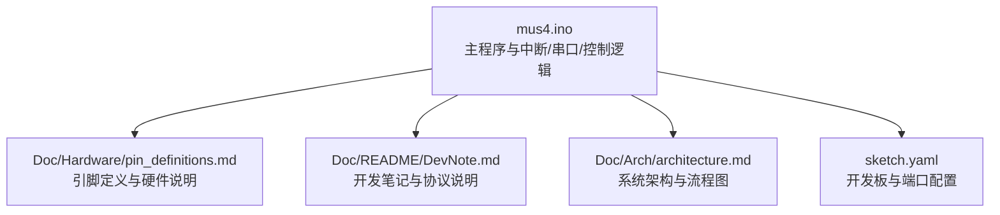
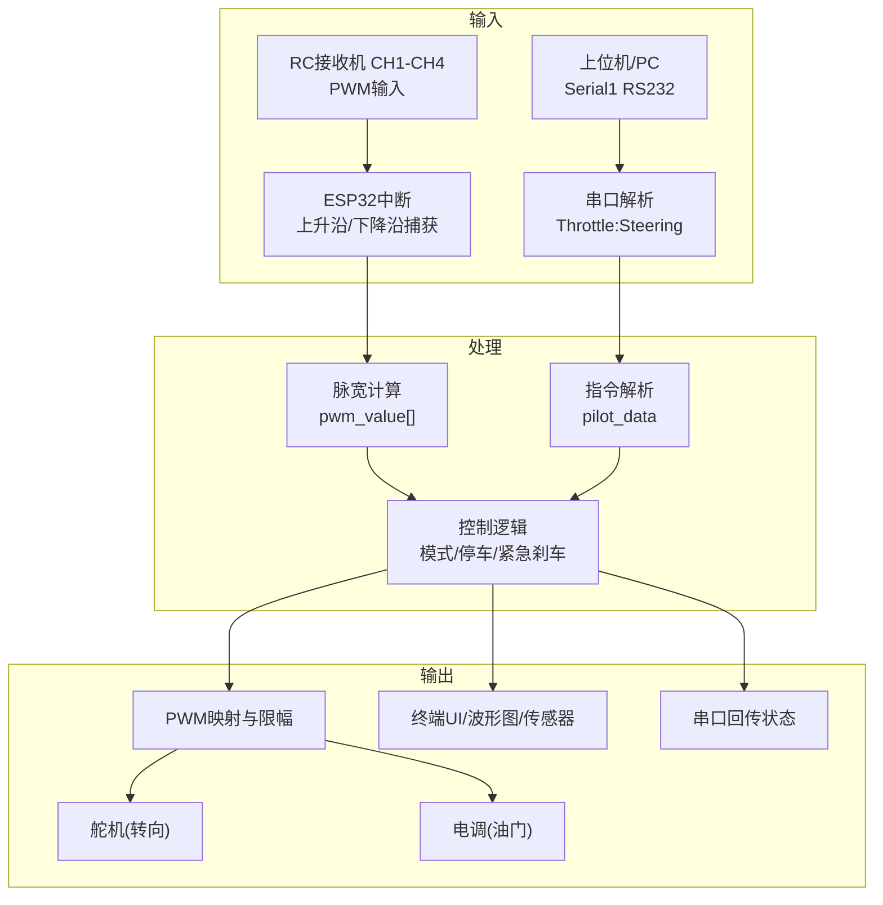
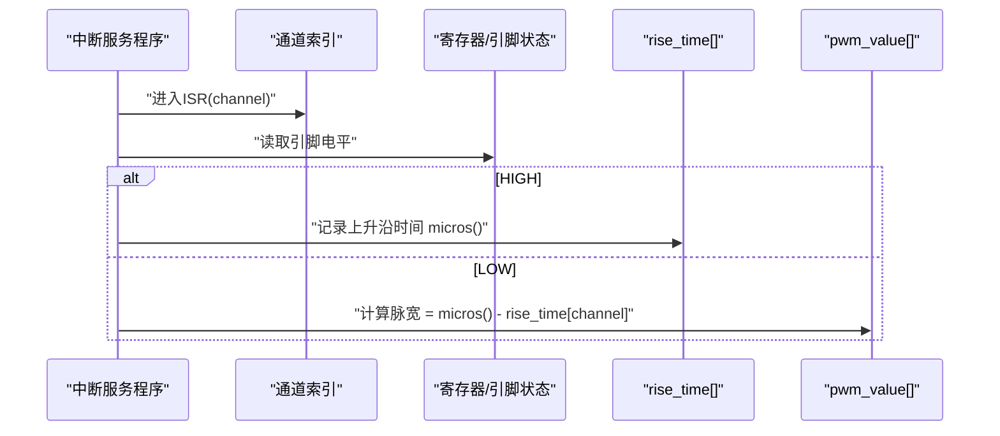
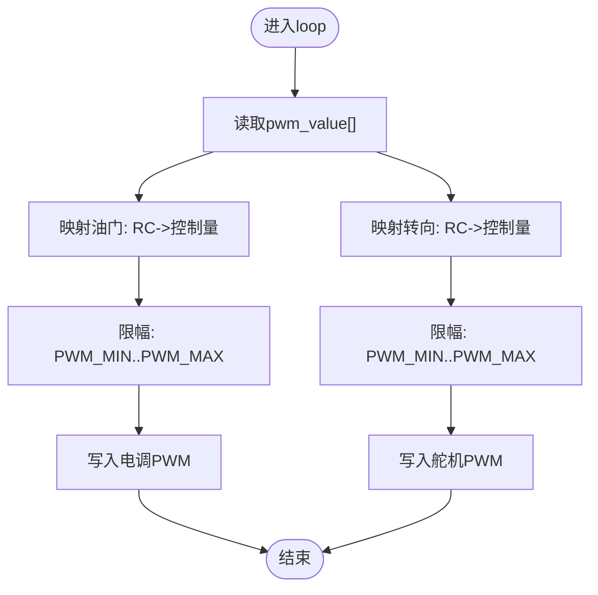
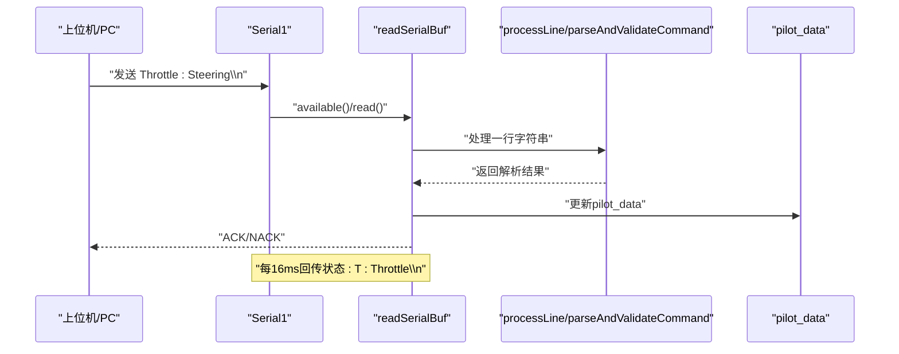
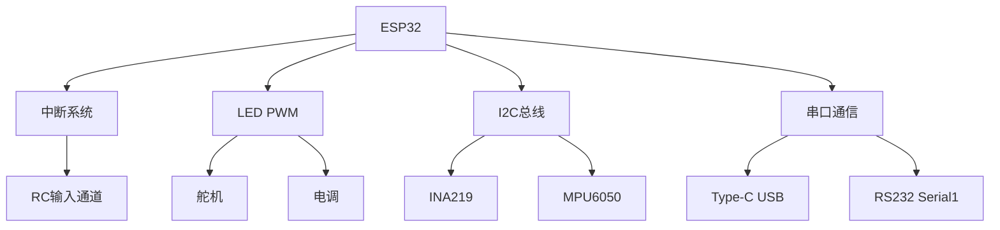

# 信号处理与中断

<cite>
**本文引用的文件**
- [mus4.ino](file://mus4/mus4.ino)
- [pin_definitions.md](file://mus4/Doc/Hardware/pin_definitions.md)
- [DevNote.md](file://mus4/Doc/README/DevNote.md)
- [architecture.md](file://mus4/Doc/Arch/architecture.md)
- [sketch.yaml](file://mus4/sketch.yaml)
</cite>

## 目录
1. [简介](#简介)
2. [项目结构](#项目结构)
3. [核心组件](#核心组件)
4. [架构总览](#架构总览)
5. [详细组件分析](#详细组件分析)
6. [依赖关系分析](#依赖关系分析)
7. [性能考量](#性能考量)
8. [故障排查指南](#故障排查指南)
9. [结论](#结论)
10. [附录](#附录)

## 简介
本文件聚焦于MUS4项目的信号处理与中断机制，围绕ESP32的RC接收机PWM信号采集、中断处理、脉宽计算、双串口通信（Type-C USB与RS232）以及上位机指令解析进行深入剖析。文档同时提供中断服务程序的实现细节、性能优化建议与实时信号处理的关键技术说明，帮助开发者快速理解并高效迭代该控制系统。

## 项目结构
MUS4项目采用“单文件主程序 + 文档说明”的组织方式，核心逻辑集中在mus4.ino，硬件引脚与协议说明位于Doc目录，架构与流程图见Arch文档。

图表来源
- [mus4.ino](file://mus4/mus4.ino#L1-L200)
- [pin_definitions.md](file://mus4/Doc/Hardware/pin_definitions.md#L1-L120)
- [DevNote.md](file://mus4/Doc/README/DevNote.md#L1-L122)
- [architecture.md](file://mus4/Doc/Arch/architecture.md#L1-L160)
- [sketch.yaml](file://mus4/sketch.yaml#L1-L3)

章节来源
- [mus4.ino](file://mus4/mus4.ino#L1-L200)
- [pin_definitions.md](file://mus4/Doc/Hardware/pin_definitions.md#L1-L120)
- [DevNote.md](file://mus4/Doc/README/DevNote.md#L1-L122)
- [architecture.md](file://mus4/Doc/Arch/architecture.md#L1-L160)
- [sketch.yaml](file://mus4/sketch.yaml#L1-L3)

## 核心组件
- RC接收机PWM输入通道（CH1-CH4）：通过ESP32中断捕获上升沿/下降沿，计算脉宽（微秒级）。
- 中断处理子系统：每个通道绑定独立ISR，记录rise_time并在下降沿计算pwm_value。
- 串口通信子系统：双串口设计（Serial USB与Serial1 RS232），分别用于调试与上位机通信。
- 上位机指令解析：Throttle:Steering格式，支持可选校验和，范围校验与映射。
- 执行器输出：舵机（转向）与电调（油门）PWM输出，基于控制量映射到脉宽并限幅。
- UI与反馈：终端UI、波形图、传感器数据展示与降级模式提示。

章节来源
- [mus4.ino](file://mus4/mus4.ino#L41-L81)
- [mus4.ino](file://mus4/mus4.ino#L414-L434)
- [mus4.ino](file://mus4/mus4.ino#L344-L411)
- [mus4.ino](file://mus4/mus4.ino#L1104-L1150)
- [mus4.ino](file://mus4/mus4.ino#L1269-L1279)

## 架构总览
系统采用“中断采集 + 串口解析 + 控制逻辑 + 执行输出”的流水线式处理，数据流如下：

图表来源
- [architecture.md](file://mus4/Doc/Arch/architecture.md#L18-L45)
- [mus4.ino](file://mus4/mus4.ino#L1126-L1131)
- [mus4.ino](file://mus4/mus4.ino#L1162-L1163)
- [mus4.ino](file://mus4/mus4.ino#L1269-L1279)

## 详细组件分析

### RC接收机PWM信号采集与中断处理
- 通道定义与引脚：CH1/CH2/CH3/CH4分别对应GPIO 36/39/34/26，均为仅输入引脚。
- 中断绑定：在setup中为每个通道调用attachInterrupt(CHANGE)，绑定独立的ISR函数数组。
- 中断服务程序：handle_interrupt(channel)中读取当前引脚电平，若为HIGH则记录rise_time，若为LOW则计算pwm_value = micros() - rise_time。
- 原子访问：pwm_value与rise_time声明为volatile，避免编译器优化导致的竞态。

图表来源
- [mus4.ino](file://mus4/mus4.ino#L414-L426)
- [mus4.ino](file://mus4/mus4.ino#L1126-L1131)
- [pin_definitions.md](file://mus4/Doc/Hardware/pin_definitions.md#L34-L46)

章节来源
- [mus4.ino](file://mus4/mus4.ino#L41-L81)
- [mus4.ino](file://mus4/mus4.ino#L414-L434)
- [mus4.ino](file://mus4/mus4.ino#L1126-L1131)
- [pin_definitions.md](file://mus4/Doc/Hardware/pin_definitions.md#L34-L46)

### 脉宽计算与映射
- 脉宽单位：微秒（μs），通过ESP32的micros()计时函数实现高精度测量。
- 计算公式：pwm_value[channel] = micros() - rise_time[channel]。
- 范围校准：RC通道脉宽存在最小/中/最大值，系统提供RC_THROTTLE_MIN/MID/MAX与RC_STEERING_MIN/MID/MAX常量。
- 控制量映射：将-100~100的控制量映射到SERVO_MID±SERVO_RANGE或MOTOR_MID±MOTOR_RANGE，再经constrain限制在PWM_MIN~PWM_MAX范围内，最后写入LED PWM通道。

图表来源
- [mus4.ino](file://mus4/mus4.ino#L1235-L1279)
- [mus4.ino](file://mus4/mus4.ino#L449-L456)
- [mus4.ino](file://mus4/mus4.ino#L440-L447)

章节来源
- [mus4.ino](file://mus4/mus4.ino#L1235-L1279)
- [mus4.ino](file://mus4/mus4.ino#L449-L456)
- [mus4.ino](file://mus4/mus4.ino#L440-L447)

### 双串口通信与指令解析
- 串口对象：
  - Serial（Type-C USB）：波特率115200，用于调试与本地交互。
  - Serial1（RS232）：GPIO 16(RX)/17(TX)，波特率115200，用于与上位机通信。
- 指令格式：Throttle:Steering\n，其中Throttle与Steering为-100~100整数。
- 解析流程：
  - readSerialBuf逐字节读取，遇到换行即处理一行。
  - 支持可选校验和（*HH），先计算payload校验和并与期望比较，不匹配则返回错误。
  - parseAndValidateCommand按冒号分割，转为整型并校验范围[-100,100]。
  - 成功后更新pilot_data并回传ACK/NACK。
- 回传格式：每16ms一次“T:Throttle\n”（Type-C侧），供上位机订阅。

图表来源
- [mus4.ino](file://mus4/mus4.ino#L1110-L1114)
- [mus4.ino](file://mus4/mus4.ino#L344-L411)
- [mus4.ino](file://mus4/mus4.ino#L1249-L1253)
- [DevNote.md](file://mus4/Doc/README/DevNote.md#L24-L30)

章节来源
- [mus4.ino](file://mus4/mus4.ino#L1110-L1114)
- [mus4.ino](file://mus4/mus4.ino#L344-L411)
- [mus4.ino](file://mus4/mus4.ino#L1249-L1253)
- [DevNote.md](file://mus4/Doc/README/DevNote.md#L24-L30)

### 执行器PWM输出与LED状态
- PWM输出：
  - 舵机（转向）：GPIO 23，50Hz，14bit分辨率；映射范围SERVO_MID±SERVO_RANGE。
  - 电调（油门）：GPIO 25，50Hz，14bit分辨率；映射范围MOTOR_MID±MOTOR_RANGE。
  - 通过ledcWriteChannel写入脉宽值。
- LED状态：
  - 绿色：手动模式
  - 黄色：半自动模式
  - 蓝色：全自动模式
  - 红色闪烁：紧急刹车状态

章节来源
- [mus4.ino](file://mus4/mus4.ino#L1133-L1134)
- [mus4.ino](file://mus4/mus4.ino#L1269-L1279)
- [DevNote.md](file://mus4/Doc/README/DevNote.md#L53-L66)

### UI与降级模式评估
- UI更新周期：约16ms，支持动态调整刷新间隔以平衡性能与体验。
- 波形图：滚动显示最近40帧的油门/转向曲线。
- 降级模式：当UI单次循环耗时超过阈值或传感器无效时，进入降级模式并提示。

章节来源
- [mus4.ino](file://mus4/mus4.ino#L109-L112)
- [mus4.ino](file://mus4/mus4.ino#L587-L684)
- [mus4.ino](file://mus4/mus4.ino#L290-L305)

## 依赖关系分析
- 硬件依赖：
  - ESP32仅输入引脚（GPIO 34/36/39）用于RC输入，GPIO 23/25用于PWM输出。
  - I2C（SDA=21, SCL=22）用于传感器读取。
- 软件依赖：
  - 中断：ESP32 attachInterrupt + ISR数组。
  - 串口：Serial/Serial1对象与缓冲区结构体。
  - PWM：ESP32 ledc库。
  - 传感器：Adafruit_INA219/MPU6050库。
  - LED：FastLED库。
  - 可选：BLE Gamepad库（宏开启时）。

图表来源
- [pin_definitions.md](file://mus4/Doc/Hardware/pin_definitions.md#L13-L28)
- [mus4.ino](file://mus4/mus4.ino#L1119-L1123)
- [mus4.ino](file://mus4/mus4.ino#L1133-L1134)

章节来源
- [pin_definitions.md](file://mus4/Doc/Hardware/pin_definitions.md#L13-L28)
- [mus4.ino](file://mus4/mus4.ino#L1119-L1123)
- [mus4.ino](file://mus4/mus4.ino#L1133-L1134)

## 性能考量
- 中断处理：
  - ISR内仅做必要操作（读取引脚、记录时间、计算脉宽），避免复杂运算与阻塞。
  - 使用volatile保证多任务环境下数据可见性。
- 串口解析：
  - 使用固定大小缓冲区与溢出检测，避免内存越界。
  - 校验和计算与范围校验在loop中完成，减少异常路径开销。
- PWM映射与限幅：
  - 将控制量映射到脉宽后立即constrain，降低后续处理分支成本。
- UI与传感器：
  - 传感器与UI更新采用定时器节流，避免频繁I/O影响实时性。
- 优化建议：
  - 若CPU占用偏高，可考虑将部分非关键UI绘制移出主循环或进一步降低刷新频率。
  - 串口解析可引入DMA或队列化策略（当前为轮询+缓冲，满足实时性需求）。
  - 对RC输入可增加去抖与边界容错，提升鲁棒性。

章节来源
- [mus4.ino](file://mus4/mus4.ino#L414-L426)
- [mus4.ino](file://mus4/mus4.ino#L344-L411)
- [mus4.ino](file://mus4/mus4.ino#L1269-L1279)
- [mus4.ino](file://mus4/mus4.ino#L1155-L1160)

## 故障排查指南
- RC信号异常：
  - 确认GPIO 34/36/39为输入模式且无上拉/下拉电阻，接收机信号稳定。
  - 检查中断绑定是否成功，确认ISR数组与通道一一对应。
- 串口通信问题：
  - 检查RS232接线与波特率（115200），确认GPIO 16/17连接正确。
  - 若上位机未收到ACK，检查readSerialBuf的换行与回传逻辑。
- PWM输出异常：
  - 确认ledc通道已attach，频率与分辨率设置正确。
  - 检查映射与限幅是否生效，避免超出范围导致输出异常。
- 传感器数据无效：
  - I2C扫描与初始化失败时，检查SDA/SCL连线与上拉电阻。
- 紧急刹车状态机：
  - 若刹车未触发或无法恢复，检查park标志与emergencyStop状态机逻辑。

章节来源
- [pin_definitions.md](file://mus4/Doc/Hardware/pin_definitions.md#L34-L46)
- [mus4.ino](file://mus4/mus4.ino#L1119-L1123)
- [mus4.ino](file://mus4/mus4.ino#L1133-L1134)
- [mus4.ino](file://mus4/mus4.ino#L474-L525)

## 结论
MUS4项目通过ESP32的中断机制实现了高精度RC接收机PWM信号采集，结合双串口通信与严格的指令解析，构建了可靠的实时控制链路。配合PWM映射、限幅与状态机，系统在不同驾驶模式下均能稳定输出控制信号。文档提供的架构图、流程图与性能建议有助于开发者快速定位问题并进行优化迭代。

## 附录
- 开发环境与端口配置参考：sketch.yaml中默认FQBN与端口。
- 硬件引脚与连接关系：pin_definitions.md提供了详细的引脚定义、连接关系与注意事项。
- 系统架构与流程：architecture.md提供了系统架构图与逻辑流程图，便于整体把握。

章节来源
- [sketch.yaml](file://mus4/sketch.yaml#L1-L3)
- [pin_definitions.md](file://mus4/Doc/Hardware/pin_definitions.md#L111-L181)
- [architecture.md](file://mus4/Doc/Arch/architecture.md#L70-L107)