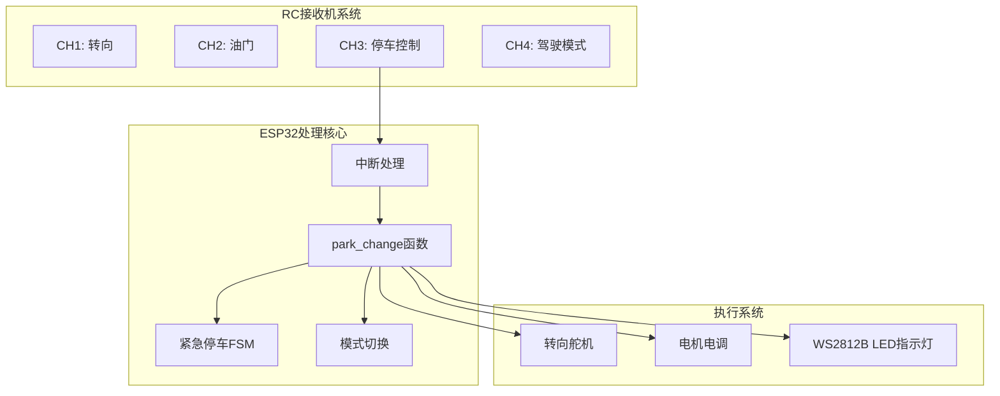
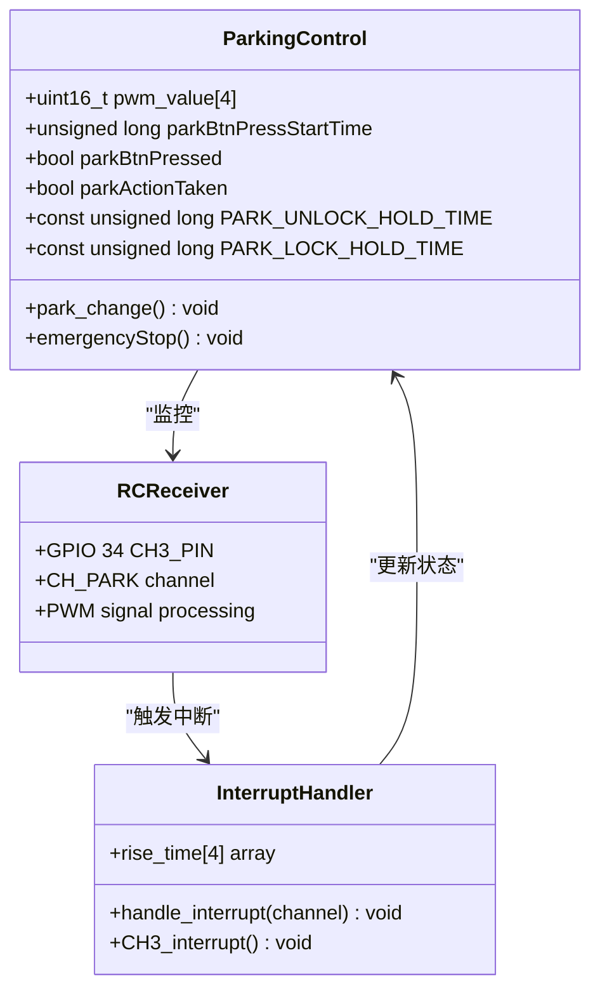
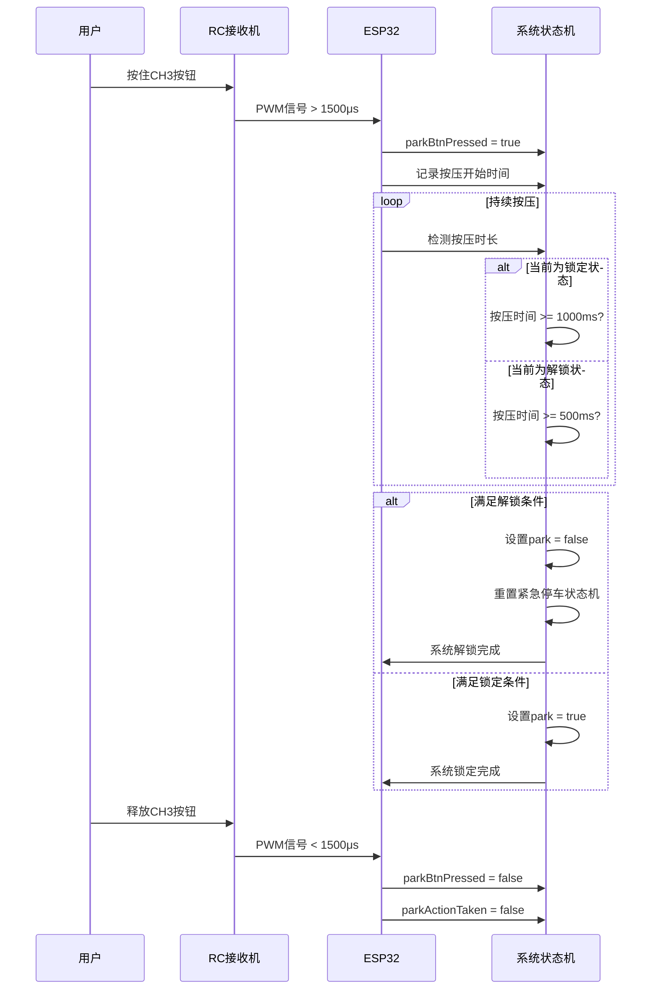
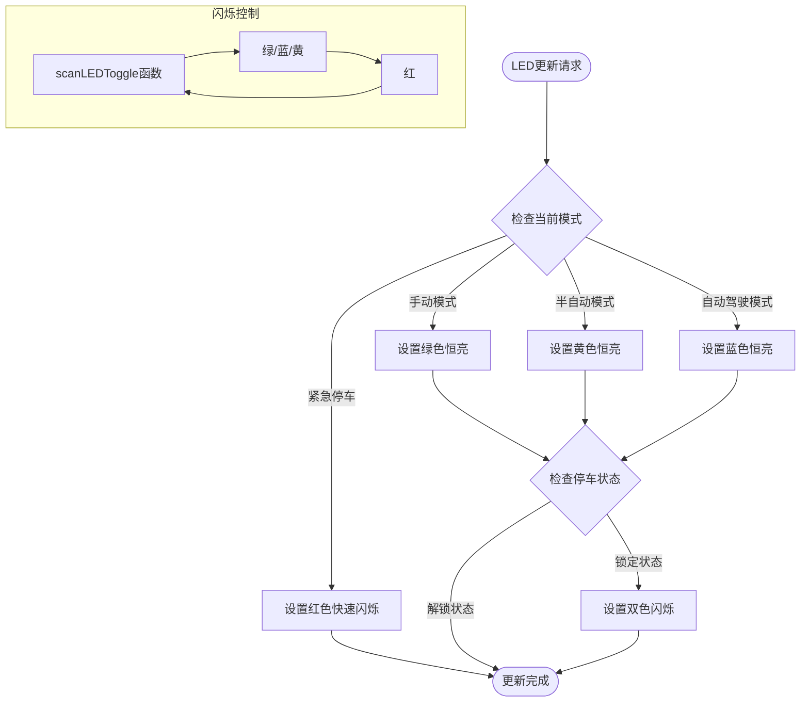
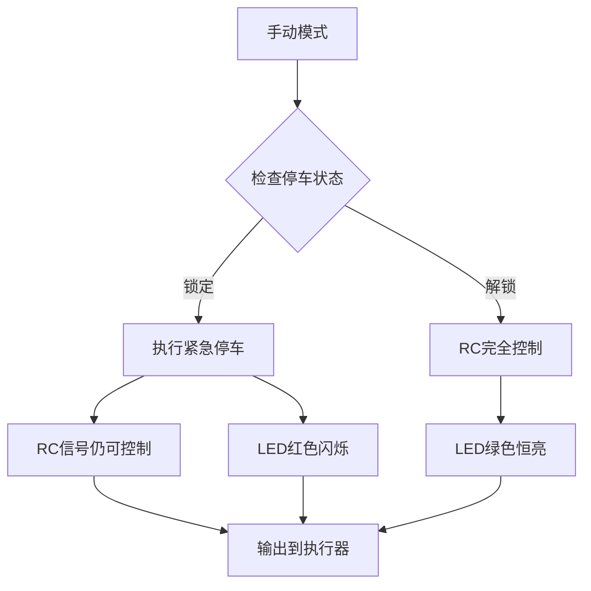
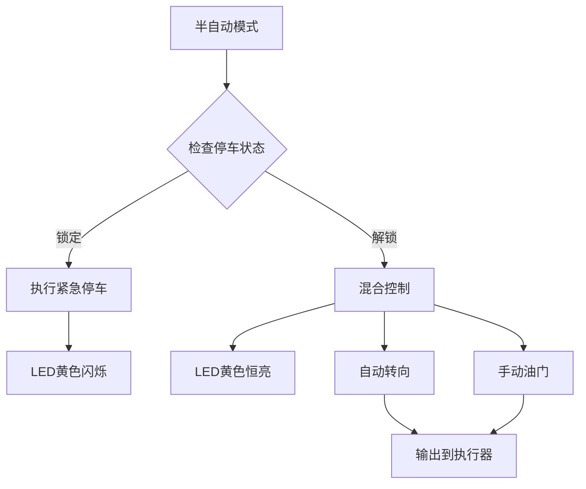
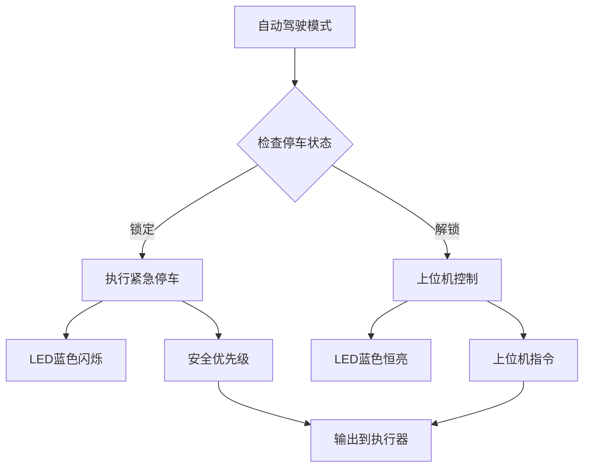
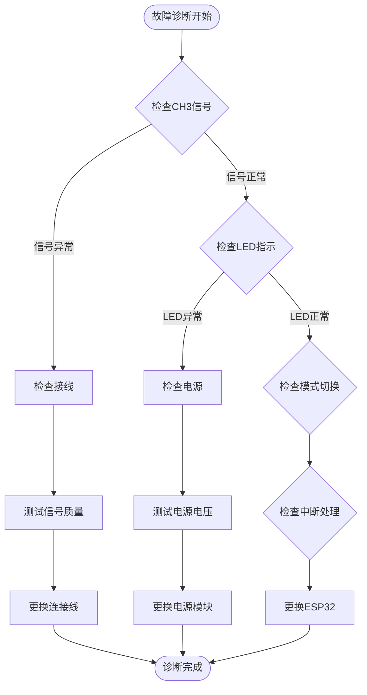
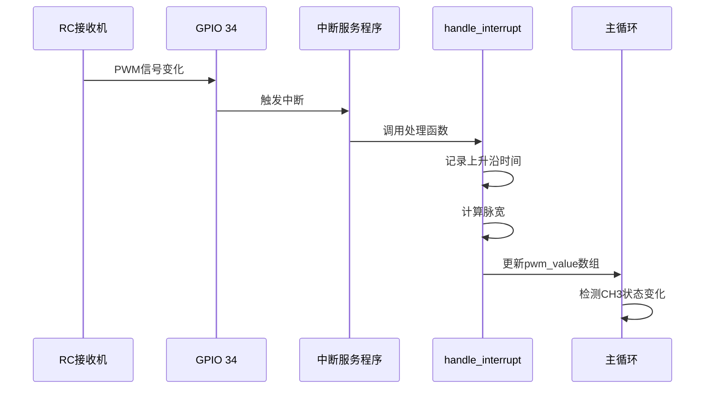
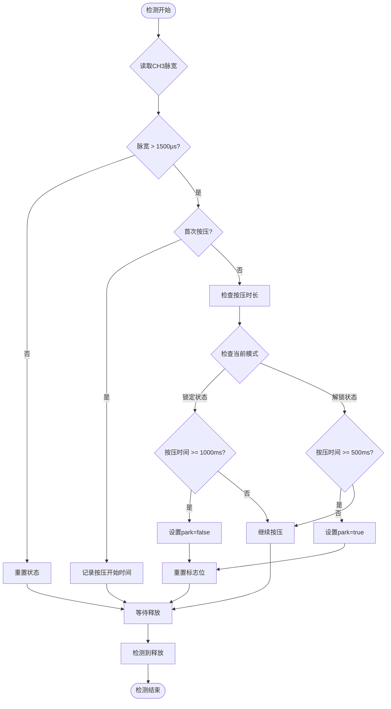

# 停车控制机制

<cite>
**本文档引用的文件**
- [mus4.ino](file://mus4/mus4.ino)
- [architecture.md](file://mus4/Doc/Arch/architecture.md)
- [pin_definitions.md](file://mus4/Doc/Hardware/pin_definitions.md)
- [README.md](file://README.md)
- [sketch.yaml](file://mus4/sketch.yaml)
</cite>

## 目录
1. [简介](#简介)
2. [系统架构概述](#系统架构概述)
3. [停车控制核心机制](#停车控制核心机制)
4. [状态转换图](#状态转换图)
5. [LED指示系统](#led指示系统)
6. [与紧急停车的区别与联系](#与紧急停车的区别与联系)
7. [不同驾驶模式下的行为差异](#不同驾驶模式下的行为差异)
8. [实际操作指南](#实际操作指南)
9. [故障排除指南](#故障排除指南)
10. [技术实现细节](#技术实现细节)
11. [结论](#结论)

## 简介

MUS4项目停车控制机制是基于RC接收机CH3通道（CH_PARK）实现的停车/解锁控制系统。该机制允许用户通过按住RC接收机的CH3通道按钮来实现车辆的停车和解锁操作，具有精确的时长检测和状态反馈功能。

停车控制机制是MUS4自动驾驶小车的重要安全特性，它提供了三种操作模式：
- **锁定（进入停车模式）**：按住按钮0.5秒
- **解锁（退出停车模式）**：按住按钮1秒  
- **状态保持**：系统在锁定状态下自动保持停车状态

## 系统架构概述

MUS4系统采用模块化设计，停车控制机制作为核心安全功能集成在整体架构中：



**图表来源**
- [mus4.ino](file://mus4/mus4.ino#L1126-L1131)
- [architecture.md](file://mus4/Doc/Arch/architecture.md#L18-L45)

**章节来源**
- [architecture.md](file://mus4/Doc/Arch/architecture.md#L1-L245)
- [mus4.ino](file://mus4/mus4.ino#L1-L150)

## 停车控制核心机制

### 硬件接口定义

停车控制通过RC接收机的CH3通道实现，该通道连接到ESP32的GPIO 34引脚：



**图表来源**
- [mus4.ino](file://mus4/mus4.ino#L414-L431)
- [mus4.ino](file://mus4/mus4.ino#L686-L740)

### 数字信号处理

停车控制采用数字信号处理方式，通过中断服务程序精确测量PWM脉宽：

| 参数 | 值 | 说明 |
|------|-----|------|
| `CH_PARK` | 2 | CH3通道索引 |
| `CH3_PIN` | GPIO 34 | 输入引脚定义 |
| `pwm_value[CH_PARK]` | 16位无符号整型 | 脉宽测量结果（微秒） |
| `rise_time[CH_PARK]` | 32位无符号整型 | 上升沿时间戳（微秒） |

**章节来源**
- [mus4.ino](file://mus4/mus4.ino#L41-L80)
- [mus4.ino](file://mus4/mus4.ino#L414-L431)

## 状态转换图

停车控制机制采用有限状态机（FSM）实现，具有清晰的状态转换逻辑：

```mermaid
stateDiagram-v2
[*] --> Locked : 系统初始化
[*] --> Unlocked : 系统初始化
state Locked {
[*] --> WaitingForButton
WaitingForButton --> ButtonPressed : CH3 > 1500μs
ButtonPressed --> Holding : 按住按钮
Holding --> CheckingHold : 检测按压时长
CheckingHold --> Locked : 按压时间 < 0.5s
CheckingHold --> Unlocked : 按压时间 >= 1s
}
state Unlocked {
[*] --> WaitingForButton
WaitingForButton --> ButtonPressed : CH3 > 1500μs
ButtonPressed --> Holding : 按住按钮
Holding --> CheckingHold : 检测按压时长
CheckingHold --> Unlocked : 按压时间 < 1s
CheckingHold --> Locked : 按压时间 >= 0.5s
}
note right of Locked : 系统锁定状态<br/>车辆停止运行
note right of Unlocked : 系统解锁状态<br/>车辆可正常运行
```

**图表来源**
- [mus4.ino](file://mus4/mus4.ino#L686-L740)
- [architecture.md](file://mus4/Doc/Arch/architecture.md#L162-L182)

### 状态转换时序



**图表来源**
- [mus4.ino](file://mus4/mus4.ino#L686-L740)

**章节来源**
- [mus4.ino](file://mus4/mus4.ino#L686-L740)

## LED指示系统

停车控制机制通过WS2812B RGB LED提供直观的状态指示：

### LED颜色编码系统

| 状态 | LED颜色 | 闪烁模式 | 说明 |
|------|---------|----------|------|
| **手动模式** | 绿色 | 恒亮 | RC完全控制，车辆可运行 |
| **半自动模式** | 黄色 | 恒亮 | 自动转向，RC控制油门 |
| **自动驾驶模式** | 蓝色 | 恒亮 | 上位机完全控制 |
| **停车状态** | 红色闪烁 | 快速闪烁 | 紧急停车状态 |
| **锁定状态** | 绿色 + 红色闪烁 | 交替闪烁 | 锁定模式，车辆停止 |
| **解锁状态** | 蓝色 + 红色闪烁 | 交替闪烁 | 解锁模式，准备运行 |

### LED控制算法



**图表来源**
- [mus4.ino](file://mus4/mus4.ino#L240-L274)
- [mus4.ino](file://mus4/mus4.ino#L1177-L1229)

**章节来源**
- [mus4.ino](file://mus4/mus4.ino#L240-L274)
- [mus4.ino](file://mus4/mus4.ino#L1177-L1229)

## 与紧急停车的区别与联系

### 功能对比

| 特性 | 停车控制（CH3） | 紧急停车（FSM） |
|------|----------------|----------------|
| **触发方式** | 按住CH3按钮 | 系统检测到危险情况 |
| **持续时间** | 0.5秒（锁定）/1秒（解锁） | 自动执行（500ms缓冲 + 1500ms刹车） |
| **手动干预** | 支持 | 不支持 |
| **状态保持** | 系统自动保持 | 系统自动保持 |
| **LED指示** | 双色闪烁 | 双色闪烁 |
| **安全级别** | 一般安全 | 高级安全 |

### 状态机集成

```mermaid
stateDiagram-v2
[*] --> NormalOperation : 正常运行
[*] --> EmergencyStop : 紧急情况
state NormalOperation {
[*] --> DriveMode : 车辆运行
DriveMode --> ParkMode : CH3锁定(0.5s)
DriveMode --> EmergencyStop : 系统检测到危险
ParkMode --> DriveMode : CH3解锁(1s)
ParkMode --> EmergencyStop : 系统检测到危险
}
state EmergencyStop {
[*] --> BufferPhase : 缓冲阶段(500ms)
BufferPhase --> BrakingPhase : 全力刹车(-100)
BrakingPhase --> Complete : 刹车完成
Complete --> NormalOperation : 解除停车信号
}
note right of NormalOperation : 用户可控的安全机制
note right of EmergencyStop : 系统自动安全机制
```

**图表来源**
- [mus4.ino](file://mus4/mus4.ino#L474-L525)
- [mus4.ino](file://mus4/mus4.ino#L686-L740)

**章节来源**
- [mus4.ino](file://mus4/mus4.ino#L474-L525)
- [mus4.ino](file://mus4/mus4.ino#L686-L740)

## 不同驾驶模式下的行为差异

### 手动模式（Manual）

在手动模式下，停车控制具有最高的优先级：



**图表来源**
- [mus4.ino](file://mus4/mus4.ino#L1218-L1239)

### 半自动模式（Semi-Auto）

半自动模式结合了自动转向和手动油门控制：



**图表来源**
- [mus4.ino](file://mus4/mus4.ino#L1198-L1217)

### 自动驾驶模式（Full-Auto）

自动驾驶模式下，停车控制影响整个系统的安全状态：



**图表来源**
- [mus4.ino](file://mus4/mus4.ino#L1170-L1197)

**章节来源**
- [mus4.ino](file://mus4/mus4.ino#L1170-L1239)

## 实际操作指南

### 操作步骤

#### 锁定（进入停车模式）
1. **准备阶段**：确保RC接收机已连接，车辆处于运行状态
2. **操作方法**：按住RC接收机CH3通道按钮
3. **时长要求**：持续按压至少0.5秒
4. **确认方法**：
   - LED指示灯变为绿色（锁定状态）
   - 串口输出显示"System Locked: Park Mode Entered"
   - 车辆停止运行

#### 解锁（退出停车模式）
1. **准备阶段**：确保车辆已完全停止
2. **操作方法**：按住RC接收机CH3通道按钮
3. **时长要求**：持续按压至少1秒
4. **确认方法**：
   - LED指示灯变为蓝色（解锁状态）
   - 串口输出显示"System Unlocked: Park Mode Exited"
   - 车辆可重新启动

### 操作注意事项

| 注意事项 | 说明 | 影响 |
|----------|------|------|
| **按压力度** | 无需特殊力度，正常按压即可 | 系统检测的是PWM信号而非按压力度 |
| **按压时机** | 在锁定状态下解锁需要1秒，在解锁状态下锁定需要0.5秒 | 时间不足不会触发状态转换 |
| **操作环境** | 在稳定环境中进行操作，避免误触 | 避免意外触发停车控制 |
| **安全考虑** | 在高速行驶时不要随意按压CH3按钮 | 可能导致意外停车 |

### 故障排除

#### 常见问题及解决方案

| 问题类型 | 症状 | 可能原因 | 解决方案 |
|----------|------|----------|----------|
| **无法锁定** | 按压CH3按钮不生效 | 按压时间不足0.5秒 | 确保按压至少0.5秒 |
| **无法解锁** | 按压CH3按钮不生效 | 按压时间不足1秒 | 确保按压至少1秒 |
| **状态异常** | LED指示异常 | 系统状态冲突 | 重启系统或检查RC信号 |
| **响应延迟** | 操作后系统反应慢 | 系统负载过高 | 检查其他任务占用CPU |
| **信号干扰** | CH3信号不稳定 | RC接收机干扰 | 检查天线连接和周围环境 |

**章节来源**
- [mus4.ino](file://mus4/mus4.ino#L686-L740)

## 故障排除指南

### 硬件故障诊断

#### CH3通道检测



**图表来源**
- [mus4.ino](file://mus4/mus4.ino#L414-L431)
- [pin_definitions.md](file://mus4/Doc/Hardware/pin_definitions.md#L34-L46)

### 软件故障排查

#### 中断处理问题

| 问题症状 | 可能原因 | 排查步骤 |
|----------|----------|----------|
| **CH3信号不响应** | 中断未正确绑定 | 检查`attachInterrupt`调用 |
| **脉宽测量错误** | 中断处理函数异常 | 检查`handle_interrupt`函数 |
| **状态转换延迟** | 主循环阻塞 | 检查主循环中的阻塞操作 |
| **LED闪烁异常** | LED控制函数错误 | 检查`scanLEDToggle`函数 |

#### 调试信息输出

系统提供了丰富的调试信息输出：

```cpp
// 关键调试输出示例
Serial.println("System Locked: Park Mode Entered");
Serial.println("System Unlocked: Park Mode Exited");
Serial.printf("CH3 (Park): %4d | CH4 (Mode): %4d\n", ch3, ch4);
```

**章节来源**
- [mus4.ino](file://mus4/mus4.ino#L686-L740)
- [mus4.ino](file://mus4/mus4.ino#L1152-L1289)

## 技术实现细节

### 中断处理机制

停车控制依赖于ESP32的中断处理机制来精确测量PWM脉宽：



**图表来源**
- [mus4.ino](file://mus4/mus4.ino#L414-L431)

### 状态检测算法

停车控制采用边缘检测和持续时间检测相结合的方法：



**图表来源**
- [mus4.ino](file://mus4/mus4.ino#L686-L740)

### 性能优化

系统采用了多种性能优化策略：

| 优化策略 | 实现方式 | 效果 |
|----------|----------|------|
| **原子访问** | 使用`volatile`关键字 | 确保多线程安全 |
| **中断处理** | 硬件中断优先级 | 减少CPU占用 |
| **状态缓存** | 缓存上次状态值 | 减少不必要的更新 |
| **定时器优化** | 使用微秒级定时器 | 提高精度 |
| **内存管理** | 静态分配变量 | 减少动态内存分配 |

**章节来源**
- [mus4.ino](file://mus4/mus4.ino#L79-L80)
- [mus4.ino](file://mus4/mus4.ino#L414-L431)

## 结论

MUS4项目的停车控制机制是一个设计精良的安全系统，具有以下特点：

### 设计优势

1. **精确控制**：通过CH3通道实现精确的停车/解锁控制
2. **多重安全**：结合手动控制和紧急停车机制
3. **直观反馈**：通过LED指示提供实时状态反馈
4. **模式适配**：在不同驾驶模式下提供相应的行为
5. **故障保护**：具备完善的故障检测和恢复机制

### 技术特色

- **数字信号处理**：采用中断处理实现精确的PWM脉宽测量
- **状态机设计**：使用有限状态机确保状态转换的可靠性
- **多模式支持**：适应手动、半自动和自动驾驶三种模式
- **实时反馈**：提供LED和串口双重状态反馈

### 应用价值

停车控制机制不仅提高了系统的安全性，还增强了用户体验。通过简单直观的操作方式，用户可以轻松控制车辆的安全状态，同时系统提供了丰富的状态反馈信息，帮助用户了解当前系统状态。

该机制的成功实施为MUS4项目提供了可靠的安全保障，是自动驾驶小车控制系统的重要组成部分。