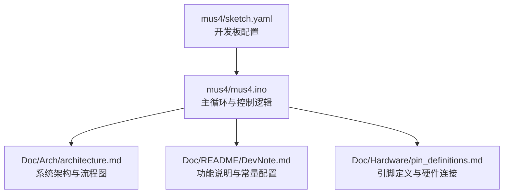
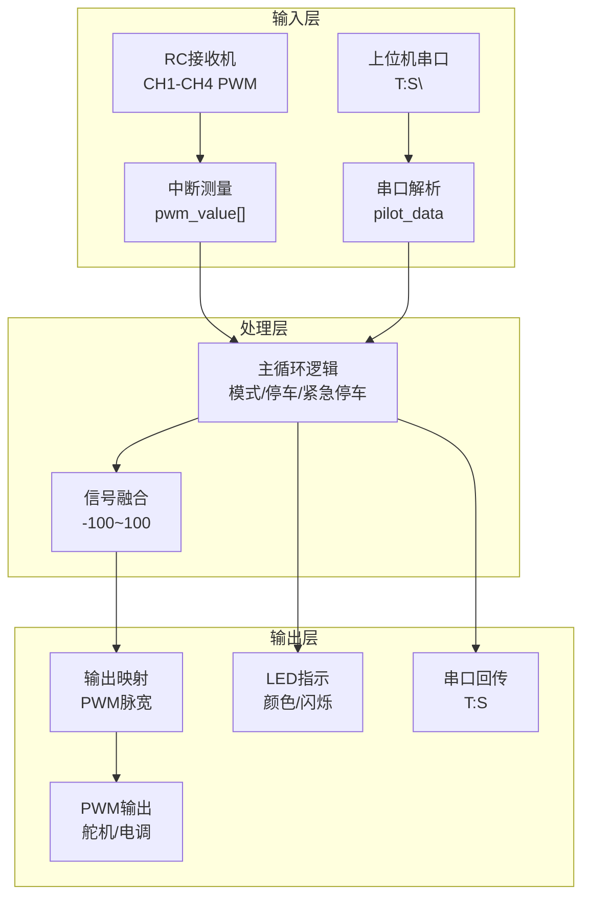
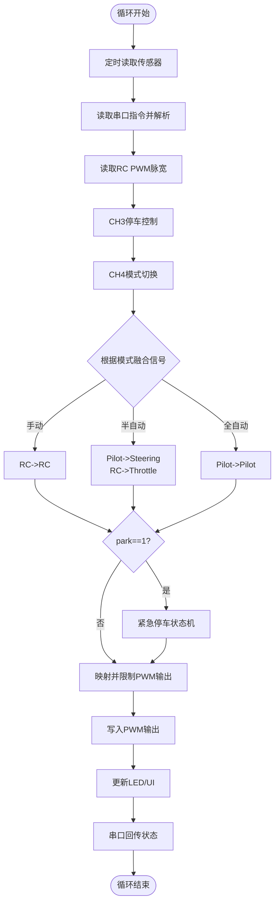
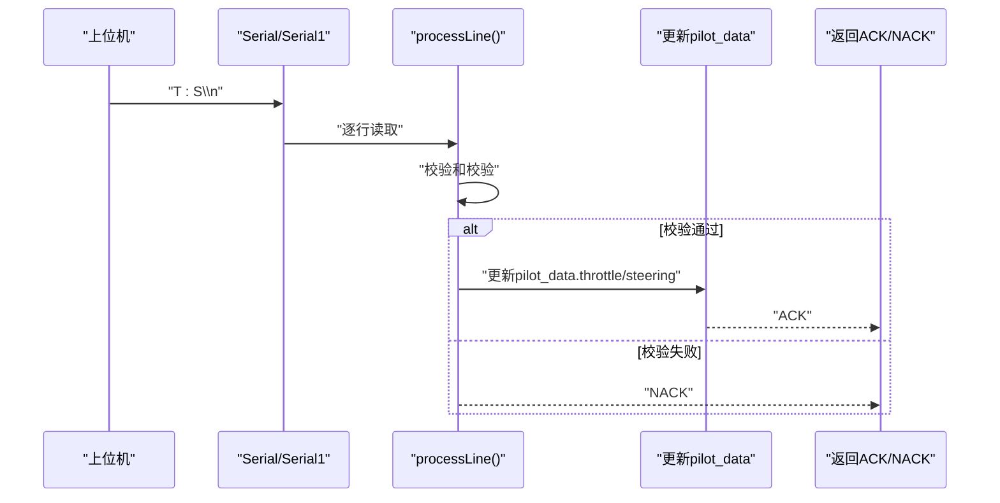
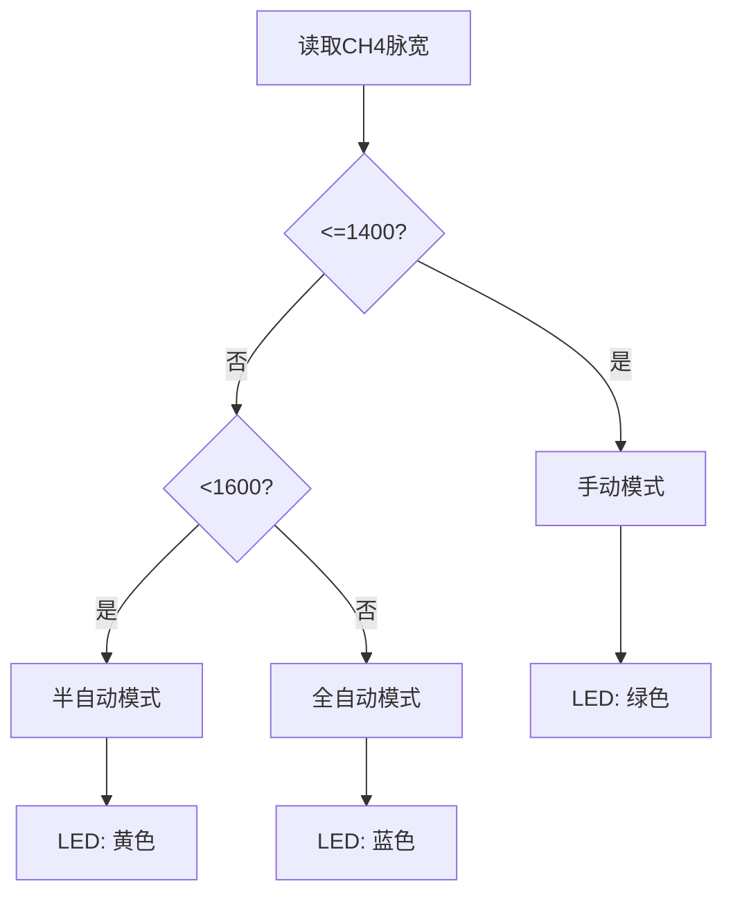
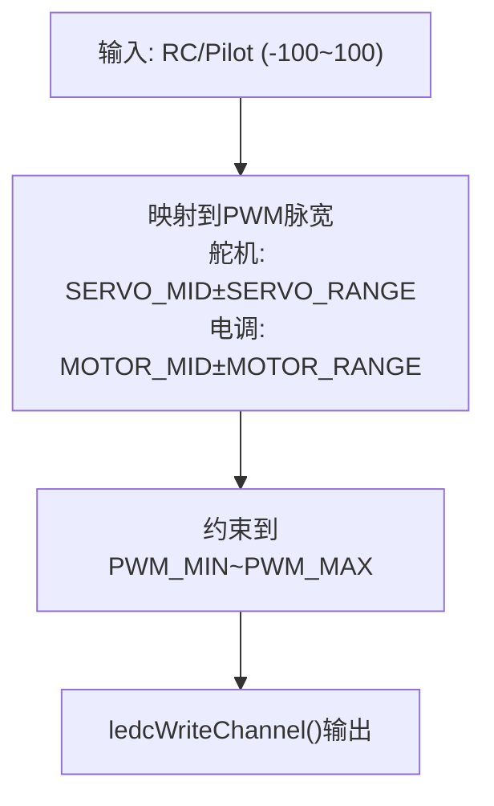
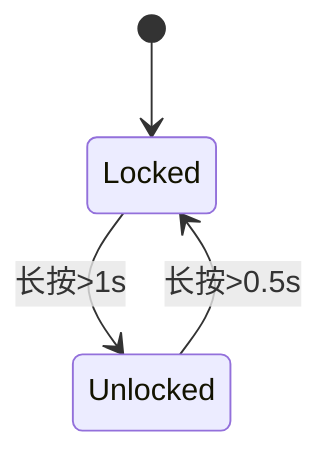
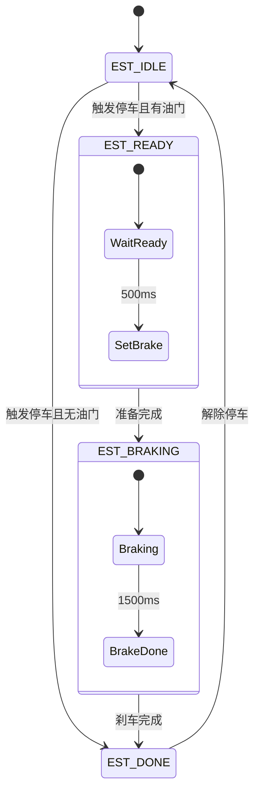
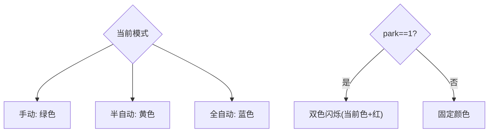
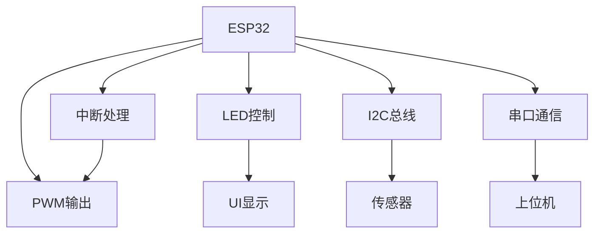

# 控制流程逻辑

<cite>
**本文引用的文件**
- [mus4.ino](file://mus4/mus4.ino)
- [architecture.md](file://mus4/Doc/Arch/architecture.md)
- [DevNote.md](file://mus4/Doc/README/DevNote.md)
- [pin_definitions.md](file://mus4/Doc/Hardware/pin_definitions.md)
- [sketch.yaml](file://mus4/sketch.yaml)
</cite>

## 目录
1. [简介](#简介)
2. [项目结构](#项目结构)
3. [核心组件](#核心组件)
4. [架构总览](#架构总览)
5. [详细组件分析](#详细组件分析)
6. [依赖关系分析](#依赖关系分析)
7. [性能考虑](#性能考虑)
8. [故障排查指南](#故障排查指南)
9. [结论](#结论)

## 简介
本文档面向MUS4项目的开发者，系统化梳理主循环loop()的控制流程，深入解析串口指令读取、RC信号处理、驾驶模式检查与输出映射等关键环节；并详细说明三种驾驶模式（手动0、半自动1、全自动2）的具体控制策略与LED状态指示，解释模式切换条件、信号融合算法与输出限制机制，提供完整的流程图与状态转换说明，帮助快速理解系统的决策过程与控制逻辑。

## 项目结构
- 核心固件位于mus4/mus4.ino，包含主循环、中断处理、串口解析、传感器读取、LED控制、紧急停车状态机等。
- 文档位于mus4/Doc目录，包含架构说明、硬件引脚定义与开发笔记，为理解系统设计提供背景资料。
- 配置文件sketch.yaml定义开发板类型与默认端口。



**图表来源**
- [mus4.ino](file://mus4/mus4.ino#L1104-L1150)
- [architecture.md](file://mus4/Doc/Arch/architecture.md#L1-L45)
- [DevNote.md](file://mus4/Doc/README/DevNote.md#L1-L122)
- [pin_definitions.md](file://mus4/Doc/Hardware/pin_definitions.md#L1-L225)
- [sketch.yaml](file://mus4/sketch.yaml#L1-L3)

**章节来源**
- [mus4.ino](file://mus4/mus4.ino#L1104-L1150)
- [architecture.md](file://mus4/Doc/Arch/architecture.md#L1-L45)
- [DevNote.md](file://mus4/Doc/README/DevNote.md#L1-L122)
- [pin_definitions.md](file://mus4/Doc/Hardware/pin_definitions.md#L1-L225)
- [sketch.yaml](file://mus4/sketch.yaml#L1-L3)

## 核心组件
- 主循环loop()：每轮循环执行传感器读取、串口指令解析、RC信号采集、模式切换与控制决策、输出映射与PWM写入、LED状态更新与UI刷新。
- 中断处理：CH1-CH4引脚电平变化触发，测量脉宽并更新pwm_value数组。
- 串口解析：支持USB串口与RS232串口，解析“T:S\n”格式指令，校验校验和，更新pilot_data。
- 驾驶模式：根据CH4模式通道脉宽阈值切换模式（手动/半自动/全自动）。
- 停车控制：通过CH3脉宽长短实现锁定/解锁，长按1秒解锁，0.5秒锁定。
- 紧急停车：park==1时进入状态机，分阶段执行准备刹车、全力刹车、完成。
- 输出映射：将-100~100的控制量映射到舵机/电调脉宽范围，并进行上下限约束。
- LED指示：根据模式与park状态显示固定颜色或双色闪烁。

**章节来源**
- [mus4.ino](file://mus4/mus4.ino#L1152-L1289)
- [mus4.ino](file://mus4/mus4.ino#L414-L431)
- [mus4.ino](file://mus4/mus4.ino#L320-L411)
- [mus4.ino](file://mus4/mus4.ino#L771-L786)
- [mus4.ino](file://mus4/mus4.ino#L686-L740)
- [mus4.ino](file://mus4/mus4.ino#L474-L525)
- [mus4.ino](file://mus4/mus4.ino#L1269-L1276)
- [mus4.ino](file://mus4/mus4.ino#L241-L274)

## 架构总览
系统采用“输入-处理-输出”的流水线式控制架构：RC PWM与上位机串口作为输入，经中断与串口解析得到原始数据；主循环根据模式与park状态融合信号，映射到执行器输出；同时驱动LED与UI反馈状态。



**图表来源**
- [mus4.ino](file://mus4/mus4.ino#L1152-L1289)
- [mus4.ino](file://mus4/mus4.ino#L414-L431)
- [mus4.ino](file://mus4/mus4.ino#L320-L411)
- [mus4.ino](file://mus4/mus4.ino#L1269-L1276)

**章节来源**
- [architecture.md](file://mus4/Doc/Arch/architecture.md#L1-L45)
- [mus4.ino](file://mus4/mus4.ino#L1152-L1289)

## 详细组件分析

### 主循环loop()执行流程
主循环以约60Hz的节奏推进，依次完成：
- 传感器更新：定时读取INA219与MPU6050数据。
- 串口读取：分别处理USB与RS232串口指令，解析并更新pilot_data。
- RC数据更新：读取CH1-CH4脉宽，更新rc_data。
- 停车控制：检测CH3脉宽，实现长按锁定/解锁。
- 模式切换：根据CH4脉宽阈值切换驾驶模式。
- 控制决策：根据不同模式融合RC与Pilot信号，必要时执行紧急停车。
- 输出映射：将-100~100映射到PWM脉宽并写入ledc通道。
- LED/UI：更新LED颜色/闪烁，刷新主界面UI。
- 串口回传：周期性向上位机发送当前控制状态。



**图表来源**
- [mus4.ino](file://mus4/mus4.ino#L1152-L1289)
- [mus4.ino](file://mus4/mus4.ino#L474-L525)
- [mus4.ino](file://mus4/mus4.ino#L1269-L1276)

**章节来源**
- [mus4.ino](file://mus4/mus4.ino#L1152-L1289)

### 串口指令读取与解析
- 支持两种串口：USB串口（Serial）与RS232串口（Serial1），波特率均为115200。
- 指令格式：T:S\n，其中T为油门，S为转向，均在-100~100范围内。
- 解析流程：按行读取，支持带校验和的payload，校验失败返回NACK，成功则更新pilot_data并返回ACK。
- 测试命令：支持TEST/BENCH/STRESS/REGRESS等命令用于单元测试与基准评估。



**图表来源**
- [mus4.ino](file://mus4/mus4.ino#L320-L411)
- [mus4.ino](file://mus4/mus4.ino#L344-L411)

**章节来源**
- [mus4.ino](file://mus4/mus4.ino#L320-L411)
- [DevNote.md](file://mus4/Doc/README/DevNote.md#L24-L29)

### RC信号处理与中断采集
- CH1-CH4引脚配置为INPUT，绑定中断服务函数，在电平跳变时记录rise_time并在下降沿计算脉宽。
- 通过全局数组pwm_value[]保存四个通道的脉宽，供主循环读取。
- RC通道脉宽范围与中位值在头文件中定义，用于后续映射。

```mermaid
sequenceDiagram
participant Pin as "CH1-CH4引脚"
participant ISR as "handle_interrupt()"
participant PWM as "pwm_value[]"
participant Loop as "主循环"
Pin->>ISR : "电平跳变"
ISR->>ISR : "记录rise_time(上升沿)"
ISR->>ISR : "计算脉宽(下降沿)"
ISR->>PWM : "更新pwm_value[channel]"
Loop->>PWM : "读取pwm_value[]"
```

**图表来源**
- [mus4.ino](file://mus4/mus4.ino#L414-L431)
- [mus4.ino](file://mus4/mus4.ino#L1165-L1168)

**章节来源**
- [mus4.ino](file://mus4/mus4.ino#L414-L431)
- [pin_definitions.md](file://mus4/Doc/Hardware/pin_definitions.md#L34-L46)

### 驾驶模式检查与切换
- 模式阈值：CH4脉宽<=1400为手动，1400<CH4<1600为半自动，>=1600为全自动。
- 模式切换后LED颜色随之改变：手动-绿、半自动-黄、全自动-蓝。
- 模式切换时若park==1，LED进入双色闪烁（当前模式色+红）。



**图表来源**
- [mus4.ino](file://mus4/mus4.ino#L771-L786)
- [DevNote.md](file://mus4/Doc/README/DevNote.md#L56-L60)

**章节来源**
- [mus4.ino](file://mus4/mus4.ino#L771-L786)
- [DevNote.md](file://mus4/Doc/README/DevNote.md#L56-L60)

### 信号融合算法与输出映射
- 手动模式：转向与油门均来自RC，分别映射到-100~100后进一步映射到PWM脉宽。
- 半自动模式：转向来自Pilot，油门来自RC；RC油门同样映射到-100~100再映射PWM。
- 全自动模式：转向与油门均来自Pilot；park==1时执行紧急停车，否则保持Pilot输出。
- 输出限制：映射后的脉宽在PWM_MIN~PWM_MAX之间约束，避免超出执行器范围。



**图表来源**
- [mus4.ino](file://mus4/mus4.ino#L1269-L1276)
- [pin_definitions.md](file://mus4/Doc/Hardware/pin_definitions.md#L57-L61)

**章节来源**
- [mus4.ino](file://mus4/mus4.ino#L1198-L1239)
- [mus4.ino](file://mus4/mus4.ino#L1269-L1276)
- [pin_definitions.md](file://mus4/Doc/Hardware/pin_definitions.md#L57-L61)

### 停车/解锁控制（CH3）
- 长按CH3实现锁定/解锁：解锁需>1s，锁定需>0.5s。
- 解锁时重置紧急停车状态机，进入Drive模式；锁定时进入Park模式。
- UI与LED同步反映park状态。



**图表来源**
- [mus4.ino](file://mus4/mus4.ino#L686-L740)

**章节来源**
- [mus4.ino](file://mus4/mus4.ino#L686-L740)
- [DevNote.md](file://mus4/Doc/README/DevNote.md#L62-L65)

### 紧急停车状态机（park==1）
- EST_IDLE：收到park==1且当前有油门时进入EST_READY，否则EST_DONE。
- EST_READY：等待500ms，将油门设为15，准备刹车。
- EST_BRAKING：等待1500ms，将油门设为-100，全力刹车。
- EST_DONE：刹车完成，油门归零；解除park信号后回到EST_IDLE。



**图表来源**
- [mus4.ino](file://mus4/mus4.ino#L474-L525)

**章节来源**
- [mus4.ino](file://mus4/mus4.ino#L474-L525)
- [DevNote.md](file://mus4/Doc/README/DevNote.md#L67-L72)

### LED状态指示
- 手动：绿色；半自动：黄色；全自动：蓝色。
- 紧急停车：当前模式颜色与红色交替闪烁。
- 初始化：启动时显示蓝色。



**图表来源**
- [mus4.ino](file://mus4/mus4.ino#L241-L274)
- [DevNote.md](file://mus4/Doc/README/DevNote.md#L81-L85)

**章节来源**
- [mus4.ino](file://mus4/mus4.ino#L241-L274)
- [DevNote.md](file://mus4/Doc/README/DevNote.md#L81-L85)

## 依赖关系分析
- 外设库：Wire（I2C）、FastLED（LED）、Adafruit_MPU6050/Adafruit_INA219（传感器）。
- 硬件连接：CH1-CH4输入、PWM输出至舵机与电调、LED数据线、I2C总线、串口通信。
- 关键耦合点：主循环依赖pwm_value[]、pilot_data、rc_data、car_output；LED与UI依赖car_output.mode与park状态；紧急停车FSM与park状态耦合。



**图表来源**
- [mus4.ino](file://mus4/mus4.ino#L1104-L1150)
- [mus4.ino](file://mus4/mus4.ino#L1152-L1289)

**章节来源**
- [mus4.ino](file://mus4/mus4.ino#L1104-L1150)
- [mus4.ino](file://mus4/mus4.ino#L1152-L1289)

## 性能考虑
- 主循环节拍：RC数据更新约60Hz，传感器1Hz，UI约60Hz，串口回传约60Hz，满足实时性需求。
- 性能自适应：UI刷新周期根据上次UI耗时动态调整，避免UI卡顿。
- 降级模式：当传感器无效或UI耗时过长时进入降级模式，LED提示并降低UI刷新频率。
- PWM分辨率：14bit计数范围0-16383，配合50Hz频率保证控制精度。

**章节来源**
- [mus4.ino](file://mus4/mus4.ino#L109-L111)
- [mus4.ino](file://mus4/mus4.ino#L1282-L1288)
- [DevNote.md](file://mus4/Doc/README/DevNote.md#L103-L116)

## 故障排查指南
- 串口通信异常
  - 确认波特率115200，格式T:S\n，校验和正确。
  - 使用TEST/BENCH/STRESS/REGRESS命令验证解析与性能。
- RC信号异常
  - 检查CH1-CH4引脚连接与上拉/下拉电阻情况，确保接收机输出稳定。
  - 确认脉宽范围与中位值配置正确。
- 传感器问题
  - I2C扫描确认设备地址，检查SDA/SCL连线与电源。
  - 传感器初始化失败时查看错误提示并重试。
- 紧急停车不生效
  - 确认park信号有效且主循环中park状态被正确更新。
  - 检查紧急停车状态机逻辑与时间阈值。
- LED状态异常
  - 检查LED颜色映射与闪烁逻辑，确认park状态影响。
  - 降级模式下LED会提示问题。

**章节来源**
- [mus4.ino](file://mus4/mus4.ino#L320-L411)
- [mus4.ino](file://mus4/mus4.ino#L868-L896)
- [mus4.ino](file://mus4/mus4.ino#L922-L975)
- [mus4.ino](file://mus4/mus4.ino#L474-L525)
- [mus4.ino](file://mus4/mus4.ino#L241-L274)
- [DevNote.md](file://mus4/Doc/README/DevNote.md#L88-L101)

## 结论
MUS4通过清晰的主循环架构实现了RC与上位机信号的融合控制，结合停车/紧急停车机制与LED状态反馈，形成了可靠的安全与可视化体系。开发者可据此快速定位控制链路，优化信号融合策略与输出映射，提升系统稳定性与用户体验。