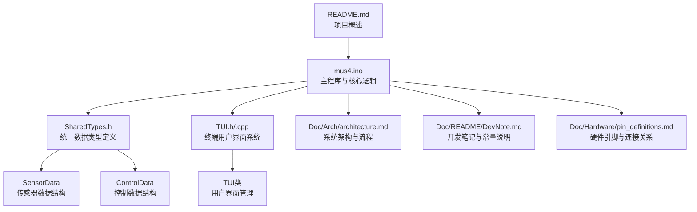
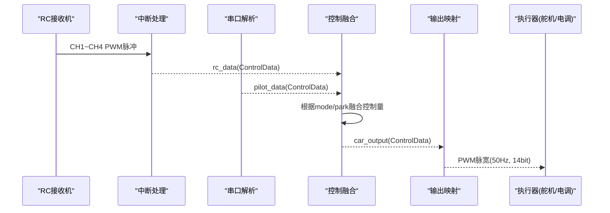
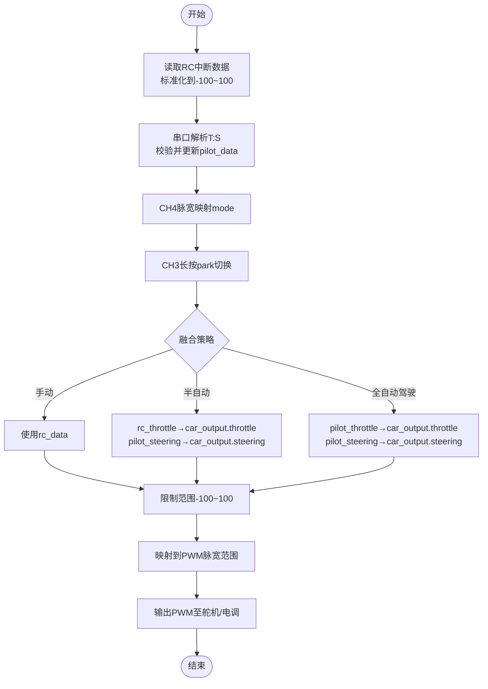
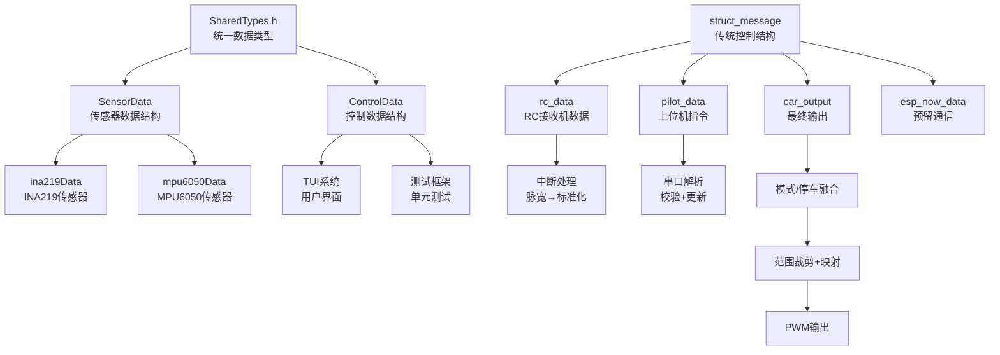

# 核心数据结构

<cite>
**本文引用的文件**
- [mus4.ino](file://mus4/mus4.ino)
- [SharedTypes.h](file://mus4/SharedTypes.h)
- [TUI.h](file://mus4/TUI.h)
- [TUI.cpp](file://mus4/TUI.cpp)
- [test_runner.h](file://mus4/test_runner.h)
- [test_tui.cpp](file://mus4/test_tui.cpp)
- [DevNote.md](file://mus4/Doc/README/DevNote.md)
- [architecture.md](file://mus4/Doc/Arch/architecture.md)
- [pin_definitions.md](file://mus4/Doc/Hardware/pin_definitions.md)
- [README.md](file://README.md)
</cite>

## 更新摘要
**变更内容**
- 新增SharedTypes.h头文件，提供统一的数据结构定义
- 新增SensorData和ControlData结构体，替代原有的struct_message
- 在TUI系统和测试框架中广泛使用新的数据结构
- 保持向后兼容性，struct_message仍存在于主程序中

## 目录
1. [简介](#简介)
2. [项目结构](#项目结构)
3. [核心组件](#核心组件)
4. [架构总览](#架构总览)
5. [详细组件分析](#详细组件分析)
6. [依赖关系分析](#依赖关系分析)
7. [性能考量](#性能考量)
8. [故障排查指南](#故障排查指南)
9. [结论](#结论)

## 简介
本文件聚焦于MUS4项目的核心数据结构，尤其是新增的统一数据类型定义，包括SensorData和ControlData结构体的设计理念与字段语义。重点覆盖以下方面：
- SensorData结构体：传感器数据的统一表示，包含电压、电流、加速度、角速度等多维数据
- ControlData结构体：控制数据的统一表示，与struct_message保持字段兼容性
- 新旧数据结构的演进关系和向后兼容性
- 各数据实例的用途：rc_data（RC接收机处理后数据）、pilot_data（上位机指令）、car_output（最终输出控制量）、esp_now_data（ESP-NOW通信数据）
- 数据流在系统中的传递路径、一致性与完整性保障机制

## 项目结构
MUS4项目采用"单文件主程序+共享类型定义+用户界面系统"的组织方式，核心逻辑集中在mus4.ino中，统一的数据类型定义位于SharedTypes.h，用户界面系统位于TUI模块，配套文档位于Doc目录。

**图表来源**
- [mus4.ino](file://mus4/mus4.ino#L29-L31)
- [SharedTypes.h](file://mus4/SharedTypes.h#L1-L34)
- [TUI.h](file://mus4/TUI.h#L1-L59)

**章节来源**
- [mus4.ino](file://mus4/mus4.ino#L29-L31)
- [SharedTypes.h](file://mus4/SharedTypes.h#L1-L34)
- [README.md](file://README.md#L1-L39)

## 核心组件
本节从数据结构与数据流两个维度，系统梳理MUS4的核心组件与职责。

- **SensorData结构体**：统一承载传感器数据，包含INA219电流传感器和MPU6050惯性测量单元的所有数据，支持有效性标记和时间戳管理。
- **ControlData结构体**：统一承载控制指令与状态，包含throttle、steering、mode、park四个字段，与struct_message保持完全兼容性。
- **struct_message结构体**：传统控制数据结构，在主程序中继续使用，保持向后兼容性。
- **rc_data**：来自RC接收机的原始PWM脉宽经处理后的标准化值，作为手动模式下的主要输入。
- **pilot_data**：来自上位机（串口）的指令，格式为"T:S"，经校验后更新，用于半自动/全自动驾驶模式。
- **car_output**：系统最终输出的控制量，统一在-100~100范围内，随后映射到PWM脉宽输出至舵机与电调。
- **esp_now_data**：预留的ESP-NOW通信数据结构，当前版本已禁用，但保留结构体定义以便后续扩展。

**章节来源**
- [SharedTypes.h](file://mus4/SharedTypes.h#L4-L25)
- [mus4.ino](file://mus4/mus4.ino#L207-L218)
- [DevNote.md](file://mus4/Doc/README/DevNote.md#L88-L92)

## 架构总览
MUS4的控制回路由"输入采集—解析—融合—映射—执行"构成，新的统一数据结构贯穿其中，确保数据在不同阶段的一致性与完整性。

**图表来源**
- [mus4.ino](file://mus4/mus4.ino#L1152-L1155)
- [mus4.ino](file://mus4/mus4.ino#L320-L411)
- [mus4.ino](file://mus4/mus4.ino#L1152-L1290)
- [architecture.md](file://mus4/Doc/Arch/architecture.md#L162-L213)

## 详细组件分析

### SensorData结构体设计与字段语义
- **字段定义与用途**
  - busVoltage：总线电压（V）
  - shuntVoltage：分流电压（V）
  - loadVoltage：负载电压（V）
  - current_mA：电流（mA）
  - power_mW：功率（mW）
  - accelX/Y/Z：加速度（m/s²）
  - gyroX/Y/Z：角速度（deg/s）
  - temperature：温度（°C）
  - lastReadTime：最后读取时间戳
  - readCount：读取计数
  - valid：数据有效性标志
- **设计理念**
  - 完整性：涵盖INA219和MPU6050的所有测量参数
  - 一致性：统一的时间戳和有效性管理
  - 可扩展性：支持传感器数据的动态合并

**章节来源**
- [SharedTypes.h](file://mus4/SharedTypes.h#L4-L17)

### ControlData结构体设计与字段语义
- **字段定义与取值范围**
  - throttle：-100~100，表示油门百分比，正数为前进，负数为倒车
  - steering：-100~100，表示转向百分比，正数为右转，负数为左转
  - mode：驾驶模式，0=手动，1=半自动，2=全自动驾驶
  - park：停车标志，false=停车，true=运行
- **设计理念**
  - 兼容性：与struct_message保持完全相同的字段布局
  - 简洁性：专注于控制相关的必要字段
  - 可移植性：支持跨模块的数据传递

**章节来源**
- [SharedTypes.h](file://mus4/SharedTypes.h#L19-L25)

### struct_message结构体设计与字段语义
- **字段定义与取值范围**
  - throttle：-100~100，表示油门百分比，正数为前进，负数为倒车
  - steering：-100~100，表示转向百分比，正数为右转，负数为左转
  - mode：驾驶模式，0=手动，1=半自动，2=全自动驾驶
  - park：停车标志，false=停车，true=运行
- **设计理念**
  - 统一化：所有控制输入均映射到同一范围，便于融合与安全保护
  - 可扩展：预留mode与park字段，支持未来功能扩展
  - 一致性：rc_data、pilot_data、car_output共享同一结构，降低耦合

**章节来源**
- [mus4.ino](file://mus4/mus4.ino#L207-L213)
- [DevNote.md](file://mus4/Doc/README/DevNote.md#L53-L61)

### 数据实例与用途
- **rc_data**
  - 来源：RC接收机CH1~CH4 PWM脉冲经中断处理与标准化
  - 作用：手动模式下的主输入，提供转向与油门的原始信号
- **pilot_data**
  - 来源：上位机通过串口发送的"T:S"指令，带校验
  - 作用：半自动/全自动驾驶模式下的控制指令
- **car_output**
  - 来源：根据mode与park，融合rc_data与pilot_data后的结果
  - 作用：系统最终输出，统一范围-100~100，随后映射到PWM
- **esp_now_data**
  - 来源：预留结构体，当前版本未启用
  - 作用：为后续ESP-NOW通信留出接口

**章节来源**
- [mus4.ino](file://mus4/mus4.ino#L214-L218)
- [mus4.ino](file://mus4/mus4.ino#L1152-L1290)
- [DevNote.md](file://mus4/Doc/README/DevNote.md#L88-L92)

### 数据流与控制逻辑
- **输入阶段**
  - RC中断处理：CH1~CH4分别记录上升沿时间，下降沿计算脉宽，再标准化到-100~100范围
  - 串口解析：接收"T:S"指令，校验校验和，更新pilot_data
- **融合阶段**
  - mode切换：根据CH4脉宽映射到三种模式
  - park控制：CH3长按实现锁定/解锁，结合紧急停车状态机
  - 控制融合：不同模式下对rc_data与pilot_data进行组合
- **输出阶段**
  - 范围约束：将car_output限制在-100~100
  - PWM映射：将-100~100映射到舵机/电调的脉宽范围，生成50Hz PWM输出

**图表来源**
- [mus4.ino](file://mus4/mus4.ino#L1152-L1290)
- [mus4.ino](file://mus4/mus4.ino#L771-L786)
- [mus4.ino](file://mus4/mus4.ino#L686-L740)
- [architecture.md](file://mus4/Doc/Arch/architecture.md#L162-L213)

**章节来源**
- [mus4.ino](file://mus4/mus4.ino#L1152-L1290)
- [mus4.ino](file://mus4/mus4.ino#L771-L786)
- [mus4.ino](file://mus4/mus4.ino#L686-L740)

### 一致性与完整性保障
- **校验与容错**
  - 串口协议采用"T:S*CS"格式，CS为payload的校验和，解析失败返回NACK并累计错误计数
  - 输入范围校验：-100~100，越界直接拒绝
- **状态机与安全**
  - 紧急停车状态机：EST_IDLE→EST_READY→EST_BRAKING→EST_DONE，确保停车时的可控减速
  - park标志：停车时强制油门归零或进入紧急状态，避免误动作
- **实时性与稳定性**
  - 传感器与UI更新周期独立控制，避免阻塞主循环
  - PWM映射后进行边界裁剪，防止越界

**章节来源**
- [mus4.ino](file://mus4/mus4.ino#L320-L411)
- [mus4.ino](file://mus4/mus4.ino#L474-L525)
- [mus4.ino](file://mus4/mus4.ino#L1269-L1278)

### 硬件与引脚关系
- **RC输入**：CH1~CH4分别对应GPIO 36/39/34/26（仅输入）
- **执行输出**：CH1→GPIO 23（舵机），CH2→GPIO 25（电调）
- **串口**：TypeC(Serial)与RS232(Serial1)双通道，波特率115200
- **I2C**：SDA=21，SCL=22，支持INA219与MPU6050

**章节来源**
- [pin_definitions.md](file://mus4/Doc/Hardware/pin_definitions.md#L111-L181)
- [DevNote.md](file://mus4/Doc/README/DevNote.md#L31-L50)

## 依赖关系分析
- **数据结构依赖**
  - SensorData被ina219Data、mpu6050Data、combined等传感器数据实例共享
  - ControlData与struct_message在功能上保持完全兼容
  - struct_message被rc_data、pilot_data、car_output、esp_now_data四者共享
- **控制流依赖**
  - rc_data依赖RC中断处理与脉宽标准化
  - pilot_data依赖串口解析与校验
  - car_output依赖mode/park融合与范围裁剪
- **UI系统依赖**
  - TUI系统使用ControlData和SensorData进行状态显示
  - 测试框架使用相同的结构体进行单元测试
- **硬件依赖**
  - PWM输出依赖LEDc库与GPIO引脚配置
  - 传感器依赖I2C总线与Wire库

**图表来源**
- [SharedTypes.h](file://mus4/SharedTypes.h#L1-L34)
- [mus4.ino](file://mus4/mus4.ino#L207-L218)
- [mus4.ino](file://mus4/mus4.ino#L414-L433)
- [mus4.ino](file://mus4/mus4.ino#L320-L411)
- [mus4.ino](file://mus4/mus4.ino#L1152-L1290)

**章节来源**
- [SharedTypes.h](file://mus4/SharedTypes.h#L1-L34)
- [mus4.ino](file://mus4/mus4.ino#L207-L218)
- [mus4.ino](file://mus4/mus4.ino#L414-L433)
- [mus4.ino](file://mus4/mus4.ino#L320-L411)
- [mus4.ino](file://mus4/mus4.ino#L1152-L1290)

## 性能考量
- **中断处理**：使用IRAM_ATTR与原子访问的volatile数组，减少中断开销
- **串口解析**：缓冲区+校验和，避免阻塞主循环
- **PWM映射**：固定范围裁剪与映射，降低计算复杂度
- **UI与传感器**：独立定时器控制，避免影响主控制回路
- **数据结构优化**：统一的数据类型减少内存碎片和类型转换开销

**章节来源**
- [mus4.ino](file://mus4/mus4.ino#L414-L433)
- [mus4.ino](file://mus4/mus4.ino#L1152-L1290)

## 故障排查指南
- **串口协议错误**
  - 现象：NACK频繁出现
  - 排查：检查T:S格式、校验和计算、波特率匹配
- **RC信号异常**
  - 现象：ch1/ch2脉宽异常或无响应
  - 排查：确认引脚定义、接线、RC接收机工作状态
- **PWM输出异常**
  - 现象：舵机/电调不响应或抖动
  - 排查：确认映射范围、ledc配置、负载供电
- **紧急停车无效**
  - 现象：park标志无法切换或刹车不生效
  - 排查：检查CH3长按时序、park标志更新、紧急状态机逻辑
- **传感器数据异常**
  - 现象：传感器数据显示无效或数值异常
  - 排查：检查I2C连接、传感器初始化、数据有效性标志

**章节来源**
- [mus4.ino](file://mus4/mus4.ino#L320-L411)
- [mus4.ino](file://mus4/mus4.ino#L686-L740)
- [mus4.ino](file://mus4/mus4.ino#L474-L525)

## 结论
MUS4通过新增的SharedTypes.h头文件实现了数据结构的统一化管理，SensorData和ControlData结构体为系统的可维护性和可扩展性奠定了坚实基础。新的数据结构与传统的struct_message保持完全兼容，确保了向后兼容性。配合RC中断、串口解析、模式/停车融合与PWM映射，构建了清晰、可扩展且具备安全保护的控制闭环。该设计在保证数据一致性与完整性的同时，兼顾实时性与可维护性，为后续功能扩展（如ESP-NOW通信）和系统升级提供了良好的基础。