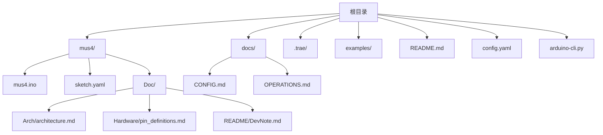
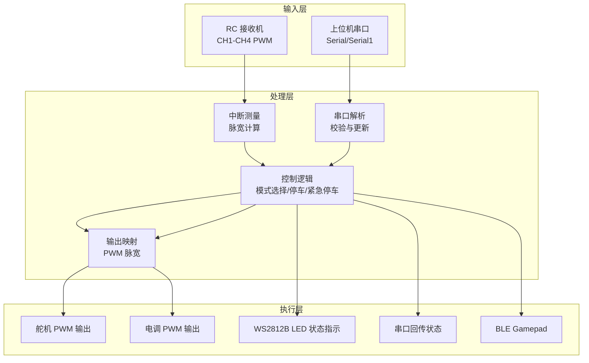
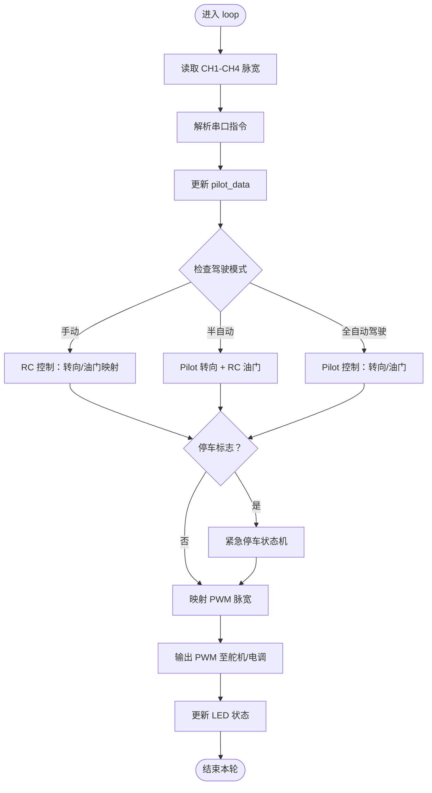
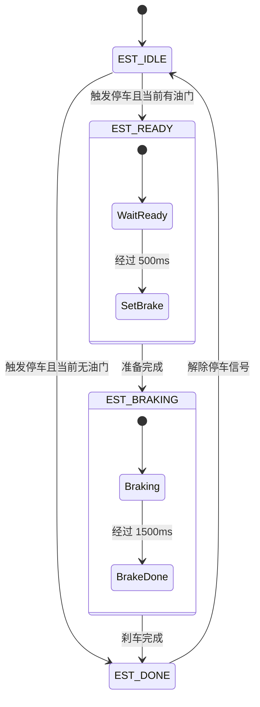
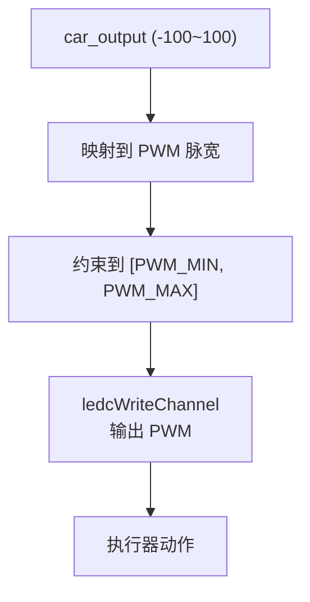
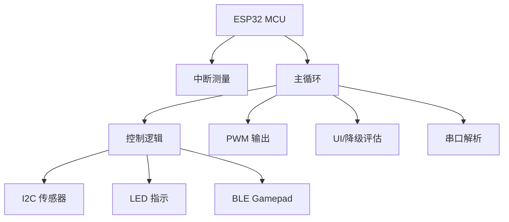

# 系统概览

<cite>
**本文引用的文件**
- [README.md](file://README.md)
- [mus4.ino](file://mus4/mus4.ino)
- [sketch.yaml](file://mus4/sketch.yaml)
- [architecture.md](file://mus4/Doc/Arch/architecture.md)
- [pin_definitions.md](file://mus4/Doc/Hardware/pin_definitions.md)
- [DevNote.md](file://mus4/Doc/README/DevNote.md)
- [CONFIG.md](file://docs/CONFIG.md)
- [OPERATIONS.md](file://docs/OPERATIONS.md)
</cite>

## 目录
1. [简介](#简介)
2. [项目结构](#项目结构)
3. [核心组件](#核心组件)
4. [架构总览](#架构总览)
5. [详细组件分析](#详细组件分析)
6. [依赖关系分析](#依赖关系分析)
7. [性能考量](#性能考量)
8. [故障排查指南](#故障排查指南)
9. [结论](#结论)
10. [附录](#附录)

## 简介
MUS4 是基于 ESP32 的自动驾驶小车控制固件，面向 LP-MU-S4 扩展板（MUS4-v2.3 PCB）。系统围绕“实时性、模块化、安全性”三大目标设计，提供信号采集（RC 接收机 PWM 与上位机串口）、控制决策（多模式控制逻辑）、执行输出（舵机转向与电调油门）、安全机制（紧急停车状态机）与蓝牙手柄支持等能力。系统采用分层架构与硬件抽象，确保在资源受限的嵌入式平台上实现稳定可靠的控制闭环。

## 项目结构
仓库采用“顶层文档 + 核心固件 + 文档”的组织方式，便于开发者快速定位关键信息与源码。

图表来源
- [README.md](file://README.md#L1-L39)
- [mus4.ino](file://mus4/mus4.ino#L1-L1290)
- [sketch.yaml](file://mus4/sketch.yaml#L1-L3)
- [architecture.md](file://mus4/Doc/Arch/architecture.md#L1-L245)
- [pin_definitions.md](file://mus4/Doc/Hardware/pin_definitions.md#L1-L225)
- [DevNote.md](file://mus4/Doc/README/DevNote.md#L1-L122)
- [CONFIG.md](file://docs/CONFIG.md#L1-L24)
- [OPERATIONS.md](file://docs/OPERATIONS.md#L1-L21)

章节来源
- [README.md](file://README.md#L1-L39)
- [mus4.ino](file://mus4/mus4.ino#L1-L1290)
- [sketch.yaml](file://mus4/sketch.yaml#L1-L3)
- [architecture.md](file://mus4/Doc/Arch/architecture.md#L1-L245)
- [pin_definitions.md](file://mus4/Doc/Hardware/pin_definitions.md#L1-L225)
- [DevNote.md](file://mus4/Doc/README/DevNote.md#L1-L122)
- [CONFIG.md](file://docs/CONFIG.md#L1-L24)
- [OPERATIONS.md](file://docs/OPERATIONS.md#L1-L21)

## 核心组件
- 信号采集
  - RC 接收机 PWM 输入：CH1（转向）、CH2（油门）、CH3（停车）、CH4（模式），通过中断测量脉宽。
  - 上位机串口指令：通过串口解析“T:S\n”或带校验的“payload*CS\n”，更新 pilot_data。
- 控制决策
  - 多模式控制逻辑：手动（RC）、半自动（Pilot 转向 + RC 油门）、全自动驾驶（Pilot 控制）。
  - 停车/解锁控制：CH3 按压时长决定锁定/解锁，结合紧急停车状态机。
- 执行输出
  - 舵机转向：50Hz PWM，映射范围基于 SERVO_MID 与 SERVO_RANGE。
  - 电调油门：50Hz PWM，映射范围基于 MOTOR_MID 与 MOTOR_RANGE。
- 安全机制
  - 紧急停车状态机：EST_IDLE → EST_READY（缓冲）→ EST_BRAKING（刹车）→ EST_DONE（完成），并支持解除后重置。
- 蓝牙手柄支持
  - 可选启用 BLE Gamepad 模式，将 RC 信号映射为手柄轴输入，便于无线控制。

章节来源
- [mus4.ino](file://mus4/mus4.ino#L41-L80)
- [mus4.ino](file://mus4/mus4.ino#L1104-L1150)
- [mus4.ino](file://mus4/mus4.ino#L1152-L1290)
- [architecture.md](file://mus4/Doc/Arch/architecture.md#L117-L161)
- [DevNote.md](file://mus4/Doc/README/DevNote.md#L74-L81)

## 架构总览
系统采用“输入 → 决策 → 执行 → 反馈”的闭环架构，配合降级模式与自适应刷新策略，确保在传感器异常或负载较高时仍保持核心控制可用。

图表来源
- [architecture.md](file://mus4/Doc/Arch/architecture.md#L18-L45)
- [mus4.ino](file://mus4/mus4.ino#L414-L434)
- [mus4.ino](file://mus4/mus4.ino#L1152-L1290)

章节来源
- [architecture.md](file://mus4/Doc/Arch/architecture.md#L1-L245)
- [mus4.ino](file://mus4/mus4.ino#L1104-L1290)

## 详细组件分析

### 信号采集与中断处理
- RC 接收机输入通道
  - CH1（转向）、CH2（油门）、CH3（停车）、CH4（模式）均通过中断测量脉宽，上升沿记录时间戳，下降沿计算脉宽。
  - 仅 GPIO 34、36、39 为输入专用引脚，适合高阻抗信号采集。
- 上位机串口指令
  - 支持两种帧格式：基础“T:S\n”与带校验“payload*CS\n”，解析后更新 pilot_data 并回写 ACK/NACK。
  - 串口缓冲区结构体包含长度、帧计数、错误计数与溢出标记，便于统计与诊断。

图表来源
- [mus4.ino](file://mus4/mus4.ino#L1152-L1290)
- [mus4.ino](file://mus4/mus4.ino#L414-L434)
- [mus4.ino](file://mus4/mus4.ino#L344-L411)

章节来源
- [mus4.ino](file://mus4/mus4.ino#L41-L80)
- [mus4.ino](file://mus4/mus4.ino#L414-L434)
- [mus4.ino](file://mus4/mus4.ino#L344-L411)
- [pin_definitions.md](file://mus4/Doc/Hardware/pin_definitions.md#L34-L46)

### 控制决策与多模式逻辑
- 驾驶模式
  - 手动（0）：RC 完全控制；半自动（1）：Pilot 转向 + RC 油门；全自动驾驶（2）：Pilot 控制。
  - 模式切换由 CH4（模式）通道脉宽决定，映射到宏定义。
- 停车/解锁控制
  - CH3 按压超过阈值时间触发状态切换：解锁需 1s，锁定需 0.5s；状态改变时重置紧急停车状态机。
- 紧急停车状态机
  - EST_IDLE → EST_READY（缓冲 500ms，油门设为 15）→ EST_BRAKING（刹车 1500ms，油门 -100）→ EST_DONE（油门归零）。
  - 解除停车信号后重置为空闲。

图表来源
- [mus4.ino](file://mus4/mus4.ino#L221-L232)
- [mus4.ino](file://mus4/mus4.ino#L474-L525)
- [architecture.md](file://mus4/Doc/Arch/architecture.md#L123-L151)

章节来源
- [mus4.ino](file://mus4/mus4.ino#L75-L80)
- [mus4.ino](file://mus4/mus4.ino#L771-L786)
- [mus4.ino](file://mus4/mus4.ino#L686-L740)
- [mus4.ino](file://mus4/mus4.ino#L474-L525)
- [DevNote.md](file://mus4/Doc/README/DevNote.md#L67-L73)

### 执行输出与 PWM 映射
- PWM 生成
  - 使用 ESP32 ledc 库生成 50Hz、14bit 分辨率的 PWM。
  - 舵机映射：SERVO_MID ± SERVO_RANGE；电调映射：MOTOR_MID ± MOTOR_RANGE。
  - 输出前进行约束，确保在 PWM_MIN 与 PWM_MAX 之间。
- LED 状态指示
  - 手动：绿色；半自动：黄色；全自动驾驶：蓝色；紧急停车：当前模式颜色 + 红色闪烁。

图表来源
- [mus4.ino](file://mus4/mus4.ino#L1269-L1276)
- [mus4.ino](file://mus4/mus4.ino#L240-L274)
- [DevNote.md](file://mus4/Doc/README/DevNote.md#L56-L60)

章节来源
- [mus4.ino](file://mus4/mus4.ino#L440-L448)
- [mus4.ino](file://mus4/mus4.ino#L1269-L1276)
- [DevNote.md](file://mus4/Doc/README/DevNote.md#L56-L60)

### 安全机制与降级模式
- 降级模式
  - 触发条件：传感器无效（INA219/MPU6050）、UI 渲染耗时 >150ms、串口回写拥塞。
  - 行为：关闭波形图、降低 UI 刷新频率、保留核心控制与状态输出。
- 紧急停车
  - 与降级模式相互独立，优先保障安全。

章节来源
- [CONFIG.md](file://docs/CONFIG.md#L3-L6)
- [mus4.ino](file://mus4/mus4.ino#L290-L305)
- [mus4.ino](file://mus4/mus4.ino#L474-L525)

### 蓝牙手柄支持
- 可选启用 ENABLE_GAMEPAD_MODE 宏，使用 BleGamepad 库将 RC 信号映射为手柄轴输入。
- 映射关系：CH1（转向）→ Right Thumb X；CH2（油门）→ Left Thumb Y。
- 设备名称：Gamepad MU03。

章节来源
- [mus4.ino](file://mus4/mus4.ino#L30-L34)
- [mus4.ino](file://mus4/mus4.ino#L1087-L1102)
- [DevNote.md](file://mus4/Doc/README/DevNote.md#L74-L81)

## 依赖关系分析
- 硬件抽象层
  - 引脚定义集中在 mus4.ino 中，配合 pin_definitions.md 与架构文档，形成清晰的硬件抽象。
- 外设库
  - I2C：Wire（INA219、MPU6050）。
  - LED：FastLED（WS2812B）。
  - 传感器：Adafruit_MPU6050、Adafruit_INA219。
  - 蓝牙：BleGamepad（可选）。
- 任务调度
  - 主循环按固定周期更新传感器、解析串口、执行控制逻辑、输出 PWM 与 LED，同时维护 UI 与降级评估。

图表来源
- [mus4.ino](file://mus4/mus4.ino#L1104-L1150)
- [mus4.ino](file://mus4/mus4.ino#L1152-L1290)
- [architecture.md](file://mus4/Doc/Arch/architecture.md#L1-L245)

章节来源
- [mus4.ino](file://mus4/mus4.ino#L24-L29)
- [mus4.ino](file://mus4/mus4.ino#L1104-L1150)
- [mus4.ino](file://mus4/mus4.ino#L1152-L1290)

## 性能考量
- 实时性要求
  - RC 数据更新周期约 16ms（~60Hz），传感器更新 1000ms（1Hz），UI 更新 16ms（60Hz）。
  - PWM 输出周期 20ms（50Hz），满足舵机/电调标准。
- 资源管理
  - 串口缓冲区与错误统计，避免阻塞主循环。
  - 降级模式动态调整 UI 刷新频率，保障核心控制。
- 硬件限制
  - GPIO 34/36/39 为输入专用引脚，需确保接收机提供稳定电平。
  - I2C 引脚（SDA=21, SCL=22）已验证，注意电平兼容与电源隔离。

章节来源
- [mus4.ino](file://mus4/mus4.ino#L109-L112)
- [CONFIG.md](file://docs/CONFIG.md#L8-L11)
- [pin_definitions.md](file://mus4/Doc/Hardware/pin_definitions.md#L20-L28)
- [pin_definitions.md](file://mus4/Doc/Hardware/pin_definitions.md#L96-L101)

## 故障排查指南
- 传感器异常
  - INA219/MPU6050 初始化失败：检查 I2C 地址、连线与电源；使用 I2C 扫描工具定位设备。
- 串口通信
  - 无法接收指令：确认波特率 115200、帧格式“T:S\n”或“payload*CS\n”，查看 ACK/NACK。
  - 帧校验失败：检查 payload ASCII 求和低 8 位与 CS 是否匹配。
- 按键与模式
  - CH3 按键无效：确认按键时长阈值（解锁 1s、锁定 0.5s），检查输入引脚悬空问题。
- 蓝牙手柄
  - 无法连接：确认 ENABLE_GAMEPAD_MODE 已启用，设备名称为 Gamepad MU03，映射轴符合预期。
- 降级模式
  - 触发后 UI 关闭波形并降低刷新频率：检查传感器有效性与 UI 渲染耗时。

章节来源
- [mus4.ino](file://mus4/mus4.ino#L868-L896)
- [mus4.ino](file://mus4/mus4.ino#L977-L1082)
- [mus4.ino](file://mus4/mus4.ino#L344-L411)
- [DevNote.md](file://mus4/Doc/README/DevNote.md#L74-L81)
- [CONFIG.md](file://docs/CONFIG.md#L3-L6)

## 结论
MUS4 通过清晰的模块划分与硬件抽象，在 ESP32 上实现了稳定高效的自动驾驶小车控制。系统具备多模式控制、安全停车、降级模式与蓝牙手柄支持等特性，既满足教学与演示需求，也为进一步扩展（如视觉/路径规划）提供了良好的基础。建议在部署时严格遵循引脚与电源规范，充分利用降级与诊断能力，确保系统在复杂环境下仍能可靠运行。

## 附录
- 开发环境与工具
  - Arduino CLI 配置：fqbn 与端口见 sketch.yaml。
  - 文档与笔记：DevNote.md 提供开发要点与已禁用/启用功能说明。
- 操作与测试
  - 启动后进入增量更新模式；通过串口输入 TEST/BENCH/STRESS/REGRESS 进行验证。
  - 数据帧格式与回执详见 CONFIG.md 与 OPERATIONS.md。

章节来源
- [sketch.yaml](file://mus4/sketch.yaml#L1-L3)
- [DevNote.md](file://mus4/Doc/README/DevNote.md#L1-L122)
- [CONFIG.md](file://docs/CONFIG.md#L1-L24)
- [OPERATIONS.md](file://docs/OPERATIONS.md#L1-L21)