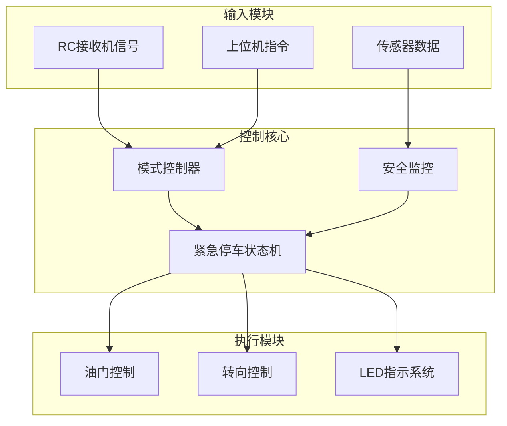
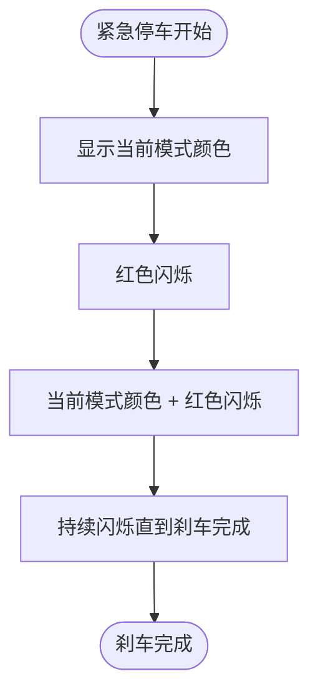
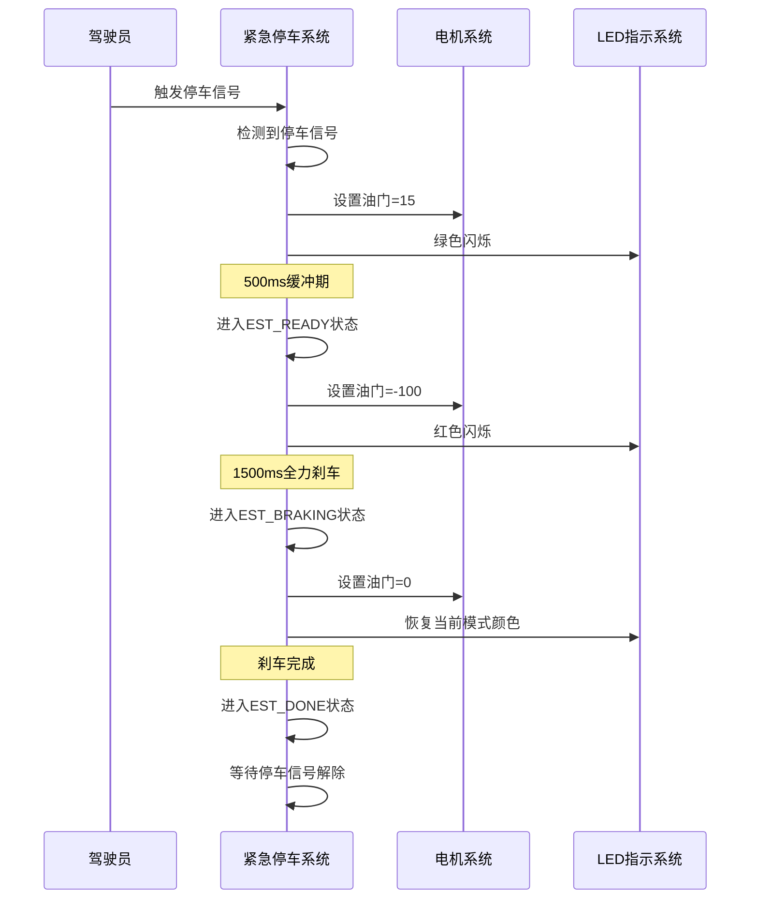
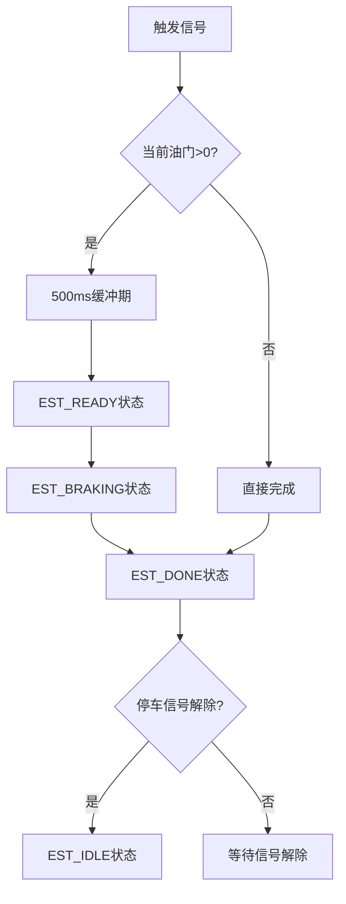

# 紧急停车系统

<cite>
**本文档引用的文件**
- [mus4.ino](file://mus4/mus4.ino)
- [architecture.md](file://mus4/Doc/Arch/architecture.md)
- [pin_definitions.md](file://mus4/Doc/Hardware/pin_definitions.md)
- [sketch.yaml](file://mus4/sketch.yaml)
- [README.md](file://README.md)
</cite>

## 目录
1. [简介](#简介)
2. [系统架构概述](#系统架构概述)
3. [紧急停车状态机设计](#紧急停车状态机设计)
4. [状态转换详解](#状态转换详解)
5. [LED指示系统](#led指示系统)
6. [操作时序分析](#操作时序分析)
7. [安全保护机制](#安全保护机制)
8. [性能考虑](#性能考虑)
9. [故障排除指南](#故障排除指南)
10. [结论](#结论)

## 简介

MUS4紧急停车系统是一个专为自动驾驶小车设计的安全控制系统，采用状态机架构实现可靠的紧急制动功能。该系统能够在检测到危险情况时自动启动紧急停车程序，通过精确控制油门输出和LED指示来确保车辆安全停止。

系统基于ESP32微控制器平台，集成了RC遥控接收机信号采集、上位机串行通信、传感器数据处理和执行器控制等多种功能。紧急停车系统作为核心安全机制，为整个控制系统提供了可靠的安全保障。

## 系统架构概述

MUS4系统采用模块化架构设计，紧急停车系统作为独立的安全模块集成在主控制逻辑中。系统的主要组成部分包括：



**图表来源**
- [architecture.md](file://mus4/Doc/Arch/architecture.md#L18-L45)

系统通过RC接收机的停车信号（CH3通道）和上位机指令来触发紧急停车状态机，同时结合传感器数据进行安全判断。

**章节来源**
- [architecture.md](file://mus4/Doc/Arch/architecture.md#L1-L245)

## 紧急停车状态机设计

紧急停车状态机采用四状态设计，确保在各种紧急情况下都能提供可靠的安全保护：

```mermaid
stateDiagram-v2
[*] --> EST_IDLE
EST_IDLE --> EST_READY : 检测到停车信号且有油门
EST_IDLE --> EST_DONE : 检测到停车信号且无油门
state EST_READY {
[*] --> WaitReady
WaitReady --> SetBrake : 经过500ms缓冲期
note right of WaitReady : 缓冲期，油门设为15
}
EST_READY --> EST_BRAKING : 准备完成
state EST_BRAKING {
[*] --> Braking
Braking --> BrakeDone : 经过1500ms全力刹车
note right of Braking : 全力刹车，油门设为-100
}
EST_BRAKING --> EST_DONE : 刹车完成
state EST_DONE {
note right of EST_DONE : 停车完成，油门归零
}
EST_DONE --> EST_IDLE : 解除停车信号
```

**图表来源**
- [architecture.md](file://mus4/Doc/Arch/architecture.md#L123-L151)

### 状态机特点

1. **状态隔离**：每个状态都有明确的功能职责和持续时间
2. **安全优先**：系统始终优先考虑安全，避免任何可能导致危险的状态
3. **可恢复性**：系统设计允许在紧急情况解决后自动恢复正常运行
4. **实时响应**：状态转换基于精确的时间控制，确保及时响应

**章节来源**
- [mus4.ino](file://mus4/mus4.ino#L221-L232)
- [architecture.md](file://mus4/Doc/Arch/architecture.md#L117-L161)

## 状态转换详解

### EST_IDLE（空闲状态）

EST_IDLE是紧急停车状态机的初始状态，系统在此状态下等待停车信号的触发。

**触发条件**：
- 检测到停车信号（`car_output.park == 1`）
- 当前油门值大于0

**行为特征**：
- 保持当前油门输出不变
- 记录状态转换时间
- 设置新的油门目标值为15（小油门）

**状态转换**：
- 满足触发条件 → 转换到EST_READY
- 不满足触发条件 → 转换到EST_DONE

### EST_READY（准备刹车状态）

EST_READY状态提供500ms的缓冲期，让系统和车辆有时间准备刹车。

**设计原理**：
- **缓冲期设计**：500ms的缓冲期确保系统能够稳定地进入刹车状态
- **小油门输出**：将油门设置为15，提供轻微的制动力，防止车辆继续加速
- **系统稳定**：给传感器和执行器充足的时间来响应状态变化

**持续时间**：500ms（`EMERGENCY_STOP_READY_DURATION`）

**油门输出**：15（小油门）

### EST_BRAKING（全力刹车状态）

EST_BRAKING状态提供1500ms的强力刹车，确保车辆能够快速停止。

**设计原理**：
- **强力刹车**：将油门设置为-100，提供最大制动力
- **刹车持续时间**：1500ms确保车辆有足够时间完全停止
- **安全冗余**：即使在极端情况下也能保证车辆停止

**持续时间**：1500ms（`EMERGENCY_STOP_BRAKE_DURATION`）

**油门输出**：-100（最大刹车）

### EST_DONE（刹车完成状态）

EST_DONE状态表示紧急停车过程已完成，系统进入最终的停止状态。

**行为特征**：
- 油门输出归零，完全停止动力输出
- 系统等待停车信号解除
- 准备重新进入正常运行状态

**状态转换**：
- 停车信号解除 → 转换到EST_IDLE
- 系统重置 → 转换到EST_IDLE

**章节来源**
- [mus4.ino](file://mus4/mus4.ino#L474-L525)

## LED指示系统

紧急停车系统配备了智能LED指示系统，通过不同的颜色组合来反映当前状态和系统健康状况。

### LED颜色映射

| 状态 | 颜色 | 模式 | 说明 |
|------|------|------|------|
| 手动模式 | 绿色 | 恒亮 | 车辆由RC遥控器控制 |
| 半自动模式 | 黄色 | 恒亮 | 自动转向，RC控制油门 |
| 自动驾驶模式 | 蓝色 | 恒亮 | 完全由上位机控制 |
| 紧急停车 | 红色闪烁 | 闪烁 | 当前模式颜色 + 红色闪烁 |
| 初始化 | 蓝色 | 恒亮 | 系统启动时显示 |

### 紧急停车LED指示

在紧急停车过程中，LED系统采用双色闪烁模式：



**图表来源**
- [mus4.ino](file://mus4/mus4.ino#L1170-L1239)

**章节来源**
- [architecture.md](file://mus4/Doc/Arch/architecture.md#L215-L226)
- [mus4.ino](file://mus4/mus4.ino#L240-L274)

## 操作时序分析

紧急停车系统的操作时序严格按照预定义的时间表执行，确保在各种紧急情况下都能提供可靠的安全保护。

### 标准紧急停车时序



**图表来源**
- [mus4.ino](file://mus4/mus4.ino#L474-L525)

### 实际执行时序

| 时间点 | 状态 | 油门值 | LED状态 | 系统行为 |
|--------|------|--------|---------|----------|
| t=0ms | EST_IDLE | 当前值 | 当前模式颜色 | 等待触发 |
| t=0ms | EST_IDLE | 15 | 当前模式颜色闪烁 | 开始缓冲期 |
| t=500ms | EST_READY | 15 | 当前模式颜色闪烁 | 缓冲期结束 |
| t=500ms | EST_READY | -100 | 红色闪烁 | 进入全力刹车 |
| t=2000ms | EST_BRAKING | -100 | 红色闪烁 | 全力刹车中 |
| t=3500ms | EST_DONE | 0 | 恢复当前模式颜色 | 刹车完成 |
| t=3500ms | EST_IDLE | 0 | 恢复当前模式颜色 | 等待下一次触发 |

**章节来源**
- [mus4.ino](file://mus4/mus4.ino#L229-L231)

## 安全保护机制

紧急停车系统采用了多层次的安全保护机制，确保在各种异常情况下都能提供可靠的安全保障。

### 时间控制机制

系统通过精确的时间控制确保紧急停车过程的安全性和可靠性：



**图表来源**
- [mus4.ino](file://mus4/mus4.ino#L484-L525)

### 状态监控机制

系统实现了完善的状态监控和保护机制：

1. **状态完整性检查**：确保状态转换的完整性和正确性
2. **超时保护**：防止状态机卡死在某个状态
3. **错误恢复**：在检测到异常时自动恢复到安全状态
4. **系统健康监控**：监控LED闪烁状态以检测系统异常

### 硬件保护机制

紧急停车系统还集成了硬件层面的保护机制：

- **PWM输出限制**：确保油门输出在安全范围内
- **传感器数据验证**：验证传感器数据的有效性
- **通信超时检测**：检测串口通信异常
- **电源状态监控**：监控系统电源状态

**章节来源**
- [mus4.ino](file://mus4/mus4.ino#L276-L305)

## 性能考虑

紧急停车系统在设计时充分考虑了性能要求和实时性需求。

### 实时性能

系统采用非阻塞的定时器机制，确保紧急停车状态机不会影响其他系统功能：

- **毫秒级精度**：使用`millis()`函数提供精确的时间控制
- **非阻塞设计**：状态转换不使用`delay()`函数，避免阻塞主循环
- **高效算法**：状态转换逻辑简单高效，减少CPU占用

### 资源优化

系统在资源使用方面进行了优化：

- **内存使用**：只使用必要的全局变量存储状态信息
- **处理效率**：状态机逻辑简洁，CPU开销最小化
- **功耗控制**：LED指示系统采用低功耗设计

### 可靠性保证

系统通过多种机制确保高可靠性：

- **状态机完整性**：所有状态转换都有明确的触发条件
- **错误处理**：完善的错误检测和处理机制
- **系统自检**：定期检查系统状态和组件健康状况

## 故障排除指南

### 常见问题诊断

#### 紧急停车系统不响应

**可能原因**：
1. 停车信号未正确触发
2. RC接收机信号异常
3. 系统处于EST_DONE状态且停车信号未解除

**解决方案**：
1. 检查RC接收机CH3通道连接
2. 验证停车按钮操作是否正确
3. 确认停车信号已解除

#### LED指示异常

**可能原因**：
1. LED驱动电路故障
2. FastLED库配置错误
3. 电源供应不足

**解决方案**：
1. 检查LED连接和电源
2. 验证LED颜色映射配置
3. 测试LED单独功能

#### 状态机卡死

**可能原因**：
1. 时间计算错误
2. 状态转换条件不满足
3. 系统资源不足

**解决方案**：
1. 检查系统时钟同步
2. 验证状态转换逻辑
3. 监控系统资源使用情况

### 调试工具

系统提供了多种调试工具来帮助诊断问题：

- **串口调试输出**：详细的系统状态信息
- **LED状态指示**：直观的系统健康状态
- **波形图显示**：实时显示油门和转向信号
- **单元测试**：验证关键功能的正确性

**章节来源**
- [mus4.ino](file://mus4/mus4.ino#L153-L200)

## 结论

MUS4紧急停车系统通过精心设计的状态机架构和多重安全保护机制，为自动驾驶小车提供了可靠的安全保障。系统采用四状态设计，结合精确的时间控制和智能的LED指示，确保在各种紧急情况下都能提供及时、有效的安全保护。

### 设计优势

1. **安全性优先**：系统始终将安全放在首位，提供多重保护机制
2. **实时响应**：精确的时间控制确保及时响应紧急情况
3. **用户友好**：清晰的LED指示帮助用户了解系统状态
4. **易于维护**：模块化设计便于故障诊断和系统维护

### 技术创新

系统在紧急停车技术方面的创新包括：

- **渐进式刹车设计**：通过缓冲期和全力刹车的组合提供平滑的刹车过程
- **智能LED指示**：通过颜色组合提供丰富的状态信息
- **实时状态监控**：持续监控系统状态和组件健康状况
- **故障自恢复**：具备自动故障检测和恢复能力

紧急停车系统作为MUS4系统的核心安全部分，为整个自动驾驶小车提供了坚实的安全基础，确保在各种复杂环境下都能为驾驶员和周围环境提供可靠的安全保障。