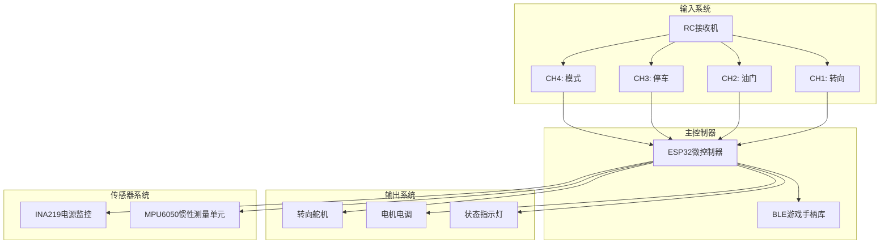
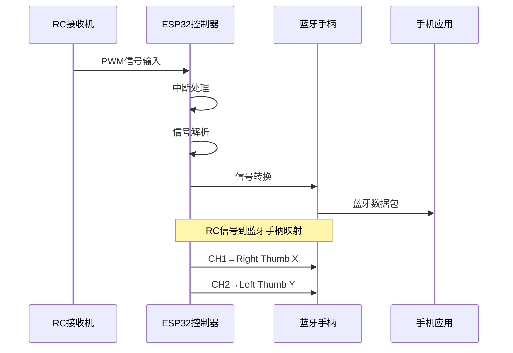
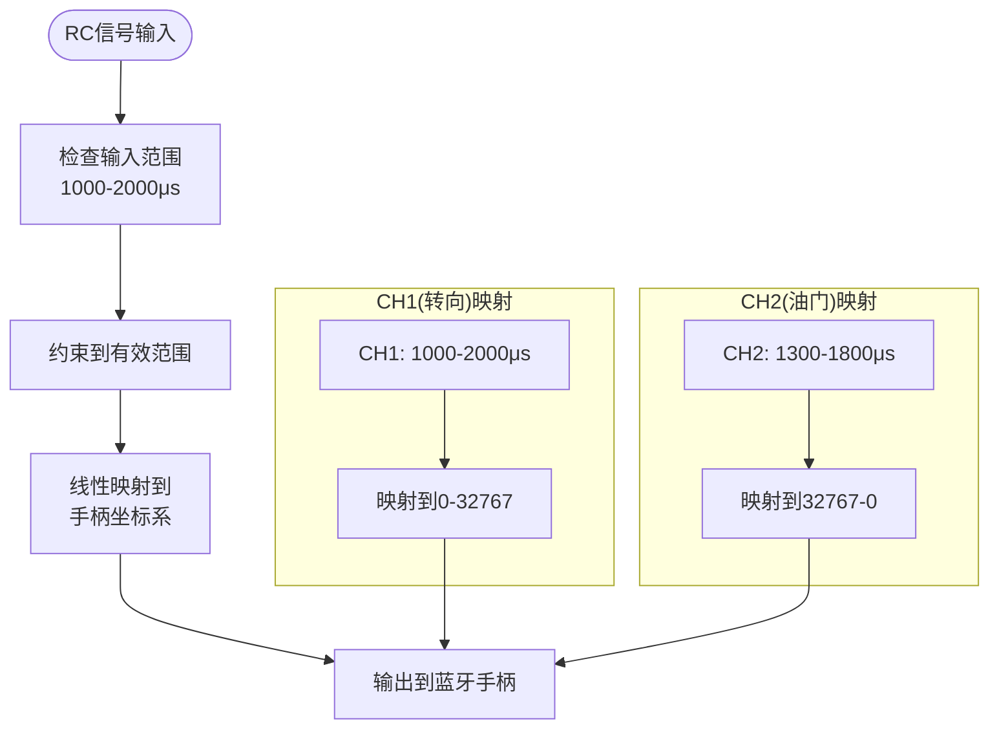
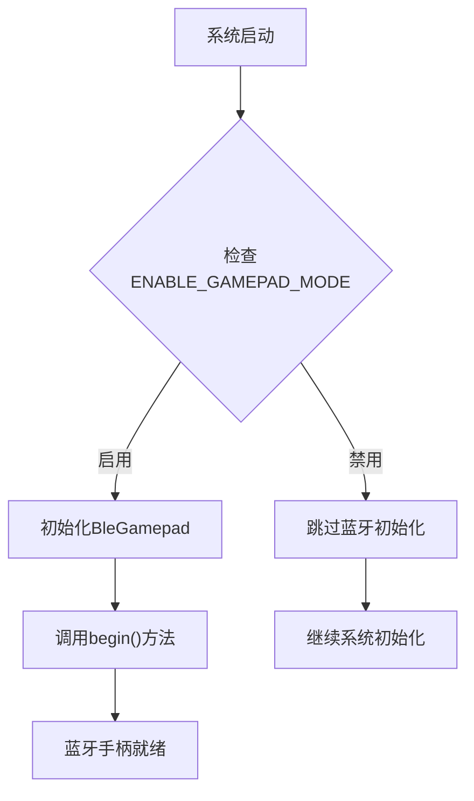
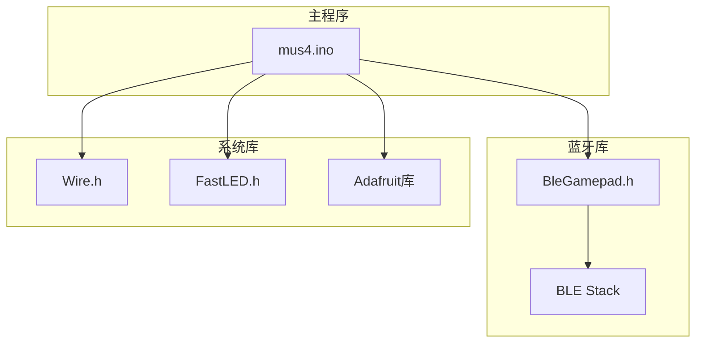
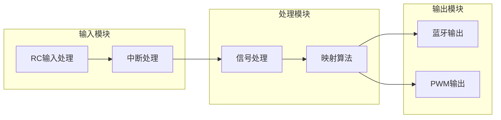

# 蓝牙手柄集成

<cite>
**本文档引用的文件**
- [mus4.ino](file://mus4/mus4.ino)
- [Enable ESP32 Bluetooth Gamepad Mode.md](file://.trae/documents/Enable ESP32 Bluetooth Gamepad Mode.md)
- [DevNote.md](file://mus4/Doc/README/DevNote.md)
- [pin_definitions.md](file://mus4/Doc/Hardware/pin_definitions.md)
- [OPERATIONS.md](file://docs/OPERATIONS.md)
- [CONFIG.md](file://docs/CONFIG.md)
- [sketch.yaml](file://mus4/sketch.yaml)
</cite>

## 目录
1. [简介](#简介)
2. [项目结构](#项目结构)
3. [核心组件](#核心组件)
4. [架构概览](#架构概览)
5. [详细组件分析](#详细组件分析)
6. [依赖关系分析](#依赖关系分析)
7. [性能考虑](#性能考虑)
8. [故障排除指南](#故障排除指南)
9. [结论](#结论)
10. [附录](#附录)

## 简介
本文档详细说明了MUS4项目中蓝牙手柄集成功能的实现和使用方法。该功能通过ENABLE_GAMEPAD_MODE宏定义启用，将RC遥控器信号转换为蓝牙游戏手柄输入，实现无线控制体验。

## 项目结构
MUS4项目采用模块化设计，主要包含以下关键组件：

**图表来源**
- [mus4.ino](file://mus4/mus4.ino#L1-L50)
- [pin_definitions.md](file://mus4/Doc/Hardware/pin_definitions.md#L34-L62)

**章节来源**
- [mus4.ino](file://mus4/mus4.ino#L1-L50)
- [pin_definitions.md](file://mus4/Doc/Hardware/pin_definitions.md#L1-L30)

## 核心组件
蓝牙手柄集成功能的核心组件包括：

### 1. 宏定义控制系统
- **ENABLE_GAMEPAD_MODE**: 控制蓝牙手柄功能的启用/禁用
- **BleGamepad**: 蓝牙游戏手柄库实例
- **RC通道映射**: CH1→转向, CH2→油门, CH3→停车, CH4→模式

### 2. 传感器系统
- **INA219**: 电压电流监测
- **MPU6050**: 惯性测量单元
- **I2C总线**: 通信接口

### 3. 执行器系统
- **转向舵机**: GPIO 23
- **电机电调**: GPIO 25
- **状态LED**: GPIO 5

**章节来源**
- [mus4.ino](file://mus4/mus4.ino#L30-L34)
- [mus4.ino](file://mus4/mus4.ino#L41-L47)
- [DevNote.md](file://mus4/Doc/README/DevNote.md#L74-L81)

## 架构概览
蓝牙手柄集成采用分层架构设计，实现了RC信号到蓝牙手柄输入的完整转换流程：

**图表来源**
- [mus4.ino](file://mus4/mus4.ino#L1087-L1102)
- [mus4.ino](file://mus4/mus4.ino#L1194-L1196)

## 详细组件分析

### ENABLE_GAMEPAD_MODE宏定义分析
该宏定义是蓝牙手柄功能的开关，具有以下特性：

#### 启用条件
- 编译时定义宏
- 包含BleGamepad.h头文件
- 创建BleGamepad实例对象

#### 功能作用
- 条件编译蓝牙手柄相关代码
- 减少内存占用（未启用时不包含蓝牙库）
- 支持功能开关的灵活性

**章节来源**
- [mus4.ino](file://mus4/mus4.ino#L30-L34)
- [DevNote.md](file://mus4/Doc/README/DevNote.md#L74-L76)

### RC信号到蓝牙手柄映射算法

#### CH1（转向）→ Right Thumb X轴
映射算法实现细节：
- 输入范围：1000-2000μs
- 输出范围：0-32767（正向最大）
- 使用constrain进行边界限制
- 采用map函数进行线性映射

#### CH2（油门）→ Left Thumb Y轴  
映射算法实现细节：
- 输入范围：1300-1800μs
- 输出范围：32767-0（反向映射）
- 特殊范围限制以提高灵敏度
- 线性映射确保响应一致性

**图表来源**
- [mus4.ino](file://mus4/mus4.ino#L1088-L1101)

**章节来源**
- [mus4.ino](file://mus4/mus4.ino#L1088-L1101)
- [Enable ESP32 Bluetooth Gamepad Mode.md](file://.trae/documents/Enable ESP32 Bluetooth Gamepad Mode.md#L8-L12)

### sendGamepadPacket()函数实现
该函数负责实时将RC信号转换为蓝牙手柄数据：

#### 核心功能
1. **连接检测**: 检查蓝牙手柄是否已连接
2. **信号读取**: 从pwm_value数组获取RC通道数据
3. **范围转换**: 将PWM脉冲宽度转换为手柄坐标
4. **数据输出**: 设置左右拇指坐标

#### 实现特点
- 周期性调用（每16ms）
- 边界安全检查
- 线性插值算法
- 实时响应设计

**章节来源**
- [mus4.ino](file://mus4/mus4.ino#L1088-L1101)

### 蓝牙手柄初始化流程

#### setup()函数中的初始化

**图表来源**
- [mus4.ino](file://mus4/mus4.ino#L1115-L1117)

**章节来源**
- [mus4.ino](file://mus4/mus4.ino#L1104-L1150)

## 依赖关系分析

### 外部库依赖
蓝牙手柄功能依赖以下库：

**图表来源**
- [mus4.ino](file://mus4/mus4.ino#L24-L34)

### 内部模块依赖

**图表来源**
- [mus4.ino](file://mus4/mus4.ino#L414-L431)
- [mus4.ino](file://mus4/mus4.ino#L1088-L1101)

**章节来源**
- [mus4.ino](file://mus4/mus4.ino#L24-L34)
- [mus4.ino](file://mus4/mus4.ino#L414-L431)

## 性能考虑

### 内存使用优化
- 条件编译减少内存占用
- 局部变量优化
- 中断处理避免阻塞

### 响应延迟控制
- RC数据更新间隔：16ms
- 蓝牙数据发送间隔：16ms
- UI更新频率：60Hz

### 功耗管理
- 传感器采样间隔：1000ms
- 降级模式自动节流
- 空闲时降低刷新频率

**章节来源**
- [mus4.ino](file://mus4/mus4.ino#L109-L111)
- [CONFIG.md](file://docs/CONFIG.md#L8-L11)

## 故障排除指南

### 蓝牙连接问题
1. **设备无法发现**
   - 检查ENABLE_GAMEPAD_MODE宏定义
   - 确认BleGamepad库正确安装
   - 验证设备名称"Gamepad MU03"

2. **连接不稳定**
   - 检查RC信号强度
   - 确认RC通道范围设置
   - 避免强电磁干扰

3. **手柄无响应**
   - 检查pwm_value数组数据
   - 验证映射算法执行
   - 确认蓝牙连接状态

### RC信号问题
1. **信号异常**
   - 检查RC接收机供电
   - 验证接线正确性
   - 确认中断处理正常

2. **映射不准确**
   - 校准RC中位值
   - 检查范围限制设置
   - 验证map函数参数

### 系统稳定性
1. **降级模式触发**
   - 检查传感器数据有效性
   - 监控UI渲染性能
   - 查看串口错误信息

2. **内存不足**
   - 确认宏定义正确
   - 检查库文件大小
   - 优化数据结构

**章节来源**
- [DevNote.md](file://mus4/Doc/README/DevNote.md#L74-L81)
- [OPERATIONS.md](file://docs/OPERATIONS.md#L5-L7)
- [CONFIG.md](file://docs/CONFIG.md#L3-L6)

## 结论
MUS4项目的蓝牙手柄集成功能提供了完整的RC信号到蓝牙手柄输入的转换解决方案。通过ENABLE_GAMEPAD_MODE宏定义实现的功能开关，配合精确的RC通道映射算法，实现了CH1（转向）到Right Thumb X轴、CH2（油门）到Left Thumb Y轴的直观映射关系。

该实现具有以下优势：
- 模块化设计，易于维护和扩展
- 精确的信号映射算法
- 实时响应的处理机制
- 完善的故障诊断能力

## 附录

### 使用步骤指南
1. **启用功能**
   - 在mus4.ino中定义ENABLE_GAMEPAD_MODE
   - 确保BleGamepad.h库可用

2. **编译和上传**
   - 使用Arduino IDE或CLI工具
   - 确认编译无错误
   - 上传到ESP32开发板

3. **连接验证**
   - 打开手机蓝牙设置
   - 搜索"Gamepad MU03"设备
   - 配对并连接设备

4. **功能测试**
   - 移动RC摇杆观察手柄响应
   - 验证转向和油门映射
   - 检查连接稳定性

### 兼容性说明
- **硬件兼容**: ESP32 Firebeetle 2开发板
- **软件兼容**: Arduino IDE 2.x
- **库兼容**: BleGamepad库
- **操作系统**: Windows/Mac/Linux

### 开发资源
- **开发环境**: Arduino CLI + VSCode
- **配置文件**: sketch.yaml
- **文档**: 完整的技术文档
- **示例**: Python验证脚本

**章节来源**
- [.trae/documents/Enable ESP32 Bluetooth Gamepad Mode.md](file://.trae/documents/Enable ESP32 Bluetooth Gamepad Mode.md#L1-L16)
- [sketch.yaml](file://mus4/sketch.yaml#L1-L3)