# 软件架构

<cite>
**本文引用的文件**
- [README.md](file://README.md)
- [mus4.ino](file://mus4/mus4.ino)
- [architecture.md](file://mus4/Doc/Arch/architecture.md)
- [pin_definitions.md](file://mus4/Doc/Hardware/pin_definitions.md)
- [DevNote.md](file://mus4/Doc/README/DevNote.md)
- [sketch.yaml](file://mus4/sketch.yaml)
- [config.yaml](file://config.yaml)
- [getcurrent.ino](file://examples/getcurrent/getcurrent.ino)
- [testIIC.ino](file://examples/testIIC/testIIC.ino)
- [CONFIG.md](file://docs/CONFIG.md)
- [OPERATIONS.md](file://docs/OPERATIONS.md)
</cite>

## 更新摘要
**变更内容**
- 新增降级模式检测系统，包含自动触发条件和行为管理
- 增加性能监控机制，实时评估系统性能并进行自适应调整
- 实现自适应UI刷新频率，动态优化用户体验
- 新增测试与验证工具集，包括单元测试、性能基准和压力测试

## 目录
1. [简介](#简介)
2. [项目结构](#项目结构)
3. [核心组件](#核心组件)
4. [架构总览](#架构总览)
5. [详细组件分析](#详细组件分析)
6. [降级模式检测系统](#降级模式检测系统)
7. [性能监控与自适应行为](#性能监控与自适应行为)
8. [测试与验证体系](#测试与验证体系)
9. [依赖关系分析](#依赖关系分析)
10. [性能考量](#性能考量)
11. [故障排查指南](#故障排查指南)
12. [结论](#结论)
13. [附录](#附录)

## 简介
本项目为基于 ESP32 的自动驾驶小车底层控制程序（MUS4-v2.3 PCB 版本），采用事件驱动架构，围绕 RC 遥控信号采集、上位机串口指令解析、控制逻辑融合、执行器输出与安全机制展开。系统通过中断处理 RC PWM 信号，结合定时任务与状态机实现多模式控制策略，并集成传感器管理与通信协议，形成闭环控制链路。**新增的降级模式检测系统、性能监控和自适应行为**使系统具备了更强的鲁棒性和用户体验优化能力。

## 项目结构
- 文档与说明
  - 架构文档：系统概览、数据结构、运行逻辑、状态机与模块职责
  - 硬件引脚定义：明确各 GPIO 的功能、连接与配置
  - 开发笔记：开发环境、串口协议、模式与安全机制说明
  - 配置说明：降级模式、刷新与缓存、串口通信、测试命令
  - 操作手册：启动流程、降级模式操作、测试验证、维护指南
- 核心固件
  - 主程序：事件驱动主循环、中断处理、控制逻辑、输出映射、UI 与传感器读取
- 示例工程
  - 电流监测示例：展示 INA219 读取
  - I2C 测试示例：扫描与读写测试
- 配置文件
  - Arduino CLI 配置：FQBN、端口、波特率、构建路径
  - sketch.yaml：默认 FQBN 与端口

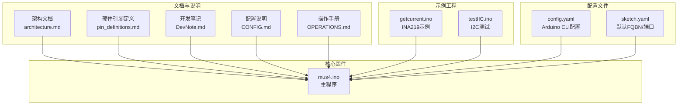

**图表来源**
- [architecture.md](file://mus4/Doc/Arch/architecture.md#L1-L245)
- [pin_definitions.md](file://mus4/Doc/Hardware/pin_definitions.md#L1-L225)
- [DevNote.md](file://mus4/Doc/README/DevNote.md#L1-L122)
- [CONFIG.md](file://docs/CONFIG.md#L1-L24)
- [OPERATIONS.md](file://docs/OPERATIONS.md#L1-L21)
- [mus4.ino](file://mus4/mus4.ino#L1-L1290)
- [getcurrent.ino](file://examples/getcurrent/getcurrent.ino#L1-L55)
- [testIIC.ino](file://examples/testIIC/testIIC.ino#L1-L613)
- [config.yaml](file://config.yaml#L1-L13)
- [sketch.yaml](file://mus4/sketch.yaml#L1-L3)

**章节来源**
- [README.md](file://README.md#L1-L39)
- [architecture.md](file://mus4/Doc/Arch/architecture.md#L1-L245)
- [pin_definitions.md](file://mus4/Doc/Hardware/pin_definitions.md#L1-L225)
- [DevNote.md](file://mus4/Doc/README/DevNote.md#L1-L122)
- [CONFIG.md](file://docs/CONFIG.md#L1-L24)
- [OPERATIONS.md](file://docs/OPERATIONS.md#L1-L21)
- [mus4.ino](file://mus4/mus4.ino#L1-L1290)
- [config.yaml](file://config.yaml#L1-L13)
- [sketch.yaml](file://mus4/sketch.yaml#L1-L3)

## 核心组件
- 事件驱动主循环
  - 周期性读取传感器、串口指令与 RC 信号，更新控制数据结构
  - 根据驾驶模式进行控制融合，执行紧急停车状态机与停车控制
  - 映射控制量到 PWM 并输出，更新 LED 状态与 UI
- 中断处理机制
  - 4 通道 RC 输入引脚绑定中断，记录上升沿时间并在下降沿计算脉宽
- 状态机
  - 紧急停车状态机：EST_IDLE → EST_READY → EST_BRAKING → EST_DONE
  - 停车/解锁控制：按键长按时切换状态
- 模块化设计
  - 传感器模块（INA219/MPU6050）封装读取与校验
  - 串口解析模块（含校验与命令解析）
  - 输出映射与 PWM 写入模块
  - UI 与波形图模块
  - 可选 BLE 手柄模式
- **新增** 降级模式检测系统
  - 自动检测系统健康状态，触发降级模式保护
  - 动态调整系统行为以维持基本功能
- **新增** 性能监控与自适应行为
  - 实时监控系统性能指标
  - 自适应调整刷新频率和资源分配

**章节来源**
- [mus4.ino](file://mus4/mus4.ino#L1152-L1290)
- [architecture.md](file://mus4/Doc/Arch/architecture.md#L117-L182)

## 架构总览
系统采用"输入-处理-输出-反馈"的闭环架构，RC 与上位机作为输入源，经由中断与串口解析得到原始控制信号；控制逻辑根据模式融合信号并执行安全机制；输出模块将控制量映射为 PWM 并驱动执行器；同时通过 UI 与串口反馈系统状态。**新增的降级模式检测系统**提供系统健康监控和保护机制，**性能监控与自适应行为**确保系统在各种条件下都能保持最佳性能。

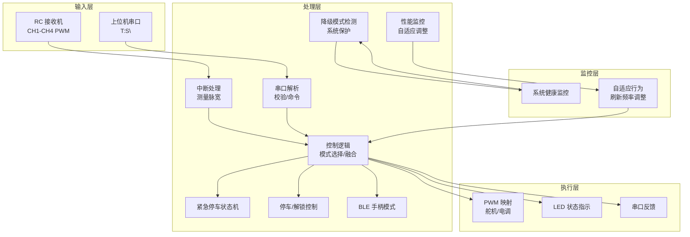

**图表来源**
- [architecture.md](file://mus4/Doc/Arch/architecture.md#L18-L45)
- [mus4.ino](file://mus4/mus4.ino#L414-L431)
- [mus4.ino](file://mus4/mus4.ino#L1152-L1290)
- [mus4.ino](file://mus4/mus4.ino#L276-L305)
- [mus4.ino](file://mus4/mus4.ino#L1282-L1288)

## 详细组件分析

### 1) 事件驱动主循环与控制流
- 主循环按固定间隔更新传感器、解析串口、读取 RC 信号、切换模式与停车状态
- 根据模式分支执行不同控制策略：手动、半自动、全自动生成输出
- 执行紧急停车状态机与 LED 状态切换，最后进行 PWM 映射与输出
- **新增** 性能监控：每秒评估系统性能并调整 UI 刷新频率

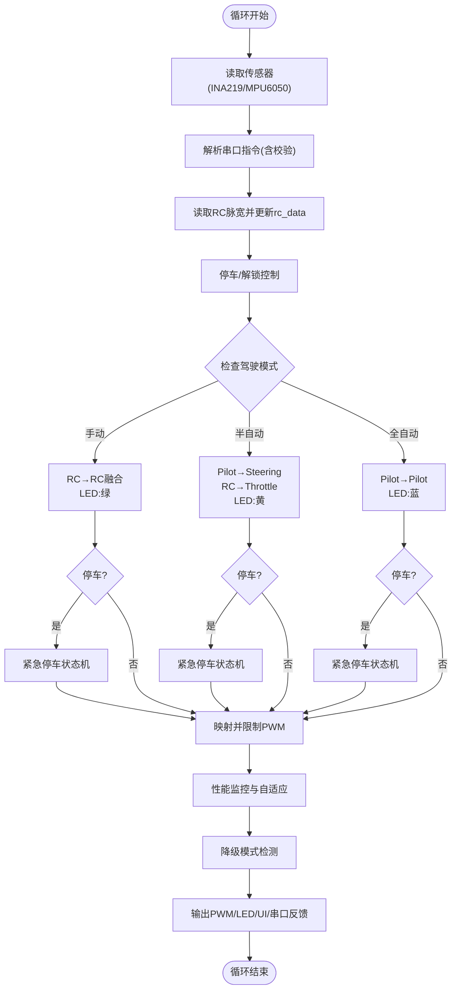

**图表来源**
- [mus4.ino](file://mus4/mus4.ino#L1152-L1290)
- [architecture.md](file://mus4/Doc/Arch/architecture.md#L72-L107)
- [mus4.ino](file://mus4/mus4.ino#L1282-L1288)
- [mus4.ino](file://mus4/mus4.ino#L276-L305)

**章节来源**
- [mus4.ino](file://mus4/mus4.ino#L1152-L1290)
- [architecture.md](file://mus4/Doc/Arch/architecture.md#L66-L107)

### 2) 中断处理机制（RC PWM 解析）
- 4 个 RC 输入引脚分别绑定中断函数，记录上升沿时间并在下降沿计算脉宽
- 使用微秒级计时保证解析精度，避免阻塞主循环

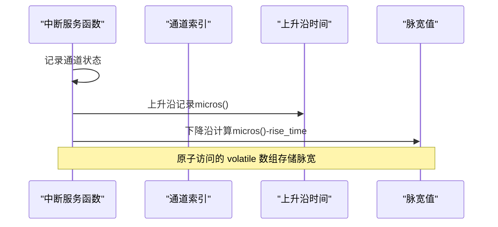

**图表来源**
- [mus4.ino](file://mus4/mus4.ino#L414-L431)

**章节来源**
- [mus4.ino](file://mus4/mus4.ino#L414-L431)
- [pin_definitions.md](file://mus4/Doc/Hardware/pin_definitions.md#L34-L46)

### 3) 紧急停车状态机
- EST_IDLE → EST_READY（缓冲 500ms，油门设为 15）→ EST_BRAKING（刹车 1500ms，油门设为 -100）→ EST_DONE（油门归零）
- 支持在停车解除后重置状态机

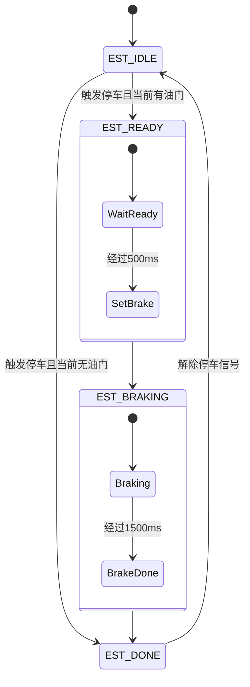

**图表来源**
- [mus4.ino](file://mus4/mus4.ino#L474-L525)
- [architecture.md](file://mus4/Doc/Arch/architecture.md#L123-L151)

**章节来源**
- [mus4.ino](file://mus4/mus4.ino#L474-L525)
- [architecture.md](file://mus4/Doc/Arch/architecture.md#L117-L161)

### 4) 停车/解锁控制（按键长按）
- CH3 通道用于停车/解锁控制
- 解锁：长按 >1s，进入 Drive 模式并重置紧急停车状态机
- 锁定：长按 >0.5s，进入 Park 模式

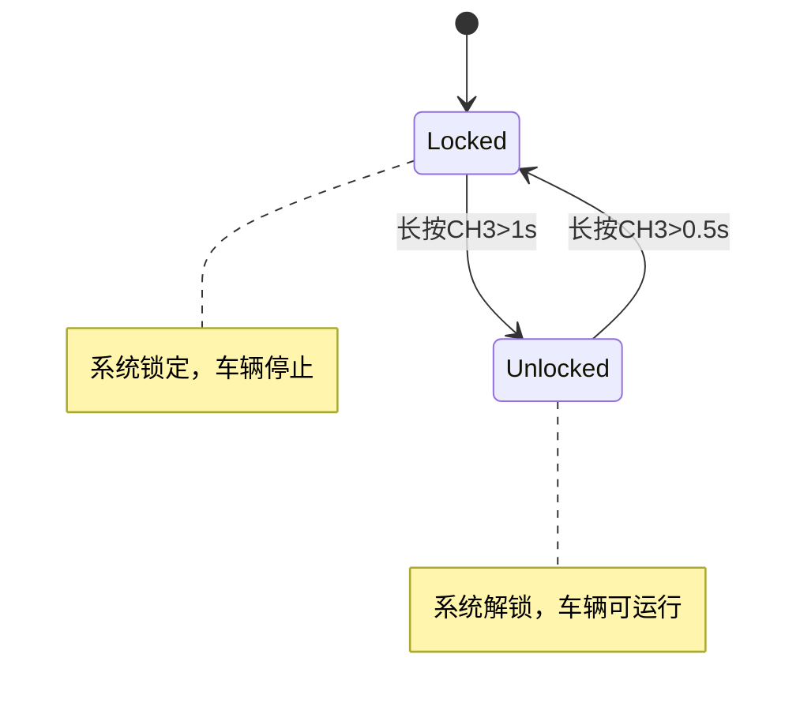

**图表来源**
- [mus4.ino](file://mus4/mus4.ino#L686-L740)
- [architecture.md](file://mus4/Doc/Arch/architecture.md#L173-L182)

**章节来源**
- [mus4.ino](file://mus4/mus4.ino#L686-L740)
- [DevNote.md](file://mus4/Doc/README/DevNote.md#L62-L66)

### 5) 串口解析与校验
- 支持两种输入：USB（Serial）与 RS232（Serial1）
- 协议格式：T:S\n，其中 T 为油门，S 为转向，范围 -100~100
- 含校验字段（星号后两位十六进制），解析失败返回 NACK
- **新增** 串口缓冲区管理，支持错误统计和溢出检测

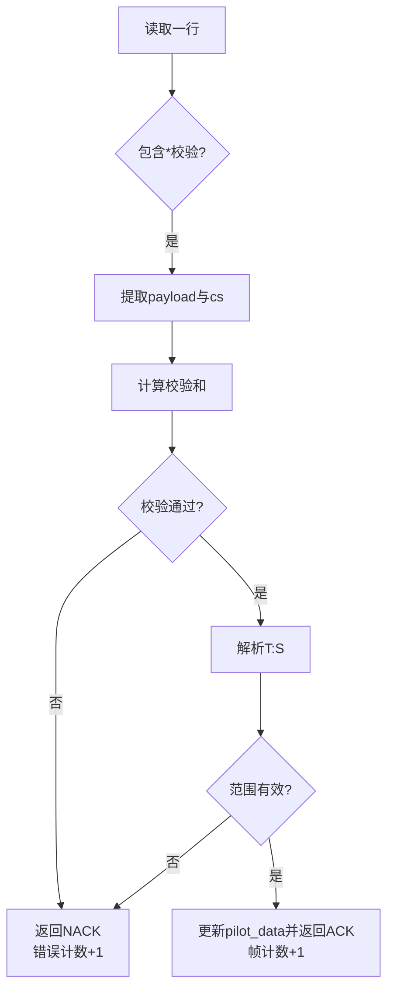

**图表来源**
- [mus4.ino](file://mus4/mus4.ino#L320-L411)
- [DevNote.md](file://mus4/Doc/README/DevNote.md#L24-L29)

**章节来源**
- [mus4.ino](file://mus4/mus4.ino#L320-L411)
- [DevNote.md](file://mus4/Doc/README/DevNote.md#L24-L29)

### 6) 输出映射与 PWM 生成
- 控制量（-100~100）映射到 PWM 脉宽范围：舵机（SERVO_MID±SERVO_RANGE）、电调（MOTOR_MID±MOTOR_RANGE）
- 使用 ledc 库生成 50Hz、14bit 分辨率的 PWM 信号
- 输出前进行最小/最大限制，确保安全范围

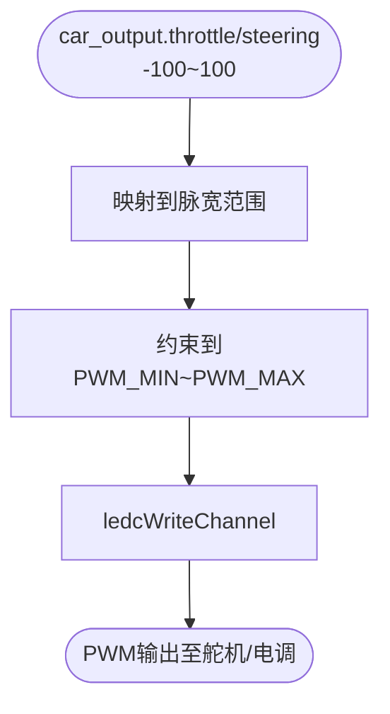

**图表来源**
- [mus4.ino](file://mus4/mus4.ino#L1269-L1276)
- [architecture.md](file://mus4/Doc/Arch/architecture.md#L193-L199)

**章节来源**
- [mus4.ino](file://mus4/mus4.ino#L1269-L1276)
- [architecture.md](file://mus4/Doc/Arch/architecture.md#L193-L199)

### 7) 传感器管理（INA219/MPU6050）
- INA219：读取母线电压、分流电压、电流、功率，校验无效数据
- MPU6050：读取加速度、角速度与温度，设置加速度与陀螺仪量程、滤波带宽
- I2C 扫描与初始化流程，错误提示与重试机制

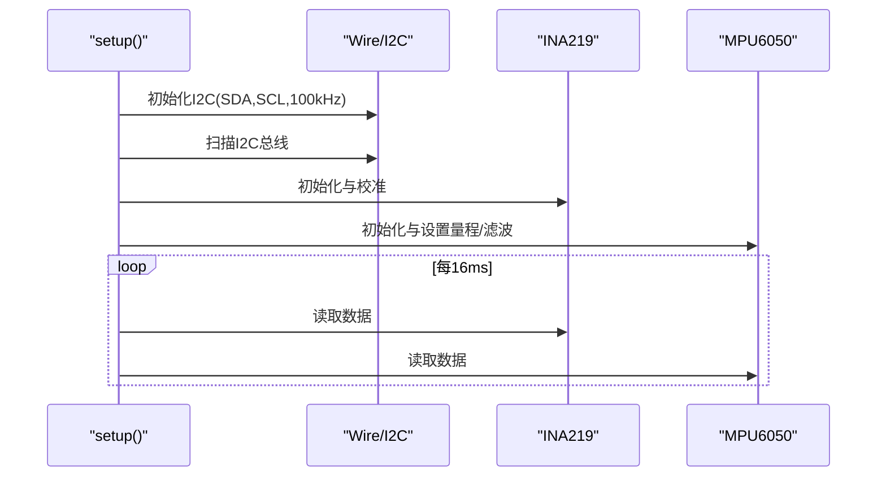

**图表来源**
- [mus4.ino](file://mus4/mus4.ino#L1104-L1150)
- [mus4.ino](file://mus4/mus4.ino#L841-L920)
- [mus4.ino](file://mus4/mus4.ino#L922-L1081)

**章节来源**
- [mus4.ino](file://mus4/mus4.ino#L841-L920)
- [mus4.ino](file://mus4/mus4.ino#L922-L1081)
- [pin_definitions.md](file://mus4/Doc/Hardware/pin_definitions.md#L96-L101)

### 8) UI 与波形图
- ANSI 控制台 UI：显示模式、停车状态、RC 通道、控制输出、传感器数据
- 波形图：滚动显示最近 40 帧的油门与转向曲线
- UI 更新周期动态评估，避免性能退化导致卡顿
- **新增** 降级模式下的 UI 优化：关闭波形显示，降低刷新频率

**章节来源**
- [mus4.ino](file://mus4/mus4.ino#L588-L684)
- [mus4.ino](file://mus4/mus4.ino#L537-L585)

### 9) 蓝牙手柄模式（可选）
- 通过宏 ENABLE_GAMEPAD_MODE 启用
- 将 RC 信号映射为蓝牙手柄轴值，连接主机设备

**章节来源**
- [mus4.ino](file://mus4/mus4.ino#L1087-L1102)
- [DevNote.md](file://mus4/Doc/README/DevNote.md#L74-L81)

## 降级模式检测系统

### 1) 系统健康监控
降级模式检测系统通过监控多个关键指标来评估系统健康状态：

- **传感器状态监控**：INA219 和 MPU6050 传感器的有效性检测
- **性能指标监控**：UI 渲染周期时长、系统响应延迟
- **串口通信监控**：数据帧处理效率、错误率统计

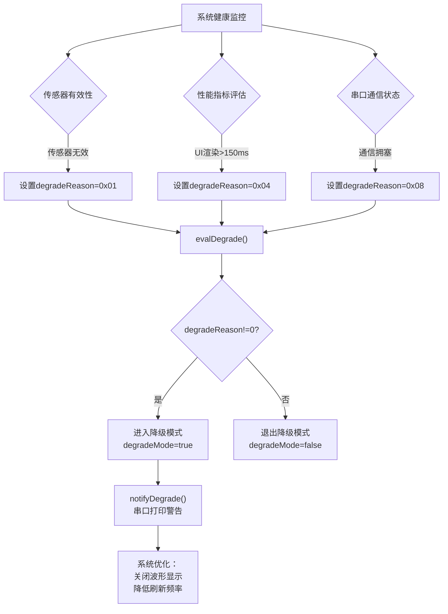

**图表来源**
- [mus4.ino](file://mus4/mus4.ino#L276-L305)
- [mus4.ino](file://mus4/mus4.ino#L1282-L1288)

### 2) 降级模式触发条件
系统在以下情况下自动触发降级模式：

- **传感器失效**：INA219 或 MPU6050 数据无效
- **性能退化**：UI 渲染周期超过 150ms
- **通信拥塞**：串口数据处理出现拥塞

### 3) 降级模式行为
进入降级模式后，系统执行以下优化措施：

- **关闭波形显示**：停止绘制油门和转向波形图
- **降低 UI 刷新频率**：从 60Hz 降至 100-500ms
- **保留核心功能**：继续接收控制帧和输出基本控制信号
- **系统通知**：通过串口打印"DEGRADED MODE ACTIVE"警告

**章节来源**
- [mus4.ino](file://mus4/mus4.ino#L125-L136)
- [mus4.ino](file://mus4/mus4.ino#L276-L305)
- [mus4.ino](file://mus4/mus4.ino#L1282-L1288)
- [CONFIG.md](file://docs/CONFIG.md#L3-L6)
- [OPERATIONS.md](file://docs/OPERATIONS.md#L5-L7)

## 性能监控与自适应行为

### 1) 性能监控指标
系统实时监控以下关键性能指标：

- **UI 循环时长**：记录每次 UI 更新的耗时
- **传感器读取效率**：INA219 和 MPU6050 数据读取时间
- **串口处理吞吐量**：数据帧处理速率和错误率
- **内存使用情况**：动态内存分配和碎片化程度

### 2) 自适应刷新频率
基于性能监控结果，系统动态调整 UI 刷新频率：

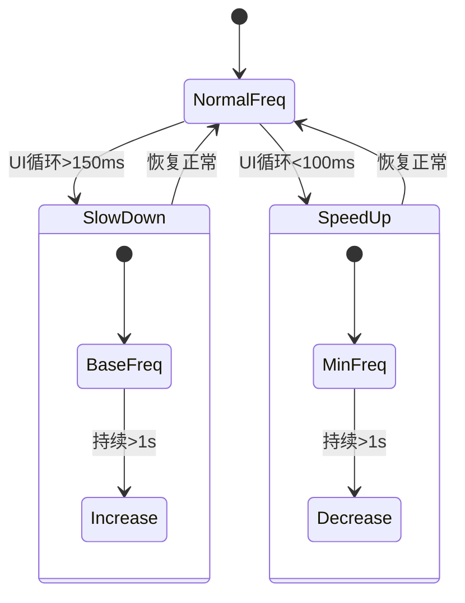

**图表来源**
- [mus4.ino](file://mus4/mus4.ino#L1282-L1288)

### 3) 资源优化策略
系统采用多层次的资源优化策略：

- **UI 刷新频率自适应**：100-500ms 动态调整
- **传感器 TTL 优化**：1000ms 缓存策略
- **增量更新机制**：仅在值变化时更新显示
- **错误处理优化**：传感器异常不阻塞主循环

**章节来源**
- [mus4.ino](file://mus4/mus4.ino#L1282-L1288)
- [CONFIG.md](file://docs/CONFIG.md#L8-L11)

## 测试与验证体系

### 1) 单元测试框架
系统内置完整的测试框架，支持多种测试场景：

- **功能测试**：`TEST` 命令执行单元测试套件
- **性能基准**：`BENCH` 命令评估 UI 循环性能
- **压力测试**：`STRESS` 命令模拟异常负载
- **回归测试**：`REGRESS` 命令验证功能稳定性

### 2) 测试执行流程
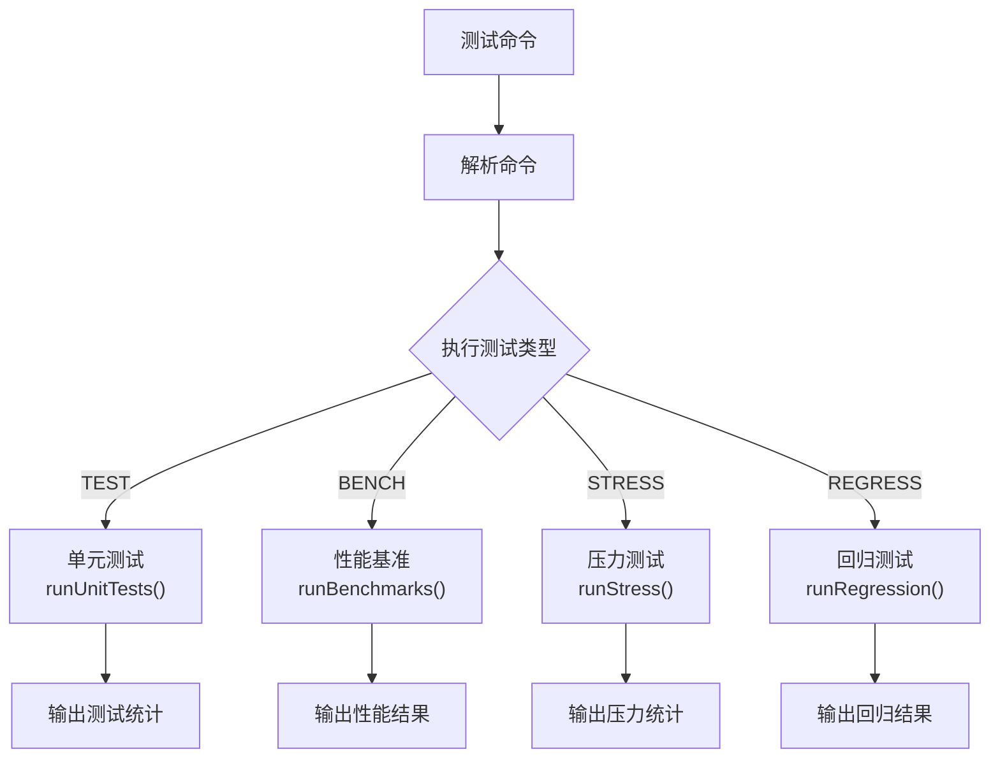

**图表来源**
- [mus4.ino](file://mus4/mus4.ino#L153-L200)

### 3) 测试覆盖范围
- **串口协议测试**：校验和计算、命令解析、错误处理
- **PWM 映射测试**：范围验证、边界检查、精度测试
- **模式切换测试**：驾驶模式切换、状态机验证
- **性能测试**：UI 响应时间、内存使用、CPU 占用

**章节来源**
- [mus4.ino](file://mus4/mus4.ino#L153-L200)
- [OPERATIONS.md](file://docs/OPERATIONS.md#L8-L13)

## 依赖关系分析
- 硬件依赖
  - ESP32 I/O 引脚：RC 输入（GPIO 36/39/34/26）、执行器输出（GPIO 23/25）、I2C（GPIO 21/22）、串口（GPIO 16/17）、LED（GPIO 5）、UART 选择（GPIO 12）
- 库依赖
  - Wire（I2C）、FastLED（LED）、Adafruit_MPU6050/Adafruit_INA219（传感器）
  - 可选：BleGamepad（BLE 手柄）
- 文件间依赖
  - 主程序依赖架构与硬件文档中的常量与引脚定义
  - 示例工程与主程序共享 I2C 与传感器库
  - **新增** 配置文档与操作手册为系统提供了完整的用户指导

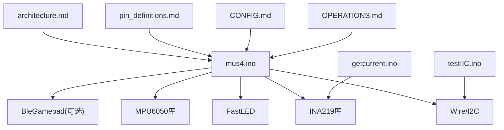

**图表来源**
- [mus4.ino](file://mus4/mus4.ino#L24-L34)
- [architecture.md](file://mus4/Doc/Arch/architecture.md#L1-L245)
- [pin_definitions.md](file://mus4/Doc/Hardware/pin_definitions.md#L1-L225)
- [getcurrent.ino](file://examples/getcurrent/getcurrent.ino#L1-L55)
- [testIIC.ino](file://examples/testIIC/testIIC.ino#L1-L613)
- [CONFIG.md](file://docs/CONFIG.md#L1-L24)
- [OPERATIONS.md](file://docs/OPERATIONS.md#L1-L21)

**章节来源**
- [mus4.ino](file://mus4/mus4.ino#L24-L34)
- [pin_definitions.md](file://mus4/Doc/Hardware/pin_definitions.md#L1-L225)

## 性能考量
- 中断优先级与原子访问
  - volatile 数组与微秒计时减少解析误差，避免阻塞主循环
- 周期调度
  - 传感器 1Hz、RC 60Hz、UI 60Hz，降低 CPU 占用
- 动态 UI 评估
  - 根据 UI 周期耗时动态调整 UI 更新间隔，防止性能退化
- PWM 分辨率与频率
  - 14bit 分辨率与 50Hz 频率满足舵机/电调需求，兼顾精度与实时性
- **新增** 降级模式性能优化
  - 传感器 TTL 缓存策略减少 I2C 通信开销
  - 增量更新机制避免不必要的 UI 刷新
  - 串口缓冲区管理提高通信效率

**章节来源**
- [mus4.ino](file://mus4/mus4.ino#L109-L131)
- [mus4.ino](file://mus4/mus4.ino#L1282-L1288)
- [architecture.md](file://mus4/Doc/Arch/architecture.md#L193-L199)

## 故障排查指南
- I2C 设备检测
  - 使用 I2C 扫描函数定位设备地址，区分 INA219/MPU6050 等
  - 若无设备，检查 SDA/SCL 引脚、上拉电阻与供电
- 传感器初始化失败
  - INA219/MPU6050 初始化失败时打印错误信息并阻塞等待，便于定位问题
- 串口通信
  - 确认波特率一致（115200），检查协议格式与校验
  - 使用示例程序验证串口链路
- RC 信号异常
  - 确认 RC 接收机供电与信号线连接，GPIO 34/36/39 为输入引脚
- 紧急停车状态机
  - 停车解除后需等待 EST_DONE 状态恢复，确认停车信号清除
- **新增** 降级模式诊断
  - 检查传感器有效性标志位
  - 监控 UI 渲染时长指标
  - 验证自适应刷新频率调整逻辑
- **新增** 性能问题排查
  - 使用 `BENCH` 命令评估系统性能基准
  - 通过 `STRESS` 命令模拟高负载场景
  - 检查内存使用和 CPU 占用情况

**章节来源**
- [mus4.ino](file://mus4/mus4.ino#L868-L896)
- [mus4.ino](file://mus4/mus4.ino#L977-L1081)
- [mus4.ino](file://mus4/mus4.ino#L922-L975)
- [mus4.ino](file://mus4/mus4.ino#L320-L411)
- [pin_definitions.md](file://mus4/Doc/Hardware/pin_definitions.md#L34-L46)
- [OPERATIONS.md](file://docs/OPERATIONS.md#L8-L20)

## 结论
本项目以 ESP32 为核心，采用事件驱动与状态机相结合的设计，实现了 RC 与上位机双输入、多模式控制与安全机制的统一。通过中断解析 RC 信号、定时任务读取传感器、状态机保障安全、模块化封装提升可维护性，整体架构清晰、边界明确、易于扩展与调试。**新增的降级模式检测系统、性能监控和自适应行为**进一步增强了系统的鲁棒性和用户体验，使其能够在各种条件下保持稳定运行和最佳性能表现。

## 附录
- 系统边界
  - 输入：RC PWM（CH1-CH4）、上位机串口（T:S\n）
  - 处理：模式选择、融合控制、紧急停车、停车控制、LED/UI/串口反馈、**降级模式检测、性能监控**
  - 输出：PWM（舵机/电调）、LED、串口反馈、可选 BLE 手柄、**自适应行为优化**
- 关键常量与阈值
  - PWM 范围与中位值、模式阈值、停车保持时间、紧急停车时序等
  - **新增** 降级模式触发阈值、性能监控窗口、自适应调整参数等

**章节来源**
- [architecture.md](file://mus4/Doc/Arch/architecture.md#L227-L240)
- [DevNote.md](file://mus4/Doc/README/DevNote.md#L103-L117)
- [CONFIG.md](file://docs/CONFIG.md#L3-L6)