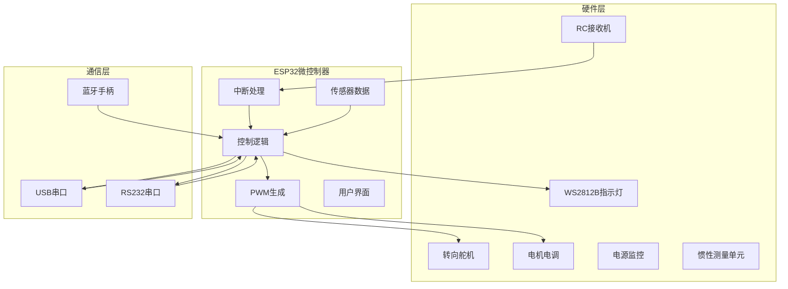
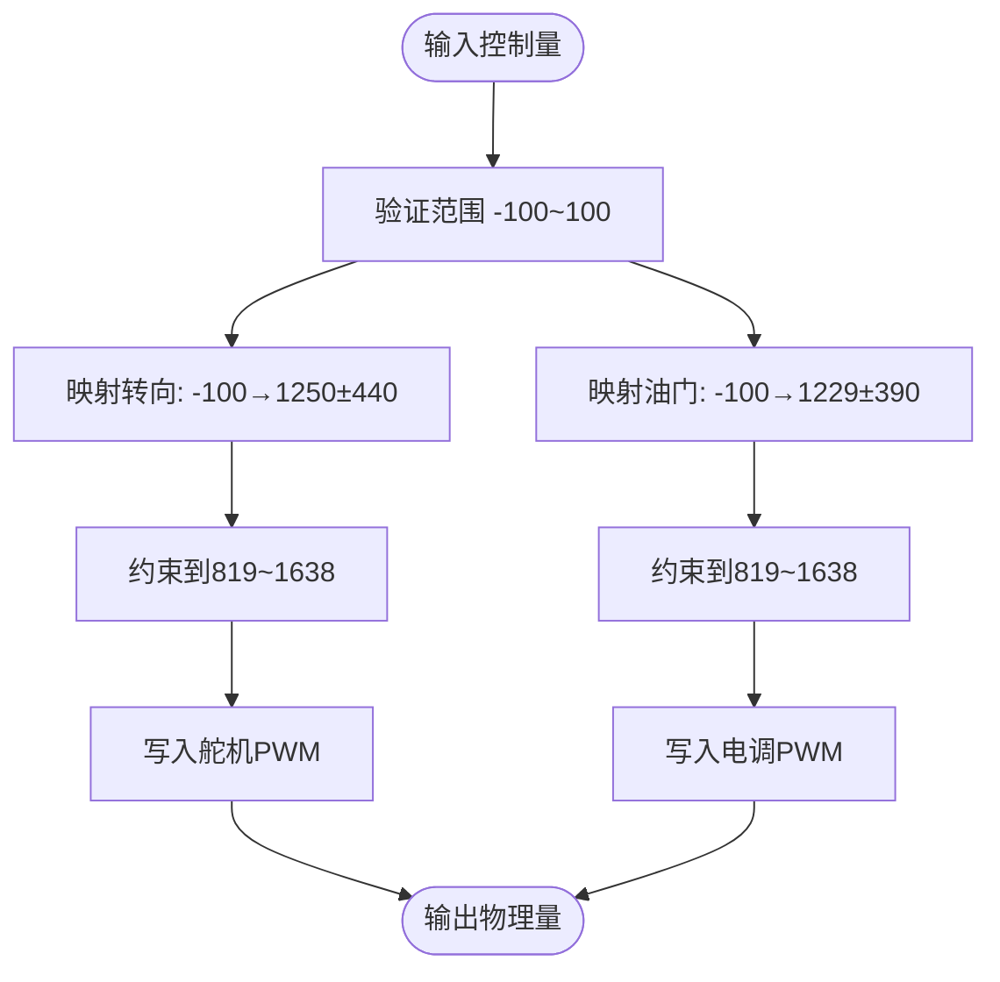
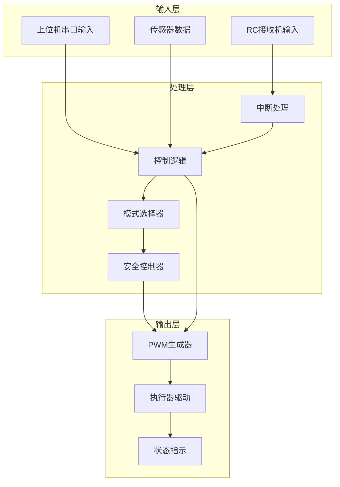
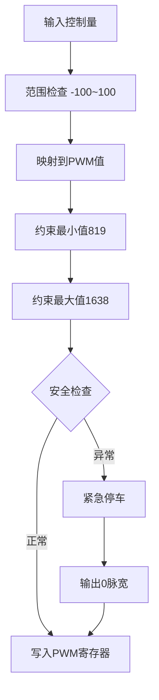
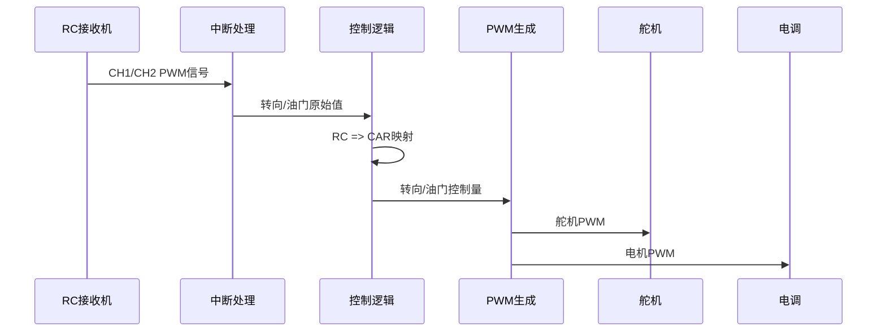
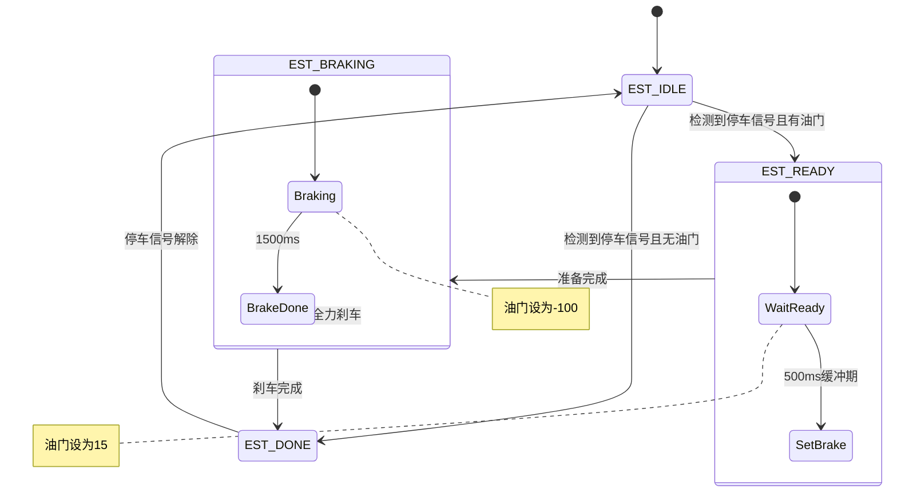
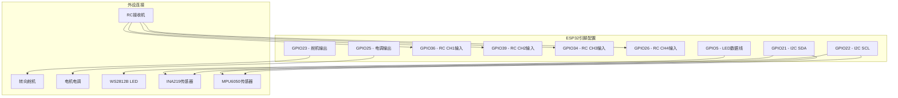

# 输出映射与PWM生成

<cite>
**本文档引用的文件**
- [mus4.ino](file://mus4/mus4.ino)
- [pin_definitions.md](file://mus4/Doc/Hardware/pin_definitions.md)
- [architecture.md](file://mus4/Doc/Arch/architecture.md)
- [sketch.yaml](file://mus4/sketch.yaml)
- [config.yaml](file://config.yaml)
</cite>

## 目录
1. [简介](#简介)
2. [项目结构](#项目结构)
3. [核心组件](#核心组件)
4. [架构概览](#架构概览)
5. [详细组件分析](#详细组件分析)
6. [依赖关系分析](#依赖关系分析)
7. [性能考虑](#性能考虑)
8. [故障排除指南](#故障排除指南)
9. [结论](#结论)

## 简介

本文档详细阐述了MUS4项目中从控制量(-100~100)到物理输出的完整映射过程，重点分析了舵机转向(SERVO_MID±SERVO_RANGE)和电机油门(MOTOR_MID±MOTOR_RANGE)的计算公式。文档深入解释了ESP32的ledc库使用方法、PWM频率设置(50Hz)和分辨率配置(14bit)，并分析了不同控制模式下的输出策略和安全限制机制。同时提供了PWM参数调节指南和性能优化建议，帮助开发者根据实际硬件调整控制参数。

## 项目结构

MUS4项目采用模块化设计，主要包含以下核心组件：



**图表来源**
- [mus4.ino](file://mus4/mus4.ino#L1104-L1150)
- [pin_definitions.md](file://mus4/Doc/Hardware/pin_definitions.md#L115-L181)

**章节来源**
- [mus4.ino](file://mus4/mus4.ino#L1-L150)
- [pin_definitions.md](file://mus4/Doc/Hardware/pin_definitions.md#L1-L50)

## 核心组件

### PWM参数配置

系统使用ESP32的ledc库进行PWM生成，具有以下关键参数：

| 参数 | 数值 | 说明 |
|------|------|------|
| PWM频率 | 50Hz | 标准舵机/电调控制频率 |
| 分辨率 | 14bit | 计数范围 0-16383 |
| 最小脉宽 | 819 | 对应 500μs脉宽 |
| 最大脉宽 | 1638 | 对应 2500μs脉宽 |
| 舵机中位 | 1250 | ±440μs范围 |
| 电机中位 | 1229 | ±390μs范围 |

### 输出映射算法

系统实现了从控制量(-100~100)到PWM脉宽的精确映射：



**图表来源**
- [mus4.ino](file://mus4/mus4.ino#L1269-L1276)

**章节来源**
- [mus4.ino](file://mus4/mus4.ino#L440-L447)
- [pin_definitions.md](file://mus4/Doc/Hardware/pin_definitions.md#L210-L219)

## 架构概览

MUS4系统采用分层架构设计，实现了信号采集、控制决策、执行输出的完整闭环：



**图表来源**
- [architecture.md](file://mus4/Doc/Arch/architecture.md#L18-L45)
- [mus4.ino](file://mus4/mus4.ino#L1152-L1289)

## 详细组件分析

### PWM生成与映射

#### 舵机转向映射

舵机转向控制采用线性映射算法：

**计算公式：**
```
pwm_steering = map(car_output.steering, -100, 100, SERVO_MID - SERVO_RANGE, SERVO_MID + SERVO_RANGE)
```

其中：
- `SERVO_MID = 1250` (中位脉宽)
- `SERVO_RANGE = 440` (脉宽范围)
- 转向范围：1250±440 = 810~1660μs

#### 电机油门映射

电机油门控制同样采用线性映射：

**计算公式：**
```
pwm_throttle = map(car_output.throttle, -100, 100, MOTOR_MID - MOTOR_RANGE, MOTOR_MID + MOTOR_RANGE)
```

其中：
- `MOTOR_MID = 1229` (中位脉宽)
- `MOTOR_RANGE = 390` (脉宽范围)
- 油门范围：1229±390 = 839~1619μs

#### 安全限制机制

系统实现了多层安全保护：



**图表来源**
- [mus4.ino](file://mus4/mus4.ino#L1269-L1276)

**章节来源**
- [mus4.ino](file://mus4/mus4.ino#L1269-L1276)
- [mus4.ino](file://mus4/mus4.ino#L440-L447)

### 控制模式策略

#### 手动模式 (CAR_MODE_MANUAL)

在手动模式下，系统完全依赖RC遥控器输入：



**图表来源**
- [mus4.ino](file://mus4/mus4.ino#L1218-L1239)

#### 半自动模式 (CAR_MODE_SEMI_AUTO)

半自动模式结合RC和上位机控制：

- **转向**：由上位机控制(Pilot)
- **油门**：由RC控制(RC)
- **LED颜色**：黄色

#### 全自动模式 (CAR_MODE_FULL_AUTO)

全自动模式完全由上位机控制：

- **转向**：由上位机控制(Pilot)
- **油门**：由上位机控制(Pilot)
- **LED颜色**：蓝色

**章节来源**
- [mus4.ino](file://mus4/mus4.ino#L1170-L1239)
- [architecture.md](file://mus4/Doc/Arch/architecture.md#L109-L116)

### 紧急停车机制

系统实现了完整的紧急停车状态机：



**图表来源**
- [mus4.ino](file://mus4/mus4.ino#L474-L525)

**章节来源**
- [mus4.ino](file://mus4/mus4.ino#L474-L525)
- [architecture.md](file://mus4/Doc/Arch/architecture.md#L117-L161)

### LED状态指示系统

系统使用WS2812B RGB LED显示当前状态：

| 状态 | LED颜色 | 说明 |
|------|---------|------|
| 手动模式 | 绿色 | 车辆由RC遥控器控制 |
| 半自动模式 | 黄色 | 自动转向，RC控制油门 |
| 全自动模式 | 蓝色 | 完全由上位机控制 |
| 紧急停车 | 红色闪烁 | 当前模式颜色 + 红色闪烁 |
| 初始化 | 蓝色 | 系统启动时显示 |

**章节来源**
- [architecture.md](file://mus4/Doc/Arch/architecture.md#L215-L226)
- [mus4.ino](file://mus4/mus4.ino#L240-L274)

## 依赖关系分析

### 硬件依赖关系



**图表来源**
- [pin_definitions.md](file://mus4/Doc/Hardware/pin_definitions.md#L115-L181)

### 软件依赖关系

系统依赖的关键库和模块：

| 模块 | 用途 | 版本要求 |
|------|------|----------|
| ESP32 Arduino | 核心平台 | ESP32 Board 2.0.0+ |
| Wire | I2C通信 | Arduino Wire库 |
| FastLED | LED控制 | FastLED 3.4+ |
| Adafruit_MPU6050 | IMU传感器 | 2.0+ |
| Adafruit_INA219 | 电源监控 | 1.1+ |
| BleGamepad | 蓝牙手柄 | ESP32 BLE Gamepad |

**章节来源**
- [mus4.ino](file://mus4/mus4.ino#L24-L34)
- [pin_definitions.md](file://mus4/Doc/Hardware/pin_definitions.md#L1-L10)

## 性能考虑

### PWM参数优化

#### 频率与分辨率平衡

系统使用50Hz频率和14bit分辨率的组合，在以下方面取得平衡：

- **频率稳定性**：50Hz确保与标准舵机/电调兼容
- **分辨率精度**：14bit提供约0.006%的分辨率精度
- **计算开销**：合理的分辨率避免过度消耗CPU资源

#### 响应时间优化

系统通过以下机制优化响应时间：

| 组件 | 更新间隔 | 优化策略 |
|------|----------|----------|
| 传感器数据 | 1000ms | 1Hz采样频率，降低开销 |
| RC数据 | 16ms | ~60Hz采样，保证响应性 |
| UI界面 | 16ms | 60Hz刷新，流畅体验 |
| 串口反馈 | 16ms | 实时状态反馈 |

### 内存管理

系统采用静态内存分配策略：

- **全局变量**：集中管理，减少堆栈压力
- **缓冲区大小**：256字节串口缓冲，避免溢出
- **LED数组**：单LED配置，简化内存占用

### 功耗优化

通过以下方式优化功耗：

- **传感器休眠**：非活动状态下降低采样频率
- **LED亮度控制**：64/255的亮度设置
- **模块化初始化**：按需初始化外设

## 故障排除指南

### PWM输出问题

**症状**：舵机或电调不响应

**诊断步骤**：
1. 检查PWM引脚配置
   - 舵机：GPIO23
   - 电调：GPIO25
2. 验证ledc通道绑定
   - 频率：50Hz
   - 分辨率：14bit
3. 检查脉宽范围
   - 舵机：819~1638
   - 电调：819~1638

**解决方案**：
- 确认ledcAttachChannel调用成功
- 验证map函数返回值在有效范围内
- 检查constrain函数是否正确执行

### 传感器通信问题

**症状**：INA219或MPU6050数据异常

**诊断步骤**：
1. 检查I2C引脚连接
   - SDA: GPIO21
   - SCL: GPIO22
2. 验证I2C地址
   - INA219: 0x40或0x41
   - MPU6050: 0x68或0x69
3. 测试I2C总线
   ```cpp
   Wire.beginTransmission(0x40);
   if (Wire.endTransmission() == 0) {
       Serial.println("INA219 found");
   }
   ```

**解决方案**：
- 检查上拉电阻(4.7kΩ)
- 验证电源电压稳定
- 确认设备供电隔离

### 串口通信问题

**症状**：上位机无法接收数据

**诊断步骤**：
1. 检查波特率配置
   - USB: 115200
   - RS232: 115200
2. 验证引脚连接
   - RX1: GPIO16
   - TX1: GPIO17
3. 测试串口初始化
   ```cpp
   Serial1.begin(115200, SERIAL_8N1, 16, 17);
   ```

**解决方案**：
- 确认串口选择开关(UART_SEL)设置
- 检查RS232电平转换器
- 验证上位机串口配置

### 模式切换问题

**症状**：驾驶模式无法切换

**诊断步骤**：
1. 检查CH4引脚连接
   - GPIO26
   - 电压范围：1000~2000μs
2. 验证模式判断逻辑
   - ≤1400μs: 手动模式
   - 1400~1600μs: 半自动模式
   - >1600μs: 全自动模式

**解决方案**：
- 校准RC接收机中位点
- 检查模式开关机械连接
- 验证中断处理函数

**章节来源**
- [mus4.ino](file://mus4/mus4.ino#L1133-L1134)
- [mus4.ino](file://mus4/mus4.ino#L1119-L1123)
- [pin_definitions.md](file://mus4/Doc/Hardware/pin_definitions.md#L63-L73)

## 结论

MUS4项目的输出映射与PWM生成系统展现了良好的工程实践，通过精确的数学映射、多层次的安全保护和灵活的控制模式，实现了可靠的自动驾驶小车控制。系统的关键优势包括：

1. **精确的映射算法**：从(-100~100)到物理输出的线性映射，确保控制精度
2. **完善的安全机制**：紧急停车状态机和多重限制保护
3. **灵活的控制模式**：支持手动、半自动和全自动三种模式
4. **高效的PWM生成**：基于ESP32的ledc库实现高性能PWM输出
5. **全面的诊断能力**：内置测试和故障检测功能

开发者在实际应用中应重点关注参数校准、硬件连接质量和安全保护机制的正确配置。通过合理调整PWM参数和优化控制策略，可以进一步提升系统的性能和可靠性。