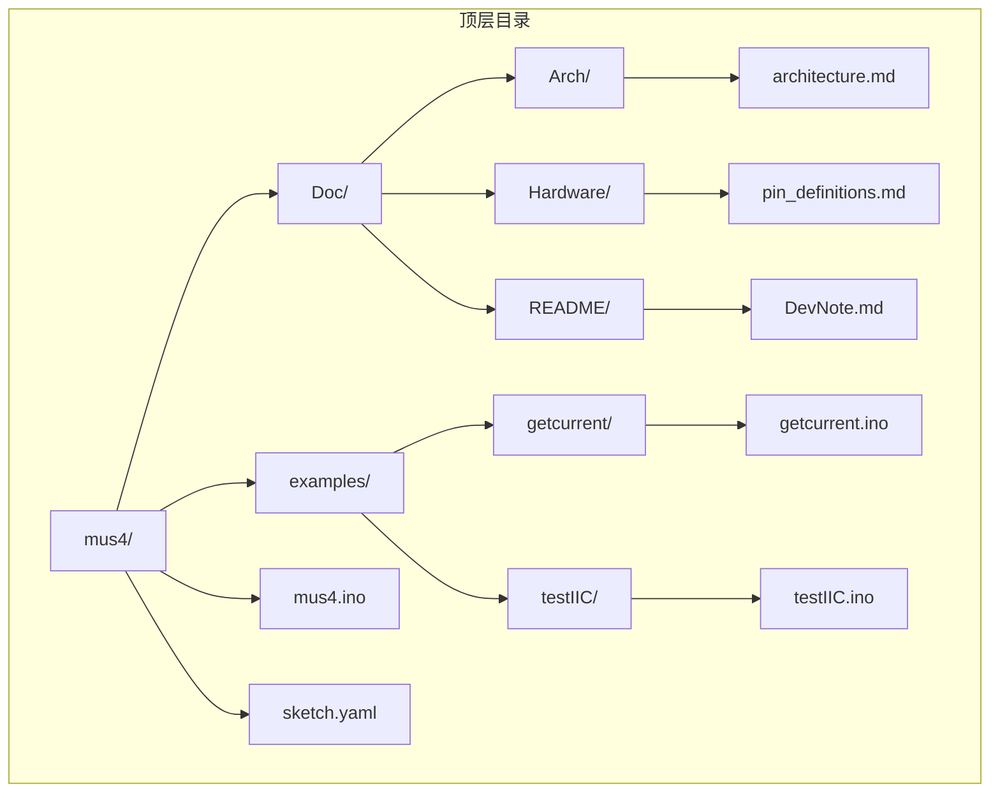
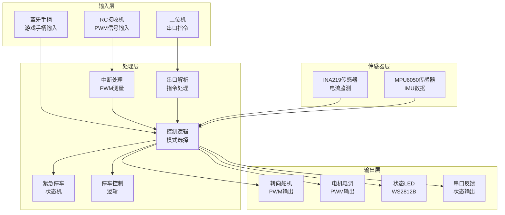
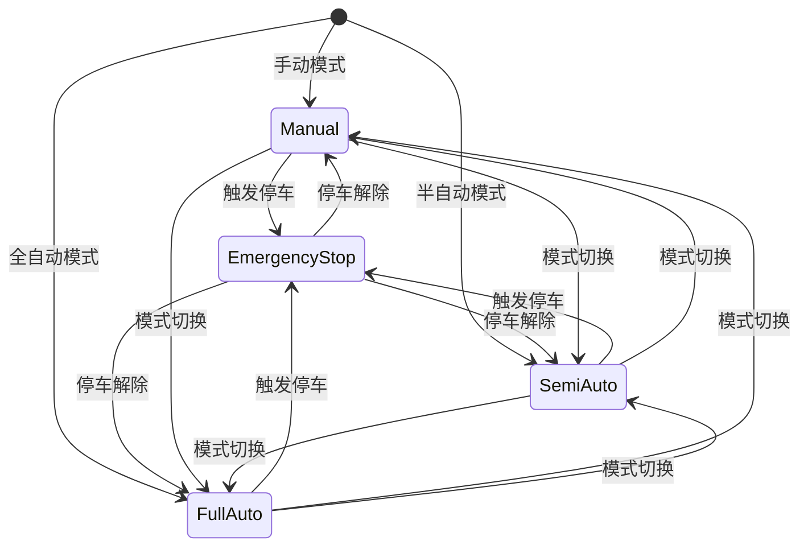
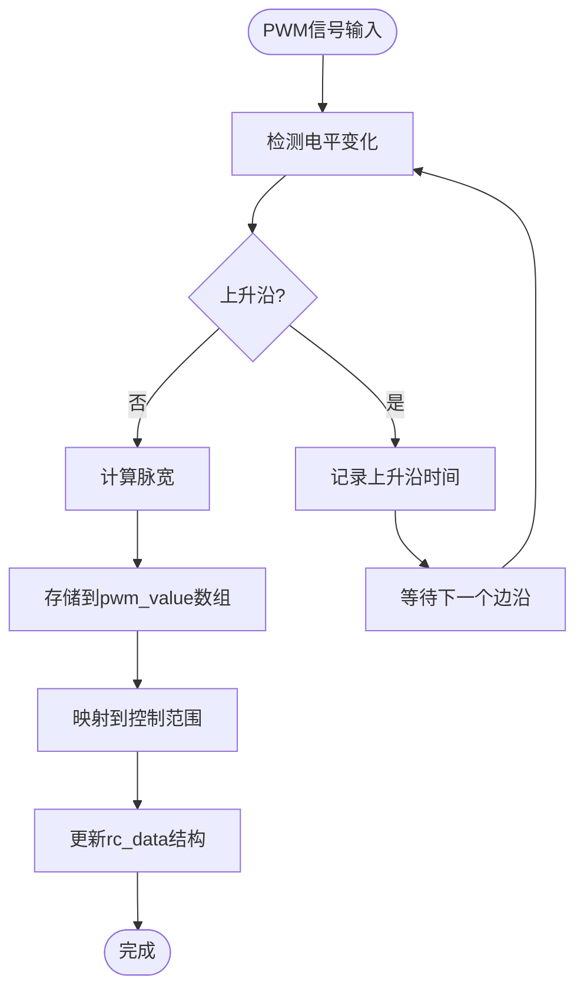
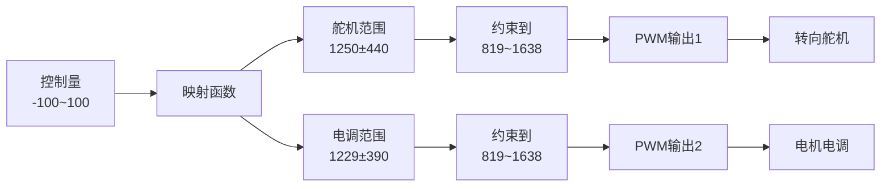
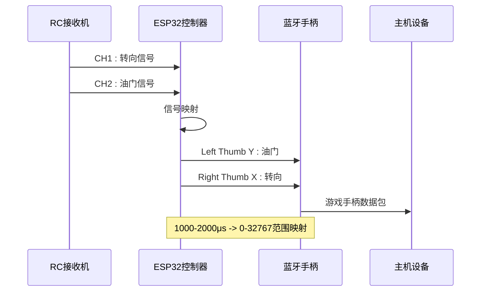
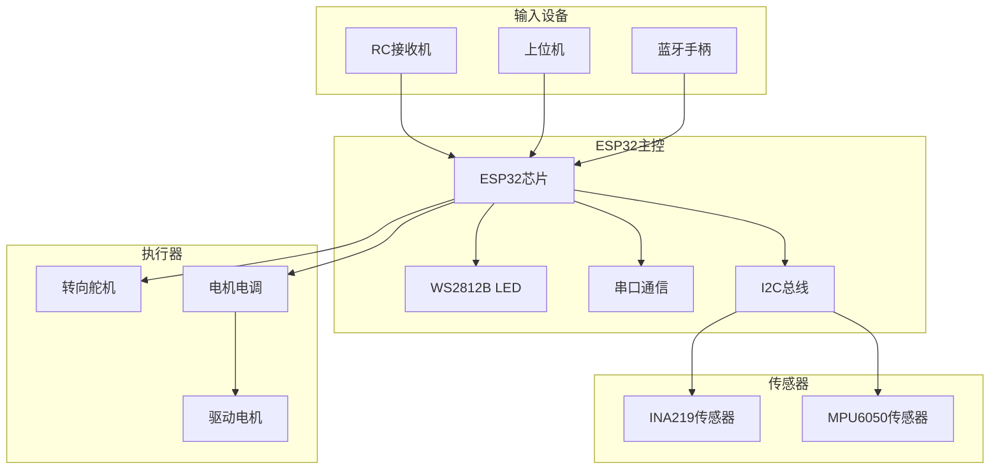
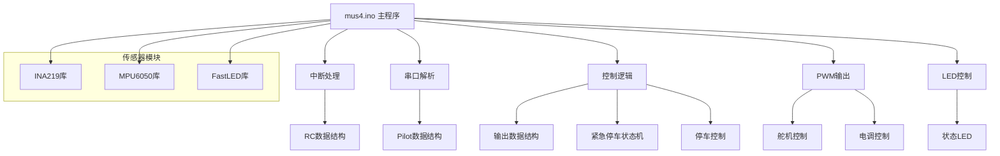

# 项目概述

<cite>
**本文档引用的文件**
- [README.md](file://README.md)
- [mus4.ino](file://mus4/mus4/mus4.ino)
- [architecture.md](file://mus4/Doc/Arch/architecture.md)
- [pin_definitions.md](file://mus4/Doc/Hardware/pin_definitions.md)
- [sketch.yaml](file://mus4/sketch.yaml)
- [getcurrent.ino](file://examples/getcurrent/getcurrent.ino)
- [testIIC.ino](file://examples/testIIC/testIIC.ino)
</cite>

## 目录
1. [项目简介](#项目简介)
2. [项目结构](#项目结构)
3. [核心组件](#核心组件)
4. [架构概览](#架构概览)
5. [详细组件分析](#详细组件分析)
6. [依赖关系分析](#依赖关系分析)
7. [性能考虑](#性能考虑)
8. [故障排除指南](#故障排除指南)
9. [结论](#结论)

## 项目简介

MUS4自动驾驶小车控制系统是一个基于ESP32微控制器的智能车辆控制项目，项目代号为LP-MU-S4。该项目旨在为小型自动驾驶车辆提供完整的控制解决方案，支持多种操作模式和高级安全功能。

### 项目核心目标

- **多模式控制支持**：提供手动遥控、半自动和全自动三种操作模式
- **实时信号处理**：通过中断机制实现实时PWM信号采集
- **安全机制集成**：包含紧急停车状态机和停车控制功能
- **扩展性设计**：支持蓝牙手柄模式和多种传感器集成
- **用户友好界面**：提供实时状态显示和调试功能

### 技术特色

- **ESP32主控**：采用高性能双核ESP32处理器，具备强大的处理能力和丰富的外设接口
- **实时控制**：通过硬件中断实现精确的PWM信号测量，采样频率可达约60Hz
- **多源输入**：支持RC遥控器、上位机串口指令和蓝牙手柄等多种控制方式
- **传感器集成**：内置INA219电流传感器和MPU6050惯性测量单元
- **状态可视化**：通过WS2812B LED提供直观的状态指示

## 项目结构

项目的整体结构采用模块化设计，主要分为以下几个层次：



**图表来源**
- [mus4.ino](file://mus4/mus4/mus4.ino#L1-L50)
- [architecture.md](file://mus4/Doc/Arch/architecture.md#L1-L50)

### 目录结构说明

- **mus4/**：核心控制程序和文档
- **examples/**：示例程序和测试工具
- **Doc/**：项目文档和硬件说明
- **sketch.yaml**：Arduino IDE配置文件

**章节来源**
- [README.md](file://README.md#L1-L39)
- [mus4.ino](file://mus4/mus4/mus4.ino#L1-L50)

## 核心组件

### ESP32微控制器

ESP32作为系统的核心处理器，承担着以下关键职责：

- **信号采集**：通过硬件中断实时测量RC遥控器的PWM信号
- **控制逻辑**：实现多模式控制算法和安全机制
- **执行输出**：生成PWM信号控制舵机和电调
- **通信管理**：处理串口通信和蓝牙手柄功能
- **状态监控**：管理LED指示和系统健康状态

### 传感器系统

系统集成了两个重要的传感器模块：

- **INA219电流传感器**：监测电机电流、电压和功率消耗
- **MPU6050惯性测量单元**：提供加速度、角速度和温度数据

### 执行器控制

- **转向舵机**：通过PWM信号控制前轮转向角度
- **电机电调**：控制后轮驱动电机的转速
- **状态LED**：WS2812B RGB LED提供视觉反馈

**章节来源**
- [mus4.ino](file://mus4/mus4/mus4.ino#L36-L38)
- [pin_definitions.md](file://mus4/Doc/Hardware/pin_definitions.md#L1-L225)

## 架构概览

MUS4系统采用分层架构设计，实现了输入、处理、输出的清晰分离：



**图表来源**
- [architecture.md](file://mus4/Doc/Arch/architecture.md#L18-L45)
- [mus4.ino](file://mus4/mus4/mus4.ino#L1104-L1150)

### 数据流设计

系统采用异步数据流架构，各个组件通过共享数据结构进行通信：

1. **信号采集**：RC接收机和上位机指令通过中断和串口解析分别进入系统
2. **数据融合**：所有输入数据汇聚到控制逻辑层进行处理
3. **模式决策**：根据当前驾驶模式选择相应的控制策略
4. **执行输出**：最终的控制指令转换为PWM信号驱动执行器

**章节来源**
- [architecture.md](file://mus4/Doc/Arch/architecture.md#L66-L107)

## 详细组件分析

### 多模式控制系统

系统支持三种不同的操作模式，每种模式都有特定的控制逻辑和状态指示：



**图表来源**
- [architecture.md](file://mus4/Doc/Arch/architecture.md#L119-L151)
- [mus4.ino](file://mus4/mus4/mus4.ino#L771-L786)

#### 手动模式 (Manual)
- **控制权**：完全由RC遥控器控制
- **转向控制**：RC接收机CH1通道
- **油门控制**：RC接收机CH2通道
- **LED指示**：绿色常亮

#### 半自动模式 (Semi-Auto)
- **控制权**：自动转向，人工控制油门
- **转向控制**：上位机指令
- **油门控制**：RC接收机CH2通道
- **LED指示**：黄色常亮

#### 全自动模式 (Full-Auto)
- **控制权**：完全由上位机控制
- **转向控制**：上位机指令
- **油门控制**：上位机指令
- **LED指示**：蓝色常亮

**章节来源**
- [architecture.md](file://mus4/Doc/Arch/architecture.md#L109-L116)
- [mus4.ino](file://mus4/mus4/mus4.ino#L75-L78)

### 紧急停车机制

紧急停车系统采用有限状态机设计，确保在危险情况下能够快速、可靠地停止车辆：

```mermaid
stateDiagram-v2
[*] --> Idle : 空闲状态
Idle --> Ready : 检测到停车信号且有油门
Idle --> Done : 检测到停车信号且无油门
state Ready {
[*] --> Buffer : 缓冲阶段
note right : 持续500ms<br/>油门设为15
}
Ready --> Braking : 缓冲完成
state Braking {
[*] --> EmergencyStop : 全力刹车
note right : 持续1500ms<br/>油门设为-100
}
Braking --> Done : 刹车完成
state Done {
note right : 停车完成<br/>油门归零
}
Done --> Idle : 停车解除
```

**图表来源**
- [architecture.md](file://mus4/Doc/Arch/architecture.md#L123-L151)
- [mus4.ino](file://mus4/mus4/mus4.ino#L474-L525)

#### 状态转换逻辑

| 状态 | 触发条件 | 持续时间 | 油门输出 | LED状态 |
|------|----------|----------|----------|---------|
| Idle | 系统启动或停车解除 | - | 当前值 | 状态LED颜色 |
| Ready | 检测到停车信号且有油门 | 500ms | 15 | 状态LED颜色闪烁 |
| Braking | Ready状态完成 | 1500ms | -100 | 红色闪烁 |
| Done | Braking状态完成 | - | 0 | 状态LED颜色 |

**章节来源**
- [architecture.md](file://mus4/Doc/Arch/architecture.md#L153-L161)
- [mus4.ino](file://mus4/mus4/mus4.ino#L221-L232)

### 停车/解锁控制

停车控制通过RC接收机的CH3通道实现，支持长按检测和状态切换：

```mermaid
stateDiagram-v2
[*] --> Locked : 默认锁定状态
Locked --> Unlocked : 长按CH3 > 1秒
note right : 系统锁定<br/>车辆停止
Unlocked --> Locked : 长按CH3 > 0.5秒
note right : 系统解锁<br/>车辆可运行
```

**图表来源**
- [architecture.md](file://mus4/Doc/Arch/architecture.md#L173-L182)
- [mus4.ino](file://mus4/mus4/mus4.ino#L686-L740)

#### 操作逻辑

- **锁定操作**：按住CH3通道按钮超过0.5秒进入停车模式
- **解锁操作**：按住CH3通道按钮超过1秒退出停车模式
- **状态指示**：通过LED颜色变化提供视觉反馈

**章节来源**
- [architecture.md](file://mus4/Doc/Arch/architecture.md#L162-L170)
- [mus4.ino](file://mus4/mus4/mus4.ino#L686-L740)

### 信号输入与中断处理

系统采用硬件中断机制实现精确的PWM信号测量：



**图表来源**
- [architecture.md](file://mus4/Doc/Arch/architecture.md#L184-L192)
- [mus4.ino](file://mus4/mus4/mus4.ino#L414-L431)

#### 中断处理机制

- **硬件支持**：ESP32的硬件中断功能实现精确的时间测量
- **时间精度**：使用micros()函数提供微秒级的时间分辨率
- **数据结构**：使用volatile关键字确保多任务环境下的数据一致性

**章节来源**
- [mus4.ino](file://mus4/mus4/mus4.ino#L414-L431)
- [pin_definitions.md](file://mus4/Doc/Hardware/pin_definitions.md#L34-L46)

### 输出映射与PWM生成

系统将控制量映射到具体的PWM参数，实现精确的执行器控制：



**图表来源**
- [architecture.md](file://mus4/Doc/Arch/architecture.md#L193-L200)
- [mus4.ino](file://mus4/mus4/mus4.ino#L1269-L1276)

#### PWM参数配置

| 参数 | 舵机 (Servo) | 电调 (ESC) |
|------|--------------|------------|
| 中位值 | 1250 | 1229 |
| 范围 | ±440 | ±390 |
| 最小限制 | 819 | 819 |
| 最大限制 | 1638 | 1638 |
| 频率 | 50Hz | 50Hz |
| 分辨率 | 14bit | 14bit |

**章节来源**
- [architecture.md](file://mus4/Doc/Arch/architecture.md#L227-L240)
- [mus4.ino](file://mus4/mus4/mus4.ino#L440-L448)

### 蓝牙手柄模式

系统支持ENABLE_GAMEPAD_MODE宏启用蓝牙手柄功能，将RC信号转换为标准游戏手柄输入：



**图表来源**
- [architecture.md](file://mus4/Doc/Arch/architecture.md#L200-L214)
- [mus4.ino](file://mus4/mus4/mus4.ino#L1087-L1102)

#### 映射关系

| RC通道 | 手柄轴 | 输入范围 | 输出范围 | 说明 |
|--------|--------|----------|----------|------|
| CH1 (转向) | Right Thumb X | 1000-2000μs | 0-32767 | 转向控制 |
| CH2 (油门) | Left Thumb Y | 1300-1800μs | 32767-0 | 油门控制 |

**章节来源**
- [architecture.md](file://mus4/Doc/Arch/architecture.md#L204-L213)
- [mus4.ino](file://mus4/mus4/mus4.ino#L1087-L1102)

## 依赖关系分析

### 硬件依赖关系

系统硬件组件之间的连接关系如下：



**图表来源**
- [pin_definitions.md](file://mus4/Doc/Hardware/pin_definitions.md#L115-L181)
- [mus4.ino](file://mus4/mus4/mus4.ino#L1104-L1150)

### 软件依赖关系

系统软件模块之间的依赖关系：



**图表来源**
- [mus4.ino](file://mus4/mus4/mus4.ino#L24-L38)
- [architecture.md](file://mus4/Doc/Arch/architecture.md#L47-L65)

**章节来源**
- [mus4.ino](file://mus4/mus4/mus4.ino#L24-L38)
- [pin_definitions.md](file://mus4/Doc/Hardware/pin_definitions.md#L1-L225)

## 性能考虑

### 实时性能优化

系统在多个层面进行了性能优化以确保实时响应：

- **中断优先级**：使用ESP32的硬件中断实现低延迟的PWM测量
- **定时器管理**：通过独立的定时器控制不同组件的更新频率
- **内存管理**：使用静态分配减少动态内存碎片
- **算法优化**：采用高效的映射和约束算法

### 资源管理

- **CPU利用率**：通过合理的任务调度和延迟控制，保持CPU利用率在合理范围内
- **内存使用**：优化数据结构大小，避免不必要的内存占用
- **功耗控制**：在不使用时关闭不必要的外设，延长电池续航

### 扩展性考虑

系统设计具有良好的扩展性：

- **模块化架构**：便于添加新的传感器或执行器
- **配置灵活性**：通过宏定义和常量配置实现参数调整
- **接口标准化**：统一的数据结构和通信协议便于集成

## 故障排除指南

### 常见问题诊断

#### 传感器问题

**INA219传感器故障**
- 检查I2C连接和电源供应
- 验证传感器地址配置
- 使用示例程序进行功能测试

**MPU6050传感器故障**
- 确认I2C总线连接正确
- 检查传感器供电和接地
- 验证传感器初始化过程

#### 通信问题

**串口通信异常**
- 检查波特率设置（115200）
- 验证引脚连接和电平兼容性
- 确认上位机软件配置

**蓝牙连接问题**
- 确认ENABLE_GAMEPAD_MODE宏已启用
- 检查蓝牙适配器兼容性
- 验证手柄设备配对状态

#### 执行器问题

**舵机控制异常**
- 检查PWM频率和占空比设置
- 验证舵机供电和负载能力
- 确认机械连接和限位设置

**电机控制异常**
- 检查电调连接和校准
- 验证电源容量和电流限制
- 确认编码器或反馈电路

**章节来源**
- [mus4.ino](file://mus4/mus4/mus4.ino#L868-L896)
- [mus4.ino](file://mus4/mus4/mus4.ino#L977-L1082)
- [testIIC.ino](file://examples/testIIC/testIIC.ino#L558-L612)

### 调试工具使用

系统提供了多种调试和测试工具：

- **单元测试**：内置的命令解析和映射测试
- **基准测试**：UI渲染性能评估
- **压力测试**：串口通信稳定性测试
- **回归测试**：功能完整性验证

**章节来源**
- [mus4.ino](file://mus4/mus4/mus4.ino#L153-L200)
- [getcurrent.ino](file://examples/getcurrent/getcurrent.ino#L1-L55)

## 结论

MUS4自动驾驶小车控制系统是一个设计精良、功能完备的嵌入式控制系统。项目通过ESP32微控制器实现了多模式控制、实时信号处理和完善的安全部分，为小型自动驾驶车辆提供了可靠的控制解决方案。

### 主要优势

- **架构清晰**：模块化的系统设计便于维护和扩展
- **功能完整**：支持多种操作模式和安全机制
- **性能优异**：实时控制和高效资源利用
- **易于使用**：提供直观的用户界面和调试工具

### 技术亮点

- **实时中断处理**：精确的PWM信号测量
- **多源输入融合**：灵活的控制输入方式
- **状态可视化**：直观的LED状态指示
- **扩展性强**：支持传感器和执行器的灵活配置

### 发展前景

该项目为自动驾驶技术的学习和研究提供了优秀的基础平台，未来可以在以下方面进一步发展：

- **算法优化**：集成更先进的控制算法
- **功能扩展**：添加更多传感器和执行器
- **人机交互**：改进用户界面和交互方式
- **网络通信**：支持更丰富的通信协议

通过持续的改进和完善，MUS4项目将成为自动驾驶教育和研究领域的重要工具。