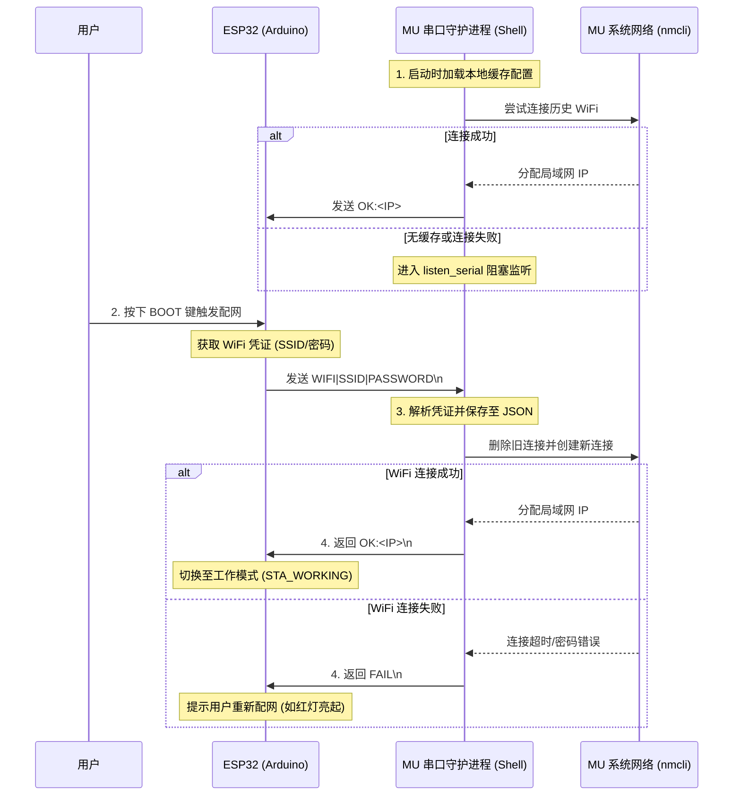

# ESP32 与 Lattepanda MU 软硬件协同配网系统架构分析

本文档详细分析了 `/home/dkc/project/mus4/examples/esp32_wifi_provisioning/esp32_wifi_provisioning.ino` (ESP32) 与 `/home/dkc/project/WIFIConnect/mu_wifi_provisioning.sh` (Lattepanda MU) 之间的协同运行关系。

## 1. 角色定位与运行环境

*   **ESP32 (`esp32_wifi_provisioning.ino`)**：
    *   **环境**：裸机/Arduino 框架，运行在 ESP32 硬件上。
    *   **角色**：**配网信息收集器/网关**。它负责通过某种交互（如按下 BOOT 键触发，随后可能通过蓝牙/SmartConfig 从手机获取 WiFi 凭证），将获取到的 SSID 和密码打包，通过硬件串口发送给 MU 主板，并等待 MU 的配网结果反馈。
*   **Lattepanda MU (`mu_wifi_provisioning.sh`)**：
    *   **环境**：Ubuntu 22.04 操作系统，作为 root 权限的后台守护进程（Shell 脚本）运行。
    *   **角色**：**配网执行者**。它负责监听串口数据，解析出 WiFi 凭证，调用 Ubuntu 底层的网络管理工具 (`nmcli`) 进行实际的 WiFi 连接操作，并将连接结果（IP 地址或失败信息）通过串口回传给 ESP32。

## 2. 物理连接与通信链路

*   **硬件接口**：两者通过 UART 串口进行物理连接。
    *   **ESP32 端**：使用的是硬件串口 `Serial1`（TX: Pin 17, RX: Pin 16）。
    *   **MU 端**：使用的是设备节点 `/dev/ttyS4`（默认值）。
*   **通信参数**：波特率均被硬编码设置为 `115200` bps，数据位 8，无校验，1 停止位（8N1）。
*   **电平控制**：ESP32 代码中将 Pin 12 (`UART_SEL`) 拉低，这通常是为了控制硬件串口多路复用器或电平转换芯片，以确保 ESP32 与 MU 之间的串口链路导通。

## 3. 串口通信协议栈

两者约定了极其轻量级的明文 ASCII 协议来进行信息同步：

1.  **配网请求 (ESP32 -> MU)**:
    *   格式：`WIFI|<SSID>|<PASSWORD>\n`
    *   示例：`WIFI|MyHomeNetwork|12345678\n`
2.  **成功响应 (MU -> ESP32)**:
    *   格式：`OK:<IP地址>\n`
    *   示例：`OK:192.168.1.100\n`
3.  **失败响应 (MU -> ESP32)**:
    *   格式：`FAIL\n`

## 4. 程序架构与实现逻辑 (核心工作流)

这两个程序的运行关系是一个典型的**异步请求-响应模型**。以下时序图展示了整个配网系统的核心架构和工作流：

## 5. 代码细节与健壮性设计

*   **ESP32 的透明传输调试**：INO 文件中保留了 `#define DEBUG_SerialTransparent` 宏。开启后，ESP32 会把 PC 串口 (`Serial`) 和 MU 串口 (`Serial1`) 的数据互相转发。但作者明确注释了开启该宏会“吃掉”配网协议数据，说明这是在开发阶段用于直接通过 PC 终端模拟 MU 回复的调试后门。
*   **MU 脚本的鲁棒性**：
    *   **断线重连**：脚本在读写串口失败时，内置了 `open_serial` 尝试重新打开串口设备的自愈机制。
    *   **依赖检查**：脚本启动时会严格检查 `nmcli`, `ip`, `awk` 等核心依赖是否缺失。
    *   **心跳机制（可选）**：脚本支持通过环境变量开启 `ENABLE_SERIAL_IP_PRINT_TEST`，开启后会启动一个后台子进程，定时向 ESP32 打印当前的 IP 地址，可用于防止掉线或 IP 变更。
