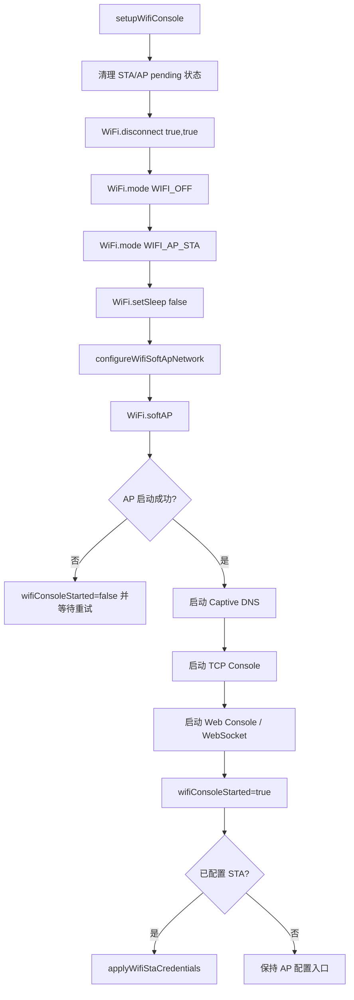
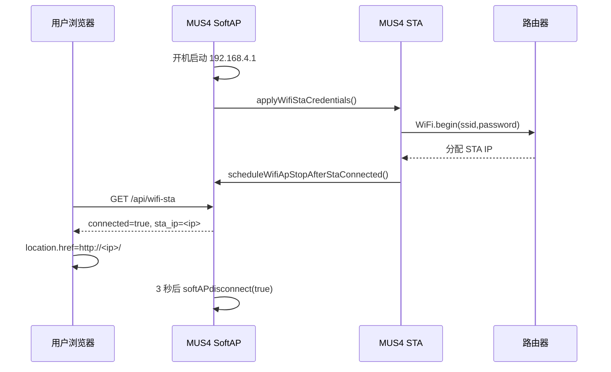
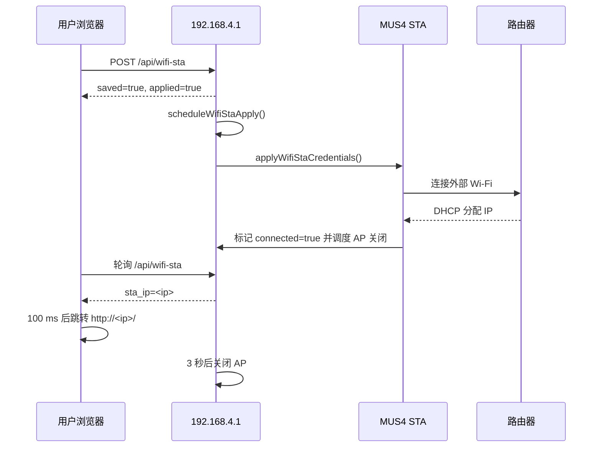
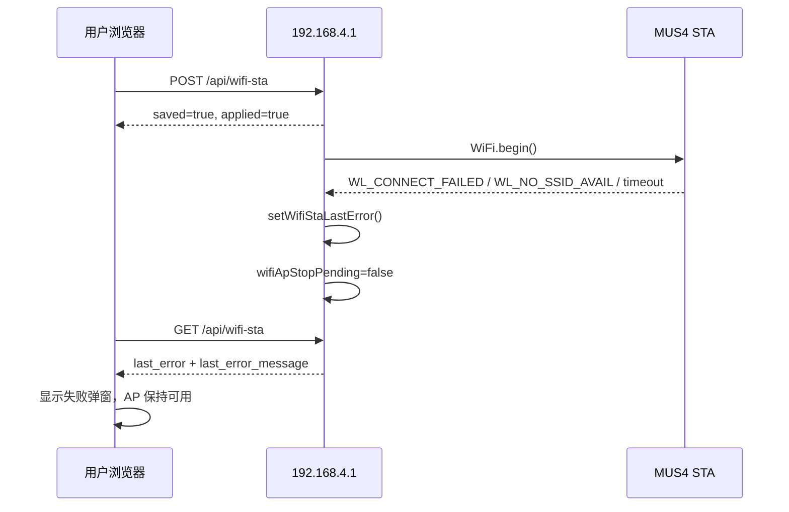
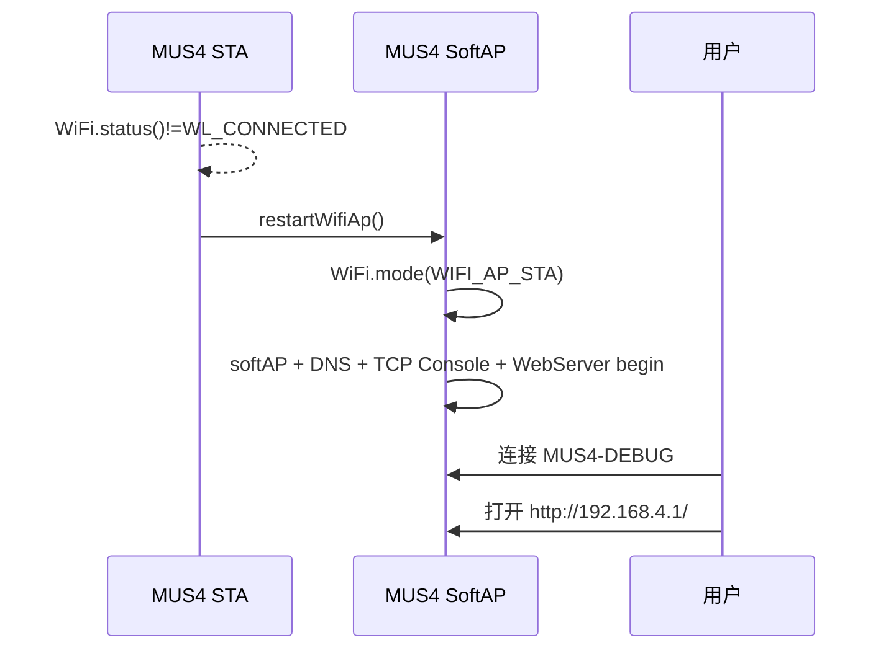

# Wi-Fi AP / STA 工作、交互与切换逻辑梳理

## 结论

当前固件的 Wi-Fi Console 采用“开机先提供调试 AP，同时可尝试连接 STA；STA 成功后延时关闭 AP；STA 断开后恢复 AP”的生命周期设计。

核心体验目标是：

1. 用户始终可以通过调试 AP 进入 Donkey Console 完成初始配置。
2. STA 连接成功后，前端在 AP 关闭前读取到 STA IP，并跳转到 `http://<sta_ip>/`。
3. STA 连接失败、超时或配置错误时，AP 不关闭，用户可以继续在 AP 页面里修正配置。
4. STA 运行中断开后，固件恢复 AP、DNS、TCP Console 和 Web Console，让用户重新进入设备。

相关主逻辑集中在 `MUS4_FW.ino` 的 Wi-Fi Console 编译路径中。

## 角色划分

| 角色 | 当前行为 | 主要用途 |
| --- | --- | --- |
| SoftAP | 默认 SSID 为 `MUS4-DEBUG`，IP 固定为 `192.168.4.1` | 调试入口、Captive Portal、初始 STA 配置、STA 失败后的恢复入口 |
| STA | 使用 Preferences 或编译期默认凭据连接外部 2.4G Wi-Fi | 让设备接入用户局域网，支持 Web Console / OTA / 遥测在局域网内访问 |
| Captive DNS | AP 开启时通配 DNS 到 SoftAP IP | 尽量触发 Windows、iOS/macOS、Android 的自动弹窗 |
| Web Console | 端口 80，提供 UI、API、HTTP OTA | 用户配置 AP/STA、查看状态、上传固件 |
| TCP Console | 端口 2323 | 无线命令入口 |
| WebSocket Telemetry | 端口 81 | Web 前端遥测数据推送 |

## 关键状态变量

| 变量 | 含义 |
| --- | --- |
| `wifiConsoleStarted` | AP、TCP Console、Web Console 是否已启动成功。 |
| `wifiStaConfigured` | 是否存在有效 STA SSID 配置。 |
| `wifiStaConnecting` | STA 当前是否处于连接尝试中。 |
| `wifiStaConnected` | 固件认为 STA 当前已连接。 |
| `wifiStaTimedOut` | 最近一次 STA 连接是否超时。 |
| `wifiStaLastError` / `wifiStaLastErrorMessage` | 最近一次 STA 失败原因，供 API 和前端展示。 |
| `wifiStaApplyPending` | Web/API 保存配置后，延时触发 `WiFi.begin()`。 |
| `wifiApStopPending` | STA 成功后，延时关闭 AP。 |
| `wifiApRestartPending` | AP SSID 修改后，延时重启 AP。 |

## 开机启动流程

`setupWifiConsole()` 是 Wi-Fi Console 的开机入口，当前流程如下：



关键点：

- SoftAP 在 `WiFi.softAP()` 前先调用 `configureWifiSoftApNetwork()`，显式固定为 `192.168.4.1/24`。
- Wi-Fi 模式使用 `WIFI_AP_STA`，因此开机阶段 AP 与 STA 可并行存在。
- 如果已有 STA 配置，固件会先启动 DNS、TCP Console 和 Web Console，再调用 `applyWifiStaCredentials()` 尝试接入外部 Wi-Fi，避免 STA 极快连接时 AP 关闭倒计时早于页面/API 就绪。
- 如果 AP 启动失败，`wifiConsoleStarted=false`，后续 `updateWifiConsole()` 会按 `WIFI_CONSOLE_RETRY_INTERVAL_MS` 周期重试。

## SoftAP 网络配置

SoftAP 网络由 `configureWifiSoftApNetwork()` 统一配置：

```cpp
IPAddress apIp(192, 168, 4, 1);
IPAddress subnet(255, 255, 255, 0);
WiFi.softAPConfig(apIp, apIp, subnet);
```

该函数在两个位置调用：

1. `setupWifiConsole()`：首次开机启动 AP 前。
2. `restartWifiAp()`：STA 断开后恢复 AP 前。

这样可以避免 SoftAP 恢复后 IP/Gateway 漂移，确保用户始终通过：

```text
http://192.168.4.1/
```

访问 AP 下的 Donkey Console。

## STA 配置保存与应用流程

### Web 前端入口

用户在 Web Console 的 STA Modal 中填写 SSID/密码并点击“连接”后，前端 `saveWifiSta()` 会：

1. 关闭扫描浮层。
2. 显示“正在连接”。
3. POST `/api/wifi-sta`，提交 `ssid`、`password` 或 `keep_password=1`。
4. 成功后清理密码输入框状态。
5. 刷新 `/api/wifi-sta` 与 `/api/status`。
6. 等待 1 秒。
7. 进入 `waitWifiStaConnectionResult()` 轮询连接结果。

### 后端 API 入口

`handleWifiWebStaSet()` 处理 `/api/wifi-sta`：

1. 要求 Web Console 已认证或处于开发模式。
2. 校验 SSID 长度。
3. 校验密码长度，或在 `keep_password=1` 时要求已有保存密码。
4. 写入 Preferences，并更新运行时 `wifiStaSsid` / `wifiStaPassword`。
5. 立即返回 JSON：`{"saved":true,"applied":true,"state":...}`。
6. 调用 `scheduleWifiStaApply()`，延时触发真正的 STA 连接。

这里故意先返回 HTTP 响应，再延时应用 STA，避免请求正在返回时 Wi-Fi 状态切换导致浏览器侧误判保存失败。

### 延时应用

`updateWifiSta()` 每轮检查：

```cpp
if (wifiStaApplyPending && (long)(millis() - wifiStaApplyDeadlineMs) >= 0) {
    applyWifiStaCredentials();
}
```

`applyWifiStaCredentials()` 做的事情是：

1. 清除 `wifiStaApplyPending`。
2. 清除旧的连接、超时和错误状态。
3. 设置 `wifiStaConnecting=true`。
4. 记录连接开始时间。
5. 仅断开 STA，不主动关闭 AP。
6. 调用 `WiFi.begin(wifiStaSsid, wifiStaPassword)`。

## STA 成功路径

`updateWifiSta()` 中，当 `WiFi.status() == WL_CONNECTED` 且此前 `wifiStaConnected=false` 时，固件判定 STA 首次连接成功：

1. `wifiStaConnected=true`。
2. `wifiStaTimedOut=false`。
3. `wifiStaConnecting=false`。
4. 清空 `wifiStaLastError`。
5. 日志输出 STA IP。
6. 调用 `scheduleWifiApStopAfterStaConnected()`。

AP 不会立刻关闭，而是设置：

```cpp
wifiApStopPending = true;
wifiApStopDeadlineMs = millis() + WIFI_AP_STOP_AFTER_STA_CONNECTED_DELAY_MS;
```

当前 `WIFI_AP_STOP_AFTER_STA_CONNECTED_DELAY_MS = 3000`。这 3 秒窗口用于让 Web 前端从 `/api/wifi-sta` 读到 `sta_ip`，并跳转到 STA 地址。

到达 deadline 后，`updateWifiConsole()` 调用 `stopWifiApAfterStaConnected()`：

1. `wifiApStopPending=false`。
2. 复核 `WiFi.status() == WL_CONNECTED` 且 `WiFi.localIP()` 不是 `0.0.0.0`。
3. 如果 STA 已不可靠，输出 `AP stop skipped: STA not ready` 并保留 AP。
4. 如果 STA 仍可靠，停止 Captive DNS。
5. `WiFi.softAPdisconnect(true)` 关闭 SoftAP。
6. `WiFi.mode(WIFI_STA)` 切换为纯 STA。
7. 输出日志 `AP stopped after STA connected`。

这个复核用于处理“STA 短暂连接成功后又立即断开”的边界，避免旧的 AP 关闭计划让用户失去配置入口。

## STA 失败与超时路径

STA 连接失败由 `setWifiStaLastError()` 统一收敛。触发条件包括：

| 条件 | 错误码 | 用户提示 |
| --- | --- | --- |
| `WL_NO_SSID_AVAIL` | `no_ssid` | 未找到目标 SSID，请检查网络名称或距离。 |
| `WL_CONNECT_FAILED` | `auth_failed` | STA 认证失败，请检查 Wi-Fi 密码。 |
| 超过 `WIFI_STA_CONNECT_TIMEOUT_MS` | `timeout` | STA 连接超时，请检查 SSID、密码与路由器信号。 |

失败入口第一行会执行：

```cpp
wifiApStopPending = false;
```

这点很关键：如果 STA 实际没有成功，不能继续执行之前可能遗留的 AP 关闭计划。失败后 AP 保持开启，前端可以继续通过 `192.168.4.1` 修正配置。

`setWifiStaLastError()` 会保留本轮连接的首个失败原因，避免后续瞬态状态覆盖更有诊断价值的根因。新一轮 `applyWifiStaCredentials()` 会先清空旧错误。

## STA 断开后的 AP 恢复

如果之前 `wifiStaConnected=true`，但后续 `WiFi.status()` 不再是 `WL_CONNECTED`，`updateWifiSta()` 会执行：

1. `wifiStaConnected=false`。
2. 输出 `STA disconnected` 日志。
3. 调用 `restartWifiAp()`。

`restartWifiAp()` 不只是重新打开 SoftAP，还会恢复完整无线入口：

1. 取消旧的 `wifiApStopPending`，确保“恢复 AP”不会被旧关闭计划覆盖。
2. 停止 Captive DNS。
3. `WiFi.softAPdisconnect(true)` 清理旧 AP。
4. 延时 100 ms；这是同步阻塞调用，后续如需进一步降低主循环抖动，应单独设计非阻塞 AP 重启状态机。
5. `WiFi.mode(WIFI_AP_STA)`。
6. 重新 `configureWifiSoftApNetwork()`。
7. `WiFi.softAP(...)`。
8. 重新启动 Captive DNS。
9. `wifiConsoleServer.begin()`。
10. `wifiConsoleServer.setNoDelay(true)`。
11. `wifiWebServer.begin()`。
12. `wifiConsoleStarted=true`。

因此 STA 断开后，AP 恢复目标不是“SSID 可见”而已，而是 `http://192.168.4.1/`、TCP Console 与 Captive Portal 都应重新可用。

## Captive Portal 交互逻辑

AP 开启后，固件启动：

```cpp
wifiCaptiveDnsServer.start(53, "*", WiFi.softAPIP());
```

这会把经由 MUS4 AP 的 DNS 查询尽量解析到 `192.168.4.1`。WebServer 注册了常见平台探测路径：

| 平台 / 场景 | 路径 | 当前响应 |
| --- | --- | --- |
| Windows NCSI | `/connecttest.txt` | 302 到 `http://192.168.4.1/` |
| Windows NCSI | `/ncsi.txt` | 302 到 `http://192.168.4.1/` |
| Windows redirect | `/redirect` | HTML meta refresh + JS `location.replace()` + 手动链接 |
| Apple | `/hotspot-detect.html` | 302 到 AP 根路径 |
| Apple | `/library/test/success.html` | 302 到 AP 根路径 |
| Apple | `/success.txt` | 302 到 AP 根路径 |
| Android | `/generate_204` | 302 到 AP 根路径 |
| Android | `/gen_204` | 302 到 AP 根路径 |
| Android | `/mobile/status.php` | 302 到 AP 根路径 |
| Android | `/connectivity-check.html` | 302 到 AP 根路径 |
| 其他非 API 路径 | `onNotFound` | 302 到 AP 根路径 |
| 未知 `/api/` 路径 | `onNotFound` | JSON 404 |

注意：Android 的 204 探测路径不能返回 204，否则系统会认为网络已直连互联网，不会弹出 Portal。

### Windows 多网卡限制

Captive Portal 只能处理“请求确实进入 ESP32 AP”的流量。如果 Windows 同时连接有线网络、VPN 或其他可联网网卡，系统可能把 `msftconnecttest.com` 的 DNS/HTTP 流量走其他接口，最终打开 Microsoft/MSN 页面。此时 ESP32 无法拦截这些请求。

已知可靠做法：

```text
http://192.168.4.1/
```

该限制已写入中英文 README。

## 前端 STA 成功跳转逻辑

`waitWifiStaConnectionResult()` 最多等待约 22 秒，持续调用 `/api/wifi-sta`。这个窗口覆盖后端 `WIFI_STA_CONNECT_TIMEOUT_MS = 15000`、`WIFI_STA_APPLY_DELAY_MS = 800`、前端保存后的 1 秒初始等待以及轮询抖动，避免前端先于后端真实失败原因超时。成功条件是：

```js
j.connected && j.sta_ip && j.sta_ip !== '0.0.0.0'
```

成功后前端会：

1. 显示：`STA 已连接，IP：<ip>，AP 将在约 3 秒后关闭`。
2. 调用 `refreshStatus()` 更新状态卡片。
3. 清空命令输入框。
4. 调用 `redirectToStaConsole(j.sta_ip)`。
5. 关闭 STA Modal。

`redirectToStaConsole(ip)` 不再等待额外 probe，而是在 100 ms 后直接跳转：

```js
const url = 'http://' + ip + '/';
setTimeout(() => { location.href = url }, 100);
```

这样做的原因是：AP 关闭窗口只有 3 秒，前端的首要任务是尽快离开 `192.168.4.1`，跳到设备的 STA IP。任何额外探测都有可能被浏览器、路由、跨网段策略或 AP 关闭时序拖慢。

### 前端网络断开容错

如果 `/api/wifi-sta` 短暂请求失败，前端不会立刻判定 STA 失败，而是记录 `miss` 次数：

- 少于 2 次：等待 500 ms 后继续轮询。
- 达到 2 次：提示“AP 可能已关闭，STA 可能已连接”，让用户切回车辆所在 Wi-Fi 后手动打开 STA IP。

这用于避免把“AP 因 STA 成功而关闭”误判成“STA 连接失败”。

## mDNS AP 名称固定入口

STA 连接成功并取得有效 IP 后，固件会把 Web Console 发布为：

```text
http://<AP名称小写>.local/
```

默认 AP 名称为 `MUS4-DEBUG`，因此默认局域网入口是：

```text
http://mus4-debug.local/
```

### 名称规则

为了让 AP 名称可以直接作为 mDNS hostname，AP SSID 被限制为 mDNS-safe 名称：

- 只能使用 `A-Z`、`a-z`、`0-9` 和 `-`。
- 长度仍为 `1..32` 字符。
- 不能以 `-` 开头或结尾。

AP SSID 会保留用户输入的大小写用于显示和 AP 广播，但 mDNS hostname 会统一转为小写。例如 AP 名称 `MU04` 会发布为 `mu04.local`。

如果旧 NVS 中保存了中文、空格、下划线或其他非法 AP 名称，固件加载时会回退到默认 `MUS4-DEBUG`。

### mDNS 生命周期

mDNS 跟随 STA，而不是跟随 AP：

1. `applyWifiStaCredentials()` 开始新一轮 STA 连接前，会先停止旧 mDNS。
2. `updateWifiSta()` 首次检测到 STA connected 后，调用 `startWifiMdnsIfNeeded()`。
3. `startWifiMdnsIfNeeded()` 会复核 `WL_CONNECTED` 和有效 STA IP，然后把 AP 名称转为小写 hostname 并执行：
   - `MDNS.begin(wifiMdnsHostText().c_str())`
   - `MDNS.addService("http", "tcp", WIFI_WEB_CONSOLE_PORT)`
4. AP 因 STA 成功而关闭时，不停止 mDNS。
5. STA 运行中断开时，调用 `stopWifiMdnsIfNeeded()`，然后恢复 AP。

因此，AP 关闭后，只要 STA 仍在线且客户端网络支持 mDNS，用户仍可打开：

```text
http://<AP名称小写>.local/
```

### API 字段

`/api/status` 会输出：

```text
mdns_host="mus4-debug" mdns_url=http://mus4-debug.local/ mdns_started=1
```

`/api/wifi-sta` 会输出：

```json
{
  "mdns_host": "mus4-debug",
  "mdns_url": "http://mus4-debug.local/",
  "mdns_started": true
}
```

Web Console 的 Network 卡片会显示 LAN `.local` 入口。点击 LAN 入口会跳转到 `.local` 地址；如果 `.local` 打不开，应使用同一卡片显示的 STA IP。

### 兼容性限制

`.local` 依赖客户端系统、浏览器和路由器对 mDNS / multicast 的支持。macOS 和 iOS 通常支持较好；Windows、Android、企业或校园网络可能受系统设置、路由器 AP isolation、multicast 隔离或安全软件影响。

普通浏览器不能仅凭任意 AP 名称扫描局域网并发现未知设备 IP。本功能的前提是：设备自身在 STA 侧用当前 AP 名称注册 mDNS。若 `.local` 失败，排查顺序是：

1. 确认电脑/手机与 MUS4 STA 在同一局域网。
2. 先打开 `http://<sta_ip>/` 验证 IP 可达。
3. 检查路由器是否开启 AP isolation 或 multicast/mDNS 隔离。
4. 尝试换用支持 mDNS 的系统或浏览器。

## AP SSID 与 STA IP 的取舍

曾考虑过把 AP SSID 临时改成类似：

```text
MUS4-STA-192.168.3.144
```

当前没有采用，原因是：

1. 改 AP SSID 需要重启 AP，会立即断开当前用户页面。
2. 断开后用户不一定能看到页面中的 STA IP 提示。
3. 不同平台对自动切换到 STA 网络的行为不可控。
4. SoftAP SSID 最大长度有限，IP 后缀会挤占用户自定义 SSID 空间。

当前方案是在原 AP 页面内显示 STA IP，并在 AP 关闭前主动跳转到 STA IP。

## 状态查询接口

### `/api/status`

返回文本状态，由 `printWirelessStatus()` 生成，包含：

- `ap_ssid`
- `ap_ip`
- `ap_clients`
- `sta_configured`
- `sta_connected`
- `sta_ssid`
- `sta_ip`
- `mdns_host`
- `mdns_url`
- `mdns_started`
- OTA、WebSocket、HTTP handler 统计等运行信息

前端状态卡片通过解析该文本更新 AP/STA 标签和复制 IP 行为。

### `/api/wifi-sta`

返回 JSON，核心字段：

```json
{
  "configured": true,
  "connected": true,
  "timed_out": false,
  "connecting": false,
  "last_error": "",
  "last_error_message": "",
  "ssid": "example",
  "password_set": true,
  "password_len": 8,
  "ap_ip": "192.168.4.1",
  "sta_ip": "192.168.3.144",
  "mdns_host": "mus4-debug",
  "mdns_url": "http://mus4-debug.local/",
  "mdns_started": true
}
```

其中 `sta_ip` 由 `wifiStaIpText()` 生成：

- `wifiStaConnected=true`：返回 `WiFi.localIP()`。
- 否则：返回 `0.0.0.0`。

## 时序图

### 1. 开机已有 STA 配置且连接成功



### 2. Web 页面配置 STA 成功



### 3. STA 连接失败



### 4. STA 运行中断开



## 排查清单

### AP 可见但打不开 `192.168.4.1`

优先检查：

1. `restartWifiAp()` 是否执行到了 `wifiWebServer.begin()`。
2. SoftAP 是否重新调用了 `configureWifiSoftApNetwork()`。
3. 客户端是否拿到了 `192.168.4.x` 地址。
4. 浏览器是否仍在访问旧 STA IP 或 HTTPS 缓存地址。
5. 设备串口日志是否有 `AP restarted ssid=... IP: 192.168.4.1`。

### Windows 弹出 MSN / Microsoft 页面

优先确认请求是否真的进入 ESP32：

```powershell
curl.exe -v http://192.168.4.1/redirect
curl.exe --resolve www.msftconnecttest.com:80:192.168.4.1 -v http://www.msftconnecttest.com/redirect
```

如果这两条能返回 ESP32 的 redirect HTML，但系统自动弹窗仍打开 MSN，说明 Windows 把探测流量走了有线网络或其他网卡。固件侧无法修复，只能手动打开 `http://192.168.4.1/` 或临时禁用其他联网路径。

### STA 已连接但前端提示失败

优先检查：

1. `WIFI_AP_STOP_AFTER_STA_CONNECTED_DELAY_MS` 是否为 3000。
2. `/api/wifi-sta` 是否在 AP 关闭前返回 `connected=true` 和有效 `sta_ip`。
3. 前端 `redirectToStaConsole()` 是否仍有额外 probe 或长延时，`waitWifiStaConnectionResult()` 是否仍有约 22 秒等待窗口。
4. 浏览器当前电脑是否已连接到 STA 所在局域网；如果电脑仍只连 MUS4 AP，AP 关闭后无法访问 STA IP。

### STA 失败但 AP 被关闭

优先检查：

1. `setWifiStaLastError()` 是否执行 `wifiApStopPending=false`。
2. 是否存在旧的 AP stop pending 没有被失败路径取消。
3. 日志中是否先出现 `STA connected IP` 后又失败；如果是，说明曾经短暂成功，应按 STA 断开恢复 AP 路径排查。

## 当前设计边界

1. Captive Portal 只能尽量提高自动弹窗概率，不能保证所有平台、所有多网卡场景都弹出 `192.168.4.1`。
2. STA 成功后的 AP 关闭是延时 3 秒，不是等浏览器确认跳转成功后再关闭。
3. 前端知道 STA IP 后直接跳转，不保证用户电脑一定已经接入同一 STA 网络。
4. `WIFI_STA_CLEAR` 只清除配置并禁用 STA，不主动断开当前 STA 或切换 Wi-Fi 模式。
5. AP 最大客户端数当前为 1，调试时应避免多个设备同时抢占 AP。

## 维护建议

1. 修改 AP/STA 生命周期时，同步更新 `tests/test_firmware_feature_flags.py` 的源码断言。
2. 修改无线权限策略时，同步更新 `wireless_console_policy.py` 和 `tests/test_wireless_console_policy.py`。
3. 修改 Captive Portal 路径时，保持 `/api/` 未知路径返回 JSON 404，避免 API 调试被 HTML 重定向吞掉。
4. 修改 STA 成功关闭 AP 的延时时，需要同时检查前端提示文案、跳转逻辑和实机时序。
5. 修改 HTTP OTA 或 Web Console 安全门控时，必须保留认证和 Park Locked / 开发模式约束。
