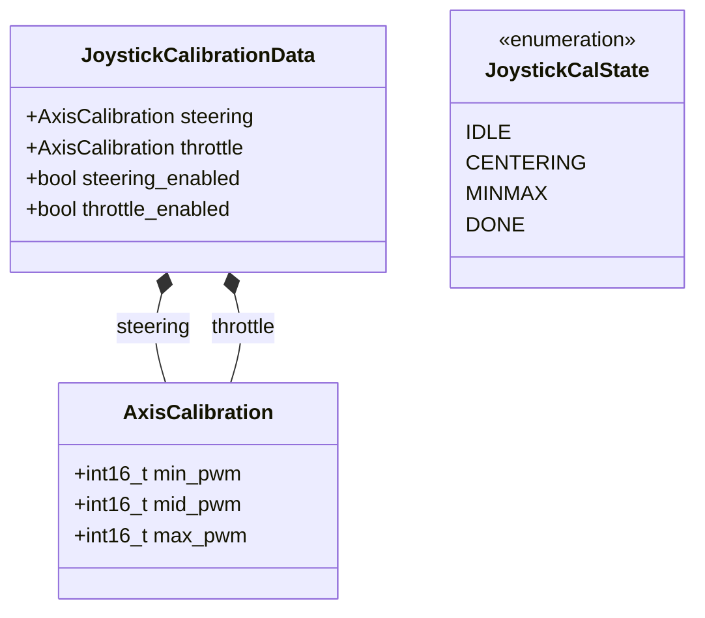
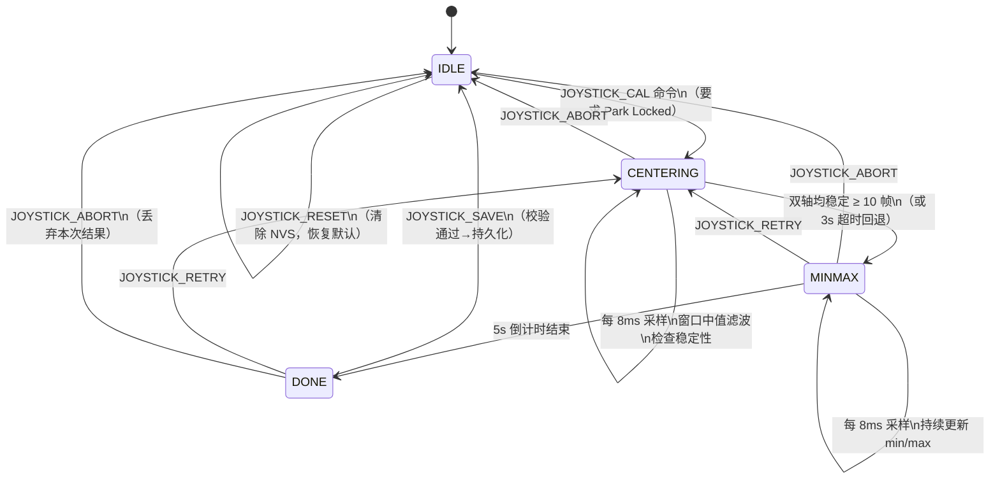
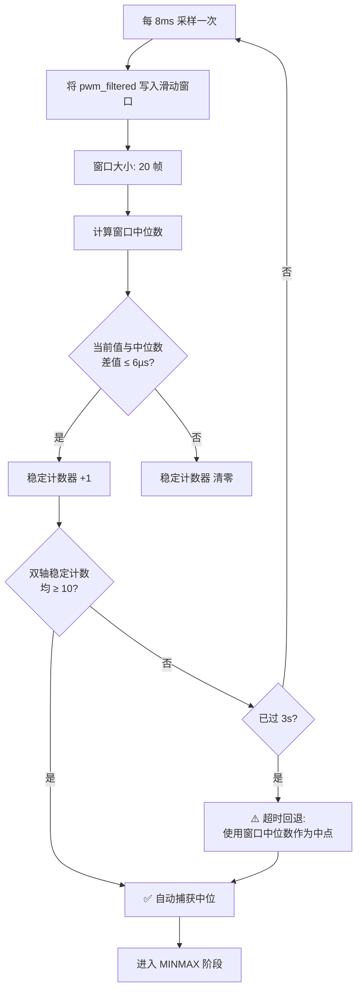
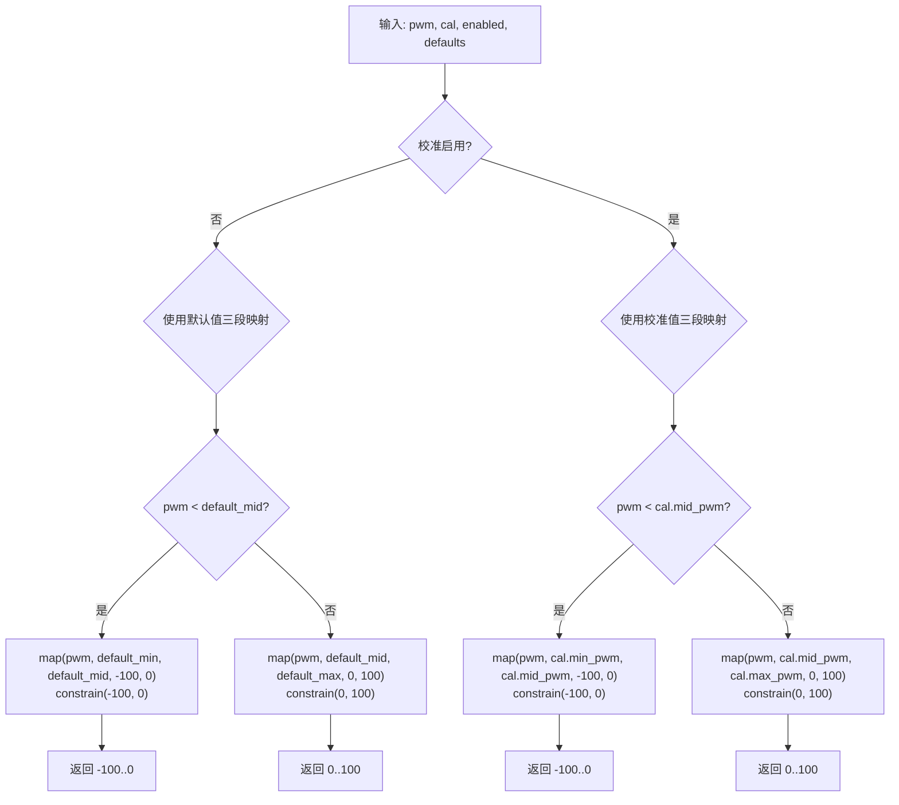
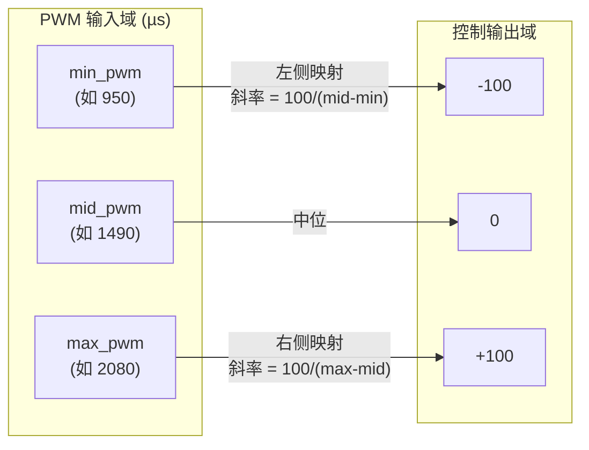
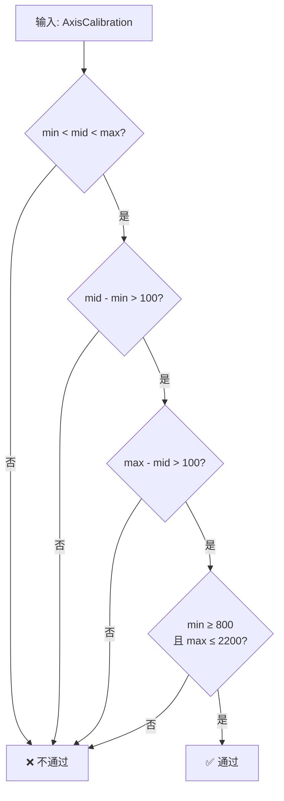
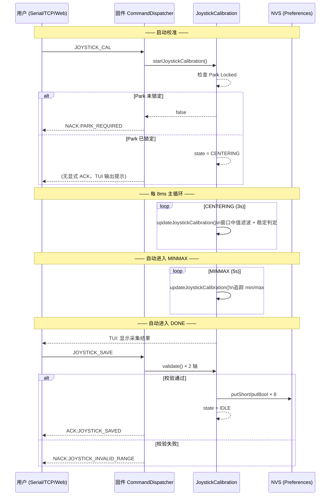
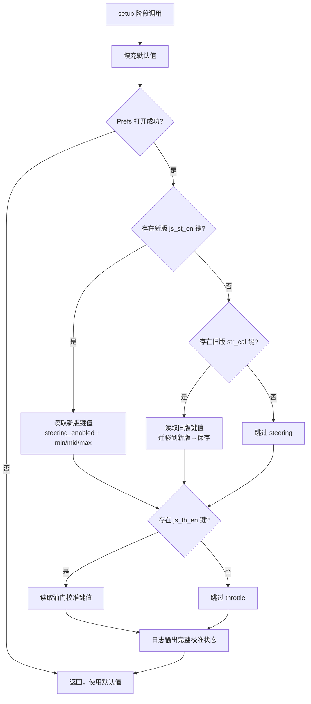

# 手柄校准（Joystick Calibration）逻辑分析

> **源码位置**: `libraries/mus4_control/src/JoystickCalibration.cpp` / `.h`
> **测试**: `tests/test_joystick_calibration.py`
> **设计文档**: `docs/Plan/steering_calibration_design.md`, `docs/Plan/steering_calibration.md`
> **固件版本**: v1.7.30+

---

## 1. 概述

手柄校准系统用于解决 RC 遥控器因机械装配、电位器中位漂移等原因导致的以下问题：

1. **中位偏移**：摇杆物理中位 ≠ 接收机 PWM 电气中位（1500µs），导致车辆无法走直线。
2. **行程不对称**：左右/前后满舵的实际 PWM 范围不对称，导致一侧控制量无法达到 ±100。

校准系统支持**转向（Steering, CH1）**和**油门（Throttle, CH2）**双轴独立校准，通过交互式向导采集中位和极限 PWM 值，使用**分段线性映射**实现非对称校准，参数持久化到 ESP32 NVS。

---

## 2. 数据结构

### 2.1 核心数据模型



- **`AxisCalibration`**: 单轴校准参数，记录最小/中点/最大 PWM 值（单位 µs）。
- **`JoystickCalibrationData`**: 双轴完整校准数据，含独立启用标志。
- **`JoystickCalState`**: 校准向导状态机枚举。

### 2.2 运行时全局变量

| 变量 | 类型 | 说明 |
|------|------|------|
| `joystick_cal` | `JoystickCalibrationData` | 当前生效的校准参数 |
| `joystick_cal_state` | `JoystickCalState` | 校准向导状态 |
| `joystick_cal_stage_start_ms` | `unsigned long` | 当前阶段起始时刻 |
| `joystick_cal_temp_min[2]` | `int16_t[2]` | MINMAX 阶段运行时最小追踪 |
| `joystick_cal_temp_max[2]` | `int16_t[2]` | MINMAX 阶段运行时最大追踪 |

### 2.3 默认值与常量

| 常量 | 值 | 说明 |
|------|-----|------|
| `RC_STEERING_MIN` | 872 | 转向默认最小 PWM (µs) |
| `RC_STEERING_MID` | 1488 | 转向默认中点 PWM (µs) |
| `RC_STEERING_MAX` | 2113 | 转向默认最大 PWM (µs) |
| `RC_THROTTLE_MIN` | 888 | 油门默认最小 PWM (µs) |
| `RC_THROTTLE_MID` | 1493 | 油门默认中点 PWM (µs) |
| `RC_THROTTLE_MAX` | 2149 | 油门默认最大 PWM (µs) |
| `RC_PWM_MIN` | 800 | PWM 硬边界下限 (µs) |
| `RC_PWM_MAX` | 2200 | PWM 硬边界上限 (µs) |

### 2.4 NVS 持久化键

| NVS Key | 类型 | 说明 |
|---------|------|------|
| `js_st_min` | `int16_t` | 转向校准最小 PWM |
| `js_st_mid` | `int16_t` | 转向校准中点 PWM |
| `js_st_max` | `int16_t` | 转向校准最大 PWM |
| `js_st_en` | `bool` | 转向校准启用标志 |
| `js_th_min` | `int16_t` | 油门校准最小 PWM |
| `js_th_mid` | `int16_t` | 油门校准中点 PWM |
| `js_th_max` | `int16_t` | 油门校准最大 PWM |
| `js_th_en` | `bool` | 油门校准启用标志 |

> **向后兼容**: 加载时若检测到旧版 `str_min`/`str_mid`/`str_max`/`str_cal` 键（V1 转向校准），自动迁移到新版键名并保存。

---

## 3. 校准向导状态机

### 3.1 状态流转总图



### 3.2 各阶段详细逻辑

#### 阶段一：IDLE（空闲）

- 校准系统未激活，正常控制流程运行。
- 收到 `JOYSTICK_CAL` 命令时检查 Park 是否锁定：
  - 未锁定 → 返回 `NACK:PARK_REQUIRED`，拒绝启动。
  - 已锁定 → 进入 CENTERING 阶段。

#### 阶段二：CENTERING（中位采集）

**目标**: 精确记录摇杆自然回中时的 PWM 值。

**算法**: 滑动窗口中值滤波 + 稳定性判定。



**关键参数**:

| 参数 | 值 | 说明 |
|------|-----|------|
| `CENTER_WINDOW_SIZE` | 20 | 滑动窗口帧数 |
| `CENTER_STABLE_THRESHOLD_US` | 6 | 稳定性判定阈值 (µs) |
| `CENTER_STABLE_COUNT_REQUIRED` | 10 | 连续稳定帧数要求 |
| 超时 | 3000ms | 3 秒后强制使用中位数 |

**设计要点**:
- 使用**中位数**而非均值，抗偶发脉冲干扰。
- 稳定判定要求连续 10 帧与中位数偏差不超过 6µs，避免在摇杆尚未回中时误捕获。
- 超时回退路径与正常捕获路径使用相同的 `computeWindowMedian()`，保证行为一致。

#### 阶段三：MINMAX（行程采集）

**目标**: 记录摇杆在两个方向上的极限 PWM 值。

```mermaid
flowchart TD
    A[初始化 temp_min = 32767\n初始化 temp_max = -32768] --> B[每 8ms 采样一次]
    B --> C{steer_current <\ntemp_min[STEER]?}
    C -->|是| D[更新 temp_min]
    C -->|否| E{steer_current >\ntemp_max[STEER]?}
    E -->|是| F[更新 temp_max]
    D --> G[同理处理 throttle 轴]
    F --> G
    E -->|否| G
    G --> H{已过 5s?}
    H -->|否| B
    H -->|是| I[将 temp_min/max\n写入 joystick_cal]
    I --> J[进入 DONE 阶段]
```

**关键参数**: 超时 5000ms（5 秒），用户需在此期间将摇杆向各方向打满。

#### 阶段四：DONE（等待确认）

校准数据暂存于 `joystick_cal`，等待用户通过命令决定：

| 命令 | 行为 |
|------|------|
| `JOYSTICK_SAVE` | 校验→持久化到 NVS→回到 IDLE |
| `JOYSTICK_RETRY` | 丢弃本次结果→回到 CENTERING |
| `JOYSTICK_ABORT` | 丢弃本次结果→回到 IDLE |

---

## 4. 核心算法：分段线性映射

### 4.1 `mapJoystickAxis()` 算法流程



### 4.2 非对称映射示意图



**关键特性**:
1. **分段线性**: 以 `mid_pwm` 为界分两段，左右斜率独立，完美适应机械行程不对称。
2. **中点保证**: `mid_pwm` 始终映射到 0，车辆直线行驶对应中位不再偏移。
3. **约束保护**: 每段映射结果经 `constrain()` 限幅，即使输入超范围也不会越界。
4. **非校准路径**: 即使 `enabled=false`，也使用相同的三段式映射逻辑（以编译期默认常量作为中点），保证行为一致。

### 4.3 数学表达

对于校准启用的情况：

$$f(pwm) = \begin{cases} \text{constrain}\left( \frac{pwm - cal.min\_pwm}{cal.mid\_pwm - cal.min\_pwm} \times 100 - 100,\ -100,\ 0 \right) & pwm < cal.mid\_pwm \\ \text{constrain}\left( \frac{pwm - cal.mid\_pwm}{cal.max\_pwm - cal.mid\_pwm} \times 100,\ 0,\ 100 \right) & pwm \geq cal.mid\_pwm \end{cases}$$

---

## 5. 数据校验算法

### 5.1 `validateJoystickCalibration()` 校验规则



**校验规则总结**:

| 校验项 | 条件 | 目的 |
|--------|------|------|
| 单调性 | `min < mid < max` | 保证顺序正确 |
| 左侧行程 | `mid - min > 100` µs | 排除无效窄区间 |
| 右侧行程 | `max - mid > 100` µs | 排除无效窄区间 |
| 硬边界 | `800 ≤ min` 且 `max ≤ 2200` | 确保在 RC PWM 有效范围内 |

---

## 6. 命令接口

### 6.1 命令一览

| 命令（新版） | 旧版别名 | 阶段限制 | 无线权限 | 说明 |
|-------------|---------|---------|---------|------|
| `JOYSTICK_CAL` | `STEER_CAL` | IDLE | 需认证+Park | 启动校准向导 |
| `JOYSTICK_SAVE` | `CAL_SAVE` | DONE | 需认证+Park | 保存并持久化 |
| `JOYSTICK_RETRY` | `CAL_RETRY` | DONE/MINMAX | 需认证+Park | 重新采集 |
| `JOYSTICK_ABORT` | `CAL_ABORT` | 非 IDLE | 需认证+Park | 放弃校准 |
| `JOYSTICK_RESET` | `CAL_RESET` | 任意 | 需认证+Park | 恢复出厂默认 |
| `JOYSTICK_STATUS` | `CAL_STATUS` | 任意 | 需认证 | 打印当前参数 |

旧版 `STEER_CAL`/`CAL_*` 命令保留兼容，固件返回 `ACK:DEPRECATED_USE_JOYSTICK_*` 后执行对应新版逻辑。

### 6.2 命令交互协议



---

## 7. 控制链路集成

### 7.1 校准在控制链路中的位置

```mermaid
flowchart TD
    subgraph "RC 输入层 (mus4_rc)"
        A[CH1-CH6 PWM 捕获\nRcPwmCapture] --> B[中值滤波 + 指数平滑\nRcFilter]
    end

    subgraph "校准映射层 (mus4_control)"
        B --> C[pwm_filtered[]]
        C --> D[mapJoystickAxis\nJoystickCalibration]
        D --> E[rc_data.steering\nrc_data.throttle]
    end

    subgraph "控制融合层 (mus4_control)"
        E --> F[ControlMixer\nupdateControlOutput]
        F --> G[car_output.steering\ncar_output.throttle]
    end

    subgraph "漂移辅助"
        G --> H[apply_drift_assist]
        H --> I[最终输出]
    end

    subgraph "执行层 (mus4_safety)"
        I --> J[ActuatorOutput\nPWM 限幅 → ledc 输出]
    end
```

**数据流说明**:
1. PWM 原始值经过滤波后进入 `pwm_filtered[]`。
2. `mapJoystickAxis()` 在校准启用时使用校准参数进行分段映射，否则使用编译期默认常量。
3. 映射结果为 [-100, 100] 控制量，进入模式融合。
4. MANUAL 模式下 RC 值直接映射；SEMI_AUTO 下只有 Throttle 走 RC 映射。
5. 漂移辅助在映射后再叠加转向补偿。
6. 最终经 `ActuatorOutput` 映射回 PWM 并输出到舵机/电调。

### 7.2 各模式使用校准的情况

| 模式 | Steering 来源 | Throttle 来源 | 校准生效 |
|------|-------------|-------------|---------|
| MANUAL | RC → `mapJoystickAxis()` | RC → `mapJoystickAxis()` | ✅ 双轴 |
| SEMI_AUTO | Pilot | RC → `mapJoystickAxis()` | 仅油门轴 |
| FULL_AUTO | Pilot | Pilot | ❌ 不经过校准 |

---

## 8. 持久化生命周期

### 8.1 加载流程（`loadJoystickCalibration()`）



### 8.2 保存流程（`saveJoystickCalibration()`）

1. 若 steering 启用：先 `validateJoystickCalibration()` 校验→失败则拒绝全部保存。
2. 若 steering 未启用：回填默认值。
3. 同理校验/回填 throttle。
4. 打开 NVS 写入 8 个键（每轴 4 个：min/mid/max/en）。
5. 日志记录完整状态。

### 8.3 重置流程（`resetJoystickCalibration()`）

1. 内存数据恢复为编译期默认常量。
2. 双轴 `enabled` 置 `false`。
3. 从 NVS 删除 8 个校准键。
4. 状态机强制回到 IDLE。

---

## 9. 安全设计

| 安全措施 | 实现位置 | 说明 |
|---------|---------|------|
| Park 锁定前置 | `startJoystickCalibration()` | 未锁定拒绝启动，防止车辆在行驶中进入校准 |
| 校准期间零输出 | 主循环 `joystick_cal_state != IDLE` | 标定状态下跳过输出更新 |
| 范围校验 | `validateJoystickCalibration()` | 保存前校验单调性、行程和硬边界 |
| constrain 限幅 | `mapJoystickAxis()` | 映射结果始终在 [-100, 100] |
| NVS 校验失败回退 | `loadJoystickCalibration()` | 读取到的校准值未通过校验时自动丢弃 |
| 无线权限分层 | `CommandDispatcher` + `WirelessConsole` | 校准命令需认证+Park 锁定 |

---

## 10. 测试覆盖（Python 镜像）

`tests/test_joystick_calibration.py` 包含 Arduino 逻辑的 Python 等价实现，覆盖：

| 测试用例 | 覆盖场景 |
|---------|---------|
| `test_center_returns_zero` | 中点映射到 0 |
| `test_min_returns_negative_100` | 最小值映射到 -100 |
| `test_max_returns_100` | 最大值映射到 100 |
| `test_below_min_clamps` | 低于 min 限幅到 -100 |
| `test_above_max_clamps` | 高于 max 限幅到 100 |
| `test_disabled_uses_defaults` | 未启用时使用默认常量 |
| `test_validation_accepts_reasonable_range` | 合法范围校验通过 |
| `test_validation_rejects_min_equal_mid` | min==mid 校验失败 |
| `test_validation_rejects_too_narrow_range` | 行程 <100µs 校验失败 |
| `test_validation_rejects_out_of_pwm_bounds` | 超出 800-2200 校验失败 |

---

## 11. 设计演进历史

| 版本 | 变更 |
|------|------|
| V1（原始设计） | 仅 Steering 单轴校准，NVS 键 `str_min`/`str_mid`/`str_max`/`str_cal` |
| V2（当前） | 扩展为双轴 Joystick 校准，新增 Throttle 轴支持，统一 NVS 键 `js_st_*`/`js_th_*`，旧版键自动迁移；非校准路径也改用三段式映射消除中心偏移 |
