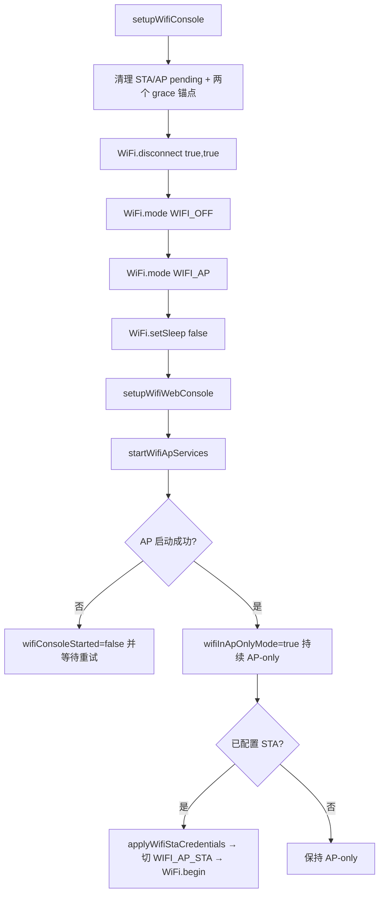
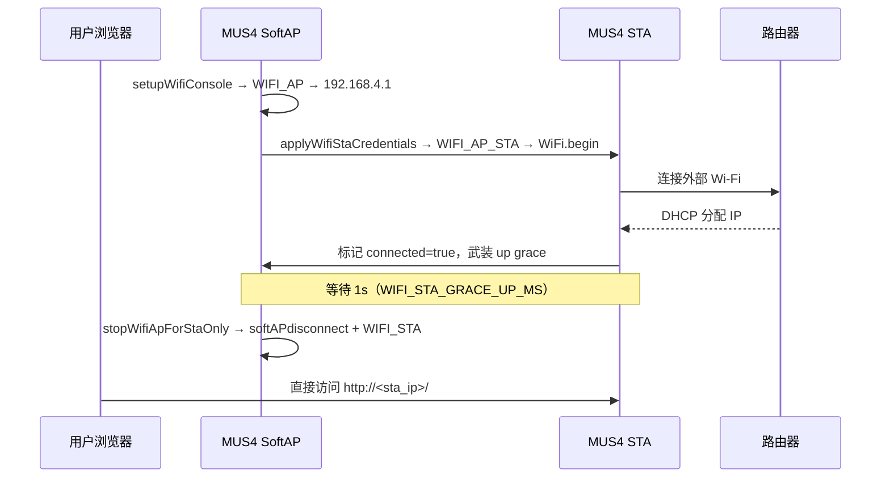
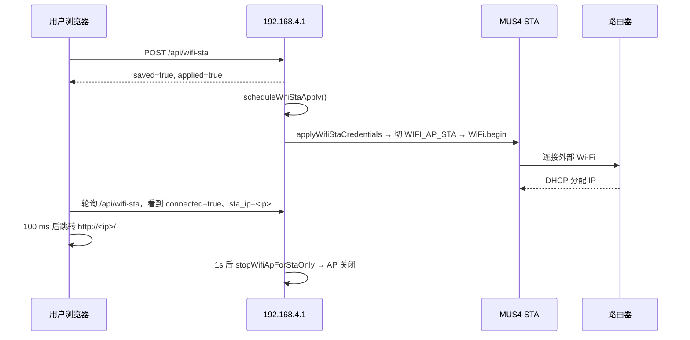
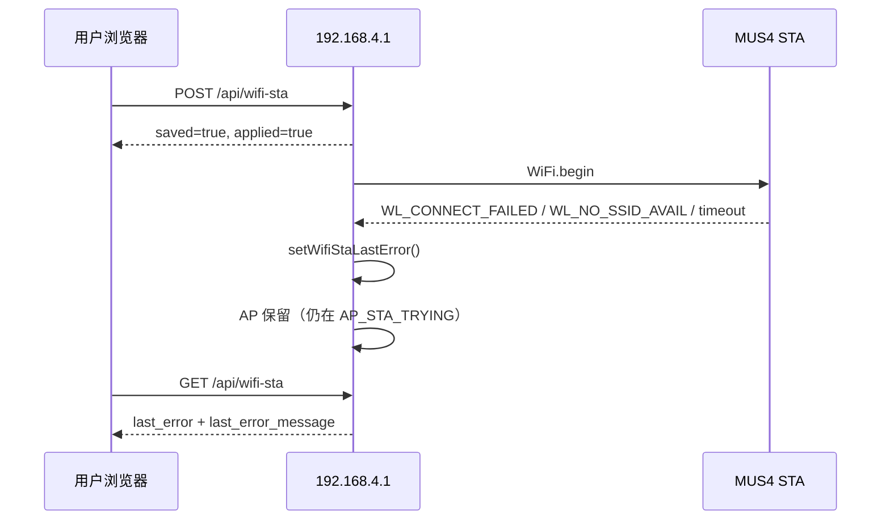
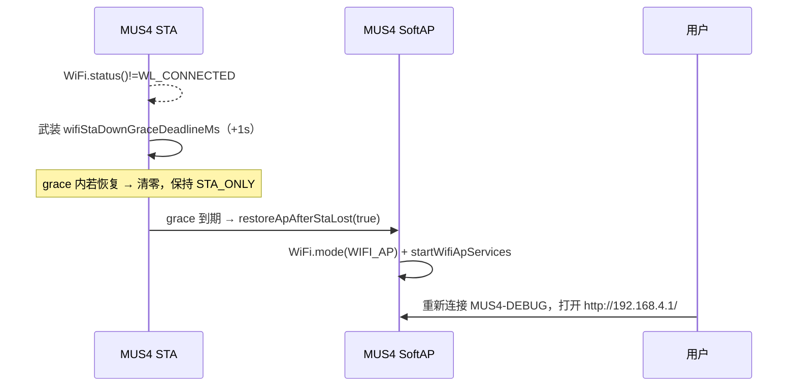

# Wi-Fi AP / STA 工作、交互与切换逻辑梳理（v1.7.18）

## 结论

当前固件的 Wi-Fi Console 采用 **AP / STA 互斥切换** 设计（v1.7.18 起，替代 v1.7.17 及以前的 `WIFI_AP_STA` 长期共存）：

- 设备启动默认进入 **AP-only**（`WIFI_AP`）。
- 检测到 STA 配置时短暂切到 `WIFI_AP_STA` 发起连接；STA 进入 `WL_CONNECTED` 后等待 `WIFI_STA_GRACE_UP_MS=1000ms`，再由 `stopWifiApForStaOnly()` 主动关 AP，落地 **STA-only**（`WIFI_STA`）。
- STA 脱离 `WL_CONNECTED` 后等待 `WIFI_STA_GRACE_DOWN_MS=1000ms`，由 `restoreApAfterStaLost(true)` 切回 `WIFI_AP`、起 AP 服务；grace 内链路恢复则取消重启。
- STA 正在尝试连接（未确认成功）期间 AP 保留，避免连接失败把用户踢出。
- AP 模式下不再后台轮询重连 STA，用户必须从 AP 页面手动重连或重新保存。

设计动因：实测 `WIFI_AP_STA` 长期共存稳定性差（共享 RF 资源与 ESP-IDF 内部调度冲突，引发 Web Console 卡顿、TCP Console 掉线、WebSocket 推送被抢占）。互斥切换牺牲"AP 永远兜底"换取常态运行的稳定。

相关主逻辑集中在 `libraries/mus4_wifi/src/WifiManager.cpp`。

## 角色划分

| 角色 | 当前行为 | 主要用途 |
| --- | --- | --- |
| SoftAP | 默认 SSID `MUS4-DEBUG`，IP 固定 `192.168.4.1`；仅在 AP-only / AP_STA_TRYING 状态可见 | 初次配网、STA 连接失败/断开后的恢复入口 |
| STA | 使用 Preferences 或编译期默认凭据连接外部 2.4G Wi-Fi | 让设备接入用户局域网，支持 Web Console / OTA / 遥测在局域网内访问 |
| Captive DNS | AP 开启时通配 DNS 到 SoftAP IP | 尽量触发系统 Captive Portal 弹窗 |
| Web Console | 端口 80 | 用户配置 AP/STA、查看状态、上传固件 |
| TCP Console | 端口 2323 | 无线命令入口 |
| WebSocket Telemetry | 端口 81 | Web 前端遥测数据推送 |

## 关键状态变量

| 变量 | 含义 |
| --- | --- |
| `wifiConsoleStarted` | AP、TCP Console、Web Console 是否已启动成功；STA-only 状态下置 false（AP 服务已关）。 |
| `wifiStaConfigured` | 是否存在有效 STA SSID 配置。 |
| `wifiStaConnecting` | STA 当前是否处于连接尝试中。 |
| `wifiStaConnected` | 固件认为 STA 当前已连接。 |
| `wifiStaTimedOut` | 最近一次 STA 连接是否超时。 |
| `wifiStaLastError` / `wifiStaLastErrorMessage` | 最近一次 STA 失败原因（如 `sta_lost`），供 API 与前端展示。 |
| `wifiStaApplyPending` | Web/API 保存配置后延时触发 `WiFi.begin()`。 |
| `wifiApRestartPending` | AP SSID 修改后延时重启 AP。 |
| `wifiStaUpGraceDeadlineMs` | v1.7.18 新增：STA 进入 WL_CONNECTED 后等待关 AP 的截止时间，0 表示未武装。 |
| `wifiStaDownGraceDeadlineMs` | v1.7.18 新增：STA 脱离 WL_CONNECTED 后等待起 AP 的截止时间，0 表示未武装。 |
| `wifiInApOnlyMode` | v1.7.18 新增：当前是否落在 `WIFI_AP`；用于 `applyWifiStaCredentials` 与 `updateWifiConsole` 决策。 |
| `wifiStaHandoffActive` | v1.7.18 起退役（永远为 false），保留是为了 JSON 兼容。 |

## 开机启动流程

`setupWifiConsole()` 是 Wi-Fi Console 的开机入口：



要点：
- 开机直接 `WiFi.mode(WIFI_AP)`（v1.7.17 及以前是 `WIFI_AP_STA`）。
- SoftAP 在 `WiFi.softAP()` 前调用 `configureWifiSoftApNetwork()`，显式固定为 `192.168.4.1/24`。
- 若已配置 STA，`applyWifiStaCredentials()` 会显式把模式切回 `WIFI_AP_STA` 再发起连接。
- 若 AP 启动失败，`updateWifiConsole()` 在 AP-only 状态下按 `WIFI_CONSOLE_RETRY_INTERVAL_MS` 周期重试；STA-only 状态下不再重试，避免破坏互斥语义。

## SoftAP 网络配置

由 `configureWifiSoftApNetwork()` 统一配置：

```cpp
IPAddress apIp(192, 168, 4, 1);
IPAddress subnet(255, 255, 255, 0);
WiFi.softAPConfig(apIp, apIp, subnet);
```

该函数由 `startWifiApServices()` 调用，覆盖所有需要真正启动或重建 SoftAP 的场景：
1. `setupWifiConsole()` 首次开机启动 AP。
2. `restartWifiAp()` AP SSID 修改后显式重建 AP。
3. `restoreApAfterStaLost(...)` STA 断开 grace 通过后回到 AP-only。

确保 AP 启动后浏览器始终通过 `http://192.168.4.1/` 接入。

## STA 配置保存与应用流程

### Web 前端入口

用户在 STA Modal 填 SSID/密码点击"连接"后，前端 `saveWifiSta()` 会：

1. 关闭扫描浮层。
2. 显示"正在连接"。
3. POST `/api/wifi-sta`，提交 `ssid`、`password` 或 `keep_password=1`，附带 `source=ap` 或 `source=sta`。
4. 成功后清理密码输入框状态。
5. 刷新 `/api/wifi-sta` 与 `/api/status`。
6. 等待 1 秒。
7. 进入 `waitWifiStaConnectionResult()` 轮询连接结果。

STA 成功后提示文案为 `STA 已连接，IP：<ip>，AP 将在 1 秒后关闭，请用新 IP 继续`（v1.7.18 起）。

### 后端 API 入口

`handleWifiWebStaSet()` 处理 `/api/wifi-sta`：

1. 要求 Web Console 已认证或处于 DEV 模式。
2. 校验 SSID/密码长度。
3. 写入 Preferences，更新运行时 `wifiStaSsid` / `wifiStaPassword`。
4. 立即返回 JSON `{"saved":true,"applied":true,"state":...}`。
5. 调用 `scheduleWifiStaApply()` 延时触发 `applyWifiStaCredentials()`。

`startWifiStaHandoff(ssid)` 仍会被调用，但在 v1.7.18 起已退化为 no-op，仅清残留 handoff 字段。

### 延时应用

`updateWifiSta()` 每轮检查：

```cpp
if (wifiStaApplyPending && (long)(millis() - wifiStaApplyDeadlineMs) >= 0) {
    applyWifiStaCredentials();
}
```

`applyWifiStaCredentials()` v1.7.18 后做的事：

1. 停 mDNS / NetBIOS / LLMNR。
2. 清 `staApplyPending`、`staConnected`、`staTimedOut`、两个 grace 锚点。
3. 设 `staConnecting=true`，记录 `staConnectStartMs`。
4. 若当前 `wifiInApOnlyMode` 为 true → `WiFi.mode(WIFI_AP_STA)`、`wifiInApOnlyMode = false`。
5. `disconnectWifiStaOnly()` → `WiFi.begin(...)`。

## STA 成功路径（STA-only 落地）

`updateWifiSta()` 检测到 `WL_CONNECTED` 且此前 `wifiStaConnected=false`：

1. 置 `wifiStaConnected = true`、清错误、清 timeout。
2. 启动 STA 侧 mDNS / NetBIOS / LLMNR。
3. `wifiWebServer.close()` + `begin()` 重新绑定 STA 接口（LwIP 不会自动把新接口加进 INADDR_ANY socket）。
4. 武装 `wifiStaUpGraceDeadlineMs = millis() + WIFI_STA_GRACE_UP_MS`。
5. `finishWifiStaHandoff()`（清空残留字段）。

下一轮 / 同一轮发现 grace 已到 → 调用 `stopWifiApForStaOnly()`：
1. 清 `wifiStaUpGraceDeadlineMs`。
2. `wifiCaptiveDnsServer.stop()`。
3. `WiFi.softAPdisconnect(true)`。
4. `WiFi.mode(WIFI_STA)`。
5. 置 `wifiConsoleStarted = false`、`wifiInApOnlyMode = false`。
6. 日志 `AP stopped after STA connected`。

落地后用户只能通过 STA IP（或 mDNS `<ap小写>.local`）访问 Web Console。

## STA 失败与超时路径

STA 连接失败由 `setWifiStaLastError()` 统一收敛：

| 条件 | 错误码 | 用户提示 |
| --- | --- | --- |
| `WL_NO_SSID_AVAIL` | `no_ssid` | 未找到目标 SSID，请检查网络名称或距离。 |
| `WL_CONNECT_FAILED` | `auth_failed` | STA 认证失败，请检查 Wi-Fi 密码。 |
| 超过 `WIFI_STA_CONNECT_TIMEOUT_MS` | `timeout` | STA 连接超时，请检查 SSID、密码与路由器信号。 |
| STA 断线 grace 通过 | `sta_lost` | STA 连接已断开，已切回 AP 模式。 |

STA 失败不会关闭 AP（AP 仍在 AP_STA_TRYING 期间存在）。`setWifiStaLastError()` 会保留本轮首个失败原因，新一轮 `applyWifiStaCredentials()` 会先清空旧错误。

## STA 断开后的 AP 恢复

`updateWifiSta()` 检测到曾 `wifiStaConnected=true` 但 `WiFi.status()` 不再是 `WL_CONNECTED`：

1. 第一次进入分支 → `wifiStaDownGraceDeadlineMs = millis() + WIFI_STA_GRACE_DOWN_MS`，日志 `STA link lost, arming down grace`；保留 mDNS、不切模式。
2. 若 grace 窗口内再次出现 `WL_CONNECTED` → 清零 down grace，保持 STA_ONLY，日志 `STA recovered within grace window`。
3. 否则 grace 到期 → 调用 `restoreApAfterStaLost(true)`：
   - 清 down grace、置 `staConnected=false`、`staConnecting=false`。
   - 写入 `sta_lost` 错误。
   - 停 mDNS / NetBIOS / LLMNR。
   - `esp_wifi_disconnect()` → `WiFi.mode(WIFI_AP)` → `startWifiApServices(...)`。
   - 置 `wifiInApOnlyMode = true`。
   - 日志 `AP restored after STA lost`。

AP-only 落地后**不再自动重新发起 STA 连接**——用户须从 AP 页面手动重连或重新保存。

## STA→STA 切换流程

v1.7.18 起旧的 `wifiStaHandoff*` 三态共存逻辑退役。新的 STA→STA 切换走统一链路：

1. 用户在 STA 页面保存新 SSID。
2. `handleWifiWebStaSet()` 写 Preferences、调 `scheduleWifiStaApply()`。
3. `updateWifiSta()` 延时触发 `applyWifiStaCredentials()`。
4. 因当前在 STA-only（`wifiInApOnlyMode = false`），`applyWifiStaCredentials()` 直接 `disconnectWifiStaOnly()` + 用新 SSID `WiFi.begin(...)`，进入新一轮 AP_STA_TRYING（注意：当前还在 `WIFI_STA` 模式，但 `WiFi.begin` 仍可发起新连接；如果连接失败 down grace 触发后会拉起 AP）。
5. 新 STA 成功 → 武装 up grace → 1s 后再切到 STA-only（新 SSID）。

由于浏览器一定会随旧 STA 断开，前端 STA 页面会丢失，但 `restoreApAfterStaLost` 在新 STA 失败时会兜底拉起 AP，用户可重新打开 `http://192.168.4.1/`。

## WIFI_STA_CLEAR 路径

`WIFI_STA_CLEAR` / `/api/wifi-sta/clear` 调用 `clearWifiStaPreference()` → `clearWifiStaRuntimeStateWithoutDisconnect()`，清掉 SSID / 密码 / `staConfigured` 等字段。`updateWifiSta()` 下一轮检测到 `!wifiStaConfigured`：

- 若 `wifiInApOnlyMode = false`（设备此时还在 STA_ONLY）→ 调用 `restoreApAfterStaLost(false)` 切回 AP，但**不写入** `sta_lost` 错误。
- 若已经在 AP-only → 直接 return。

## Captive Portal 交互逻辑

AP 开启后，固件启动：

```cpp
wifiCaptiveDnsServer.start(53, "*", WiFi.softAPIP());
```

把经由 MUS4 AP 的 DNS 查询尽量解析到 `192.168.4.1`。WebServer 注册的探测路径与 v1.7.17 一致，详见源码（`libraries/mus4_web/src/WebConsoleServer.cpp`）。STA-only 状态下 `wifiConsoleStarted = false`，captive DNS / TCP Console 自然停止处理，避免无效流量。

## mDNS

mDNS 跟随 STA：

1. `applyWifiStaCredentials()` 开始新一轮 STA 连接前停旧 mDNS。
2. `updateWifiSta()` 首次检测到 STA connected → `startWifiMdnsIfNeeded()`。
3. STA 断开 grace 通过 → `restoreApAfterStaLost()` 内停 mDNS。
4. STA-only 状态下保留 mDNS，可通过 `http://<AP名称小写>.local/` 访问 Web Console。

## API 字段

### `/api/status`

由 `printWirelessStatus()` 生成，包含 `ap_ssid`、`ap_ip`、`ap_clients`、`sta_configured`、`sta_connected`、`sta_ssid`、`sta_ip`、`mdns_host`、`mdns_url`、`mdns_started`、OTA / WebSocket / HTTP handler 统计等。

注意：STA-only 状态下 `WiFi.softAPIP()` 返回 `0.0.0.0`、`WiFi.softAPSSID()` 为空，对应 `ap_ip` / `ap_ssid` 字段为空或零。

### `/api/wifi-sta`

返回 JSON，核心字段：

```json
{
  "configured": true,
  "connected": true,
  "timed_out": false,
  "connecting": false,
  "last_error": "",
  "last_error_message": "",
  "ssid": "example",
  "password_set": true,
  "password_len": 8,
  "ap_ip": "192.168.4.1",
  "sta_ip": "192.168.3.144",
  "mdns_host": "mus4-debug",
  "mdns_url": "http://mus4-debug.local/",
  "mdns_started": true,
  "handoff_active": false,
  "handoff_target_ssid": "",
  "handoff_sta_ip": "0.0.0.0",
  "handoff_ap_ssid": "MUS4-DEBUG",
  "handoff_ap_url": "http://192.168.4.1/",
  "handoff_mdns_url": "http://mus4-debug.local/"
}
```

v1.7.18 起 `handoff_active` 永远为 `false`、`handoff_target_ssid` / `handoff_sta_ip` 永远为空字符串或 `0.0.0.0`；保留这些字段是为前端解析兼容。

## 时序图

### 1. 开机已有 STA 配置且连接成功



### 2. Web 页面配置 STA 成功



### 3. STA 连接失败



### 4. STA 运行中断开



## 排查清单

### AP 可见但打不开 `192.168.4.1`

1. 确认 `setupWifiConsole()` / `restartWifiAp()` / `restoreApAfterStaLost()` 是否执行到了 `wifiWebServer.begin()`。
2. SoftAP 是否仍固定为 `192.168.4.1/24`。
3. 客户端是否拿到 `192.168.4.x` 地址。
4. 浏览器是否仍在访问旧 STA IP 或 HTTPS 缓存。
5. 串口日志是否出现 `AP started` / `AP restored after STA lost` / `AP restarted`。

### STA 已连接但前端 `192.168.4.1` 也打不开

预期行为——STA-only 状态下 AP 已主动关闭。请用 `sta_ip` 或 `<AP名称小写>.local` 访问。

### STA 失败但 AP 不可访问

1. 确认是否已超过 STA grace 窗口（应仍在 AP_STA_TRYING，AP 仍在）。
2. 确认 `wifiConsoleStarted` 是否为 true；若为 false，等待 `WIFI_CONSOLE_RETRY_INTERVAL_MS` 后自动重启 console。

### STA 链路抖动频繁触发 AP 重启

调高 `WIFI_STA_GRACE_DOWN_MS`（建议 2000ms）。

## 当前设计边界

1. STA-only 状态下 AP 不可见；用户不在同一 STA 网段则无法访问 Web Console。需要在保存 STA 时记下 STA IP / mDNS 地址。
2. AP-only 状态下不再后台轮询重连 STA；用户必须主动触发。
3. STA→STA 切换不再有 AP 兜底页面：浏览器随旧 STA 断开后，需要等新 STA 成功（前端跳转）或新 STA 失败 grace 触发后才能回到 AP。
4. Captive Portal 仍尽量提高 `192.168.4.1` 弹窗概率，不能保证所有平台/多网卡场景。
5. AP 最大客户端数当前为 1，调试时应避免多个设备同时抢占 AP。

## 维护建议

1. 修改 AP/STA 生命周期时，同步更新 `tests/test_firmware_feature_flags.py` 的源码断言。
2. 修改无线权限策略时，同步更新 `wireless_console_policy.py` 与 `tests/test_wireless_console_policy.py`。
3. 修改 Captive Portal 路径时，保持 `/api/` 未知路径返回 JSON 404，避免 API 调试被 HTML 重定向吞掉。
4. 修改 grace 常量时，同步更新 `WIFI_STA_GRACE_UP_MS` / `WIFI_STA_GRACE_DOWN_MS` 与本文档。
5. 修改 HTTP OTA 或 Web Console 安全门控时，必须保留认证和 Park Locked / DEV 模式约束。
