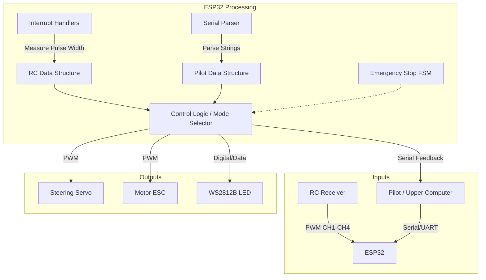
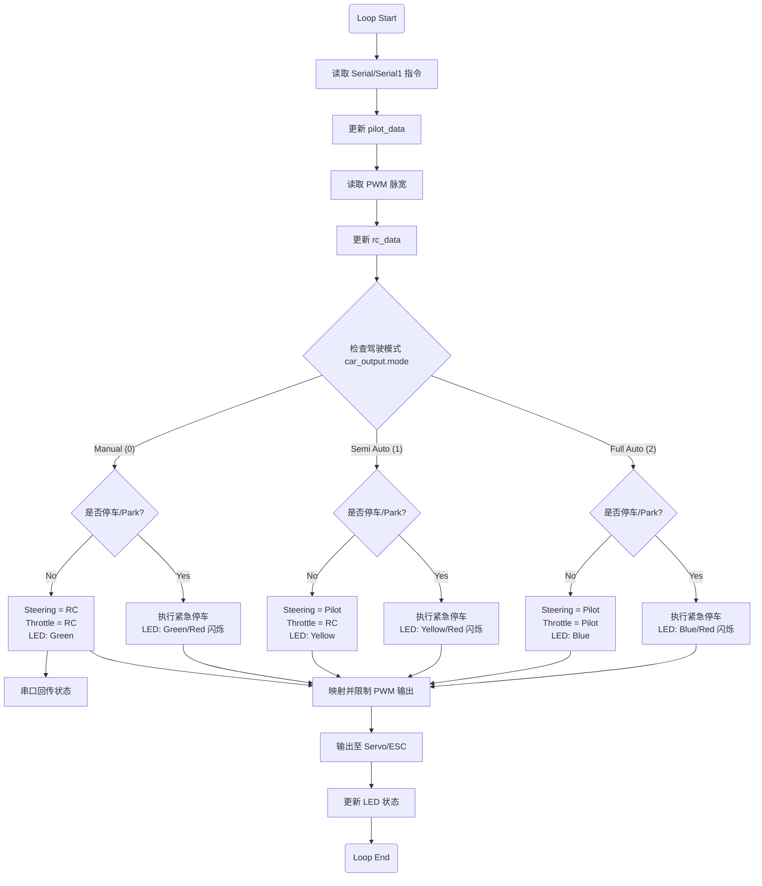

# MUS4 程序架构文档

本文档详细说明 `mus4.ino` 程序的运行逻辑、系统架构及关键模块。

## 1. 系统概览

`mus4.ino` 是基于 ESP32 的自动驾驶小车底层控制程序。它主要负责：
1.  **信号采集**：接收 RC 遥控器的 PWM 信号和上位机（Pilot）的串口指令。
2.  **控制决策**：根据当前驾驶模式（手动/半自动/自动）融合控制信号。
3.  **执行输出**：控制舵机（转向）和电调（油门），并驱动 LED 显示系统状态。
4.  **安全机制**：包含紧急停车（Emergency Stop）状态机。

## 2. 系统架构

下图展示了系统的硬件抽象及数据流向：



## 3. 核心数据结构

程序定义了 `struct_message` 结构体用于统一管理控制数据：

```cpp
struct struct_message {
    int throttle; // 油门值 (-100 ~ 100)
    int steering; // 转向值 (-100 ~ 100)
    int mode;     // 驾驶模式
    bool park;    // 停车标志
};
```

主要实例包括：
*   `rc_data`: 存储来自 RC 接收机的处理后数据。
*   `pilot_data`: 存储来自上位机的指令。
*   `car_output`: 最终计算出的输出控制量。

## 4. 运行逻辑

主循环 `loop()` 是程序的核心，其处理流程如下：

### 4.1 逻辑流程图



### 4.2 驾驶模式说明

| 模式 ID | 宏定义 | 名称 | 说明 | 控制权分配 | LED 颜色 |
| :--- | :--- | :--- | :--- | :--- | :--- |
| 0 | `CAR_MODE_MANUAL` | 手动模式 | 完全由遥控器控制 | 转向: RC, 油门: RC | 绿色 (Green) |
| 1 | `CAR_MODE_SEMI_AUTO` | 半自动模式 | 自动转向，人工控制油门 | 转向: Pilot, 油门: RC | 黄色 (Yellow) |
| 2 | `CAR_MODE_FULL_AUTO` | 自动驾驶模式 | 完全由上位机控制 | 转向: Pilot, 油门: Pilot | 蓝色 (Blue) |

*注意：当前版本代码中，模式切换逻辑（`mode_change`）被注释屏蔽，默认维持在手动模式或初始化状态，需通过修改代码或特定指令激活其他模式。*

## 5. 紧急停车机制 (Emergency Stop)

当触发停车信号（`park == 1`）时，系统进入紧急停车状态机。

### 5.1 状态机逻辑

```mermaid
stateDiagram-v2
    [*] --> EST_IDLE
    
    EST_IDLE --> EST_READY : 触发停车且当前有油门
    EST_IDLE --> EST_DONE : 触发停车且当前无油门
    
    state EST_READY {
        [*] --> WaitReady
        WaitReady --> SetBrake : 经过 500ms
        note right of WaitReady : 缓冲期，油门设为 15
    }

    EST_READY --> EST_BRAKING : 准备完成
    
    state EST_BRAKING {
        [*] --> Braking
        Braking --> BrakeDone : 经过 1500ms
        note right of Braking : 全力刹车，油门设为 -100
    }

    EST_BRAKING --> EST_DONE : 刹车完成
    
    state EST_DONE {
        note right of EST_DONE : 停车完成，油门归零
    }
    
    EST_DONE --> EST_IDLE : 解除停车信号
```

## 6. 信号输入与中断

*   **PWM 输入**：使用 ESP32 的 `attachInterrupt` 监听 4 个通道的引脚电平变化。
    *   上升沿记录时间戳 `rise_time`。
    *   下降沿计算脉宽 `pwm_value = micros() - rise_time`。
*   **串口输入**：
    *   `Serial` (USB) 和 `Serial1` (RS232) 均监听格式为 `Throttle:Steering\n` 的字符串（例如 `10:20\n`）。
    *   解析后更新 `pilot_data`。

## 7. 输出映射

*   **PWM 生成**：计算出的 `car_output` (-100 ~ 100) 被映射到舵机和电调的脉宽范围。
    *   **Steering**: `SERVO_MID` ± `SERVO_RANGE`
    *   **Throttle**: `MOTOR_MID` ± `MOTOR_RANGE`
*   使用 `ledc` 库生成 PWM 信号。

